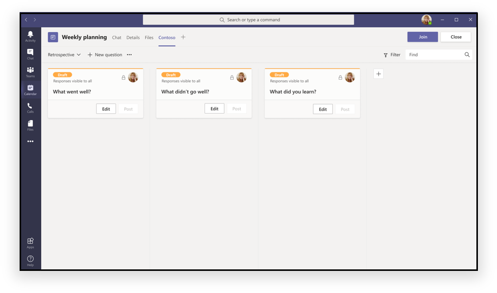
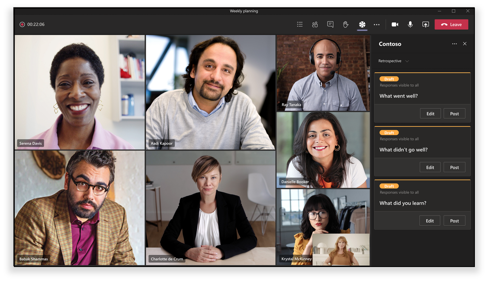
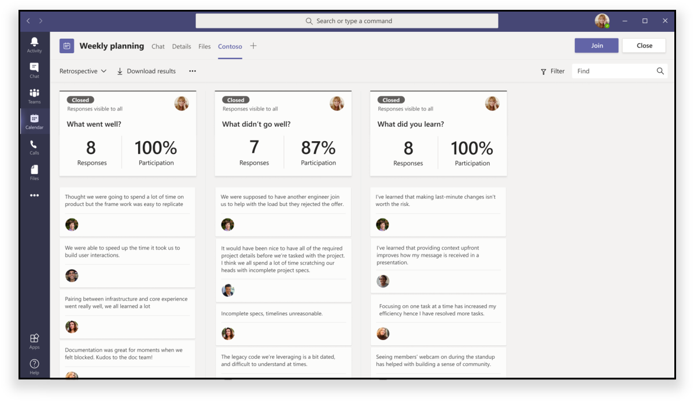

# Extensibilidad de la aplicación para reunionesMeeting app extensibility

Teams extensibilidad de la aplicación de reunión se basa en los siguientes conceptos:Teams’ meeting app extensibility is based on the following concepts:

* El ciclo de vida de la reunión tiene diferentes fases, como antes de la reunión, en la reunión y después de la reunión.Meeting lifecycle has different stages such as pre-meeting, in-meeting, and post-meeting.  
* Hay tres roles de participante distintos en una reunión: organizador, moderador y asistente.There are three distinct participant roles in a meeting: organizer, presenter, and attendee. Para obtener más información, vea [roles in a Teams meeting](https://support.microsoft.com/office/roles-in-a-teams-meeting-c16fa7d0-1666-4dde-8686-0a0bfe16e019).For more information, see [roles in a Teams meeting](https://support.microsoft.com/office/roles-in-a-teams-meeting-c16fa7d0-1666-4dde-8686-0a0bfe16e019).  
* Hay varios tipos [de usuario](/microsoftteams/non-standard-users#:~:text=An%20anonymous%20user%20is%20a,their%20Microsoft%20or%20organization's%20account.) en una reunión: usuarios anónimos, invitados, invitados y federados. There are various [user types](/microsoftteams/non-standard-users#:~:text=An%20anonymous%20user%20is%20a,their%20Microsoft%20or%20organization's%20account.) in a meeting: in-tenant, [guest](/microsoftteams/guest-access), [federated](/microsoftteams/manage-external-access), and anonymous users.

En este artículo se describe información sobre el ciclo de vida de la reunión y cómo integrar pestañas, bots y extensiones de mensajería en la reunión.This article covers information about meeting lifecycle and how to integrate tabs, bots, and messaging extensions in the meeting. Proporciona información para identificar diferentes roles de participante y diferentes tipos de usuario para realizar tareas.It provides information to identify different participant roles and different user types to perform tasks.

## Ciclo de vida de la reuniónMeeting lifecycle

El ciclo de vida de la reunión consiste en la experiencia de la aplicación previa a la reunión, en la reunión y posterior a la reunión.Meeting lifecycle consists of pre-meeting, in-meeting, and post-meeting app experience. Puede integrar pestañas, bots y extensiones de mensajería en cada fase del ciclo de vida de la reunión.You can integrate tabs, bots, and messaging extensions in each stage of the meeting lifecycle.

### Integrar pestañas en el ciclo de vida de la reuniónIntegrate tabs into the meeting lifecycle

Las pestañas permiten a los miembros del equipo tener acceso a servicios y contenido en un espacio específico dentro de una reunión.Tabs allow team members to access services and content in a specific space within a meeting. El equipo trabaja directamente con pestañas y tiene conversaciones sobre las herramientas y los datos disponibles en las pestañas.The team works directly with tabs and has conversations about the tools and data available within tabs. En Teams reunión, los usuarios pueden agregar una pestaña seleccionandoIn Teams meeting, users can add a tab by selecting , y elegir la aplicación que quieren instalar., and choosing the app that they want to install.

> [!IMPORTANT]
> Si has integrado una pestaña con la reunión Teams, la aplicación debe seguir el flujo de autenticación de inicio de sesión único (SSO) para las [pestañas.](../tabs/how-to/authentication/auth-aad-sso.md)If you have integrated a tab with your meeting, then your app must follow the Teams [single sign-on (SSO) authentication flow for tabs](../tabs/how-to/authentication/auth-aad-sso.md).

> [!NOTE]
> * Los clientes móviles solo admiten pestañas en fases de reunión previas y posteriores.Mobile clients support tabs only in pre and post meeting stages. Las experiencias en la reunión que son el cuadro de diálogo y el panel en la reunión actualmente no están disponibles en dispositivos móviles.The in-meeting experiences that is in-meeting dialog and panel are currently not available on mobile.
> * Las aplicaciones solo se admiten en reuniones privadas programadas.Apps are supported only in private scheduled meetings.

#### Experiencia de la aplicación previa a la reuniónPre-meeting app experience

Con la experiencia de la aplicación previa a la reunión, puedes buscar y agregar aplicaciones de reunión y realizar tareas previas a la reunión, como desarrollar un sondeo para encuestar a los participantes de la reunión.With the pre-meeting app experience, you can find and add meeting apps and perform pre-meeting tasks, such as developing a poll to survey meeting participants.

**Para agregar pestañas a una reunión existente****To add tabs to an existing meeting**

1. En el calendario, seleccione una reunión a la que desee agregar una pestaña.In your calendar, select a meeting to which you want to add a tab.
1. Seleccione la **pestaña Detalles** y seleccioneSelect the **Details** tab and select .. Aparece la galería de pestañas.The tab gallery appears.

    

1. En la galería de pestañas, selecciona la aplicación que quieras agregar y sigue los pasos según sea necesario.In the tab gallery, select the app that you want to add and follow the steps as required. La aplicación se instala como una pestaña.The app is installed as a tab.

    

    > [!NOTE]
    > * También puede agregar una pestaña mediante la **pestaña Chat de** reunión en una reunión existente.You can also add a tab using the meeting **Chat** tab in an existing meeting.
    > * El diseño de tabulación debe estar en un estado organizado, si hay más de diez sondeos o encuestas.Tab layout must be in an organized state, if there are more than ten polls or surveys.

#### Experiencia de la aplicación en la reuniónIn-meeting app experience

Con la experiencia de la aplicación en la reunión, puedes interactuar con los participantes durante la reunión mediante aplicaciones y el cuadro de diálogo en la reunión.With the in-meeting app experience, you can engage participants during the meeting by using apps and the in-meeting dialog box. Las aplicaciones de reunión se hospedan en la barra superior superior de la ventana de reunión como pestaña en la reunión. Use el cuadro de diálogo en la reunión para mostrar el contenido que se puede usar para los participantes de la reunión.Meeting apps are hosted in the top upper bar of the meeting window as an in-meeting tab. Use the in-meeting dialog box to showcase actionable content for meeting participants. Para obtener más información, consulta [Crear aplicaciones para Teams reuniones.](create-apps-for-teams-meetings.md)For more information, see [create apps for Teams meetings](create-apps-for-teams-meetings.md).

**Para usar pestañas durante una reunión****To use tabs during a meeting**

1. Después de entrar en la reunión, en la barra superior de la ventana de chat, selecciona la aplicación que quieras usar.After entering the meeting, from the top upper bar of the chat window, select the app you want to use. Una aplicación está visible en una reunión Teams en el panel lateral o en el cuadro de diálogo en la reunión.An app is visible in a Teams meeting in the side panel or the in-meeting dialog box.
1. En el cuadro de diálogo en la reunión, escriba la respuesta como comentarios.In the in-meeting dialog box, enter your response as a feedback.

    

    > [!NOTE]
    > * Las aplicaciones pueden aprovechar Teams SDK de cliente para obtener acceso a , y representar `meetingId` `userMri` la experiencia `frameContext` correctamente.Apps can leverage the Teams Client SDK to access the `meetingId`, `userMri`, and `frameContext` to render the experience appropriately.
    > * Si el cuadro de diálogo en la reunión se representa correctamente, se le notificará que los resultados se descargaron correctamente.If the in-meeting dialog box is rendered successfully, you are notified that the results successfully downloaded.
    > * El manifiesto de la aplicación especifica los lugares donde quieres que aparezcan.Your app manifest specifies the places where you want them to appear. El campo de contexto se usa para este propósito.The context field is used for this purpose. También puede formar parte de una experiencia de bandeja de uso compartido, sujeto a las directrices de diseño especificadas.It can also be part of a share-tray experience, subject to specified design guidelines.

    En la siguiente imagen se muestra el panel lateral de la reunión:The following image illustrates the in-meeting side panel:

    

#### Experiencia de aplicación posterior a la reuniónPost-meeting app experience

Con la experiencia de la aplicación posterior a la reunión, puedes ver los resultados de la reunión, como los resultados de la encuesta o los comentarios.With post-meeting app experience, you can view the results of the meeting such as poll survey results or feedback. SelectSelect  para agregar una pestaña y obtener notas y resultados de la reunión en los que los organizadores y asistentes deben tomar medidas.to add a tab and get meeting notes and results on which organizers and attendees must take action.

En la siguiente imagen se muestra la **pestaña Contoso** con los resultados del sondeo y los comentarios recibidos de los asistentes a la reunión:The following image displays the **Contoso** tab with results of poll and feedback received from meeting attendees:

> [!NOTE]
> El diseño de tabulación debe organizarse cuando haya más de diez sondeos o encuestas.Tab layout must be organized when there are more than ten polls or surveys.

### Integrar bots en el ciclo de vida de la reuniónIntegrate bots into the meeting lifecycle

Los bots habilitados en el ámbito groupchat empiezan a funcionar en reuniones.Bots enabled in groupchat scope start functioning in meetings. Para implementar bots, comience con [la compilación de un bot](../build-your-first-app/build-bot.md) y, a continuación, continúe con crear aplicaciones para Teams [reuniones](../apps-in-teams-meetings/create-apps-for-teams-meetings.md#meeting-apps-api-references).To implement bots, start with [build a bot](../build-your-first-app/build-bot.md) and then continue with [create apps for Teams meetings](../apps-in-teams-meetings/create-apps-for-teams-meetings.md#meeting-apps-api-references).

### Integrar extensiones de mensajería en el ciclo de vida de la reuniónIntegrate messaging extensions into the meeting lifecycle

Para implementar extensiones de mensajería, comience con la compilación de una extensión [de mensajería](../messaging-extensions/how-to/create-messaging-extension.md) y, a continuación, continúe con crear aplicaciones para Teams [reuniones](../apps-in-teams-meetings/create-apps-for-teams-meetings.md#meeting-apps-api-references).To implement messaging extensions, start with [build a messaging extension](../messaging-extensions/how-to/create-messaging-extension.md) and then continue with [create apps for Teams meetings](../apps-in-teams-meetings/create-apps-for-teams-meetings.md#meeting-apps-api-references).

La extensibilidad Teams aplicación de reunión te permite diseñar la aplicación en función de los roles de los participantes en una reunión.The Teams meeting app extensibility allows you to design your app based on participant roles in a meeting.

## Roles de participante en una reuniónParticipant roles in a meeting

La configuración predeterminada de los participantes la determina el administrador de TI de una organización.Default participant settings are determined by an organization's IT administrator. Los siguientes son los roles de participante en una reunión:The following are the participant roles in a meeting:

* **Organizador:** el organizador programa una reunión, establece las opciones de reunión, asigna roles de reunión e inicia la reunión.**Organizer**: The organizer schedules a meeting, sets the meeting options, assigns meeting roles, and starts the meeting. Solo los usuarios con cuenta M365 y Teams licencia pueden ser organizadores y controlar los permisos de los asistentes.Only users with M365 account and Teams license can be organizers, and control attendee permissions. Un organizador de la reunión puede cambiar la configuración de una reunión específica.A meeting organizer can change the settings for a specific meeting. Los organizadores pueden realizar estos cambios en la página web **Opciones de** reunión.Organizers can make these changes on the **Meeting options** web page.
* **Moderador:** los moderadores tienen las mismas capacidades de organizadores con exclusiones.**Presenter**: Presenters have same capabilities of organizers with exclusions. Un moderador no puede quitar un organizador de la sesión ni modificar las opciones de reunión para la sesión.A presenter cannot remove an organizer from the session or modify meeting options for the session. De forma predeterminada, los participantes que se unen a una reunión tienen el rol de moderador.By default, participants joining a meeting have the presenter role.
* **Asistente:** un asistente es un usuario al que se ha invitado a asistir a una reunión pero no está autorizado a actuar como moderador.**Attendee**: An attendee is a user who has been invited to attend a meeting but is not authorized to act as a presenter. Los asistentes pueden interactuar con otros miembros de la reunión, pero no pueden administrar la configuración de la reunión ni compartir contenido.Attendees can interact with other meeting members but cannot manage any of the meeting settings or share content.

> [!NOTE]
> Solo un organizador o moderador puede agregar, quitar o desinstalar aplicaciones.Only an organizer or presenter can add, remove, or uninstall apps.

Para obtener más información, vea [roles in a Teams meeting](https://support.microsoft.com/office/roles-in-a-teams-meeting-c16fa7d0-1666-4dde-8686-0a0bfe16e019).For more information, see [roles in a Teams meeting](https://support.microsoft.com/office/roles-in-a-teams-meeting-c16fa7d0-1666-4dde-8686-0a0bfe16e019).

Después de diseñar la aplicación en función de los roles de los participantes en una reunión, puedes identificar cada tipo de usuario para las reuniones y seleccionar a qué pueden tener acceso.After you design your app based on participant roles in a meeting, you can identify each user type for meetings and select what they can access.

## Tipos de usuario en una reuniónUser types in a meeting

> [!NOTE]
> El tipo de usuario no se incluye en la API **getParticipantRole.**The user type is not included in the **getParticipantRole** API.

Los tipos de usuario, como, organizador, moderador o asistente en una reunión pueden realizar uno de los roles de participante [en una reunión](#participant-roles-in-a-meeting).User types, such as, organizer, presenter, or attendee in a meeting can perform one of the [participant roles in a meeting](#participant-roles-in-a-meeting).

En la siguiente lista se detallan los distintos tipos de usuario junto con su accesibilidad y rendimiento:The following list details the different user types along with their accessibility and performance:

* **In-tenant:** los usuarios del espacio empresarial pertenecen a la organización y tienen credenciales en Azure Active Directory (AAD) para el inquilino.**In-tenant**: In-tenant users belong to the organization and have credentials in Azure Active Directory (AAD) for the tenant. Normalmente son empleados a tiempo completo, in situ o remotos.They are usually full-time, onsite, or remote employees. Un usuario en el espacio empresarial puede ser organizador, moderador o asistente.An in-tenant user can be an organizer, presenter, or attendee.
* **Invitado:** un invitado es un participante de otra organización invitado a acceder a Teams u otros recursos en el espacio empresarial de la organización.**Guest**: A guest is a participant from another organization invited to access Teams or other resources in the organization's tenant. Los invitados se agregan al AAD de la organización y tienen las mismas Teams que un miembro nativo del equipo con acceso a chats de equipo, reuniones y archivos.Guests are added to the organization’s AAD and have same Teams capabilities as a native team member with access to team chats, meetings, and files. Un usuario invitado puede ser organizador, moderador o asistente.A guest user can be an organizer, presenter, or attendee. Para obtener más información, vea [acceso de invitado en Teams](/microsoftteams/guest-access).For more information, see [guest access in Teams](/microsoftteams/guest-access).
* **Federado o externo:** un usuario federado es un usuario Teams externo de otra organización al que se ha invitado a unirse a una reunión.**Federated or external**: A federated user is an external Teams user in another organization who has been invited to join a meeting. Los usuarios federados tienen credenciales válidas con socios federados y están autorizados por Teams.Federated users have valid credentials with federated partners and are authorized by Teams. No tienen acceso a los equipos ni a otros recursos compartidos de la organización.They do not have access to your teams or other shared resources from your organization. El acceso de invitado es una mejor opción para que los usuarios externos tengan acceso a equipos y canales.Guest access is a better option for external users to have access to teams and channels. Para obtener más información, vea [manage external access in Teams](/microsoftteams/manage-external-access).For more information, see [manage external access in Teams](/microsoftteams/manage-external-access).

    > [!NOTE]
    > Los Teams pueden agregar aplicaciones cuando hospedan reuniones o chats con otras organizaciones.Your Teams users can add apps when they host meetings or chats with other organizations. Los usuarios pueden usar aplicaciones compartidas por usuarios externos cuando los usuarios se unen a reuniones o chats hospedados por otras organizaciones.The users can use apps shared by external users when your users join meetings or chats hosted by other organizations. Las directivas de datos de la organización del usuario de hospedaje, así como las prácticas de uso compartido de datos de las aplicaciones de terceros compartidas por la organización de ese usuario, estarán en vigor.The data policies of the hosting user's organization, as well as the data sharing practices of the third-party apps shared by that user's organization, will be in effect.

* **Anónimo:** los usuarios anónimos no tienen una identidad de AAD y no están federados con un inquilino.**Anonymous**: Anonymous users do not have an AAD identity and are not federated with a tenant. Los participantes anónimos son como usuarios externos, pero su identidad no se proyecta en la reunión.The anonymous participants are like external users, but their identity is not projected in the meeting. Los usuarios anónimos no pueden acceder a aplicaciones en una ventana de reunión.Anonymous users are not able to access apps in a meeting window. Un usuario anónimo no puede ser un organizador, pero puede ser moderador o asistente.An anonymous user cannot be an organizer but can be a presenter or attendee.

    > [!NOTE]
    > Los usuarios anónimos heredan la directiva de permisos de aplicación predeterminada global.Anonymous users inherit the global default user-level app permission policy. Para obtener más información, consulta [administrar aplicaciones](/microsoftteams/non-standard-users#anonymous-user-in-meetings-access).For more information, see [manage Apps](/microsoftteams/non-standard-users#anonymous-user-in-meetings-access).

Un usuario invitado o anónimo no puede agregar, quitar ni desinstalar aplicaciones.A guest or anonymous user cannot add, remove, or uninstall apps.

En la tabla siguiente se proporcionan los tipos de usuario y las características a las que puede tener acceso cada usuario:The following table provides the user types and what features each user can access:

| Tipo de usuarioUser type | PestañasTabs | BotsBots | Extensiones de mensajeríaMessaging extensions | Tarjetas adaptablesAdaptive Cards | Módulos de tareasTask modules | Diálogo en la reuniónIn-meeting dialog |
| :-- | :-- | :-- | :-- | :-- | :-- | :-- |
| Usuario anónimoAnonymous user | No disponibleNot available | No disponibleNot available | No disponibleNot available | Se permiten interacciones en el chat de reunión.Interactions in the meeting chat are allowed. | Se permiten interacciones en el chat de reunión desde una tarjeta adaptable.Interactions in the meeting chat from an Adaptive Card are allowed. | No disponibleNot available |
| Invitado que forma parte del inquilino AADGuest that is part of the tenant AAD | Se permite la interacción.Interaction is allowed. No se permite crear, actualizar ni eliminar.Creating, updating, and deleting are not allowed. | No disponibleNot available | No disponibleNot available | Se permiten interacciones en el chat de reunión.Interactions in the meeting chat are allowed. | Se permiten interacciones en el chat de reunión desde una tarjeta adaptable.Interactions in the meeting chat from an Adaptive Card are allowed. | DisponibleAvailable |
| Usuario federado.Federated user. Para obtener más información, vea [usuarios no estándar](/microsoftteams/non-standard-users).For more information, see [non-standard users](/microsoftteams/non-standard-users). | Se permite la interacción.Interaction is allowed. No se permite crear, actualizar ni eliminar.Creating, updating, and deleting are not allowed. | Se permite la interacción.Interaction is allowed. No se permite la adquisición, actualización y eliminación.Acquiring, updating, and deleting are not allowed. | No disponibleNot available | Se permiten interacciones en el chat de reunión.Interactions in the meeting chat are allowed. | Se permiten interacciones en el chat de reunión desde una tarjeta adaptable.Interactions in the meeting chat from an Adaptive Card are allowed. | No disponibleNot available |

## Consulte tambiénSee also

* [TabTab](../tabs/what-are-tabs.md#understand-how-tabs-work)
* [BotBot](../bots/what-are-bots.md)
* [Extensión de mensajeríaMessaging extension](../messaging-extensions/what-are-messaging-extensions.md)
* [Diseño de la aplicaciónDesign your app](../apps-in-teams-meetings/design/designing-apps-in-meetings.md)

## Paso siguienteNext step

> [!div class="nextstepaction"]
> [Requisitos previos y referencias de API para las aplicaciones en las reuniones de TeamsPrerequisites and API references for apps in Teams meetings](create-apps-for-teams-meetings.md)