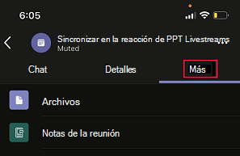
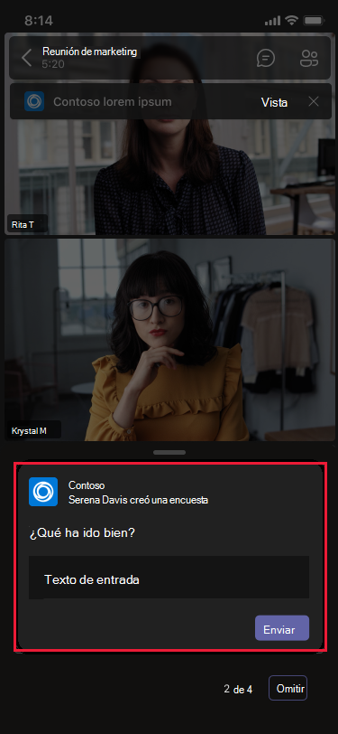
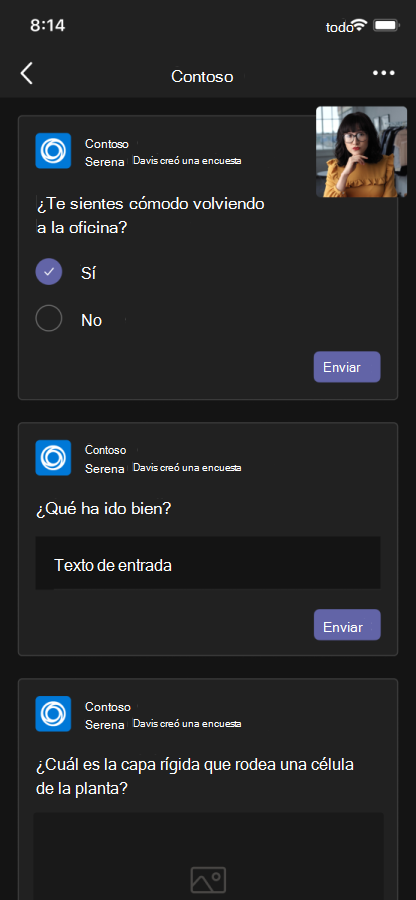
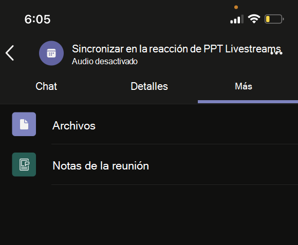

# Aplicaciones de reuniones unificadas

Teams de reuniones unificadas se basan en los siguientes conceptos:

* El ciclo de vida de la reunión tiene diferentes fases: antes de la reunión, en la reunión y después de la reunión.  
* Hay tres roles de participante distintos en una reunión: organizador, moderador y asistente. Para obtener más información, vea [roles in a Teams meeting](https://support.microsoft.com/office/roles-in-a-teams-meeting-c16fa7d0-1666-4dde-8686-0a0bfe16e019).  
* Hay varios tipos [de usuario](/microsoftteams/non-standard-users#:~:text=An%20anonymous%20user%20is%20a,their%20Microsoft%20or%20organization's%20account.) en una reunión: usuarios anónimos, invitados, invitados y federados. 

> [!VIDEO https://www.youtube-nocookie.com/embed/rrNpFJbxqrg]

En este artículo se describe la información sobre el ciclo de vida de la reunión y cómo integrar pestañas, bots y extensiones de mensajería. Identifica diferentes roles de participante y tipos de usuario.

## Ciclo de vida de la reunión

El ciclo de vida de una reunión consiste en la experiencia de la aplicación previa, en la reunión y posterior a la reunión. Puede integrar pestañas, bots y extensiones de mensajería en cada fase del ciclo de vida de la reunión.

### Integrar pestañas en el ciclo de vida de la reunión

Las pestañas permiten a los miembros del equipo acceder a servicios y contenido en un espacio específico dentro de una reunión. El equipo trabaja directamente con pestañas y tiene conversaciones sobre las herramientas y los datos disponibles en las pestañas. En Teams reunión, puede agregar una pestaña seleccionando , y selecciona la aplicación que quieres instalar.

> [!IMPORTANT]
> Si has integrado una pestaña con la reunión Teams, la aplicación debe seguir el flujo de autenticación de inicio de sesión único (SSO) para las [pestañas.](../tabs/how-to/authentication/auth-aad-sso.md)

> [!NOTE]
> * Las reuniones programadas privadas solo admiten aplicaciones.
> * La opción Agregar aplicación para Teams de la pestaña de extensión de reunión no se admite en Teams cliente web.

#### Experiencia de la aplicación previa a la reunión

Con la experiencia de la aplicación previa a la reunión, puedes buscar y agregar aplicaciones de reunión. También puede realizar tareas previas a la reunión, como desarrollar un sondeo para encuestar a los participantes de la reunión.

**Para agregar pestañas a una reunión existente**

1. En el calendario, seleccione una reunión a la que desee agregar una pestaña.
1. Seleccione la **pestaña Detalles** y seleccione . Aparece la galería de pestañas.

    

1. En la galería de pestañas, selecciona la aplicación que quieras agregar y sigue los pasos según sea necesario. La aplicación se instala como una pestaña.

   > [!NOTE]
   > * También puede agregar una pestaña a una reunión existente mediante la **pestaña Chat de** la reunión.
   > * El diseño de tabulación debe estar en un estado organizado, si hay más de 10 sondeos o encuestas.

# [Escritorio](#tab/desktop)

# [Móvil](#tab/mobile)

Después de agregar las pestañas a una reunión existente en dispositivos móviles, puedes ver las mismas aplicaciones en la experiencia previa a la reunión en **La** sección Más detalles de la reunión.

  

---

#### Experiencia de la aplicación en la reunión

Con la experiencia de la aplicación en la reunión, puedes interactuar con los participantes durante la reunión mediante aplicaciones y el cuadro de diálogo en la reunión. Las aplicaciones de reunión se hospedan en la barra de herramientas de la ventana de reunión como una pestaña en la reunión. Use el cuadro de diálogo en la reunión para mostrar el contenido que se puede usar para los participantes de la reunión. Para obtener más información, consulta [Crear aplicaciones para Teams reuniones.](create-apps-for-teams-meetings.md)

Para dispositivos móviles, las aplicaciones de reunión están disponibles en **Aplicaciones** > puntos suspensivos &#x25CF;&#x25CF;&#x25CF; en la reunión. Selecciona **Aplicaciones** para ver todas las aplicaciones disponibles en la reunión.

**Para usar pestañas durante una reunión**

1. Vaya a Teams.
1. En el calendario, seleccione una reunión en la que desee usar una pestaña.
1. Después de entrar en la reunión, en la barra de herramientas de la ventana de chat, selecciona la aplicación necesaria.
    Una aplicación está visible en una reunión Teams en el panel lateral o en el cuadro de diálogo en la reunión.
1. En el cuadro de diálogo en la reunión, escriba la respuesta como comentarios.

# [Escritorio](#tab/desktop)

# [Móvil](#tab/mobile)

Después de entrar en la reunión y agregar la aplicación desde el escritorio o la web, la aplicación está visible en la reunión de aplicaciones Teams móvil en la **sección** Aplicaciones. Selecciona **Aplicaciones** para mostrar la lista de aplicaciones. El usuario puede iniciar cualquiera de las aplicaciones como un panel del lado de la reunión de la aplicación.

Se muestra el cuadro de diálogo en la reunión donde puede escribir la respuesta como comentarios.

> [!NOTE]
> No es necesario cambiar el manifiesto de la aplicación para que las aplicaciones funcionen en dispositivos móviles.

---

> [!NOTE]
> * Las aplicaciones pueden aprovechar Teams SDK de cliente para obtener acceso a , y representar `meetingId` `userMri` la experiencia `frameContext` correctamente.
> * Si el cuadro de diálogo en la reunión se representa correctamente, envía una notificación de que los resultados se descargan correctamente.
> * El manifiesto de la aplicación especifica los lugares en los que quieres que aparezcan las aplicaciones. El campo de contexto se usa para este propósito. También es la parte de una experiencia de bandeja de uso compartido, sujeto a las directrices de diseño especificadas.

En la siguiente imagen se muestra el panel lateral de la reunión:

# [Escritorio](#tab/desktop)

# [Móvil](#tab/mobile)

---

En la tabla siguiente se describe el comportamiento de la aplicación cuando se aprueba y no se aprueba:

|Funcionalidad de la aplicación | La aplicación está aprobada | La aplicación no está aprobada |
|---|---|---|
| Extensibilidad de reuniones | La aplicación aparecerá en reuniones. | La aplicación no aparecerá en las reuniones de los clientes móviles. |

#### Experiencia de aplicación posterior a la reunión

Con la experiencia de la aplicación posterior a la reunión, puedes ver los resultados de la reunión, como los resultados de encuestas o los comentarios. Seleccionar  para agregar una pestaña, obtener notas de la reunión y ver los resultados en los que los organizadores y asistentes deben tomar medidas.

En la siguiente imagen se muestra la **pestaña Contoso** con los resultados del sondeo y los comentarios recibidos de los asistentes a la reunión:

# [Escritorio](#tab/desktop)

# [Móvil](#tab/mobile)

---

> [!NOTE]
> El diseño de tabulación debe organizarse cuando haya más de 10 sondeos o encuestas.

### Integrar bots en el ciclo de vida de la reunión

Los bots que están habilitados en el ámbito groupchat empiezan a funcionar en las reuniones. Para implementar bots, comience con [la compilación de un bot](../build-your-first-app/build-bot.md) y, a continuación, continúe con crear aplicaciones para Teams [reuniones](../apps-in-teams-meetings/API-references.md#meeting-apps-api-references).

### Integrar extensiones de mensajería en el ciclo de vida de la reunión

Para implementar la extensión de mensajería, comience [con la compilación](../messaging-extensions/how-to/create-messaging-extension.md) de una extensión de mensajería y, a continuación, continúe con [crear aplicaciones para Teams reuniones](../apps-in-teams-meetings/API-references.md#meeting-apps-api-references).

Las Teams de reuniones unificadas te permiten diseñar la aplicación en función de los roles de los participantes en una reunión.

## Roles de participante en una reunión

La configuración predeterminada del participante la determina el administrador de TI de una organización. Los siguientes son los roles de participante en una reunión:

* **Organizador:** el organizador programa una reunión, establece las opciones de reunión, asigna roles de reunión e inicia la reunión. Los usuarios con Microsoft 365 cuenta y Teams licencia solo pueden ser los organizadores y controlar los permisos de los asistentes. Un organizador de la reunión puede cambiar la configuración de una reunión específica. Los organizadores pueden realizar estos cambios en la página web **Opciones de** reunión.
* **Moderador:** los moderadores tienen las mismas capacidades de los organizadores con exclusiones. Un moderador no puede quitar un organizador de la sesión ni modificar las opciones de reunión para la sesión. De forma predeterminada, los participantes que se unen a una reunión tienen el rol de moderador.
* **Asistente:** un asistente es un usuario al que se ha invitado a asistir a una reunión. Pero los asistentes no están autorizados a actuar como moderadores. Los asistentes pueden interactuar con otros miembros de la reunión, pero no pueden administrar la configuración de la reunión ni compartir el contenido.

> [!NOTE]
> Solo un organizador o moderador puede agregar, quitar o desinstalar aplicaciones.

Para obtener más información, vea [roles in a Teams meeting](https://support.microsoft.com/office/roles-in-a-teams-meeting-c16fa7d0-1666-4dde-8686-0a0bfe16e019).

Después de diseñar la aplicación en función de los roles de los participantes en una reunión, puedes identificar cada tipo de usuario para las reuniones y seleccionar a qué pueden tener acceso.

## Tipos de usuario en una reunión

Los tipos de usuario, como organizador, moderador o asistente en una reunión pueden realizar uno de los roles de participante [en una reunión](#participant-roles-in-a-meeting).

> [!NOTE]
> El tipo de usuario no se incluye en la API **getParticipantRole.**

En la siguiente lista se detallan los distintos tipos de usuario junto con su accesibilidad y rendimiento:

* **In-tenant:** los usuarios del espacio empresarial pertenecen a la organización y tienen credenciales en Azure Active Directory (AAD) para el inquilino. Son empleados a tiempo completo, in situ o remotos. Un usuario en el espacio empresarial puede ser organizador, moderador o asistente.
* **Invitado:** un invitado es un participante de otra organización invitado a acceder a Teams u otros recursos en el espacio empresarial de la organización. Los invitados se agregan al AAD de la organización y tienen las mismas Teams que un miembro nativo del equipo. Tienen acceso a chats de equipo, reuniones y archivos. Un invitado puede ser organizador, moderador o asistente. Para obtener más información, vea [acceso de invitado en Teams](/microsoftteams/guest-access).
* **Federado o externo:** un usuario federado es un usuario Teams externo de otra organización al que se ha invitado a unirse a una reunión. Los usuarios federados tienen credenciales válidas con socios federados y están autorizados por Teams. No tienen acceso a los equipos ni a otros recursos compartidos de la organización. El acceso de invitado es una mejor opción para que los usuarios externos tengan acceso a equipos y canales. Para obtener más información, vea [manage external access in Teams](/microsoftteams/manage-external-access).

    > [!NOTE]
    > Los Teams pueden agregar aplicaciones cuando hospedan reuniones o chats con otras organizaciones. Los usuarios pueden usar aplicaciones compartidas por usuarios externos cuando los usuarios se unen a reuniones o chats hospedados por otras organizaciones. Las directivas de datos de la organización del usuario de hospedaje, así como las prácticas de uso compartido de datos de las aplicaciones de terceros compartidas por la organización de ese usuario, estarán en vigor.

    > [!IMPORTANT]
    > Actualmente, las aplicaciones de terceros están disponibles en Government Community Cloud (GCC) pero no están disponibles para GCC-High y departamento de defensa (DOD). Las aplicaciones de terceros están desactivadas de forma predeterminada para GCC. Para activar aplicaciones de terceros para GCC, consulta Administrar directivas de permisos [de aplicaciones](/microsoftteams/teams-app-permission-policies) y [administrar aplicaciones.](/microsoftteams/manage-apps)

* **Anónimo:** los usuarios anónimos no tienen una identidad de AAD y no están federados con un inquilino. Los participantes anónimos son como usuarios externos, pero su identidad no se muestra en la reunión. Los usuarios anónimos no pueden acceder a las aplicaciones en una ventana de reunión. Un usuario anónimo no puede ser un organizador, pero puede ser moderador o asistente.

    > [!NOTE]
    > Los usuarios anónimos heredan la directiva de permisos de aplicación predeterminada global. Para obtener más información, consulta [administrar aplicaciones](/microsoftteams/non-standard-users#anonymous-user-in-meetings-access).

Un usuario invitado o anónimo no puede agregar, quitar o desinstalar aplicaciones.

En la tabla siguiente se proporcionan los tipos de usuario y se enumeran las características a las que puede tener acceso cada usuario:

| Tipo de usuario | Pestañas | Bots | Extensiones de mensajería | Tarjetas adaptables | Módulos de tareas | Diálogo en la reunión |
| :-- | :-- | :-- | :-- | :-- | :-- | :-- |
| Usuario anónimo | No disponible | No disponible | No disponible | Se permiten interacciones en el chat de reunión. | Se permiten interacciones en el chat de reunión desde una tarjeta adaptable. | No disponible |
| Invitado que forma parte del inquilino AAD | Se permite la interacción. No se permite crear, actualizar y eliminar. | No disponible | No disponible | Se permiten interacciones en el chat de reunión. | Se permiten interacciones en el chat de reunión desde una tarjeta adaptable. | Disponible |
| Usuario federado. Para obtener más información, vea [usuarios no estándar](/microsoftteams/non-standard-users). | Se permite la interacción. No se permite crear, actualizar y eliminar. | Se permite la interacción. No se permite adquirir, actualizar y eliminar. | No disponible | Se permiten interacciones en el chat de reunión. | Se permiten interacciones en el chat de reunión desde una tarjeta adaptable. | No disponible |

## Consulte también

* [Tab](../tabs/what-are-tabs.md#understand-how-tabs-work)
* [Bot](../bots/what-are-bots.md)
* [Extensión de mensajería](../messaging-extensions/what-are-messaging-extensions.md)
* [Diseño de la aplicación](../apps-in-teams-meetings/design/designing-apps-in-meetings.md)

## Paso siguiente

> [!div class="nextstepaction"]
> [Requisitos previos y referencias de API para las aplicaciones en las reuniones de Teams](create-apps-for-teams-meetings.md)
