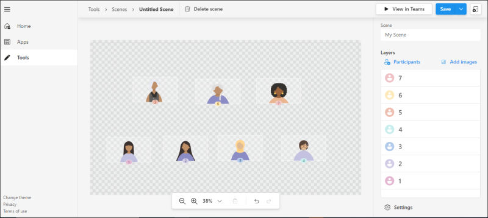
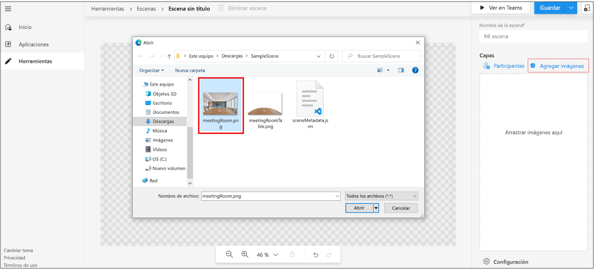
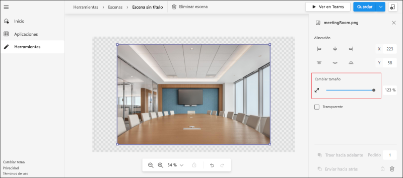
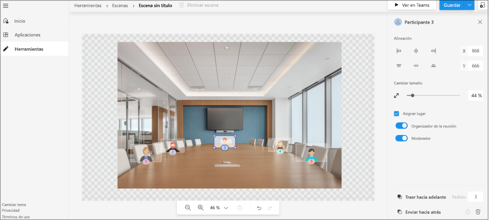
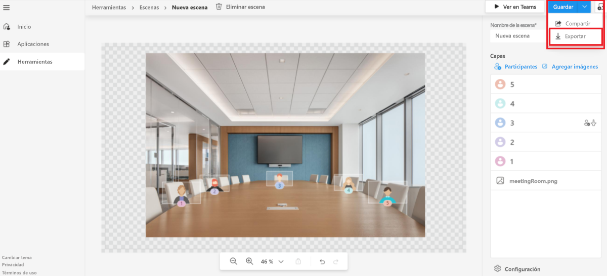

# <a name="custom-together-mode-scenes-in-teams"></a>Escenas personalizadas en modo conjunto en Teams

Las escenas personalizadas del Modo conferencia en Microsoft Teams proporcionan un entorno de reunión envolvente y le permiten hacer lo siguiente:

* Integrar a las personas y animarlas a activar su vídeo.
* Combinar a los participantes digitalmente en una sola escena virtual.
* Colocar las secuencias de vídeo de los participantes en puestos predefinidos diseñados y establecidos por el creador de la escena.

En las escenas personalizadas del Modo conferencia, la escena es un artefacto. El desarrollador de la escena la crea con el Estudio de escenas de Microsoft. En una configuración de escena concebida, los participantes tienen puestos con secuencias de vídeo. Los vídeos se representan en esos puestos. Se recomienda el uso de aplicaciones solo de escena, ya que la experiencia de estas aplicaciones es clara.

El siguiente proceso proporciona información general para crear una aplicación solo de escena:

:::image type="content" source="../assets/images/apps-in-meetings/create-together-mode-scene-flow.png" alt-text="Crear una aplicación solo de escena" border="false":::

Una aplicación solo de escena sigue siendo una aplicación en Microsoft Teams. El Estudio de escenas se ocupa de la creación de paquetes de aplicaciones en segundo plano. Varias escenas de un único paquete de aplicación aparecen como una lista plana para los usuarios.

> [!NOTE]
> Los usuarios no pueden iniciar el Modo conferencia desde el móvil. Sin embargo, después de que un usuario se una a la reunión a través de un dispositivo móvil y se active el Modo conferencia desde el escritorio, los usuarios de móviles que hayan activado el vídeo aparecerán en Modo conferencia en el escritorio.

## <a name="prerequisites"></a>Requisitos previos

Debe tener una comprensión básica de lo siguiente para usar escenas personalizadas del Modo conferencia:

* Definir la escena y los puestos de una escena.
* Tener una cuenta de Desarrollador de Microsoft y familiarizarse con el [Portal para desarrolladores](../concepts/build-and-test/teams-developer-portal.md) de Microsoft Teams y App Studio.
* Comprender el [concepto de instalación de prueba de aplicaciones](../concepts/deploy-and-publish/apps-upload.md).
* Asegurarse de que el administrador haya concedido permiso para [**Cargar una aplicación personalizada**](../concepts/deploy-and-publish/apps-upload.md) y seleccionar todos los filtros como parte de las directivas de reunión y configuración de aplicación respectivamente.

## <a name="best-practices"></a>Procedimientos recomendados

Tenga en cuenta las siguientes prácticas al crear escenas:

* Asegúrese de que todas las imágenes estén en formato PNG.
* Asegúrese de que el paquete final con todas las imágenes juntas no exceda la resolución de 1920 x 1080. La resolución es un número par. Esta resolución es un requisito para que las escenas se muestren correctamente.
* Asegúrese de que el tamaño máximo de la escena es de 10 MB.
* Asegúrese de que el tamaño máximo de cada imagen es de 5 MB. Una escena es una colección de varias imágenes. El límite es para cada imagen individual.
* Asegúrese de seleccionar **Transparente** según sea necesario. Esta casilla está disponible en el panel derecho cuando se selecciona una imagen. Las imágenes superpuestas deben marcarse como **Transparentes** para indicar que se superponen en la escena.

## <a name="build-a-scene-using-the-scene-studio"></a>Crear una escena con Estudio de escenas

Microsoft tiene un Estudio de escenas que le permite crear escenas. Está disponible en [Editor de escenas - Portal para desarrolladores de Teams](https://dev.teams.microsoft.com/scenes). Este documento hace referencia a Estudio de escenas en el Portal para desarrolladores de Microsoft Teams. La interfaz y las funcionalidades son exactamente las mismas que las del Diseñador de escenas en App Studio.

Una escena en el contexto del Estudio de escenas es un artefacto que contiene los siguientes elementos:

* Puestos reservados para el organizador de la reunión y los moderadores. El moderador no hace referencia al usuario que está compartiendo activamente. Hace referencia al [rol de la reunión](https://support.microsoft.com/office/roles-in-a-teams-meeting-c16fa7d0-1666-4dde-8686-0a0bfe16e019).

* Puesto e imagen para cada participante con un ancho y alto ajustables. Solo se admite el formato PNG para la imagen.

* Coordenadas XYZ de todos los puestos e imágenes.

* Colección de varias imágenes camufladas como una sola.

La siguiente imagen muestra cada puesto representado como un avatar para crear las escenas:



Para crear una escena con Estudio de escenas, siga estos pasos:

1. Vaya a [Editor de escenas: Portal para desarrolladores de Teams](https://dev.teams.microsoft.com/scenes).

    También puede abrir el Estudio de escenas desde la página principal del [Portal para desarrolladores de Teams:](https://dev.teams.microsoft.com/home)
    * Seleccione **Crear escenas personalizadas para reuniones**.
    * Seleccione **Herramientas** en la sección izquierda y **Estudio de escenas** en la sección **Herramientas**.

1. En **Editor de escenas**, seleccione **Crear una nueva escena**.

1. En **Nombre de escena**, escriba un nombre para la escena.

    * Puede seleccionar **Cerrar** para alternar entre cerrar o volver a abrir el panel derecho.
    * Puede acercar o alejar la escena con la barra de zoom para obtener una mejor vista de ella.

1. Seleccione **Agregar imágenes** para agregar la imagen al entorno:

    

    >[!NOTE]
    >Puede descargar los archivos [SampleScene.zip](https://github.com/MicrosoftDocs/msteams-docs/tree/master/msteams-platform/apps-in-teams-meetings/SampleScene.zip) y [SampleApp.zip](https://github.com/MicrosoftDocs/msteams-docs/tree/master/msteams-platform/apps-in-teams-meetings/SampleApp.zip) con las imágenes.

1. Seleccione la imagen que ha agregado.

1. En el panel derecho, seleccione una alineación para la imagen o use **Cambiar tamaño** para ajustar el tamaño de la imagen:

    

1. Seleccione un área fuera de la imagen.

1. En la esquina superior derecha, seleccione **Participantes** en **Capas**.

1. Seleccione el número de participantes para la escena en el cuadro **Número de participantes** y, luego, **Agregar**. Una vez enviada la escena, las ubicaciones de los avatares se reemplazan por las secuencias de vídeo del participante real. Puede arrastrar las imágenes de los participantes alrededor de la escena y colocarlas en la posición necesaria. Puede cambiar su tamaño con la flecha de cambio de tamaño.

1. Seleccione cualquier imagen de participante y, luego, **Asignar lugar** para asignar un lugar al participante.

1. Seleccione **Organizador de la reunión** o el rol de **Moderador** para el participante. En una reunión, siempre se debe asignar a un participante el rol de organizador de la reunión:

    

1. Seleccione **Guardar** y **Ver en Teams** para probar rápidamente la escena en Microsoft Teams.

    * Al seleccionar **Ver en Teams** creará automáticamente una aplicación de Microsoft Teams que se pueda ver en la página **Aplicaciones** del portal para desarrolladores de Teams.
    * Al seleccionar **Ver en Teams** creará automáticamente un paquete de aplicaciones que en realidad es appmanifest.json. Puede ir a **Aplicaciones** desde el menú y acceder al paquete de aplicaciones creado automáticamente.
    * Para eliminar una escena que creó, seleccione **Eliminar escena** en la barra superior.

1. En **Ver en Teams**, seleccione **Vista previa en Teams**.
1. En el cuadro de diálogo que aparece, seleccione **Agregar**.

    La escena se prueba o se tiene acceso a ella mediante la creación de una reunión de prueba y el inicio de escenas personalizadas del Modo conferencia. Para obtener más información, vea [Activar escenas personalizadas del Modo conferencia:](#activate-custom-together-mode-scenes)

    

    A continuación, la escena se podrá ver en la galería de escenas personalizadas del Modo conferencia.

Opcionalmente, puede seleccionar **Compartir** en el menú desplegable **Guardar**. Puede crear un vínculo para compartir que le permita distribuir las escenas a otros usuarios que a su vez las podrán emplear. El usuario puede abrir el vínculo para instalar la escena y empezar a usarla.

Después de la vista previa, la escena se enviará como una aplicación a Teams mediante los pasos para el envío de la aplicación. Este paso requiere el paquete de la aplicación. El paquete de la aplicación es diferente del paquete de escena para la escena que se diseñó. El paquete de la aplicación creado automáticamente se encuentra en la sección **Aplicaciones** del Centro para desarrolladores de Teams.

Opcionalmente, el paquete de escena se recupera al seleccionar **Exportar** en el menú desplegable **Guardar**. Se descarga un archivo **.zip** que es el paquete de escena. El paquete de escena incluye un archivo scene.json y los activos PNG usados para crear una escena. Se revisa el paquete de escena para incorporar otros cambios:



Una escena compleja que usa el eje Z se muestra en el ejemplo de introducción paso a paso.

## <a name="sample-scenejson"></a>Ejemplo scene.json

Scene.json en combinación con las imágenes indican la posición exacta de los puestos. Una escena consta de imágenes de mapa de bits, sprites y rectángulos para colocar los vídeos de los participantes. Estos sprites y cuadros de participantes se definen en un sistema de coordenadas globales. El eje X apunta a la derecha y el eje Y apunta hacia abajo.

Las escenas personalizadas del Modo conferencia admiten hacer zoom a los participantes actuales. Esta característica viene bien en reuniones pequeñas dentro de una escena grande. Un sprite es una imagen de mapa de bits estática posicionada en el mundo. El valor Z del sprite determina la posición del sprite. La representación comienza con el sprite con el valor Z más bajo, por lo que un valor Z más alto significa que está más cerca de la cámara. Cada participante tiene su propia fuente de vídeo, que se segmenta para que solo se represente el primer plano.

El siguiente código es el ejemplo scene.json:

```json
{
   "protocolVersion": "1.0",
   "id": "A",
   "autoZoom": true,
   "mirrorParticipants ": true,
   "extent":{
      "left":0.0,
      "top":0.0,
      "width":16.0,
      "height":9.0
   },
   "sprites":[
      {
         "filename":"background.png",
         "cx":8.0,
         "cy":4.5,
         "width":16.0,
         "height":9.0,
         "zOrder":0.0,
   "isAlpha":false
      },
      {
         "filename":"table.png",
         "cx":8.0,
         "cy":7.0,
         "width":12.0,
         "height":4.0,
         "zOrder":3.0,
   "isAlpha":true
      },
      {
         "filename":"row0.png",
         "cx":12.0,
         "cy":15.0,
         "width":8.0,
         "height":4.0,
         "zOrder":2.0,
   "isAlpha":true
      }

   ],
   "participants":[
      {
         "cx":5.0,
         "cy":4.0,
         "width":4.0,
         "height":2.25,
         "zOrder":1.0,
         "seatingOrder":0
      },
      {
         "cx":11.0,
         "cy":4.0,
         "width":4.0,
         "height":2.25,
         "zOrder":1.0,
         "seatingOrder":1
      }
   ]
}
```

Cada escena tiene un identificador y un nombre únicos. El JSON de la escena también contiene información sobre todos los activos usados para la escena. Cada activo contiene un nombre de archivo, el ancho, el alto y la posición en el eje X e Y. Igualmente, cada puesto contiene un identificador de puesto, el ancho, el alto y la posición en los ejes X e Y. El orden de puestos se genera automáticamente y se modifica según las preferencias. El número del orden de puestos se corresponde con el orden de las personas que se unen a la llamada.

`zOrder` representa el orden de colocación de imágenes y puestos a lo largo del eje Z. Proporciona una sensación de profundidad o de partición si es necesario. Consulte el ejemplo de introducción paso a paso. El ejemplo usa `zOrder`.

Ahora que le hemos explicado el ejemplo scene.json, puede activar las escenas personalizadas del Modo conferencia para participar en ellas.

## <a name="activate-custom-together-mode-scenes"></a>Activar escenas personalizadas del Modo conferencia

Obtenga más información sobre cómo un usuario interactúa con las escenas personalizadas del Modo conferencia.

Para seleccionar escenas y activar escenas personalizadas en Modo conferencia, siga estos pasos:

1. Crear una nueva reunión de prueba.

    >[!NOTE]
    > Al seleccionar **Vista previa** en Estudio de escenas, la escena se instalará como una aplicación en Microsoft Teams. Este es el modelo para que un desarrollador pruebe las escenas de Estudio de escenas. Después de que una escena se haya enviado como una aplicación, los usuarios verán estas escenas en la galería de escenas.

1. En la lista desplegable **Galería** de la esquina superior izquierda, seleccione **Modo conferencia**. Aparece el cuadro de diálogo **Selector** y la escena que se agrega está disponible.

1. Seleccione **Cambiar escena** para cambiar la escena predeterminada.

1. En **Galería de escenarios,** seleccione la escena que desea usar para la reunión.

    Opcionalmente, el organizador de la reunión y el moderador pueden **Cambiar la escena de todos los participantes** de la reunión.

    >[!NOTE]
    > En todo momento se usa una sola escena para toda la reunión. Si un moderador u organizador cambia una escena, esta cambiará para todos. Los participantes deciden individualmente si entran en las escenas personalizadas del Modo conferencia, pero si deciden estar en ellas, todos compartirán la misma escena.

1. Seleccione **Aplicar**. Teams instala la aplicación para el usuario y aplica la escena.

## <a name="open-a-custom-together-mode-scenes-scene-package"></a>Abrir un paquete de escenas de las escenas personalizadas del Modo conferencia

Puede compartir el paquete de escenas —que es un archivo .zip recuperado del Estudio de escenas— con otros creadores para mejorar aún más la escena. La funcionalidad **Importar una escena** ayuda a desenvolver un paquete de escena para permitir al creador continuar con la creación de la escena.


## <a name="see-also"></a>Vea también

* [Aplicaciones para reuniones de Teams](teams-apps-in-meetings.md)
* [Bots de llamadas y reuniones](~/bots/calls-and-meetings/calls-meetings-bots-overview.md)
* [Reuniones y llamadas multimedia en tiempo real con Microsoft Teams](~/bots/calls-and-meetings/real-time-media-concepts.md)
