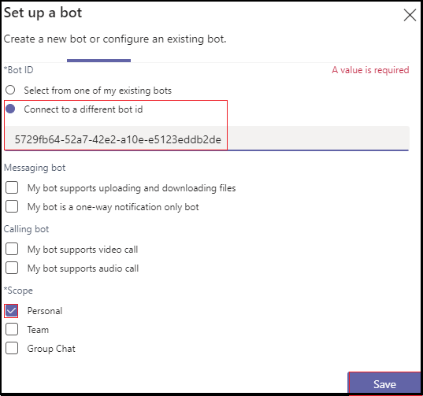

# <a name="add-power-virtual-agents-chatbot"></a>Añadir un bot de chat de Power Virtual Agents 

Power Virtual Agents es una solución de interfaz gráfica guiada sin código que permite a todos los miembros del equipo crear bots de chat enriquecidos y conversacionales que se integren fácilmente con la plataforma Teams web. Todo el contenido escrito en Power Virtual Agents se representa de forma natural en Teams. Power Virtual Agents bots interactúan con los usuarios en el Teams de chat nativo. Los administradores de TI, analistas empresariales, especialistas en dominios y desarrolladores de aplicaciones cualificados pueden diseñar, desarrollar y publicar agentes virtuales inteligentes para Teams sin tener que configurar un entorno de desarrollo. Pueden crear un servicio web o registrarse directamente con Bot Framework. 

Este documento le guía sobre cómo hacer que el bot de chat esté disponible en Teams a través del portal de Power Virtual Agents y agregar el bot a Teams con App Studio. 

Power Virtual Agents le permite crear potentes bots de chat que puedan responder a las preguntas de sus clientes, otros empleados o visitantes de su sitio web o servicio.

Estos bots se pueden crear fácilmente sin necesidad de científicos de datos o desarrolladores.

> [!NOTE]
> Al agregar el bot de chat a Microsoft Teams, algunos de los datos, como el contenido del bot y el contenido de chat del usuario, se comparten con Microsoft Teams. Significa que los datos fluyen fuera del cumplimiento de la organización y de los límites [geográficos o regionales](/power-virtual-agents/data-location). <br/>

## <a name="make-your-chatbot-available-in-teams-through-the-power-virtual-agents-portal"></a>Haga que el bot de chat esté disponible en Teams a través del portal Power Virtual Agents web

Para que el chatbot esté disponible en Teams a través del portal de Power Virtual Agents, debe realizar los siguientes pasos de proceso:

**Para que el bot de chat esté disponible en Teams**

1. **Publicar el contenido del bot más reciente**  
Después de crear un bot de chat en el portal de Power Virtual Agents, debe publicar el bot antes de que Teams usuarios puedan interactuar con él. Para obtener más información, [vea Publish the latest bot content](/power-virtual-agents/publication-fundamentals-publish-channels#publish-the-latest-bot-content).

   

1. **Configurar el canal Teams cliente**  
Después de publicar el bot, agregue el canal Teams para que el bot esté disponible para Teams usuarios.

   

1. **Generar un identificador de aplicación para el bot de chat**  
Después de agregar el Teams al bot de chat, se genera un **identificador** de aplicación en el cuadro de diálogo. El identificador de la aplicación es un identificador único generado por Microsoft para el bot. Guarda el id. de aplicación para crear un paquete de aplicación para Teams.

## <a name="add-your-bot-to-teams-using-app-studio"></a>Agregar el bot a Teams con App Studio

Si [la carga de aplicaciones](/microsoftteams/admin-settings) personalizadas está habilitada en la instancia de Teams, puedes usar Teams App Studio para cargar directamente el chatbot y empezar a usarlo inmediatamente. Para compartir el bot de chat, puedes solicitar al administrador que haga que el bot esté disponible en el catálogo de aplicaciones de inquilino o puedes enviar el paquete de la aplicación a otros usuarios y pedirles que lo carguen de forma independiente.

1. **Instalar App Studio en Teams**  
App Studio es una Teams aplicación. Instale App Studio desde la Teams que simplifica el proceso de creación y registro de bots en Teams: 

   1. Selecciona el icono de la tienda de aplicaciones Teams instancia y busca **App Studio**.

      &emsp;&emsp;    

   1. Selecciona el **icono de App Studio** y selecciona **Instalar** en el cuadro de diálogo emergente.

      &emsp;&emsp; 

1. **Crear el manifiesto Teams aplicación en App Studio**  
Los bots de Teams se definen mediante un archivo JSON de manifiesto de aplicación que proporciona la información básica sobre el bot y sus capacidades. En **App Studio,** selecciona **Editor de manifiestos** y **selecciona Crear una nueva aplicación.**

    

1. **Agregar los detalles del bot**  
Complete todos los campos necesarios. Para obtener una descripción completa de cada campo, vea [definición de esquema de manifiesto](../../resources/schema/manifest-schema.md).

    

1. **Configurar el bot** Para configurar el bot, siga estos pasos: 
     1. Abra la **pestaña Bots.** 
     1. Seleccione **Configurar**  >  **bot existente** y escriba el nombre del bot.

    

   En la siguiente imagen se muestra cómo configurar un bot existente:      

   
       
1. **Agregar el id. de aplicación**  
Para agregar el identificador de aplicación, siga estos pasos:  
    1. Selecciona **Conectar un identificador de bot diferente** y pega el **Id. de aplicación** que has copiado anteriormente. 
    1. Seleccione **Guardar**  >  **personal**  >  **del ámbito**.

    

1. **Agregar dominios válidos para el bot**  
Este paso solo es necesario si el bot requiere que el usuario inicie sesión. Seleccione Dominios y permisos y, en el **campo Dominios** **válidos,** proporcione la siguiente entrada:

    ```bash
       token.botframework.com
    ```

1. **Probar y distribuir el bot**  
Abra **la pestaña Probar y distribuir** y seleccione **Instalar** para agregar el bot directamente a la Teams instancia. Como alternativa, puedes descargar el paquete de la aplicación completado para compartirlo con Teams usuarios o proporcionarlo al administrador para que el bot esté disponible en el catálogo de aplicaciones de inquilino.

1. **Iniciar un chat**   
El proceso de configuración para agregar el bot Power Virtual Agents chat a Teams completa. Ahora puedes iniciar una conversación con el bot en un chat personal.

## <a name="see-also"></a>Vea también

* [Power Virtual Agents](/power-virtual-agents/fundamentals-what-is-power-virtual-agents)  
* [Crear un chatbot para Teams con Microsoft Power Virtual Agents](../bot-features.md#bots-with-power-virtual-agents).  
* [Power Virtual Agents portal](https://powervirtualagents.microsoft.com)
* [Publicar el Power Virtual Agents bot](/power-virtual-agents/publication-fundamentals-publish-channels)
* [Seguridad y cumplimiento en Microsoft Teams](/MicrosoftTeams/security-compliance-overview).

## <a name="next-step"></a>Paso siguiente

> [!div class="nextstepaction"]
> [Crear un asistente virtual](~/samples/virtual-assistant.md)
