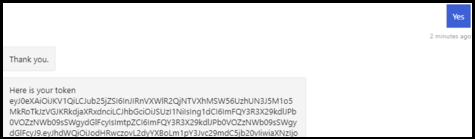

# <a name="add-authentication-to-your-teams-bot"></a>Agregar autenticación a su bot de Teams

En ocasiones, es posible que necesite crear bots en Microsoft teams que puedan tener acceso a recursos en nombre del usuario, como un servicio de correo.

En este artículo se muestra cómo usar la autenticación de SDK de Azure bot Service V4, basada en OAuth 2,0. Esto hace que sea más fácil desarrollar un bot que puede usar tokens de autenticación en función de las credenciales del usuario. La clave en todo esto es el uso de **proveedores de identidades**, como veremos más adelante.

OAuth 2,0 es un estándar abierto para la autenticación y autorización usado por Azure Active Directory (Azure AD) y muchos otros proveedores de identidades. Una descripción básica de OAuth 2,0 es un requisito previo para trabajar con la autenticación en Microsoft Teams.

Consulte [OAuth 2 simplificado](https://aka.ms/oauth2-simplified) para conocer los conocimientos básicos y [OAuth 2,0](https://oauth.net/2/) para la especificación completa.

Para obtener más información sobre cómo administra el servicio de robots de Azure la autenticación, vea [autenticación de usuario en una conversación](https://aka.ms/azure-bot-authentication).

En este artículo, aprenderá lo siguiente:

- **Cómo crear un bot habilitado para la autenticación**. Usar [CS-auth-Sample][teams-auth-bot] para controlar las credenciales de inicio de sesión de usuario y la generación del token de autenticación.
- **Cómo implementar el bot en Azure y asociarlo con un proveedor de identidades**. El proveedor emite un token en función de las credenciales de inicio de sesión del usuario. El bot puede usar el token para obtener acceso a los recursos, como un servicio de correo, que requieren autenticación. Para obtener más información, vea [flujo de autenticación de Microsoft Teams para bots](auth-flow-bot.md).
- **Cómo integrar el bot en Microsoft Teams**. Una vez que se ha integrado el bot, puede iniciar sesión y intercambiar mensajes con él en un chat.

## <a name="prerequisites"></a>Requisitos previos

- Información sobre los [aspectos básicos][concept-basics]de los bot, la [Administración del estado][concept-state], la biblioteca de cuadros de [diálogo][concept-dialogs]y cómo implementar un [flujo de conversación secuencial][simple-dialog].
- Conocimientos del desarrollo de Azure y OAuth 2,0.
- Visual Studio 2017 o posterior y git.
- Cuenta de Azure. Si es necesario, puede crear una [cuenta gratuita de Azure](https://azure.microsoft.com/free/).
- El siguiente ejemplo.

    | Muestra | Versión de BotBuilder | Muestre |
    |:---|:---:|:---|
    | **Autenticación de bot** en [CS-auth-Sample][teams-auth-bot] | IPv4 | Compatibilidad con OAuthCard |
    | **Autenticación de bot** en [Python-auth-Sample][teams-auth-bot-py] | IPv4 | Compatibilidad con OAuthCard |

## <a name="create-the-resource-group"></a>Crear el grupo de recursos

El grupo de recursos y el plan de servicio no son estrictamente necesarios, pero le permiten liberar de forma cómoda los recursos que cree. Esta es una buena práctica para mantener los recursos organizados y fáciles de administrar.

Puede usar un grupo de recursos para crear recursos individuales para el marco de robots. Para el rendimiento, asegúrese de que estos recursos se encuentran en el mismo área de Azure.

1. En el explorador, inicie sesión en [**Azure portal**][azure-portal].
1. En el panel de navegación izquierdo, seleccione **grupos de recursos**.
1. En la esquina superior izquierda de la ventana que se muestra, seleccione **Agregar** ficha para crear un nuevo grupo de recursos. Se le pedirá que proporcione lo siguiente:
    1. **Suscripción**. Use la suscripción existente.
    1. **Grupo de recursos**. Escriba el nombre del grupo de recursos. Un ejemplo podría ser *TeamsResourceGroup*. Recuerde que el nombre debe ser único.
    1. En el menú desplegable **región** , seleccione *oeste de EE. UU.* o una región cercana a las aplicaciones.
    1. Seleccione el botón **revisar y crear** . Debería ver un banner que lee la *validación pasada*.
    1. Seleccione el botón **crear** . La creación del grupo de recursos puede tardar unos minutos.

> [!TIP]
> Como con los recursos que creará más adelante en este tutorial, es una buena idea anclar este grupo de recursos en el panel para facilitar el acceso. Si quiere hacerlo, seleccione el icono PIN & # 128204; en la esquina superior derecha del panel.

## <a name="create-the-service-plan"></a>Crear el plan de servicio

1. En el panel de navegación izquierdo de [**Azure portal**][azure-portal], seleccione **crear un recurso**.
1. En el cuadro de búsqueda, escriba *plan de App Service*. Seleccione la tarjeta de **planeación de App Service** en los resultados de la búsqueda.
1. Seleccione **Crear**.
1. Se le pedirá que proporcione la siguiente información:
    1. **Suscripción**. Puede usar una suscripción existente.
    1. **Grupo de recursos**. Seleccione el grupo que creó anteriormente.
    1. **Nombre**. Escriba el nombre del plan de servicio. Un ejemplo podría ser *TeamsServicePlan*. Recuerde que el nombre debe ser único dentro del grupo.
    1. **Sistema operativo**. Seleccione *Windows* o su sistema operativo aplicable.
    1. **Región**. Seleccione *oeste de EE. UU.* o una región cercana a sus aplicaciones.
    1. **Plan de tarifa**. Asegúrese de que está seleccionado el *estándar S1* . Este debe ser el valor predeterminado.
    1. Seleccione el botón **revisar y crear** . Debería ver un banner que lee la *validación pasada*.
    1. Seleccione **Crear**. Puede tardar unos minutos en crear el plan de App Service. El plan se mostrará en el grupo de recursos.

## <a name="create-the-bot-channels-registration"></a>Crear el registro de los canales de bot

El registro de los canales de bot registra el servicio web como un bot con bot Framework, siempre que tenga un identificador de aplicación de Microsoft y una contraseña de aplicación (secreto de cliente).

> [!IMPORTANT]
> Solo tiene que registrar el bot si no está hospedado en Azure. Si ha [creado un bot](/azure/bot-service/abs-quickstart?view=azure-bot-service-4.0&viewFallbackFrom=azure-bot-service-3.0) a través de Azure portal, ya está registrado con el servicio. Si ha creado el bot a través del [marco de robots](https://dev.botframework.com/bots/new) o [AppStudio](~/concepts/build-and-test/app-studio-overview.md) , el bot no está registrado en Azure.

[!INCLUDE [bot channels registration steps](~/includes/bots/azure-bot-channels-registration.md)]

Una vez que Azure haya creado el recurso de registro, se incluirá en la lista de grupos de recursos.  


> [!NOTE]
> El recurso de registro de los canales de bot mostrará la región **global** aunque haya seleccionado oeste de EE. UU.. Esto es lo que se espera.

Para obtener más información, consulte [crear un bot para Teams](../create-a-bot-for-teams.md).

## <a name="create-the-identity-provider"></a>Crear el proveedor de identidades

Necesita un proveedor de identidad que se pueda usar para la autenticación.
En este procedimiento, usará un proveedor de Azure AD; también se pueden usar otros proveedores de identidades compatibles con Azure AD.

1. En el panel de navegación izquierdo de [**Azure portal**][azure-portal], seleccione **Azure Active Directory**.
    > [!TIP]
    > Deberá crear y registrar este recurso de Azure AD en un espacio empresarial en el que pueda dar su consentimiento para delegar permisos solicitados por una aplicación.
    > Para obtener instrucciones sobre cómo crear un inquilino, vea [obtener acceso al portal y crear un inquilino](/azure/active-directory/fundamentals/active-directory-access-create-new-tenant).
1. En el panel izquierdo, seleccione **registros de aplicaciones**.
1. En el panel derecho, seleccione la pestaña **registro nuevo** , en la parte superior izquierda.
1. Se le pedirá que proporcione la siguiente información:
   1. **Nombre**. Escriba el nombre de la aplicación. Un ejemplo podría ser *BotTeamsIdentity*. Recuerde que el nombre debe ser único.
   1. Seleccione los **tipos de cuenta admitidos** para su aplicación. Seleccione *cuentas en cualquier directorio de la organización (cualquier directorio de Azure ad-multiinquilino) y cuentas personales de Microsoft (por ejemplo, Skype, Xbox)*.
   1. Para el **URI de redireccionamiento**:<br/>
       &#x2713;seleccione **Web**. <br/>
       &#x2713; establece la dirección URL `https://token.botframework.com/.auth/web/redirect`en.
   1. Seleccione **registrar**.

1. Una vez creado, Azure muestra la página de **información general** de la aplicación. Copie y guarde la siguiente información en un archivo:

    1. Valor del identificador de la **aplicación (cliente)** . Este valor se usará más adelante como *identificador de cliente* al registrar esta aplicación de identidad de Azure en el bot.
    1. El valor del **identificador de directorio (tenant)** . También usará este valor más adelante como identificador de *inquilino* para registrar esta aplicación de identidad de Azure en su bot.

1. En el panel izquierdo, seleccione **certificados & secretos** para crear un secreto de cliente para la aplicación.

   1. En **Client Secrets**, seleccione &#x2795; **nuevo secreto de cliente**.
   1. Agregue una descripción para identificar este secreto con respecto a otros que puede que necesite crear para esta aplicación, como *aplicación de identidad de bot en Teams*.
   1. El valor establecido **expira** en la selección.
   1. Seleccione **Agregar**.
   1. Antes de salir de esta página, **Anote el secreto**. Este valor se usará más adelante como _secreto de cliente_ al registrar la aplicación de Azure ad en el bot.

### <a name="configure-the-identity-provider-connection-and-register-it-with-the-bot"></a>Configurar la conexión del proveedor de identidad y registrarla con el bot

1. En el [**portal de Azure**][azure-portal], seleccione su grupo de recursos en el panel.
1. Seleccione el vínculo de registro del canal de bot.
1. En la página recurso, seleccione **configuración**.
1. En **configuración de conexión de OAuth** cerca de la parte inferior de la página, seleccione **Agregar configuración**.
1. Complete el formulario de la siguiente manera:

    1. **Nombre**. Escriba un nombre para la conexión. Usará este nombre en el bot en el `appsettings.json` archivo. Por ejemplo *BotTeamsAuthADv1*.
    1. **Proveedor de servicios**. Seleccione **Azure Active Directory**. Una vez que seleccione esto, se mostrarán los campos específicos de Azure AD.
    1. **Identificador de cliente**. Escriba el identificador de la aplicación (cliente) que anotó para su aplicación de proveedor de identidades de Azure en los pasos anteriores.
    1. **Secreto de cliente**. Escriba el secreto que anotó para su aplicación de proveedor de identidades de Azure en los pasos anteriores.
    1. **Tipo de concesión**. Entrar `authorization_code`.
    1. **Dirección URL de inicio de sesión**. Entrar `https://login.microsoftonline.com`.
    1. **Identificador de inquilino**, escriba el **identificador de directorio (inquilino)** que anotó anteriormente para la aplicación de identidad de Azure o **Common** , según el tipo de cuenta compatible que se haya seleccionado cuando se creó la aplicación de proveedor de identidad. Para decidir qué valor asignar, siga estos criterios:

        - Si seleccionó *solo cuentas en este directorio de la organización (solo Microsoft-inquilino único)* o *cuentas en cualquier directorio de la organización (Microsoft AAD Directory-multiinquilino)* , escriba el **identificador de inquilino** que ha registrado anteriormente para la aplicación de AAD. Este será el inquilino asociado con los usuarios que se pueden autenticar.

        - Si seleccionó *cuentas en cualquier directorio de la organización (cualquier espacio empresarial de AAD y cuentas personales de Microsoft, por ejemplo, Skype, Xbox, Outlook),* escriba la palabra **Common** en lugar de un identificador de inquilino. De lo contrario, la aplicación de AAD comprobará en el inquilino cuyo identificador se haya seleccionado y excluya las cuentas personales de Microsoft.

    h. En **dirección URL**del recurso `https://graph.microsoft.com/`, escriba. No se usa en el ejemplo de código actual.  
    sigo. Deje los **ámbitos** en blanco. La siguiente imagen es un ejemplo:

    

1. Haga clic en **Guardar**.

### <a name="test-the-connection"></a>Probar la conexión

1. Seleccione la entrada de conexión para abrir la conexión que acaba de crear.
1. Seleccione **probar conexión** en la parte superior del panel **configuración de conexión del proveedor de servicios** .
1. La primera vez que lo haga, se abrirá una nueva ventana del explorador en la que se le pedirá que seleccione una cuenta. Seleccione el que desee usar.
1. A continuación, se le pedirá que lo permita al proveedor de identidades para usar sus datos (credenciales). La siguiente imagen es un ejemplo:

    

1. Seleccione **Aceptar**.
1. Esto debería redirigirlo a una **conexión de prueba con \<el nombre de-conexión-nombre> Página realizada correctamente** . Actualice la página si recibe un error. La siguiente imagen es un ejemplo:

  

El código de bot usa el nombre de la conexión para recuperar los tokens de autenticación de usuario.

## <a name="prepare-the-bot-sample-code"></a>Preparar el código de ejemplo de bot

Una vez finalizada la configuración preliminar, vamos a centrarse en la creación del bot que se va a usar en este artículo.

# <a name="cnettabdotnet"></a>[C#/.NET](#tab/dotnet)

1. Clone [CS-auth-Sample][teams-auth-bot].
1. Inicie Visual Studio.
1. En la barra de herramientas **, seleccione archivo > abrir > proyecto/solución** y abra el proyecto de bot.
1. En C#, actualice **appSettings. JSON** de la siguiente manera:

    - Establezca `ConnectionName` el nombre de la conexión del proveedor de identidad que agregó al registro del canal del bot. El nombre usado en este ejemplo es *BotTeamsAuthADv1*.
    - Establezca `MicrosoftAppId` el identificador de la **aplicación de bot** que guardó en el momento del registro del canal de bot? n.
    - Establezca `MicrosoftAppPassword` el **secreto de cliente** que guardó en el momento del registro del canal de bot?
    - Establezca el `ConnectionName` como el nombre de la conexión del proveedor de identidad. 

    Según los caracteres del secreto de bot, es posible que deba omitir la contraseña XML. Por ejemplo, cualquier "y" comercial (&) tendrá que codificarse como `&amp;`.

     [!code-json[appsettings](~/../botbuilder-samples/samples/csharp_dotnetcore/46.teams-auth/appsettings.json?range=1-5)]

1. En el explorador de soluciones, vaya a `TeamsAppManifest` la carpeta, `manifest.json` abra y `id` defina `botId` y el **identificador** de la aplicación de bot que guardó en el momento del registro del canal de bot? n.

# <a name="pythontabpython"></a>[Python](#tab/python)

1. Clonar la autenticación de robot de muestra de [Teams][teams-auth-bot-py] desde el repositorio de github.
1. Actualizar **config.py**:

    - Establezca `ConnectionName` el nombre de la configuración de conexión OAuth que ha agregado a su bot.
    - Establezca `MicrosoftAppId` el `MicrosoftAppPassword` identificador de aplicación y el secreto de la aplicación en el bot? n.

      Según los caracteres del secreto de bot, es posible que deba omitir la contraseña XML. Por ejemplo, cualquier "y" comercial (&) tendrá que codificarse como `&amp;`.

      [!code-python[config](~/../botbuilder-samples/samples/python/46.teams-auth/config.py?range=14-16)]

---

### <a name="deploy-the-bot-to-azure"></a>Implementar el bot en Azure

Para implementar el bot, siga los pasos descritos en How to [deploy Your bot to Azure](https://aka.ms/azure-bot-deployment-cli).

Como alternativa, en Visual Studio, puede seguir estos pasos:

1. En el *Explorador de soluciones* de Visual Studio, seleccione y mantenga presionado (o haga clic con el botón derecho) en el nombre del proyecto.
1. En el menú desplegable, seleccione **publicar**.
1. En la ventana que se muestra, seleccione el **nuevo** vínculo.
1. En la ventana de diálogo, seleccione **servicio de aplicaciones** a la izquierda y **crear nuevo** a la derecha.
1. Seleccione el botón **publicar** .
1. En la siguiente ventana de diálogo, escriba la información necesaria. A continuación puede ver un ejemplo:

   

1. Seleccione **Crear**.
1. Si la implementación se completa correctamente, debería verse reflejada en Visual Studio. Además, se muestra una página en el explorador predeterminado que indica que *su bot está listo*. La dirección URL será similar a esta: `https://botteamsauth.azurewebsites.net/`. Guárdelo en un archivo.
1. En el explorador, vaya a [**Azure portal**][azure-portal].
1. Compruebe el grupo de recursos, el bot debe aparecer junto con los otros recursos. La siguiente imagen es un ejemplo:

    

1. En el grupo de recursos, seleccione el nombre de registro del canal del bot (vínculo).
1. En el panel izquierdo, seleccione **configuración**.
1. En el cuadro **extremo de mensajería** , escriba la dirección URL que se `api/messages`ha obtenido anteriormente y, a continuación,. Este es un ejemplo: `https://botteamsauth.azurewebsites.net/api/messages`.
1. Seleccione el botón **Guardar** en la esquina superior izquierda.

## <a name="test-the-bot-using-the-emulator"></a>Probar el bot con el emulador

Si aún no lo ha hecho, instale el [emulador de Microsoft bot Framework](https://aka.ms/bot-framework-emulator-readme). Vea también [depurar con el emulador](https://aka.ms/bot-framework-emulator-debug-with-emulator).

Para que el inicio de sesión de ejemplo de bot funcione, debe configurar el emulador como se muestra a continuación.

### <a name="configure-the-emulator-for-authentication"></a>Configurar el emulador para la autenticación

Si un bot requiere autenticación, debe configurar el emulador tal y como se muestra a continuación.

1. Inicie el emulador.
1. En el emulador, seleccione el icono de engranaje &#9881; en la parte inferior izquierda o la pestaña **configuración del emulador** en la esquina superior derecha.
1. Active la casilla para **usar los tokens de autenticación de la versión 1,0**.
1. Escriba la ruta de acceso local a la herramienta **ngrok** . *Consulte* el [wiki](https://github.com/Microsoft/BotFramework-Emulator/wiki/Tunneling-(ngrok))del emulador/ngrok de la integración de túneles de bot Framework. Para obtener más información sobre herramientas, consulte [ngrok](https://ngrok.com/).
1. Para activar la casilla, **ejecute ngrok cuando se inicie el emulador**.
1. Seleccione el botón **Guardar** .

Cuando el bot muestra una tarjeta de inicio de sesión y el usuario selecciona el botón de inicio de sesión, el emulador abre una página que el usuario puede usar para iniciar sesión con el proveedor de autenticación.
Una vez que el usuario lo hace, el proveedor genera un token de usuario y lo envía al bot. Después de eso, el bot puede actuar en nombre del usuario.

### <a name="test-the-bot-locally"></a>Probar el bot localmente

Una vez que haya configurado el mecanismo de autenticación, puede realizar las pruebas de bot reales.  

1. Ejecute el ejemplo de bot de forma local en el equipo, a través de Visual Studio, por ejemplo.
1. Inicie el emulador.
1. Seleccione el botón **abrir bot** .
1. En la **dirección URL del bot**, escriba la dirección URL local del bot? n. Normalmente, `http://localhost:3978/api/messages`.
1. En el **identificador de aplicación de Microsoft** , escriba el identificador de `appsettings.json`aplicación del bot.
1. En la **contraseña de aplicación de Microsoft** , escriba la contraseña de aplicación `appsettings.json`del bot desde el.
1. Seleccione **conectar**.
1. Una vez que el bot esté funcionando, escriba el texto para mostrar la tarjeta de inicio de sesión.
1. Seleccione el botón **iniciar sesión** .
1. Se muestra un cuadro de diálogo emergente para **confirmar la dirección URL abierta**. Esto permite que el usuario del bot (usted) se autentique.  
1. Seleccione **confirmar**.
1. Si se le solicita, seleccione la cuenta de usuario correspondiente.
1. En función de la configuración que haya usado para el emulador, puede obtener una de las siguientes opciones:
    1. **Usar el código de comprobación de inicio de sesión**  
      &#x2713; se abre una ventana en la que se muestra el código de validación.  
      &#x2713; copiar y escriba el código de validación en el cuadro chat para completar el inicio de sesión.
    1. **Uso de tokens de autenticación**.  
      &#x2713; ha iniciado sesión en función de sus credenciales.

    La siguiente imagen es un ejemplo de la interfaz de usuario de bot una vez que ha iniciado sesión:

    

1. Si selecciona **sí** cuando el robot le pregunta si desea *ver el token?*, obtendrá una respuesta similar a la siguiente:

    

1. Escriba **Logout** en el cuadro chat de entrada para cerrar la sesión. Esto libera el token de usuario y el bot no podrá actuar en su nombre hasta que vuelva a iniciar sesión.

> [!NOTE]
> La autenticación de bot requiere el uso del **servicio de conector de bot**. El servicio tiene acceso a la información de registro de los canales de bot para el bot.

## <a name="test-the-deployed-bot"></a>Probar el bot implementado

<!--There are several testing scenarios here. Ideally, we'd have a separate article on the what, why, 
and when for these, and just reference that from here, along with the set of steps that exercises the bot code.-->

1. En el explorador, vaya a [**Azure portal**][azure-portal].
1. Busque su grupo de recursos.
1. Seleccione el vínculo de recursos. Se muestra la página recurso.
1. En la página recurso, seleccione **probar en chat web**. El bot se inicia y muestra los saludos predefinidos.
1. Escriba cualquier cosa en el cuadro chat.
1. Seleccione el cuadro **iniciar sesión** .
1. Se muestra un cuadro de diálogo emergente para **confirmar la dirección URL abierta**. Esto permite que el usuario del bot (usted) se autentique.  
1. Seleccione **confirmar**.
1. Si se le solicita, seleccione la cuenta de usuario correspondiente.
    La siguiente imagen es un ejemplo de la interfaz de usuario de bot una vez que ha iniciado sesión:

    .

1. Seleccione el botón **sí** para mostrar el token de autenticación. La siguiente imagen es un ejemplo:

    .

1. Escriba Logout para cerrar sesión.

    

> [!NOTE]
> Si tiene problemas para iniciar sesión, intente probar la conexión de nuevo tal como se describe en los pasos anteriores. Esto podría volver a crear el token de autenticación.
> Con el cliente de chat Web de bot Framework en Azure, es posible que deba iniciar sesión varias veces antes de que la autenticación se establezca correctamente.

## <a name="install-and-test-the-bot-in-teams"></a>Instalar y probar el bot en Teams

1. En el proyecto de bot, asegúrese de `TeamsAppManifest` que la carpeta `manifest.json` contiene el junto `outline.png` con `color.png` los archivos y.
1. En el explorador de soluciones, desplácese hasta la `TeamsAppManifest` carpeta. Modifique `manifest.json` asignando los siguientes valores:
    1. Asegúrese de que el identificador de la **aplicación de bot** que ha recibido en el momento del registro del `id` canal `botId`de bot esté asignado a y.
    1. Asigne este valor: `validDomains: [ "token.botframework.com" ]`.
1. Seleccione y **zip** los `manifest.json`archivos `outline.png`, y `color.png` .
1. Abra **Microsoft Teams**.
1. En el panel izquierdo, en la parte inferior, seleccione el **icono aplicaciones**.
1. En el panel derecho, en la parte inferior, seleccione **cargar una aplicación personalizada**.
1. Desplácese a `TeamsAppManifest` la carpeta y cargue el manifiesto comprimido.
Se muestra el siguiente asistente:

    

1. Seleccione el botón **Agregar a un equipo** .
1. En la siguiente ventana, seleccione el equipo en el que desea usar el bot.
1. Seleccione el botón **configurar un bot** .
1. Seleccione los puntos suspensivos (&#x25cf;&#x25cf;&#x25cf;) en el panel de la izquierda. A continuación, selecciona el icono de **App Studio** .
1. Seleccione la pestaña **Editor de manifiestos** . Debe ver el icono del bot que ha cargado.
1. Además, debería poder ver el bot enumerado como un contacto en la lista de chats que puede usar para intercambiar mensajes con el bot.

### <a name="testing-the-bot-locally-in-teams"></a>Probar el bot localmente en Teams

Microsoft Teams es un producto basado en la nube completamente, por lo que todos los servicios a los que tiene acceso se encuentran disponibles desde la nube con puntos de conexión HTTPS. Por lo tanto, para habilitar el bot (nuestro ejemplo) para trabajar en Microsoft Teams, debe publicar el código en la nube que prefiera, o bien hacer que una instancia de ejecución local sea accesible externamente mediante una herramienta de **túnel** . Se recomienda [ngrok](https://ngrok.com/download), que crea una dirección URL externamente direccionable para un puerto que se abre de forma local en el equipo.
Para configurar ngrok en preparación para la ejecución local de la aplicación de Microsoft Teams, siga estos pasos:

1. En una ventana de terminal, vaya al directorio en el `ngrok.exe` que ha instalado. Se recomienda establecer la ruta de la *variable de entorno* para que apunte a ella.
1. Ejecutar, por ejemplo, `ngrok http 3978 --host-header=localhost:3978`. Reemplace el número de Puerto según sea necesario.
Se inicia ngrok para escuchar en el puerto especificado. A cambio, le proporciona una dirección URL que se puede direccionar externamente, válida durante el tiempo que se ejecute ngrok. La siguiente imagen es un ejemplo:

    .

1. Copie la dirección HTTPS de reenvío. Debe ser similar a la siguiente: `https://dea822bf.ngrok.io/`.
1. Anexe `/api/messages` para obtener `https://dea822bf.ngrok.io/api/messages`. Este es el **punto de conexión de mensajes** para que el bot se ejecute localmente en el equipo y sea accesible a través de la web en un chat en Microsoft Teams.
1. Un último paso para realizar es actualizar el punto de conexión de mensajes del componente implementado. En el ejemplo, implementamos el bot en Azure. Por lo tanto, * * vamos a realizar estos pasos:
    1. En el explorador, navegue a [**Azure portal**][azure-portal].
    1. Seleccione el **registro del canal del bot**.
    1. En el panel izquierdo, seleccione **configuración**.
    1. En el panel derecho, en el cuadro **extremo de mensajería** , escriba la dirección URL de ngrok, en `https://dea822bf.ngrok.io/api/messages`nuestro ejemplo.
1. Inicie el bot de forma local, por ejemplo, en el modo de depuración de Visual Studio.
1. Pruebe el bot mientras se ejecuta de forma local mediante el **chat web**del portal de bot Framework. Al igual que en el emulador, esta prueba no permite el acceso a funciones específicas de Teams.
1. En la ventana de terminal `ngrok` donde se está ejecutando, puede ver el tráfico HTTP entre el bot y el cliente de chat Web. Si desea una vista más detallada, en una ventana del explorador, `http://127.0.0.1:4040` escriba lo que obtuvo en la ventana de terminal anterior. La siguiente imagen es un ejemplo:

    .

> [!NOTE]
> Si detiene y reinicia ngrok, la dirección URL cambia. Para usar ngrok en su proyecto, y según las capacidades que use, debe actualizar todas las referencias a direcciones URL.

## <a name="additional-information"></a>Información adicional

### <a name="teamsappmanifestmanifestjson"></a>TeamsAppManifest/manifest. JSON

Este manifiesto contiene la información que Microsoft Teams necesita para conectarse con el bot.  

```json
{
  "$schema": "https://developer.microsoft.com/json-schemas/teams/v1.5/MicrosoftTeams.schema.json",
  "manifestVersion": "1.5",
  "version": "1.0.0",
  "id": "",
  "packageName": "com.teams.auth.bot",
  "developer": {
    "name": "TeamsBotAuth",
    "websiteUrl": "https://www.microsoft.com",
    "privacyUrl": "https://www.teams.com/privacy",
    "termsOfUseUrl": "https://www.teams.com/termsofuse"
  },
  "icons": {
    "color": "color.png",
    "outline": "outline.png"
  },
  "name": {
    "short": "TeamsBotAuth",
    "full": "Teams Bot Authentication"
  },
  "description": {
    "short": "TeamsBotAuth",
    "full": "Teams Bot Authentication"
  },
  "accentColor": "#FFFFFF",
  "bots": [
    {
      "botId": "",
      "scopes": [
        "groupchat",
        "team"
      ],
      "supportsFiles": false,
      "isNotificationOnly": false
    }
  ],
  "permissions": [
    "identity",
    "messageTeamMembers"
  ],
  "validDomains": [ "token.botframework.com" ]
}
```

Con la autenticación, Teams se comporta de forma ligeramente distinta a otros canales, tal como se explica a continuación.

### <a name="handling-invoke-activity"></a>Controlar la actividad de invocación

Se envía una **actividad Invoke** al bot en lugar de a la actividad de evento usada por otros canales.
Esto se realiza mediante la subclase de **ActivityHandler**.

**Bots/DialogBot. CS**

# <a name="cnettabdotnet"></a>[C#/.NET](#tab/dotnet)

[!code-csharp[ActivityHandler](~/../botbuilder-samples/samples/csharp_dotnetcore/46.teams-auth/Bots/DialogBot.cs?range=19-51)]

**Bots/TeamsBot. CS**

La *actividad Invoke* debe reenviarse al cuadro de diálogo si se usa la **OAuthPrompt** .

[!code-csharp[ActivityHandler](~/../botbuilder-samples/samples/csharp_dotnetcore/46.teams-auth/Bots/TeamsBot.cs?range=34-42)]

#### <a name="teamsactivityhandlercs"></a>TeamsActivityHandler.cs

```csharp

protected virtual Task OnInvokeActivityAsync(ITurnContext<IInvokeActivity> turnContext, CancellationToken cancellationToken)
{
    switch (turnContext.Activity.Name)
    {
        case "signin/verifyState":
            return OnSigninVerifyStateAsync(turnContext, cancellationToken);

        default:
            return Task.CompletedTask;
    }
}

protected virtual Task OnSigninVerifyStateAsync(ITurnContext<IInvokeActivity> turnContext, CancellationToken cancellationToken)
{
    return Task.CompletedTask;
}
```

# <a name="pythontabpython"></a>[Python](#tab/python)

**bots/dialog_bot. py**

[!code-python[ActivityHandler](~/../botbuilder-samples/samples/python/46.teams-auth/bots/dialog_bot.py?range=10-42)]

**bots/teams_bot. py**

La *actividad Invoke* debe reenviarse al cuadro de diálogo si se usa la **OAuthPrompt** .

[!code-python[on_token_response_event](~/../botbuilder-samples/samples/python/46.teams-auth/bots/teams_bot.py?range=38-45)] 

**cuadros de diálogo/main_dialog. py**

En un paso de diálogo, `begin_dialog` use para iniciar el símbolo del sistema de OAuth, que le pide al usuario que inicie sesión.

- Si el usuario ya ha iniciado sesión, se generará un evento de respuesta de token, sin preguntar al usuario.
- De lo contrario, se le pedirá al usuario que inicie sesión. El servicio de bot de Azure envía el evento de respuesta de token después de que el usuario intente iniciar sesión.

[!code-python[Add OAuthPrompt](~/../botbuilder-samples/samples/python/46.teams-auth/dialogs/main_dialog.py?range=48-49)]

En el siguiente paso de cuadro de diálogo, compruebe si existe un token en el resultado del paso anterior. Si no es null, el usuario ha iniciado sesión correctamente.

[!code-python[Add OAuthPrompt](~/../botbuilder-samples/samples/python/46.teams-auth/dialogs/main_dialog.py?range=54-65)]

**cuadros de diálogo/logout_dialog. py**

[!code-python[allow logout](~/../botbuilder-samples/samples/python/46.teams-auth/dialogs/logout_dialog.py?range=29-36&highlight=6)]

---

## <a name="further-reading"></a>Lecturas adicionales

- [Agregar autenticación a su bot a través del servicio de bot de Azure](https://aka.ms/azure-bot-add-authentication)

<!-- Footnote-style links -->

[azure-portal]: https://ms.portal.azure.com

[concept-basics]: https://docs.microsoft.com/azure/bot-service/bot-builder-basics?view=azure-bot-service-4.0
[concept-state]: https://docs.microsoft.com/azure/bot-service/bot-builder-concept-state?view=azure-bot-service-4.0
[concept-dialogs]: https://docs.microsoft.com/azure/bot-service/bot-builder-concept-dialog?view=azure-bot-service-4.0
[simple-dialog]: https://docs.microsoft.com/azure/bot-service/bot-builder-dialog-manage-conversation-flow?view=azure-bot-service-4.0

[teams-auth-bot]: https://github.com/microsoft/BotBuilder-Samples/tree/master/samples/csharp_dotnetcore/46.teams-auth

[teams-auth-bot-py]: https://github.com/microsoft/BotBuilder-Samples/tree/master/samples/python/46.teams-auth

[azure-aad-blade]: https://ms.portal.azure.com/#blade/Microsoft_AAD_IAM/ActiveDirectoryMenuBlade/Overview
[aad-registration-blade]: https://ms.portal.azure.com/#blade/Microsoft_AAD_IAM/ActiveDirectoryMenuBlade/RegisteredAppsPreview
