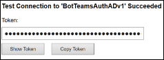

# <a name="add-authentication-to-your-teams-bot"></a><span data-ttu-id="c253d-103">Agregar autenticación a su bot de Teams</span><span class="sxs-lookup"><span data-stu-id="c253d-103">Add authentication to your Teams bot</span></span>

<span data-ttu-id="c253d-104">En ocasiones, es posible que necesite crear bots en Microsoft teams que puedan tener acceso a recursos en nombre del usuario, como un servicio de correo.</span><span class="sxs-lookup"><span data-stu-id="c253d-104">There are times when you may need to create bots in Microsoft Teams that can access resources on behalf of the user, such as a mail service.</span></span>

<span data-ttu-id="c253d-105">En este artículo se muestra cómo usar la autenticación de SDK de Azure bot Service V4, basada en OAuth 2,0.</span><span class="sxs-lookup"><span data-stu-id="c253d-105">This article demonstrates how to use Azure Bot Service v4 SDK authentication, based on OAuth 2.0.</span></span> <span data-ttu-id="c253d-106">Esto hace que sea más fácil desarrollar un bot que puede usar tokens de autenticación en función de las credenciales del usuario.</span><span class="sxs-lookup"><span data-stu-id="c253d-106">This makes it easier to develop a bot that can use authentication tokens based on the user's credentials.</span></span> <span data-ttu-id="c253d-107">La clave en todo esto es el uso de **proveedores de identidades**, como veremos más adelante.</span><span class="sxs-lookup"><span data-stu-id="c253d-107">Key in all this is the use of **identity providers**, as we will see later.</span></span>

<span data-ttu-id="c253d-108">OAuth 2,0 es un estándar abierto para la autenticación y autorización usado por Azure Active Directory (Azure AD) y muchos otros proveedores de identidades.</span><span class="sxs-lookup"><span data-stu-id="c253d-108">OAuth 2.0 is an open standard for authentication and authorization used by Azure Active Directory (Azure AD) and many other identity providers.</span></span> <span data-ttu-id="c253d-109">Una descripción básica de OAuth 2,0 es un requisito previo para trabajar con la autenticación en Microsoft Teams.</span><span class="sxs-lookup"><span data-stu-id="c253d-109">A basic understanding of OAuth 2.0 is a prerequisite for working with authentication in Teams.</span></span>

<span data-ttu-id="c253d-110">Consulte [OAuth 2 simplificado](https://aka.ms/oauth2-simplified) para conocer los conocimientos básicos y [OAuth 2,0](https://oauth.net/2/) para la especificación completa.</span><span class="sxs-lookup"><span data-stu-id="c253d-110">See [OAuth 2 Simplified](https://aka.ms/oauth2-simplified) for a basic understanding, and [OAuth 2.0](https://oauth.net/2/) for the complete specification.</span></span>

<span data-ttu-id="c253d-111">Para obtener más información sobre cómo administra el servicio de robots de Azure la autenticación, vea [autenticación de usuario en una conversación](https://aka.ms/azure-bot-authentication).</span><span class="sxs-lookup"><span data-stu-id="c253d-111">For more information about how the Azure Bot Service handles authentication, see [User authentication within a conversation](https://aka.ms/azure-bot-authentication).</span></span>

<span data-ttu-id="c253d-112">En este artículo, aprenderá lo siguiente:</span><span class="sxs-lookup"><span data-stu-id="c253d-112">In this article you'll learn:</span></span>

- <span data-ttu-id="c253d-113">**Cómo crear un bot habilitado para la autenticación**.</span><span class="sxs-lookup"><span data-stu-id="c253d-113">**How to create an authentication-enabled bot**.</span></span> <span data-ttu-id="c253d-114">Usar [CS-auth-Sample][teams-auth-bot-cs] para controlar las credenciales de inicio de sesión de usuario y la generación del token de autenticación.</span><span class="sxs-lookup"><span data-stu-id="c253d-114">You'll use [cs-auth-sample][teams-auth-bot-cs] to handle user sign-in credentials and the generating the authentication token.</span></span>
- <span data-ttu-id="c253d-115">**Cómo implementar el bot en Azure y asociarlo con un proveedor de identidades**.</span><span class="sxs-lookup"><span data-stu-id="c253d-115">**How to deploy the bot to Azure and associate it with an identity provider**.</span></span> <span data-ttu-id="c253d-116">El proveedor emite un token en función de las credenciales de inicio de sesión del usuario.</span><span class="sxs-lookup"><span data-stu-id="c253d-116">The provider issues a token based on user sign-in credentials.</span></span> <span data-ttu-id="c253d-117">El bot puede usar el token para obtener acceso a los recursos, como un servicio de correo, que requieren autenticación.</span><span class="sxs-lookup"><span data-stu-id="c253d-117">The bot can use the token to access resources, such as a mail service, which require authentication.</span></span> <span data-ttu-id="c253d-118">Para obtener más información, vea [flujo de autenticación de Microsoft Teams para bots](auth-flow-bot.md).</span><span class="sxs-lookup"><span data-stu-id="c253d-118">For more information see  [Microsoft Teams authentication flow for bots](auth-flow-bot.md).</span></span>
- <span data-ttu-id="c253d-119">**Cómo integrar el bot en Microsoft Teams**.</span><span class="sxs-lookup"><span data-stu-id="c253d-119">**How to integrate the bot within Microsoft Teams**.</span></span> <span data-ttu-id="c253d-120">Una vez que se ha integrado el bot, puede iniciar sesión y intercambiar mensajes con él en un chat.</span><span class="sxs-lookup"><span data-stu-id="c253d-120">Once the bot has been integrated, you can sign in and exchange messages with it in a chat.</span></span>

## <a name="prerequisites"></a><span data-ttu-id="c253d-121">Requisitos previos</span><span class="sxs-lookup"><span data-stu-id="c253d-121">Prerequisites</span></span>

- <span data-ttu-id="c253d-122">Información sobre los [aspectos básicos][concept-basics]de los bot, la [Administración del estado][concept-state], la biblioteca de cuadros de [diálogo][concept-dialogs]y cómo implementar un [flujo de conversación secuencial][simple-dialog].</span><span class="sxs-lookup"><span data-stu-id="c253d-122">Knowledge of [bot basics][concept-basics], [managing state][concept-state], the [dialogs library][concept-dialogs], and how to [implement sequential conversation flow][simple-dialog].</span></span>
- <span data-ttu-id="c253d-123">Conocimientos del desarrollo de Azure y OAuth 2,0.</span><span class="sxs-lookup"><span data-stu-id="c253d-123">Knowledge of Azure and OAuth 2.0 development.</span></span>
- <span data-ttu-id="c253d-124">Las versiones actuales de Visual Studio y git.</span><span class="sxs-lookup"><span data-stu-id="c253d-124">The current versions of Visual Studio and Git.</span></span>
- <span data-ttu-id="c253d-125">Cuenta de Azure.</span><span class="sxs-lookup"><span data-stu-id="c253d-125">Azure account.</span></span> <span data-ttu-id="c253d-126">Si es necesario, puede crear una [cuenta gratuita de Azure](https://azure.microsoft.com/free/).</span><span class="sxs-lookup"><span data-stu-id="c253d-126">If needed, you can create an [Azure free account](https://azure.microsoft.com/free/).</span></span>
- <span data-ttu-id="c253d-127">El siguiente ejemplo.</span><span class="sxs-lookup"><span data-stu-id="c253d-127">The following sample.</span></span>

    | <span data-ttu-id="c253d-128">Muestra</span><span class="sxs-lookup"><span data-stu-id="c253d-128">Sample</span></span> | <span data-ttu-id="c253d-129">Versión de BotBuilder</span><span class="sxs-lookup"><span data-stu-id="c253d-129">BotBuilder version</span></span> | <span data-ttu-id="c253d-130">Muestre</span><span class="sxs-lookup"><span data-stu-id="c253d-130">Demonstrates</span></span> |
    |:---|:---:|:---|
    | <span data-ttu-id="c253d-131">**Autenticación de bot** en [CS-auth-Sample][teams-auth-bot-cs]</span><span class="sxs-lookup"><span data-stu-id="c253d-131">**Bot authentication** in [cs-auth-sample][teams-auth-bot-cs]</span></span> | <span data-ttu-id="c253d-132">IPv4</span><span class="sxs-lookup"><span data-stu-id="c253d-132">v4</span></span> | <span data-ttu-id="c253d-133">Compatibilidad con OAuthCard</span><span class="sxs-lookup"><span data-stu-id="c253d-133">OAuthCard support</span></span> |
    | <span data-ttu-id="c253d-134">**Autenticación de bot** en [JS-auth-Sample][teams-auth-bot-js]</span><span class="sxs-lookup"><span data-stu-id="c253d-134">**Bot authentication** in [js-auth-sample][teams-auth-bot-js]</span></span> | <span data-ttu-id="c253d-135">IPv4</span><span class="sxs-lookup"><span data-stu-id="c253d-135">v4</span></span>| <span data-ttu-id="c253d-136">Compatibilidad con OAuthCard</span><span class="sxs-lookup"><span data-stu-id="c253d-136">OAuthCard support</span></span>  |
    | <span data-ttu-id="c253d-137">**Autenticación de bot** en [py-auth-Sample][teams-auth-bot-py]</span><span class="sxs-lookup"><span data-stu-id="c253d-137">**Bot authentication** in [py-auth-sample][teams-auth-bot-py]</span></span> | <span data-ttu-id="c253d-138">IPv4</span><span class="sxs-lookup"><span data-stu-id="c253d-138">v4</span></span> | <span data-ttu-id="c253d-139">Compatibilidad con OAuthCard</span><span class="sxs-lookup"><span data-stu-id="c253d-139">OAuthCard support</span></span> |

## <a name="create-the-resource-group"></a><span data-ttu-id="c253d-140">Crear el grupo de recursos</span><span class="sxs-lookup"><span data-stu-id="c253d-140">Create the resource group</span></span>

<span data-ttu-id="c253d-141">El grupo de recursos y el plan de servicio no son estrictamente necesarios, pero le permiten liberar de forma cómoda los recursos que cree.</span><span class="sxs-lookup"><span data-stu-id="c253d-141">The resource group and the service plan aren't strictly necessary, but they allow you to conveniently release the resources you create.</span></span> <span data-ttu-id="c253d-142">Esta es una buena práctica para mantener los recursos organizados y fáciles de administrar.</span><span class="sxs-lookup"><span data-stu-id="c253d-142">This is good practice for keeping your resources organized and manageable.</span></span>

<span data-ttu-id="c253d-143">Puede usar un grupo de recursos para crear recursos individuales para el marco de robots.</span><span class="sxs-lookup"><span data-stu-id="c253d-143">You use a resource group to create individual resources for the Bot Framework.</span></span> <span data-ttu-id="c253d-144">Para el rendimiento, asegúrese de que estos recursos se encuentran en el mismo área de Azure.</span><span class="sxs-lookup"><span data-stu-id="c253d-144">For performance, ensure that these resources are located in the same Azure region.</span></span>

1. <span data-ttu-id="c253d-145">En el explorador, inicie sesión en [**Azure portal**][azure-portal].</span><span class="sxs-lookup"><span data-stu-id="c253d-145">In your browser, sign into the [**Azure portal**][azure-portal].</span></span>
1. <span data-ttu-id="c253d-146">En el panel de navegación izquierdo, seleccione **grupos de recursos**.</span><span class="sxs-lookup"><span data-stu-id="c253d-146">In the left navigation panel, select **Resource groups**.</span></span>
1. <span data-ttu-id="c253d-147">En la esquina superior izquierda de la ventana que se muestra, seleccione **Agregar** ficha para crear un nuevo grupo de recursos.</span><span class="sxs-lookup"><span data-stu-id="c253d-147">In the upper left of the displayed window, select **Add** tab to create a new resource group.</span></span> <span data-ttu-id="c253d-148">Se le pedirá que proporcione lo siguiente:</span><span class="sxs-lookup"><span data-stu-id="c253d-148">You'll be prompted to provide the following:</span></span>
    1. <span data-ttu-id="c253d-149">**Suscripción**.</span><span class="sxs-lookup"><span data-stu-id="c253d-149">**Subscription**.</span></span> <span data-ttu-id="c253d-150">Use la suscripción existente.</span><span class="sxs-lookup"><span data-stu-id="c253d-150">Use your existing subscription.</span></span>
    1. <span data-ttu-id="c253d-151">**Grupo de recursos**.</span><span class="sxs-lookup"><span data-stu-id="c253d-151">**Resource group**.</span></span> <span data-ttu-id="c253d-152">Escriba el nombre del grupo de recursos.</span><span class="sxs-lookup"><span data-stu-id="c253d-152">Enter the name for the resource group.</span></span> <span data-ttu-id="c253d-153">Un ejemplo podría ser *TeamsResourceGroup*.</span><span class="sxs-lookup"><span data-stu-id="c253d-153">An example could be  *TeamsResourceGroup*.</span></span> <span data-ttu-id="c253d-154">Recuerde que el nombre debe ser único.</span><span class="sxs-lookup"><span data-stu-id="c253d-154">Remember that the name must be unique.</span></span>
    1. <span data-ttu-id="c253d-155">En el menú desplegable **región** , seleccione *oeste de EE. UU.* o una región cercana a las aplicaciones.</span><span class="sxs-lookup"><span data-stu-id="c253d-155">From the **Region** drop-down menu, select *West US*, or a region close to your applications.</span></span>
    1. <span data-ttu-id="c253d-156">Seleccione el botón **revisar y crear** .</span><span class="sxs-lookup"><span data-stu-id="c253d-156">Select the **Review and create** button.</span></span> <span data-ttu-id="c253d-157">Debería ver un banner que lee la *validación pasada*.</span><span class="sxs-lookup"><span data-stu-id="c253d-157">You should see a banner that reads *Validation passed*.</span></span>
    1. <span data-ttu-id="c253d-158">Seleccione el botón **crear** .</span><span class="sxs-lookup"><span data-stu-id="c253d-158">Select the **Create** button.</span></span> <span data-ttu-id="c253d-159">La creación del grupo de recursos puede tardar unos minutos.</span><span class="sxs-lookup"><span data-stu-id="c253d-159">It may take a few minutes to create the resource group.</span></span>

> [!TIP]
> <span data-ttu-id="c253d-160">Como con los recursos que creará más adelante en este tutorial, es una buena idea anclar este grupo de recursos en el panel para facilitar el acceso.</span><span class="sxs-lookup"><span data-stu-id="c253d-160">As with the resources you'll create later in this tutorial, it's a good idea to pin this resource group to your dashboard for easy access.</span></span> <span data-ttu-id="c253d-161">Si quiere hacerlo, seleccione el icono PIN & # 128204; en la esquina superior derecha del panel.</span><span class="sxs-lookup"><span data-stu-id="c253d-161">If you'd like to do so, select the pin icon &#128204; in the upper right of the dashboard.</span></span>

## <a name="create-the-service-plan"></a><span data-ttu-id="c253d-162">Crear el plan de servicio</span><span class="sxs-lookup"><span data-stu-id="c253d-162">Create the service plan</span></span>

1. <span data-ttu-id="c253d-163">En el panel de navegación izquierdo de [**Azure portal**][azure-portal], seleccione **crear un recurso**.</span><span class="sxs-lookup"><span data-stu-id="c253d-163">In the [**Azure portal**][azure-portal], on the left navigation panel, select **Create a resource**.</span></span>
1. <span data-ttu-id="c253d-164">En el cuadro de búsqueda, escriba *plan de App Service*.</span><span class="sxs-lookup"><span data-stu-id="c253d-164">In the search box, type *App Service Plan*.</span></span> <span data-ttu-id="c253d-165">Seleccione la tarjeta de **planeación de App Service** en los resultados de la búsqueda.</span><span class="sxs-lookup"><span data-stu-id="c253d-165">Select the **App Service Plan** card from the search results.</span></span>
1. <span data-ttu-id="c253d-166">Seleccione **Crear**.</span><span class="sxs-lookup"><span data-stu-id="c253d-166">Select **Create**.</span></span>
1. <span data-ttu-id="c253d-167">Se le pedirá que proporcione la siguiente información:</span><span class="sxs-lookup"><span data-stu-id="c253d-167">You'll be asked to provide the following information:</span></span>
    1. <span data-ttu-id="c253d-168">**Suscripción**.</span><span class="sxs-lookup"><span data-stu-id="c253d-168">**Subscription**.</span></span> <span data-ttu-id="c253d-169">Puede usar una suscripción existente.</span><span class="sxs-lookup"><span data-stu-id="c253d-169">You can use an existing subscription.</span></span>
    1. <span data-ttu-id="c253d-170">**Grupo de recursos**.</span><span class="sxs-lookup"><span data-stu-id="c253d-170">**Resource Group**.</span></span> <span data-ttu-id="c253d-171">Seleccione el grupo que creó anteriormente.</span><span class="sxs-lookup"><span data-stu-id="c253d-171">Select the group you created earlier.</span></span>
    1. <span data-ttu-id="c253d-172">**Nombre**.</span><span class="sxs-lookup"><span data-stu-id="c253d-172">**Name**.</span></span> <span data-ttu-id="c253d-173">Escriba el nombre del plan de servicio.</span><span class="sxs-lookup"><span data-stu-id="c253d-173">Enter the name for the service plan.</span></span> <span data-ttu-id="c253d-174">Un ejemplo podría ser *TeamsServicePlan*.</span><span class="sxs-lookup"><span data-stu-id="c253d-174">An example could be  *TeamsServicePlan*.</span></span> <span data-ttu-id="c253d-175">Recuerde que el nombre debe ser único dentro del grupo.</span><span class="sxs-lookup"><span data-stu-id="c253d-175">Remember that the name must be unique, within the group.</span></span>
    1. <span data-ttu-id="c253d-176">**Sistema operativo**.</span><span class="sxs-lookup"><span data-stu-id="c253d-176">**Operating System**.</span></span> <span data-ttu-id="c253d-177">Seleccione *Windows* o su sistema operativo aplicable.</span><span class="sxs-lookup"><span data-stu-id="c253d-177">Select *Windows* or your applicable OS.</span></span>
    1. <span data-ttu-id="c253d-178">**Región**.</span><span class="sxs-lookup"><span data-stu-id="c253d-178">**Region**.</span></span> <span data-ttu-id="c253d-179">Seleccione *oeste de EE. UU.* o una región cercana a sus aplicaciones.</span><span class="sxs-lookup"><span data-stu-id="c253d-179">Select *West US* or a region close to your applications.</span></span>
    1. <span data-ttu-id="c253d-180">**Plan de tarifa**.</span><span class="sxs-lookup"><span data-stu-id="c253d-180">**Pricing Tier**.</span></span> <span data-ttu-id="c253d-181">Asegúrese de que está seleccionado el *estándar S1* .</span><span class="sxs-lookup"><span data-stu-id="c253d-181">Make sure that *Standard S1* is selected.</span></span> <span data-ttu-id="c253d-182">Este debe ser el valor predeterminado.</span><span class="sxs-lookup"><span data-stu-id="c253d-182">This should be the default value.</span></span>
    1. <span data-ttu-id="c253d-183">Seleccione el botón **revisar y crear** .</span><span class="sxs-lookup"><span data-stu-id="c253d-183">Select the **Review and create** button.</span></span> <span data-ttu-id="c253d-184">Debería ver un banner que lee la *validación pasada*.</span><span class="sxs-lookup"><span data-stu-id="c253d-184">You should see a banner that reads *Validation passed*.</span></span>
    1. <span data-ttu-id="c253d-185">Seleccione **Crear**.</span><span class="sxs-lookup"><span data-stu-id="c253d-185">Select **Create**.</span></span> <span data-ttu-id="c253d-186">Puede tardar unos minutos en crear el plan de App Service.</span><span class="sxs-lookup"><span data-stu-id="c253d-186">It may take a few minutes to create the app service plan.</span></span> <span data-ttu-id="c253d-187">El plan se mostrará en el grupo de recursos.</span><span class="sxs-lookup"><span data-stu-id="c253d-187">The plan will be listed in the resource group.</span></span>

## <a name="create-the-bot-channels-registration"></a><span data-ttu-id="c253d-188">Crear el registro de los canales de bot</span><span class="sxs-lookup"><span data-stu-id="c253d-188">Create the bot channels registration</span></span>

<span data-ttu-id="c253d-189">El registro de los canales de bot registra el servicio web como un bot con bot Framework, siempre que tenga un identificador de aplicación de Microsoft y una contraseña de aplicación (secreto de cliente).</span><span class="sxs-lookup"><span data-stu-id="c253d-189">The bot channels registration registers your web service as a bot with the Bot Framework, provided you have a Microsoft App Id and App password (client secret).</span></span>

> [!IMPORTANT]
> <span data-ttu-id="c253d-190">Solo tiene que registrar el bot si no está hospedado en Azure.</span><span class="sxs-lookup"><span data-stu-id="c253d-190">You only need to register your bot if it is not hosted in Azure.</span></span> <span data-ttu-id="c253d-191">Si ha [creado un bot](/azure/bot-service/abs-quickstart?view=azure-bot-service-4.0&viewFallbackFrom=azure-bot-service-3.0) a través de Azure portal, ya está registrado con el servicio.</span><span class="sxs-lookup"><span data-stu-id="c253d-191">If you [created a bot](/azure/bot-service/abs-quickstart?view=azure-bot-service-4.0&viewFallbackFrom=azure-bot-service-3.0) through the Azure portal then it is already registered with the service.</span></span> <span data-ttu-id="c253d-192">Si ha creado el bot a través del [marco de robots](https://dev.botframework.com/bots/new) o [AppStudio](~/concepts/build-and-test/app-studio-overview.md) , el bot no está registrado en Azure.</span><span class="sxs-lookup"><span data-stu-id="c253d-192">If you created your bot through the [Bot Framework](https://dev.botframework.com/bots/new) or [AppStudio](~/concepts/build-and-test/app-studio-overview.md) your bot isn't registered in Azure.</span></span>

[!INCLUDE [bot channels registration steps](~/includes/bots/azure-bot-channels-registration.md)]

> [!NOTE]
> <span data-ttu-id="c253d-193">El recurso de registro de los canales de bot mostrará la región **global** aunque haya seleccionado oeste de EE. UU..</span><span class="sxs-lookup"><span data-stu-id="c253d-193">The Bot Channels Registration resource will show the **Global** region even if you selected West US.</span></span> <span data-ttu-id="c253d-194">Esto es lo que se espera.</span><span class="sxs-lookup"><span data-stu-id="c253d-194">This is expected.</span></span>

<span data-ttu-id="c253d-195">Para obtener más información, consulte [crear un bot para Teams](../create-a-bot-for-teams.md).</span><span class="sxs-lookup"><span data-stu-id="c253d-195">For more information, see [Create a bot for Teams](../create-a-bot-for-teams.md).</span></span>

## <a name="create-the-identity-provider"></a><span data-ttu-id="c253d-196">Crear el proveedor de identidades</span><span class="sxs-lookup"><span data-stu-id="c253d-196">Create the identity provider</span></span>

<span data-ttu-id="c253d-197">Necesita un proveedor de identidad que se pueda usar para la autenticación.</span><span class="sxs-lookup"><span data-stu-id="c253d-197">You need an identity provider that can be used for authentication.</span></span>
<span data-ttu-id="c253d-198">En este procedimiento, usará un proveedor de Azure AD; también se pueden usar otros proveedores de identidades compatibles con Azure AD.</span><span class="sxs-lookup"><span data-stu-id="c253d-198">In this procedure you'll use an Azure AD provider; other Azure AD supported identity providers can also be used.</span></span>

1. <span data-ttu-id="c253d-199">En el panel de navegación izquierdo de [**Azure portal**][azure-portal], seleccione **Azure Active Directory**.</span><span class="sxs-lookup"><span data-stu-id="c253d-199">In the [**Azure portal**][azure-portal], on the left navigation panel, select **Azure Active Directory**.</span></span>
    > [!TIP]
    > <span data-ttu-id="c253d-200">Deberá crear y registrar este recurso de Azure AD en un espacio empresarial en el que pueda dar su consentimiento para delegar permisos solicitados por una aplicación.</span><span class="sxs-lookup"><span data-stu-id="c253d-200">You'll need to create and register this Azure AD resource in a tenant in which you can consent to delegate permissions requested by an application.</span></span>
    > <span data-ttu-id="c253d-201">Para obtener instrucciones sobre cómo crear un inquilino, vea [obtener acceso al portal y crear un inquilino](/azure/active-directory/fundamentals/active-directory-access-create-new-tenant).</span><span class="sxs-lookup"><span data-stu-id="c253d-201">For instruction on creating a tenant, see [Access the portal and create a tenant](/azure/active-directory/fundamentals/active-directory-access-create-new-tenant).</span></span>
1. <span data-ttu-id="c253d-202">En el panel izquierdo, seleccione **registros de aplicaciones**.</span><span class="sxs-lookup"><span data-stu-id="c253d-202">In the left panel, select **App registrations**.</span></span>
1. <span data-ttu-id="c253d-203">En el panel derecho, seleccione la pestaña **registro nuevo** , en la parte superior izquierda.</span><span class="sxs-lookup"><span data-stu-id="c253d-203">In the right panel, select the **New registration** tab, in the upper left.</span></span>
1. <span data-ttu-id="c253d-204">Se le pedirá que proporcione la siguiente información:</span><span class="sxs-lookup"><span data-stu-id="c253d-204">You'll be asked to provide the following information:</span></span>
   1. <span data-ttu-id="c253d-205">**Nombre**.</span><span class="sxs-lookup"><span data-stu-id="c253d-205">**Name**.</span></span> <span data-ttu-id="c253d-206">Escriba el nombre de la aplicación.</span><span class="sxs-lookup"><span data-stu-id="c253d-206">Enter the name for the application.</span></span> <span data-ttu-id="c253d-207">Un ejemplo podría ser *BotTeamsIdentity*.</span><span class="sxs-lookup"><span data-stu-id="c253d-207">An example could be  *BotTeamsIdentity*.</span></span> <span data-ttu-id="c253d-208">Recuerde que el nombre debe ser único.</span><span class="sxs-lookup"><span data-stu-id="c253d-208">Remember that the name must be unique.</span></span>
   1. <span data-ttu-id="c253d-209">Seleccione los **tipos de cuenta admitidos** para su aplicación.</span><span class="sxs-lookup"><span data-stu-id="c253d-209">Select the **Supported account types** for your application.</span></span> <span data-ttu-id="c253d-210">Seleccione *cuentas en cualquier directorio de la organización (cualquier directorio de Azure ad-multiinquilino) y cuentas personales de Microsoft (por ejemplo, Skype, Xbox)*.</span><span class="sxs-lookup"><span data-stu-id="c253d-210">Select *Accounts in any organizational directory (Any Azure AD directory - Multitenant) and personal Microsoft accounts (e.g. Skype, Xbox)*.</span></span>
   1. <span data-ttu-id="c253d-211">Para el **URI de redireccionamiento**:</span><span class="sxs-lookup"><span data-stu-id="c253d-211">For the **Redirect URI**:</span></span><br/>
       <span data-ttu-id="c253d-212">&#x2713;seleccione **Web**.</span><span class="sxs-lookup"><span data-stu-id="c253d-212">&#x2713;Select **Web**.</span></span> <br/>
       <span data-ttu-id="c253d-213">&#x2713; establece la dirección URL en `https://token.botframework.com/.auth/web/redirect` .</span><span class="sxs-lookup"><span data-stu-id="c253d-213">&#x2713; Set the URL to `https://token.botframework.com/.auth/web/redirect`.</span></span>
   1. <span data-ttu-id="c253d-214">Seleccione **registrar**.</span><span class="sxs-lookup"><span data-stu-id="c253d-214">Select **Register**.</span></span>

1. <span data-ttu-id="c253d-215">Una vez creado, Azure muestra la página de **información general** de la aplicación.</span><span class="sxs-lookup"><span data-stu-id="c253d-215">Once it is created, Azure displays the **Overview** page for the app.</span></span> <span data-ttu-id="c253d-216">Copie y guarde la siguiente información en un archivo:</span><span class="sxs-lookup"><span data-stu-id="c253d-216">Copy and save the following information to a file:</span></span>

    1. <span data-ttu-id="c253d-217">Valor del identificador de la **aplicación (cliente)** .</span><span class="sxs-lookup"><span data-stu-id="c253d-217">The **Application (client) ID** value.</span></span> <span data-ttu-id="c253d-218">Este valor se usará más adelante como *identificador de cliente* al registrar esta aplicación de identidad de Azure en el bot.</span><span class="sxs-lookup"><span data-stu-id="c253d-218">You'll use this value later as the *Client ID* when you register this Azure identity application with your bot.</span></span>
    1. <span data-ttu-id="c253d-219">El valor del **identificador de directorio (tenant)** .</span><span class="sxs-lookup"><span data-stu-id="c253d-219">The **Directory (tenant) ID** value.</span></span> <span data-ttu-id="c253d-220">También usará este valor más adelante como identificador de *inquilino* para registrar esta aplicación de identidad de Azure en su bot.</span><span class="sxs-lookup"><span data-stu-id="c253d-220">You'll also use this value later as the *Tenant ID* to register this Azure identity application with your bot.</span></span>

1. <span data-ttu-id="c253d-221">En el panel izquierdo, seleccione **certificados & secretos** para crear un secreto de cliente para la aplicación.</span><span class="sxs-lookup"><span data-stu-id="c253d-221">In the left panel, select **Certificates & secrets** to create a client secret for your application.</span></span>

   1. <span data-ttu-id="c253d-222">En **Client Secrets**, seleccione &#x2795; **nuevo secreto de cliente**.</span><span class="sxs-lookup"><span data-stu-id="c253d-222">Under **Client secrets**, select &#x2795; **New client secret**.</span></span>
   1. <span data-ttu-id="c253d-223">Agregue una descripción para identificar este secreto con respecto a otros que puede que necesite crear para esta aplicación, como *aplicación de identidad de bot en Teams*.</span><span class="sxs-lookup"><span data-stu-id="c253d-223">Add a description to identify this secret from others you might need to create for this app, such as *Bot identity app in Teams*.</span></span>
   1. <span data-ttu-id="c253d-224">El valor establecido **expira** en la selección.</span><span class="sxs-lookup"><span data-stu-id="c253d-224">Set **Expires** to your selection.</span></span>
   1. <span data-ttu-id="c253d-225">Seleccione **Agregar**.</span><span class="sxs-lookup"><span data-stu-id="c253d-225">Select **Add**.</span></span>
   1. <span data-ttu-id="c253d-226">Antes de salir de esta página, **Anote el secreto**.</span><span class="sxs-lookup"><span data-stu-id="c253d-226">Before leaving this page, **record the secret**.</span></span> <span data-ttu-id="c253d-227">Este valor se usará más adelante como _secreto de cliente_ al registrar la aplicación de Azure ad en el bot.</span><span class="sxs-lookup"><span data-stu-id="c253d-227">You'll use this value later as the _Client secret_ when you register your Azure AD application with your bot.</span></span>

### <a name="configure-the-identity-provider-connection-and-register-it-with-the-bot"></a><span data-ttu-id="c253d-228">Configurar la conexión del proveedor de identidad y registrarla con el bot</span><span class="sxs-lookup"><span data-stu-id="c253d-228">Configure the identity provider connection and register it with the bot</span></span>

1. <span data-ttu-id="c253d-229">En el [**portal de Azure**][azure-portal], seleccione su grupo de recursos en el panel.</span><span class="sxs-lookup"><span data-stu-id="c253d-229">In the [**Azure portal**][azure-portal], select your resource group from the dashboard.</span></span>
1. <span data-ttu-id="c253d-230">Seleccione el vínculo de registro del canal de bot.</span><span class="sxs-lookup"><span data-stu-id="c253d-230">Select your bot channel registration link.</span></span>
1. <span data-ttu-id="c253d-231">En la página recurso, seleccione **configuración**.</span><span class="sxs-lookup"><span data-stu-id="c253d-231">On the resource page, select **Settings**.</span></span>
1. <span data-ttu-id="c253d-232">En **configuración de conexión de OAuth** cerca de la parte inferior de la página, seleccione **Agregar configuración**.</span><span class="sxs-lookup"><span data-stu-id="c253d-232">Under **OAuth Connection Settings** near the bottom of the page, select **Add Setting**.</span></span>
1. <span data-ttu-id="c253d-233">Complete el formulario de la siguiente manera:</span><span class="sxs-lookup"><span data-stu-id="c253d-233">Complete the form as follows:</span></span>

    1. <span data-ttu-id="c253d-234">**Nombre**.</span><span class="sxs-lookup"><span data-stu-id="c253d-234">**Name**.</span></span> <span data-ttu-id="c253d-235">Escriba un nombre para la conexión.</span><span class="sxs-lookup"><span data-stu-id="c253d-235">Enter a name for the connection.</span></span> <span data-ttu-id="c253d-236">Usará este nombre en el bot en el `appsettings.json` archivo.</span><span class="sxs-lookup"><span data-stu-id="c253d-236">You'll use this name in your bot in the `appsettings.json` file.</span></span> <span data-ttu-id="c253d-237">Por ejemplo *BotTeamsAuthADv1*.</span><span class="sxs-lookup"><span data-stu-id="c253d-237">For example *BotTeamsAuthADv1*.</span></span>
    1. <span data-ttu-id="c253d-238">**Proveedor de servicios**.</span><span class="sxs-lookup"><span data-stu-id="c253d-238">**Service Provider**.</span></span> <span data-ttu-id="c253d-239">Seleccione **Azure Active Directory**.</span><span class="sxs-lookup"><span data-stu-id="c253d-239">Select **Azure Active Directory**.</span></span> <span data-ttu-id="c253d-240">Una vez que seleccione esto, se mostrarán los campos específicos de Azure AD.</span><span class="sxs-lookup"><span data-stu-id="c253d-240">Once you select this, the Azure AD-specific fields will be displayed.</span></span>
    1. <span data-ttu-id="c253d-241">**Identificador de cliente**. Escriba el identificador de la aplicación (cliente) que anotó para su aplicación de proveedor de identidades de Azure en los pasos anteriores.</span><span class="sxs-lookup"><span data-stu-id="c253d-241">**Client id**. Enter the Application (client) ID that you recorded for your Azure identity provider app in the steps above.</span></span>
    1. <span data-ttu-id="c253d-242">**Secreto de cliente**.</span><span class="sxs-lookup"><span data-stu-id="c253d-242">**Client secret**.</span></span> <span data-ttu-id="c253d-243">Escriba el secreto que anotó para su aplicación de proveedor de identidades de Azure en los pasos anteriores.</span><span class="sxs-lookup"><span data-stu-id="c253d-243">Enter the secret that you recorded for your Azure identity provider app in the steps above.</span></span>
    1. <span data-ttu-id="c253d-244">**Tipo de concesión**.</span><span class="sxs-lookup"><span data-stu-id="c253d-244">**Grant Type**.</span></span> <span data-ttu-id="c253d-245">Entrar `authorization_code` .</span><span class="sxs-lookup"><span data-stu-id="c253d-245">Enter `authorization_code`.</span></span>
    1. <span data-ttu-id="c253d-246">**Dirección URL de inicio de sesión**.</span><span class="sxs-lookup"><span data-stu-id="c253d-246">**Login URL**.</span></span> <span data-ttu-id="c253d-247">Entrar `https://login.microsoftonline.com` .</span><span class="sxs-lookup"><span data-stu-id="c253d-247">Enter `https://login.microsoftonline.com`.</span></span>
    1. <span data-ttu-id="c253d-248">**Identificador de inquilino**, escriba el **identificador de directorio (inquilino)** que anotó anteriormente para la aplicación de identidad de Azure o **Common** , según el tipo de cuenta compatible que se haya seleccionado cuando se creó la aplicación de proveedor de identidad.</span><span class="sxs-lookup"><span data-stu-id="c253d-248">**Tenant ID**, enter the **Directory (tenant) ID** that you recorded earlier for your Azure identity app or **common** depending on the supported account type selected when you created the identity provider app.</span></span> <span data-ttu-id="c253d-249">Para decidir qué valor asignar, siga estos criterios:</span><span class="sxs-lookup"><span data-stu-id="c253d-249">To decide which value to assign follow these criteria:</span></span>

        - <span data-ttu-id="c253d-250">Si seleccionó *solo cuentas en este directorio de la organización (solo Microsoft-inquilino único)* o *cuentas en cualquier directorio de la organización (Microsoft AAD Directory-multiinquilino)* , escriba el **identificador de inquilino** que ha registrado anteriormente para la aplicación de AAD.</span><span class="sxs-lookup"><span data-stu-id="c253d-250">If you selected either *Accounts in this organizational directory only (Microsoft only - Single tenant)* or *Accounts in any organizational directory(Microsoft AAD directory - Multi tenant)* enter the **tenant ID** you recorded earlier for the AAD app.</span></span> <span data-ttu-id="c253d-251">Este será el inquilino asociado con los usuarios que se pueden autenticar.</span><span class="sxs-lookup"><span data-stu-id="c253d-251">This will be the tenant associated with the users who can be authenticated.</span></span>

        - <span data-ttu-id="c253d-252">Si seleccionó *cuentas en cualquier directorio de la organización (cualquier espacio empresarial de AAD y cuentas personales de Microsoft, por ejemplo, Skype, Xbox, Outlook),* escriba la palabra **Common** en lugar de un identificador de inquilino.</span><span class="sxs-lookup"><span data-stu-id="c253d-252">If you selected *Accounts in any organizational directory (Any AAD directory - Multi tenant and personal Microsoft accounts e.g. Skype, Xbox, Outlook)* enter the word **common** instead of a tenant ID.</span></span> <span data-ttu-id="c253d-253">De lo contrario, la aplicación de AAD comprobará en el inquilino cuyo identificador se haya seleccionado y excluya las cuentas personales de Microsoft.</span><span class="sxs-lookup"><span data-stu-id="c253d-253">Otherwise, the AAD app will verify through the tenant whose ID was selected and exclude personal Microsoft accounts.</span></span>

    <span data-ttu-id="c253d-254">h.</span><span class="sxs-lookup"><span data-stu-id="c253d-254">h.</span></span> <span data-ttu-id="c253d-255">En **dirección URL del recurso**, escriba `https://graph.microsoft.com/` .</span><span class="sxs-lookup"><span data-stu-id="c253d-255">For **Resource URL**, enter `https://graph.microsoft.com/`.</span></span> <span data-ttu-id="c253d-256">No se usa en el ejemplo de código actual.</span><span class="sxs-lookup"><span data-stu-id="c253d-256">This is not used in the current code sample.</span></span>  
    <span data-ttu-id="c253d-257">i.</span><span class="sxs-lookup"><span data-stu-id="c253d-257">i.</span></span> <span data-ttu-id="c253d-258">Deje los **ámbitos** en blanco.</span><span class="sxs-lookup"><span data-stu-id="c253d-258">Leave **Scopes** blank.</span></span> <span data-ttu-id="c253d-259">La siguiente imagen es un ejemplo:</span><span class="sxs-lookup"><span data-stu-id="c253d-259">The following image is an example:</span></span>

    

1. <span data-ttu-id="c253d-261">Seleccione **Guardar**.</span><span class="sxs-lookup"><span data-stu-id="c253d-261">Select **Save**.</span></span>

### <a name="test-the-connection"></a><span data-ttu-id="c253d-262">Probar la conexión</span><span class="sxs-lookup"><span data-stu-id="c253d-262">Test the connection</span></span>

1. <span data-ttu-id="c253d-263">Seleccione la entrada de conexión para abrir la conexión que acaba de crear.</span><span class="sxs-lookup"><span data-stu-id="c253d-263">Select the connection entry to open the connection you just created.</span></span>
1. <span data-ttu-id="c253d-264">Seleccione **probar conexión** en la parte superior del panel **configuración de conexión del proveedor de servicios** .</span><span class="sxs-lookup"><span data-stu-id="c253d-264">Select **Test Connection** at the top of the **Service Provider Connection Setting** panel.</span></span>
1. <span data-ttu-id="c253d-265">La primera vez que lo haga, se abrirá una nueva ventana del explorador en la que se le pedirá que seleccione una cuenta.</span><span class="sxs-lookup"><span data-stu-id="c253d-265">The first time you do this will open a new browser window asking you to select an account.</span></span> <span data-ttu-id="c253d-266">Seleccione el que desee usar.</span><span class="sxs-lookup"><span data-stu-id="c253d-266">Select the one you want to use.</span></span>
1. <span data-ttu-id="c253d-267">A continuación, se le pedirá que lo permita al proveedor de identidades para usar sus datos (credenciales).</span><span class="sxs-lookup"><span data-stu-id="c253d-267">Next, you'll be asked to allow to the identity provider to use your data (credentials).</span></span> <span data-ttu-id="c253d-268">La siguiente imagen es un ejemplo:</span><span class="sxs-lookup"><span data-stu-id="c253d-268">The following image is an example:</span></span>

    

1. <span data-ttu-id="c253d-270">Seleccione **Aceptar**.</span><span class="sxs-lookup"><span data-stu-id="c253d-270">Select **Accept**.</span></span>
1. <span data-ttu-id="c253d-271">Esto debería redirigirle a una **conexión de prueba para que la página se haya \<your-connection-name> realizado correctamente** .</span><span class="sxs-lookup"><span data-stu-id="c253d-271">This should then redirect you to a **Test Connection to \<your-connection-name> Succeeded** page.</span></span> <span data-ttu-id="c253d-272">Actualice la página si recibe un error.</span><span class="sxs-lookup"><span data-stu-id="c253d-272">Refresh the page if you get an error.</span></span> <span data-ttu-id="c253d-273">La siguiente imagen es un ejemplo:</span><span class="sxs-lookup"><span data-stu-id="c253d-273">The following image is an example:</span></span>

  

<span data-ttu-id="c253d-275">El código de bot usa el nombre de la conexión para recuperar los tokens de autenticación de usuario.</span><span class="sxs-lookup"><span data-stu-id="c253d-275">The connection name is used by the bot code to retrieve user authentication tokens.</span></span>

## <a name="prepare-the-bot-sample-code"></a><span data-ttu-id="c253d-276">Preparar el código de ejemplo de bot</span><span class="sxs-lookup"><span data-stu-id="c253d-276">Prepare the bot sample code</span></span>

<span data-ttu-id="c253d-277">Una vez finalizada la configuración preliminar, vamos a centrarse en la creación del bot que se va a usar en este artículo.</span><span class="sxs-lookup"><span data-stu-id="c253d-277">With the preliminary settings done, let's focus on the creation of the bot to use in this article.</span></span>

# <a name="cnet"></a>[<span data-ttu-id="c253d-278">C#/.NET</span><span class="sxs-lookup"><span data-stu-id="c253d-278">C#/.NET</span></span>](#tab/dotnet)

1. <span data-ttu-id="c253d-279">Clone [CS-auth-Sample][teams-auth-bot-cs].</span><span class="sxs-lookup"><span data-stu-id="c253d-279">Clone [cs-auth-sample][teams-auth-bot-cs].</span></span>
1. <span data-ttu-id="c253d-280">Inicie Visual Studio.</span><span class="sxs-lookup"><span data-stu-id="c253d-280">Launch Visual Studio.</span></span>
1. <span data-ttu-id="c253d-281">En la barra de herramientas **, seleccione archivo > abrir > proyecto/solución** y abra el proyecto de bot.</span><span class="sxs-lookup"><span data-stu-id="c253d-281">From the toolbar select **File -> Open -> Project/Solution** and open the bot project.</span></span>
1. <span data-ttu-id="c253d-282">En C#, actualice **appSettings. JSON** de la siguiente manera:</span><span class="sxs-lookup"><span data-stu-id="c253d-282">In C# Update **appsettings.json** as follows:</span></span>

    - <span data-ttu-id="c253d-283">Establezca `ConnectionName` el nombre de la conexión del proveedor de identidad que agregó al registro del canal del bot.</span><span class="sxs-lookup"><span data-stu-id="c253d-283">Set `ConnectionName` to the name of the identity provider connection you added to the bot channel registration.</span></span> <span data-ttu-id="c253d-284">El nombre usado en este ejemplo es *BotTeamsAuthADv1*.</span><span class="sxs-lookup"><span data-stu-id="c253d-284">The name we used in this example is *BotTeamsAuthADv1*.</span></span>
    - <span data-ttu-id="c253d-285">Establezca `MicrosoftAppId` el identificador de la **aplicación de bot** que guardó en el momento del registro del canal de bot? n.</span><span class="sxs-lookup"><span data-stu-id="c253d-285">Set `MicrosoftAppId` to the **bot App ID** you saved at the time of the bot channel registration.</span></span>
    - <span data-ttu-id="c253d-286">Establezca `MicrosoftAppPassword` el **secreto de cliente** que guardó en el momento del registro del canal de bot?</span><span class="sxs-lookup"><span data-stu-id="c253d-286">Set `MicrosoftAppPassword` to the **customer secret** you saved at the time of the bot channel registration.</span></span>
    - <span data-ttu-id="c253d-287">Establezca el `ConnectionName` como el nombre de la conexión del proveedor de identidad.</span><span class="sxs-lookup"><span data-stu-id="c253d-287">Set the `ConnectionName` to the name of the identity provider connection.</span></span>

    <span data-ttu-id="c253d-288">Según los caracteres del secreto de bot, es posible que deba omitir la contraseña XML.</span><span class="sxs-lookup"><span data-stu-id="c253d-288">Depending on the characters in your bot secret, you may need to XML escape the password.</span></span> <span data-ttu-id="c253d-289">Por ejemplo, cualquier "y" comercial (&) tendrá que codificarse como `&amp;` .</span><span class="sxs-lookup"><span data-stu-id="c253d-289">For example, any ampersands (&) will need to be encoded as `&amp;`.</span></span>

     [!code-json[appsettings](~/../botbuilder-samples/samples/csharp_dotnetcore/46.teams-auth/appsettings.json?range=1-5)]

1. <span data-ttu-id="c253d-290">En el explorador de soluciones, vaya a la `TeamsAppManifest` carpeta, Abra `manifest.json` y defina `id` y `botId` el identificador de la aplicación de **Bot** que guardó en el momento del registro del canal de bot? n.</span><span class="sxs-lookup"><span data-stu-id="c253d-290">In the Solution Explorer, navigate to the `TeamsAppManifest` folder, open `manifest.json` and set `id` and `botId` to the **bot App ID** you saved at the time of the bot channel registration.</span></span>

# <a name="javascript"></a>[<span data-ttu-id="c253d-291">JavaScript</span><span class="sxs-lookup"><span data-stu-id="c253d-291">JavaScript</span></span>](#tab/node-js)

1. <span data-ttu-id="c253d-292">Clone [node-auth-Sample][teams-auth-bot-js].</span><span class="sxs-lookup"><span data-stu-id="c253d-292">Clone [node-auth-sample][teams-auth-bot-js].</span></span>
1. <span data-ttu-id="c253d-293">En una consola, vaya al proyecto:</span><span class="sxs-lookup"><span data-stu-id="c253d-293">In a console, navigate to the project:</span></span> </br></br>
`cd samples/javascript_nodejs/46.teams`  
1. <span data-ttu-id="c253d-294">Módulos de instalación</span><span class="sxs-lookup"><span data-stu-id="c253d-294">Install modules</span></span></br></br>
`npm install`
1. <span data-ttu-id="c253d-295">Actualice la configuración de **. env** de la siguiente manera:</span><span class="sxs-lookup"><span data-stu-id="c253d-295">Update the **.env** configuration as follows:</span></span>

    - <span data-ttu-id="c253d-296">Establezca `MicrosoftAppId` el identificador de la **aplicación de bot** que guardó en el momento del registro del canal de bot? n.</span><span class="sxs-lookup"><span data-stu-id="c253d-296">Set `MicrosoftAppId` to the **bot App ID** you saved at the time of the bot channel registration.</span></span>
    - <span data-ttu-id="c253d-297">Establezca `MicrosoftAppPassword` el **secreto de cliente** que guardó en el momento del registro del canal de bot?</span><span class="sxs-lookup"><span data-stu-id="c253d-297">Set `MicrosoftAppPassword` to the **customer secret** you saved at the time of the bot channel registration.</span></span>
    - <span data-ttu-id="c253d-298">Establezca el `connectionName` como el nombre de la conexión del proveedor de identidad.</span><span class="sxs-lookup"><span data-stu-id="c253d-298">Set the `connectionName` to the name of the identity provider connection.</span></span>

    <span data-ttu-id="c253d-299">Según los caracteres del secreto de bot, es posible que deba omitir la contraseña XML.</span><span class="sxs-lookup"><span data-stu-id="c253d-299">Depending on the characters in your bot secret, you may need to XML escape the password.</span></span> <span data-ttu-id="c253d-300">Por ejemplo, cualquier "y" comercial (&) tendrá que codificarse como `&amp;` .</span><span class="sxs-lookup"><span data-stu-id="c253d-300">For example, any ampersands (&) will need to be encoded as `&amp;`.</span></span>

     [!code-javascript[settings](~/../botbuilder-samples/samples/javascript_nodejs/46.teams-auth/.env)]

1. <span data-ttu-id="c253d-301">En la `teamsAppManifest` carpeta, Abra `manifest.json` y establezca `id` su **identificador de aplicación de Microsoft** y `botId` el **identificador** de la aplicación de bot que guardó en el momento del registro del canal de bot? n.</span><span class="sxs-lookup"><span data-stu-id="c253d-301">In the `teamsAppManifest` folder, open `manifest.json` and set `id`  to your **Microsoft App ID** and `botId` to the **bot App ID** you saved at the time of the bot channel registration.</span></span>

# <a name="python"></a>[<span data-ttu-id="c253d-302">Python</span><span class="sxs-lookup"><span data-stu-id="c253d-302">Python</span></span>](#tab/python)

1. <span data-ttu-id="c253d-303">Clone [py-auth-Sample][teams-auth-bot-py] desde el repositorio de github.</span><span class="sxs-lookup"><span data-stu-id="c253d-303">Clone [py-auth-sample][teams-auth-bot-py] from the github repository.</span></span>
1. <span data-ttu-id="c253d-304">Actualizar **config.py**:</span><span class="sxs-lookup"><span data-stu-id="c253d-304">Update **config.py**:</span></span>

    - <span data-ttu-id="c253d-305">Establezca `ConnectionName` el nombre de la configuración de conexión OAuth que ha agregado a su bot.</span><span class="sxs-lookup"><span data-stu-id="c253d-305">Set `ConnectionName` to the name of the OAuth connection setting you added to your bot.</span></span>
    - <span data-ttu-id="c253d-306">Establezca `MicrosoftAppId` `MicrosoftAppPassword` el identificador de aplicación y el secreto de la aplicación en el bot? n.</span><span class="sxs-lookup"><span data-stu-id="c253d-306">Set `MicrosoftAppId` and `MicrosoftAppPassword` to your bot's app ID and app secret.</span></span>

      <span data-ttu-id="c253d-307">Según los caracteres del secreto de bot, es posible que deba omitir la contraseña XML.</span><span class="sxs-lookup"><span data-stu-id="c253d-307">Depending on the characters in your bot secret, you may need to XML escape the password.</span></span> <span data-ttu-id="c253d-308">Por ejemplo, cualquier "y" comercial (&) tendrá que codificarse como `&amp;` .</span><span class="sxs-lookup"><span data-stu-id="c253d-308">For example, any ampersands (&) will need to be encoded as `&amp;`.</span></span>

      [!code-python[config](~/../botbuilder-samples/samples/python/46.teams-auth/config.py?range=14-16)]

---

### <a name="deploy-the-bot-to-azure"></a><span data-ttu-id="c253d-309">Implementar el bot en Azure</span><span class="sxs-lookup"><span data-stu-id="c253d-309">Deploy the bot to Azure</span></span>

<span data-ttu-id="c253d-310">Para implementar el bot, siga los pasos descritos en How to [deploy Your bot to Azure](https://aka.ms/azure-bot-deployment-cli).</span><span class="sxs-lookup"><span data-stu-id="c253d-310">To deploy the bot, follow the steps in the how to [Deploy your bot to Azure](https://aka.ms/azure-bot-deployment-cli).</span></span>

<span data-ttu-id="c253d-311">Como alternativa, en Visual Studio, puede seguir estos pasos:</span><span class="sxs-lookup"><span data-stu-id="c253d-311">Alternatively, while in Visual Studio, you can follow these steps:</span></span>

1. <span data-ttu-id="c253d-312">En el *Explorador de soluciones* de Visual Studio, seleccione y mantenga presionado (o haga clic con el botón derecho) en el nombre del proyecto.</span><span class="sxs-lookup"><span data-stu-id="c253d-312">In Visual Studio *Solution Explorer* select and hold (or right-click) the project name.</span></span>
1. <span data-ttu-id="c253d-313">En el menú desplegable, seleccione **publicar**.</span><span class="sxs-lookup"><span data-stu-id="c253d-313">In the drop-down menu, select **Publish**.</span></span>
1. <span data-ttu-id="c253d-314">En la ventana que se muestra, seleccione el **nuevo** vínculo.</span><span class="sxs-lookup"><span data-stu-id="c253d-314">In the displayed window, select the **New** link.</span></span>
1. <span data-ttu-id="c253d-315">En la ventana de diálogo, seleccione **servicio de aplicaciones** a la izquierda y **crear nuevo** a la derecha.</span><span class="sxs-lookup"><span data-stu-id="c253d-315">In the dialog window, select **App Service** on the left and **Create New** on the right.</span></span>
1. <span data-ttu-id="c253d-316">Seleccione el botón **publicar** .</span><span class="sxs-lookup"><span data-stu-id="c253d-316">Select the **Publish** button.</span></span>
1. <span data-ttu-id="c253d-317">En la siguiente ventana de diálogo, escriba la información necesaria.</span><span class="sxs-lookup"><span data-stu-id="c253d-317">In the next dialog window, enter the required information.</span></span> <span data-ttu-id="c253d-318">A continuación puede ver un ejemplo:</span><span class="sxs-lookup"><span data-stu-id="c253d-318">The following is an example:</span></span>

   

1. <span data-ttu-id="c253d-320">Seleccione **Crear**.</span><span class="sxs-lookup"><span data-stu-id="c253d-320">Select **Create**.</span></span>
1. <span data-ttu-id="c253d-321">Si la implementación se completa correctamente, debería verse reflejada en Visual Studio.</span><span class="sxs-lookup"><span data-stu-id="c253d-321">If the deployment completes successfully, you should see it reflected in Visual Studio.</span></span> <span data-ttu-id="c253d-322">Además, se muestra una página en el explorador predeterminado que indica que *su bot está listo*.</span><span class="sxs-lookup"><span data-stu-id="c253d-322">Moreover, a page is displayed in your default browser saying *Your bot is ready!*.</span></span> <span data-ttu-id="c253d-323">La dirección URL será similar a esta: `https://botteamsauth.azurewebsites.net/` .</span><span class="sxs-lookup"><span data-stu-id="c253d-323">The URL will be similar to this: `https://botteamsauth.azurewebsites.net/`.</span></span> <span data-ttu-id="c253d-324">Guárdelo en un archivo.</span><span class="sxs-lookup"><span data-stu-id="c253d-324">Save it to a file.</span></span>
1. <span data-ttu-id="c253d-325">En el explorador, vaya a [**Azure portal**][azure-portal].</span><span class="sxs-lookup"><span data-stu-id="c253d-325">In your browser, navigate to the [**Azure portal**][azure-portal].</span></span>
1. <span data-ttu-id="c253d-326">Compruebe el grupo de recursos, el bot debe aparecer junto con los otros recursos.</span><span class="sxs-lookup"><span data-stu-id="c253d-326">Check your resource group, the bot should be listed along with the other resources.</span></span> <span data-ttu-id="c253d-327">La siguiente imagen es un ejemplo:</span><span class="sxs-lookup"><span data-stu-id="c253d-327">The following image is an example:</span></span>

    

1. <span data-ttu-id="c253d-329">En el grupo de recursos, seleccione el nombre de registro del canal del bot (vínculo).</span><span class="sxs-lookup"><span data-stu-id="c253d-329">In the resource group, select the bot channel registration name (link).</span></span>
1. <span data-ttu-id="c253d-330">En el panel izquierdo, seleccione **configuración**.</span><span class="sxs-lookup"><span data-stu-id="c253d-330">In the left panel, select **Settings**.</span></span>
1. <span data-ttu-id="c253d-331">En el cuadro **extremo de mensajería** , escriba la dirección URL que se ha obtenido anteriormente y, a continuación, `api/messages` .</span><span class="sxs-lookup"><span data-stu-id="c253d-331">In the **Messaging endpoint** box, enter the URL obtained above followed by `api/messages`.</span></span> <span data-ttu-id="c253d-332">Este es un ejemplo: `https://botteamsauth.azurewebsites.net/api/messages` .</span><span class="sxs-lookup"><span data-stu-id="c253d-332">This is an example: `https://botteamsauth.azurewebsites.net/api/messages`.</span></span>
1. <span data-ttu-id="c253d-333">Seleccione el botón **Guardar** en la esquina superior izquierda.</span><span class="sxs-lookup"><span data-stu-id="c253d-333">Select the **Save** button in the upper left.</span></span>

## <a name="test-the-bot-using-the-emulator"></a><span data-ttu-id="c253d-334">Probar el bot con el emulador</span><span class="sxs-lookup"><span data-stu-id="c253d-334">Test the bot using the Emulator</span></span>

<span data-ttu-id="c253d-335">Si aún no lo ha hecho, instale el [emulador de Microsoft bot Framework](https://aka.ms/bot-framework-emulator-readme).</span><span class="sxs-lookup"><span data-stu-id="c253d-335">If you haven't done it already, install the [Microsoft Bot Framework Emulator](https://aka.ms/bot-framework-emulator-readme).</span></span> <span data-ttu-id="c253d-336">Vea también [depurar con el emulador](https://aka.ms/bot-framework-emulator-debug-with-emulator).</span><span class="sxs-lookup"><span data-stu-id="c253d-336">See also [Debug with the Emulator](https://aka.ms/bot-framework-emulator-debug-with-emulator).</span></span>

<span data-ttu-id="c253d-337">Para que el inicio de sesión de ejemplo de bot funcione, debe configurar el emulador como se muestra a continuación.</span><span class="sxs-lookup"><span data-stu-id="c253d-337">In order for the bot sample login to work you must configure the Emulator as shown below.</span></span>

### <a name="configure-the-emulator-for-authentication"></a><span data-ttu-id="c253d-338">Configurar el emulador para la autenticación</span><span class="sxs-lookup"><span data-stu-id="c253d-338">Configure the Emulator for authentication</span></span>

<span data-ttu-id="c253d-339">Si un bot requiere autenticación, debe configurar el emulador tal y como se muestra a continuación.</span><span class="sxs-lookup"><span data-stu-id="c253d-339">If a bot requires authentication, you must configure the Emulator as shown below.</span></span>

1. <span data-ttu-id="c253d-340">Inicie el emulador.</span><span class="sxs-lookup"><span data-stu-id="c253d-340">Start the Emulator.</span></span>
1. <span data-ttu-id="c253d-341">En el emulador, seleccione el icono de engranaje &#9881; en la parte inferior izquierda o la pestaña **configuración del emulador** en la esquina superior derecha.</span><span class="sxs-lookup"><span data-stu-id="c253d-341">In the Emulator, select the gear icon &#9881; in the bottom left, or the **Emulator Settings** tab in the upper right.</span></span>
1. <span data-ttu-id="c253d-342">Active la casilla para **usar los tokens de autenticación de la versión 1,0**.</span><span class="sxs-lookup"><span data-stu-id="c253d-342">Check the box by **Use version 1.0 authentication tokens**.</span></span>
1. <span data-ttu-id="c253d-343">Escriba la ruta de acceso local a la herramienta **ngrok** .</span><span class="sxs-lookup"><span data-stu-id="c253d-343">Enter the local path to the **ngrok** tool.</span></span> <span data-ttu-id="c253d-344">*Consulte* el [wiki](https://github.com/Microsoft/BotFramework-Emulator/wiki/Tunneling-(ngrok))del emulador/ngrok de la integración de túneles de bot Framework.</span><span class="sxs-lookup"><span data-stu-id="c253d-344">*See* the Bot Framework Emulator / ngrok tunneling integration [Wiki](https://github.com/Microsoft/BotFramework-Emulator/wiki/Tunneling-(ngrok)).</span></span> <span data-ttu-id="c253d-345">Para obtener más información sobre herramientas, consulte [ngrok](https://ngrok.com/).</span><span class="sxs-lookup"><span data-stu-id="c253d-345">For more tool information, see [ngrok](https://ngrok.com/).</span></span>
1. <span data-ttu-id="c253d-346">Para activar la casilla, **ejecute ngrok cuando se inicie el emulador**.</span><span class="sxs-lookup"><span data-stu-id="c253d-346">Check the box by **Run ngrok when the Emulator starts up**.</span></span>
1. <span data-ttu-id="c253d-347">Seleccione el botón **Guardar** .</span><span class="sxs-lookup"><span data-stu-id="c253d-347">Select the **Save** button.</span></span>

<span data-ttu-id="c253d-348">Cuando el bot muestra una tarjeta de inicio de sesión y el usuario selecciona el botón de inicio de sesión, el emulador abre una página que el usuario puede usar para iniciar sesión con el proveedor de autenticación.</span><span class="sxs-lookup"><span data-stu-id="c253d-348">When the bot displays a sign-in card and the user selects the sign-in button, the Emulator opens a page that the user can use to sign in with the authentication provider.</span></span>
<span data-ttu-id="c253d-349">Una vez que el usuario lo hace, el proveedor genera un token de usuario y lo envía al bot.</span><span class="sxs-lookup"><span data-stu-id="c253d-349">Once the user does so, the provider generates a user token and sends it to the bot.</span></span> <span data-ttu-id="c253d-350">Después de eso, el bot puede actuar en nombre del usuario.</span><span class="sxs-lookup"><span data-stu-id="c253d-350">After that, the bot can act on behalf of the user.</span></span>

### <a name="test-the-bot-locally"></a><span data-ttu-id="c253d-351">Probar el bot localmente</span><span class="sxs-lookup"><span data-stu-id="c253d-351">Test the bot locally</span></span>

<span data-ttu-id="c253d-352">Una vez que haya configurado el mecanismo de autenticación, puede realizar las pruebas de bot reales.</span><span class="sxs-lookup"><span data-stu-id="c253d-352">After you have configured the authentication mechanism, you can perform the actual bot testing.</span></span>  

1. <span data-ttu-id="c253d-353">Ejecute el ejemplo de bot de forma local en el equipo, a través de Visual Studio, por ejemplo.</span><span class="sxs-lookup"><span data-stu-id="c253d-353">Run the bot sample locally on your machine, via Visual Studio for example.</span></span>
1. <span data-ttu-id="c253d-354">Inicie el emulador.</span><span class="sxs-lookup"><span data-stu-id="c253d-354">Start the Emulator.</span></span>
1. <span data-ttu-id="c253d-355">Seleccione el botón **abrir bot** .</span><span class="sxs-lookup"><span data-stu-id="c253d-355">Select the **Open bot** button.</span></span>
1. <span data-ttu-id="c253d-356">En la **dirección URL del bot**, escriba la dirección URL local del bot? n.</span><span class="sxs-lookup"><span data-stu-id="c253d-356">In the **Bot URL**, enter the bot's local URL.</span></span> <span data-ttu-id="c253d-357">Normalmente, `http://localhost:3978/api/messages` .</span><span class="sxs-lookup"><span data-stu-id="c253d-357">Usually, `http://localhost:3978/api/messages`.</span></span>
1. <span data-ttu-id="c253d-358">En el **identificador de aplicación de Microsoft** , escriba el identificador de aplicación del bot `appsettings.json` .</span><span class="sxs-lookup"><span data-stu-id="c253d-358">In the **Microsoft App ID** enter the bot's app ID from `appsettings.json`.</span></span>
1. <span data-ttu-id="c253d-359">En la **contraseña de aplicación de Microsoft** , escriba la contraseña de aplicación del bot desde el `appsettings.json` .</span><span class="sxs-lookup"><span data-stu-id="c253d-359">In the **Microsoft App password** enter the bot's app password from the `appsettings.json`.</span></span>
1. <span data-ttu-id="c253d-360">Seleccione **conectar**.</span><span class="sxs-lookup"><span data-stu-id="c253d-360">Select **Connect**.</span></span>
1. <span data-ttu-id="c253d-361">Una vez que el bot esté funcionando, escriba el texto para mostrar la tarjeta de inicio de sesión.</span><span class="sxs-lookup"><span data-stu-id="c253d-361">After the bot is up and running, enter any text to display the sign-in card.</span></span>
1. <span data-ttu-id="c253d-362">Seleccione el botón **iniciar sesión** .</span><span class="sxs-lookup"><span data-stu-id="c253d-362">Select the **Sign in** button.</span></span>
1. <span data-ttu-id="c253d-363">Se muestra un cuadro de diálogo emergente para **confirmar la dirección URL abierta**.</span><span class="sxs-lookup"><span data-stu-id="c253d-363">A pop-up dialog is displayed to **Confirm Open URL**.</span></span> <span data-ttu-id="c253d-364">Esto permite que el usuario del bot (usted) se autentique.</span><span class="sxs-lookup"><span data-stu-id="c253d-364">This is to allow the bot's user (you) to be authenticated.</span></span>  
1. <span data-ttu-id="c253d-365">Seleccione **confirmar**.</span><span class="sxs-lookup"><span data-stu-id="c253d-365">Select **Confirm**.</span></span>
1. <span data-ttu-id="c253d-366">Si se le solicita, seleccione la cuenta de usuario correspondiente.</span><span class="sxs-lookup"><span data-stu-id="c253d-366">If asked, select the applicable user's account.</span></span>
1. <span data-ttu-id="c253d-367">En función de la configuración que haya usado para el emulador, puede obtener una de las siguientes opciones:</span><span class="sxs-lookup"><span data-stu-id="c253d-367">Depending which configuration you used for the Emulator, you get one of the following:</span></span>
    1. <span data-ttu-id="c253d-368">**Usar el código de comprobación de inicio de sesión**</span><span class="sxs-lookup"><span data-stu-id="c253d-368">**Using sign-in verification code**</span></span>  
      <span data-ttu-id="c253d-369">&#x2713; se abre una ventana en la que se muestra el código de validación.</span><span class="sxs-lookup"><span data-stu-id="c253d-369">&#x2713; A window is opened displaying the validation code.</span></span>  
      <span data-ttu-id="c253d-370">&#x2713; copiar y escriba el código de validación en el cuadro chat para completar el inicio de sesión.</span><span class="sxs-lookup"><span data-stu-id="c253d-370">&#x2713; Copy and enter the validation code into the chat box to complete the sign-in.</span></span>
    1. <span data-ttu-id="c253d-371">**Uso de tokens de autenticación**.</span><span class="sxs-lookup"><span data-stu-id="c253d-371">**Using authentication tokens**.</span></span>  
      <span data-ttu-id="c253d-372">&#x2713; ha iniciado sesión en función de sus credenciales.</span><span class="sxs-lookup"><span data-stu-id="c253d-372">&#x2713; You're logged in based on your credentials.</span></span>

    <span data-ttu-id="c253d-373">La siguiente imagen es un ejemplo de la interfaz de usuario de bot una vez que ha iniciado sesión:</span><span class="sxs-lookup"><span data-stu-id="c253d-373">The following image is an example of the bot UI after you've logged in:</span></span>

    

1. <span data-ttu-id="c253d-375">Si selecciona **sí** cuando el robot le pregunta si desea *ver el token?*, obtendrá una respuesta similar a la siguiente:</span><span class="sxs-lookup"><span data-stu-id="c253d-375">If you select **Yes** when the bot asks *Would you like to view your token?*, you'll get a response similar to the following:</span></span>

    

1. <span data-ttu-id="c253d-377">Escriba **Logout** en el cuadro chat de entrada para cerrar la sesión. Esto libera el token de usuario y el bot no podrá actuar en su nombre hasta que vuelva a iniciar sesión.</span><span class="sxs-lookup"><span data-stu-id="c253d-377">Enter **logout** in the input chat box to sign out. This releases the user token, and the bot won't be able to act on your behalf until you sign in again.</span></span>

> [!NOTE]
> <span data-ttu-id="c253d-378">La autenticación de bot requiere el uso del **servicio de conector de bot**.</span><span class="sxs-lookup"><span data-stu-id="c253d-378">Bot authentication requires use of the **Bot Connector Service**.</span></span> <span data-ttu-id="c253d-379">El servicio tiene acceso a la información de registro de los canales de bot para el bot.</span><span class="sxs-lookup"><span data-stu-id="c253d-379">The service accesses the bot channels registration information for your bot.</span></span>

## <a name="test-the-deployed-bot"></a><span data-ttu-id="c253d-380">Probar el bot implementado</span><span class="sxs-lookup"><span data-stu-id="c253d-380">Test the deployed bot</span></span>

<!--There are several testing scenarios here. Ideally, we'd have a separate article on the what, why, 
and when for these, and just reference that from here, along with the set of steps that exercises the bot code.-->

1. <span data-ttu-id="c253d-381">En el explorador, vaya a [**Azure portal**][azure-portal].</span><span class="sxs-lookup"><span data-stu-id="c253d-381">In your browser, navigate to the [**Azure portal**][azure-portal].</span></span>
1. <span data-ttu-id="c253d-382">Busque su grupo de recursos.</span><span class="sxs-lookup"><span data-stu-id="c253d-382">Find your resource group.</span></span>
1. <span data-ttu-id="c253d-383">Seleccione el vínculo de recursos.</span><span class="sxs-lookup"><span data-stu-id="c253d-383">Select the resource link.</span></span> <span data-ttu-id="c253d-384">Se muestra la página recurso.</span><span class="sxs-lookup"><span data-stu-id="c253d-384">The resource page is displayed.</span></span>
1. <span data-ttu-id="c253d-385">En la página recurso, seleccione **probar en chat web**.</span><span class="sxs-lookup"><span data-stu-id="c253d-385">In the resource page, select **Test in Web Chat**.</span></span> <span data-ttu-id="c253d-386">El bot se inicia y muestra los saludos predefinidos.</span><span class="sxs-lookup"><span data-stu-id="c253d-386">The bot starts and displays the predefined greetings.</span></span>
1. <span data-ttu-id="c253d-387">Escriba cualquier cosa en el cuadro chat.</span><span class="sxs-lookup"><span data-stu-id="c253d-387">Type anything in the chat box.</span></span>
1. <span data-ttu-id="c253d-388">Seleccione el cuadro **iniciar sesión** .</span><span class="sxs-lookup"><span data-stu-id="c253d-388">Select the **Sign in** box.</span></span>
1. <span data-ttu-id="c253d-389">Se muestra un cuadro de diálogo emergente para **confirmar la dirección URL abierta**.</span><span class="sxs-lookup"><span data-stu-id="c253d-389">A pop-up dialog is displayed to **Confirm Open URL**.</span></span> <span data-ttu-id="c253d-390">Esto permite que el usuario del bot (usted) se autentique.</span><span class="sxs-lookup"><span data-stu-id="c253d-390">This is to allow the bot's user (you) to be authenticated.</span></span>  
1. <span data-ttu-id="c253d-391">Seleccione **confirmar**.</span><span class="sxs-lookup"><span data-stu-id="c253d-391">Select **Confirm**.</span></span>
1. <span data-ttu-id="c253d-392">Si se le solicita, seleccione la cuenta de usuario correspondiente.</span><span class="sxs-lookup"><span data-stu-id="c253d-392">If asked, select the applicable user's account.</span></span>
    <span data-ttu-id="c253d-393">La siguiente imagen es un ejemplo de la interfaz de usuario de bot una vez que ha iniciado sesión:</span><span class="sxs-lookup"><span data-stu-id="c253d-393">The following image is an example of the bot UI after you have logged in:</span></span>

    <span data-ttu-id="c253d-395">.</span><span class="sxs-lookup"><span data-stu-id="c253d-395">.</span></span>

1. <span data-ttu-id="c253d-396">Seleccione el botón **sí** para mostrar el token de autenticación.</span><span class="sxs-lookup"><span data-stu-id="c253d-396">Select the **Yes** button to display your authentication token.</span></span> <span data-ttu-id="c253d-397">La siguiente imagen es un ejemplo:</span><span class="sxs-lookup"><span data-stu-id="c253d-397">The following image is an example:</span></span>

    <span data-ttu-id="c253d-399">.</span><span class="sxs-lookup"><span data-stu-id="c253d-399">.</span></span>

1. <span data-ttu-id="c253d-400">Escriba Logout para cerrar sesión.</span><span class="sxs-lookup"><span data-stu-id="c253d-400">Enter logout to sign out.</span></span>

    

> [!NOTE]
> <span data-ttu-id="c253d-402">Si tiene problemas para iniciar sesión, intente probar la conexión de nuevo tal como se describe en los pasos anteriores.</span><span class="sxs-lookup"><span data-stu-id="c253d-402">If you're having problems signing in, try to test the connection again as described in the previous steps.</span></span> <span data-ttu-id="c253d-403">Esto podría volver a crear el token de autenticación.</span><span class="sxs-lookup"><span data-stu-id="c253d-403">This could recreate the authentication token.</span></span>
> <span data-ttu-id="c253d-404">Con el cliente de chat Web de bot Framework en Azure, es posible que deba iniciar sesión varias veces antes de que la autenticación se establezca correctamente.</span><span class="sxs-lookup"><span data-stu-id="c253d-404">With the Bot Framework Web Chat client in Azure, you may need to sign in several times before the authentication is established correctly.</span></span>

## <a name="install-and-test-the-bot-in-teams"></a><span data-ttu-id="c253d-405">Instalar y probar el bot en Teams</span><span class="sxs-lookup"><span data-stu-id="c253d-405">Install and test the bot in Teams</span></span>

1. <span data-ttu-id="c253d-406">En el proyecto de bot, asegúrese de que la `TeamsAppManifest` carpeta contiene el `manifest.json` junto con los `outline.png` `color.png` archivos y.</span><span class="sxs-lookup"><span data-stu-id="c253d-406">In your bot project, ensure that the `TeamsAppManifest` folder contains the `manifest.json` along with an `outline.png` and `color.png` files.</span></span>
1. <span data-ttu-id="c253d-407">En el explorador de soluciones, desplácese hasta la `TeamsAppManifest` carpeta.</span><span class="sxs-lookup"><span data-stu-id="c253d-407">In Solution Explorer, navigate to the `TeamsAppManifest` folder.</span></span> <span data-ttu-id="c253d-408">Modifique asignando `manifest.json` los siguientes valores:</span><span class="sxs-lookup"><span data-stu-id="c253d-408">Edit `manifest.json` by assigning the following values:</span></span>
    1. <span data-ttu-id="c253d-409">Asegúrese de que el identificador de la **aplicación de bot** que ha recibido en el momento del registro del canal de bot esté asignado a `id` y `botId` .</span><span class="sxs-lookup"><span data-stu-id="c253d-409">Ensure that the **bot App ID** you received at the time of the bot channel registration is assigned to `id` and `botId`.</span></span>
    1. <span data-ttu-id="c253d-410">Asigne este valor: `validDomains: [ "token.botframework.com" ]` .</span><span class="sxs-lookup"><span data-stu-id="c253d-410">Assign this value: `validDomains: [ "token.botframework.com" ]`.</span></span>
1. <span data-ttu-id="c253d-411">Seleccione y **zip** los `manifest.json` `outline.png` archivos, y `color.png` .</span><span class="sxs-lookup"><span data-stu-id="c253d-411">Select and **zip** the `manifest.json`, `outline.png`, and `color.png` files.</span></span>
1. <span data-ttu-id="c253d-412">Abra **Microsoft Teams**.</span><span class="sxs-lookup"><span data-stu-id="c253d-412">Open **Microsoft Teams**.</span></span>
1. <span data-ttu-id="c253d-413">En el panel izquierdo, en la parte inferior, seleccione el **icono aplicaciones**.</span><span class="sxs-lookup"><span data-stu-id="c253d-413">In the left panel, at the bottom, select the **Apps icon**.</span></span>
1. <span data-ttu-id="c253d-414">En el panel derecho, en la parte inferior, seleccione **cargar una aplicación personalizada**.</span><span class="sxs-lookup"><span data-stu-id="c253d-414">In the right panel, at the bottom, select **Upload a custom app**.</span></span>
1. <span data-ttu-id="c253d-415">Desplácese a la `TeamsAppManifest` carpeta y cargue el manifiesto comprimido.</span><span class="sxs-lookup"><span data-stu-id="c253d-415">Navigate to the `TeamsAppManifest` folder and upload the zipped manifest.</span></span>
<span data-ttu-id="c253d-416">Se muestra el siguiente asistente:</span><span class="sxs-lookup"><span data-stu-id="c253d-416">The following wizard is displayed:</span></span>

    

1. <span data-ttu-id="c253d-418">Seleccione el botón **Agregar a un equipo** .</span><span class="sxs-lookup"><span data-stu-id="c253d-418">Select the **Add to a team** button.</span></span>
1. <span data-ttu-id="c253d-419">En la siguiente ventana, seleccione el equipo en el que desea usar el bot.</span><span class="sxs-lookup"><span data-stu-id="c253d-419">In the next window, select the team where you want to use the bot.</span></span>
1. <span data-ttu-id="c253d-420">Seleccione el botón **configurar un bot** .</span><span class="sxs-lookup"><span data-stu-id="c253d-420">Select the **Set up a bot** button.</span></span>
1. <span data-ttu-id="c253d-421">Seleccione los puntos suspensivos (&#x25cf;&#x25cf;&#x25cf;) en el panel de la izquierda.</span><span class="sxs-lookup"><span data-stu-id="c253d-421">Select the three dots (&#x25cf;&#x25cf;&#x25cf;) in the left panel.</span></span> <span data-ttu-id="c253d-422">A continuación, selecciona el icono de **App Studio** .</span><span class="sxs-lookup"><span data-stu-id="c253d-422">Then select the **App Studio** icon.</span></span>
1. <span data-ttu-id="c253d-423">Seleccione la pestaña **Editor de manifiestos** . Debe ver el icono del bot que ha cargado.</span><span class="sxs-lookup"><span data-stu-id="c253d-423">Select the **Manifest editor** tab. You should see the icon for the bot you uploaded.</span></span>
1. <span data-ttu-id="c253d-424">Además, debería poder ver el bot enumerado como un contacto en la lista de chats que puede usar para intercambiar mensajes con el bot.</span><span class="sxs-lookup"><span data-stu-id="c253d-424">Also, you should be able to see the bot listed as a contact in the chat list that you can use to exchange messages with the bot.</span></span>

### <a name="testing-the-bot-locally-in-teams"></a><span data-ttu-id="c253d-425">Probar el bot localmente en Teams</span><span class="sxs-lookup"><span data-stu-id="c253d-425">Testing the bot locally in Teams</span></span>

<span data-ttu-id="c253d-426">Microsoft Teams es un producto basado en la nube completamente, por lo que todos los servicios a los que tiene acceso se encuentran disponibles desde la nube con puntos de conexión HTTPS.</span><span class="sxs-lookup"><span data-stu-id="c253d-426">Microsoft Teams is an entirely cloud-based product, it requires all services it accesses to be available from the cloud using HTTPS endpoints.</span></span> <span data-ttu-id="c253d-427">Por lo tanto, para habilitar el bot (nuestro ejemplo) para trabajar en Microsoft Teams, debe publicar el código en la nube que prefiera, o bien hacer que una instancia de ejecución local sea accesible externamente mediante una herramienta de **túnel** .</span><span class="sxs-lookup"><span data-stu-id="c253d-427">Therefore, to enable the bot (our sample) to work in Teams, you need to either publish the code to the cloud of your choice, or make a locally running instance externally accessible via a **tunneling** tool.</span></span> <span data-ttu-id="c253d-428">Se recomienda [ngrok](https://ngrok.com/download), que crea una dirección URL externamente direccionable para un puerto que se abre de forma local en el equipo.</span><span class="sxs-lookup"><span data-stu-id="c253d-428">We recommend  [ngrok](https://ngrok.com/download), which creates an externally addressable URL for a port you open locally on your machine.</span></span>
<span data-ttu-id="c253d-429">Para configurar ngrok en preparación para la ejecución local de la aplicación de Microsoft Teams, siga estos pasos:</span><span class="sxs-lookup"><span data-stu-id="c253d-429">To set up ngrok in preparation for running your Microsoft Teams app locally, follow these steps:</span></span>

1. <span data-ttu-id="c253d-430">En una ventana de terminal, vaya al directorio en el que ha `ngrok.exe` instalado.</span><span class="sxs-lookup"><span data-stu-id="c253d-430">In a terminal window, go the directory where you have `ngrok.exe` installed.</span></span> <span data-ttu-id="c253d-431">Se recomienda establecer la ruta de la *variable de entorno* para que apunte a ella.</span><span class="sxs-lookup"><span data-stu-id="c253d-431">We suggest setting the *environment variable* path to point to it.</span></span>
1. <span data-ttu-id="c253d-432">Ejecutar, por ejemplo, `ngrok http 3978 --host-header=localhost:3978` .</span><span class="sxs-lookup"><span data-stu-id="c253d-432">Run, for example, `ngrok http 3978 --host-header=localhost:3978`.</span></span> <span data-ttu-id="c253d-433">Reemplace el número de Puerto según sea necesario.</span><span class="sxs-lookup"><span data-stu-id="c253d-433">Replace the port number as needed.</span></span>
<span data-ttu-id="c253d-434">Se inicia ngrok para escuchar en el puerto especificado.</span><span class="sxs-lookup"><span data-stu-id="c253d-434">This launches ngrok to listen on the port you specify.</span></span> <span data-ttu-id="c253d-435">A cambio, le proporciona una dirección URL que se puede direccionar externamente, válida durante el tiempo que se ejecute ngrok.</span><span class="sxs-lookup"><span data-stu-id="c253d-435">In return, it gives you an externally addressable URL, valid for as long as ngrok is running.</span></span> <span data-ttu-id="c253d-436">La siguiente imagen es un ejemplo:</span><span class="sxs-lookup"><span data-stu-id="c253d-436">The following image is an example:</span></span>

    <span data-ttu-id="c253d-438">.</span><span class="sxs-lookup"><span data-stu-id="c253d-438">.</span></span>

1. <span data-ttu-id="c253d-439">Copie la dirección HTTPS de reenvío.</span><span class="sxs-lookup"><span data-stu-id="c253d-439">Copy the forwarding HTTPS address.</span></span> <span data-ttu-id="c253d-440">Debe ser similar a la siguiente: `https://dea822bf.ngrok.io/` .</span><span class="sxs-lookup"><span data-stu-id="c253d-440">It should be similar to the following: `https://dea822bf.ngrok.io/`.</span></span>
1. <span data-ttu-id="c253d-441">Anexe `/api/messages` para obtener `https://dea822bf.ngrok.io/api/messages` .</span><span class="sxs-lookup"><span data-stu-id="c253d-441">Append `/api/messages` to obtain `https://dea822bf.ngrok.io/api/messages`.</span></span> <span data-ttu-id="c253d-442">Este es el **punto de conexión de mensajes** para que el bot se ejecute localmente en el equipo y sea accesible a través de la web en un chat en Microsoft Teams.</span><span class="sxs-lookup"><span data-stu-id="c253d-442">This is the **messages endpoint** for the bot running locally on your machine and reachable over the web in a chat in Microsoft Teams.</span></span>
1. <span data-ttu-id="c253d-443">Un último paso para realizar es actualizar el punto de conexión de mensajes del componente implementado.</span><span class="sxs-lookup"><span data-stu-id="c253d-443">One final step to perform is to update the messages endpoint of the deployed bot.</span></span> <span data-ttu-id="c253d-444">En el ejemplo, implementamos el bot en Azure.</span><span class="sxs-lookup"><span data-stu-id="c253d-444">In the example, we deployed the bot in Azure.</span></span> <span data-ttu-id="c253d-445">Por lo tanto, \* \* vamos a realizar estos pasos:</span><span class="sxs-lookup"><span data-stu-id="c253d-445">So \*\*let's perform these steps:</span></span>
    1. <span data-ttu-id="c253d-446">En el explorador, navegue a [**Azure portal**][azure-portal].</span><span class="sxs-lookup"><span data-stu-id="c253d-446">In your browser navigate to the [**Azure portal**][azure-portal].</span></span>
    1. <span data-ttu-id="c253d-447">Seleccione el **registro del canal del bot**.</span><span class="sxs-lookup"><span data-stu-id="c253d-447">Select your **Bot Channel Registration**.</span></span>
    1. <span data-ttu-id="c253d-448">En el panel izquierdo, seleccione **configuración**.</span><span class="sxs-lookup"><span data-stu-id="c253d-448">In the left panel, select **Settings**.</span></span>
    1. <span data-ttu-id="c253d-449">En el panel derecho, en el cuadro **extremo de mensajería** , escriba la dirección URL de ngrok, en nuestro ejemplo `https://dea822bf.ngrok.io/api/messages` .</span><span class="sxs-lookup"><span data-stu-id="c253d-449">In the right panel, in the **Messaging endpoint** box, enter the ngrok URL, in our example, `https://dea822bf.ngrok.io/api/messages`.</span></span>
1. <span data-ttu-id="c253d-450">Inicie el bot de forma local, por ejemplo, en el modo de depuración de Visual Studio.</span><span class="sxs-lookup"><span data-stu-id="c253d-450">Start your bot locally, for example in Visual Studio debug mode.</span></span>
1. <span data-ttu-id="c253d-451">Pruebe el bot mientras se ejecuta de forma local mediante el **chat web**del portal de bot Framework.</span><span class="sxs-lookup"><span data-stu-id="c253d-451">Test the bot while running locally using the Bot Framework portal's **Test Web chat**.</span></span> <span data-ttu-id="c253d-452">Al igual que en el emulador, esta prueba no permite el acceso a funciones específicas de Teams.</span><span class="sxs-lookup"><span data-stu-id="c253d-452">Like the Emulator, this test doesn't allow you to access Teams-specific functionality.</span></span>
1. <span data-ttu-id="c253d-453">En la ventana de terminal donde `ngrok` se está ejecutando, puede ver el tráfico HTTP entre el bot y el cliente de chat Web.</span><span class="sxs-lookup"><span data-stu-id="c253d-453">In the terminal window where `ngrok` is running you can see HTTP traffic between the bot and the web chat client.</span></span> <span data-ttu-id="c253d-454">Si desea una vista más detallada, en una ventana del explorador, escriba `http://127.0.0.1:4040` lo que obtuvo en la ventana de terminal anterior.</span><span class="sxs-lookup"><span data-stu-id="c253d-454">If you want a more detailed view, in a browser window enter `http://127.0.0.1:4040` you obtained from the previous terminal window.</span></span> <span data-ttu-id="c253d-455">La siguiente imagen es un ejemplo:</span><span class="sxs-lookup"><span data-stu-id="c253d-455">The following image is an example:</span></span>

    <span data-ttu-id="c253d-457">.</span><span class="sxs-lookup"><span data-stu-id="c253d-457">.</span></span>

> [!NOTE]
> <span data-ttu-id="c253d-458">Si detiene y reinicia ngrok, la dirección URL cambia.</span><span class="sxs-lookup"><span data-stu-id="c253d-458">If you stop and restart ngrok, the URL changes.</span></span> <span data-ttu-id="c253d-459">Para usar ngrok en su proyecto, y según las capacidades que use, debe actualizar todas las referencias a direcciones URL.</span><span class="sxs-lookup"><span data-stu-id="c253d-459">To use ngrok in your project, and depending on the capabilities you're using, you must update all URL references.</span></span>

## <a name="additional-information"></a><span data-ttu-id="c253d-460">Información adicional</span><span class="sxs-lookup"><span data-stu-id="c253d-460">Additional information</span></span>

### <a name="teamsappmanifestmanifestjson"></a><span data-ttu-id="c253d-461">TeamsAppManifest/manifest. JSON</span><span class="sxs-lookup"><span data-stu-id="c253d-461">TeamsAppManifest/manifest.json</span></span>

<span data-ttu-id="c253d-462">Este manifiesto contiene la información que Microsoft Teams necesita para conectarse con el bot.</span><span class="sxs-lookup"><span data-stu-id="c253d-462">This manifest contains information needed by Microsoft Teams to connect with the bot.</span></span>  

```json
{
  "$schema": "https://developer.microsoft.com/json-schemas/teams/v1.7/MicrosoftTeams.schema.json",
  "manifestVersion": "1.5",
  "version": "1.0.0",
  "id": "",
  "packageName": "com.teams.auth.bot",
  "developer": {
    "name": "TeamsBotAuth",
    "websiteUrl": "https://www.microsoft.com",
    "privacyUrl": "https://www.teams.com/privacy",
    "termsOfUseUrl": "https://www.teams.com/termsofuse"
  },
  "icons": {
    "color": "color.png",
    "outline": "outline.png"
  },
  "name": {
    "short": "TeamsBotAuth",
    "full": "Teams Bot Authentication"
  },
  "description": {
    "short": "TeamsBotAuth",
    "full": "Teams Bot Authentication"
  },
  "accentColor": "#FFFFFF",
  "bots": [
    {
      "botId": "",
      "scopes": [
        "groupchat",
        "team"
      ],
      "supportsFiles": false,
      "isNotificationOnly": false
    }
  ],
  "permissions": [
    "identity",
    "messageTeamMembers"
  ],
  "validDomains": [ "token.botframework.com" ]
}
```

<span data-ttu-id="c253d-463">Con la autenticación, Teams se comporta de forma ligeramente distinta a otros canales, tal como se explica a continuación.</span><span class="sxs-lookup"><span data-stu-id="c253d-463">With authentication, Teams behaves slightly differently than other channels, as explained below.</span></span>

### <a name="handling-invoke-activity"></a><span data-ttu-id="c253d-464">Controlar la actividad de invocación</span><span class="sxs-lookup"><span data-stu-id="c253d-464">Handling Invoke Activity</span></span>

<span data-ttu-id="c253d-465">Se envía una **actividad Invoke** al bot en lugar de a la actividad de evento usada por otros canales.</span><span class="sxs-lookup"><span data-stu-id="c253d-465">An **Invoke Activity** is sent to the bot rather than the Event Activity used by other channels.</span></span>
<span data-ttu-id="c253d-466">Esto se realiza mediante la subclase de **ActivityHandler**.</span><span class="sxs-lookup"><span data-stu-id="c253d-466">This is done by sub-classing the **ActivityHandler**.</span></span>

# <a name="cnet"></a>[<span data-ttu-id="c253d-467">C#/.NET</span><span class="sxs-lookup"><span data-stu-id="c253d-467">C#/.NET</span></span>](#tab/dotnet-sample)

<span data-ttu-id="c253d-468">**Bots/DialogBot. CS**</span><span class="sxs-lookup"><span data-stu-id="c253d-468">**Bots/DialogBot.cs**</span></span>

[!code-csharp[ActivityHandler](~/../botbuilder-samples/samples/csharp_dotnetcore/46.teams-auth/Bots/DialogBot.cs?range=19-51)]

<span data-ttu-id="c253d-469">**Bots/TeamsBot. CS**</span><span class="sxs-lookup"><span data-stu-id="c253d-469">**Bots/TeamsBot.cs**</span></span>

<span data-ttu-id="c253d-470">La *actividad Invoke* debe reenviarse al cuadro de diálogo si se usa la **OAuthPrompt** .</span><span class="sxs-lookup"><span data-stu-id="c253d-470">The *Invoke Activity* must be forwarded to the dialog if the **OAuthPrompt** is used.</span></span>

[!code-csharp[ActivityHandler](~/../botbuilder-samples/samples/csharp_dotnetcore/46.teams-auth/Bots/TeamsBot.cs?range=34-42)]

#### <a name="teamsactivityhandlercs"></a><span data-ttu-id="c253d-471">TeamsActivityHandler.cs</span><span class="sxs-lookup"><span data-stu-id="c253d-471">TeamsActivityHandler.cs</span></span>

```csharp

protected virtual Task OnInvokeActivityAsync(ITurnContext<IInvokeActivity> turnContext, CancellationToken cancellationToken)
{
    switch (turnContext.Activity.Name)
    {
        case "signin/verifyState":
            return OnSigninVerifyStateAsync(turnContext, cancellationToken);

        default:
            return Task.CompletedTask;
    }
}

protected virtual Task OnSigninVerifyStateAsync(ITurnContext<IInvokeActivity> turnContext, CancellationToken cancellationToken)
{
    return Task.CompletedTask;
}
```

# <a name="javascript"></a>[<span data-ttu-id="c253d-472">JavaScript</span><span class="sxs-lookup"><span data-stu-id="c253d-472">JavaScript</span></span>](#tab/node-js-dialog-sample)

<span data-ttu-id="c253d-473">**bots/dialogBot. js**</span><span class="sxs-lookup"><span data-stu-id="c253d-473">**bots/dialogBot.js**</span></span>

[!code-javascript[ActivityHandler](~/../botbuilder-samples/samples/javascript_nodejs/46.teams-auth/bots/dialogBot.js?range=4-46)]

<span data-ttu-id="c253d-474">**bots/teamsBot. js**</span><span class="sxs-lookup"><span data-stu-id="c253d-474">**bots/teamsBot.js**</span></span>

<span data-ttu-id="c253d-475">La *actividad Invoke* debe reenviarse al cuadro de diálogo si se usa la **OAuthPrompt** .</span><span class="sxs-lookup"><span data-stu-id="c253d-475">The *Invoke Activity* must be forwarded to the dialog if the **OAuthPrompt** is used.</span></span>

[!code-javascript[ActivityHandler](~/../botbuilder-samples/samples/javascript_nodejs/46.teams-auth/bots/teamsBot.js?range=4-33)]

<span data-ttu-id="c253d-476">**Dialogs/mainDialog. js**</span><span class="sxs-lookup"><span data-stu-id="c253d-476">**dialogs/mainDialog.js**</span></span>

<span data-ttu-id="c253d-477">En un paso de diálogo, use `beginDialog` para iniciar el símbolo del sistema de OAuth, que le pide al usuario que inicie sesión.</span><span class="sxs-lookup"><span data-stu-id="c253d-477">Within a dialog step, use `beginDialog` to start the OAuth prompt, which asks the user to sign in.</span></span>

- <span data-ttu-id="c253d-478">Si el usuario ya ha iniciado sesión, se generará un evento de respuesta de token, sin preguntar al usuario.</span><span class="sxs-lookup"><span data-stu-id="c253d-478">If the user is already signed in, this will generate a token response event, without prompting the user.</span></span>
- <span data-ttu-id="c253d-479">De lo contrario, se le pedirá al usuario que inicie sesión.</span><span class="sxs-lookup"><span data-stu-id="c253d-479">Otherwise, this will prompt the user to sign in.</span></span> <span data-ttu-id="c253d-480">El servicio de bot de Azure envía el evento de respuesta de token después de que el usuario intente iniciar sesión.</span><span class="sxs-lookup"><span data-stu-id="c253d-480">The Azure Bot Service sends the token response event after the user attempts to sign in.</span></span>

[!code-javascript[AddOAuthPrompt](~/../botbuilder-samples/samples/javascript_nodejs/46.teams-auth/dialogs/mainDialog.js?range=50-52)]

<span data-ttu-id="c253d-481">En el siguiente paso de cuadro de diálogo, compruebe si existe un token en el resultado del paso anterior.</span><span class="sxs-lookup"><span data-stu-id="c253d-481">Within the following dialog step, check for the presence of a token in the result from the previous step.</span></span> <span data-ttu-id="c253d-482">Si no es null, el usuario ha iniciado sesión correctamente.</span><span class="sxs-lookup"><span data-stu-id="c253d-482">If it is not null, the user successfully signed in.</span></span>

[!code-javascript[AddOAuthPrompt](~/../botbuilder-samples/samples/javascript_nodejs/46.teams-auth/dialogs/mainDialog.js?range=50-64)]

<span data-ttu-id="c253d-483">**bots/logoutDialog. js**</span><span class="sxs-lookup"><span data-stu-id="c253d-483">**bots/logoutDialog.js**</span></span>

[!code-javascript[allow-logout](~/../botbuilder-samples/samples/javascript_nodejs/46.teams-auth/dialogs/logoutDialog.js?range=31-42&highlight=7)]

# <a name="python"></a>[<span data-ttu-id="c253d-484">Python</span><span class="sxs-lookup"><span data-stu-id="c253d-484">Python</span></span>](#tab/python-sample)

<span data-ttu-id="c253d-485">**bots/dialog_bot. py**</span><span class="sxs-lookup"><span data-stu-id="c253d-485">**bots/dialog_bot.py**</span></span>

[!code-python[ActivityHandler](~/../botbuilder-samples/samples/python/46.teams-auth/bots/dialog_bot.py?range=10-42)]

<span data-ttu-id="c253d-486">**bots/teams_bot. py**</span><span class="sxs-lookup"><span data-stu-id="c253d-486">**bots/teams_bot.py**</span></span>

<span data-ttu-id="c253d-487">La *actividad Invoke* debe reenviarse al cuadro de diálogo si se usa la **OAuthPrompt** .</span><span class="sxs-lookup"><span data-stu-id="c253d-487">The *Invoke Activity* must be forwarded to the dialog if the **OAuthPrompt** is used.</span></span>

[!code-python[on_token_response_event](~/../botbuilder-samples/samples/python/46.teams-auth/bots/teams_bot.py?range=38-45)]

<span data-ttu-id="c253d-488">**cuadros de diálogo/main_dialog. py**</span><span class="sxs-lookup"><span data-stu-id="c253d-488">**dialogs/main_dialog.py**</span></span>

<span data-ttu-id="c253d-489">En un paso de diálogo, use `begin_dialog` para iniciar el símbolo del sistema de OAuth, que le pide al usuario que inicie sesión.</span><span class="sxs-lookup"><span data-stu-id="c253d-489">Within a dialog step, use `begin_dialog` to start the OAuth prompt, which asks the user to sign in.</span></span>

- <span data-ttu-id="c253d-490">Si el usuario ya ha iniciado sesión, se generará un evento de respuesta de token, sin preguntar al usuario.</span><span class="sxs-lookup"><span data-stu-id="c253d-490">If the user is already signed in, this will generate a token response event, without prompting the user.</span></span>
- <span data-ttu-id="c253d-491">De lo contrario, se le pedirá al usuario que inicie sesión.</span><span class="sxs-lookup"><span data-stu-id="c253d-491">Otherwise, this will prompt the user to sign in.</span></span> <span data-ttu-id="c253d-492">El servicio de bot de Azure envía el evento de respuesta de token después de que el usuario intente iniciar sesión.</span><span class="sxs-lookup"><span data-stu-id="c253d-492">The Azure Bot Service sends the token response event after the user attempts to sign in.</span></span>

[!code-python[Add OAuthPrompt](~/../botbuilder-samples/samples/python/46.teams-auth/dialogs/main_dialog.py?range=48-49)]

<span data-ttu-id="c253d-493">En el siguiente paso de cuadro de diálogo, compruebe si existe un token en el resultado del paso anterior.</span><span class="sxs-lookup"><span data-stu-id="c253d-493">Within the following dialog step, check for the presence of a token in the result from the previous step.</span></span> <span data-ttu-id="c253d-494">Si no es null, el usuario ha iniciado sesión correctamente.</span><span class="sxs-lookup"><span data-stu-id="c253d-494">If it is not null, the user successfully signed in.</span></span>

[!code-python[Add OAuthPrompt](~/../botbuilder-samples/samples/python/46.teams-auth/dialogs/main_dialog.py?range=51-61)]

<span data-ttu-id="c253d-495">**cuadros de diálogo/logout_dialog. py**</span><span class="sxs-lookup"><span data-stu-id="c253d-495">**dialogs/logout_dialog.py**</span></span>

[!code-python[allow logout](~/../botbuilder-samples/samples/python/46.teams-auth/dialogs/logout_dialog.py?range=29-36&highlight=6)]

---

> [!div class="nextstepaction"]
> [<span data-ttu-id="c253d-496">Obtenga información sobre cómo agregar la autenticación mediante el servicio de robots de Azure</span><span class="sxs-lookup"><span data-stu-id="c253d-496">Learn about adding adding authentication via Azure Bot Service</span></span>](https://aka.ms/azure-bot-add-authentication)

<!-- Footnote-style links -->

[azure-portal]: https://ms.portal.azure.com

[concept-basics]: https://docs.microsoft.com/azure/bot-service/bot-builder-basics?view=azure-bot-service-4.0
[concept-state]: https://docs.microsoft.com/azure/bot-service/bot-builder-concept-state?view=azure-bot-service-4.0
[concept-dialogs]: https://docs.microsoft.com/azure/bot-service/bot-builder-concept-dialog?view=azure-bot-service-4.0
[simple-dialog]: https://docs.microsoft.com/azure/bot-service/bot-builder-dialog-manage-conversation-flow?view=azure-bot-service-4.0

[teams-auth-bot-cs]: https://github.com/microsoft/BotBuilder-Samples/tree/master/samples/csharp_dotnetcore/46.teams-auth

[teams-auth-bot-py]: https://github.com/microsoft/BotBuilder-Samples/tree/master/samples/python/46.teams-auth

[teams-auth-bot-js]: https://github.com/microsoft/BotBuilder-Samples/tree/master/samples/javascript_nodejs/46.teams-auth

[azure-aad-blade]: https://ms.portal.azure.com/#blade/Microsoft_AAD_IAM/ActiveDirectoryMenuBlade/Overview
[aad-registration-blade]: https://ms.portal.azure.com/#blade/Microsoft_AAD_IAM/ActiveDirectoryMenuBlade/RegisteredAppsPreview
