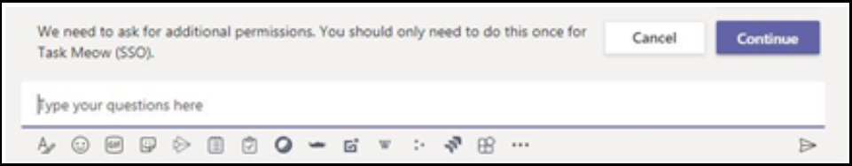
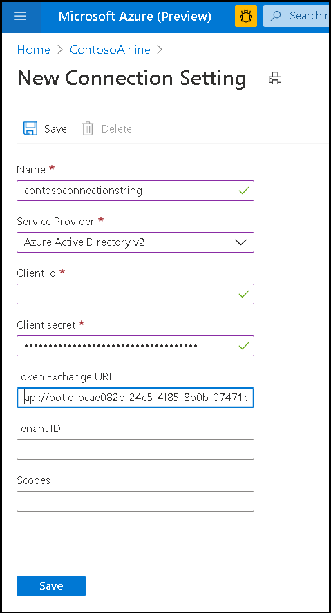

# <a name="single-sign-on-sso-support-for-bots"></a>Compatibilidad con inicio de sesión único (SSO) para bots

La autenticación de inicio de sesión único en Azure Active Directory (Azure AD) minimiza el número de veces que los usuarios necesitan escribir sus credenciales de inicio de sesión mediante la actualización automática del token de autenticación. Si los usuarios acuerdan usar la aplicación, no tendrán que volver a dar su consentimiento en otro dispositivo y se iniciará sesión automáticamente. El flujo es muy similar al soporte de SSO de la pestaña de Microsoft [Teams]( ../../../tabs/how-to/authentication/auth-aad-sso.md). La diferencia es el protocolo de cómo un bot solicita tokens y recibe respuestas.

OAuth 2,0 es un estándar abierto para la autenticación y autorización usado por Azure Active Directory (Azure AD) y muchos otros proveedores de identidades. Una descripción básica de OAuth 2,0 es un requisito previo para trabajar con la autenticación en Microsoft Teams.

## <a name="bot-sso-at-runtime"></a>Bot SSO en tiempo de ejecución


1. El bot envía un mensaje con un OAuthCard que contiene la `tokenExchangeResource` propiedad. Indica a teams que obtenga un token de autenticación para la aplicación bot. El usuario recibe mensajes en todos los extremos activos del usuario.

> [!NOTE]
> ✔ Un usuario puede tener más de un extremo activo a la vez.  
> ✔ El token de bot se recibe de todos los extremos activos del usuario.
> Actualmente, ✔ compatibilidad de inicio de sesión único requiere que la aplicación esté instalada en el ámbito personal.

2. Si es la primera vez que el usuario actual ha usado la aplicación de bot, habrá una solicitud de confirmación para el consentimiento (si se requiere consentimiento) o para controlar la autenticación de paso a paso (por ejemplo, la autenticación en dos fases).

3. Microsoft Teams solicita el token de aplicación bot desde el punto de conexión de Azure AD para el usuario actual.

4. Azure AD envía el token de la aplicación bot a la aplicación Teams.

5. Microsoft Teams envía el token al bot como parte del objeto de valor devuelto por la actividad Invoke con el nombre inicio de sesión/tokenExchange.
  
6. El token se analizará en la aplicación bot para extraer la información necesaria, como la dirección de correo electrónico del usuario.
  
## <a name="develop-an-single-sign-on-microsoft-teams-bot"></a>Desarrollar un bot? n de inicio de sesión único de Microsoft Teams
  
Los pasos siguientes: son necesarios para desarrollar un bot de Microsoft Teams de SSO:

1. [Crear una cuenta gratuita de Azure](#create-an-azure-account)
2. [Actualizar el manifiesto de la aplicación de Teams](#update-your-app-manifest)
3. [Agregar el código para solicitar y recibir el token de bot](#request-a-bot-token)

### <a name="create-an-azure-account"></a>Crear una cuenta de Azure

Este paso es similar al flujo de [flujo de SSO de pestañas](../../../tabs/how-to/authentication/auth-aad-sso.md) :

1. Obtener el [identificador de la aplicación de Azure ad](/azure/active-directory/develop/howto-create-service-principal-portal#get-values-for-signing-in).
2. Especifique los permisos que necesita la aplicación para el punto de conexión de Azure AD y, opcionalmente, Microsoft Graph.
3. [Conceda permisos](/azure/active-directory/develop/howto-create-service-principal-portal#configure-access-policies-on-resources) para equipos de escritorio, Web y aplicaciones móviles de Microsoft Teams.
4. Autorice previamente a los equipos seleccionando el botón **Agregar un ámbito** y, en el panel que se abre, escriba `access_as_user` como **nombre del ámbito**.

> [!IMPORTANT]
> * Si está creando un bot independiente, establezca el URI del identificador de aplicación en `api://botid-{YourBotId}` .
> * Si va a compilar una aplicación con un bot y una ficha, establezca el URI del identificador de aplicación en `api://fully-qualified-domain-name.com/botid-{YourBotId}` .

### <a name="update-your-app-manifest"></a>Actualizar el manifiesto de la aplicación

Agregue nuevas propiedades al manifiesto de Microsoft Teams:

**WebApplicationInfo** : el elemento primario de los siguientes elementos:

> [!div class="checklist"]
>
> * **ID** -el identificador de cliente de la aplicación. Se trata del identificador de la aplicación que ha obtenido como parte del registro de la aplicación con Azure AD.
>* **Resource** : el dominio y el subdominio de la aplicación. Se trata del mismo URI (incluido el `api://` Protocolo) que registró al crear el `scope` en el paso 6 anterior. No debe incluir la `access_as_user` ruta de acceso en el recurso. La parte de dominio de este URI debe coincidir con el dominio, incluidos los subdominios, que se usan en las direcciones URL del manifiesto de aplicación de Teams.

```json
"webApplicationInfo": {
  "id": "00000000-0000-0000-0000-000000000000",
  "resource": "api://subdomain.example.com/00000000-0000-0000-0000-000000000000"
}
```

### <a name="request-a-bot-token"></a>Solicitar un token de bot

La solicitud para obtener el token es una solicitud de mensaje POST normal (usando el esquema de mensaje existente). Se incluye en los datos adjuntos de un OAuthCard. El esquema de la clase OAuthCard se define en el [esquema de Bot 4,0 de Microsoft](/dotnet/api/microsoft.bot.schema.oauthcard?view=botbuilder-dotnet-stable&preserve-view=true) y es muy similar a una tarjeta de inicio de sesión. Si la `TokenExchangeResource` propiedad se rellena en la tarjeta, Microsoft Teams tratará esta solicitud como una adquisición de token silencioso. Para el canal de Teams, se respeta solo la `Id` propiedad, que identifica de forma única una solicitud de token.

Si es la primera vez que el usuario usa la aplicación y el consentimiento del usuario es necesario, se muestra al usuario un cuadro de diálogo para continuar con la experiencia de consentimiento similar a la siguiente. Cuando el usuario selecciona **continuar** , ocurren dos cosas diferentes en función de si el bot está definido o no y un botón de inicio de sesión en el OAuthCard.



Si el bot define un botón de inicio de sesión, el flujo de inicio de sesión de los bots se activará de forma similar al flujo de inicio de sesión desde un botón de tarjeta en una secuencia de mensajes. El desarrollador debe decidir qué permisos debe pedir al usuario que dé su consentimiento. Se recomienda este método si necesita un token con más permisos `openId` , por ejemplo, si desea intercambiar el token para los recursos de gráfico.

Si el bot no proporciona un botón de inicio de sesión en la tarjeta, desencadena el consentimiento del usuario para un conjunto mínimo de permisos. Este token es útil para la autenticación básica y para obtener la dirección de correo electrónico del usuario.

**Solicitud de token C# sin un botón de inicio de sesión** :

```csharp
var attachment = new Attachment
            {
                Content = new OAuthCard
                {
                    TokenExchangeResource = new TokenExchangeResource
                    {
                        Id = requestId
                    }
                },
                ContentType = OAuthCard.ContentType,
            };
            var activity = MessageFactory.Attachment(attachment);

            // NOTE: This activity needs to be sent in the 1:1 conversation between the bot and the user. 
            // If the bot supports group and channel scope, this code should be updated to send the request to the 1:1 chat. 

   await turnContext.SendActivityAsync(activity, cancellationToken);
```

#### <a name="receiving-the-token"></a>Recibir el token

La respuesta con el token se envía a través de una actividad Invoke con el mismo esquema que otras invocan actividades que los bots reciben hoy. La única diferencia es el nombre de invocación, **Inicio de sesión/tokenExchange** y el campo de **valor** que contendrá el **identificador** (una cadena) de la solicitud inicial para obtener el token y el campo de **token** (un valor de cadena que incluye el token). Tenga en cuenta que es posible que reciba varias respuestas para una solicitud determinada si el usuario tiene varios puntos de conexión activos. El usuario puede desduplicar las respuestas con el token.

**Código de C# que responde para controlar la actividad de invocación** :

```csharp
protected override async Task<InvokeResponse> OnInvokeActivity
  (ITurnContext<IInvokeActivity> turnContext, CancellationToken cancellationToken)
        {
            try
            {
                if (turnContext.Activity.Name == SignInConstants.TokenExchangeOperationName && turnContext.Activity.ChannelId == Channels.Msteams)
                {
                    await OnTokenResponse(turnContext, cancellationToken);
                    return new InvokeResponse() { Status = 200 };
                }
                else
                {
                    return await base.OnInvokeActivityAsync(turnContext, cancellationToken);
                }
            }
            catch (InvokeResponseException e)
            {
                return e.CreateInvokeResponse();
            }
        }
```

El `turnContext.activity.value` es del tipo [TokenExchangeInvokeRequest](/dotnet/api/microsoft.bot.schema.tokenexchangeinvokerequest?view=botbuilder-dotnet-stable&preserve-view=true) y contiene el token que puede usar el bot. Almacene los tokens de forma segura por motivos de rendimiento y actualizarlos.

### <a name="update-the-azure-portal-with-the-oauth-connection"></a>Actualizar Azure portal con la conexión de OAuth

1. En el portal de Azure, vuelva a navegar al registro de los **canales de bot** ?

2. Cambie a la hoja de **configuración** y elija **Agregar configuración** en la sección configuración de la conexión OAuth.


3. Complete el formulario de **configuración de conexión** :

> [!div class="checklist"]
>
> * Escriba un nombre para la nueva configuración de conexión. Este será el nombre al que se hace referencia en la configuración del código del servicio de bot en el **paso 5**.
> * En la lista desplegable proveedor de servicios, seleccione **Azure Active Directory V2**.
>* Escriba las credenciales de cliente de la aplicación AAD.
>* Para la dirección URL de intercambio de tokens, use el valor de ámbito definido en el paso anterior de la aplicación de AAD. La presencia de la dirección URL de Exchange token indica al SDK que esta aplicación de AAD está configurada para SSO.
>* Especifique "Common" como el **identificador de inquilino**.
>* Agregue todos los ámbitos configurados al especificar permisos para las API de flujo descendente de la aplicación de AAD. Con el identificador de cliente y el secreto de cliente proporcionados, el almacén de tokens intercambiará el token de un token de Graph con los permisos definidos.
>* Seleccione **Guardar**.



### <a name="update-the-auth-sample"></a>Actualizar la muestra de autenticación

Comience con el [ejemplo de auth de Teams](https://github.com/microsoft/BotBuilder-Samples/tree/master/samples/csharp_dotnetcore/46.teams-auth).

1. Actualice la TeamsBot para incluir lo siguiente. Para controlar el deduping de la solicitud entrante, vea a continuación:

```csharp
 protected override async Task OnSignInInvokeAsync(ITurnContext<IInvokeActivity> turnContext, CancellationToken cancellationToken)
        {
            await Dialog.RunAsync(turnContext, ConversationState.CreateProperty<DialogState>(nameof(DialogState)), cancellationToken);
        }
    protected override async Task OnTokenResponseEventAsync(ITurnContext<IEventActivity> turnContext, CancellationToken cancellationToken)
        {
            await Dialog.RunAsync(turnContext, ConversationState.CreateProperty<DialogState>(nameof(DialogState)), cancellationToken);
        }
```
  
2. Actualice el `appsettings.json` para incluir el `botId` , la contraseña y el nombre de conexión definidos anteriormente.
3. Actualice el manifiesto y asegúrese `token.botframework.com` de que está en la sección dominios válidos.
4. Comprimir el manifiesto con las imágenes de perfil e instalarlo en Teams.

#### <a name="additional-code-samples"></a>Ejemplos de código adicionales

* [Ejemplo de C# con bot Framework SDK](https://microsoft-my.sharepoint-df.com/:u:/p/vul/ETZQfeTViDlCv-frjgTIincB7dvk2HOnma1TLvcoeGGIxg?e=uPq62c).

* [Ejemplo de C# con bot Framework SDK para desduplicar la solicitud de token](https://microsoft.sharepoint.com/:u:/t/ExtensibilityandFundamentals/Ea36rUGiN1BGt1RiLOb-mY8BGMF8NwPtronYGym0sCGOTw?e=4bB682).

* [Ejemplo de C# sin usar el almacén de tokens del SDK de bot Framework](https://microsoft-my.sharepoint-df.com/:u:/p/tac/EceKDXrkMn5AuGbh6iGid8ABKEVQ6hkxArxK1y7-M8OVPw)
