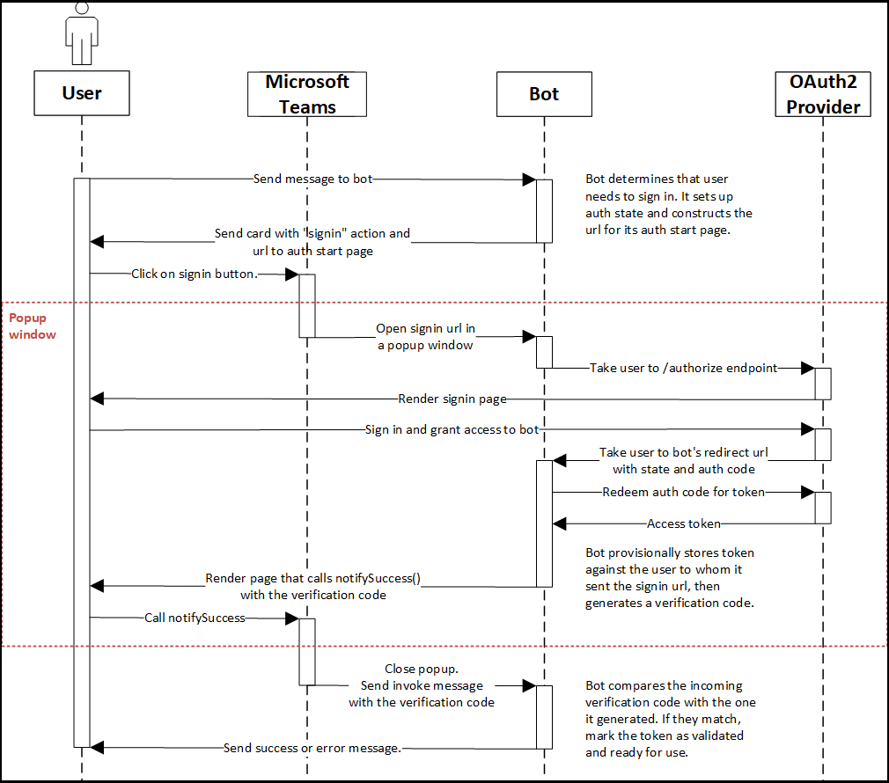

# Flujo de autenticación para bots en Microsoft Teams

OAuth 2.0 es un estándar abierto para la autenticación y autorización usado por Azure Active Directory (Azure AD) y otros muchos proveedores de identidad. Una comprensión básica de OAuth 2.0 es un requisito previo para trabajar con autenticación en Teams; [aquí hay una buena visión general](https://aaronparecki.com/oauth-2-simplified/) que es más fácil de seguir que la especificación [formal.](https://oauth.net/2/) El flujo de autenticación para pestañas y bots es un poco diferente (las pestañas son muy similares a los sitios web para que puedan usar OAuth 2.0 directamente, mientras que los bots no lo son y deben hacer algunas cosas de manera diferente), pero los conceptos principales son idénticos.

Consulte el ejemplo de [autenticación de Microsoft Teams de repositorio de](https://github.com/OfficeDev/Microsoft-Teams-Samples/tree/main/samples/app-auth/nodejs) GitHub para obtener un ejemplo que muestra el flujo de autenticación para bots que usan Node.js y el tipo de concesión de código de autorización de [OAuth 2.0](https://oauth.net/2/grant-types/authorization-code/).

1. El usuario envía un mensaje al bot.
2. El bot determina si el usuario necesita iniciar sesión.
   En este ejemplo, el bot almacena el token de acceso en su almacén de datos de usuario. Pide al usuario que inicie sesión si no tiene un token validado para el proveedor de identidades seleccionado. ([Ver código](https://github.com/OfficeDev/microsoft-teams-sample-auth-node/blob/469952a26d618dbf884a3be53c7d921cc580b1e2/src/utils/AuthenticationUtils.ts#L58-L76))
3. El bot construye la dirección URL a la página de inicio del flujo de autenticación y envía una tarjeta al usuario con una `signin` acción. ([Ver código](https://github.com/OfficeDev/microsoft-teams-sample-auth-node/blob/469952a26d618dbf884a3be53c7d921cc580b1e2/src/dialogs/BaseIdentityDialog.ts#L160-L190)) 
    Al igual que otros flujos de autenticación de aplicación en Teams, la página de inicio debe estar en un dominio que está en su lista y en el mismo dominio que `validDomains` la página de redirección posterior al inicio de sesión.
    > [!IMPORTANT] 
    > El flujo de concesión de código de autorización de OAuth 2.0 requiere un `state` parámetro en la solicitud de autenticación que contiene un token de sesión único para evitar un ataque de [falsificación de solicitud entre sitios.](https://en.wikipedia.org/wiki/Cross-site_request_forgery) El ejemplo utiliza un GUID generado aleatoriamente.
4. Cuando el usuario selecciona el botón *de inicio de sesión,* Teams abre una ventana emergente y navega a la página de inicio.
   > [!NOTE]
   > El tamaño de la ventana emergente se puede controlar a través de parámetros de cadena de consulta de ancho y alto en la dirección URL. Por ejemplo, si agrega width=500 y height=500, el tamaño de la ventana emergente es de 500x500 píxeles. Teams muestra la ventana emergente con el tamaño de píxel dado, hasta un máximo que es un porcentaje del tamaño de la ventana principal.

5. La página de inicio redirige al usuario al punto de conexión del proveedor de `authorize` identidades. ([Ver código](https://github.com/OfficeDev/microsoft-teams-sample-auth-node/blob/469952a26d618dbf884a3be53c7d921cc580b1e2/public/html/auth-start.html#L51-L56))
6. En el sitio del proveedor, el usuario inicia sesión y concede acceso al bot.
7. El proveedor lleva al usuario a la página de redirección OAuth del bot con un código de autorización.
8. El bot canjea el código de autorización de un token de acceso y asocia **provisionalmente** el token con el usuario que inició el flujo de inicio de sesión. A continuación, lo llamamos un *token provisional.*
    * En el ejemplo, el bot asocia el valor del `state` parámetro con el identificador del usuario que inició el proceso de inicio de sesión para que pueda coincidir posteriormente con el valor devuelto por el proveedor de `state` identidades. ([Ver código](https://github.com/OfficeDev/microsoft-teams-sample-auth-node/blob/469952a26d618dbf884a3be53c7d921cc580b1e2/src/AuthBot.ts#L70-L99))
      > [!IMPORTANT] 
      > El bot almacena el token que recibe del proveedor de identidades y lo asocia con un usuario específico, pero se marca como "validación pendiente". 
    * El token provisional no se puede usar sin más validación.
      1. **Valide lo que se recibe del proveedor de identidades.** El valor del `state` parámetro debe confirmarse con respecto a lo que se guardó anteriormente. 
      1. **Valide lo que se recibe de Teams.** Se realiza una validación [de autenticación en dos pasos](https://en.wikipedia.org/wiki/Man-in-the-middle_attack) para asegurarse de que el usuario que autorizó el bot con el proveedor de identidades es el mismo usuario que está chateando con el bot. Esto protege contra los ataques [de hombre en el medio](https://en.wikipedia.org/wiki/Man-in-the-middle_attack) y [phishing.](https://en.wikipedia.org/wiki/Phishing) El bot genera un código de verificación y lo almacena, asociado con el usuario. El código de verificación se envía automáticamente por Teams como se describe a continuación. ([Ver código](https://github.com/OfficeDev/microsoft-teams-sample-auth-node/blob/469952a26d618dbf884a3be53c7d921cc580b1e2/src/AuthBot.ts#L100-L113))
9. La devolución de llamada de OAuth representa una página que llama `notifySuccess("<verification code>")` a . ([Ver código](https://github.com/OfficeDev/microsoft-teams-sample-auth-node/blob/master/src/views/oauth-callback-success.hbs))
10. Teams cierra la ventana emergente y envía el `<verification code>` enviado al `notifySuccess()` bot. El bot recibe un mensaje [de invocación](/bot-framework/dotnet/bot-builder-dotnet-activities#invoke) con `name = signin/verifyState` .
11. El bot comprueba el código de verificación entrante con el código de verificación almacenado con el token provisional del usuario. ([Ver código](https://github.com/OfficeDev/microsoft-teams-sample-auth-node/blob/469952a26d618dbf884a3be53c7d921cc580b1e2/src/dialogs/BaseIdentityDialog.ts#L127-L140))
12. Si coinciden, el bot marca el token como validado y listo para su uso. De lo contrario, se produce un error en el flujo de autenticación y el bot elimina el token provisional.

    > [!NOTE]
    > Si experimenta problemas con la autenticación en dispositivos móviles, asegúrese de que el SDK de JavaScript se actualice a la versión 1.4.1 o posterior.

## Ejemplo de código

Código de ejemplo que muestra el proceso de autenticación de bots:

| **Nombre de la muestra** | **Descripción** | **Node.js** | **.NET** | **Python** |
|-----------------|----------------|--------------|----------|-----------|
| autenticación Teams | En este ejemplo se muestra la autenticación en aplicaciones Microsoft Teams. | [View](https://github.com/OfficeDev/microsoft-teams-sample-auth-node) | | |
| Autenticación de bots | Este ejemplo muestra cómo usar la autenticación para un runnning de bot en Microsoft Teams | [View](https://github.com/microsoft/BotBuilder-Samples/tree/main/samples/javascript_nodejs/46.teams-auth) | [View](https://github.com/microsoft/BotBuilder-Samples/tree/main/samples/csharp_dotnetcore/46.teams-auth) | [View](https://github.com/microsoft/BotBuilder-Samples/tree/main/samples/python/46.teams-auth)

## Vea también

[Agregue autenticación al bot de Teams](add-authentication.md)
