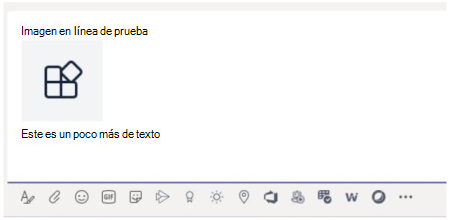

# <a name="send-and-receive-files-through-the-bot"></a>Enviar y recibir archivos a través del bot

> [!IMPORTANT]
> Los artículos de este documento se basan en el SDK de Bot Framework de v4.

Hay dos maneras de enviar y recibir archivos desde un bot:

* [**Usar las API de Microsoft Graph:**](#use-the-graph-apis) este método funciona para bots en todos Microsoft Teams ámbitos:
  * `personal`
  * `channel`
  * `groupchat`

* [**Use las API Teams bot:**](#use-the-teams-bot-apis) solo admiten archivos en `personal` contexto.

## <a name="use-the-graph-apis"></a>Usar las API Graph de datos

Publique mensajes con datos adjuntos de tarjeta que hacen referencia a archivos SharePoint existentes, con las API de Graph para OneDrive [y SharePoint](/onedrive/developer/rest-api/). Para usar las API Graph, obtenga acceso a cualquiera de las siguientes a través del flujo de autorización estándar de OAuth 2.0:

* Carpeta de OneDrive y `personal` archivos de un `groupchat` usuario.
* Los archivos del canal de un equipo para los `channel` archivos.

Graph API funcionan en todos Teams ámbitos. Para obtener más información, vea [Enviar datos adjuntos de archivos de mensajes de chat](/graph/api/chatmessage-post?view=graph-rest-beta&tabs=http#example-4-file-attachments&preserve-view=true).

Como alternativa, puede enviar archivos a y recibir archivos de un bot mediante las API Teams bot.

## <a name="use-the-teams-bot-apis"></a>Usar las API Teams bot

> [!NOTE]
> Teams API de bots solo funcionan en el `personal` contexto. No funcionan en el contexto `channel` o `groupchat` .

Con Teams API, el bot `personal` puede enviar y recibir directamente archivos con usuarios en el contexto, también conocido como chats personales. Implemente características, como informes de gastos, reconocimiento de imágenes, archivo de archivo y firmas electrónicas que impliquen la edición del contenido del archivo. Los archivos compartidos en Teams suelen aparecer como tarjetas y permiten la visualización enriquezca desde la aplicación.

En las secciones siguientes se describe cómo enviar contenido de archivo como interacción directa del usuario, como enviar un mensaje. Esta API se proporciona como parte de la plataforma Teams bot.

### <a name="configure-the-bot-to-support-files"></a>Configurar el bot para admitir archivos

Para enviar y recibir archivos en el bot, establezca la `supportsFiles` propiedad del manifiesto en `true`. Esta propiedad se describe en la [sección bots](~/resources/schema/manifest-schema.md#bots) de la referencia manifest.

La definición tiene este aspecto, `"supportsFiles": true`. Si el bot no habilita `supportsFiles`, las características enumeradas en esta sección no funcionan.

### <a name="receive-files-in-personal-chat"></a>Recibir archivos en chat personal

Cuando un usuario envía un archivo al bot, el archivo se carga por primera vez en el OneDrive de almacenamiento empresarial del usuario. A continuación, el bot recibe una actividad de mensaje que notifica al usuario sobre la carga del usuario. La actividad contiene metadatos de archivo, como su nombre y la dirección URL de contenido. El usuario puede leer directamente desde esta dirección URL para capturar su contenido binario.

#### <a name="message-activity-with-file-attachment-example"></a>Ejemplo de actividad de mensaje con datos adjuntos de archivo

El siguiente código muestra un ejemplo de actividad de mensaje con datos adjuntos de archivo:

```json
{
  "attachments": [{
    "contentType": "application/vnd.microsoft.teams.file.download.info",
    "contentUrl": "https://contoso.sharepoint.com/personal/johnadams_contoso_com/Documents/Applications/file_example.txt",
    "name": "file_example.txt",
    "content": {
      "downloadUrl" : "https://download.link",
      "uniqueId": "1150D938-8870-4044-9F2C-5BBDEBA70C9D",
      "fileType": "txt",
      "etag": "123"
    }
  }]
}
```

En la tabla siguiente se describen las propiedades de contenido de los datos adjuntos:

| Propiedad | Objetivo |
| --- | --- |
| `downloadUrl` | OneDrive url para capturar el contenido del archivo. El usuario puede emitir una directamente `HTTP GET` desde esta dirección URL. |
| `uniqueId` | Identificador de archivo único. Este es el OneDrive elemento de unidad, en caso de que el usuario envíe un archivo al bot. |
| `fileType` | Tipo de archivo, como .pdf o .docx. |

Como práctica recomendada, confirme la carga del archivo enviando un mensaje de vuelta al usuario.

### <a name="upload-files-to-personal-chat"></a>Upload archivos al chat personal

Para cargar un archivo a un usuario:

1. Enviar un mensaje al usuario que solicita permiso para escribir el archivo. Este mensaje debe contener datos `FileConsentCard` adjuntos con el nombre del archivo que se va a cargar.
2. Si el usuario acepta la descarga de archivos, el bot recibe una actividad de invocación con una dirección URL de ubicación.
3. Para transferir el archivo, el bot realiza una `HTTP POST` operación directamente en la dirección URL de ubicación proporcionada.
4. Opcionalmente, quite la tarjeta de consentimiento original si no desea que el usuario acepte más cargas del mismo archivo.

#### <a name="message-requesting-permission-to-upload"></a>Mensaje que solicita permiso para cargar

El siguiente mensaje de escritorio contiene un objeto de datos adjuntos sencillo que solicita permiso al usuario para cargar el archivo:


El siguiente mensaje móvil contiene un objeto attachment que solicita permiso al usuario para cargar el archivo:


```json
{
  "attachments": [{
    "contentType": "application/vnd.microsoft.teams.card.file.consent",
    "name": "file_example.txt",
    "content": {
      "description": "<Purpose of the file, such as: this is your monthly expense report>",
      "sizeInBytes": 1029393,
      "acceptContext": {
      },
      "declineContext": {
      }
    }
  }]
}
```

En la tabla siguiente se describen las propiedades de contenido de los datos adjuntos:

| Propiedad | Objetivo |
| --- | --- |
| `description` | Describe el propósito del archivo o resume su contenido. |
| `sizeInBytes` | Proporciona al usuario una estimación del tamaño del archivo y la cantidad de espacio que ocupa OneDrive. |
| `acceptContext` | Contexto adicional que se transmite silenciosamente al bot cuando el usuario acepta el archivo. |
| `declineContext` | Contexto adicional que se transmite silenciosamente al bot cuando el usuario rechaza el archivo. |

#### <a name="invoke-activity-when-the-user-accepts-the-file"></a>Invocar actividad cuando el usuario acepta el archivo

Se envía una actividad de invocación al bot si el usuario acepta el archivo y cuándo lo acepta. Contiene la dirección URL OneDrive para la Empresa marcador de posición que el bot puede emitir para `PUT` transferir el contenido del archivo. Para obtener información sobre la carga en la dirección URL OneDrive, vea [upload bytes to the upload session](/onedrive/developer/rest-api/api/driveitem_createuploadsession#upload-bytes-to-the-upload-session).

El código siguiente muestra un ejemplo de una versión concisa de la actividad de invocación que recibe el bot:

```json
{
  "name": "fileConsent/invoke",
  "value": {
    "type": "fileUpload",
    "action": "accept",
    "context": {
    },
    "uploadInfo": {
      "contentUrl": "https://contoso.sharepoint.com/personal/johnadams_contoso_com/Documents/Applications/file_example.txt",
      "name": "file_example.txt",
      "uploadUrl": "https://upload.link",
      "uniqueId": "1150D938-8870-4044-9F2C-5BBDEBA70C8C",
      "fileType": "txt",
      "etag": "123"
    }
  }
}
```

Del mismo modo, si el usuario rechaza el archivo, el bot recibe el siguiente evento con el mismo nombre de actividad general:

```json
{
  "name": "fileConsent/invoke",
  "value": {
    "type": "fileUpload",
    "action": "decline",
    "context": {
    }
  }
}
```

### <a name="notifying-the-user-about-an-uploaded-file"></a>Notificar al usuario acerca de un archivo cargado

Después de cargar un archivo en el OneDrive, envíe un mensaje de confirmación al usuario. El mensaje debe contener los siguientes `FileCard` datos adjuntos que el usuario puede seleccionar, ya sea para obtener una vista previa o abrirla en OneDrive o descargar localmente:

```json
{
  "attachments": [{
    "contentType": "application/vnd.microsoft.teams.card.file.info",
    "contentUrl": "https://contoso.sharepoint.com/personal/johnadams_contoso_com/Documents/Applications/file_example.txt",
    "name": "file_example.txt",
    "content": {
      "uniqueId": "1150D938-8870-4044-9F2C-5BBDEBA70C8C",
      "fileType": "txt",
    }
  }]
}
```

En la tabla siguiente se describen las propiedades de contenido de los datos adjuntos:

| Propiedad | Objetivo |
| --- | --- |
| `uniqueId` | OneDrive o SharePoint id. de elemento de unidad. |
| `fileType` | Tipo de archivo, como .pdf o .docx. |

### <a name="fetch-inline-images-from-message"></a>Capturar imágenes en línea del mensaje

Capturar imágenes en línea que forman parte del mensaje mediante el token de acceso del bot.



El siguiente código muestra un ejemplo de captura de imágenes en línea desde el mensaje:

```csharp
private async Task ProcessInlineImage(ITurnContext<IMessageActivity> turnContext, CancellationToken cancellationToken)
{
    var attachment = turnContext.Activity.Attachments[0];
    var client = _clientFactory.CreateClient();
    // Get Bot's access token to fetch inline image. 
    var token = await new MicrosoftAppCredentials(microsoftAppId, microsoftAppPassword).GetTokenAsync();
    client.DefaultRequestHeaders.Authorization = new AuthenticationHeaderValue("Bearer", token);
    var responseMessage = await client.GetAsync(attachment.ContentUrl);
    // Save the inline image to Files directory.
    var filePath = Path.Combine("Files", "ImageFromUser.png");
    using (var fileStream = new FileStream(filePath, FileMode.Create, FileAccess.Write, FileShare.None))
    {
        await responseMessage.Content.CopyToAsync(fileStream);
    }
    // Create reply with image.
    var reply = MessageFactory.Text($"Attachment of {attachment.ContentType} type and size of {responseMessage.Content.Headers.ContentLength} bytes received.");
    reply.Attachments = new List<Attachment>() { 
        GetInlineAttachment() 
    };
    await turnContext.SendActivityAsync(reply, cancellationToken);
}
private static Attachment GetInlineAttachment()
{
    var imagePath = Path.Combine("Files", "ImageFromUser.png");
    var imageData = Convert.ToBase64String(File.ReadAllBytes(imagePath));
    return new Attachment
    {
        Name = @"ImageFromUser.png",
        ContentType = "image/png",
        ContentUrl = $"data:image/png;base64,{imageData}",
    };
}
```

### <a name="basic-example-in-c"></a>Ejemplo básico en C #

El siguiente código muestra un ejemplo de cómo controlar las cargas de archivos y enviar solicitudes de consentimiento de archivos en el cuadro de diálogo del bot:

```csharp

protected override async Task OnMessageActivityAsync(ITurnContext<IMessageActivity> turnContext, CancellationToken cancellationToken)
{
    if (turnContext.Activity.Attachments?[0].ContentType.Contains("image/*") == true)
    {
        // Inline image.
        await ProcessInlineImage(turnContext, cancellationToken);
    }
    else
    {
        string filename = "teams-logo.png";
        string filePath = Path.Combine("Files", filename);
        long fileSize = new FileInfo(filePath).Length;
        await SendFileCardAsync(turnContext, filename, fileSize, cancellationToken);
    }
}
private async Task ProcessInlineImage(ITurnContext<IMessageActivity> turnContext, CancellationToken cancellationToken)
{
    var attachment = turnContext.Activity.Attachments[0];
    var client = _clientFactory.CreateClient();
    // Get Bot's access token to fetch inline image. 
    var token = await new MicrosoftAppCredentials(microsoftAppId, microsoftAppPassword).GetTokenAsync();
    client.DefaultRequestHeaders.Authorization = new AuthenticationHeaderValue("Bearer", token);
    var responseMessage = await client.GetAsync(attachment.ContentUrl);
    // Save the inline image to Files directory.
    var filePath = Path.Combine("Files", "ImageFromUser.png");
    using (var fileStream = new FileStream(filePath, FileMode.Create, FileAccess.Write, FileShare.None))
    {
        await responseMessage.Content.CopyToAsync(fileStream);
    }
    // Create reply with image.
    var reply = MessageFactory.Text($"Attachment of {attachment.ContentType} type and size of {responseMessage.Content.Headers.ContentLength} bytes received.");
    reply.Attachments = new List<Attachment>() { GetInlineAttachment() };
    await turnContext.SendActivityAsync(reply, cancellationToken);
}
private static Attachment GetInlineAttachment()
{
    var imagePath = Path.Combine("Files", "ImageFromUser.png");
    var imageData = Convert.ToBase64String(File.ReadAllBytes(imagePath));
    return new Attachment
    {
        Name = @"ImageFromUser.png",
        ContentType = "image/png",
        ContentUrl = $"data:image/png;base64,{imageData}",
    };
}
private async Task SendFileCardAsync(ITurnContext turnContext, string filename, long filesize, CancellationToken cancellationToken)
{
    var consentContext = new Dictionary<string, string>
    {
        { 
            "filename", filename 
        },
    };
    var fileCard = new FileConsentCard
    {
        Description = "This is the file I want to send you",
        SizeInBytes = filesize,
        AcceptContext = consentContext,
        DeclineContext = consentContext,
    };
    var asAttachment = new Attachment
    {
        Content = fileCard,
        ContentType = FileConsentCard.ContentType,
        Name = filename,
    };
    var replyActivity = turnContext.Activity.CreateReply();
    replyActivity.Attachments = new List<Attachment>() { asAttachment };
    await turnContext.SendActivityAsync(replyActivity, cancellationToken);
}
```

## <a name="code-sample"></a>Ejemplo de código

En el siguiente ejemplo de código se muestra cómo obtener el consentimiento del archivo y cargar archivos a Teams desde un bot:

|**Ejemplo de nombre** | **Descripción** | **.NET** | **Javascript** | **Python**|
|----------------|-----------------|--------------|----------------|-----------|
| File upload | Muestra cómo obtener el consentimiento de archivos y cargar archivos a Teams desde un bot. Además, cómo recibir un archivo enviado a un bot. | [View](https://github.com/microsoft/BotBuilder-Samples/blob/main/samples/csharp_dotnetcore/56.teams-file-upload) | [View](https://github.com/microsoft/BotBuilder-Samples/blob/main/samples/javascript_nodejs/56.teams-file-upload) | [View](https://github.com/microsoft/BotBuilder-Samples/blob/main/samples/python/56.teams-file-upload) |

## <a name="step-by-step-guide"></a>Guía paso a paso

Siga la [guía paso a paso para](../../sbs-file-handling-in-bot.yml) cargar archivos a Teams desde un bot.

## <a name="next-step"></a>Paso siguiente

> [!div class="nextstepaction"]
> [Optimizar un bot con la limitación de volumen en Teams](~/bots/how-to/rate-limit.md)
