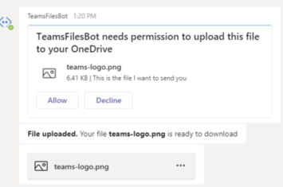

# <a name="send-and-receive-files-with-a-bot"></a><span data-ttu-id="fa6ca-103">Enviar y recibir archivos con un bot</span><span class="sxs-lookup"><span data-stu-id="fa6ca-103">Send and receive files with a bot</span></span>

[!INCLUDE [v4 to v3 pointer](~/includes/v4-to-v3-pointer-bots.md)]

<span data-ttu-id="fa6ca-104">En este artículo se describe cómo intercambiar archivos con un usuario en una conversación de uno a uno con el bot.</span><span class="sxs-lookup"><span data-stu-id="fa6ca-104">This article describe how to exchange files with a user in a one-to-one chat with your bot.</span></span> <span data-ttu-id="fa6ca-105">No puede usar esta funcionalidad para intercambiar archivos en un equipo o un chat en grupo.</span><span class="sxs-lookup"><span data-stu-id="fa6ca-105">You cannot use this functionality to exchange files in a team or group chat.</span></span>

<span data-ttu-id="fa6ca-106">Hay dos métodos para elegir:</span><span class="sxs-lookup"><span data-stu-id="fa6ca-106">There are two approaches to choose from:</span></span>

1. <span data-ttu-id="fa6ca-107">Las **API de Microsoft Graph**, que admiten los tres `personal`ámbitos `channel`:, y`groupchat`</span><span class="sxs-lookup"><span data-stu-id="fa6ca-107">**Microsoft Graph APIs**, which supports all three scopes: `personal`, `channel`, and `groupchat`</span></span>
2. <span data-ttu-id="fa6ca-108">Las **API de bot de Teams**, `personal` que solo admiten el ámbito.</span><span class="sxs-lookup"><span data-stu-id="fa6ca-108">**Teams bot APIs**, which only support the `personal` scope.</span></span>

> [!NOTE] 
> <span data-ttu-id="fa6ca-109">No se admite el envío y la recepción de archivos en bots en dispositivos móviles.</span><span class="sxs-lookup"><span data-stu-id="fa6ca-109">Sending and receiving files to bots on mobile devices is not supported.</span></span>

## <a name="using-the-microsoft-graph-apis"></a><span data-ttu-id="fa6ca-110">Uso de las API de Microsoft Graph</span><span class="sxs-lookup"><span data-stu-id="fa6ca-110">Using the Microsoft Graph APIs</span></span>

<span data-ttu-id="fa6ca-111">Puede publicar mensajes con datos adjuntos de tarjeta que hacen referencia a archivos existentes de SharePoint mediante las API de Microsoft Graph para [OneDrive y SharePoint](https://docs.microsoft.com/onedrive/developer/rest-api/).</span><span class="sxs-lookup"><span data-stu-id="fa6ca-111">You can post messages with card attachments referencing existing SharePoint files using the Microsoft Graph APIs for [OneDrive and SharePoint](https://docs.microsoft.com/onedrive/developer/rest-api/).</span></span> <span data-ttu-id="fa6ca-112">El uso de las API de Graph requiere obtener acceso autenticado, a través del flujo de OAuth 2,0 estándar, para:</span><span class="sxs-lookup"><span data-stu-id="fa6ca-112">Using the Graph APIs requires obtaining authenticated access, through the standard OAuth 2.0 flow, to:</span></span>

- <span data-ttu-id="fa6ca-113">La carpeta de OneDrive de un usuario `personal` ( `groupchat` para y archivos).</span><span class="sxs-lookup"><span data-stu-id="fa6ca-113">A user's OneDrive folder (for `personal` and `groupchat` files).</span></span>
- <span data-ttu-id="fa6ca-114">O a los archivos de los canales de un equipo ( `channel` para archivos).</span><span class="sxs-lookup"><span data-stu-id="fa6ca-114">Or to the files in a team's channels (for `channel` files).</span></span> <span data-ttu-id="fa6ca-115">Este método funciona en todos los ámbitos de Teams.</span><span class="sxs-lookup"><span data-stu-id="fa6ca-115">This method works in all Teams scopes.</span></span>

## <a name="using-the-teams-bot-apis"></a><span data-ttu-id="fa6ca-116">Uso de las API de bot de Teams</span><span class="sxs-lookup"><span data-stu-id="fa6ca-116">Using the Teams Bot APIs</span></span>

<span data-ttu-id="fa6ca-117">El bot puede enviar y recibir archivos directamente con usuarios en el `personal` contexto, también conocido como chats personales, mediante las API de Microsoft Teams.</span><span class="sxs-lookup"><span data-stu-id="fa6ca-117">Your bot can directly send and receive files with users in the `personal` context, also known as personal chats, using Teams APIs.</span></span> <span data-ttu-id="fa6ca-118">Esto le permite implementar escenarios como informes de gastos, reconocimiento de imágenes, archivado de archivos, firmas electrónicas y otros escenarios que impliquen la manipulación directa del contenido de los archivos.</span><span class="sxs-lookup"><span data-stu-id="fa6ca-118">This lets you implement scenarios such expense reporting, image recognition, file archival, e-signatures, and other scenarios involving direct manipulation of file content.</span></span> <span data-ttu-id="fa6ca-119">Los archivos compartidos en Microsoft Teams normalmente aparecen como tarjetas y permiten la visualización en una aplicación enriquecida.</span><span class="sxs-lookup"><span data-stu-id="fa6ca-119">Files shared in Teams typically appear as cards, and allow rich in-app viewing.</span></span>  <span data-ttu-id="fa6ca-120">La API se proporciona como parte de la **plataforma de robots de Microsoft Teams**.</span><span class="sxs-lookup"><span data-stu-id="fa6ca-120">The API is provided as part of the **Microsoft Teams Bot Platform**.</span></span>

> [!NOTE]
> <span data-ttu-id="fa6ca-121">Este método sólo funciona en el `personal` contexto.</span><span class="sxs-lookup"><span data-stu-id="fa6ca-121">This method works only in the `personal` context.</span></span> <span data-ttu-id="fa6ca-122">No funciona en el `channel` contexto o. `groupchat`</span><span class="sxs-lookup"><span data-stu-id="fa6ca-122">It does not work in the `channel` or `groupchat` context.</span></span>

### <a name="configure-your-bot-to-support-files"></a><span data-ttu-id="fa6ca-123">Configurar el bot para que admita archivos</span><span class="sxs-lookup"><span data-stu-id="fa6ca-123">Configure your bot to support files</span></span>

<span data-ttu-id="fa6ca-124">Para enviar y recibir archivos en el bot, debe establecer la `supportsFiles` propiedad en el manifiesto en. `true`</span><span class="sxs-lookup"><span data-stu-id="fa6ca-124">To send and receive files in your bot, you must set the `supportsFiles` property in the manifest to `true`.</span></span> <span data-ttu-id="fa6ca-125">Esta propiedad se describe en la sección [bots](https://docs.microsoft.com/microsoftteams/platform/resources/schema/manifest-schema#bots
) de la referencia del manifiesto.</span><span class="sxs-lookup"><span data-stu-id="fa6ca-125">This property is described in the [bots](https://docs.microsoft.com/microsoftteams/platform/resources/schema/manifest-schema#bots
) section of the Manifest reference.</span></span>

<span data-ttu-id="fa6ca-126">La configuración tiene un aspecto similar `"supportsFiles": true`a este:.</span><span class="sxs-lookup"><span data-stu-id="fa6ca-126">The setting looks like this: `"supportsFiles": true`.</span></span>

## <a name="invoke-activity-when-the-user-accepts-the-file-upload"></a><span data-ttu-id="fa6ca-127">Invocar la actividad cuando el usuario acepta la carga de archivos</span><span class="sxs-lookup"><span data-stu-id="fa6ca-127">Invoke activity when the user accepts the file upload</span></span>

<span data-ttu-id="fa6ca-128">El archivo se carga en el almacenamiento de **OneDrive** del usuario después de que se emita el consentimiento para cargarlo.</span><span class="sxs-lookup"><span data-stu-id="fa6ca-128">The file is uploaded to the user's **OneDrive** storage after the consent to upload is issued.</span></span> <span data-ttu-id="fa6ca-129">El bot recibirá una actividad de mensaje que contiene los metadatos del archivo, como su nombre y la dirección URL del contenido.</span><span class="sxs-lookup"><span data-stu-id="fa6ca-129">The bot will receive a message activity which contains file metadata, such as its name and the content URL.</span></span> <span data-ttu-id="fa6ca-130">Siga estos pasos:</span><span class="sxs-lookup"><span data-stu-id="fa6ca-130">Follow these steps:</span></span>

1. <span data-ttu-id="fa6ca-131">Envíe un mensaje al usuario que solicita permiso para escribir el archivo.</span><span class="sxs-lookup"><span data-stu-id="fa6ca-131">Send a message to the user requesting permission to write the file.</span></span> <span data-ttu-id="fa6ca-132">Este mensaje debe contener `FileConsentCard` datos adjuntos con el nombre del archivo que se va a cargar.</span><span class="sxs-lookup"><span data-stu-id="fa6ca-132">This message must contain a `FileConsentCard` attachment with the name of the file to be uploaded.</span></span>

    

2. <span data-ttu-id="fa6ca-134">Si el usuario acepta la carga de archivos, el bot recibirá una actividad de *invocación* con una dirección URL de ubicación.</span><span class="sxs-lookup"><span data-stu-id="fa6ca-134">If the user accepts the file upload, your bot will receive an *Invoke* activity with a location URL.</span></span>
3. <span data-ttu-id="fa6ca-135">Para transferir el archivo, el bot realiza una `HTTP POST` directamente en la dirección URL de ubicación proporcionada.</span><span class="sxs-lookup"><span data-stu-id="fa6ca-135">To transfer the file, your bot performs an `HTTP POST` directly into the provided location URL.</span></span>
4. <span data-ttu-id="fa6ca-136">Opcionalmente, puede quitar la tarjeta de consentimiento original si no desea permitir que el usuario acepte más cargas del mismo archivo.</span><span class="sxs-lookup"><span data-stu-id="fa6ca-136">Optionally, you can remove the original consent card if you do not want to allow the user to accept further uploads of the same file.</span></span>
 
<span data-ttu-id="fa6ca-137">En el ejemplo siguiente se muestra una versión abreviada de la actividad Invoke que recibirá el bot:</span><span class="sxs-lookup"><span data-stu-id="fa6ca-137">The following example shows an abridged version of the invoke activity that your bot will receive:</span></span>

```json
{
    "name": "fileConsent/invoke",
    "type": "invoke",
    "timestamp": "2019-10-24T20:22:37.875Z",
    "localTimestamp": "2019-10-24T13:22:37.875-07:00",
    "id": "f:8805947989118514037",

    ...

    "value": {
        "type": "fileUpload",
        "action": "accept",
        "context": {
            "filename": "teams-logo.png"
        },
        "uploadInfo": {
            "contentUrl": "https://contoso.sharepoint.com//personal/<user alias>/Documents/Applications/TeamsFilesBot/teams-logo.png",
            "name": "teams-logo.png",
            "uploadUrl": "https://contoso.sharepoint.com//personal/<user alias>/_api/v2.0/drive/items/01FED6KHQXVVCUCI6XVJCZZMU2WMUSA6JS/uploadSession?guid=<GUID>",
            "uniqueId": "<Unique ID>",
            "fileType": "png"
        }
    },

    "locale": "en-US"
}

```

<span data-ttu-id="fa6ca-138">En la tabla siguiente se describen las propiedades de contenido de los datos adjuntos:</span><span class="sxs-lookup"><span data-stu-id="fa6ca-138">The following table describes the content properties of the attachment:</span></span>

| <span data-ttu-id="fa6ca-139">Propiedad</span><span class="sxs-lookup"><span data-stu-id="fa6ca-139">Property</span></span> | <span data-ttu-id="fa6ca-140">Objetivo</span><span class="sxs-lookup"><span data-stu-id="fa6ca-140">Purpose</span></span> |
| --- | --- |
| `uploadUrl` | <span data-ttu-id="fa6ca-141">Dirección URL de OneDrive para cargar el contenido del archivo.</span><span class="sxs-lookup"><span data-stu-id="fa6ca-141">OneDrive URL for uploading the content of the file.</span></span> |
| `uniqueId` | <span data-ttu-id="fa6ca-142">IDENTIFICADOR de archivo único.</span><span class="sxs-lookup"><span data-stu-id="fa6ca-142">Unique file ID.</span></span> <span data-ttu-id="fa6ca-143">Este será el identificador de elemento de la unidad de OneDrive.</span><span class="sxs-lookup"><span data-stu-id="fa6ca-143">This will be the OneDrive drive item ID.</span></span> |
| `fileType` | <span data-ttu-id="fa6ca-144">Tipo de extensión de archivo, como PDF o \* PNG \* \*.</span><span class="sxs-lookup"><span data-stu-id="fa6ca-144">File extension type, such as pdf or \*png\*\*.</span></span> |

<span data-ttu-id="fa6ca-145">Como práctica recomendada, debe confirmar la carga del archivo mediante el envío de un mensaje al usuario.</span><span class="sxs-lookup"><span data-stu-id="fa6ca-145">As a best practice, you should acknowledge the file upload by sending back a message to the user.</span></span>

<span data-ttu-id="fa6ca-146">Si el usuario rechaza el archivo, el bot recibirá el evento siguiente, con el mismo nombre de actividad general:</span><span class="sxs-lookup"><span data-stu-id="fa6ca-146">If the user declines the file, your bot will receive the following event, with the same overall activity name:</span></span>

```json
{
  "name": "fileConsent/invoke",
  "value": {
    "type": "fileUpload",
    "action": "decline",
    "context": {
      ...
    }
  }
}
```

### <a name="notifying-the-user-about-an-uploaded-file"></a><span data-ttu-id="fa6ca-147">Notificar al usuario sobre un archivo cargado</span><span class="sxs-lookup"><span data-stu-id="fa6ca-147">Notifying the user about an uploaded file</span></span>

<span data-ttu-id="fa6ca-148">Después de cargar un archivo en el OneDrive del usuario, debe enviar un mensaje de confirmación al usuario.</span><span class="sxs-lookup"><span data-stu-id="fa6ca-148">After uploading a file to the user's OneDrive, you should send a confirmation message to the user.</span></span> <span data-ttu-id="fa6ca-149">Este mensaje debe contener `FileCard` datos adjuntos en los que el usuario puede hacer clic, ya sea para obtener una vista previa, abrirlo en OneDrive o descargarse de forma local.</span><span class="sxs-lookup"><span data-stu-id="fa6ca-149">This message should contain  a `FileCard` attachment that the user can click on, either to preview it, open it in OneDrive, or download locally.</span></span> <span data-ttu-id="fa6ca-150">Este es un ejemplo.</span><span class="sxs-lookup"><span data-stu-id="fa6ca-150">The following is an example.</span></span> 

```json
{
  "attachments": [{
    "contentType": "application/vnd.microsoft.teams.card.file.info",
    "contentUrl": "https://contoso.sharepoint.com/personal/johnadams_contoso_com/Documents/Applications/file_example.txt",
    "name": "file_example.txt",
    "content": {
      "uniqueId": "<unique ID>",
      "fileType": "png",
    }
  }]
}

```

<span data-ttu-id="fa6ca-151">En la tabla siguiente se describen las propiedades de contenido de los datos adjuntos:</span><span class="sxs-lookup"><span data-stu-id="fa6ca-151">The following table describes the content properties of the attachment:</span></span>

| <span data-ttu-id="fa6ca-152">Propiedad</span><span class="sxs-lookup"><span data-stu-id="fa6ca-152">Property</span></span> | <span data-ttu-id="fa6ca-153">Objetivo</span><span class="sxs-lookup"><span data-stu-id="fa6ca-153">Purpose</span></span> |
| --- | --- |
| `uniqueId` | <span data-ttu-id="fa6ca-154">IDENTIFICADOR de elemento de unidad de OneDrive/SharePoint.</span><span class="sxs-lookup"><span data-stu-id="fa6ca-154">OneDrive/SharePoint drive item ID.</span></span> |
| `fileType` | <span data-ttu-id="fa6ca-155">Tipo de archivo, como PDF o DOCX.</span><span class="sxs-lookup"><span data-stu-id="fa6ca-155">File type, such as pdf or docx.</span></span> |

## <a name="example-using-the-bot-framework-sdk"></a><span data-ttu-id="fa6ca-156">Ejemplo de uso del SDK de bot Framework</span><span class="sxs-lookup"><span data-stu-id="fa6ca-156">Example using the Bot Framework SDK</span></span>

<span data-ttu-id="fa6ca-157">El siguiente ejemplo muestra cómo puede controlar cargas de archivos y enviar solicitudes de consentimiento del archivo al usuario en el cuadro de diálogo del bot.</span><span class="sxs-lookup"><span data-stu-id="fa6ca-157">The following example shows how you can handle file uploads and send file consent requests to the user in the bot's dialog.</span></span> <span data-ttu-id="fa6ca-158">Los fragmentos de código que se muestran a continuación pertenecen a un ejemplo completo ejecutable que puede descargar en esta ubicación: [FileUpload](https://github.com/microsoft/botbuilder-dotnet/tree/master/tests/Teams/FileUpload).</span><span class="sxs-lookup"><span data-stu-id="fa6ca-158">The code snippets shown next, belong to a complete runnable example you can download at this location: [FileUpload](https://github.com/microsoft/botbuilder-dotnet/tree/master/tests/Teams/FileUpload).</span></span>

# <a name="cnettabdotnet"></a>[<span data-ttu-id="fa6ca-159">C#/.NET</span><span class="sxs-lookup"><span data-stu-id="fa6ca-159">C#/.NET</span></span>](#tab/dotnet)

```csharp
protected override async Task OnMessageActivityAsync(ITurnContext<IMessageActivity> turnContext, CancellationToken cancellationToken)
{
    bool messageWithFileDownloadInfo = turnContext.Activity.Attachments?[0].ContentType == FileDownloadInfo.ContentType;
    if (messageWithFileDownloadInfo)
    {
        var file = turnContext.Activity.Attachments[0];
        var fileDownload = JObject.FromObject(file.Content).ToObject<FileDownloadInfo>();

        string filePath = Path.Combine("Files", file.Name);

        var client = _clientFactory.CreateClient();
        var response = await client.GetAsync(fileDownload.DownloadUrl);
        using (var fileStream = new FileStream(filePath, FileMode.Create, FileAccess.Write, FileShare.None))
        {
            await response.Content.CopyToAsync(fileStream);
        }

        var reply = ((Activity)turnContext.Activity).CreateReply();
        reply.TextFormat = "xml";
        reply.Text = $"Complete downloading <b>{file.Name}</b>";
        await turnContext.SendActivityAsync(reply, cancellationToken);
    }
    else
    {
        string filename = "teams-logo.png";
        string filePath = Path.Combine("Files", filename);
        long fileSize = new FileInfo(filePath).Length;
        await SendFileCardAsync(turnContext, filename, fileSize, cancellationToken);
    }
}

private async Task SendFileCardAsync(ITurnContext turnContext, string filename, long filesize, CancellationToken cancellationToken)
{
    var consentContext = new Dictionary<string, string>
    {
        { "filename", filename },
    };

    var fileCard = new FileConsentCard
    {
        Description = "This is the file I want to send you",
        SizeInBytes = filesize,
        AcceptContext = consentContext,
        DeclineContext = consentContext,
    };

    var asAttachment = new Attachment
    {
        Content = fileCard,
        ContentType = FileConsentCard.ContentType,
        Name = filename,
    };

    var replyActivity = turnContext.Activity.CreateReply();
    replyActivity.Attachments = new List<Attachment>() { asAttachment };

    await turnContext.SendActivityAsync(replyActivity, cancellationToken);
}

protected override async Task OnTeamsFileConsentAcceptAsync(ITurnContext<IInvokeActivity> turnContext, FileConsentCardResponse fileConsentCardResponse, CancellationToken cancellationToken)
{
    try
    {
        JToken context = JObject.FromObject(fileConsentCardResponse.Context);

        string filePath = Path.Combine("Files", context["filename"].ToString());
        long fileSize = new FileInfo(filePath).Length;
        var client = _clientFactory.CreateClient();
        using (var fileStream = File.OpenRead(filePath))
        {
            var fileContent = new StreamContent(fileStream);
            fileContent.Headers.ContentLength = fileSize;
            fileContent.Headers.ContentRange = new ContentRangeHeaderValue(0, fileSize - 1, fileSize);
            await client.PutAsync(fileConsentCardResponse.UploadInfo.UploadUrl, fileContent, cancellationToken);
        }

        await FileUploadCompletedAsync(turnContext, fileConsentCardResponse, cancellationToken);
    }
    catch (Exception e)
    {
        await FileUploadFailedAsync(turnContext, e.ToString(), cancellationToken);
    }
}

protected override async Task OnTeamsFileConsentDeclineAsync(ITurnContext<IInvokeActivity> turnContext, FileConsentCardResponse fileConsentCardResponse, CancellationToken cancellationToken)
{
    JToken context = JObject.FromObject(fileConsentCardResponse.Context);

    var reply = ((Activity)turnContext.Activity).CreateReply();
    reply.TextFormat = "xml";
    reply.Text = $"Declined. We won't upload file <b>{context["filename"]}</b>.";
    await turnContext.SendActivityAsync(reply, cancellationToken);
}
```

# <a name="typescriptnodejstabtypescript"></a>[<span data-ttu-id="fa6ca-160">TypeScript/node. js</span><span class="sxs-lookup"><span data-stu-id="fa6ca-160">TypeScript/Node.js</span></span>](#tab/typescript)

<!-- From sample: libraries\botbuilder\tests\teams\fileUpload\src\fileUploadBot.ts-->

```typescript

export class FileUploadBot extends TeamsActivityHandler {
    constructor() {
        super();

        this.onMessage(async (context, next) => {
            await this.sendFileCard(context);
            await next();
        });

        this.onMembersAdded(async (context, next) => {
            const membersAdded = context.activity.membersAdded;
            for (const member of membersAdded) {
                if (member.id !== context.activity.recipient.id) {
                    await context.sendActivity('Hello and welcome!');
                }
            }
            await next();
        });
    }

    private async sendFileCard(context: TurnContext): Promise<void> {
        let filename = "file name";
        let fs = require('fs'); 
        let path = require('path');
        let stats = fs.statSync(path.join('files', filename));
        let fileSizeInBytes = stats['size'];

        let fileContext = {
            filename: filename
        };

        let attachment = {
            content: <FileConsentCard>{
                description: 'This is the file I want to send you',
                fileSizeInBytes: fileSizeInBytes,
                acceptContext: fileContext,
                declineContext: fileContext
            },
            contentType: 'application/vnd.microsoft.teams.card.file.consent',
            name: filename
        } as Attachment;

        var replyActivity = this.createReply(context.activity);
        replyActivity.attachments = [ attachment ];
        await context.sendActivity(replyActivity);
    }

    protected async handleTeamsFileConsentAccept(context: TurnContext, fileConsentCardResponse: FileConsentCardResponse): Promise<void> {
        try {
            await this.sendFile(fileConsentCardResponse);
            await this.fileUploadCompleted(context, fileConsentCardResponse);
        }
        catch (err) {
            await this.fileUploadFailed(context, err.toString());
        }
    }

    protected async handleTeamsFileConsentDecline(context: TurnContext, fileConsentCardResponse: FileConsentCardResponse): Promise<void> {
        let reply = this.createReply(context.activity);
        reply.textFormat = "xml";
        reply.text = `Declined. We won't upload file <b>${fileConsentCardResponse.context["filename"]}</b>.`;
        await context.sendActivity(reply);
    }
...

}

```

<!-- Python samples verify -->

# <a name="pythontabpython"></a>[<span data-ttu-id="fa6ca-161">Python</span><span class="sxs-lookup"><span data-stu-id="fa6ca-161">Python</span></span>](#tab/python)

```python
class TeamsFileUploadBot(TeamsActivityHandler):
    async def on_message_activity(self, turn_context: TurnContext):
        message_with_file_download = (
            False
            if not turn_context.activity.attachments
            else turn_context.activity.attachments[0].content_type == ContentType.FILE_DOWNLOAD_INFO
        )

        if message_with_file_download:
            # Save an uploaded file locally
            file = turn_context.activity.attachments[0]
            file_download = FileDownloadInfo.deserialize(file.content)
            file_path = "files/" + file.name

            response = requests.get(file_download.download_url, allow_redirects=True)
            open(file_path, "wb").write(response.content)

            reply = self._create_reply(
                turn_context.activity, f"Complete downloading <b>{file.name}</b>", "xml"
            )
            await turn_context.send_activity(reply)
        else:
            # Attempt to upload a file to Teams.  This will display a confirmation to
            # the user (Accept/Decline card).  If they accept, on_teams_file_consent_accept
            # will be called, otherwise on_teams_file_consent_decline.
            filename = "teams-logo.png"
            file_path = "files/" + filename
            file_size = os.path.getsize(file_path)
            await self._send_file_card(turn_context, filename, file_size)

    async def _send_file_card(
            self, turn_context: TurnContext, filename: str, file_size: int
    ):
        """
        Send a FileConsentCard to get permission from the user to upload a file.
        """

        consent_context = {"filename": filename}

        file_card = FileConsentCard(
            description="This is the file I want to send you",
            size_in_bytes=file_size,
            accept_context=consent_context,
            decline_context=consent_context
        )

        as_attachment = Attachment(
            content=file_card.serialize(), content_type=ContentType.FILE_CONSENT_CARD, name=filename
        )

        reply_activity = self._create_reply(turn_context.activity)
        reply_activity.attachments = [as_attachment]
        await turn_context.send_activity(reply_activity)

    async def on_teams_file_consent_accept(
            self,
            turn_context: TurnContext,
            file_consent_card_response: FileConsentCardResponse
    ):
        """
        The user accepted the file upload request.  Do the actual upload now.
        """

        file_path = "files/" + file_consent_card_response.context["filename"]
        file_size = os.path.getsize(file_path)

        headers = {
            "Content-Length": f"\"{file_size}\"",
            "Content-Range": f"bytes 0-{file_size-1}/{file_size}"
        }
        response = requests.put(
            file_consent_card_response.upload_info.upload_url, open(file_path, "rb"), headers=headers
        )

        if response.status_code != 200:
            await self._file_upload_failed(turn_context, "Unable to upload file.")
        else:
            await self._file_upload_complete(turn_context, file_consent_card_response)

    async def on_teams_file_consent_decline(
            self,
            turn_context: TurnContext,
            file_consent_card_response: FileConsentCardResponse
    ):
        """
        The user declined the file upload.
        """

        context = file_consent_card_response.context

        reply = self._create_reply(
            turn_context.activity,
            f"Declined. We won't upload file <b>{context['filename']}</b>.",
            "xml"
        )
        await turn_context.send_activity(reply)

    async def _file_upload_complete(
            self,
            turn_context: TurnContext,
            file_consent_card_response: FileConsentCardResponse
    ):
        """
        The file was uploaded, so display a FileInfoCard so the user can view the
        file in Teams.
        """

        name = file_consent_card_response.upload_info.name

        download_card = FileInfoCard(
            unique_id=file_consent_card_response.upload_info.unique_id,
            file_type=file_consent_card_response.upload_info.file_type
        )

        as_attachment = Attachment(
            content=download_card.serialize(),
            content_type=ContentType.FILE_INFO_CARD,
            name=name,
            content_url=file_consent_card_response.upload_info.content_url
        )

        reply = self._create_reply(
            turn_context.activity,
            f"<b>File uploaded.</b> Your file <b>{name}</b> is ready to download",
            "xml"
        )
        reply.attachments = [as_attachment]

        await turn_context.send_activity(reply)

    async def _file_upload_failed(self, turn_context: TurnContext, error: str):
        reply = self._create_reply(
            turn_context.activity,
            f"<b>File upload failed.</b> Error: <pre>{error}</pre>",
            "xml"
        )
        await turn_context.send_activity(reply)

    def _create_reply(self, activity, text=None, text_format=None):
        return Activity(
            type=ActivityTypes.message,
            timestamp=datetime.utcnow(),
            from_property=ChannelAccount(
                id=activity.recipient.id, name=activity.recipient.name
            ),
            recipient=ChannelAccount(
                id=activity.from_property.id, name=activity.from_property.name
            ),
            reply_to_id=activity.id,
            service_url=activity.service_url,
            channel_id=activity.channel_id,
            conversation=ConversationAccount(
                is_group=activity.conversation.is_group,
                id=activity.conversation.id,
                name=activity.conversation.name,
            ),
            text=text or "",
            text_format=text_format or None,
            locale=activity.locale,
        )


```

---
