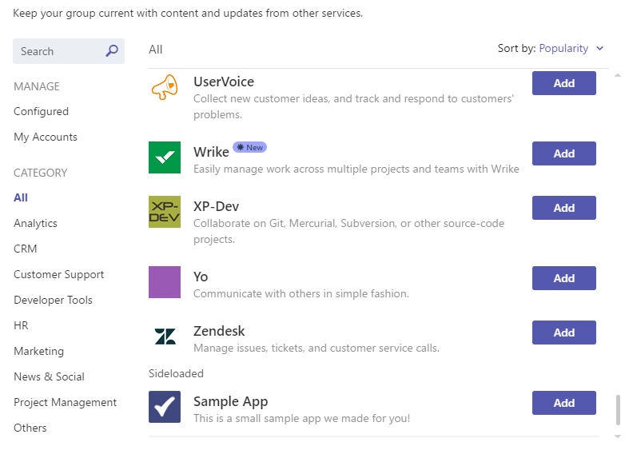

# Cargar un paquete de aplicación en Microsoft TeamsUpload an app package to Microsoft Teams

Para probar la experiencia de la aplicación en Microsoft Teams, debes cargar la aplicación en Teams.To test your app experience within Microsoft Teams, you need to upload your app to Teams. La carga agrega la aplicación al equipo seleccionado y todos los miembros del equipo pueden interactuar con ella como usuarios finales.Uploading adds the app to the selected team and all the team members can interact with it like end users.

> [!NOTE]
> Es posible que cargar un paquete actualizado para una aplicación existente con un bot no muestre cambios de pestaña cuando se ve a través de la ventana de conversaciones.Uploading an updated package for an existing app with a bot might not show tab changes when viewed through the conversations window. Puedes acceder a la aplicación a través de las aplicaciones desvía o prueba en un entorno limpio.You can access the app through the apps fly-out or test in a clean environment.

## Crear el paquete de cargaCreate your upload package

Para el desarrollo y el envío de AppSource, debe crear un paquete que pueda cargar.For development and AppSource submission, you must create a package that you can upload. El paquete debe contener la información para describir su experiencia.The package must contain the information to describe your experience. El paquete es un archivo .zip que contiene el manifiesto de la aplicación y los iconos que definen de forma única la experiencia.The package is a .zip file that contains the application manifest and icons that uniquely define your experience.

Para crear un paquete de carga, consulta [Crear el paquete para la aplicación de Microsoft Teams](../build-and-test/apps-package.md).To create an upload package, see [Create the package for your Microsoft Teams app](../build-and-test/apps-package.md).

Después de crear el paquete, cárbalo en un equipo.After you create the package, upload it into a team. El paquete cargado solo está disponible para los usuarios del equipo seleccionado.The uploaded package is only available to the users of the selected team.

## Cargar el paquete en TeamsLoad your package into Teams

Para probar el paquete, cárbalo en Teams.You can test your package by uploading it into Teams.

> [!NOTE]
> Para que la carga funcione, el administrador del espacio empresarial debe habilitar primero [la carga de aplicaciones](/microsoftteams/admin-settings).For uploading to work, your tenant admin must first [enable uploading of apps](/microsoftteams/admin-settings).

Hay dos formas de cargar la aplicación en Teams:There are two ways to upload your app to Teams:

* Uso de la TiendaUsing the Store
* Uso de la pestaña AplicacionesUsing the Apps tab

## Cargar el paquete en un equipo o conversación con la TiendaUpload your package into a team or conversation using the Store

1. En la esquina inferior izquierda de Teams, elija el **icono De** la Tienda.In the lower left corner of Teams, choose the **Store** icon. En la página Tienda, elija **Cargar una aplicación personalizada.**On the Store page, choose **Upload a custom app**.

  

2. En el **cuadro de** diálogo Abrir, vaya al paquete que desea cargar y elija Abrir.In the **Open** dialog, navigate to the package you want to upload and choose Open.

   

El paquete cargado debe estar disponible para su uso en el equipo o conversación especificado en el cuadro de diálogo de consentimiento.The uploaded package must be available for use in the team or conversation specified in the consent dialog. Si la aplicación no aparece, el motivo más común es un error en el manifiesto, en particular los IDs de las extensiones de aplicación, bot y mensajería.If your app does not appear, the most common reason is an error in the manifest, particularly IDs for the app, bot, and messaging extensions. Si la aplicación no está en el ámbito de las conversaciones, esa opción no aparece.If the app is not scoped for conversations that option does not appear.

>[!NOTE]
> Las aplicaciones en conversaciones se encuentran actualmente en [Developer Preview](../../resources/dev-preview/developer-preview-intro.md)y la opción no aparece si Teams no se ejecuta en ese modo.Apps in conversations is currently in [Developer Preview](../../resources/dev-preview/developer-preview-intro.md), and the option does not appear if Teams is not running in that mode.

## Cargar el paquete en un equipo mediante la pestaña AplicacionesUpload your package into a team using the Apps tab

1. En el equipo de destino, elija **Más opciones** (**&#8943;**) y seleccione **Administrar equipo**.In the target team, choose **More options** (**&#8943;**) and select **Manage team**.

   > [!NOTE]
   > Debes ser el propietario del equipo o el propietario debe dar acceso a los usuarios para agregar los tipos de aplicación adecuados para que aparezca esta funcionalidad.You must be the team owner or the owner must give access to users to add the appropriate app types for this functionality to appear.

2. Selecciona la **pestaña** Aplicaciones y elige **Cargar una aplicación personalizada** en la parte inferior derecha.Select the **Apps** tab and choose **Upload a custom app** on the lower right.

   

3. Seleccione el paquete .zip del equipo.Select your .zip package from the computer.

4. Puedes ver la aplicación cargada en la lista.You can see your uploaded app in the list.

   

Si la aplicación no se carga, el motivo más común es un error en el manifiesto, en particular los IDs de las extensiones de aplicación, bot y mensajería.If your app does not load, the most common reason is an error in the manifest, particularly IDs for the app, bot, and messaging extensions.

## Acceder a la pestaña configurable cargadaAccess your uploaded configurable tab

Si la aplicación contiene pestañas, los usuarios pueden anclarlas a cualquier conversación o canal de grupo mediante el flujo de galería de pestañas estándar:If the app contains tabs, users can pin them to any conversation or team channel using the standard tab gallery flow:

1. Vaya a un canal del equipo.Go to a channel in the team. Elija **+** agregar una pestaña a la derecha de las pestañas existentes.Choose **+** to add a tab to the right of the existing tabs.

2. Seleccione la pestaña de la galería que aparece.Select your tab from the gallery that appears.

3. Acepte el símbolo del sistema de consentimiento.Accept the consent prompt.

4. Configure la pestaña a través de [su página de configuración](../../tabs/how-to/create-tab-pages/configuration-page.md) y seleccione **Guardar**.Configure your tab through its [configuration page](../../tabs/how-to/create-tab-pages/configuration-page.md) and select **Save**.

  

## Obtener acceso al bot cargadoAccess your uploaded bot

Después de agregar el bot a un equipo, debe ser usable por cualquiera de ese equipo, dentro y fuera de los canales del equipo, según la definición del ámbito del bot.After adding the bot to a team, it must be usable by anyone on that team, inside and outside the team channels, depending on bot scope definition. Todos los miembros del equipo pueden ver una publicación en el **canal General** que indica que el bot se ha agregado al equipo.All team members can see a post in the **General** channel indicating that the bot has been added to the team.

Para un bot de Teams, puede empezar invocando el bot @mentioning el nombre del bot.For a Teams bot, you can start by invoking your bot by @mentioning the name of the bot.

Para probar chats directos con el bot, puedes acceder a él a través de la página principal de la aplicación, @mention en un canal o buscarlo en la ventana Nuevo **chat.**To test direct chats with your bot, you can either access it through the App home, @mention it in a channel, or search for it in the **New Chat** window.

Puedes @mention bot en una conversación o buscarlo en la ventana Nuevo **chat** para probar chats directos con el bot.You can @mention the bot in a conversation or search for it in the **New Chat** window to test direct chats with your bot.

## Obtener acceso al conector cargadoAccess your uploaded Connector

Con la aplicación cargada en el equipo o la conversación, los usuarios pueden configurar un conector con el flujo de galería de conectores estándar:With the app loaded in the team or conversation, users can set up a Connector using the standard Connectors gallery flow:

1. Vaya a un canal del equipo.Go to a channel in the team. Elija **Más opciones** (*&#8943;*) y elija **Conectores**.Choose **More options** (*&#8943;*) and choose **Connectors**.

2. Seleccione el conector en la **sección Sideloaded** en la parte inferior.Select your Connector from the **Sideloaded** section at the bottom.

3. Configure el conector a través de su [página de configuración](../../webhooks-and-connectors/how-to/connectors-creating.md) y seleccione **Guardar**.Configure your connector through its [configuration page](../../webhooks-and-connectors/how-to/connectors-creating.md) and select **Save**.

  

## Obtener acceso a la extensión de mensajería cargadaAccess your uploaded messaging extension

Una aplicación cargada con una extensión de mensajería aparece automáticamente en el menú Más **opciones** (*&#8943;*) en el cuadro de redacción.An uploaded app with a messaging extension automatically appears in the **More options** (*&#8943;*) menu in the compose box.

## Agregar un ámbito de instalación predeterminado y una funcionalidad de grupoAdd a default install scope and group capability

> [!NOTE]
> Actualmente, el ámbito de instalación predeterminado y la funcionalidad de grupo solo están disponibles en la versión preliminar del desarrollador.The default install scope and group capability is currently available in developer preview only.

Aunque la instalación de una aplicación en el ámbito personal funciona para la mayoría de las aplicaciones, algunas de las aplicaciones de la Tienda Teams admiten ámbitos personales y de equipo.Although installing an app in the personal scope works for most apps, some of the apps in Teams Store support both personal and team scopes.
Algunas de estas aplicaciones están diseñadas para trabajar en un equipo, reuniones o un chat en grupo, con una experiencia de aplicación personal secundaria.Some of these apps are intended to work in a team, meetings, or a groupchat, with personal app experience being secondary.
La selección predeterminada del ámbito de instalación te ayuda a especificar las `defaultInstallScope` aplicaciones que publicas.The default install scope selection helps you to specify the `defaultInstallScope` for the apps that you publish. La experiencia de instalación de la aplicación hace que las opciones predeterminadas estén disponibles para el usuario, mientras que el resto se mueve debajo del galón como se resalta en la imagen.The app installation experience makes the default options available to the user, while the rest is moved under the chevron as highlighted in the image.

La `defaultInstallScope` propiedad admite valores, como personal, team, groupchat o reuniones.The `defaultInstallScope` property supports values, such as personal, team, groupchat, or meetings.

> [!NOTE]
>`defaultGroupCapability` proporciona la funcionalidad predeterminada que se agrega al equipo, el chat de grupo o las reuniones.`defaultGroupCapability` provides the default capability that is added to the team, groupchat or meetings. Elige una pestaña, bot o conector como la funcionalidad predeterminada de la aplicación, pero debes asegurarte de que has proporcionado la funcionalidad seleccionada en la definición de la aplicación.Choose a tab, bot, or connector as the default capability for your app, but you must ensure that you have provided the selected capability in your app definition.

## Quitar o actualizar la aplicaciónRemove or update your app

Para quitar la aplicación, selecciona el icono eliminar situado junto al nombre de la aplicación en la lista Ver bots de **Teams.**To remove your app, select the delete icon next to the app name in the **View Teams** bots list. Si cambias la información del manifiesto, primero quitas la aplicación y luego agregas el paquete actualizado, consulta [Cargar el paquete en un equipo](#load-your-package-into-teams).If you change manifest information, first remove the app and then add the updated package, see [Load your package into a team](#load-your-package-into-teams). Los cambios de código en el servicio no requieren que vuelva a cargar el manifiesto.Code changes on your service do not require you to upload your manifest again. Sin embargo, si los cambios de código requieren actualizaciones de manifiesto, como cambios en la dirección URL o el identificador de aplicación de Microsoft para su bot, debes cargar el manifiesto de nuevo.However, if the code changes require manifest updates, such as changes to the URL or the Microsoft app ID for its bot, you must upload the manifest again.

> [!NOTE]
> No se puede quitar un bot de un contexto personal por completo.You cannot remove a bot from a personal context entirely. Si el bot se quita y se agrega de nuevo, la comunicación adicional con el bot se anexa a la conversación anterior.If the bot is removed and added again, additional communication with the bot appends to the previous conversation.

## Notas de solución de problemasTroubleshooting notes

Si el manifiesto no se carga, compruebe si ha seguido todas las instrucciones de [Crear el](../../concepts/build-and-test/apps-package.md) paquete y validó el manifiesto con el [esquema](../../resources/schema/manifest-schema.md).If the manifest fails to load, check if you have followed all the instructions in [Create the package](../../concepts/build-and-test/apps-package.md) and validated your manifest against the [schema](../../resources/schema/manifest-schema.md).
