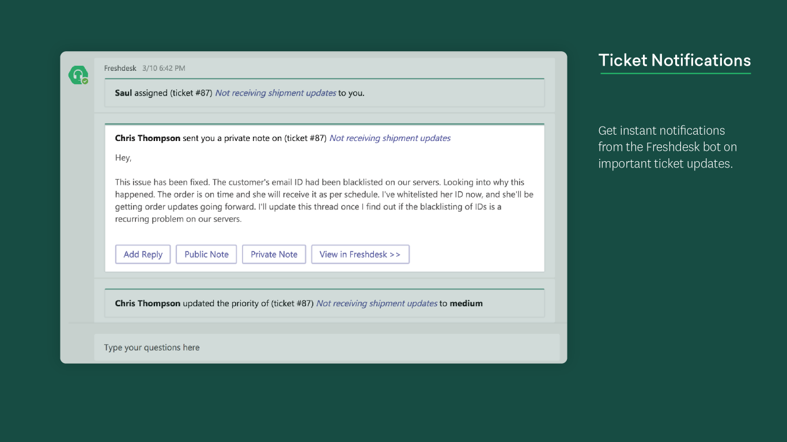

# Crear una excelente página de detalles de la aplicación

La página de detalles presenta la primera impresión de la aplicación a los usuarios. Cada elemento de la página de detalles puede usarse para transmitir las descargas de la visión y la unidad, tenga en cuenta cómo quiere mostrar la aplicación en un espacio limitado. Estas son algunas sugerencias y trucos para ayudarle a atraer a sus usuarios antes de instalar incluso la aplicación.

> [!NOTE]
> Asegúrese de que la información de la aplicación sigue nuestra [Guía de AppSource para crear una descripción de la tienda efectiva](/office/dev/store/create-effective-office-store-listings).

## Nombre de la aplicación

> [!div class="checklist"]
>
> * El nombre de una aplicación desempeña un papel crítico en el modo en que los usuarios la descubren en la AppSource App Store. El nombre corto de la aplicación se muestra en la página de detalles.
>* El nombre de la aplicación debe reflejar la aplicación sin ninguna referencia a Microsoft o Microsoft Products.
>

> **Nota**: Si la aplicación es una asociación oficial con Microsoft, el nombre de la aplicación de terceros debe ser el primero, por ejemplo, el *conector de Salesforce para Microsoft Teams*.

> [!div class="checklist"]
>
>* Use estos recursos como guía:

* [Guía de nombres de aplicaciones](https://docs.microsoft.com/microsoftteams/platform/concepts/deploy-and-publish/appsource/prepare/detail-page-checklist#app-name)
* [Instrucciones de marcas comerciales y marcas de Microsoft](https://www.microsoft.com/legal/intellectualproperty/trademarks/usage/general)

**Hacer lo siguiente:**

* Elija un nombre sencillo y fácil de recordar que indique lo que hace la aplicación.
* Ser distintivos.
* Si es necesario, use referencias de Microsoft 365 en lugar de Office 365.

**Logotipos**

* No omita espacios, que no tenga el caso correcto o contenga errores de idioma en el nombre de la aplicación.
* No use términos genéricos ni nombres similares a las aplicaciones existentes.
* No use "Teams", "Microsoft", los nombres de producto de Microsoft existentes/próximos o "app" en el nombre de la aplicación.
* No use paréntesis para incluir productos de Microsoft, por ejemplo, *el nombre de la aplicación (para Microsoft Teams)*.

## Icono de color

Es uno de los primeros elementos que ven los usuarios. Debe ser atractivo y atractivo al desplazarse por la tienda de aplicaciones. Asegúrese de que crea una buena primera impresión y de que también comunica la imagen y el propósito de la marca. AppSource tiene más sugerencias para [crear una identidad visual coherente](/office/dev/store/create-effective-office-store-listings#create-a-consistent-visual-identity).

**Logotipos**

* El icono no debe imitar ningún producto protegido por derechos de autor.
* El icono no debe tener un aspecto similar a ningún producto o marca de Microsoft.

## Icono de esquema

Se usa en extensiones de mensajería, aplicaciones marcadas como favoritas por el usuario y el menú de navegación izquierdo. Asegúrese de que es sencilla y reconocible. El icono de esquema solo debe contener color blanco y ser transparente. Para conocer las especificaciones necesarias, *consulte* [crear un paquete de la aplicación para los iconos de la aplicación de Microsoft Teams](../../../build-and-test/apps-package.md#icons).

 

**Logotipos**

* El icono no debe imitar ningún producto protegido por derechos de autor.
* El icono no debe tener un aspecto similar a ningún producto o marca de Microsoft.

## La descripción breve

Este es un breve resumen de la aplicación. Tiene que ser original, interesante y dirigida a su público de destino. Lo ideal es probar y describir la solución y su valor para los usuarios en una sola oración.

**Hacer lo siguiente:**

* Coloque primero la información más importante.
* Incluya palabras clave que es probable que los clientes busquen.
* Si necesitas mencionar a Microsoft Teams, la primera mención de Microsoft Teams debe escribirse completamente como *Microsoft Teams*. Si Microsoft Teams se menciona de nuevo en la misma descripción, el nombre se puede acortar a Microsoft *Teams*.
* Cualquier referencia a Microsoft o Microsoft Teams puede formar parte de la descripción y debe seguir los estándares y directrices de la marca de Microsoft.
* Todas las descripciones deben ser gramaticalmente correctas sin errores de idioma.
* Evite el uso innecesario de mayúsculas, como por ejemplo, la indicación de "usuarios" en lugar de "usuarios".

**Logotipos**

* No repita el título.
* No abrevie Microsoft a "MS".
* No use jerga o terminología especializada; no puede dar por sentado que los usuarios saben lo que deben buscar.
* Evite hacer referencia innecesaria a los nombres de los productos de Microsoft a menos que sea absolutamente necesario.
* No indique o implique que la aplicación es una oferta de Microsoft.
* No use los nombres de marcas protegidos por derechos de autor.
* No use "para Teams" en un nombre corto.

Esta es una vista de [App Studio](https://aka.ms/InstallTeamsAppStudio):

## La descripción larga

> [!div class="checklist"]
>
>* Esto proporciona una narración atractiva que resalta las características principales de la solución, los problemas que soluciona y la audiencia de destino. Dibuje en la audiencia la primera oración mediante la comunicación de las características únicas de la aplicación. La descripción debe tener menos de 4000 caracteres; la mayoría de los usuarios solo leerán entre 300 y 500 palabras.
>* ¿Qué se permite?

* `<your_app>`  "funciona con Microsoft Teams"
* `<for users>`  "trabajar con Microsoft Teams"
* `<for tasks>`  "en Microsoft Teams"
* `<an app>`  "para Microsoft Teams"
* `<your_app>`  "se integra con Microsoft Teams"
* "... integrado con Microsoft Teams "
* "... creado el... "
* "... se ejecuta en... "
* "... habilitado por... "
* "... desarrollado para... "
* "... diseñado para... "

> **Nota**: los términos anteriores también se aplican al uso de Microsoft 365. Office 365 se llama ahora Microsoft 365. Actualice las descripciones de la aplicación para reflejar esto.

>[!IMPORTANT]
> Asegúrese de copiar con precisión las descripciones que escribió en la entrada AppSource en el manifiesto de la aplicación: los valores deben coincidir. Microsoft Teams solo usará las descripciones que proporcione en el manifiesto de la aplicación.

**Hacer lo siguiente:**

* Use el [formato Markdown](https://support.office.com/article/use-markdown-formatting-in-teams-4d10bd65-55e2-4b2d-a1f3-2bebdcd2c772) para iluminar la descripción.  
* Enumere las características para ayudar a los lectores a analizar la descripción.
* Use la voz activa y hable directamente con los usuarios.
* Use viñetas para enumerar las características.
* Incluya un vínculo de ayuda o soporte técnico para que los usuarios sepan cómo ponerse en contacto con usted si tienen preguntas.
* Asegúrese de que la primera mención de Microsoft Teams se ha escrito completamente como "*Microsoft Teams*". Si Microsoft Teams se menciona de nuevo más adelante en la misma descripción, el nombre se puede acortar a "*Teams*".
* Cualquier referencia a Microsoft o Microsoft Teams (solo si es necesario) puede formar parte de la descripción larga y debe seguir los estándares y directrices de la marca de Microsoft.
* Todas las descripciones deben ser gramaticalmente correctas sin errores de idioma.
* Evite usar separaciones de mayúsculas y minúsculas para los términos de la descripción (ejemplo: si se indica "usuarios" en lugar de "usuarios").
* Evite acrónimos.
* Asegúrese de llamar a limitaciones, dependencias de cuenta, configuración de configuración, actualizaciones futuras en versiones o cualquier restricción de uso

>[!NOTE]
> Microsoft Teams admite la siguiente sintaxis Markdown:  
> **Vínculos**. `[title](url/address/here)`.  
>**Imágenes**. `` .  
> **Negrita**. `**bold text**`   `__bold text__`.  
> **Cursiva**. `*italicized text*`  `_italicized text`.  
>**[Listas ordenadas](https://www.markdownguide.org/basic-syntax/#ordered-lists)** 
>`1. first` 
 ` 1. second ` 
 `1.third` 
>**[Lista sin ordenar](https://www.markdownguide.org/basic-syntax/#unordered-lists)** 
` - short`  `- bulleted`  `- list` 
>**Nueva línea**. `Place two empty spaces or a backslash \`  \
`at the end of a line.` 
 >**Eludi.** Use una barra diagonal inversa en línea para omitir caracteres especiales.. `\*asterisk`.

**Logotipos**

* No ponga demasiadas palabras clave en la descripción: es una distracción y no ayudará a detectar la aplicación.
* No use "*Teams*" o "*Microsoft Teams*" en un nombre corto.
* Evite hacer referencia innecesaria a los nombres de los productos de Microsoft a menos que sea absolutamente necesario.
* No indique que la aplicación es una oferta de Microsoft.
* No use los nombres de marcas protegidos por derechos de autor.
* No use el siguiente idioma a menos que la aplicación haya pasado por un proceso de certificación oficial:

  * "... certificado para... "
  * "... Powered by... "

* No abrevie "Microsoft" a "MS" o "MSFT", de manera que pueda escribir a Microsoft de forma completa.
* Ninguna parte de la descripción o los metadatos pueden indicar la aplicación como una oferta oficial de Microsoft.
* Los socios no pueden usar ni imitar ninguna de las sublemas de Microsoft, ni usar el nombre de ningún producto o servicio de Microsoft en el eslogan o el subtítulo.
* El logotipo no debe representar incorrectamente la aplicación como una característica o un producto oficial de Microsoft ni imitar ninguno de los productos de Microsoft existentes o futuros.

Esta es una vista de [App Studio](https://aka.ms/InstallTeamsAppStudio):

## Capturas de pantalla

Las capturas de pantalla que se cargan en el [centro de Partners](https://partner.microsoft.com) se muestran en [AppSource](https://appsource.microsoft.com/marketplace/apps?product=office%3Bteams&page=1) y en la descripción de la aplicación en el cliente de Microsoft Teams. Proporcionan una vista previa visual de la aplicación junto con la descripción de la aplicación.
Puede proporcionar una a cinco capturas de pantallas formateadas como archivos. png,. jpg o. gif. Las capturas de pantallas deben ser de 1366 x 768 píxeles con un tamaño máximo de 1024 KB.

**Hacer lo siguiente:**

* Céntrese en resaltar todas las capacidades de la aplicación.
* El contenido debe representar con precisión la aplicación.
* El texto debe rellenarse correctamente sin ser excesivo.
* Puede rodear sus capturas de pantallas con un color de fondo y agregar contenido de marketing similar al ejemplo de [Freshdesk](https://appsource.microsoft.com/product/office/WA104381505?src=office&tab=Overview) ; sin embargo, las dimensiones no serán solo de la captura de pantalla, sino que incluirán la imagen general.

**Logotipos**

* No mostrar dispositivos específicos, como teléfonos o portátiles.
* No mostrar ningún cromo o interfaz de usuario de fuera de la aplicación.
* No captures ninguna interfaz de usuario de Teams ni Browser en las capturas de pantallas.
* No incluya maquetas que reflejen incorrectamente la interfaz de usuario real de las aplicaciones, como mostrar el sitio web en lugar de la pestaña de Microsoft Teams.

Para obtener más información sobre los procedimientos recomendados, *consulte*: [elaboración de imágenes eficaces de AppSource Store](/office/dev/store/craft-effective-appsource-store-images).

## Vídeos

Si una imagen merece la pena mil palabras, un vídeo merece la pena mil imágenes. Los vídeos son la forma más eficaz de comunicar las ventajas de usar la aplicación. Se colocará delante de todas las capturas de pantallas en la página de detalles de la aplicación. Asegúrese de mencionar lo siguiente:

* Cómo funciona la aplicación.
* Qué se puede conseguir con la aplicación.
* Las ventajas de usar la aplicación.
* Quiénes son para.

Recuerde que la presentación es corta y agradable, en un período comprendido entre 30-90 segundos.

## Más información

[Lista de comprobación para el envío de aplicaciones](~/concepts/deploy-and-publish/appsource/publish.md).  
[Cree un paquete de la aplicación para su aplicación de Microsoft Teams](~/concepts/build-and-test/apps-package.md).  
[Use el centro de partners para enviar la solución a AppSource](/office/dev/store/use-partner-center-to-submit-to-appsource).
