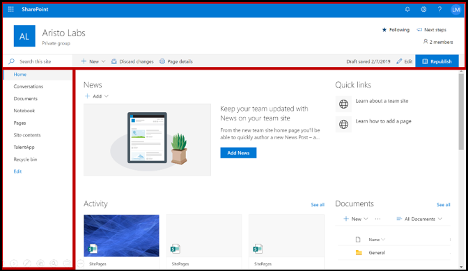
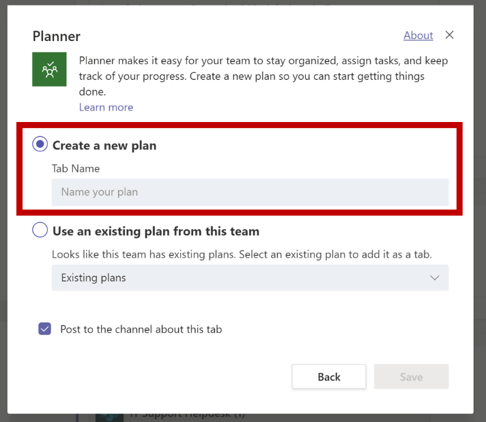

# Sugerencias para un envío Microsoft Teams aplicación correctaTips for a successful Microsoft Teams app submission

>[!NOTE]
>Esta página estará en desuso en mayo de 2021.This page will be deprecated by May 2021. Para obtener más información sobre cómo publicar correctamente la aplicación, consulta las Teams [de validación de la tienda.](~/concepts/deploy-and-publish/appsource/prepare/teams-store-validation-guidelines.md)For more information on successfully publishing your app, see the [Teams store validation guidelines](~/concepts/deploy-and-publish/appsource/prepare/teams-store-validation-guidelines.md).

En este artículo se abordan los motivos comunes por los que las aplicaciones enviadas no pueden validarse.This article addresses common reasons submitted apps fail validation. Aunque no está pensado para ser una lista exhaustiva de todos los posibles problemas con la aplicación, seguir esta guía aumentará la probabilidad de que el envío de la aplicación pase por primera vez.While it's not intended to be an exhaustive list of all potential issues with your app, following this guide will increase the likelihood that your app submission will pass the first time. Consulte [Directivas de certificación del mercado](/legal/marketplace/certification-policies) comercial para obtener una amplia lista de directivas de validación.See [Commercial marketplace certification policies](/legal/marketplace/certification-policies) for an extensive list of validation policies.

>[!NOTE]
>**[La sección 1140](/legal/marketplace/certification-policies#1140-teams)** es específica Microsoft Teams y **[la subsección 1140.4](https://docs.microsoft.com/legal/marketplace/certification-policies#11404-functionality)** aborda los requisitos de funcionalidad para Teams aplicaciones.**[Section 1140](/legal/marketplace/certification-policies#1140-teams)** is specific to Microsoft Teams and **[sub-section 1140.4](https://docs.microsoft.com/legal/marketplace/certification-policies#11404-functionality)** addresses functionality requirements for Teams apps.

## Directrices de validación & casos de prueba con erroresValidation guidelines & most failed test cases

### &#9989; consideraciones generales&#9989; General considerations

Vea también [sección 100 : General](/legal/marketplace/certification-policies#100-general)See also [Section 100 — General](/legal/marketplace/certification-policies#100-general)

* Asegúrese de usar la versión 1.4.1 o posterior del [SDK Microsoft Teams](https://www.npmjs.com/package/@microsoft/teams-js).Ensure you are using version 1.4.1 or later of the [Microsoft Teams SDK](https://www.npmjs.com/package/@microsoft/teams-js).
* No realices cambios en la aplicación mientras el proceso de validación esté en curso.Don't make changes to your app while the validation process is in progress. Si lo hace, necesitará una revalidación completa de la aplicación.Doing so will require a complete revalidation of your app.
* La aplicación no debe dejar de responder, finalizar de forma inesperada ni contener errores de programación.Your app must not stop responding, end unexpectedly, or contain programming errors. Si se produce un problema, la aplicación debe producir un error y proporcionar información válida para el avance al usuario.If an issue occurs, your app must fail and provide valid information for the way-forward to the user.
* La aplicación no debe descargar, instalar ni iniciar automáticamente ningún código ejecutable en el entorno del usuario.Your app must not automatically download, install, or launch any executable code in the user environment. Todas las descargas deben buscar un permiso explícito del usuario.All downloads must seek explicit permission from the user.
* Cualquier material que asocie con su experiencia, como descripciones y documentación de soporte técnico, debe ser preciso.Any material that you associate with your experience, such as descriptions and support documentation, must be accurate. La ortografía, el uso de mayúsculas y minúsculas, la puntuación y la gramática de las descripciones y materiales deben ser correctos.Use correct spelling, capitalization, punctuation, and grammar in your descriptions and materials.
* Proporcionar ayuda e información de soporte técnico.Provide help and support information. Es muy recomendable que la aplicación incluya un vínculo de ayuda o preguntas frecuentes para la experiencia de usuario de primera ejecución.It's highly recommended that your app include a help or FAQ link for the first-run user experience. Para todas las aplicaciones personales, te recomendamos que proporciones tu página de ayuda como pestaña personal para una mejor experiencia de usuario.For all personal apps, we recommend providing your help page as a personal tab for a better user experience.
* Todas las aplicaciones deben tener un recorrido visual, como **Hacer** un recorrido o una Guía de aplicaciones en su pantalla de configuración que hable sobre las características de la aplicación y la integración necesaria en los siguientes lugares: All apps must have a visual tour, such as **Take a Tour** or an **App Guide** in its configuration screen that talks about the app features and necessary integration in the following places:
    * Página de descripción de la tienda (descripción larga).The store listing page (Long Description).
    * Pantalla de configuración de tabulación.Tab configuration screen.
    * Mensaje de bienvenida para un bot.Welcome message for a bot.
    * Metadatos de origen de la aplicación.App source metadata.
    * Pantalla de configuración del conector.Connector configuration screen.

* El recorrido visual puede ser un vídeo, una captura de pantalla, un vínculo a una pestaña estática con detalles de la aplicación.The visual tour can be a  video, screenshot, a link to a static tab with app details. Todas estas referencias deben estar dentro del Teams de datos.All these references must be within the Teams environment.

      

* Incremente el número de versión de la aplicación en el manifiesto si realiza algún cambio de manifiesto en el envío.Increment your app version number in the manifest if you make any manifest changes to your submission.
* La aplicación no debe sacar a los usuarios de Teams escenarios principales de usuario.The app must not take users out of Teams for core user scenarios. Los destinos de vínculo de las aplicaciones no deben vincularse a un explorador externo.Link targets in apps must not link to an external browser. Los destinos de vínculo deben vincularse a elementos div incluidos Teams, por ejemplo, módulos de tareas y pestañas.Link targets must link to div elements contained within Teams, for example, task modules and tabs. 
* Se sugiere usar módulos de tareas o pestañas para mostrar información a los usuarios de Teams.Using task modules or tabs is suggested to display information to users within Teams.
* Todos los escenarios principales y no principales deben completarse en el Teams excepto para:All core and non-core scenarios must be completed within the Teams environment except for:
  * Directiva de privacidadPrivacy Policy
  * Términos de uso (TOU)Terms Of Use (TOU)
  * Vínculo sitio webWebsite link
  * Proceso de registroSign-up process

* Las aplicaciones personales permiten a los usuarios compartir contenido de una experiencia de aplicación personal con otros miembros del equipo.Personal apps enable users to share content from a personal app experience with other team members.

### &#9989; Proporcionar una experiencia de inicio de sesión, de inicio de sesión y de registro clara y sencilla&#9989; Provide a clear and simple sign-in, sign-out, and sign-up experience

Vea también [sección 1100.5: Control de clientes](/legal/marketplace/certification-policies#11005-customer-control)See also [Section 1100.5 — Customer control](/legal/marketplace/certification-policies#11005-customer-control)

* Si la aplicación o el complemento dependen de cuentas o servicios externos, la experiencia de inicio de sesión, de inicio de sesión y de registro debe ser aparente y accesible en todas las funcionalidades de la aplicación.If your app or add-in depends on external accounts or services, the sign-in, sign-out, and sign-up experience must be apparent and reachable across all capabilities in your app.
* Si hay una opción explícita de inicio de sesión proporcionada al usuario, debe haber una opción de salida correspondiente (incluso si la aplicación usa la autenticación [silenciosa](../../../../tabs/how-to/authentication/auth-silent-aad.md)).If there is an explicit sign-in option provided to the user, there must be a corresponding sign-out option (even if the app is using [silent authentication](../../../../tabs/how-to/authentication/auth-silent-aad.md)).
* La opción de cerrar sesión solo debe cerrar la sesión del usuario de la funcionalidad de la aplicación y no salir del Teams cliente.The sign-out option must only sign the user out of your app's capability and not out of the Teams client.
* Como mínimo, la opción de cerrar sesión debe cerrar la sesión del usuario de las mismas capacidades a las que se tiene acceso con la opción de inicio de sesión.At a minimum, the sign-out option must sign the user out of the same capabilities accessed with the sign-in option. Por ejemplo, si la opción de inicio de sesión incluye tanto la extensión de mensajería como la pestaña, la opción de cerrar sesión debe incluir tanto la extensión de mensajería como la pestaña.For example, if the sign-in option includes both messaging extension and tab, then the sign-out option must include both messaging extension and tab.

* Asegúrese de que siempre hay una manera de revertir los siguientes comportamientos (o similares):Make sure there is always a way to reverse the following (or similar) behaviors:
  * Inicio de sesión => cerrar sesión.Sign-in => sign-out.
  * Vincular una cuenta/servicio => desvincular una cuenta o servicio.Link an account/service => unlink an account/service.
  * Conectar cuenta/servicio => desconectar una cuenta o servicio.Connect an account/service => disconnect an account/service.
  * Autorizar una cuenta/servicio => desautorizar o denegar una cuenta o servicio.Authorize an account/service => deauthorize/deny an account/service.
  * Registrar una cuenta/servicio => cancelar el registro o cancelar la suscripción a una cuenta/servicio.Register an account/service => deregister/unsubscribe an account/service.
* Si la aplicación requiere una cuenta o un servicio, debes proporcionar una forma de que el usuario se inscriba o cree una solicitud de registro.If your app requires an account or service, you must provide a way for the user to sign-up or create a sign-up request. Se puede conceder una excepción si la aplicación requiere una licencia para usar.An exception may be granted if your app requires a license to use. En estos escenarios, proporcione instrucciones claras para que un nuevo usuario se inscriba.In such scenarios, provide clear instructions for a new user to sign-up.
* Proporciona instrucciones claras sobre cómo avanzar a un nuevo usuario sobre cómo registrarse para usar los servicios de la aplicación.Provide clear guidance on the way-forward to a new user on how to sign-up to use your app services. Si un vínculo de registro listo no está disponible, proporcione instrucciones precisas en las siguientes áreas:If a ready sign-up link is not available, provide precise guidance in the following areas:

> [!div class="checklist"]
>
> * dentro de la sección descripción de la aplicación.within your app's description section.
> * en el mensaje de bienvenida de la aplicación.in your app's welcome message.
> * en el mensaje de ayuda de la aplicación.in your app's help message.
> * en la ventana donde se pide al usuario que inicie sesión en sus servicios.in the window where you ask a user to sign-in to your services.

* Las aplicaciones sin un flujo de registro fácil también deben incluir una pestaña de ayuda o un vínculo a una página web, donde un nuevo usuario puede ver instrucciones detalladas sobre cómo configurar la Teams aplicación.Apps without an easy sign-up flow must also include a help tab or link to a web page, where a new user can see detailed guidance on configuring your Teams app. Proporcione información detallada para asegurarse de que un nuevo usuario no está bloqueado al probar la aplicación por primera vez.Provide detailed information to ensure a new user is not blocked when trying your app for the first time.
* Las funciones de inicio de sesión y de salida deben funcionar en clientes móviles.Sign-in and sign-out functionality must work on mobile clients. Asegúrese de usar el [SDK Microsoft Teams](https://www.npmjs.com/package/@microsoft/teams-js) versión 1.4.1 o posterior.Ensure to use the [Microsoft Teams SDK](https://www.npmjs.com/package/@microsoft/teams-js) version 1.4.1 or later.

Para obtener información adicional sobre la autenticación, vea:For additional information on authentication see:

* [Documentación de autenticaciónAuthentication documentation](../../../authentication/authentication.md)
* [Ejemplo de autenticación de bot en NodeBot authentication sample in Node](https://github.com/OfficeDev/microsoft-teams-sample-auth-node)
* [Ejemplo de autenticación de tabulación en NodeTab authentication sample in Node](https://github.com/OfficeDev/microsoft-teams-sample-complete-node)
* [Autenticación de tabulación/bot en C#/.NETTab/bot authentication in C#/.NET](https://github.com/OfficeDev/microsoft-teams-sample-complete-csharp)

### &#9989; los tiempos de respuesta deben ser razonables&#9989; Response times must be reasonable

* **Pestañas**.**Tabs**. Si una respuesta a una acción tarda más de tres segundos, debe proporcionar un mensaje o advertencia de carga.If a response to an action takes more than three seconds, you must provide a loading message or warning.
* **Bots**.**Bots**. Una respuesta a un comando de usuario debe producirse en dos segundos.A response to a user command must occur within two seconds. Si se requiere un procesamiento más largo, la aplicación debe mostrar un indicador de escritura.If longer processing is required, your app must display a typing indicator.
* **Redacción de extensiones**.**Compose extensions**. Una respuesta a un comando de usuario debe producirse en un plazo de cinco segundos.A response to a user command must occur within five seconds.

> [!TIP]
> Asegúrate de que la aplicación muestre un indicador de carga o algún tipo de advertencia cuando la aplicación tarda más de lo esperado en responder.Make sure your app displays a loading indicator or some form of warning when your app is taking longer than expected to respond.

### &#9989; contenido de tab no debe tener una navegación por capas o cromo excesiva&#9989; Tab content must not have excessive chrome or layered navigation

* Las pestañas deben proporcionar contenido centrado y evitar los elementos de interfaz de usuario necesarios.Tabs must provide focused content and avoid needless UI elements. Esto suele hacer referencia a una navegación anidada o por capas innecesaria, una interfaz de usuario innecesaria o irrelevante junto al contenido o cualquier vínculo que lleve al usuario a contenido no relacionado.This usually refers to unnecessary nested or layered navigation, an extraneous or irrelevant UI next to the content, or any links that take the user to unrelated content. Por ejemplo, la siguiente vista de pestaña omite los menús de navegación y solo muestra el contenido principal:For example, the following tab view omits navigation menus and only showcases the main content:

  

* Las pestañas deben ser ligeras en la naturaleza y no incluir navegación compleja.Tabs must be light in nature and not include complex navigation.
* Las pestañas de canal que tienen funciones de edición complejas dentro de la aplicación deben abrir la vista de editor en una ventana múltiple en lugar de en una pestaña.Channel tabs that have complex editing capabilities within the app must open the editor view in a multi-window rather than a tab.
* Las pestañas de canal no deben proporcionar una barra de aplicaciones con iconos en el carril izquierdo que entren en conflicto con la navegación principal Teams aplicación.Channel tabs must not provide an app bar with icons in the left rail that conflicts with the main Teams navigation.
* Las pestañas no deben presentar una barra de aplicaciones con iconos en el carril izquierdo que entren en conflicto con la navegación Teams aplicación.Tabs must not present an app bar with icons in the left rail that conflict with the main Teams navigation.
* Las pestañas que tienen funciones de edición complejas dentro de la aplicación deben abrir la vista de editor en una ventana múltiple en lugar de en la pestaña.Tabs that have complex editing capabilities within the app must open the editor view in a multi-window rather than in the tab.
* Si hay varias opciones de vista, considere la posibilidad de tener un menú de configuración de pestañas para que el usuario elija.If there are multiple view options, consider having a tab config menu for the user to choose from. Por ejemplo, en lugar de insertar un menú dentro de la pestaña, coloque el menú en la página de configuración para que la vista de pestaña real esté limpia y centrada.For example, instead of embedding a menu inside the tab, put the menu in the configuration page so the actual tab view is clean and focused.
* Incluya una pestaña *ayuda* como pestaña estática para aconsejar a los usuarios cómo configurar, registrarse y usar la aplicación.Please include a *Help* tab as a static tab to advise users how to configure, sign-up, and use your app.
* Incluya una pestaña *Configuración* que esté disponible desde el encabezado de la aplicación.Please include a *Settings* tab that is available from the app header.

### &#9989; configuración de tab debe suceder en la pantalla de configuración&#9989; Tab configuration must happen in the configuration screen

* La pantalla de configuración debe explicar claramente el valor de la experiencia y cómo configurar la pestaña.The configuration screen must clearly explain the value of the experience and how to configure the tab.
* El proceso de configuración siempre debe proporcionar una forma de que los usuarios continúen y no finalicen la experiencia del usuario.The configuration process must always provide a way for the users to continue and not end the user experience. Por ejemplo, no muestre un tablero vacío después de que el usuario haya configurado la pestaña.For example, do not show an empty board after the user has configured the tab.
* El proceso de inicio de sesión del usuario debe formar parte del proceso de configuración.The user sign-in process must be a part of the configuration process. Asegúrate de completarlo en la interfaz de usuario de pestaña.Ensure to complete it in the Tab UI. Después de que el usuario haya completado la configuración y cargado la pestaña, no se requiere ninguna acción adicional.After the user has completed the configuration and loaded the tab, no further action is required.
* No muestres toda la página web dentro de la ventana emergente configuración de inicio de sesión.Don't show your entire webpage within the sign-in configuration pop-up window.
* Un usuario siempre debe poder finalizar la experiencia de configuración, incluso si no puede encontrar inmediatamente el contenido que está buscando.A user must always be able to finish the configuration experience, even if they can’t immediately find the content they’re looking for.
* La experiencia de configuración debe proporcionar opciones para que el usuario encuentre su contenido, anclar una dirección URL o crear contenido nuevo si no existe.The configuration experience must provide options for the user to find their content, pin a URL, or create new content if it doesn’t exist.
* La experiencia de configuración debe permanecer dentro del Teams contexto.The configuration experience must remain within the Teams context. El usuario no debe tener que dejar la experiencia de configuración para crear contenido y, a continuación, volver a Teams para anclarlo.The user shouldn’t have to leave the configuration experience to create content and then return to Teams to pin it.
* Use el área de ventanilla disponible de forma eficaz.Use the available viewport area efficiently. No lo desperdici en el uso de logotipos enormes dentro de la configuración emergente.Do not waste it on using huge logos inside the configuration pop up.

### &#9989; pestañas en canal: acceso de miembros&#9989; Tabs in channel - Member access

* Los demás miembros deben tener acceso a una pestaña configurada por un miembro en un ámbito de canal sin tener que buscar permisos del miembro que configuró la pestaña.A tab configured by a member in a channel scope must be accessible to the other members without having to seek permissions from the member who configured the tab.
* La aplicación debe proporcionar las opciones de administración de permisos por adelantado si la pestaña es para uso privado o restringido o requiere permisos del miembro que configuró la pestaña.The app must provide the permission management options upfront if the tab is for private or restricted use or requires any permissions from the member who configured the tab.

### &#9989; bots siempre deben responder y fallar correctamente&#9989; Bots must always be responsive and fail gracefully

El bot debe responder a cualquier comando y no al usuario.Your bot must be responsive to any command and not dead-end the user. Estos son algunos consejos para ayudar al bot a responder de forma inteligente a los usuarios:Here are some tips to help your bot intelligently respond to users:

* **Usar listas de comandos**.**Use command lists**. El análisis de la entrada del usuario o la previsión de la intención del usuario es difícil.Analyzing user input or predicting user intent is hard. En lugar de permitir que los usuarios adivinen qué puede hacer el bot, proporcione una lista de los comandos que el bot entiende.Instead of letting users guess what your bot can do, provide a list of commands your bot understands.

* **Incluir un comando de ayuda**.**Include a help command**. Es probable que los usuarios escriban "Ayuda" cuando se pierden o cuando el bot no responde como se esperaba.Users are likely to type "Help" when they are lost or when your bot doesn't respond as expected. Incluye un comando de ayuda que describe cómo se experimentará el valor de la aplicación junto con todos los comandos válidos.Include a help command that describes how your app's value will be experienced along with all valid commands.

* **Incluya contenido de ayuda o instrucciones cuando se pierda el bot**.**Include help content or guidance when your bot is lost**. Cuando el bot no puede comprender la entrada del usuario, debe sugerir una acción alternativa.When your bot cannot understand the user input, it must suggest an alternative action. Por ejemplo, *"Lo siento, no lo entiendo. Escriba "ayuda" para obtener más información".*For example, *"I'm sorry, I don't understand. Type "help" for more information."* No respondas con un mensaje de error o *simplemente, "No lo entiendo".*Don't respond with an error message or simply, *"I don't understand"*.

### &#9989; de comandos de ayuda&#9989; Help command response

* El comando de ayuda debe ser preciso y las respuestas de la aplicación deben estar en un formato de tarjeta adaptable con un contenido que pueda realizarse para al menos seis comandos.Help Command must be precise and the app responses must be in an adaptive card format with an actionable content for at least six commands.
* Si una aplicación tiene menos de seis comandos, comprueba si todos los comandos están presentes en la tarjeta adaptable.If an app has less than six commands, check if all the commands are present in the adaptive card.

  

* **Usar tarjetas adaptables y módulos de tareas para que la respuesta del bot sea clara y fácil de usar** 
 [Las tarjetas adaptables con botones que invocan módulos de tareas](/task-modules-and-cards/task-modules/task-modules-bots) mejoran la experiencia del usuario del bot.**Use adaptive cards and task modules to make your bot response clear and actionable**
[Adaptive cards with buttons invoking task modules](/task-modules-and-cards/task-modules/task-modules-bots) enhance the bot user experience. Estas tarjetas y botones son más fáciles de usar en un dispositivo móvil en lugar de que el usuario escriba los comandos.These cards and buttons are easier to use in a mobile device as opposed to your user typing the commands. Además, las respuestas de bot no deben ser textuales con texto largo.Also bot responses must not be textual with long text. Los bots deben usar tarjetas adaptables y módulos de tareas en lugar de una interfaz de usuario basada en chat conversacional y respuestas de texto largas.Bots must make use of adaptive cards and task modules instead of conversational chat based user interface and lengthy text responses.

* **Piense en todos los ámbitos**.**Think through all scopes**. Asegúrese de que el bot proporciona respuestas adecuadas cuando se menciona ( `@*botname*` ) en un canal y en conversaciones personales.Be sure that your bot provides appropriate responses when mentioned (`@*botname*`) in a channel and in personal conversations. Si el bot no proporciona un contexto significativo dentro del ámbito personal o de equipos, deshabilite dicho ámbito a través del manifiesto.If your bot does not provide meaningful context within the personal or teams scope, disable that scope via the manifest. (Vea el `bots` bloque en la referencia Microsoft Teams esquema de [manifiesto](../../../../resources/schema/manifest-schema.md#bots).)(See the `bots` block in the [Microsoft Teams manifest schema reference](../../../../resources/schema/manifest-schema.md#bots).)

* **Incluir chat de grupo, de grupo o de conversación 1:1.****Include team, group chat, or 1:1 conversation**. Las notificaciones de bot deben incluir un equipo, un chat de grupo o una conversación uno a uno con contenido relevante para la audiencia.Bot notifications must include a team, a group chat, or a one-to-one conversation with relevant content for your audience.

* **No insertar datos confidenciales**.**Do not push sensitive data**. Los bots no deben enviar datos confidenciales a un equipo, un chat de grupo o una conversación 1:1, donde hay una audiencia que no debe ver los datos.Bots must not push sensitive data to a team, a group chat, or a 1:1 conversation, where there is an audience who must not view that data.

* **Proporcione un mensaje de bienvenida**.**Provide a welcome message**. Bot must provide an FRE welcome message that includes an interactive tutorial with carousel cards or "try it" buttons, to encourage engagement.Bot must provide an FRE welcome message that includes an interactive tutorial with carousel cards or "try it" buttons, to encourage engagement.

### &#9989; Los bots personales siempre deben enviar un mensaje de bienvenida en el primer inicio&#9989; Personal bots must always send a welcome message on first launch

Un mensaje de bienvenida es la mejor manera de establecer el tono del bot de chat personal.A welcome message is the best way to set the tone for your personal chat bot. Esta es la primera interacción que un usuario tiene con el bot.This is the first interaction a user has with the bot. Un buen mensaje de bienvenida puede animar al usuario a seguir explorando la aplicación.A good welcome message can encourage the user to keep exploring the app. Si el mensaje de bienvenida o introductorio es confuso o no está claro, los usuarios no verán el valor de la aplicación inmediatamente y perderán interés.If the welcome or introductory message is confusing or unclear, users won't see the value of the app immediately and lose interest.
Consulte la siguiente sección para obtener información sobre los requisitos de los mensajes de bienvenida:See the following section for welcome message requirements:

> [!Note]
> Un mensaje de bienvenida es opcional para un bot de canal.A welcome message is optional for a channel bot.

### Requisitos de mensaje de bienvenidaWelcome message requirements

* Incluya una propuesta de valor con el tour de bienvenida.Include a value proposition with the welcome tour.
* Proporcionar instrucciones de avance para usar la aplicación.Provide way-forward guidance for using the app.
* Incluya instrucciones sobre cómo registrarse y configurar la aplicación.Include guidance on how to sign-up and configure your app.
* Presente texto fácil de leer y diálogos sencillos, preferiblemente una tarjeta con un botón de recorrido de bienvenida que cargue un módulo de tareas.Present easy-to-read text and straightforward dialogue — preferably a card with an actionable welcome tour button that loads a task module.
* Mantenlo sencillo y usable con botones y tarjetas: evita el texto largo, el diálogo de chat.Keep it simple and usable with buttons and cards — avoid long text, chatty dialogue.
* Incluye tarjetas adaptables y botones para que el mensaje de bienvenida sea más utilizable.Include adaptive cards and buttons to make the welcome message more usable.
* Invoque el mensaje de bienvenida con un ping, no dos o más pings simultáneos.Invoke the welcome message  with one ping, not two or more simultaneous pings.
* Un mensaje de bienvenida solo debe mostrarse al usuario que configuró la aplicación, preferiblemente en un chat personal 1:1.A welcome message must only be shown to the user who configured the app, preferably in a 1:1 personal chat.
* Las aplicaciones personales siempre deben proporcionar un mensaje de bienvenida a un usuario.Personal apps must always provide a welcome message to a user.
* Nunca envíe un chat personal a todos los miembros del equipo; se considera correo no deseado.Never send a personal chat to every member of the team; it is considered spam.
* Nunca envíe el mensaje de bienvenida más de una vez.Never send the welcome message more than once. No se permite repetir el mismo mensaje de bienvenida durante intervalos regulares y se considera correo no deseado.Repeating the same welcome message over regular intervals is not allowed and is considered spamming.

#### Evitar el correo no deseado de mensajes de bienvenidaAvoid welcome message spamming

* **Canal de mensaje por bot**.**Channel message by bot**. No spam users by creating separate new chat posts.Don't spam users by creating separate new chat posts. Cree una entrada de subproceso única con respuestas en el mismo subproceso.Create a single thread post with replies in the same thread.
* **Chat personal por bot**.**Personal chat by bot**. No envíe varios mensajes.Don't send multiple messages. Envíe un mensaje con información completa.Send one message with complete information. No se permite repetir el mismo mensaje de bienvenida durante intervalos regulares y se considera correo no deseado.Repeating the same welcome message over regular intervals is not allowed and is considered spamming.

#### Mensajes de bienvenida del bot de solo notificaciónNotification-only bot welcome messages

Los bots de solo notificación deben enviar un mensaje de bienvenida que incluya un mensaje que transmita: "Soy un bot de solo notificación y no podrá responder *a los chats".*Notification-only bots must send a welcome message that includes a message conveying, *"I am a notification-only bot and will not be able to reply to your chats"*.

#### Mensajes de bienvenida en el ámbito personalWelcome messages in the personal scope

   * **Haga que el mensaje sea conciso e informativo.****Make your message concise and informative**. La experiencia del usuario y los conocimientos de la aplicación variarán.The user experience and the knowledge of your app will vary. Un usuario puede haber usado la aplicación en otra plataforma o no saber nada sobre la aplicación.A user may have used your app on another platform or know nothing about your app. Quieres adaptar el mensaje a todas las audiencias y en un par de oraciones explicar lo que hace el bot y las formas de interactuar con él.You want to tailor your message to all audiences and in a couple sentences explain what your bot does and the ways to interact with it. También debes explicar el valor de la aplicación y cómo los usuarios se beneficiarán de usarlo.You must also explain the value of the app and how the users will benefit from using it.

* **Haga que el mensaje sea de acción.****Make your message actionable**. Piensa en lo primero que quieres que hagan los usuarios después de instalar la aplicación.Think about the first thing you want users to do after installing your app. ¿Hay un comando interesante que deben probar?Is there a cool command they must try? ¿Hay otra experiencia de incorporación que deben conocer?Is there another onboarding experience they must know about? ¿Necesitan iniciar sesión?Do they need to sign-in? Puede agregar acciones en una tarjeta adaptable o proporcionar ejemplos específicos como "Pruebe a *preguntar...",*"Esto es *lo que puedo hacer..."*.You can add actions on an adaptive card or provide specific examples such as *“Try asking….”*, *“This is what I can do…”*.

#### Mensajes de bienvenida en el ámbito de equipo o canalWelcome messages in the team or channel  scope

Las cosas son un poco diferentes cuando el bot se agrega por primera vez a un canal.Things are a little bit different when the bot is first added to a channel. Normalmente, no debes enviar un mensaje 1:1 a todos los usuarios del equipo, pero el bot puede enviar un mensaje de bienvenida en el canal.Normally, you shouldn't send a 1:1 message to everyone on the team, but the bot can send a welcome message in the channel.

### &#9989; capacidad de respuesta móvil, sin ventas directas ni pago&#9989; Mobile responsiveness, no direct upsell or payment

* Las pestañas, las tarjetas adaptables, los mensajes de bot y el contenido de los módulos de tareas deben responder para una variedad de tamaños de pantalla de dispositivo móvil.Your tabs, adaptive cards, bot messages and content in task modules must be responsive for a variety of mobile device screens sizes.
* Las aplicaciones compatibles con iOS deben ser totalmente funcionales en el dispositivo iPad con la versión más reciente de iOS.Apps that support iOS must be fully functional on the latest iPad device using the latest version of iOS.
* No debe incluir referencias directas a compras desde la aplicación, ofertas de prueba, ofertas para versiones de pago o vínculos a ninguna tienda en línea donde los usuarios puedan comprar o adquirir otro contenido, aplicaciones o complementos desde la aplicación de Teams en el sistema operativo móvil (Android, iOS).Must not include any direct references to in-app purchases, trial offers, offers for paid versions, or links to any online stores where users can purchase or acquire other content, apps, or add-ins from your Teams app on mobile OS (Android, iOS).
* La versión de iOS o Android del complemento no debe mostrar ninguna interfaz de usuario o idioma ni vínculo a ninguna otra aplicación, complemento o sitio web que pida al usuario que pague.The iOS or Android version of the add-in must not show any UI or language or link to any other apps, add-ins, or website that ask the user to pay.
* Las páginas de la Directiva de privacidad y los Términos de uso asociadas también deben estar libres de vínculos de la interfaz de usuario o de la Tienda de comercio.The associated Privacy Policy and Terms of Use pages must also be free of any commerce UI or Store links.

### &#9989; No publicar datos confidenciales en una audiencia que no está diseñada para ver los datos&#9989; Do not post sensitive data to an audience not intended to view the data

La aplicación Teams no debe publicar datos confidenciales como tarjeta de crédito o instrumento de pago financiero, información de identificación personal (PIN), estado o seguimiento de contactos a una audiencia que no está destinada a ver esos datos.Your Teams app must not post sensitive data such as credit card or financial payment instrument, Personal Identifiable Information (PIN), health, or contact tracing information to an audience not intended to view that data.

### &#9989; No transmitir detalles de pago financieros ni completar transacciones financieras a través de la Teams aplicación&#9989; Do not transmit financial payment details or complete financial transactions via your Teams app

* La Teams no debe pedir a los usuarios que realicen un pago directamente en Teams interfaz.Your Teams app must not ask users to make a payment directly within Teams interface.
* Es posible que las aplicaciones no transmitan detalles del instrumento financiero a través del usuario en la interfaz de la aplicación.Apps may not transmit financial instrument details through the user on the app interface. Las aplicaciones solo pueden transmitir vínculos para proteger los servicios de pago a los usuarios si esto se revela en los Términos de uso, la directiva de privacidad y cualquier página de perfil o sitio web de la aplicación antes de que un usuario acepte usar la aplicación.Apps may only transmit links to secure payment services to users if this is disclosed in the app's Terms of Use, Privacy Policy, and any profile page or website for the app before a user agrees to use the app.

### &#9989; Borrar advertencia antes de descargar archivos o archivos ejecutables ( `.exe` ) en el entorno de un usuario&#9989; Clear warning before downloading any files or executable (`.exe`) into a user’s environment

Advierto a los usuarios antes de que la aplicación descargue los archivos o archivos ejecutables ( )en el equipo o el entorno `.exe`  del usuario.Please warn users before your app downloads any files or executable (`.exe`  )into the user's machine or environment.

### &#9989; las extensiones de mensajería deben proporcionar texto de ayuda y ser fáciles de leer&#9989; Messaging extensions must provide help text and be easy to read

* La extensión de mensajería basada en búsquedas debe proporcionar texto de ayuda sobre cómo buscar de forma eficaz (por ejemplo, mostrar una entrada de ejemplo).The search-based messaging extension must provide help text on how to effectively search (e.g., show example input).
* Los módulos de tareas deben incluir un icono y un nombre corto que estén contenidos o creados desde la aplicación.Task modules must include an icon and a short name that they are contained in or created from the app.
* Los `@mention` ejecutables de extensión de mensaje deben ser claros, fáciles de comprender y fáciles de leer.The message extension `@mention` executables must be clear, easy to understand, and easy to read.

## M365 Publisher atestaciónM365 Publisher Attestation

### &#9989; completar la Publisher en el Centro de partners&#9989; Complete the Publisher Attestation in Partner Center

* Consulte la [documentación del programa Publisher atestación completa](/microsoft-365-app-certification/docs/attestation) para obtener más información.Refer to the [Complete Publisher Attestation](/microsoft-365-app-certification/docs/attestation) program documentation for more details.
* Siga los pasos de la sección Publisher flujo de trabajo de [atestación](/microsoft-365-app-certification/docs/userguide#3publisher-attestation-workflow) de publicación para completar el proceso de atestación del editor.Follow the steps in the [Publisher Attestation Workflow](/microsoft-365-app-certification/docs/userguide#3publisher-attestation-workflow) section to complete the publisher attestation process. Escribe en appcert@microsoft.com para cualquier pregunta.Write to appcert@microsoft.com for any questions.
* Consulte la guía [de solución de problemas](/azure/active-directory/develop/troubleshoot-publisher-verification) para obtener información adicional.Refer to the [Troubleshooting guide](/azure/active-directory/develop/troubleshoot-publisher-verification) for additional information.
* Complete la autoaestación a través del centro de partners.Complete the self attestation through partner center. Rellene el cuestionario Self-Assessment en **Cumplimiento de aplicaciones**.Fill the Self-Assessment questionnaire under **App Compliance**.

> [!div class="nextstepaction"]
> [Más información sobre las Teams de aprobación de aplicacionesLearn more about Teams app approval policies](/legal/marketplace/certification-policies#1140-teams)
