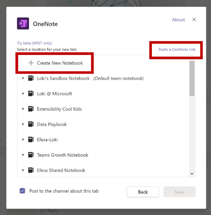

# Sugerencias para un envío Microsoft Teams aplicación correcta

>[!NOTE]
>Esta página estará en desuso en mayo de 2021. Para obtener más información sobre cómo publicar correctamente la aplicación, consulta las Teams [de validación de la tienda.](~/concepts/deploy-and-publish/appsource/prepare/teams-store-validation-guidelines.md)

En este artículo se abordan los motivos comunes por los que las aplicaciones enviadas no pueden validarse. Aunque no está pensado para ser una lista exhaustiva de todos los posibles problemas con la aplicación, seguir esta guía aumentará la probabilidad de que el envío de la aplicación pase por primera vez. Para obtener más información, consulte [Commercial marketplace certification policies](/legal/marketplace/certification-policies) for an extensive list of validation policies.

>[!NOTE]
>**[La sección 1140](/legal/marketplace/certification-policies#1140-teams)** es específica Microsoft Teams y **[la subsección 1140.4](/legal/marketplace/certification-policies#11404-functionality)** aborda los requisitos de funcionalidad para Teams aplicaciones.

## Directrices de validación & casos de prueba con errores

### &#9989; consideraciones generales

* Asegúrese de usar la versión 1.4.1 o posterior del [SDK Microsoft Teams](https://www.npmjs.com/package/@microsoft/teams-js).
* No realices cambios en la aplicación mientras el proceso de validación esté en curso. Si lo hace, necesitará una revalidación completa de la aplicación.
* La aplicación no debe dejar de responder, finalizar de forma inesperada ni contener errores de programación. Si se produce un problema, la aplicación debe producir un error y proporcionar información válida para el avance al usuario.
* La aplicación no debe descargar, instalar ni iniciar automáticamente ningún código ejecutable en el entorno del usuario. Todas las descargas deben buscar un permiso explícito del usuario.
* Cualquier material que asocie con su experiencia, como descripciones y documentación de soporte técnico, debe ser preciso. La ortografía, el uso de mayúsculas y minúsculas, la puntuación y la gramática de las descripciones y materiales deben ser correctos.
* Proporcionar ayuda e información de soporte técnico. Es muy recomendable que la aplicación incluya un vínculo de ayuda o preguntas frecuentes para la experiencia de usuario de primera ejecución. Para todas las aplicaciones personales, te recomendamos que proporciones tu página de ayuda como pestaña personal para una mejor experiencia de usuario.
* Todas las aplicaciones deben tener un recorrido visual, como **Hacer** un recorrido o una Guía de aplicaciones en su pantalla de configuración que hable sobre las características de la aplicación y la integración necesaria en los siguientes lugares: 
    * Página de descripción de la tienda (descripción larga).
    * Pantalla de configuración de tabulación.
    * Mensaje de bienvenida para un bot.
    * Metadatos de origen de la aplicación.
    * Pantalla de configuración del conector.

* El recorrido visual puede ser un vídeo, una captura de pantalla, un vínculo a una pestaña estática con detalles de la aplicación. Todas estas referencias deben estar dentro del Teams de datos.

     

* Incremente el número de versión de la aplicación en el manifiesto si realiza algún cambio de manifiesto en el envío.
* La aplicación no debe sacar a los usuarios de Teams escenarios principales de usuario. Los destinos de vínculo de las aplicaciones no deben vincularse a un explorador externo. Los destinos de vínculo deben vincularse a elementos div incluidos Teams, por ejemplo, módulos de tareas y pestañas. 
* Se sugiere usar módulos de tareas o pestañas para mostrar información a los usuarios de Teams.
* Todos los escenarios principales y no principales deben completarse en el Teams excepto para:
  * Directiva de privacidad
  * Términos de uso (TOU)
  * Vínculo sitio web
  * Proceso de registro

* Las aplicaciones personales permiten a los usuarios compartir contenido de una experiencia de aplicación personal con otros miembros del equipo.

### &#9989; Proporcionar una experiencia de inicio de sesión, de inicio de sesión y de registro clara y sencilla

* Si la aplicación o el complemento dependen de cuentas o servicios externos, la experiencia de inicio de sesión, de inicio de sesión y de registro debe ser aparente y accesible en todas las funcionalidades de la aplicación.
* Si hay una opción explícita de inicio de sesión proporcionada al usuario, debe haber una opción de salida correspondiente (incluso si la aplicación usa la autenticación [silenciosa](../../../../tabs/how-to/authentication/auth-silent-aad.md)).
* La opción de cerrar sesión solo debe cerrar la sesión del usuario de la funcionalidad de la aplicación y no salir del Teams cliente.
* Como mínimo, la opción de cerrar sesión debe cerrar la sesión del usuario de las mismas capacidades a las que se tiene acceso con la opción de inicio de sesión. Por ejemplo, si la opción de inicio de sesión incluye tanto la extensión de mensajería como la pestaña, la opción de cerrar sesión debe incluir tanto la extensión de mensajería como la pestaña.

* Asegúrese de que siempre hay una manera de revertir los siguientes comportamientos (o similares):
  * Inicio de sesión => cerrar sesión.
  * Vincular una cuenta/servicio => desvincular una cuenta o servicio.
  * Conectar cuenta/servicio => desconectar una cuenta o servicio.
  * Autorizar una cuenta/servicio => desautorizar o denegar una cuenta o servicio.
  * Registrar una cuenta/servicio => cancelar el registro o cancelar la suscripción a una cuenta/servicio.
* Si la aplicación requiere una cuenta o un servicio, debes proporcionar una forma de que el usuario se inscriba o cree una solicitud de registro. Se puede conceder una excepción si la aplicación requiere una licencia para usar. En estos escenarios, proporcione instrucciones claras para que un nuevo usuario se inscriba.
* Proporciona instrucciones claras sobre cómo avanzar a un nuevo usuario sobre cómo registrarse para usar los servicios de la aplicación. Si un vínculo de registro listo no está disponible, proporcione instrucciones precisas en las siguientes áreas:

> [!div class="checklist"]
>
> * dentro de la sección descripción de la aplicación.
> * en el mensaje de bienvenida de la aplicación.
> * en el mensaje de ayuda de la aplicación.
> * en la ventana donde se pide al usuario que inicie sesión en sus servicios.

* Las aplicaciones sin un flujo de registro fácil también deben incluir una pestaña de ayuda o un vínculo a una página web, donde un nuevo usuario puede ver instrucciones detalladas sobre cómo configurar la Teams aplicación. Proporcione información detallada para asegurarse de que un nuevo usuario no está bloqueado al probar la aplicación por primera vez.
* Las funciones de inicio de sesión y de salida deben funcionar en clientes móviles. Asegúrese de usar el [SDK Microsoft Teams](https://www.npmjs.com/package/@microsoft/teams-js) versión 1.4.1 o posterior.

Para obtener información adicional sobre la autenticación, vea:

* [Documentación de autenticación](../../../authentication/authentication.md)
* [Ejemplo de autenticación de bot en Node](https://github.com/OfficeDev/microsoft-teams-sample-auth-node)
* [Ejemplo de autenticación de tabulación en Node](https://github.com/OfficeDev/microsoft-teams-sample-complete-node)
* [Autenticación de tabulación/bot en C#/.NET](https://github.com/OfficeDev/microsoft-teams-sample-complete-csharp)

### &#9989; los tiempos de respuesta deben ser razonables

* **Pestañas**. Si una respuesta a una acción tarda más de tres segundos, debe proporcionar un mensaje o advertencia de carga.
* **Bots**. Una respuesta a un comando de usuario debe producirse en dos segundos. Si se requiere un procesamiento más largo, la aplicación debe mostrar un indicador de escritura.
* **Redacción de extensiones**. Una respuesta a un comando de usuario debe producirse en un plazo de cinco segundos.

> [!TIP]
> Asegúrate de que la aplicación muestre un indicador de carga o algún tipo de advertencia cuando la aplicación tarda más de lo esperado en responder.

### &#9989; contenido de tab no debe tener una navegación por capas o cromo excesiva

* Las pestañas deben proporcionar contenido centrado y evitar los elementos de interfaz de usuario necesarios. Esto suele hacer referencia a una navegación anidada o por capas innecesaria, una interfaz de usuario innecesaria o irrelevante junto al contenido o cualquier vínculo que lleve al usuario a contenido no relacionado. Por ejemplo, la siguiente vista de pestaña omite los menús de navegación y solo muestra el contenido principal:

  

* Las pestañas deben ser ligeras en la naturaleza y no incluir navegación compleja.
* Las pestañas de canal que tienen funciones de edición complejas dentro de la aplicación deben abrir la vista de editor en una ventana múltiple en lugar de en una pestaña.
* Las pestañas de canal no deben proporcionar una barra de aplicaciones con iconos en el carril izquierdo que entren en conflicto con la navegación principal Teams aplicación.
* Las pestañas no deben presentar una barra de aplicaciones con iconos en el carril izquierdo que entren en conflicto con la navegación Teams aplicación.
* Las pestañas que tienen funciones de edición complejas dentro de la aplicación deben abrir la vista de editor en una ventana múltiple en lugar de en la pestaña.
* Si hay varias opciones de vista, considere la posibilidad de tener un menú de configuración de pestañas para que el usuario elija. Por ejemplo, en lugar de insertar un menú dentro de la pestaña, coloque el menú en la página de configuración para que la vista de pestaña real esté limpia y centrada.
* Incluya una pestaña *ayuda* como pestaña estática para aconsejar a los usuarios cómo configurar, registrarse y usar la aplicación.
* Incluya una pestaña *Configuración* que esté disponible desde el encabezado de la aplicación.

### &#9989; configuración de tab debe suceder en la pantalla de configuración

* La pantalla de configuración debe explicar claramente el valor de la experiencia y cómo configurar la pestaña.
* El proceso de configuración siempre debe proporcionar una forma de que los usuarios continúen y no finalicen la experiencia del usuario. Por ejemplo, no muestre un tablero vacío después de que el usuario haya configurado la pestaña.
* El proceso de inicio de sesión del usuario debe formar parte del proceso de configuración. Asegúrate de completarlo en la interfaz de usuario de pestaña. Después de que el usuario haya completado la configuración y cargado la pestaña, no se requiere ninguna acción adicional.
* No muestres toda la página web dentro de la ventana emergente configuración de inicio de sesión.
* Un usuario siempre debe poder finalizar la experiencia de configuración, incluso si no puede encontrar inmediatamente el contenido que está buscando.
* La experiencia de configuración debe proporcionar opciones para que el usuario encuentre su contenido, anclar una dirección URL o crear contenido nuevo si no existe.
* La experiencia de configuración debe permanecer dentro del Teams contexto. El usuario no debe tener que dejar la experiencia de configuración para crear contenido y, a continuación, volver a Teams para anclarlo.
* Use el área de ventanilla disponible de forma eficaz. No lo desperdici en el uso de logotipos enormes dentro de la configuración emergente.

### &#9989; pestañas en canal: acceso de miembros

* Los demás miembros deben tener acceso a una pestaña configurada por un miembro en un ámbito de canal sin tener que buscar permisos del miembro que configuró la pestaña.
* La aplicación debe proporcionar las opciones de administración de permisos por adelantado si la pestaña es para uso privado o restringido o requiere permisos del miembro que configuró la pestaña.

### &#9989; bots siempre deben responder y fallar correctamente

El bot debe responder a cualquier comando y no al usuario. Estos son algunos consejos para ayudar al bot a responder de forma inteligente a los usuarios:

* **Usar listas de comandos**. El análisis de la entrada del usuario o la previsión de la intención del usuario es difícil. En lugar de permitir que los usuarios adivinen qué puede hacer el bot, proporcione una lista de los comandos que el bot entiende.

* **Incluir un comando de ayuda**. Es probable que los usuarios escriban "Ayuda" cuando se pierden o cuando el bot no responde como se esperaba. Incluye un comando de ayuda que describe cómo se experimentará el valor de la aplicación junto con todos los comandos válidos.

* **Incluya contenido de ayuda o instrucciones cuando se pierda el bot**. Cuando el bot no puede comprender la entrada del usuario, debe sugerir una acción alternativa. Por ejemplo, *"Lo siento, no lo entiendo. Escriba "ayuda" para obtener más información".* No respondas con un mensaje de error o *simplemente, "No lo entiendo".*

### &#9989; de comandos de ayuda

* El comando de ayuda debe ser preciso y las respuestas de la aplicación deben estar en un formato de tarjeta adaptable con un contenido que pueda realizarse para al menos seis comandos.
* Si una aplicación tiene menos de seis comandos, comprueba si todos los comandos están presentes en la tarjeta adaptable.

  

* **Usar tarjetas adaptables y módulos de tareas para que la respuesta del bot sea clara y fácil de usar** 
 [Las tarjetas adaptables con botones que invocan módulos de tareas](/task-modules-and-cards/task-modules/task-modules-bots.md) mejoran la experiencia del usuario del bot. Estas tarjetas y botones son más fáciles de usar en un dispositivo móvil en lugar de que el usuario escriba los comandos. Además, las respuestas de bot no deben ser textuales con texto largo. Los bots deben usar tarjetas adaptables y módulos de tareas en lugar de una interfaz de usuario basada en chat conversacional y respuestas de texto largas.

* **Piense en todos los ámbitos**. Asegúrese de que el bot proporciona respuestas adecuadas cuando se menciona ( `@*botname*` ) en un canal y en conversaciones personales. Si el bot no proporciona un contexto significativo dentro del ámbito personal o de equipos, deshabilite dicho ámbito a través del manifiesto. (Vea el `bots` bloque en la referencia Microsoft Teams esquema de [manifiesto](../../../../resources/schema/manifest-schema.md#bots).)

* **Incluir chat de grupo, de grupo o de conversación 1:1.** Las notificaciones de bot deben incluir un equipo, un chat de grupo o una conversación uno a uno con contenido relevante para la audiencia.

* **No insertar datos confidenciales**. Los bots no deben enviar datos confidenciales a un equipo, un chat de grupo o una conversación 1:1, donde hay una audiencia que no debe ver los datos.

* **Proporcione un mensaje de bienvenida**. Bot must provide an FRE welcome message that includes an interactive tutorial with carousel cards or "try it" buttons, to encourage engagement.

### &#9989; Los bots personales siempre deben enviar un mensaje de bienvenida en el primer inicio

Un mensaje de bienvenida es la mejor manera de establecer el tono del bot de chat personal. Esta es la primera interacción que un usuario tiene con el bot. Un buen mensaje de bienvenida puede animar al usuario a seguir explorando la aplicación. Si el mensaje de bienvenida o introductorio es confuso o no está claro, los usuarios no verán el valor de la aplicación inmediatamente y perderán interés.
Consulte la siguiente sección para obtener información sobre los requisitos de los mensajes de bienvenida:

> [!Note]
> Un mensaje de bienvenida es opcional para un bot de canal.

### Requisitos de mensaje de bienvenida

* Incluya una propuesta de valor con el tour de bienvenida.
* Proporcionar instrucciones de avance para usar la aplicación.
* Incluya instrucciones sobre cómo registrarse y configurar la aplicación.
* Presente texto fácil de leer y diálogos sencillos, preferiblemente una tarjeta con un botón de recorrido de bienvenida que cargue un módulo de tareas.
* Mantenlo sencillo y usable con botones y tarjetas: evita el texto largo, el diálogo de chat.
* Incluye tarjetas adaptables y botones para que el mensaje de bienvenida sea más utilizable.
* Invoque el mensaje de bienvenida con un ping, no dos o más pings simultáneos.
* Un mensaje de bienvenida solo debe mostrarse al usuario que configuró la aplicación, preferiblemente en un chat personal 1:1.
* Las aplicaciones personales siempre deben proporcionar un mensaje de bienvenida a un usuario.
* Nunca envíe un chat personal a todos los miembros del equipo; se considera correo no deseado.
* Nunca envíe el mensaje de bienvenida más de una vez. No se permite repetir el mismo mensaje de bienvenida durante intervalos regulares y se considera correo no deseado.

#### Evitar el correo no deseado de mensajes de bienvenida

* **Canal de mensaje por bot**. No spam users by creating separate new chat posts. Cree una entrada de subproceso única con respuestas en el mismo subproceso.
* **Chat personal por bot**. No envíe varios mensajes. Envíe un mensaje con información completa. No se permite repetir el mismo mensaje de bienvenida durante intervalos regulares y se considera correo no deseado.

#### Mensajes de bienvenida del bot de solo notificación

Los bots de solo notificación deben enviar un mensaje de bienvenida que incluya un mensaje que transmita: "Soy un bot de solo notificación y no podrá responder *a los chats".*

#### Mensajes de bienvenida en el ámbito personal

   * **Haga que el mensaje sea conciso e informativo.** La experiencia del usuario y los conocimientos de la aplicación variarán. Un usuario puede haber usado la aplicación en otra plataforma o no saber nada sobre la aplicación. Quieres adaptar el mensaje a todas las audiencias y en un par de oraciones explicar lo que hace el bot y las formas de interactuar con él. También debes explicar el valor de la aplicación y cómo los usuarios se beneficiarán de usarlo.

* **Haga que el mensaje sea de acción.** Piensa en lo primero que quieres que hagan los usuarios después de instalar la aplicación. ¿Hay un comando interesante que deben probar? ¿Hay otra experiencia de incorporación que deben conocer? ¿Necesitan iniciar sesión? Puede agregar acciones en una tarjeta adaptable o proporcionar ejemplos específicos como "Pruebe a *preguntar...",*"Esto es *lo que puedo hacer..."*.

#### Mensajes de bienvenida en el ámbito de equipo o canal

Las cosas son un poco diferentes cuando el bot se agrega por primera vez a un canal. Normalmente, no debes enviar un mensaje 1:1 a todos los usuarios del equipo, pero el bot puede enviar un mensaje de bienvenida en el canal.

### &#9989; capacidad de respuesta móvil, sin ventas directas ni pago

* Las pestañas, las tarjetas adaptables, los mensajes de bot y el contenido de los módulos de tareas deben responder para una variedad de tamaños de pantalla de dispositivo móvil.
* Las aplicaciones compatibles con iOS deben ser totalmente funcionales en el dispositivo iPad con la versión más reciente de iOS.
* No debe incluir referencias directas a compras desde la aplicación, ofertas de prueba, ofertas para versiones de pago o vínculos a ninguna tienda en línea donde los usuarios puedan comprar o adquirir otro contenido, aplicaciones o complementos desde la aplicación de Teams en el sistema operativo móvil (Android, iOS).
* La versión de iOS o Android del complemento no debe mostrar ninguna interfaz de usuario o idioma ni vínculo a ninguna otra aplicación, complemento o sitio web que pida al usuario que pague.
* Las páginas de la Directiva de privacidad y los Términos de uso asociadas también deben estar libres de vínculos de la interfaz de usuario o de la Tienda de comercio.

### &#9989; No publicar datos confidenciales en una audiencia que no está diseñada para ver los datos

La aplicación Teams no debe publicar datos confidenciales como tarjeta de crédito o instrumento de pago financiero, información de identificación personal (PIN), estado o seguimiento de contactos a una audiencia que no está destinada a ver esos datos.

### &#9989; No transmitir detalles de pago financieros ni completar transacciones financieras a través de la Teams aplicación

* La Teams no debe pedir a los usuarios que realicen un pago directamente en Teams interfaz.
* Es posible que las aplicaciones no transmitan detalles del instrumento financiero a través del usuario en la interfaz de la aplicación. Las aplicaciones solo pueden transmitir vínculos para proteger los servicios de pago a los usuarios si esto se revela en los Términos de uso, la directiva de privacidad y cualquier página de perfil o sitio web de la aplicación antes de que un usuario acepte usar la aplicación.

### &#9989; Borrar advertencia antes de descargar archivos o archivos ejecutables ( `.exe` ) en el entorno de un usuario

Advierto a los usuarios antes de que la aplicación descargue los archivos o archivos ejecutables ( )en el equipo o el entorno `.exe`  del usuario.

### &#9989; las extensiones de mensajería deben proporcionar texto de ayuda y ser fáciles de leer

* La extensión de mensajería basada en búsquedas debe proporcionar texto de ayuda sobre cómo buscar de forma eficaz (por ejemplo, mostrar una entrada de ejemplo).
* Los módulos de tareas deben incluir un icono y un nombre corto que estén contenidos o creados desde la aplicación.
* Los `@mention` ejecutables de extensión de mensaje deben ser claros, fáciles de comprender y fáciles de leer.

## M365 Publisher atestación

### &#9989; completar la Publisher en el Centro de partners

* Consulte la [documentación del programa Publisher atestación completa](/microsoft-365-app-certification/docs/attestation) para obtener más información.
* Siga los pasos de la sección Publisher flujo de trabajo de [atestación](/microsoft-365-app-certification/docs/userguide#3publisher-attestation-workflow) de publicación para completar el proceso de atestación del editor. Escribe en appcert@microsoft.com para cualquier pregunta.
* Consulte la guía [de solución de problemas](/azure/active-directory/develop/troubleshoot-publisher-verification) para obtener información adicional.
* Complete la autoaestación a través del centro de partners. Rellene el cuestionario Self-Assessment en **Cumplimiento de aplicaciones**.

## Consulte también

* [Más información sobre las Teams de aprobación de aplicaciones](/legal/marketplace/certification-policies#1140-teams)
* [Sección 100: General](/legal/marketplace/certification-policies#100-general)
* [Sección 1100.5: Control de clientes](/legal/marketplace/certification-policies#11005-customer-control)
