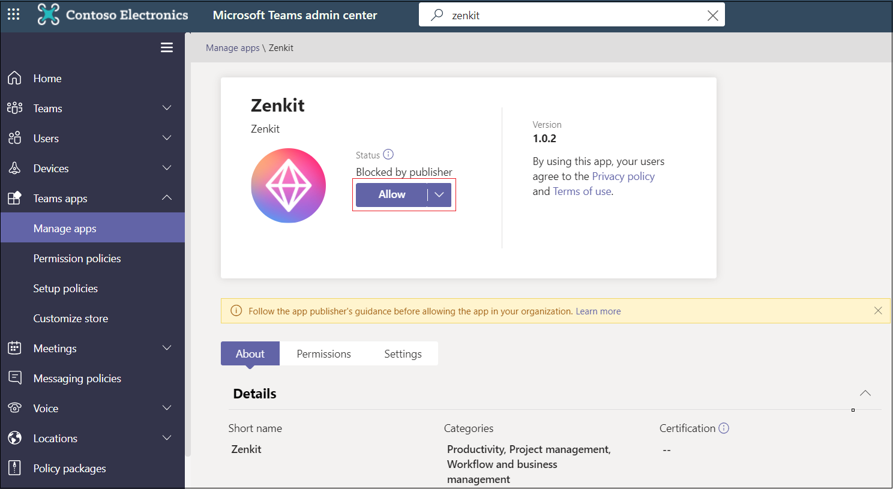

# Personalizar la Teams aplicación

## Habilitar la aplicación Microsoft Teams personalizada

Puedes permitir a los clientes personalizar algunos aspectos de la aplicación Microsoft Teams en el centro Teams administración. Esta característica solo es compatible con las aplicaciones publicadas en la Teams tienda. Las aplicaciones y aplicaciones de instalación local publicadas para una organización no se pueden personalizar.

Algunos ejemplos posibles de esta característica incluyen:

* Cambiar el color de acento de la aplicación para que coincida con la marca de una organización.
* Actualizar el nombre de la aplicación de *Contoso* al *agente contoso*, que es el nombre que verán los usuarios de la organización. (Nota: Los usuarios que agreguen un conector a un chat o un canal seguirán ven el nombre de la aplicación original, *Contoso*.)

Puede habilitar esta característica en el Portal de [desarrolladores para Teams](https://dev.teams.microsoft.com/home). Esto configura , que no está disponible en versiones anteriores a `configurableProperties` la 1.10 del manifiesto Teams aplicación.

### Probar la aplicación

No puede probar esta característica durante el desarrollo. La personalización de aplicaciones no se admite al cargar o publicar localmente en el catálogo de aplicaciones de una organización.

### Consideraciones del usuario

Proporciona instrucciones para los clientes (específicamente Teams administradores) que desean personalizar la aplicación. Para obtener más información, [consulta Personalizar aplicaciones en Teams](/MicrosoftTeams/customize-apps).

## Ocultar Teams aplicación hasta que el administrador lo apruebe

Para mejorar Teams de la aplicación, puedes ocultar una aplicación de los usuarios de forma predeterminada hasta que el administrador permita mostrar la aplicación. Por ejemplo, Contoso Electronics ha creado una aplicación de servicio de ayuda para Teams. Para habilitar el funcionamiento adecuado de la aplicación, Contoso Electronics' quiere que los clientes configuren primero propiedades específicas de la aplicación. La aplicación está oculta de forma predeterminada y solo está disponible para los usuarios después de que el administrador lo permita.

Para ocultar la aplicación, en el archivo de manifiesto de la aplicación, establezca la `defaultBlockUntilAdminAction` propiedad en `true` . Cuando la propiedad se establece en , en Teams centro de administración > Administrar aplicaciones , Bloqueado por el editor aparece en estado `true` de la **aplicación:**  

El administrador obtiene una solicitud para tomar medidas antes de que un usuario pueda acceder a la aplicación. En **Administrar aplicaciones,** los administradores pueden seleccionar **Permitir** para permitir la aplicación con Estado bloqueado **por editor:**

Si de forma predeterminada, no quieres que la aplicación esté oculta, puedes actualizar la `defaultBlockUntilAdminAction` propiedad a `false` . Cuando se apruebe la nueva versión de la aplicación, la aplicación se permitirá de forma predeterminada siempre y cuando el administrador no haya realizado ninguna acción explícita.

> [!NOTE]
> `defaultBlockUntilAdminAction` no es compatible con aplicaciones de LOB. Si cargas una aplicación de LOB con esta propiedad, no se bloqueará la aplicación.

## Consulte también

* [Esquema del manifiesto de la aplicación](/MicrosoftTeams/manifest-schema)
* [Personalizar aplicaciones en el Centro Teams administración](/MicrosoftTeams/customize-apps)

