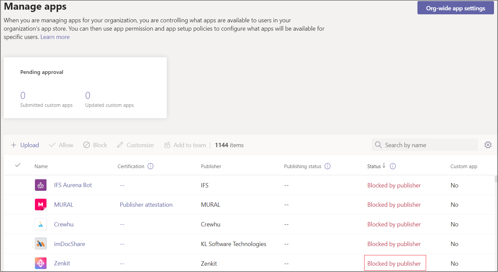

# Personalizar la aplicación de Teams

## Habilitar la aplicación de Microsoft Teams para personalizarla

Puede permitir que los clientes personalicen algunos aspectos de la aplicación de Microsoft Teams en el Centro de administración de Teams. Esta función solo se admite para las aplicaciones publicadas en la tienda de Teams. Las aplicaciones transferidas localmente y las aplicaciones publicadas para una organización no se pueden personalizar.

Algunos ejemplos posibles de esta función son:

* Cambiar el color de énfasis de la aplicación para que coincida con la marca de una organización.
* Actualizando el nombre de la aplicación de *Contoso* a *Agente de Contoso*, que es el nombre que verán los usuarios de la organización. (Nota: Los usuarios que agreguen un conector a un chat o un canal seguirán viendo el nombre de la aplicación original, *Contoso*).

Puede habilitar esta función en el [Portal para desarrolladores para Teams](https://dev.teams.microsoft.com/home). Esto configura `configurableProperties`, que no está disponible en versiones anteriores a la 1.10 del manifiesto de aplicación de Teams.

### Probar la aplicación

No se puede probar esta característica durante el desarrollo. No se admite la personalización de aplicaciones al transferir localmente o publicar en el catálogo de aplicaciones de una organización.

### Consideraciones del usuario

Proporcione instrucciones para los clientes (en concreto, los administradores de Teams) que quieran personalizar la aplicación. Para obtener más información, vea [personalizar aplicaciones en Teams](/MicrosoftTeams/customize-apps).

## Ocultar aplicación de Teams hasta que el administrador la apruebe

Para optimizar la experiencia de la aplicación de Teams, puede ocultar una aplicación a los usuarios de forma predeterminada hasta que el administrador permita mostrar la aplicación. Por ejemplo, Contoso Electronics ha creado una aplicación de soporte técnico para Teams. Para habilitar el funcionamiento adecuado de la aplicación, Contoso Electronics’ quiere que los clientes configuren primero propiedades específicas de la aplicación. La aplicación está oculta de forma predeterminada y solo está disponible para los usuarios después de que el administrador lo permita.

> [!NOTE]
> La tienda de Teams ha evolucionado:
> 
> Anteriormente, las aplicaciones LOB se actualizaban seleccionando los puntos suspensivos en el icono. Con la experiencia actualizada de la tienda de Teams, ahora puede actualizar las aplicaciones LOB iniciando sesión en el [Centro de administración de Teams](https://admin.teams.microsoft.com).

Para ocultar la aplicación, en el archivo de manifiesto de la aplicación, establezca la `defaultBlockUntilAdminAction` propiedad en `true`. Cuando la propiedad se establece en `true`, en el Centro de administración de Teams > **Administrar aplicaciones**, **Bloqueado por el editor** aparece en el **estado**  de la aplicación:

El administrador obtiene una solicitud para tomar medidas antes de que un usuario pueda acceder a la aplicación. En **Administrar aplicaciones**, los administradores pueden seleccionar **Permitir** para permitir que la aplicación con estado **bloqueado por el editor**:

Si, de forma predeterminada, no desea que la aplicación esté oculta, puede actualizar la propiedad `defaultBlockUntilAdminAction` a `false`. Cuando se aprueba la nueva versión de la aplicación, se permitirá de forma predeterminada la aplicación siempre y cuando el administrador no haya realizado ninguna acción explícita.

> [!NOTE]
> `defaultBlockUntilAdminAction` no se admite para aplicaciones LOB. Si carga una aplicación LOB con esta propiedad, la aplicación no se bloqueará.

## Consulte también

* [Esquema del manifiesto de la aplicación](/microsoftteams/platform/resources/schema/manifest-schema)
* [Personalizar aplicaciones en el centro de administración de Teams](/MicrosoftTeams/customize-apps)