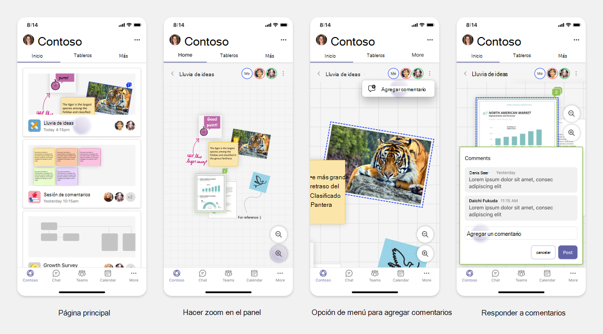

# Planear pestañas con capacidad de respuesta para dispositivo móvil de Teams

 La plataforma Teams ofrece la oportunidad de crear aplicaciones en dispositivos móviles y de escritorio. Los usuarios de la aplicación pueden preferir el escritorio, el móvil o ambos tipos de dispositivos. Los usuarios pueden preparar los datos en el escritorio, pero consumir y compartir más datos con dispositivos móviles. La clave para compilar cualquier aplicación es comprender y satisfacer las necesidades de los usuarios. Hay funcionalidades como bots, extensiones de mensajes y conectores que funcionan sin problemas en el escritorio y los dispositivos móviles. Sin embargo, la creación de pestañas y módulos de tareas requiere planificar el hospedaje de su experiencia web en Teams para dispositivos móviles. El artículo le guía para planificar las páginas web con capacidad de respuesta en Teams para dispositivos móviles.

## Identificación del ámbito de las aplicaciones

En la lista siguiente se proporciona la información clave para planificar la creación de aplicaciones para Teams para dispositivos móviles:

* Considere la funcionalidad entre dispositivos de la aplicación Teams. Por ejemplo, si tiene una aplicación de buen rendimiento en el escritorio, puede explorar para crear una aplicación similar en dispositivos móviles. Inicialmente, puede ser difícil cambiar toda la experiencia de escritorio en dispositivos móviles. Puede empezar con escenarios básicos pero comunes. Agregue funcionalidades y capacidades después de recopilar más información y comentarios de los usuarios.

* Cerciórese de dirigirse a la persona de usuario adecuada en dispositivos móviles. Por ejemplo, si va a crear una aplicación que proporciona servicio a los usuarios finales y también proporciona acceso a datos a los desarrolladores y administradores sénior, los usuarios finales podrán usar la aplicación más mientras empieza a compilar la aplicación en Teams para dispositivos móviles. Sin embargo, puede satisfacer todos los roles que tiene en la aplicación de escritorio; no obstante, se recomienda empezar con un rol con una base más grande y posibles usuarios pioneros para una experiencia con pantalla más pequeña. Según el ejemplo, los usuarios finales son los roles de usuario adecuados. Puede agregar gradualmente funcionalidades para admitir otros roles de usuario en su dispositivo móvil de Teams.

## Comprender las distintas fases para compilar aplicaciones

Después de identificar el ámbito de la aplicación, es el momento de comprender las tres fases siguientes para planificar cualquier aplicación en Teams para dispositivos móviles y optimizar la experiencia del usuario:

1. **Consumo**

   Ver aplicaciones en dispositivos móviles. Para compilar una aplicación en dispositivos móviles, puede empezar con la experiencia de consumo. Dado que el mundo móvil ha hecho que el desplazamiento por el contenido sea una práctica común, usted puede mostrar información relevante. Use mecanismos de participación, como son notificaciones para informar de las actualizaciones.

2. **Acciones rápidas**

   Use la aplicación en dispositivos móviles. Después de que los usuarios empiecen a consumir el contenido en dispositivos móviles, puede escalar la aplicación al siguiente nivel migrando algunas acciones desde la aplicación de escritorio. Puede optimizar y crear nuevas acciones para dispositivos móviles.

3. **Activación**

   Proporcionar experiencias de aplicación completas para interactuar en dispositivos móviles. A medida que los usuarios interactúan con la aplicación, proporcione una experiencia inmersiva completa en dispositivos móviles, ya sea a la par o mejor aún que la experiencia de escritorio. Para proporcionar una buena experiencia a los usuarios, haga que todos los casos de uso respondan en dispositivos móviles.

> [!TIP]
> Para obtener información sobre las directrices de diseño, vea [proceso de diseño para las aplicaciones de Teams](design-teams-app-process.md).

## Casos de uso

Vamos a ver los siguientes casos de uso para comprender cómo planificar diferentes tipos de aplicaciones para Teams para dispositivos móviles:

 

<b>Aplicaciones de visualización de datos y paneles</b>

Puede comprender cómo planear pestañas dinámicas para las aplicaciones de visualización de datos y paneles en la plataforma móvil de Teams.

Consumo:

En la primera fase, puede implementar la experiencia de consumo más básica para ver los datos. El propósito de cualquier aplicación del dominio es mostrar datos en forma de visualizaciones. En la aplicación, puede mostrar visualizaciones vistas recientemente en el escritorio o una lista de todos los gráficos autorizados para los usuarios. Después de crear paneles en el escritorio, los usuarios pueden acceder a la información mediante dispositivos móviles. Puede mostrar una vista detallada de cualquier gráfico seleccionado por el usuario como una vista expandida en las pestañas o mediante módulos de tareas.

Puede mostrar la siguiente información:

* Paneles y resúmenes.
* Objetos visuales de datos, mapas e infografías.
* Gráficos, gráficos y tablas.

Acciones rápidas:

En la segunda fase, los usuarios pueden trabajar en los gráficos y objetos visuales ya existentes desde la experiencia de escritorio. Puede introducir las siguientes acciones:

* Buscar contenido.
* Filtrar datos.
* Crear marcadores.

Habilitación:

En la tercera fase, permita a los usuarios crear contenido como son gráficos y cuadros desde cero. Cerciórese de presentar todas las funcionalidades de la aplicación para dispositivos móviles. Por ejemplo, puede usar módulos de tareas para ayudar a acceder a elementos de datos específicos con una vista detallada.

Puede proporcionar el siguiente acceso a los usuarios:

* Modifique el título y la descripción.
* Insertar elementos de datos para crear visualizaciones.
* Comparta visualizaciones en un canal o chat de grupo.

 

 

<b>Aplicaciones de incorporación de tareas</b>

Puede comprender cómo planificar pestañas con capacidad de respuesta para las aplicaciones de incorporación de tareas en la plataforma móvil de Teams.

Consumo:

En la primera fase, la aplicación puede mostrar la lista de tareas al usuario en una pila vertical. Si hay varias categorías de tareas, como pueden ser **Propuesto**, **Activo** y **Cerrado**, proporcione filtros para mostrar las tareas agrupadas o como encabezados para ver las tareas agrupadas.

Acciones rápidas:

En la segunda fase, puede proporcionar a los usuarios el siguiente acceso a la aplicación:

* Cree tareas o elementos con los campos obligatorios para reducir la carga cognitiva de los usuarios.
* Cambie el tipo de placa o la vista.
* Revise las tareas expandiendo la vista.
* Use módulos de tareas para ver la vista detallada.
* Mueva las tareas a distintas categorías.
* Comparta las tareas pertinentes en chats y canales a través de correos electrónicos y fuente de actividad.

Habilitación:

En la tercera fase, puede habilitar la experiencia de los usuarios con las actividades siguientes:

* Agregue nuevos proyectos y paneles.
* Agregue y modifique diferentes categorías, como **Propuesto**, **Activo** y **Cerrado**.
* Configure las tareas para comentarios, datos adjuntos y otras características complejas.

 

 

<b>Aplicaciones de coautoría y pizarra</b>

Puede entender cómo planificar pestañas con capacidad de respuesta para aplicaciones de coautoría y pizarra en la plataforma móvil de Teams.

Consumo:

En la primera fase, puede considerar la experiencia de escritorio para mostrar el contenido y los recursos de la aplicación.  Puede mostrar las siguientes funciones:

* Comentarios o comentarios.
* Acercar o alejar.
* Fase actual o progreso de un documento pendiente.

Acciones rápidas:

En la segunda fase, puede introducir las siguientes acciones:

* Cree un nuevo panel para la colaboración o nuevos documentos para la firma.
* Comparta los paneles internamente y también con los invitados.
* Configure los permisos de administrador.

> [!TIP]
> Las acciones se exponen, que se pueden mostrar fácilmente en las pantallas pequeñas.

Habilitación:

En la tercera fase, proporcione una experiencia completa a los usuarios. Puede habilitar la experiencia de los usuarios con las actividades siguientes:

* Agregar texto, formas y notas rápidas.
* Navegue por el contenido.
* Agregue capas y filtros.
* Operaciones de eliminación, deshacer y rehacer.
* Acceda a la cámara y al micrófono mediante las API del SDK de JS. Para obtener más información sobre las funcionalidades del dispositivo, consulte [introducción a las funcionalidades del dispositivo](../device-capabilities/device-capabilities-overview.md).

 

## Vea también

Las siguientes directrices de diseño y validación ayudan en función del ámbito de la aplicación:

* [Diseñar la pestaña](../../tabs/design/tabs.md)
* [Cómo diseñar su bot](../../bots/design/bots.md)
* [Diseño de módulos de tareas](../..//task-modules-and-cards/task-modules/design-teams-task-modules.md)
* [Directrices de validación de la tienda](../deploy-and-publish/appsource/prepare/teams-store-validation-guidelines.md)
