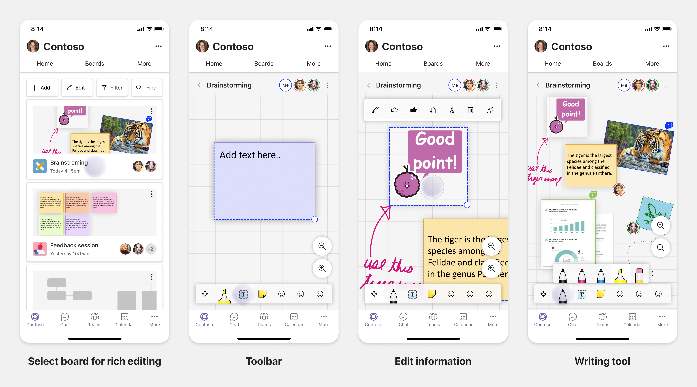

# Planear pestañas con capacidad de respuesta para dispositivo móvil de Teams

 Teams plataforma ofrece la oportunidad de crear aplicaciones en dispositivos móviles y de escritorio. Los usuarios de la aplicación pueden preferir el escritorio o el móvil, o ambos. Los usuarios pueden preparar datos en el escritorio, pero consumir y compartir más datos con el móvil. La clave para crear cualquier aplicación es comprender y satisfacer las necesidades de los usuarios. Hay capacidades como bots, extensiones de mensajería y conectores que funcionan sin problemas en escritorio y móvil. Sin embargo, la creación de pestañas y módulos de tareas requiere planear el hospedaje de la experiencia web en Teams móvil. El documento guía para planear las páginas web con capacidad de respuesta Teams móvil.

## Identificar el ámbito de aplicaciones

La siguiente lista proporciona la información clave para planear la creación de aplicaciones para Teams móvil:

* Considera la funcionalidad entre dispositivos de Teams aplicación. Por ejemplo, si tienes una aplicación de buen rendimiento en el escritorio, puedes explorar para crear una aplicación similar en el móvil. Inicialmente, puede ser difícil cambiar toda la experiencia de escritorio en el móvil. Puede empezar con escenarios básicos pero comunes. Agregue funcionalidades y funcionalidades después de recopilar más información y comentarios de los usuarios.

* Asegúrese de dirigirse a la persona de usuario adecuada en el móvil. Por ejemplo, si estás creando una aplicación que proporciona servicio a los usuarios finales y también proporciona acceso a datos a desarrolladores y administradores sénior, los usuarios finales pueden usar la aplicación más mientras empiezas a crear la aplicación en Teams móvil. Sin embargo, puedes atender a todas las personas que tienes en la aplicación de escritorio, pero se recomienda empezar con persona con una base más grande y posibles usuarios iniciales para una experiencia de pantalla más pequeña. Según el ejemplo, los usuarios finales son los usuarios adecuados. Puedes agregar funcionalidades gradualmente para admitir otras personas de usuario en tu Teams móvil. 

## Comprender diferentes fases para crear aplicaciones

Después de identificar el ámbito de la aplicación, es hora de comprender las tres fases siguientes para planear cualquier aplicación en Teams móvil y mejorar la experiencia del usuario:

1. **Consumo**

   Ver aplicaciones en dispositivos móviles. Para crear una aplicación en el móvil, puedes empezar con la experiencia de consumo. Dado que el mundo móvil ha hecho que el desplazamiento por contenido sea una práctica habitual, puede mostrar información relevante. Use mecanismos de participación, como notificaciones para informar sobre las actualizaciones.

2. **Acciones rápidas**

   Usa la aplicación en el móvil. Después de que los usuarios comiencen a consumir el contenido en el móvil, puedes escalar la aplicación al siguiente nivel mediante la migración de algunas acciones desde la aplicación de escritorio. Puede optimizar y crear nuevas acciones para dispositivos móviles.

3. **Activación**

   Proporcionar experiencias completas de la aplicación para interactuar con el móvil. A medida que los usuarios interactúan con la aplicación, proporciona una experiencia envolvente completa en el móvil, ya sea a la par o mejor que la experiencia de escritorio. Para proporcionar una buena experiencia a los usuarios, haga que todos los casos de uso respondan en el móvil.

> [!TIP]
> Para obtener información sobre las directrices de diseño, vea [proceso de diseño para Teams aplicaciones](design-teams-app-process.md).

## Casos de uso

Veamos los siguientes casos de uso para comprender cómo planear diferentes tipos de aplicaciones para Teams móvil:

 

<b>Aplicaciones de visualización de paneles y datos</b>

Puedes comprender cómo planear pestañas dinámicas para aplicaciones de visualización de paneles y datos en Teams plataforma móvil.

**Consumo**

En la primera fase, puede implementar la experiencia de consumo más básica para ver los datos. El propósito de cualquier aplicación del dominio es mostrar datos en forma de visualizaciones. En la aplicación, puedes mostrar visualizaciones vistas recientemente en el escritorio o una lista de todos los gráficos autorizados para los usuarios. Después de crear paneles en el escritorio, los usuarios pueden obtener acceso a la información mediante dispositivos móviles. Puede mostrar una vista detallada de cualquier gráfico seleccionado por el usuario como una vista expandida en las pestañas o mediante módulos de tareas.

Puede mostrar la siguiente información: 

* Paneles y resúmenes
* Elementos visuales de datos, mapas e infografías
* Gráficos, gráficos y tablas 

**Acciones rápidas**

En la segunda fase, los usuarios pueden trabajar en los gráficos y elementos visuales existentes desde la experiencia de escritorio. Puede introducir las siguientes acciones:

* Contenido de búsqueda
* Filtrar datos
* Crear marcadores

**Activación**

En la tercera fase, permita a los usuarios crear contenido como gráficos y gráficos desde cero. Asegúrate de introducir todas las funcionalidades de la aplicación para dispositivos móviles. Por ejemplo, puede usar módulos de tareas para ayudar a tener acceso a elementos de datos específicos con una vista detallada.

Puede proporcionar el siguiente acceso a los usuarios:
* Modificar título y descripción
* Insertar elementos de datos para crear visualizaciones
* Compartir visualizaciones en un chat de canal o grupo

 

 

<b>Aplicaciones de abordaje de tareas</b>

Puedes comprender cómo planear pestañas dinámicas para aplicaciones de abordaje de tareas en Teams plataforma móvil.

**Consumo**

En la primera fase, la aplicación puede mostrar la lista de tareas al usuario en una pila vertical. Si hay varias categorías de tareas, como **Proposed**, **Active** y **Closed,** proporcione filtros para mostrar tareas agrupadas o como encabezados para ver las tareas agrupadas.

**Acciones rápidas**

En la segunda fase, puedes proporcionar a los usuarios el siguiente acceso a la aplicación:
* Crear tareas o elementos con los campos obligatorios para reducir la carga cognitiva de los usuarios
* Cambiar el tipo de tabla o la vista
* Revisar tareas expandiendo la vista
* Usar módulos de tareas para ver una vista detallada
* Mover las tareas a diferentes categorías 
* Compartir tareas relevantes en chats y canales a través de correos electrónicos y fuente de actividades

**Activación**

En la tercera fase, puede habilitar la experiencia de los usuarios con las siguientes actividades:
* Agregar nuevos proyectos y paneles
* Agregar y modificar diferentes categorías, como **Proposed**, **Active** y **Closed**
* Configurar las tareas para comentarios, datos adjuntos y otras características complejas

 

 

<b>Aplicaciones de coautoría y pizarra</b>

Puedes comprender cómo planear pestañas adaptables para aplicaciones de coautoría y pizarra en Teams plataforma móvil.

**Consumo**

En la primera fase, puedes considerar la experiencia de escritorio para mostrar el contenido y los activos de la aplicación.  Puede mostrar las siguientes funciones:

* Comentarios o comentarios
* Acercar o alejar
* Fase actual o progreso de un documento pendiente

**Acciones rápidas**

En la segunda fase, puede introducir las siguientes acciones:

* Crear un nuevo directorio para colaboración o nuevos documentos para firmar
* Compartir paneles internamente y también con invitados
* Configurar permisos de administrador

> [!TIP]
> Expone acciones, que se pueden mostrar fácilmente en las pantallas pequeñas.

**Activación**

En la tercera fase, proporcione experiencia completa a los usuarios. Puede habilitar la experiencia de los usuarios con las siguientes actividades:

* Agregar texto, formas y notas rápidas
* Navegar por el contenido
* Agregar capas y filtros
* Operaciones de eliminación, deshacer y rehacer
* Obtenga acceso a la cámara y el micrófono con las API del SDK de JS. Para obtener más información sobre las capacidades del dispositivo, consulta [Información general sobre las funcionalidades del dispositivo.](../device-capabilities/device-capabilities-overview.md)

 

## Vea también

Las siguientes directrices de diseño y validación ayudan en función del ámbito de la aplicación:

* [Diseño de la pestaña](../../tabs/design/tabs.md)
* [Cómo diseñar su bot](../../bots/design/bots.md)
* [Diseño de módulos de tareas](../..//task-modules-and-cards/task-modules/design-teams-task-modules.md)
* [Validación de directrices](../deploy-and-publish/appsource/prepare/teams-store-validation-guidelines.md)
