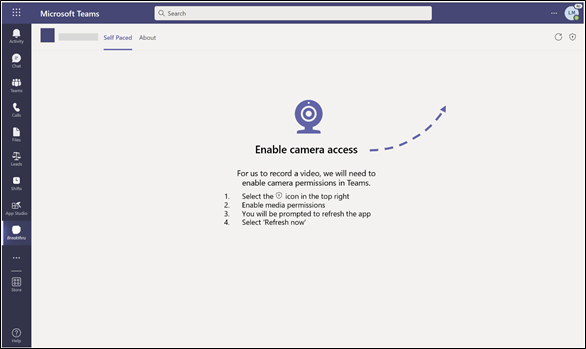

# Permisos de dispositivo para el explorador

Teams aplicación que requiere permisos de dispositivo, como el acceso a cámara o micrófono, ahora requieren que los usuarios concedan permiso manualmente en un nivel de aplicación en el explorador web. Anteriormente, el explorador se encargaba de conceder los permisos de acceso, pero ahora estos permisos se gestionan en Microsoft Teams. Esto tiene implicaciones en la forma de diseñar su aplicación y si requieren estos permisos en el explorador.

## Habilitar los permisos del dispositivo de la aplicación

Si la aplicación de Teams se ha declarado en el [manifiesto de la aplicación](native-device-permissions.md#specify-permissions) que necesita permisos de dispositivo, aparecerá la opción **permisos de aplicación** para que los usuarios habiliten los permisos de dispositivo de la aplicación. La opción **permisos de aplicación** está disponible en las siguientes funcionalidades:

* **Aplicaciones personales y cuadros de diálogo de módulos de tareas**: la opción **Permisos de aplicación** está disponible en la esquina superior derecha de la página.

* **Pestañas de chats, canales o reuniones**: la opción **Permisos de aplicación** está disponible en la lista desplegable de la pestaña. 

Después de seleccionar la opción **Permisos de aplicación**, aparece un elemento emergente donde el usuario puede habilitar el botón de permisos.

Un usuario tendrá que habilitar estos permisos en el explorador para que estos permisos surtan efecto. Después de que el usuario cambie los permisos del dispositivo de la aplicación en el explorador, se le pedirá que vuelva a cargar la aplicación en Teams.

> [!IMPORTANT]
> Debe hacer que los usuarios sepan dónde ir para habilitar estos **permisos de aplicación** en Teams.

## Recomendación

Teams aplicación que requiere permisos de dispositivo en el explorador debe mostrar instrucciones a los usuarios sobre dónde buscar y habilitar estos permisos en la interfaz de usuario de Teams. En función del contexto en el que se ejecute la aplicación, debe asegurarse de que las instrucciones apunten al usuario a la ubicación correcta para acceder a estos permisos. Los permisos difieren para aplicaciones personales, cuadros de diálogo de módulos de tareas, pestañas en chats y canales o reuniones.

 

## Ejemplo de código

|Ejemplo de nombre | Descripción | Node.js |
|----------------|-----------------|--------------|
| Permisos de dispositivo de la pestaña para el explorador | El código de ejemplo muestra cómo mostrar los permisos del dispositivo para el explorador. | [View](https://github.com/OfficeDev/Microsoft-Teams-Samples/tree/main/samples/tab-device-permissions/nodejs) |

## Guía paso a paso

Siga la [guía paso a paso](../../sbs-tab-device-permissions.yml) para conceder permiso de dispositivo de pestaña en Teams.

## Consulte también

* [Información general sobre las funcionalidades del dispositivo](device-capabilities-overview.md)
* [Solicitar permisos de dispositivo](native-device-permissions.md)
