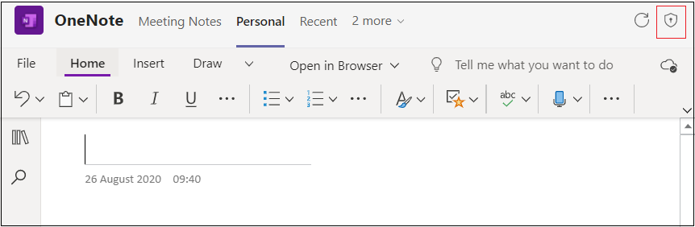

# Permisos de dispositivo para el explorador

Teams que requieren permisos de dispositivo, como acceso a cámara o micrófono, ahora requieren que los usuarios concedan permisos manualmente en un nivel de aplicación en el explorador web. Anteriormente, el explorador controló cómo conceder permisos de acceso, pero ahora estos permisos se controlan en Microsoft Teams. Esto tiene implicaciones en el diseño de la aplicación y si requieren estos permisos en el explorador.

## Habilitar los permisos de dispositivo de la aplicación

Si la aplicación Teams ha declarado en el manifiesto de la  aplicación que necesita permisos de dispositivo, aparece la opción Permisos  de la aplicación para que los usuarios habiliten los permisos de dispositivo de la aplicación. La **opción Permisos de** la aplicación está disponible en las siguientes funcionalidades:

* **Cuadros de diálogo de módulos** de tareas y aplicaciones personales: la opción **Permisos de** la aplicación está disponible en la esquina superior derecha de la página.

* **Pestañas de chat, canal** o reunión: la **opción Permisos** de la aplicación está disponible en el desplegable de la pestaña. 

Una vez **seleccionada la** opción Permisos de la aplicación, aparece un elemento emergente donde el usuario puede habilitar el botón de permisos.

Un usuario tendrá que habilitar estos permisos en el explorador para que estos permisos entren en vigor. Después de que el usuario cambie los permisos de dispositivo de la aplicación en el explorador, se le pedirá que vuelva a cargar la aplicación en Teams.

> [!IMPORTANT]
> Debes hacer que los usuarios conozcan a dónde ir para habilitar estos permisos **de** aplicación en Microsoft Teams.

## Recomendación

Teams que requieren permisos de dispositivo en el explorador deben mostrar instrucciones a los usuarios sobre dónde buscar y habilitar estos permisos en la interfaz Teams usuario. Según el contexto en el que se ejecute la aplicación, debe asegurarse de que las instrucciones indican al usuario que corrija la ubicación para tener acceso a estos permisos, ya que difieren en aplicaciones personales, cuadros de diálogo de módulos de tareas, pestañas en chats y canales o reuniones.

 

## Ejemplo de código

|Ejemplo de nombre | Descripción | Node.js |
|----------------|-----------------|--------------|
| Permisos de dispositivo de tabulación para el explorador | El código de ejemplo muestra cómo mostrar los permisos del dispositivo para el explorador. | [View](https://github.com/OfficeDev/Microsoft-Teams-Samples/tree/main/samples/tab-device-permissions/nodejs) |

## Guía paso a paso

Siga la [guía paso a paso para](../../sbs-tab-device-permissions.yml) conceder permiso de dispositivo de pestaña en Microsoft Teams.

## Consulte también

* [Introducción a las funcionalidades de dispositivos](device-capabilities-overview.md)
* [Solicitar permisos de dispositivo](native-device-permissions.md)
