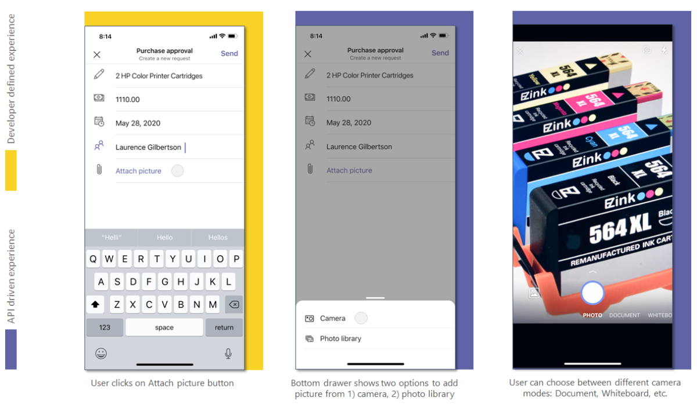

# <a name="integrate-media-capabilities"></a><span data-ttu-id="64d9a-104">Integrar capacidades multimedia</span><span class="sxs-lookup"><span data-stu-id="64d9a-104">Integrate media capabilities</span></span> 

<span data-ttu-id="64d9a-105">Este documento le guía sobre cómo integrar funcionalidades multimedia.</span><span class="sxs-lookup"><span data-stu-id="64d9a-105">This document guides you on how to integrate media capabilities.</span></span> <span data-ttu-id="64d9a-106">Esta integración combina las capacidades nativas del dispositivo, como la **cámara** y **el micrófono** con la plataforma de Teams.</span><span class="sxs-lookup"><span data-stu-id="64d9a-106">This integration combines the native device capabilities, such as the **camera** and **microphone** with the Teams platform.</span></span>  

<span data-ttu-id="64d9a-107">Puedes usar el [SDK de cliente javaScript](/javascript/api/overview/msteams-client?view=msteams-client-js-latest&preserve-view=true)de Microsoft Teams, que proporciona las herramientas necesarias para que la aplicación tenga acceso a los permisos de dispositivo de un [usuario.](native-device-permissions.md)</span><span class="sxs-lookup"><span data-stu-id="64d9a-107">You can use [Microsoft Teams JavaScript client SDK](/javascript/api/overview/msteams-client?view=msteams-client-js-latest&preserve-view=true), that provides the tools necessary for your app to access a user’s [device permissions](native-device-permissions.md).</span></span> <span data-ttu-id="64d9a-108">Usa las API de funcionalidad multimedia adecuadas para integrar  las  capacidades nativas del dispositivo, como la cámara y el micrófono con la plataforma teams dentro de la aplicación móvil de Microsoft Teams, y crea una experiencia más enriquecte.</span><span class="sxs-lookup"><span data-stu-id="64d9a-108">Use suitable  media capability APIs to integrate the native device capabilities, such as the **camera** and **microphone** with the Teams platform within your Microsoft Teams mobile app, and build a richer experience.</span></span> 

## <a name="advantage-of-integrating-media-capabilities"></a><span data-ttu-id="64d9a-109">Ventaja de integrar capacidades multimedia</span><span class="sxs-lookup"><span data-stu-id="64d9a-109">Advantage of integrating media capabilities</span></span>

<span data-ttu-id="64d9a-110">La principal ventaja de integrar las capacidades de dispositivo en tus aplicaciones de Teams es que aprovecha los controles nativos de Teams para proporcionar una experiencia enriqueciendo e inmersiva a los usuarios.</span><span class="sxs-lookup"><span data-stu-id="64d9a-110">The main advantage of integrating device capabilities in your Teams apps is it leverages native Teams controls to provide a rich and immersive experience to your users.</span></span>
<span data-ttu-id="64d9a-111">Para integrar las funcionalidades multimedia, debes actualizar el archivo de manifiesto de la aplicación y llamar a las API de funcionalidad multimedia.</span><span class="sxs-lookup"><span data-stu-id="64d9a-111">To integrate media capabilities you must update the app manifest file and call the media capability APIs.</span></span> 

<span data-ttu-id="64d9a-112">Para una integración eficaz, debe tener una buena comprensión de los fragmentos de código para llamar a las API [correspondientes,](#code-snippets) lo que le permite usar funcionalidades multimedia nativas.</span><span class="sxs-lookup"><span data-stu-id="64d9a-112">For effective integration, you must have a good understanding of [code snippets](#code-snippets) for calling the respective APIs, which allow you to use native media capabilities.</span></span>

<span data-ttu-id="64d9a-113">Es importante familiarizarse con los errores de respuesta [de la API](#error-handling) para controlar los errores de la aplicación de Teams.</span><span class="sxs-lookup"><span data-stu-id="64d9a-113">It is important to familiarize yourself with the [API response errors](#error-handling) to handle the errors in your Teams app.</span></span>

> [!NOTE] 
> <span data-ttu-id="64d9a-114">Actualmente, la compatibilidad de Microsoft Teams con las capacidades multimedia solo está disponible para clientes móviles.</span><span class="sxs-lookup"><span data-stu-id="64d9a-114">Currently, Microsoft Teams support for media capabilities is only available for mobile clients.</span></span>

## <a name="update-manifest"></a><span data-ttu-id="64d9a-115">Manifiesto de actualización</span><span class="sxs-lookup"><span data-stu-id="64d9a-115">Update manifest</span></span>

<span data-ttu-id="64d9a-116">Actualice la aplicación de Teams [manifest.jsarchivo](../../resources/schema/manifest-schema.md#devicepermissions) agregando la propiedad `devicePermissions` y especificando `media` .</span><span class="sxs-lookup"><span data-stu-id="64d9a-116">Update your Teams app [manifest.json](../../resources/schema/manifest-schema.md#devicepermissions) file by adding the `devicePermissions` property and specifying `media`.</span></span> <span data-ttu-id="64d9a-117">Permite a la aplicación solicitar los permisos necesarios a  los usuarios antes de empezar a usar la cámara para capturar  la imagen, abrir la galería para seleccionar una imagen para enviar como datos adjuntos o usar el micrófono para grabar la conversación.</span><span class="sxs-lookup"><span data-stu-id="64d9a-117">It allows your app to ask for requisite permissions from users before they start using  the **camera** to capture the image, open the gallery to select an image to submit as an attachment, or use the **microphone** to record the conversation.</span></span>

``` json
"devicePermissions": [
    "media",
],
```

> [!NOTE]
> <span data-ttu-id="64d9a-118">El **símbolo del sistema Solicitar permisos** se muestra automáticamente cuando se inicia una API de Teams relevante.</span><span class="sxs-lookup"><span data-stu-id="64d9a-118">The **Request Permissions** prompt is automatically displayed when a relevant Teams API is initiated.</span></span> <span data-ttu-id="64d9a-119">Para obtener más información, consulta [Solicitar permisos de dispositivo](native-device-permissions.md).</span><span class="sxs-lookup"><span data-stu-id="64d9a-119">For more information, see [Request device permissions](native-device-permissions.md).</span></span>

## <a name="media-capability-apis"></a><span data-ttu-id="64d9a-120">API de funcionalidad multimedia</span><span class="sxs-lookup"><span data-stu-id="64d9a-120">Media capability APIs</span></span>

<span data-ttu-id="64d9a-121">Las [API selectMedia,](/javascript/api/@microsoft/teams-js/media?view=msteams-client-js-latest#selectMedia_MediaInputs___error__SdkError__attachments__Media_______void_&preserve-view=true) [getMedia](/javascript/api/@microsoft/teams-js/_media?view=msteams-client-js-latest#getMedia__error__SdkError__blob__Blob_____void_&preserve-view=true)y [viewImages](/javascript/api/@microsoft/teams-js/media?view=msteams-client-js-latest#viewImages_ImageUri_____error___SdkError_____void_&preserve-view=true) permiten usar las funciones multimedia nativas de la siguiente manera:</span><span class="sxs-lookup"><span data-stu-id="64d9a-121">The [selectMedia](/javascript/api/@microsoft/teams-js/media?view=msteams-client-js-latest#selectMedia_MediaInputs___error__SdkError__attachments__Media_______void_&preserve-view=true), [getMedia](/javascript/api/@microsoft/teams-js/_media?view=msteams-client-js-latest#getMedia__error__SdkError__blob__Blob_____void_&preserve-view=true), and [viewImages](/javascript/api/@microsoft/teams-js/media?view=msteams-client-js-latest#viewImages_ImageUri_____error___SdkError_____void_&preserve-view=true) APIs enable you to use native media capabilities as follows:</span></span>

* <span data-ttu-id="64d9a-122">Usa el micrófono **nativo para** permitir a los usuarios grabar **audio** (grabar 10 minutos de conversación) desde el dispositivo.</span><span class="sxs-lookup"><span data-stu-id="64d9a-122">Use the native **microphone** to allow users to **record audio** (record 10 minutes of conversation) from the device.</span></span>
* <span data-ttu-id="64d9a-123">Usa el **control de cámara** nativa para permitir a los usuarios capturar y adjuntar **imágenes** sobre la marcha.</span><span class="sxs-lookup"><span data-stu-id="64d9a-123">Use native **camera control** to allow users to **capture and attach images** on the go.</span></span>
* <span data-ttu-id="64d9a-124">Usa la compatibilidad **de galería nativa** para permitir a los usuarios seleccionar imágenes del dispositivo **como** datos adjuntos.</span><span class="sxs-lookup"><span data-stu-id="64d9a-124">Use native **gallery support** to allow users to **select device images** as attachments.</span></span>
* <span data-ttu-id="64d9a-125">Usa el **control visor de imágenes nativo** para obtener una vista previa de varias **imágenes** a la vez.</span><span class="sxs-lookup"><span data-stu-id="64d9a-125">Use native **image viewer control** to **preview multiple images** at one time.</span></span>
* <span data-ttu-id="64d9a-126">Admite **la transferencia de imágenes grandes** (de 1 MB a 50 MB) a través del puente sdk.</span><span class="sxs-lookup"><span data-stu-id="64d9a-126">Support **large image transfer** (from 1 MB to 50 MB) through the SDK bridge.</span></span>
* <span data-ttu-id="64d9a-127">Admite **funciones avanzadas de imagen** que permiten a los usuarios obtener una vista previa y editar imágenes:</span><span class="sxs-lookup"><span data-stu-id="64d9a-127">Support **advanced image capabilities** allowing users to preview and edit images:</span></span>
  * <span data-ttu-id="64d9a-128">Digitalizar documentos, pizarras y tarjetas de presentación a través de la cámara.</span><span class="sxs-lookup"><span data-stu-id="64d9a-128">Scan document, whiteboard, and business cards  through the camera.</span></span>
  
> [!IMPORTANT]
> * <span data-ttu-id="64d9a-129">Las API , y se pueden invocar desde varias superficies de `selectMedia` `getMedia` `viewImages` Teams, como módulos de tareas, pestañas y aplicaciones personales.</span><span class="sxs-lookup"><span data-stu-id="64d9a-129">The `selectMedia`, `getMedia`, and `viewImages` APIs can be invoked from multiple Teams surfaces, such as task modules, tabs, and personal apps.</span></span> <span data-ttu-id="64d9a-130">Para obtener más información, consulta [Puntos de entrada para aplicaciones de Teams.](../extensibility-points.md)</span><span class="sxs-lookup"><span data-stu-id="64d9a-130">For more details, see [Entry points for Teams apps](../extensibility-points.md).</span></span>
> * <span data-ttu-id="64d9a-131">`selectMedia` La API se ha extendido para admitir propiedades de micrófono y audio.</span><span class="sxs-lookup"><span data-stu-id="64d9a-131">`selectMedia` API has been extended to support microphone and audio properties.</span></span>

<span data-ttu-id="64d9a-132">Debes usar el siguiente conjunto de API para habilitar las capacidades multimedia del dispositivo:</span><span class="sxs-lookup"><span data-stu-id="64d9a-132">You must use the following set of APIs to enable your device's media capabilities:</span></span>

| <span data-ttu-id="64d9a-133">API</span><span class="sxs-lookup"><span data-stu-id="64d9a-133">API</span></span>      | <span data-ttu-id="64d9a-134">Descripción</span><span class="sxs-lookup"><span data-stu-id="64d9a-134">Description</span></span>   |
| --- | --- |
| <span data-ttu-id="64d9a-135">[**selectMedia**](/javascript/api/@microsoft/teams-js/media?view=msteams-client-js-latest#selectMedia_MediaInputs___error__SdkError__attachments__Media_______void_&preserve-view=true) (**Camera)**</span><span class="sxs-lookup"><span data-stu-id="64d9a-135">[**selectMedia**](/javascript/api/@microsoft/teams-js/media?view=msteams-client-js-latest#selectMedia_MediaInputs___error__SdkError__attachments__Media_______void_&preserve-view=true) (**Camera)**</span></span>| <span data-ttu-id="64d9a-136">Esta API permite a los usuarios **capturar o seleccionar medios de la cámara del** dispositivo y devolverlo a la aplicación web.</span><span class="sxs-lookup"><span data-stu-id="64d9a-136">This API allows users to **capture or select media from the device camera** and return it to the web-app.</span></span> <span data-ttu-id="64d9a-137">Los usuarios pueden editar, recortar, girar, anotar o dibujar sobre imágenes antes del envío.</span><span class="sxs-lookup"><span data-stu-id="64d9a-137">The users can edit, crop, rotate, annotate, or draw over images before submission.</span></span> <span data-ttu-id="64d9a-138">En respuesta a , la aplicación web recibe los IDs multimedia de las imágenes seleccionadas `selectMedia` y una miniatura de los medios seleccionados.</span><span class="sxs-lookup"><span data-stu-id="64d9a-138">In response to `selectMedia`, the web-app receives the media IDs of selected images and a thumbnail of the selected media.</span></span> <span data-ttu-id="64d9a-139">Esta API se puede configurar aún más a través de [la configuración ImageProps.](/javascript/api/@microsoft/teams-js/imageprops?view=msteams-client-js-latest&preserve-view=true)</span><span class="sxs-lookup"><span data-stu-id="64d9a-139">This API can be further configured through the [ImageProps](/javascript/api/@microsoft/teams-js/imageprops?view=msteams-client-js-latest&preserve-view=true) configuration.</span></span> |
| <span data-ttu-id="64d9a-140">[**selectMedia**](/javascript/api/@microsoft/teams-js/media?view=msteams-client-js-latest#selectMedia_MediaInputs___error__SdkError__attachments__Media_______void_&preserve-view=true) (**Microphone**)</span><span class="sxs-lookup"><span data-stu-id="64d9a-140">[**selectMedia**](/javascript/api/@microsoft/teams-js/media?view=msteams-client-js-latest#selectMedia_MediaInputs___error__SdkError__attachments__Media_______void_&preserve-view=true) (**Microphone**)</span></span>| <span data-ttu-id="64d9a-141">Establece el [mediaType en](/javascript/api/@microsoft/teams-js/mediatype?view=msteams-client-js-latest&preserve-view=true) `4` en la API para obtener acceso a la funcionalidad de `selectMedia` micrófono.</span><span class="sxs-lookup"><span data-stu-id="64d9a-141">Set the [mediaType](/javascript/api/@microsoft/teams-js/mediatype?view=msteams-client-js-latest&preserve-view=true) to `4` in `selectMedia` API for accessing microphone  capability.</span></span> <span data-ttu-id="64d9a-142">Esta API también permite a los usuarios grabar audio desde el micrófono del dispositivo y devolver clips grabados a la aplicación web.</span><span class="sxs-lookup"><span data-stu-id="64d9a-142">This API also allows users to record audio from the device microphone and return recorded clips to the web-app.</span></span> <span data-ttu-id="64d9a-143">Los usuarios pueden pausar, volver a grabar y reproducir la vista previa de grabación antes del envío.</span><span class="sxs-lookup"><span data-stu-id="64d9a-143">The users can pause, re-record, and play recording preview before submission.</span></span> <span data-ttu-id="64d9a-144">En respuesta a **selectMedia,** la aplicación web recibe los IDs multimedia de la grabación de audio seleccionada.</span><span class="sxs-lookup"><span data-stu-id="64d9a-144">In response to **selectMedia**, the web-app receives media IDs of the selected audio recording.</span></span> <br/> <span data-ttu-id="64d9a-145">Use `maxDuration` , si necesita configurar una duración en minutos para grabar la conversación.</span><span class="sxs-lookup"><span data-stu-id="64d9a-145">Use `maxDuration`, if you require to configure a duration in minutes for recording the conversation.</span></span> <span data-ttu-id="64d9a-146">La duración actual de la grabación es de 10 minutos, después de lo cual finaliza la grabación.</span><span class="sxs-lookup"><span data-stu-id="64d9a-146">The current duration for recording is 10 minutes, after which the recording terminates.</span></span>  |
| [<span data-ttu-id="64d9a-147">**getMedia**</span><span class="sxs-lookup"><span data-stu-id="64d9a-147">**getMedia**</span></span>](/javascript/api/@microsoft/teams-js/_media?view=msteams-client-js-latest#getMedia__error__SdkError__blob__Blob_____void_&preserve-view=true)| <span data-ttu-id="64d9a-148">Esta API recupera los medios capturados por `selectMedia` la API en fragmentos, independientemente del tamaño de los medios.</span><span class="sxs-lookup"><span data-stu-id="64d9a-148">This API retrieves the media captured by `selectMedia` API in chunks, irrespective of the media size.</span></span> <span data-ttu-id="64d9a-149">Estos fragmentos se ensamblan y se envían a la aplicación web como un archivo o blob.</span><span class="sxs-lookup"><span data-stu-id="64d9a-149">These chunks are assembled and sent back to the web app as a file or blob.</span></span> <span data-ttu-id="64d9a-150">Dividir los medios en fragmentos más pequeños facilita la transferencia de archivos de gran tamaño.</span><span class="sxs-lookup"><span data-stu-id="64d9a-150">Breaking of media into smaller chunks facilitates large file transfer.</span></span> |
| [<span data-ttu-id="64d9a-151">**viewImages**</span><span class="sxs-lookup"><span data-stu-id="64d9a-151">**viewImages**</span></span>](/javascript/api/@microsoft/teams-js/media?view=msteams-client-js-latest#viewImages_ImageUri_____error___SdkError_____void_&preserve-view=true)| <span data-ttu-id="64d9a-152">Esta API permite al usuario ver imágenes en modo de pantalla completa como una lista desplazable.</span><span class="sxs-lookup"><span data-stu-id="64d9a-152">This API enables the user to view images in  full-screen mode as a scrollable list.</span></span>|


<span data-ttu-id="64d9a-153">**Experiencia de aplicación web para la API de selectMedia para la funcionalidad de imagen** 
 </span><span class="sxs-lookup"><span data-stu-id="64d9a-153">**Web app experience for selectMedia API for image capability**
</span></span>

<span data-ttu-id="64d9a-154">**Experiencia de aplicación web para la API de selectMedia para la funcionalidad de micrófono** 
 </span><span class="sxs-lookup"><span data-stu-id="64d9a-154">**Web app experience for selectMedia API for microphone capability**
</span></span>

## <a name="error-handling"></a><span data-ttu-id="64d9a-155">Control de errores</span><span class="sxs-lookup"><span data-stu-id="64d9a-155">Error handling</span></span>

<span data-ttu-id="64d9a-156">Debes asegurarte de controlar estos errores correctamente en la aplicación de Teams.</span><span class="sxs-lookup"><span data-stu-id="64d9a-156">You must ensure to handle these errors appropriately in your Teams app.</span></span> <span data-ttu-id="64d9a-157">En la tabla siguiente se enumeran los códigos de error y las condiciones en las que se generan los errores:</span><span class="sxs-lookup"><span data-stu-id="64d9a-157">The following table lists the error codes and the conditions under which the errors are generated:</span></span> 


|<span data-ttu-id="64d9a-158">Código de error</span><span class="sxs-lookup"><span data-stu-id="64d9a-158">Error code</span></span> |  <span data-ttu-id="64d9a-159">Nombre del error</span><span class="sxs-lookup"><span data-stu-id="64d9a-159">Error name</span></span>     | <span data-ttu-id="64d9a-160">Condition</span><span class="sxs-lookup"><span data-stu-id="64d9a-160">Condition</span></span>|
| --------- | --------------- | -------- |
| <span data-ttu-id="64d9a-161">**100**</span><span class="sxs-lookup"><span data-stu-id="64d9a-161">**100**</span></span> | <span data-ttu-id="64d9a-162">NOT_SUPPORTED_ON_PLATFORM</span><span class="sxs-lookup"><span data-stu-id="64d9a-162">NOT_SUPPORTED_ON_PLATFORM</span></span> | <span data-ttu-id="64d9a-163">La API no se admite en la plataforma actual.</span><span class="sxs-lookup"><span data-stu-id="64d9a-163">API is not supported on the current platform.</span></span>|
| <span data-ttu-id="64d9a-164">**404**</span><span class="sxs-lookup"><span data-stu-id="64d9a-164">**404**</span></span> | <span data-ttu-id="64d9a-165">FILE_NOT_FOUND</span><span class="sxs-lookup"><span data-stu-id="64d9a-165">FILE_NOT_FOUND</span></span> | <span data-ttu-id="64d9a-166">El archivo especificado no se encuentra en la ubicación determinada.</span><span class="sxs-lookup"><span data-stu-id="64d9a-166">File specified is not found in the given location.</span></span>|
| <span data-ttu-id="64d9a-167">**500**</span><span class="sxs-lookup"><span data-stu-id="64d9a-167">**500**</span></span> | <span data-ttu-id="64d9a-168">INTERNAL_ERROR</span><span class="sxs-lookup"><span data-stu-id="64d9a-168">INTERNAL_ERROR</span></span> | <span data-ttu-id="64d9a-169">Se produce un error interno al realizar la operación necesaria.</span><span class="sxs-lookup"><span data-stu-id="64d9a-169">Internal error is encountered while performing the required operation.</span></span>|
| <span data-ttu-id="64d9a-170">**1000**</span><span class="sxs-lookup"><span data-stu-id="64d9a-170">**1000**</span></span> | <span data-ttu-id="64d9a-171">PERMISSION_DENIED</span><span class="sxs-lookup"><span data-stu-id="64d9a-171">PERMISSION_DENIED</span></span> |<span data-ttu-id="64d9a-172">El usuario deniega el permiso.</span><span class="sxs-lookup"><span data-stu-id="64d9a-172">Permission is denied by the user.</span></span>|
| <span data-ttu-id="64d9a-173">**2000**</span><span class="sxs-lookup"><span data-stu-id="64d9a-173">**2000**</span></span> |<span data-ttu-id="64d9a-174">NETWORK_ERROR</span><span class="sxs-lookup"><span data-stu-id="64d9a-174">NETWORK_ERROR</span></span> | <span data-ttu-id="64d9a-175">Problema de red.</span><span class="sxs-lookup"><span data-stu-id="64d9a-175">Network issue.</span></span>|
| <span data-ttu-id="64d9a-176">**3000**</span><span class="sxs-lookup"><span data-stu-id="64d9a-176">**3000**</span></span> | <span data-ttu-id="64d9a-177">NO_HW_SUPPORT</span><span class="sxs-lookup"><span data-stu-id="64d9a-177">NO_HW_SUPPORT</span></span> | <span data-ttu-id="64d9a-178">El hardware subyacente no admite la funcionalidad.</span><span class="sxs-lookup"><span data-stu-id="64d9a-178">Underlying hardware does not support the capability.</span></span>|
| <span data-ttu-id="64d9a-179">**4000**</span><span class="sxs-lookup"><span data-stu-id="64d9a-179">**4000**</span></span>| <span data-ttu-id="64d9a-180">INVALID_ARGUMENTS</span><span class="sxs-lookup"><span data-stu-id="64d9a-180">INVALID_ARGUMENTS</span></span> | <span data-ttu-id="64d9a-181">Uno o más argumentos no son válidos.</span><span class="sxs-lookup"><span data-stu-id="64d9a-181">One or more arguments are invalid.</span></span>|
| <span data-ttu-id="64d9a-182">**5000**</span><span class="sxs-lookup"><span data-stu-id="64d9a-182">**5000**</span></span> | <span data-ttu-id="64d9a-183">UNAUTHORIZED_USER_OPERATION</span><span class="sxs-lookup"><span data-stu-id="64d9a-183">UNAUTHORIZED_USER_OPERATION</span></span> | <span data-ttu-id="64d9a-184">El usuario no está autorizado a completar esta operación.</span><span class="sxs-lookup"><span data-stu-id="64d9a-184">User is not authorized to complete this operation.</span></span>|
| <span data-ttu-id="64d9a-185">**6000**</span><span class="sxs-lookup"><span data-stu-id="64d9a-185">**6000**</span></span> |<span data-ttu-id="64d9a-186">INSUFFICIENT_RESOURCES</span><span class="sxs-lookup"><span data-stu-id="64d9a-186">INSUFFICIENT_RESOURCES</span></span> | <span data-ttu-id="64d9a-187">La operación no se pudo completar debido a la falta de recursos.</span><span class="sxs-lookup"><span data-stu-id="64d9a-187">Operation could not be completed due to insufficient resources.</span></span>|
|<span data-ttu-id="64d9a-188">**7000**</span><span class="sxs-lookup"><span data-stu-id="64d9a-188">**7000**</span></span> | <span data-ttu-id="64d9a-189">THROTTLE</span><span class="sxs-lookup"><span data-stu-id="64d9a-189">THROTTLE</span></span> | <span data-ttu-id="64d9a-190">La plataforma limitó la solicitud a medida que la API se invocaba con frecuencia.</span><span class="sxs-lookup"><span data-stu-id="64d9a-190">Platform throttled the request as the API was invoked frequently.</span></span>|
|  <span data-ttu-id="64d9a-191">**8000**</span><span class="sxs-lookup"><span data-stu-id="64d9a-191">**8000**</span></span> | <span data-ttu-id="64d9a-192">USER_ABORT</span><span class="sxs-lookup"><span data-stu-id="64d9a-192">USER_ABORT</span></span> |<span data-ttu-id="64d9a-193">El usuario anula la operación.</span><span class="sxs-lookup"><span data-stu-id="64d9a-193">User aborts the operation.</span></span>|
| <span data-ttu-id="64d9a-194">**9000**</span><span class="sxs-lookup"><span data-stu-id="64d9a-194">**9000**</span></span>| <span data-ttu-id="64d9a-195">OLD_PLATFORM</span><span class="sxs-lookup"><span data-stu-id="64d9a-195">OLD_PLATFORM</span></span> | <span data-ttu-id="64d9a-196">El código de la plataforma está obsoleto y no implementa esta API.</span><span class="sxs-lookup"><span data-stu-id="64d9a-196">Platform code is outdated and does not implement this API.</span></span>|
| <span data-ttu-id="64d9a-197">**10000**</span><span class="sxs-lookup"><span data-stu-id="64d9a-197">**10000**</span></span>| <span data-ttu-id="64d9a-198">SIZE_EXCEEDED</span><span class="sxs-lookup"><span data-stu-id="64d9a-198">SIZE_EXCEEDED</span></span> |  <span data-ttu-id="64d9a-199">El valor devuelto es demasiado grande y ha superado los límites de tamaño de la plataforma.</span><span class="sxs-lookup"><span data-stu-id="64d9a-199">Return value is too big and has exceeded the platform size boundaries.</span></span>|

## <a name="code-snippets"></a><span data-ttu-id="64d9a-200">Fragmentos de código</span><span class="sxs-lookup"><span data-stu-id="64d9a-200">Code snippets</span></span>

<span data-ttu-id="64d9a-201">**Llamada `selectMedia` API** para capturar imágenes con cámara:</span><span class="sxs-lookup"><span data-stu-id="64d9a-201">**Calling `selectMedia` API** for capturing images using camera:</span></span>

```javascript
let imageProp: microsoftTeams.media.ImageProps = {
    sources: [microsoftTeams.media.Source.Camera, microsoftTeams.media.Source.Gallery],
    startMode: microsoftTeams.media.CameraStartMode.Photo,
    ink: false,
    cameraSwitcher: false,
    textSticker: false,
    enableFilter: true,
};
let mediaInput: microsoftTeams.media.MediaInputs = {
    mediaType: microsoftTeams.media.MediaType.Image,
    maxMediaCount: 10,
    imageProps: imageProp
};
microsoftTeams.media.selectMedia(mediaInput, (error: microsoftTeams.SdkError, attachments: microsoftTeams.media.Media[]) => {
    if (error) {
        if (error.message) {
            alert(" ErrorCode: " + error.errorCode + error.message);
        } else {
            alert(" ErrorCode: " + error.errorCode);
        }
    }
    if (attachments) {
        let y = attachments[0];
        img.src = ("data:" + y.mimeType + ";base64," + y.preview);
    }
});
```

<span data-ttu-id="64d9a-202">**Llamada `getMedia` API** para recuperar medios grandes en fragmentos:</span><span class="sxs-lookup"><span data-stu-id="64d9a-202">**Calling `getMedia` API** to retrieve large media in chunks:</span></span>

```javascript
let media: microsoftTeams.media.Media = attachments[0]
media.getMedia((error: microsoftTeams.SdkError, blob: Blob) => {
    if (blob) {
        if (blob.type.includes("image")) {
            img.src = (URL.createObjectURL(blob));
        }
    }
    if (error) {
        if (error.message) {
            alert(" ErrorCode: " + error.errorCode + error.message);
        } else {
            alert(" ErrorCode: " + error.errorCode);
        }
    }
});
```

<span data-ttu-id="64d9a-203">**Llamada `viewImages` API por identificador devuelto por `selectMedia` API:**</span><span class="sxs-lookup"><span data-stu-id="64d9a-203">**Calling `viewImages` API by ID returned by `selectMedia` API**:</span></span>

```javascript
// View images by id:
// Assumption: attachmentArray = select Media API Output
let uriList = [];
if (attachmentArray && attachmentArray.length > 0) {
    for (let i = 0; i < attachmentArray.length; i++) {
        let file = attachmentArray[i];
        if (file.mimeType.includes("image")) {
            let imageUri = {
                value: file.content,
                type: 1,
            }
            uriList.push(imageUri);
        } else {
            alert("File type is not image");
        }
    }
}
if (uriList.length > 0) {
    microsoftTeams.media.viewImages(uriList, (error: microsoftTeams.SdkError) => {
        if (error) {
            if (error.message) {
                output(" ErrorCode: " + error.errorCode + error.message);
            } else {
                output(" ErrorCode: " + error.errorCode);
            }
        }
    });
} else {
    output("Url list is empty");
}
```

<span data-ttu-id="64d9a-204">**Llamada `viewImages` API por dirección URL:**</span><span class="sxs-lookup"><span data-stu-id="64d9a-204">**Calling `viewImages` API by URL**:</span></span>

```javascript
// View Images by URL:
// Assumption 2 urls, url1 and url2
let uriList = [];
if (URL1 != null && URL1.length > 0) {
    let imageUri = {
        value: URL1,
        type: 2,
    }
    uriList.push(imageUri);
}
if (URL2 != null && URL2.length > 0) {
    let imageUri = {
        value: URL2,
        type: 2,
    }
    uriList.push(imageUri);
}
if (uriList.length > 0) {
    microsoftTeams.media.viewImages(uriList, (error: microsoftTeams.SdkError) => {
        if (error) {
            if (error.message) {
                output(" ErrorCode: " + error.errorCode + error.message);
            } else {
                output(" ErrorCode: " + error.errorCode);
            }
        }
    });
} else {
    output("Url list is empty");
}
```

<span data-ttu-id="64d9a-205">**Llamadas `selectMedia` y API para grabar audio a través del `getMedia` micrófono:**</span><span class="sxs-lookup"><span data-stu-id="64d9a-205">**Calling `selectMedia` and `getMedia` APIs for recording audio through microphone**:</span></span>

```javascript
let mediaInput: microsoftTeams.media.MediaInputs = {
    mediaType: microsoftTeams.media.MediaType.Audio,
    maxMediaCount: 1,
};
microsoftTeams.media.selectMedia(mediaInput, (error: microsoftTeams.SdkError, attachments: microsoftTeams.media.Media[]) => {
    if (error) {
        if (error.message) {
            alert(" ErrorCode: " + error.errorCode + error.message);
        } else {
            alert(" ErrorCode: " + error.errorCode);
        }
    }
    // If you want to directly use the audio file (for smaller file sizes (~4MB))    if (attachments) {
    let audioResult = attachments[0];
    var videoElement = document.createElement("video");
    videoElement.setAttribute("src", ("data:" + y.mimeType + ";base64," + y.preview));
    //To use the audio file via get Media API for bigger audio file sizes greater than 4MB        audioResult.getMedia((error: microsoftTeams.SdkError, blob: Blob) => {
    if (blob) {
        if (blob.type.includes("video")) {
            videoElement.setAttribute("src", URL.createObjectURL(blob));
        }
    }
    if (error) {
        if (error.message) {
            alert(" ErrorCode: " + error.errorCode + error.message);
        } else {
            alert(" ErrorCode: " + error.errorCode);
        }
    }
});
```

## <a name="see-also"></a><span data-ttu-id="64d9a-206">Vea también</span><span class="sxs-lookup"><span data-stu-id="64d9a-206">See also</span></span>

> [!div class="nextstepaction"]
> [<span data-ttu-id="64d9a-207">Integrar la funcionalidad del escáner de códigos DE BARRAS o QR en Teams</span><span class="sxs-lookup"><span data-stu-id="64d9a-207">Integrate QR or barcode scanner capability in Teams</span></span>](qr-barcode-scanner-capability.md)

> [!div class="nextstepaction"]
> [<span data-ttu-id="64d9a-208">Integrar capacidades de ubicación en Teams</span><span class="sxs-lookup"><span data-stu-id="64d9a-208">Integrate location capabilities in Teams</span></span>](location-capability.md)