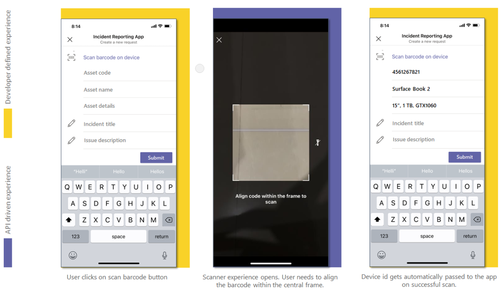

# <a name="integrate-qr-or-barcode-scanner-capability"></a>Integrar la función de escáner de código QR o de códigos de barras 

Este documento le guía sobre cómo integrar la funcionalidad del escáner de códigos QR o de código de barras. 

El código de barras es un método para representar datos en un formulario visual y legible por máquina. El código de barras contiene información sobre un producto, como un tipo, tamaño, fabricante y país de origen en forma de barras y espacios. El código se lee con el escáner óptico de la cámara del dispositivo nativo. Para una experiencia de colaboración más completa, puedes integrar la funcionalidad de escáner de códigos QR o códigos de barras que se proporciona en la plataforma Teams con la Teams aplicación.   

Puedes usar Microsoft Teams [SDK de cliente de JavaScript,](/javascript/api/overview/msteams-client?view=msteams-client-js-latest&preserve-view=true)que proporciona las herramientas necesarias para que la aplicación pueda tener acceso a las capacidades del dispositivo nativo del [usuario.](native-device-permissions.md) Usa la API [scanBarCode](/javascript/api/@microsoft/teams-js/microsoftteams.media?view=msteams-client-js-latest&preserve-view=true#scanBarCode__error__SdkError__decodedText__string_____void__BarCodeConfig_) para integrar la funcionalidad del escáner en la aplicación. 

## <a name="advantage-of-integrating-qr-or-barcode-scanner-capability"></a>Ventaja de integrar la funcionalidad de escáner de códigos DE BARRAS o QR

Estas son las ventajas de la integración de las capacidades de escáner de códigos QR o de código de barras: 

* La integración permite a los desarrolladores de aplicaciones web en Teams para aprovechar la funcionalidad de análisis de CÓDIGOS QR o códigos de barras con Teams SDK de cliente de JavaScript.
* Con esta característica, el usuario solo necesita alinear un QR o un código de barras dentro de un marco en el centro de la interfaz de usuario del escáner y el código se examina automáticamente. Los datos almacenados se comparten de nuevo con la aplicación web de llamada. Esto evita los inconvenientes y errores humanos de introducir códigos de producto largos u otra información relevante manualmente.

Para integrar la funcionalidad de escáner qr o de código de barras, debes actualizar el archivo de manifiesto de la aplicación y llamar a la API [scanBarCode.](/javascript/api/@microsoft/teams-js/microsoftteams.media?view=msteams-client-js-latest&preserve-view=true#scanBarCode__error__SdkError__decodedText__string_____void__BarCodeConfig_) Para una integración eficaz, debe [](#code-snippet) tener una buena comprensión del fragmento de código para llamar a la API [scanBarCode,](/javascript/api/@microsoft/teams-js/microsoftteams.media?view=msteams-client-js-latest&preserve-view=true#scanBarCode__error__SdkError__decodedText__string_____void__BarCodeConfig_) lo que le permite usar la funcionalidad de escáner de código de barras o QR nativo. La API proporciona un error para un estándar de código de barras no compatible.
Es importante familiarizarse con los errores de respuesta [de la API](#error-handling) para controlar los errores de la Teams aplicación.

> [!NOTE] 
> Actualmente, Microsoft Teams compatibilidad con la funcionalidad de escáner de códigos de barras o QR solo está disponible para clientes móviles.

## <a name="update-manifest"></a>Manifiesto de actualización

Actualice el Teams aplicaciónmanifest.js[el archivo](../../resources/schema/manifest-schema.md#devicepermissions) agregando la propiedad `devicePermissions` y especificando `media` . Permite que la aplicación solicite los permisos necesarios a los usuarios antes de empezar a usar la funcionalidad del escáner de códigos de barras o QR.

``` json
"devicePermissions": [
    "media",
],
```

> [!NOTE]
> El **símbolo del sistema Solicitar permisos** se muestra automáticamente cuando se inicia una API de Teams relevante. Para obtener más información, consulta [Solicitar permisos de dispositivo](native-device-permissions.md).

## <a name="scanbarcode-api"></a>ScanBarCode API

La API [scanBarCode](/javascript/api/@microsoft/teams-js/microsoftteams.media?view=msteams-client-js-latest&preserve-view=true#scanBarCode__error__SdkError__decodedText__string_____void__BarCodeConfig_) invoca el control de escáner que permite al usuario examinar diferentes tipos de código de barras y devuelve el resultado como una cadena.

Para personalizar la experiencia de análisis de código de barras, [la](/javascript/api/@microsoft/teams-js/microsoftteams.media.barcodeconfig?view=msteams-client-js-latest&preserve-view=true) configuración de código de barras opcional se pasa como entrada a la API [scanBarCode.](/javascript/api/@microsoft/teams-js/microsoftteams.media?view=msteams-client-js-latest&preserve-view=true#scanBarCode__error__SdkError__decodedText__string_____void__BarCodeConfig_) Puede especificar el intervalo de tiempo de espera del examen en segundos mediante `timeOutIntervalInSec` . Su valor predeterminado es 30 segundos y el valor máximo es 60 segundos.

La **API scanBarCode()** admite los siguientes tipos de código de barras:

| Tipo de código de barras | Compatible con Android | Compatible con iOS |
| ---------- | ---------- | ------------ |
| Barra de código | Sí | No |
| Código 39 | Sí | Sí | 
| Código 93 | Sí | Sí |
| Código 128 | Sí | Sí |
| EAN-13 | Sí | Sí |
| EAN-8 | Sí | Sí |
| ITF | No | Sí |
| Código QR | Sí | Sí |
| RSS expandido | Sí | No |
| RSS-14 | Sí | No |
| UPC-A | Sí | Sí |
| UPC-E | Sí | Sí |

**Experiencia de aplicación web para `ScanBarCode` Api para la experiencia de aplicación** web de funcionalidad de escáner de códigos de barras o QR para la funcionalidad de escáner de códigos de barras o 
 

## <a name="error-handling"></a>Control de errores

Debes asegurarte de controlar estos errores correctamente en tu Teams aplicación. En la tabla siguiente se enumeran los códigos de error y las condiciones en las que se generan los errores: 

|Código de error |  Nombre del error     | Condición|
| --------- | --------------- | -------- |
| **100** | NOT_SUPPORTED_ON_PLATFORM | La API no se admite en la plataforma actual.|
| **500** | INTERNAL_ERROR | Se produce un error interno al realizar la operación necesaria.|
| **1000** | PERMISSION_DENIED |El usuario deniega el permiso.|
| **3000** | NO_HW_SUPPORT | El hardware subyacente no admite la funcionalidad.|
| **4000** | INVALID_ARGUMENTS | Uno o más argumentos no son válidos.|
| **8000** | USER_ABORT |El usuario anula la operación.|
| **8001** | OPERATION_TIMED_OUT | No se pudo detectar el código de barras en el intervalo de tiempo especificado.|
| **9000** | OLD_PLATFORM | El código de la plataforma está obsoleto y no implementa esta API.|

## <a name="code-snippet"></a>Fragmento de código

**Llamada `ScanBarCode()` API** para examinar QR o código de barras con cámara:

```javascript
const config: microsoftTeams.media.BarCodeConfig = {
  timeOutIntervalInSec: 30};
microsoftTeams.media.scanBarCode((error: microsoftTeams.SdkError, decodedText: string) => {
  if (error) {
    if (error.message) {
      output(" ErrorCode: " + error.errorCode + error.message);
    } else {
      output(" ErrorCode: " + error.errorCode);
    }
  } else if (decodedText) {
    output(decodedText);
  }
}, config);
```

## <a name="see-also"></a>Consulte también

* [Integrar funcionalidades multimedia en Teams](mobile-camera-image-permissions.md)
* [Integrar las capacidades de ubicación en Teams](location-capability.md)
