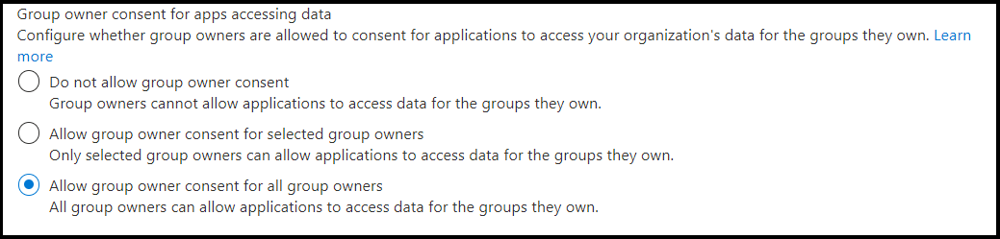

# <a name="resource-specific-consent"></a>Consentimiento específico del recurso

> [!NOTE]
> El consentimiento específico de los recursos para el ámbito de chat solo está disponible en [la versión preliminar del desarrollador](../../resources/dev-preview/developer-preview-intro.md) público.

El consentimiento específico de recursos (RSC) es una integración de api de Microsoft Teams y Microsoft Graph que permite a la aplicación usar puntos de conexión de API para administrar recursos específicos, ya sea equipos o chats, dentro de una organización. El modelo de permisos RSC permite  a los propietarios de equipos y propietarios de *chat* conceder consentimiento para que una aplicación acceda y modifique los datos de un equipo y los datos de un chat, respectivamente.

**Nota:** Si un chat tiene una reunión o una llamada asociada a ella, los permisos de RSC relevantes también se aplican a esos recursos.

## <a name="resource-specific-permissions"></a>Permisos específicos de recursos

Los permisos de RSC granulares Teams específicos definen lo que una aplicación puede hacer dentro de un recurso específico.

### <a name="resource-specific-permissions-for-a-team"></a>Permisos específicos de recursos para un equipo

|Permiso de aplicación| Acción |
| ----- | ----- |
|TeamSettings.Read.Group | Obtén la configuración de este equipo.|
|TeamSettings.ReadWrite.Group|Actualice la configuración de este equipo.|
|ChannelSettings.Read.Group|Obtén los nombres de canal de este equipo, las descripciones de canales y la configuración del canal.|
|ChannelSettings.ReadWrite.Group|Actualice los nombres de canal de este equipo, las descripciones de canales y la configuración del canal.|
|Channel.Create.Group|Crear canales en este equipo. |
|Channel.Delete.Group|Eliminar canales en este equipo. |
|ChannelMessage.Read.Group |Obtener los mensajes de canal de este equipo. |
|TeamsAppInstallation.Read.Group|Obtén una lista de las aplicaciones instaladas de este equipo.|
|TeamsTab.Read.Group|Obtener una lista de las pestañas de este equipo.|
|TeamsTab.Create.Group|Crear pestañas en este equipo. |
|TeamsTab.ReadWrite.Group|Actualizar las pestañas de este equipo. |
|TeamsTab.Delete.Group|Eliminar las pestañas de este equipo. |
|TeamMember.Read.Group|Obtener los miembros de este equipo. |
|TeamsActivity.Send.Group|Crea nuevas notificaciones en las fuentes de actividad de los usuarios de este equipo. |

Para obtener más información, consulte [Permisos de consentimiento específicos de recursos de equipo](/graph/permissions-reference#teams-resource-specific-consent-permissions).

### <a name="resource-specific-permissions-for-a-chat"></a>Permisos específicos de recursos para un chat

En la tabla siguiente se proporcionan permisos específicos de recursos para un chat:

|Permiso de aplicación| Acción |
| ----- | ----- |
| ChatSettings.Read.Chat         | Obtén la configuración de este chat.                                    |
| ChatSettings.ReadWrite.Chat    | Actualice la configuración de este chat.                          |
| ChatMessage.Read.Chat          | Obtener los mensajes de este chat.                                    |
| ChatMember.Read.Chat           | Obtener los miembros de este chat.                                     |
| Chat.Manage.Chat               | Administrar este chat.                                             |
| TeamsTab.Read.Chat             | Obtén las pestañas de este chat.                                        |
| TeamsTab.Create.Chat           | Crear pestañas en este chat.                                     |
| TeamsTab.Delete.Chat           | Eliminar las pestañas de este chat.                                      |
| TeamsTab.ReadWrite.Chat        | Administrar las pestañas de este chat.                                      |
| TeamsAppInstallation.Read.Chat | Obtén las aplicaciones instaladas en este chat.                   |
| OnlineMeeting.ReadBasic.Chat   | Lea las propiedades básicas, como el nombre, la programación, el organizador, el vínculo de unión y las notificaciones de inicio y finalización de una reunión asociada a este chat. |
| Calls.AccessMedia.Chat         | Accede a secuencias multimedia en llamadas asociadas a este chat o reunión.                                    |
| Calls.JoinGroupCalls.Chat         | Unirse a llamadas asociadas a este chat o reunión.                                    |
| TeamsActivity.Send.Chat         | Crea nuevas notificaciones en las fuentes de actividad de los usuarios en este chat. |

Para obtener más información, consulte [Permisos de consentimiento específicos de recursos de chat](/graph/permissions-reference#chat-resource-specific-consent-permissions).

> [!NOTE]
> Los permisos específicos de recursos solo están disponibles para las aplicaciones Teams instaladas en el cliente de Teams y actualmente no forman parte del portal Azure Active Directory (AAD).

## <a name="enable-rsc-in-your-application"></a>Habilitar RSC en la aplicación

1. [Configure las opciones de consentimiento en Azure AD portal](#configure-consent-settings-in-the-azure-ad-portal).
    1. [Configure las opciones de consentimiento del propietario del grupo para RSC en un equipo](#configure-group-owner-consent-settings-for-rsc-in-a-team).
    1. [Configurar las opciones de consentimiento del usuario para RSC en un chat](#configure-user-consent-settings-for-rsc-in-a-chat).
1. [Registra la aplicación con Plataforma de identidad de Microsoft el portal Azure AD usuario](#register-your-app-with-microsoft-identity-platform-using-the-azure-ad-portal).
1. [Revise los permisos de la aplicación en el portal Azure AD aplicación](#review-your-application-permissions-in-the-azure-ad-portal).
1. [Obtener un token de acceso de la plataforma de identidad](#obtain-an-access-token-from-the-microsoft-identity-platform).
1. [Actualiza el manifiesto Teams aplicación](#update-your-teams-app-manifest).
1. [Instala la aplicación directamente en Teams](#sideload-your-app-in-teams).
1. [Comprueba que la aplicación tenga permisos RSC agregados](#check-your-app-for-added-rsc-permissions).
    1. [Comprueba que la aplicación tenga permisos de RSC agregados en un equipo](#check-your-app-for-added-rsc-permissions-in-a-team).
    1. [Comprueba que la aplicación tenga permisos RSC agregados en un chat](#check-your-app-for-added-rsc-permissions-in-a-chat).

## <a name="configure-consent-settings-in-the-azure-ad-portal"></a>Configurar las opciones de consentimiento en el portal Azure AD usuario

### <a name="configure-group-owner-consent-settings-for-rsc-in-a-team"></a>Configurar la configuración de consentimiento del propietario del grupo para RSC en un equipo

Puede habilitar o deshabilitar el consentimiento del [propietario del grupo](/azure/active-directory/manage-apps/configure-user-consent-groups?tabs=azure-portal) directamente en el portal de Microsoft Azure grupo:

1. Inicie sesión en [Azure Portal](https://portal.azure.com) como administrador [global o administrador de la compañía](/azure/active-directory/roles/permissions-reference#global-administrator&preserve-view=true).
1. Seleccione **Azure Active Directory** >  **Enterprise applicationsConsent** >  **y permissionsUsuario** >  [**de configuración de consentimiento**](https://portal.azure.com/#blade/Microsoft_AAD_IAM/ConsentPoliciesMenuBlade/UserSettings).
1. Habilitar, deshabilitar o limitar el consentimiento del usuario con el control etiquetado Consentimiento del propietario **del grupo para que las aplicaciones accedan a los datos**. El valor predeterminado es **Permitir el consentimiento del propietario del grupo para todos los propietarios del grupo**. Para que el propietario de un equipo instale una aplicación con RSC, el consentimiento del propietario del grupo debe estar habilitado para ese usuario.

    

Además, puede habilitar o deshabilitar el consentimiento del propietario del grupo con PowerShell, siga los pasos descritos en configurar el consentimiento del propietario del grupo [con PowerShell](/azure/active-directory/manage-apps/configure-user-consent-groups?tabs=azure-powershell).

### <a name="configure-user-consent-settings-for-rsc-in-a-chat"></a>Configurar las opciones de consentimiento del usuario para RSC en un chat

Puede habilitar o deshabilitar el [consentimiento del usuario](/azure/active-directory/manage-apps/configure-user-consent?tabs=azure-portal) directamente en Azure Portal:

1. Inicie sesión en [Azure Portal](https://portal.azure.com) como administrador [global o administrador de la compañía](/azure/active-directory/roles/permissions-reference#global-administrator&preserve-view=true).
1. Seleccione **Azure Active Directory** >  **Enterprise applicationsConsent** >  **y permissionsUsuario** >  [**de configuración de consentimiento**](https://portal.azure.com/#blade/Microsoft_AAD_IAM/ConsentPoliciesMenuBlade/UserSettings).
1. Habilitar, deshabilitar o limitar el consentimiento del usuario con el control etiquetado **Consentimiento de usuario para aplicaciones**. El valor predeterminado es **Permitir el consentimiento del usuario para las aplicaciones**. Para que un miembro de chat instale una aplicación con RSC, el consentimiento del usuario debe estar habilitado para ese usuario.

    

Además, puede habilitar o deshabilitar el consentimiento de usuario con PowerShell, siga los pasos descritos en configurar el consentimiento de usuario [con PowerShell](/azure/active-directory/manage-apps/configure-user-consent?tabs=azure-powershell).

## <a name="register-your-app-with-microsoft-identity-platform-using-the-azure-ad-portal"></a>Registrar la aplicación con Plataforma de identidad de Microsoft el portal de Azure AD aplicación

El portal Azure AD proporciona una plataforma central para que se registren y configuren las aplicaciones. La aplicación debe estar registrada en el portal de Azure AD para integrarse con la plataforma de identidad y llamar a las API Graph Microsoft. Para obtener más información, vea [registrar una aplicación con la plataforma de identidad](/graph/auth-register-app-v2).

> [!WARNING]
> Un Azure AD de aplicación no debe compartirse entre varias Teams aplicaciones. Debe haber una asignación 1:1 entre una aplicación Teams y una Azure AD aplicación. Los intentos de instalar varias Teams que están asociadas con el mismo Azure AD de aplicación provocarán errores de instalación o tiempo de ejecución.

## <a name="review-your-application-permissions-in-the-azure-ad-portal"></a>Revisar los permisos de la aplicación en el portal Azure AD aplicación

1. Ve a la **página Registros** **de HomeApp** >  y selecciona la aplicación RSC.
1. Elija **permisos de API** en el panel izquierdo y vaya a la lista de **permisos configurados** para la aplicación. Si la aplicación solo realiza llamadas Graph API de RSC, elimina todos los permisos de esa página. Si la aplicación también realiza llamadas que no son RSC, mantén esos permisos según sea necesario.

> [!IMPORTANT]
> El Azure AD no se puede usar para solicitar permisos de RSC. Actualmente, los permisos RSC son exclusivos de Teams aplicaciones instaladas en el cliente de Teams y se declaran en el archivo de manifiesto Teams aplicación (JSON).

## <a name="obtain-an-access-token-from-the-microsoft-identity-platform"></a>Obtener un token de acceso de la Plataforma de identidad de Microsoft

Para realizar Graph API, debes obtener un token de acceso para la aplicación desde la plataforma de identidad. Para que la aplicación pueda obtener un token de la plataforma de identidad, debe registrarse en el portal Azure AD identidad. El token de acceso contiene información sobre la aplicación y los permisos que tiene para los recursos y las API disponibles a través de Microsoft Graph.

Debe tener los siguientes valores del proceso de registro Azure AD para recuperar un token de acceso de la plataforma de identidad:

* Id **. de aplicación** asignado por el portal de registro de aplicaciones. Si la aplicación admite el inicio de sesión único (SSO), debes usar el mismo identificador de aplicación para tu aplicación y SSO.
* El **secreto de cliente/contraseña** o un par de claves pública o privada que es **Certificate**. Esto no es necesario para las aplicaciones nativas.
* Uri **de redireccionamiento** o dirección URL de respuesta para que la aplicación reciba respuestas de Azure AD.

Para obtener más información, vea [obtener acceso en nombre de un usuario y](/graph/auth-v2-user?view=graph-rest-1.0#3-get-a-token&preserve-view=true) [obtener acceso sin un usuario](/graph/auth-v2-service).

## <a name="update-your-teams-app-manifest"></a>Actualizar el manifiesto Teams aplicación

Los permisos RSC se declaran en el archivo JSON del manifiesto de la aplicación.

> [!IMPORTANT]
> Los permisos que no son RSC se almacenan en Azure Portal. No los agregues al manifiesto de la aplicación.

### <a name="manifest-changes-for-resource-specific-consent"></a>Cambios de manifiesto para el consentimiento específico de recursos

<br>

<details>

<summary><b>Permisos de RSC para el manifiesto de la aplicación versión 1.12</b></summary>

Agregue una [clave webApplicationInfo](../../resources/schema/manifest-schema.md#webapplicationinfo) al manifiesto de la aplicación con los siguientes valores:

|Nombre| Tipo | Descripción|
|---|---|---|
|`id` |Cadena |Tu Azure AD de aplicación. Para obtener más información, [consulta Registrar la aplicación en el portal Azure AD web](resource-specific-consent.md#register-your-app-with-microsoft-identity-platform-using-the-azure-ad-portal).|
|`resource`|Cadena| Este campo no tiene ninguna operación en RSC, pero debe agregarse y tener un valor para evitar una respuesta de error; cualquier cadena lo hará.|

Especifica los permisos necesarios para la aplicación.

|Nombre| Tipo | Descripción|
|---|---|---|
|`authorization`|Object|Lista de permisos que la aplicación necesita para funcionar. Para obtener más información, vea [marcador de posición para la autorización de vínculos en el manifiesto]

Ejemplo de RSC en un equipo

```json
"webApplicationInfo": {
    "id": "XXxxXXXXX-XxXX-xXXX-XXxx-XXXXXXXxxxXX",
    "resource": "https://RscBasedStoreApp"
    },
"authorization": {
    "permissions": {
        "resourceSpecific": [
            {
                "name": "TeamSettings.Read.Group",
                "type": "Application"
            },
            {
                "name": "TeamSettings.ReadWrite.Group",
                "type": "Application"
            },
            {
                "name": "ChannelSettings.Read.Group",
                "type": "Application"
            },
            {
                "name": "ChannelSettings.ReadWrite.Group",
                "type": "Application"
            },
            {
                "name": "Channel.Create.Group",
                "type": "Application"
            },
            {
                "name": "Channel.Delete.Group",
                "type": "Application"
            },
            {
                "name": "ChannelMessage.Read.Group",
                "type": "Application"
            },
            {
                "name": "TeamsAppInstallation.Read.Group",
                "type": "Application"
            },
            {
                "name": "TeamsTab.Read.Group",
                "type": "Application"
            },
            {
                "name": "TeamsTab.Create.Group",
                "type": "Application"
            },
            {
                "name": "TeamsTab.ReadWrite.Group",
                "type": "Application"
            },
            {
                "name": "TeamsTab.Delete.Group",
                "type": "Application"
            },
            {
                "name": "TeamMember.Read.Group",
                "type": "Application"
            },
            {
                "name": "TeamsActivity.Send.Group",
                "type": "Application"
            }
        ]    
    }
}
```

Ejemplo de RSC en un chat

```json
"webApplicationInfo": {
    "id": "XXxxXXXXX-XxXX-xXXX-XXxx-XXXXXXXxxxXX",
    "resource": "https://RscBasedStoreApp"
    },
"authorization": {
    "permissions": {
        "resourceSpecific": [
            {
                "name": "ChatSettings.Read.Chat",
                "type": "Application"
            },
            {
                "name": "ChatSettings.ReadWrite.Chat",
                "type": "Application"
            },
            {
                "name": "ChatMessage.Read.Chat",
                "type": "Application"
            },
            {
                "name": "ChatMember.Read.Chat",
                "type": "Application"
            },
            {
                "name": "Chat.Manage.Chat",
                "type": "Application"
            },
            {
                "name": "TeamsTab.Read.Chat",
                "type": "Application"
            },
            {
                "name": "TeamsTab.Create.Chat",
                "type": "Application"
            },
            {
                "name": "TeamsTab.Delete.Chat",
                "type": "Application"
            },
            {
                "name": "TeamsTab.ReadWrite.Chat",
                "type": "Application"
            },
            {
                "name": "TeamsAppInstallation.Read.Chat",
                "type": "Application"
            },
            {
                "name": "OnlineMeeting.ReadBasic.Chat",
                "type": "Application"
            },
            {
                "name": "Calls.AccessMedia.Chat",
                "type": "Application"
            },
            {
                "name": "Calls.JoinGroupCalls.Chat",
                "type": "Application"
            },
            {
                "name": "TeamsActivity.Send.Chat",
                "type": "Application"
            }
        ]    
    }
}
```

> [!NOTE]
> Si la aplicación está pensada para admitir la instalación en ámbitos de equipo y chat, los permisos de equipo y chat se pueden especificar en el mismo manifiesto en `authorization`.

<br>

</details>

<br>

<details>

<summary><b>Permisos de RSC para manifiesto de aplicación versión 1.11 o anterior</b></summary>

Agregue una [clave webApplicationInfo](../../resources/schema/manifest-schema.md#webapplicationinfo) al manifiesto de la aplicación con los siguientes valores:

|Nombre| Tipo | Descripción|
|---|---|---|
|`id` |Cadena |Tu Azure AD de aplicación. Para obtener más información, [consulta Registrar la aplicación en el portal Azure AD web](resource-specific-consent.md#register-your-app-with-microsoft-identity-platform-using-the-azure-ad-portal).|
|`resource`|Cadena| Este campo no tiene ninguna operación en RSC, pero debe agregarse y tener un valor para evitar una respuesta de error; cualquier cadena lo hará.|
|`applicationPermissions`|Matriz de cadenas|Permisos RSC para la aplicación. Para obtener más información, vea [permisos específicos de recursos](resource-specific-consent.md#resource-specific-permissions).|

Ejemplo de RSC en un equipo

```json
"webApplicationInfo": {
    "id": "XXxxXXXXX-XxXX-xXXX-XXxx-XXXXXXXxxxXX",
    "resource": "https://RscBasedStoreApp",
    "applicationPermissions": [
        "TeamSettings.Read.Group",
        "TeamSettings.ReadWrite.Group",
        "ChannelSettings.Read.Group",
        "ChannelSettings.ReadWrite.Group",
        "Channel.Create.Group",
        "Channel.Delete.Group",
        "ChannelMessage.Read.Group",
        "TeamsAppInstallation.Read.Group",
        "TeamsTab.Read.Group",
        "TeamsTab.Create.Group",
        "TeamsTab.ReadWrite.Group",
        "TeamsTab.Delete.Group",
        "TeamMember.Read.Group",
        "TeamsActivity.Send.Group"
    ]
  }
```

Ejemplo de RSC en un chat

```json
"webApplicationInfo": {
    "id": "XXxxXXXXX-XxXX-xXXX-XXxx-XXXXXXXxxxXX",
    "resource": "https://RscBasedStoreApp",
    "applicationPermissions": [
        "ChatSettings.Read.Chat",
        "ChatSettings.ReadWrite.Chat",
        "ChatMessage.Read.Chat",
        "ChatMember.Read.Chat",
        "Chat.Manage.Chat",
        "TeamsTab.Read.Chat",
        "TeamsTab.Create.Chat",
        "TeamsTab.Delete.Chat",
        "TeamsTab.ReadWrite.Chat",
        "TeamsAppInstallation.Read.Chat",
        "OnlineMeeting.ReadBasic.Chat",
        "Calls.AccessMedia.Chat",
        "Calls.JoinGroupCalls.Chat",
        "TeamsActivity.Send.Chat"
    ]
  }
```

> [!NOTE]
> Si la aplicación está pensada para admitir la instalación en ámbitos de equipo y chat, los permisos de equipo y chat se pueden especificar en el mismo manifiesto en `applicationPermissions`.

<br>

</details>

## <a name="sideload-your-app-in-teams"></a>Transferir localmente la aplicación en Teams

Si el Teams permite cargas de aplicaciones personalizadas, puedes realizar la instalación local de la [aplicación directamente en](~/concepts/deploy-and-publish/apps-upload.md) un equipo o chat específico.

## <a name="check-your-app-for-added-rsc-permissions"></a>Comprueba la aplicación para obtener permisos RSC agregados

> [!IMPORTANT]
> Los permisos RSC no se atribuyó a un usuario. Las llamadas se realizan con permisos de aplicación, no con permisos delegados por el usuario. Se puede permitir que la aplicación realice acciones que el usuario no puede, como eliminar una pestaña. Debe revisar la intención del propietario del equipo o del propietario del chat para su uso antes de realizar llamadas a la API de RSC. Para obtener más información, vea [Microsoft Teams introducción a la API.](/graph/teams-concept-overview)

Después de instalar la aplicación en un recurso, puedes usar [Graph Explorer](https://developer.microsoft.com/graph/graph-explorer) para ver los permisos que se han concedido a la aplicación en el recurso.

### <a name="check-your-app-for-added-rsc-permissions-in-a-team"></a>Comprobar la aplicación para obtener permisos de RSC agregados en un equipo

1. Obtenga el **groupId** del equipo desde Teams.
1. En Teams, seleccione **Teams** en el panel situado más a la izquierda.
1. Selecciona el equipo donde se va a instalar la aplicación.
1. Seleccione los puntos suspensivos &#x25CF;&#x25CF;&#x25CF; para ese equipo.
1. Selecciona **Obtener vínculo al equipo** en el menú desplegable del equipo.
1. Copie y guarde el **valor groupId** del **cuadro** de diálogo emergente Obtener un vínculo al equipo.
1. Inicie sesión en **Graph Explorer**.
1. Realice una **llamada GET** a este extremo: `https://graph.microsoft.com/beta/teams/{teamGroupId}/permissionGrants`. El `clientAppId` campo de la respuesta se asignará al `webApplicationInfo.id` especificado en el manifiesto de Teams aplicación.

    

Para obtener más información sobre cómo obtener detalles de las aplicaciones instaladas en un equipo específico, consulta obtener los nombres y otros detalles de las aplicaciones instaladas en [el equipo especificado](/graph/api/team-list-installedapps#example-2-get-the-names-and-other-details-of-installed-apps).

### <a name="check-your-app-for-added-rsc-permissions-in-a-chat"></a>Comprueba que la aplicación tenga permisos RSC agregados en un chat

1. Obtenga el identificador de subproceso de chat del Teams *web*.
1. En el Teams web, seleccione **Chat** en el panel situado más a la izquierda.
1. Selecciona el chat donde está instalada la aplicación en el menú desplegable.
1. Copie la dirección URL web y guarde el identificador del subproceso de chat de la cadena.

    

1. Inicie sesión en **Graph Explorer**.
1. Realice una **llamada GET** al siguiente extremo: `https://graph.microsoft.com/beta/chats/{chatId}/permissionGrants`. El `clientAppId` campo de la respuesta se asignará al `webApplicationInfo.id` especificado en el manifiesto de Teams aplicación.

    

Para obtener más información sobre cómo obtener detalles de las aplicaciones instaladas en un chat específico, consulta obtener los nombres y otros detalles de las aplicaciones instaladas [en el chat especificado](/graph/api/chat-list-installedapps#example-2-get-the-names-and-other-details-of-apps-installed-in-the-specified-chat).

## <a name="code-sample"></a>Ejemplo de código

| **Ejemplo de nombre** | **Descripción** | **.NET** |**Node.js** |
|-----------------|-----------------|----------------|----------------|
| Resource-Specific consentimiento (RSC) | Use RSC para llamar a Graph API. | [View](https://github.com/OfficeDev/Microsoft-Teams-Samples/tree/main/samples/graph-rsc/csharp)|[Ver](https://github.com/OfficeDev/Microsoft-Teams-Samples/tree/main/samples/graph-rsc/nodeJs)|

## <a name="see-also"></a>Consulte también

* [Probar permisos de consentimiento específicos de recursos en Teams](test-resource-specific-consent.md)
* [Consentimiento específico de recursos en Microsoft Teams para administradores](/MicrosoftTeams/resource-specific-consent)
