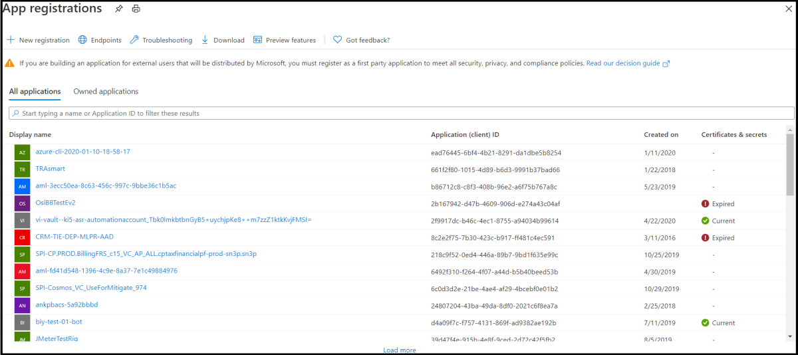

1. En [Azure Portal](https://ms.portal.azure.com/#home), en Servicios de Azure, seleccione **Crear un recurso**.In the [Azure portal](https://ms.portal.azure.com/#home), under Azure services, select **Create a resource**.
1. En el cuadro de búsqueda, escriba "bot".In the search box enter "bot". Y en la lista desplegable, seleccione **Registro de canales de bot.**And in the drop-down list, select **Bot Channels Registration**.
1. Seleccione el **botón** Crear.Select the **Create** button.
1. En la **hoja Registro del canal bot,** proporcione la información solicitada sobre el bot.In the **Bot Channel Registration** blade, provide the requested information about your bot.
1. Deje el **cuadro Punto de conexión** de mensajería vacío por ahora, escribirá la dirección URL necesaria después de implementar el bot.Leave the **Messaging endpoint** box empty for now, you will enter the required URL after deploying the bot. En la siguiente imagen se muestra un ejemplo de la configuración de registro:The following picture shows an example of the registration settings:

    

1. Haga clic **en Id. de aplicación y contraseña** de Microsoft **y, a continuación, cree nuevo**.Click **Microsoft App ID and password** and then **Create New**.

          

1. Haz **clic en Crear id. de aplicación en el vínculo Portal de registro de** aplicaciones.Click **Create App ID in the App Registration Portal** link.

   
   
1. En la ventana **de registro de aplicaciones mostrada,** haga clic en la pestaña Nuevo **registro** de la parte superior izquierda.In the displayed **App registration** window, click the **New registration** tab in the upper left.
1. Escriba el nombre de la aplicación bot que está registrando, hemos usado *BotTeamsAuth* (necesita seleccionar su propio nombre único).Enter the name of the bot application you are registering, we used *BotTeamsAuth* (you need to select your own unique name).
1. Para los tipos de cuentas **compatibles,** seleccione Cuentas en cualquier directorio de la organización (cualquier directorio de Azure AD - Multitenant) y cuentas personales de *Microsoft (por ejemplo, Skype, Xbox).*For the **Supported account types** select *Accounts in any organizational directory (Any Azure AD directory - Multitenant) and personal Microsoft accounts (e.g. Skype, Xbox)*.
1. Haga clic en **el botón** Registrar.Click the **Register** button. Una vez completada, Azure muestra la *página Información* general de la aplicación.Once completed, Azure displays the *Overview* page for the application.
1. Copie y guarde en un archivo el valor del identificador de aplicación **(cliente).**Copy and save to a file the **Application (client) ID** value.
1. En el panel izquierdo, haga clic **en Certificado y secretos**.In the left panel, click **Certificate and secrets**.
    1. En *Secretos de cliente,* haga clic **en Nuevo secreto de cliente**.Under *Client secrets*, click **New client secret**.
    1. Agrega una descripción para identificar este secreto de otros usuarios que podrías necesitar crear para esta aplicación.Add a description to identify this secret from others you might need to create for this app.
    1. Establece *Expira en* la selección.Set *Expires* to your selection.
    1. Haga clic en **Agregar**.Click **Add**.
    1. Copie el secreto de cliente y guárdelo en un archivo.Copy the client secret and save it to a file.
1. Vuelva a la ventana **Registro** del canal bot  y copie el *identificador* de aplicación y el secreto de cliente en los cuadros **Id.** de aplicación de Microsoft y **Contraseña,** respectivamente.Go back to the **Bot Channel Registration** window and copy the *App ID* and the *Client secret* in the **Microsoft App ID** and **Password** boxes, respectively.
1. Haga clic en **Aceptar**.Click **OK**.
1. Por último, haga clic **en Crear**.Finally, click **Create**.

Después de que Azure haya creado el recurso de registro, se incluirá en la lista de grupos de recursos.After Azure has created the registration resource it will be included in the resource group list.  

Una vez creado el registro de los canales del bot, deberá habilitar el canal de Teams.Once your bot channels registration is created, you'll need to enable the Teams channel.

1. En [Azure Portal](https://ms.portal.azure.com/#home), en Servicios de Azure, seleccione el registro del **canal bot** que acaba de crear.In the [Azure portal](https://ms.portal.azure.com/#home), under Azure services, select the **Bot Channel Registration** you just created.
1. En el panel izquierdo, haga clic en **Canales**.In the left panel, click **Channels**.
1. Haga clic en el icono de Microsoft Teams y, a continuación, **elija Guardar**.Click the Microsoft Teams icon, then choose **Save**.
