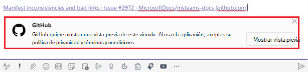

# Extensiones de mensajeríaMessaging extensions

Las extensiones de mensajería permiten a los usuarios interactuar con el servicio web a través de botones y formularios en el cliente de Microsoft Teams.Messaging extensions allow the users to interact with your web service through buttons and forms in the Microsoft Teams client. Pueden buscar o iniciar acciones en un sistema externo desde el área del mensaje de redacción, el cuadro de comandos o directamente desde un mensaje.They can search or initiate actions in an external system from the compose message area, the command box, or directly from a message. Puedes devolver los resultados de esa interacción al cliente de Microsoft Teams en forma de tarjeta con un formato enriquecido.You can send back the results of that interaction to the Microsoft Teams client in the form of a richly formatted card. En este documento se proporciona información general sobre la extensión de mensajería, las tareas realizadas en diferentes escenarios, el trabajo de la extensión de mensajería, la acción y los comandos de búsqueda y la desamuesación de vínculos.This document gives an overview of the messaging extension, tasks performed under different scenarios, working of messaging extension, action and search commands, and link unfurling.

La siguiente imagen muestra las ubicaciones desde las que se invocan las extensiones de mensajería:The following image displays the locations from where messaging extensions are invoked:

## Escenarios en los que se usan extensiones de mensajeríaScenarios where messaging extensions are used

| EscenarioScenario | EjemploExample |
|:-----------------|:-----------------|
|Desea que algún sistema externo realice una acción y que el resultado de la acción se envíe de vuelta a la conversación.You want some external system to do an action  and the result of the action to be sent back to your conversation.|Reserve un recurso y permita que el canal conozca la franja horaria reservada.Reserve a resource and allow the channel to know the reserved time slot.|
|Desea encontrar algo en un sistema externo y compartir los resultados con la conversación.You want to find something in an external system, and share the results with the conversation.|Busque un elemento de trabajo en Azure DevOps y compártelo con el grupo como una tarjeta adaptable.Search for a work item in Azure DevOps, and share it with the group as an Adaptive Card.|
|Desea completar una tarea compleja que incluya varios pasos o mucha información en un sistema externo y compartir los resultados con una conversación.You want to complete a complex task involving multiple steps or lots of information in an external system, and share the results with a conversation.|Crea un error en el sistema de seguimiento basado en un mensaje de Teams, asigna ese error a Bob y envía una tarjeta al hilo de conversación con los detalles del error.Create a bug in your tracking system based on a Teams message, assign that bug to Bob, and send a card to the conversation thread with the bug's details.|

## Comprender cómo funcionan las extensiones de mensajeríaUnderstand how messaging extensions work

Una extensión de mensajería consta de un servicio web que hospeda y un manifiesto de aplicación, que define desde dónde se invoca el servicio web en el cliente de Microsoft Teams.A messaging extension consists of a web service that you host and an app manifest, which defines where your web service is invoked from in the Microsoft Teams client. El servicio web aprovecha el esquema de mensajería de Bot Framework y el protocolo de comunicación seguro, por lo que debe registrar el servicio web como bot en Bot Framework.The web service takes advantage of the Bot Framework's messaging schema and secure communication protocol, so you must register your web service as a bot in the Bot Framework. 

> [!NOTE]
> Aunque puede crear el servicio web manualmente, use [bot Framework SDK](https://github.com/microsoft/botframework) para trabajar con el protocolo.Though you can create the web service manually, use [Bot Framework SDK](https://github.com/microsoft/botframework) to work with the protocol.

En el manifiesto de la aplicación para la aplicación de Microsoft Teams, se define una sola extensión de mensajería con hasta diez comandos diferentes.In the app manifest for Microsoft Teams app, a single messaging extension is defined with up to ten different commands. Cada comando define un tipo, como acción o búsqueda, y las ubicaciones del cliente desde donde se invoca.Each command defines a type, such as action or search and the locations in the client from where it is invoked. Las ubicaciones de invocación son área de mensaje de redacción, barra de comandos y mensaje.The invoke locations are compose message area, command bar, and message. Al invocar, el servicio web recibe un mensaje HTTPS con una carga JSON que incluye toda la información relevante.On invoke, the web service receives an HTTPS message with a JSON payload including all the relevant information. Responda con una carga JSON, lo que permite al cliente de Teams conocer la siguiente interacción que se habilitará.Respond with a JSON payload, allowing the Teams client to know the next interaction to enable. 

## Tipos de comandos de extensión de mensajeríaTypes of messaging extension commands

Hay dos tipos de comandos de extensión de mensajería, comando de acción y comando de búsqueda.There are two types of messaging extension commands, action command and search command. El tipo de comando de extensión de mensajería define los elementos de la interfaz de usuario y los flujos de interacción disponibles para el servicio web.The messaging extension command type defines the UI elements and interaction flows available to your web service. Algunas interacciones, como la autenticación y la configuración, están disponibles para ambos tipos de comandos.Some interactions, such as authentication and configuration are available for both types of commands.

### Comandos de acciónAction commands

Los comandos action se usan para presentar a los usuarios un elemento emergente modal para recopilar o mostrar información.Action commands are used to present the users with a modal popup to collect or display information. Cuando el usuario envía el formulario, el servicio web responde insertando un mensaje en la conversación directamente o insertando un mensaje en el área del mensaje de redacción.When the user submits the form, your web service responds by inserting a message into the conversation directly or by inserting a message into the compose message area. Después, el usuario puede enviar el mensaje.After that the user can submit the message. Puede encadenar varios formularios para flujos de trabajo más complejos.You can chain multiple forms together for more complex workflows.

Los comandos de acción se desencadenan desde el área del mensaje de redacción, el cuadro de comandos o desde un mensaje.The action commands are triggered from the compose message area, the command box, or from a message. Cuando se invoca el comando desde un mensaje, la carga JSON inicial enviada al bot incluye todo el mensaje desde el que se invocó.When the command is invoked from a message, the initial JSON payload sent to your bot includes the entire message it was invoked from. En la siguiente imagen se muestra el módulo de tareas de comando de acción de extensión de mensajería: módulo de tareas de comando de acción de extensión The following image displays the messaging extension action command task module: 

### Comandos de búsquedaSearch commands

Los comandos de búsqueda permiten a los usuarios buscar información en un sistema externo manualmente a través de un cuadro de búsqueda o pegando un vínculo a un dominio supervisado en el área del mensaje de redacción e insertar los resultados de la búsqueda en un mensaje.Search commands allow the users to search an external system for information either manually through a search box, or by pasting a link to a monitored domain into the compose message area, and insert the results of the search into a message. En el flujo de comandos de búsqueda más básico, el mensaje de invocación inicial incluye la cadena de búsqueda que el usuario envió.In the most basic search command flow, the initial invoke message includes the search string that the user submitted. Responderá con una lista de tarjetas y vistas previas de tarjetas.You respond with a list of cards and card previews. El cliente de Teams representa una lista de vistas previas de tarjeta para el usuario.The Teams client renders a list of card previews for the user. Cuando el usuario selecciona una tarjeta de la lista, la tarjeta de tamaño completo se inserta en el área del mensaje de redacción.When the user selects a card from the list, the full-size card is inserted into the compose message area.

Las tarjetas se desencadenan desde el área del mensaje de redacción o el cuadro de comando y no se desencadenan desde un mensaje.The cards are triggered from the compose message area or the command box and not triggered from a message. No se pueden desencadenar desde un mensaje.They can not be triggered from a message.
En la siguiente imagen se muestra el módulo de tareas de comando de búsqueda de extensión de mensajería:The following image displays the messaging extension search command task module:

> [!NOTE]
> Para obtener más información sobre las tarjetas, vea [what are cards](../task-modules-and-cards/what-are-cards.md).For more information on cards, see [what are cards](../task-modules-and-cards/what-are-cards.md).

## Apertura de vínculosLink unfurling

Se invoca un servicio web cuando se pega una dirección URL en el área del mensaje de redacción.A web service is invoked when a URL is pasted in the compose message area. Esta funcionalidad se conoce como desenlaznado de vínculos.This functionality is known as link unfurling. Puede suscribirse para recibir una invocación cuando las direcciones URL que contienen un dominio determinado se pegan en el área del mensaje de redacción.You can subscribe to receive an invoke when URLs containing a particular domain are pasted into the compose message area. El servicio web puede "desplegar" la dirección URL en una tarjeta detallada, lo que proporciona más información que la tarjeta de vista previa del sitio web estándar.Your web service can "unfurl" the URL into a detailed card, providing more information than the standard website preview card. Puedes agregar botones para permitir que los usuarios tomen medidas inmediatamente sin salir del cliente de Microsoft Teams.You can add buttons to allow the users to immediately take action without leaving the Microsoft Teams client.
Las siguientes imágenes muestran la característica de desamuestración de vínculos cuando se pega un vínculo en la extensión de mensajería:The following images display link unfurling feature when a link is pasted in messaging extension:
 

## Ejemplo de códigoCode sample

| **Nombre de ejemplo****Sample name** | **Description****Description** | **.NET****.NET** | **Node.js****Node.js** | **Python****Python** |
|------------|-------------|----------------|------------|
| Extensión de mensajería con comandos basados en accionesMessaging extension with action-based commands | En este ejemplo se muestra cómo crear una extensión de mensajería basada en acciones.This sample illustrates how to build an action-based messaging extension. | [ViewView](https://github.com/microsoft/BotBuilder-Samples/tree/master/samples/csharp_dotnetcore/51.teams-messaging-extensions-action) | [ViewView](https://github.com/microsoft/BotBuilder-Samples/tree/master/samples/javascript_nodejs/51.teams-messaging-extensions-action) | [ViewView](https://github.com/microsoft/BotBuilder-Samples/tree/main/samples/python/51.teams-messaging-extensions-action) |
| Extensión de mensajería con comandos basados en búsquedaMessaging extension with search-based commands | En este ejemplo se muestra cómo crear una extensión de mensajería basada en búsquedas.This sample illustrates how to build a Search-based Messaging Extension. | [ViewView](https://github.com/microsoft/BotBuilder-Samples/tree/master/samples/csharp_dotnetcore/50.teams-messaging-extensions-search) | [ViewView](https://github.com/microsoft/BotBuilder-Samples/tree/master/samples/javascript_nodejs/50.teams-messaging-extensions-search) | [ViewView](https://github.com/microsoft/BotBuilder-Samples/tree/main/samples/python/50.teams-messaging-extension-search) |

## Consulte tambiénSee also

> [!div class="nextstepaction"]
> [Crear una extensión de mensajeríaCreate a messaging extension](../build-your-first-app/build-messaging-extension.md)

## Paso siguienteNext step

> [!div class="nextstepaction"]
> [Definir comando de extensión de mensajería de acciónDefine action messaging extension command](~/messaging-extensions/how-to/action-commands/define-action-command.md)

> [!div class="nextstepaction"]
> [Definir comando de extensión de mensajería de búsquedaDefine search messaging extension command](~/messaging-extensions/how-to/search-commands/define-search-command.md)
