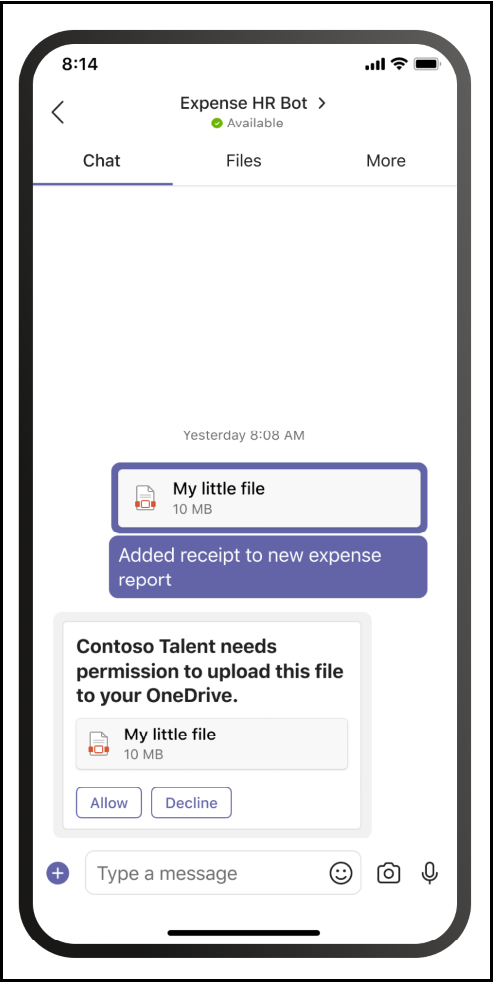

# <a name="send-and-receive-files-through-your-bot"></a>Enviar y recibir archivos a través de su bot

[!include[v3-to-v4-SDK-pointer](~/includes/v3-to-v4-pointer-bots.md)]

Hay dos formas de enviar archivos a y desde un bot:

* Uso de las API de Microsoft Graph. Este método funciona con bots en todos los ámbitos de Teams:
  * `personal`
  * `channel`
  * `groupchat`
* Uso de las API de Microsoft Teams. Estos solo admiten archivos en un contexto:
  * `personal`

## <a name="using-the-microsoft-graph-apis"></a>Uso de las API de Microsoft Graph

Puede publicar mensajes con datos adjuntos de tarjeta que hacen referencia a archivos existentes de SharePoint mediante las API de Microsoft Graph para [OneDrive y SharePoint](/onedrive/developer/rest-api/). El uso de las API de Graph requiere obtener acceso a la carpeta de OneDrive `personal` ( `groupchat` archivos y archivos) de un usuario o los archivos en los canales de un equipo (para `channel` archivos) a través del flujo de autorización OAuth 2,0 estándar. Este método funciona en todos los ámbitos de Teams.

## <a name="using-the-teams-bot-apis"></a>Uso de las API de bot de Teams

> [!NOTE]
> Este método sólo funciona en el `personal` contexto. No funciona en el `channel` `groupchat` contexto o.

El bot puede enviar y recibir archivos directamente con usuarios en el `personal` contexto, también conocido como chats personales, mediante las API de Microsoft Teams. Esto le permite implementar informes de gastos, reconocimiento de imágenes, archivado de archivos, firmas electrónicas y otros escenarios que impliquen la manipulación directa del contenido de los archivos. Los archivos compartidos en Microsoft Teams normalmente aparecen como tarjetas y permiten la visualización en una aplicación enriquecida.

En las secciones siguientes se describe cómo hacerlo para enviar contenido de archivo como resultado de la interacción directa del usuario, como el envío de un mensaje. Esta API se proporciona como parte de la plataforma de robots de Microsoft Teams.

### <a name="configure-your-bot-to-support-files"></a>Configurar el bot para que admita archivos

Para poder enviar y recibir archivos en el bot, debe establecer la `supportsFiles` propiedad del manifiesto en `true` . Esta propiedad se describe en la sección [bots](~/resources/schema/manifest-schema.md#bots) de la referencia del manifiesto.

La definición tendrá un aspecto similar a este: `"supportsFiles": true` . Si el bot no está habilitado `supportsFiles` , las siguientes características no funcionarán.

### <a name="receiving-files-in-personal-chat"></a>Recibir archivos en chat personal

Cuando un usuario envía un archivo a su bot, el archivo se carga primero en el almacenamiento de OneDrive para la empresa del usuario. A continuación, el bot recibirá una actividad de mensaje en la que se notifica que la carga del usuario. La actividad contendrá metadatos de archivo, como su nombre y la dirección URL de contenido. Puede leer directamente desde esta dirección URL para obtener su contenido binario.

#### <a name="message-activity-with-file-attachment-example"></a>Ejemplo de actividad de mensajes con datos adjuntos de archivo

```json
{
  "attachments": [{
    "contentType": "application/vnd.microsoft.teams.file.download.info",
    "contentUrl": "https://contoso.sharepoint.com/personal/johnadams_contoso_com/Documents/Applications/file_example.txt",
    "name": "file_example.txt",
    "content": {
      "downloadUrl" : "https://download.link",
      "uniqueId": "1150D938-8870-4044-9F2C-5BBDEBA70C9D",
      "fileType": "txt",
      "etag": "123"
    }
  }]
}
```

En la tabla siguiente se describen las propiedades de contenido de los datos adjuntos:

| Propiedad | Finalidad |
| --- | --- |
| `downloadUrl` | Dirección URL de OneDrive para recuperar el contenido del archivo. Puede emitir `HTTP GET` directamente desde esta dirección URL. |
| `uniqueId` | IDENTIFICADOR de archivo único. Este será el identificador de elemento de la unidad de OneDrive, en el caso de que el usuario envíe un archivo a su bot. |
| `fileType` | Tipo de extensión de archivo, como PDF o DOCX. |

Como práctica recomendada, debe confirmar la carga del archivo mediante el envío de un mensaje al usuario.

### <a name="uploading-files-to-personal-chat"></a>Cargar archivos en un chat personal

La carga de un archivo a un usuario implica los pasos siguientes:

1. Envíe un mensaje al usuario que solicita permiso para escribir el archivo. Este mensaje debe contener `FileConsentCard` datos adjuntos con el nombre del archivo que se va a cargar.
2. Si el usuario acepta la descarga del archivo, el bot recibirá una actividad de *invocación* con una dirección URL de la ubicación.
3. Para transferir el archivo, el bot realiza una `HTTP POST` directamente en la dirección URL de ubicación proporcionada.
4. Opcionalmente, puede quitar la tarjeta de consentimiento original si no desea permitir que el usuario acepte más cargas del mismo archivo.

#### <a name="message-requesting-permission-to-upload"></a>Mensaje que solicita permiso para cargar

Este mensaje de escritorio contiene un objeto de datos adjuntos sencillo que solicita permiso de usuario para cargar el archivo:


Este mensaje de móvil contiene un objeto Attachment que solicita permiso de usuario para cargar el archivo:



```json
{
  "attachments": [{
    "contentType": "application/vnd.microsoft.teams.card.file.consent",
    "name": "file_example.txt",
    "content": {
      "description": "<Purpose of the file, such as: this is your monthly expense report>",
      "sizeInBytes": 1029393,
      "acceptContext": {
      },
      "declineContext": {
      }
    }
  }]
}
```

En la tabla siguiente se describen las propiedades de contenido de los datos adjuntos:

| Propiedad | Finalidad |
| --- | --- |
| `description` | Descripción del archivo. Se puede mostrar al usuario para describir su finalidad o resumir su contenido. |
| `sizeInBytes` | Proporciona al usuario una estimación del tamaño del archivo y la cantidad de espacio que tendrá en OneDrive. |
| `acceptContext` | Contexto adicional que se transmitirá silenciosamente a su bot cuando el usuario acepte el archivo. |
| `declineContext` | Contexto adicional que se transmitirá silenciosamente a su bot cuando el usuario rechace el archivo. |

#### <a name="invoke-activity-when-the-user-accepts-the-file"></a>Invocar la actividad cuando el usuario acepta el archivo

Se envía una actividad de invocación a su bot cuando el usuario acepta el archivo. Contiene la dirección URL del marcador de posición de OneDrive para la empresa que el bot puede enviar a `PUT` en para transferir el contenido del archivo. para obtener información sobre cómo cargar en la dirección URL de OneDrive, lea este artículo: [cargar bytes a la sesión de carga](/onedrive/developer/rest-api/api/driveitem_createuploadsession#upload-bytes-to-the-upload-session).

En el ejemplo siguiente se muestra una versión abreviada de la actividad Invoke que recibirá el bot:

```json
{
  ...

  "name": "fileConsent/invoke",
  "value": {
    "type": "fileUpload",
    "action": "accept",
    "context": {
    },
    "uploadInfo": {
      "contentUrl": "https://contoso.sharepoint.com/personal/johnadams_contoso_com/Documents/Applications/file_example.txt",
      "name": "file_example.txt",
      "uploadUrl": "https://upload.link",
      "uniqueId": "1150D938-8870-4044-9F2C-5BBDEBA70C8C",
      "fileType": "txt",
      "etag": "123"
    }
  }
}
```

De forma similar, si el usuario rechaza el archivo, el bot recibirá el evento siguiente, con el mismo nombre de actividad general:

```json
{
  "name": "fileConsent/invoke",
  "value": {
    "type": "fileUpload",
    "action": "decline",
    "context": {
    }
  }
}
```

### <a name="notifying-the-user-about-an-uploaded-file"></a>Notificar al usuario sobre un archivo cargado

Después de cargar un archivo en el OneDrive del usuario, independientemente de si usa el mecanismo descrito anteriormente o las API delegadas del usuario de OneDrive, debe enviar un mensaje de confirmación al usuario. Este mensaje debe contener `FileCard` datos adjuntos en los que el usuario puede hacer clic, ya sea para obtener una vista previa, abrirlo en OneDrive o descargarse de forma local.

```json
{
  "attachments": [{
    "contentType": "application/vnd.microsoft.teams.card.file.info",
    "contentUrl": "https://contoso.sharepoint.com/personal/johnadams_contoso_com/Documents/Applications/file_example.txt",
    "name": "file_example.txt",
    "content": {
      "uniqueId": "1150D938-8870-4044-9F2C-5BBDEBA70C8C",
      "fileType": "txt",
    }
  }]
}
```

En la tabla siguiente se describen las propiedades de contenido de los datos adjuntos:

| Propiedad | Finalidad |
| --- | --- |
| `uniqueId` | IDENTIFICADOR de elemento de unidad de OneDrive/SharePoint. |
| `fileType` | Tipo de archivo, como PDF o DOCX. |

### <a name="basic-example-in-c"></a>Ejemplo básico en C #

El siguiente ejemplo muestra cómo puede controlar cargas de archivos y enviar solicitudes de consentimiento de archivo en el cuadro de diálogo de su bot.

```csharp

// This sample dialog shows two simple flows:
// 1) A silly example of receiving a file from the user, processing the key elements,
//    and then constructing the attachment and sending it back.
// 2) Creating a new file consent card requesting user permission to upload a file.
private async Task MessageReceivedAsync(IDialogContext context, IAwaitable<object> result)
{
    var replyMessage = context.MakeMessage();
    Attachment returnCard;

    var message = await result as Activity;

    // Check to see if the user is sending the bot a file.
    if (message.Attachments != null && message.Attachments.Any())
    {
        var attachment = message.Attachments.First();

        if (attachment.ContentType == FileDownloadInfo.ContentType)
        {
            FileDownloadInfo downloadInfo = (attachment.Content as JObject).ToObject<FileDownloadInfo>();
            if (downloadInfo != null)
            {
                returnCard = CreateFileInfoAttachment(downloadInfo, attachment.Name, attachment.ContentUrl);
                replyMessage.Attachments.Add(returnCard);
            }
        }
    }
    else
    {
        // Illustrates creating a file consent card.
        returnCard = CreateFileConsentAttachment();
        replyMessage.Attachments.Add(returnCard);
    }
    await context.PostAsync(replyMessage);
}


private static Attachment CreateFileInfoAttachment(FileDownloadInfo downloadInfo, string name, string contentUrl)
{
    FileInfoCard card = new FileInfoCard()
    {
        FileType = downloadInfo.FileType,
        UniqueId = downloadInfo.UniqueId
    };

    Attachment att = card.ToAttachment();
    att.ContentUrl = contentUrl;
    att.Name = name;

    return att;
}

private static Attachment CreateFileConsentAttachment()
{
    JObject acceptContext = new JObject();
    // Fill in any additional context to be sent back when the user accepts the file.

    JObject declineContext = new JObject();
    // Fill in any additional context to be sent back when the user declines the file.

    FileConsentCard card = new FileConsentCard()
    {
        AcceptContext = acceptContext,
        DeclineContext = declineContext,
        SizeInBytes = 102635,
        Description = "File description"
    };

    Attachment att = card.ToAttachment();
    att.Name = "Example file";

    return att;
}
```
