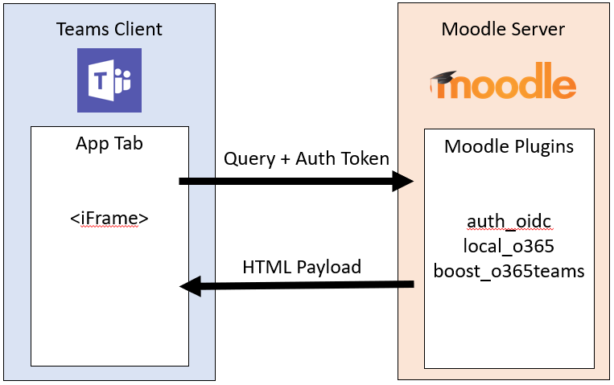

# Instalar Moodle LMS

En este artículo, aprenderá a instalar Moodle LMS.

> [!NOTE]
> Para ayudar a los administradores de TI a configurar fácilmente Moodle y Teams integración, se actualiza el código abierto Microsoft 365 Complementos de Moodle para lo siguiente:
>
> * Registro automático del servidor de Moodle con [Microsoft Azure Active Directory (Azure AD).](https://azure.microsoft.com/services/active-directory/)
>
> * Implementación con un solo clic del bot de Moodle Assistant en Azure.
>
> * Aprovisionamiento automático de equipos y sincronización automática de inscripciones de equipos para todos los cursos de Moodle o selección de ellos.
>
> * Instalación automática de la pestaña Moodle y el bot del asistente de Moodle en cada equipo sincronizado.
>
> Para obtener más información sobre la funcionalidad que proporciona esta integración, consulte [Microsoft Teams y Moodle](https://education.microsoft.com/resource/3dffb3a8).

## Requisitos previos

Estos son los requisitos previos para instalar Moodle:

* Credenciales de administrador de Moodle.

* Credenciales de administrador de Azure AD.

* Una suscripción de Azure en la que puede crear nuevos recursos.

## 1. Instalar los complementos de Moodle Microsoft 365

La integración de Moodle en Microsoft Teams se basa en el [conjunto de complementos código abierto Microsoft 365 Moodle](https://github.com/Microsoft/o365-moodle).

### Aplicaciones y complementos necesarios

Asegúrese de instalar y descargar lo siguiente antes de continuar con la instalación de complementos de Moodle de Microsoft 365:

1. Asegúrese de instalar una [versión estable actual de Moodle](https://download.moodle.org/releases/latest/).

1. Descargue y guarde la [Conectar Moodle OpenID](https://moodle.org/plugins/auth_oidc) y los complementos [de integración de Microsoft 365](https://moodle.org/plugins/local_o365) en el equipo local.

    > [!NOTE]
    > La instalación de los complementos Conectar y Microsoft 365 Integration de OpenID es necesaria para la integración Teams.
    >
    > Además, los complementos [Microsoft 365 Teams Theme](https://moodle.org/plugins/theme_boost_o365teams) son muy recomendables.

### complementos de moodle de Microsoft 365

1. Inicie sesión en el servidor de Moodle como administrador y seleccione **Administración del sitio** en el [bloque Configuración](https://docs.moodle.org/22/en/Settings_block) ubicado en el panel de navegación izquierdo.

1. Seleccione la pestaña **Complementos** y, a continuación, seleccione **Instalar complementos**.

1. En la sección **Instalar complementos desde un archivo ZIP** , seleccione **Elegir un archivo**.

1. Seleccione **Upload una** opción de archivo en el panel de navegación izquierdo, busque el archivo que descargó y seleccione **Upload este archivo**.

1. Seleccione **Administración del sitio** en el panel de navegación izquierdo para volver al panel de administración. Desplácese hacia abajo hasta **Complementos locales** y seleccione el vínculo **integración de Microsoft 365**.

    > [!IMPORTANT]
    >
    > * Mantenga abierta la página de configuración de los complementos de Moodle Microsoft 365 en una pestaña independiente del explorador, ya que debe volver a este conjunto de páginas a lo largo del proceso.  
    >
    > * Si no tiene un sitio de Moodle existente, vaya al repositorio [de Moodle en Azure](https://github.com/azure/moodle) e implemente rápidamente una instancia de Moodle y personalícela según sus necesidades.

## 2. Configuración de la conexión entre los complementos de Microsoft 365 y Azure AD

Debe configurar la conexión entre los complementos de Microsoft 365 y Azure AD.

### Requisitos

Registre Moodle como una aplicación en Azure AD mediante el script de PowerShell. El script aprovisiona lo siguiente:

* Una nueva aplicación de Azure AD para el inquilino de Microsoft 365, que usa la Microsoft 365 Complementos de Moodle.
* La aplicación para el inquilino de Microsoft 365, configure las direcciones URL de respuesta y los permisos necesarios para la aplicación aprovisionada y devuelve y `AppID` `Key`.

Use la página de configuración de complementos de Moodle generada `AppID` y `Key` en su Microsoft 365 para configurar el sitio de servidor de Moodle con Azure AD.

> [!IMPORTANT]
>
> * El script de PowerShell no se actualiza con los elementos de configuración más recientes, por lo que debe completar la configuración manualmente siguiendo los pasos descritos en las páginas de versión de Moodle [3.8.0.4 y 3.9.1](https://docs.moodle.org/39/en/Office365#3.8.0.4_and_3.9.1_release) y [3.8.0.5 y 3.9.2](https://docs.moodle.org/39/en/Office365#3.8.0.5_and_3.9.2_release) .
>
> * Para obtener más información sobre cómo registrar manualmente la instancia de Moodle, consulte Registro de la [instancia de Moodle como aplicación](https://docs.moodle.org/34/en/Office365#Register_your_Moodle_instance_as_an_Application).

### Pestaña Moodle para Microsoft Teams flujo de información

1. En la página complementos de integración de Microsoft 365, seleccione la pestaña **Configuración**.

1. Seleccione el botón **Descargar script de PowerShell** y guárdelo como una carpeta ZIP en el equipo local.

1. Prepare el script de PowerShell desde el archivo ZIP de la siguiente manera:

    1. Descargue y extraiga el `Moodle-AzureAD-Powershell.zip` archivo.
    1. Abra la carpeta extraída.
    1. Haga clic con el botón derecho en el `Moodle-AzureAD-Script.ps1` archivo y seleccione **Propiedades**.
    1. En la pestaña **General** del ventana Propiedades, active la `Unblock` casilla situada junto al atributo **Seguridad** situado en la parte inferior de la ventana.
    1. Seleccione **Aceptar**.
    1. Copie la ruta de acceso del directorio a la carpeta extraída.

1. Ejecute PowerShell como administrador:

    1. Seleccione Inicio.
    1. Escriba PowerShell.
    1. Haga clic con el botón derecho en **Windows PowerShell**.
    1. Seleccione **Ejecutar como administrador**.

1. Vaya al directorio descomprimido; para ello, escriba `cd .../.../Moodle-AzureAD-Powershell` dónde `.../...` es la ruta de acceso al directorio.

1. Ejecute el script de PowerShell:

    1. Escriba `Set-ExecutionPolicy -ExecutionPolicy RemoteSigned -Scope CurrentUser`.
    1. Escriba `./Moodle-AzureAD-Script.ps1`.
    1. Inicie sesión en la cuenta de administrador de Microsoft 365 en la ventana emergente.
    1. Escriba el nombre de la aplicación de Azure AD, por ejemplo, complementos de Moodle o Moodle.
    1. Escriba la dirección URL del servidor de Moodle.
    1. Copie el **identificador de aplicación (`AppID`)** y **la clave de aplicación (`Key`)** generados por el script y guárdelos.

1. A continuación, debe agregar y `AppID` `Key` a los complementos de Moodle de Microsoft 365. Vuelva a la página de administración de complementos, Administración del sitio > Complementos > Microsoft 365 Integración.

1. En la pestaña **Configuración** , agregue `AppID` y `Key` copió anteriormente y, a continuación, seleccione **Guardar cambios**. Después de actualizar la página, puede ver una nueva sección **Elegir método de conexión**.

1. En **Choose connection method (Elegir método de conexión**), active la casilla con la etiqueta **Default (Predeterminado**) y, a continuación, seleccione **Save changes again (Guardar cambios** de nuevo).

1. Una vez actualizada la página, puede ver otra nueva sección **Administración consentimiento & información adicional**.
    1. Seleccione **Proporcionar Administración vínculo consentimiento**, escriba las credenciales de administrador global de Microsoft 365 y, a continuación, **Acepte** para conceder los permisos.
    1. Junto al campo **Inquilino de Azure AD** , seleccione el botón **Detectar** .
    1. Junto a la **dirección URL de OneDrive para la Empresa**, seleccione el botón **Detectar**.
    1. Después de rellenar los campos, vuelva a seleccionar el botón **Guardar cambios** .

1. Seleccione el botón **Actualizar** para comprobar la instalación y, a continuación, seleccione **Guardar cambios**.

1. Sincronice los usuarios entre el servidor de Moodle y Azure AD. Para empezar:

    > [!NOTE]
    > En función del entorno, puede seleccionar diferentes opciones durante esta fase.

1. Sincronice los usuarios entre el servidor de Moodle y Azure AD. En función del entorno, puede seleccionar diferentes opciones durante esta fase. Para empezar:
    1. Cambie a la **pestaña Sincronizar Configuración**.

    1. En la sección **Sincronizar usuarios con Azure AD** , active las casillas que se aplican a su entorno. Debe seleccionar lo siguiente:  

        ✔ Cree cuentas en Moodle para los usuarios de Azure AD.

        ✔ Actualice todas las cuentas de Moodle para los usuarios de Azure AD.

    1. En la sección **Restricción de creación** de usuarios, puede configurar un filtro para limitar los usuarios de Azure AD que se sincronizan con Moodle.
    1. La sección **Asignación de campos de usuario** permite personalizar la asignación de campos de Azure AD a Moodle User Profile.
    1. En la sección **sincronización de Teams**, puede seleccionar crear automáticamente grupos, como equipos para algunos o todos los cursos de Moodle existentes.

13. Para validar los trabajos [cron](https://docs.moodle.org/310/en/Cron) y ejecutarlos manualmente para la primera ejecución, seleccione el vínculo **De administración de tareas programadas** en la sección **Sincronizar usuarios con Azure AD** . Esto le lleva a la página **Tareas programadas** .

    1. Desplácese hacia abajo y busque el trabajo **Sincronizar usuarios con Azure AD** y seleccione **Ejecutar ahora**.
    1. Si selecciona crear grupos basados en cursos existentes, también puede ejecutar el trabajo **Crear grupos de usuarios en Microsoft 365** trabajo.

    > [!NOTE]
    >
    > Moodle [Cron](https://docs.moodle.org/310/en/Cron) se ejecuta según la programación de tareas. La programación predeterminada es una vez al día. Sin embargo, el cron debe ejecutarse con más frecuencia para mantener todo sincronizado.

1. Vuelva a la página de administración de complementos, **Administración del sitio > Complementos > Microsoft 365 Integración** y seleccione la página **Teams Configuración**.

1. En la página **Teams Configuración**, configure los valores necesarios para habilitar la integración de la aplicación Teams.

    1. Para habilitar **OpenID Conectar**, seleccione el vínculo **Administrar autenticación** y seleccione el icono de ojo en la línea **Conectar OpenId** si no está disponible.
    1. Para habilitar la inserción de fotogramas, seleccione el vínculo **Seguridad HTTP** y, a continuación, active la casilla situada junto a **Permitir incrustación de fotogramas**.
    1. Para habilitar los servicios web, que habilitan las características de la API de Moodle, seleccione el vínculo **Características avanzadas** y, a continuación, asegúrese de que la casilla situada junto a **Habilitar servicios web** está seleccionada.
    1. Para habilitar los servicios externos para Microsoft 365, seleccione el vínculo **Servicios externos** y, a continuación, haga lo siguiente:  

        ✔ Seleccione **Editar** en la fila **Moodle Microsoft 365 Webservices**.

        ✔ Active la casilla situada junto a **Habilitado** y, a continuación, seleccione **Guardar cambios.**

    1. Edite los permisos de usuario autenticados para permitirles crear tokens de servicio web.

        ✔ Seleccione el vínculo **Editar rol Usuario autenticado** .

        ✔ Desplácese hacia abajo y busque la funcionalidad **Crear un token de servicio web** y active la casilla **Permitir** .

## 3. Implementación del bot de Moodle Assistant en Azure

El bot asistente de Moodle gratuito para Microsoft Teams ayuda a los profesores y alumnos a responder preguntas sobre sus cursos, asignaciones, calificaciones y otra información en Moodle. El bot también envía notificaciones de Moodle a alumnos y profesores dentro de Teams. El bot es un proyecto de código abierto mantenido por Microsoft y está disponible en [GitHub](https://github.com/microsoft/Moodle-Teams-Bot).

> [!NOTE]
>
> * Implemente recursos en la suscripción de Azure. Todos los recursos se configuraron mediante el nivel **gratis** . En función del uso del bot, es posible que tenga que escalar estos recursos.
>
> * Para usar la pestaña Moodle sin el bot, vaya a [4](#4-deploy-your-microsoft-teams-app).

### Flujo de información del bot de Moodle

Para instalar el bot, debe registrarlo en la [Plataforma de identidad de Microsoft](https://identity.microsoft.com/Landing). Esto permite que el bot se autentique en los puntos de conexión de Microsoft.

Para registrar el bot:

1. Vaya a la página de administración de complementos y seleccione **Complementos**. En **Integración de Microsoft 365**, seleccione la pestaña **Teams Configuración**.

1. Seleccione el vínculo **Portal de registro de aplicaciones de Microsoft** e inicie sesión con su identificador de Microsoft.

1. Escriba un nombre para la aplicación, como MoodleBot y seleccione el botón **Crear** .

1. Copie el **identificador de aplicación** y péguelo en el campo **Bot Application ID (Id. de aplicación del bot**) en la página **Team Configuración (Equipo Configuración**).

1. Seleccione el botón **Generar nueva contraseña** . Copie la contraseña generada y péguela en el campo **Bot Application Password** de la página **Team Configuración**.

1. Desplácese hasta la parte inferior del formulario y seleccione **Guardar cambios**.

Después de generar el identificador y la contraseña de la aplicación, implemente el bot en Azure:

> [!div class="checklist"]
>
> * Seleccione **Implementar en Azure** y complete el formulario con la información necesaria, como el identificador de aplicación del bot, la contraseña de aplicación del bot y el secreto de Moodle en la página **de Teams Configuración**. La información de Azure se encuentra en la página **Configuración** .
> * Después de completar el formulario, active la casilla para aceptar los términos y condiciones.
> * Seleccione **Comprar**. Todos los recursos de Azure se implementan en el nivel gratuito.

Una vez que los recursos hayan completado la implementación en Azure, debe configurar los complementos Microsoft 365 Moodle con un punto de conexión de mensajería. Debe obtener el punto de conexión del bot en Azure:

1. Inicie sesión en [Microsoft Azure Portal](https://portal.azure.com).

1. En el panel izquierdo, seleccione **Grupos de recursos** y seleccione el grupo de recursos que usó o creó, al implementar el bot.

1. Seleccione el recurso **WebApp Bot** en la lista de recursos del grupo.

1. Copie el **punto de conexión de mensajería** de la sección **Información general** .

1. En Moodle, abra la página **Team Configuración** de los complementos de Moodle de Microsoft 365.

1. En el campo **Punto de conexión del bot** , pegue la dirección URL que copió y cambie los *mensajes* de palabra a *webhook*. La dirección URL debe aparecer de la siguiente manera: `https://botname.azurewebsites.net/api/webhook`

1. Seleccione **Guardar cambios**.

1. Después de guardar los cambios, vuelva a la pestaña **Equipo Configuración**, seleccione el botón **Descargar archivo de manifiesto** y guarde el paquete de manifiesto de la aplicación en el equipo para su uso posterior.

## 4. Implementación de la aplicación Microsoft Teams

Una vez que el bot se implementó en Azure y se configuró para comunicarse con el servidor de Moodle, debe implementar la aplicación de Microsoft Teams. Para ello, debe cargar el archivo de manifiesto de la aplicación que descargó de la página Configuración Microsoft 365 equipo de complementos de Moodle del paso anterior.

Antes de instalar la aplicación, debe asegurarse de habilitar aplicaciones externas y cargar aplicaciones. Para obtener más información, consulte [Preparación del inquilino de Microsoft 365](../concepts/build-and-test/prepare-your-o365-tenant.md).

Para implementar la aplicación:

1. Abra **Microsoft Teams**.

1. Seleccione el icono **Aplicación** en el área inferior izquierda de la barra de navegación.

1. Seleccione el **vínculo Upload una aplicación personalizada** en la lista de opciones.

   > [!NOTE]
   > Si ha iniciado sesión como administrador global, debe tener la opción de cargar la aplicación en el catálogo de aplicaciones de su organización; de lo contrario, solo puede cargar la aplicación para un equipo en el que sea miembro.

4. Seleccione el `manifest.zip` paquete que descargó anteriormente y seleccione **Guardar**. Si no ha descargado el paquete de manifiesto de la aplicación, puede descargarlo desde la pestaña **Team Configuración** de la página de configuración de complementos de Moodle.

Ahora que tiene instalada la aplicación, puede agregar la pestaña a cualquier canal al que tenga acceso. Para ello, vaya al canal, seleccione el símbolo **más** (➕) y seleccione la aplicación en la lista. Siga las indicaciones para terminar de agregar la pestaña de curso de Moodle a un canal.

## 5. Permitir la creación automática de pestañas moodle en Microsoft Teams

Aunque las pestañas de Moodle se crean manualmente en Microsoft Teams, puede decidir crearlas automáticamente cuando se creen equipos a partir de la sincronización del curso. Para ello, debe configurar el identificador de la aplicación de Microsoft Teams cargada en Moodle.

Para permitir la creación automática de pestañas de Moodle:

1. Abra Microsoft Teams.

1. Seleccione el icono Aplicaciones en el panel inferior izquierdo.

1. Busque la **aplicación moodle** cargada > seleccione el icono **de opciones** > seleccione **copiar vínculo**.

1. En un editor de texto, pegue el contenido copiado. Debe contener una dirección URL como `https://teams.microsoft.com/l/app/00112233-4455-6677-8899-aabbccddeeff`. Copie la última parte de la dirección URL, como `00112233-4455-6677-8899-aabbccddeeff`, que es el identificador de la aplicación Microsoft Teams.

1. En Moodle, abra la pestaña **Teams aplicación Moodle** de la página de configuración de complementos de Moodle de Microsoft 365.

1. Pegue el identificador de la aplicación Microsoft Teams en el campo Id. de aplicación de Moodle y guarde los cambios.

Cuando se sincroniza un curso de Moodle, Teams instala automáticamente la aplicación Moodle en el equipo, crea una pestaña Moodle en el canal General de Teams y la configura para que contenga la página del curso de Moodle desde la que se sincroniza. Ahora puede empezar a trabajar con sus cursos de Moodle directamente desde Teams.

> [!NOTE]
> Para compartir con nosotros cualquier solicitud o comentario de características, visite nuestra [página Voz del usuario](https://support.microsoft.com/en-us/office/uservoice-pages-430e1a78-e016-472a-a10f-dc2a3df3450a).

## Consulte también

* [Integrar aplicaciones web](~/samples/integrate-web-apps-overview.md)
* [Moodle](https://moodle.org/)
* [Documentación de Moodle](https://docs.moodle.org/34/en/Installing_plugins).
