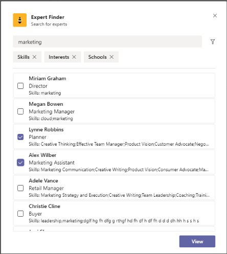

# Plantillas de aplicación para Microsoft TeamsApp Templates for Microsoft Teams

Las plantillas de aplicación son aplicaciones de producción listas para Microsoft teams que se pueden controlar desde la comunidad, desde código abierto y están disponibles en GitHub.App templates are production-ready apps for Microsoft Teams that are community driven, open-source, and available on GitHub. Cada una contiene instrucciones detalladas para implementar e instalar esa aplicación para su organización, ya que proporciona una aplicación lista para usar que puede instalar y empezar a usar inmediatamente.Each contains detailed instructions for deploying and installing that app for your organization, providing a ready-to-use app that you can install and begin using immediately. También está disponible el código fuente completo, de modo que puede explorarlo en detalle o bifurcar el código y modificarlo para satisfacer sus necesidades específicas.The complete source code is available as well, so you can explore it in detail, or fork the code and alter it to meet your specific needs.

**&#9734; indica las plantillas de aplicación que se acaban de publicar.****&#9734; Indicates newly released app templates.**

### Ventajas claveKey benefits

* **Experiencia de plug and Play:** Todas las plantillas de aplicación incluyen scripts de implementación que le permitirán hospedar todos los servicios necesarios en Microsoft Azure.**Plug and play experience:** All app templates include deployments scripts that will allow you to host all necessary services in Microsoft Azure. No se necesita ninguna codificación para implementar las aplicaciones.No coding is required to deploy the apps.
* **Código preparado para la producción:** Las plantillas de aplicación cumplen con los procedimientos recomendados para la seguridad y la infraestructura, y todos los cambios enviados por la comunidad se revisan para garantizar una conformidad continua.**Production-ready code:** The app templates conform to recommended best practices around security and infrastructure, and all community submitted changes to them are reviewed to ensure continued conformance.
* **Personalizable y extensible:** Aunque todas las plantillas de aplicación están preparadas para implementarse tal y como están, proporcionamos la base de código completa y los scripts de implementación para que pueda personalizarlas fácilmente o ampliarlas para que se ajusten a sus necesidades específicas.**Customizable and extensible:** While all app templates are ready to deploy as they are, we provide the entire code base and deployment scripts so that you can easily customize or extend them to fit your unique needs.
* **Documentación detallada & soporte técnico:** Todas las plantillas de aplicación están acompañadas de la documentación de un extremo a otro sobre la arquitectura de la solución, la implementación y los pasos de configuración.**Detailed documentation & support:** All app templates are accompanied by end-to-end documentation on solution architecture, deployment, and configuration steps. Los repositorios también se supervisan, por lo que puede informar de los problemas que encuentre al emitir un problema en GitHub.The repositories are monitored as well, so please report any issues you encounter by raising an Issue on GitHub.

## Pregunta ausenteAsk Away

Pregúntese es un [Bot de Microsoft Teams](../bots/what-are-bots.md) que permite a los usuarios realizar sesiones de Q&a (pregunta y respuesta) en Teams.Ask Away is a [Microsoft Teams bot](../bots/what-are-bots.md) that enables users to conduct Q&A (Question and Answer) sessions within Teams. Con el bot Ask Away, los miembros del equipo pueden enviar y recibir preguntas de voto compartido por los compañeros, lo que permite a los hosts de preguntas&un host recopilar fácilmente preguntas de la parte principal dentro de un canal o chat.Using the Ask Away bot, team members can submit and up-vote questions shared by colleagues allowing Q&A hosts to easily gather top-of-mind questions within a channel or chat. El bot se puede usar para realizar preguntas en tiempo real de Q&una sesión en una reunión de Microsoft Teams y permite a los asistentes enviar preguntas en directo a través del chat.The bot can be used to conduct a real-time Q&A session in a Teams meeting and allows attendees to submit questions live via chat.

[Obtener acceso a GitHubGet it on GitHub](https://github.com/OfficeDev/microsoft-teams-apps-askaway)

:::row:::
  :::column span="2":::
      
:::column-end:::
:::row-end:::

## Información de asociadosAssociate Insights

Associate Insights es una plantilla de [Power apps](/powerapps/maker/canvas-apps/embed-teams-app) que faculta a los trabajadores de Firstline para que capturen y envíen de forma directa opinión, sentimientos y percepción del cliente.Associate Insights is a [Power Apps](/powerapps/maker/canvas-apps/embed-teams-app) template that empowers firstline workers to directly capture and submit customer opinion, sentiment, and perception. A menudo, los trabajadores de Firstline son el primer representante de la compañía que se compromete con los clientes en un punto de contacto de uno a uno.Firstline workers are often the first company representative to engage with customers in a one-to-one point-of contact. Los datos recopilados se pueden compartir y usar de forma colaborativa con los equipos de empresa, por ejemplo, a través de una pestaña de Microsoft Power BI, para mejorar la experiencia del producto y mejorar la experiencia del cliente.The collected data can be shared and used collaboratively by business teams, e.g., via a Power BI Teams tab, for product improvement and enhancing the customer experience.

[Obtener acceso a GitHubGet it on GitHub](https://github.com/OfficeDev/microsoft-teams-apps-associateinsights)

:::row:::
  :::column span="2":::
      
:::column-end:::
:::row-end:::
:::row:::
:::column span="2":::
    
:::column-end:::
:::row-end:::

## AsistenciaAttendance

La aplicación de asistencia es una pestaña de [Power apps](/powerapps/maker/canvas-apps/embed-teams-app) que se puede anclar en un equipo.The Attendance app is a [Power Apps](/powerapps/maker/canvas-apps/embed-teams-app) tab that can be pinned in a team. Está diseñado para registrar la presencia, normalmente en opciones como los entornos de aprendizaje y aprendizaje.It is designed to record presence, typically in settings such as learning and training environments. Los usuarios pueden marcar o editar la asistencia durante un máximo de 30 días en el pasado y ver informes de asistencia resumida para un grupo completo o asistentes individuales.Users can mark or edit attendance for up to 30 days in the past and view summarized attendance reports for an entire group or individual attendees.

[Obtener acceso a GitHubGet it on GitHub](https://github.com/OfficeDev/microsoft-teams-apps-attendance)

## Libro a salónBook-a-room

Book-a-Room es un [robot de Microsoft Teams](../bots/what-are-bots.md) que permite a los usuarios buscar y reservar rápidamente una sala de reuniones para 30 (predeterminado), 60 o 90 minutos a partir de la hora actual.Book-a-room is a [Microsoft Teams bot](../bots/what-are-bots.md) that lets users quickly find and reserve a meeting room for 30 (default), 60, or 90 minutes starting from the current  time. El bot? o de robot de libro a salón se limita a conversaciones personales o de 1:1.The Book-a-room bot scopes to personal or 1:1 conversations.

[Obtener acceso a GitHubGet it on GitHub](https://github.com/OfficeDev/microsoft-teams-apps-bookaroom)

## Crear accesoBuilding Access

El acceso de creación es una aplicación basada en la plataforma de Microsoft [Power Platform](https://powerapps.microsoft.com/blog/now-in-preview-customize-teams-with-built-in-power-platform-capabilities/)que admite la administración de los umbrales de ocupación y las normas de distancing social al permitir que los directores administren, controlen y reporten la presencia de los empleados en el sitio.Building Access is a Microsoft [Power Platform](https://powerapps.microsoft.com/blog/now-in-preview-customize-teams-with-built-in-power-platform-capabilities/)-based app that supports the administration of building occupancy thresholds and social distancing norms by enabling facilities directors to manage, track, and report employee on-site presence. La aplicación, creada con Microsoft [Power apps](/powerapps/powerapps-overview)y [Power Automate](/power-automate/getting-started), se integra profundamente con Microsoft Teams y permite a las organizaciones determinar la preparación para la creación, establecer criterios de elegibilidad para el acceso a domicilio y recopilar información para la planeación futura.The app, built using Microsoft [Power Apps](/powerapps/powerapps-overview), and [Power Automate](/power-automate/getting-started), deeply integrates with Microsoft Teams and enables organizations to determine building readiness, establish eligibility criteria for on-site access, and gather insights for future planning.

[Obtener acceso a GitHubGet it on GitHub](https://github.com/OfficeDev/microsoft-teams-apps-buildingaccess)

:::row:::
   :::column span="":::
     
   :::column-end:::
   :::column span="":::
      
   :::column-end:::
:::row-end:::

## CelebracionesCelebrations

Celebrations es una aplicación de Microsoft teams que ayuda a los miembros del equipo a celebrar los cumpleaños, aniversarios y otros eventos periódicos de los demás.Celebrations is a Teams app that helps team members celebrate each others' birthdays, anniversaries, and other recurring events. Recuerda ocasiones especiales de todos los miembros del equipo y envía un mensaje descriptivo a todos los equipos seleccionados en el momento de crear el evento para que los miembros del equipo tengan especial experiencia en el día.It remembers special occasions of all the team members and sends a friendly message in all the teams selected at the time of event creation, to make the team members feel special on their day.

La aplicación proporciona una interfaz sencilla para que todos los miembros del equipo puedan agregar y ver sus eventos personalmente y también permite al usuario seleccionar los equipos en los que se comparten los eventos.The app provides an easy interface for all the team members to personally add and view their events and also allows the user to select the teams in which the events gets shared.

[Obtener acceso a GitHubGet it on GitHub](https://github.com/OfficeDev/microsoft-teams-celebrations-app)

## Lista de comprobaciónChecklist

Checklist es una aplicación personalizada de [extensiones de mensajería](../messaging-extensions/what-are-messaging-extensions.md) de Microsoft teams que le permite colaborar con su equipo creando una lista de comprobación compartida en un chat o en un canal.Checklist is a custom Microsoft Teams [messaging extension](../messaging-extensions/what-are-messaging-extensions.md) app that enables you to collaborate with your team by creating a shared checklist in a chat or channel. La aplicación se admite en todos los clientes de la plataforma Teams (escritorio, explorador, iOS y Android) y está lista para la implementación como parte de su suscripción a Microsoft 365.The app is supported across all Teams platform clients —  desktop, browser, iOS, and Android — and is ready for deployment as part of your Microsoft 365 subscription.  

[Obtener acceso a GitHubGet it on GitHub](https://github.com/OfficeDev/microsoft-teams-checklist-app )

:::row:::
:::column span="2":::
      
:::column-end:::
:::row-end:::

## &#9734; de colocación de claseClassroom Drop-in &#9734;

La aplicación de aula es una aplicación basada en Microsoft [Power Platform](https://powerapps.microsoft.com/blog/now-in-preview-customize-teams-with-built-in-power-platform-capabilities/)que permite a los directores de sistema encontrar equipos de clase (aulas virtuales) y agregarse a sí mismos o a otros usuarios a estos equipos de clase para un período de entrega especificado, según sea necesario.Classroom Drop-in is a Microsoft [Power Platform](https://powerapps.microsoft.com/blog/now-in-preview-customize-teams-with-built-in-power-platform-capabilities/)-based app that enables system leaders to find class teams (virtual classrooms) and add themselves or others to these class teams for a specified drop-in period, as needed. La aplicación creada con Microsoft [Power apps](/powerapps/powerapps-overview) y [Power Automate](/power-automate/getting-started), se integra profundamente con Microsoft Teams para garantizar que los institutos educativos puedan optimizar sus operaciones en un entorno de aprendizaje híbrido al ofrecer acceso a las partes interesadas relevantes para los equipos de clase según los requisitos empresariales.The app built using Microsoft [Power Apps](/powerapps/powerapps-overview) and [Power Automate](/power-automate/getting-started), deeply integrates with Microsoft Teams to ensure educational institutes can optimize their operations in a hybrid learning environment by providing access to relevant stakeholders for class teams per business requirements.

[Obtener acceso a GitHubGet it on GitHub](https://github.com/OfficeDev/microsoft-teams-apps-classroom-dropin)

## Comunicador de la empresaCompany Communicator

La aplicación de la compañía Communicator permite a los equipos corporativos crear y enviar mensajes destinados a varios equipos o a un gran número de empleados a través de chat, lo que permite a la organización llegar a los empleados donde colaboren.The Company Communicator app enables corporate teams to create and send messages intended for multiple teams or large number of employees over chat allowing organization to reach employees right where they collaborate. Use esta plantilla para varios escenarios, como anuncios de nuevas iniciativas, incorporación de empleados, aprendizaje moderno y desarrollo o difusiones en toda la organización.Utilize this template for multiple scenarios such as new initiative announcements, employee onboarding, modern learning and development or organization-wide broadcasts.

La aplicación proporciona una interfaz sencilla para que los usuarios designados puedan crear, obtener una vista previa, colaborar y enviar mensajes.The app provides an easy interface for designated users to create, preview, collaborate and send messages.

Proporciona una base para crear capacidades de comunicación de destino personalizadas, como telemetría personalizada, en cuántos usuarios han reconocido o interactuado con un mensaje.It provides a foundation to build custom targeted communication capabilities such as custom telemetry on how many users acknowledged or interacted with a message.

[Obtener acceso a GitHubGet it on GitHub](https://github.com/OfficeDev/microsoft-teams-company-communicator-app)

## Búsqueda de grupo de contactosContact Group Lookup

La aplicación de búsqueda de grupo de contactos ofrece un enfoque práctico y útil para crear, obtener acceso y administrar los grupos de contactos de la organización (anteriormente conocidos como listas de distribución o grupos de comunicación).The Contact Group Lookup app provides a convenient and useful approach to creating, accessing, and managing your organization's contact groups (formerly known as distribution lists or communication groups). Los usuarios pueden ver y conversar rápidamente con los miembros del grupo, ver el estado de los miembros y crear un chat en grupo con los miembros seleccionados en el grupo de contactos, todo dentro del entorno de Teams.Users can quickly view and chat with group members, view member status, and create a group chat with selected members in the contact group, all within the Teams environment.

[Obtener acceso a GitHubGet it on GitHub](https://github.com/OfficeDev/microsoft-teams-app-contactgrouplookup)

:::row:::
:::column span="2":::
      
:::column-end:::
:::row-end:::
:::row:::
:::column span="2":::
    
:::column-end:::
:::row-end:::

## &#9734; de apreciación de compañeros de trabajoCo-worker Appreciation &#9734;

Con la plantilla de agradecimiento de compañeros de trabajo en Microsoft Teams, los usuarios pueden reconocer los logros de sus compañeros en el contexto de los equipos.Using the co-worker appreciation template in Microsoft Teams, users can recognize their colleagues' achievements within the Teams’ context. Cuando los compañeros de trabajo se seleccionan para recompensar a un colega, los destinatarios y otros miembros del equipo se etiquetan en una conversación de canal y reciben una notificación sobre los detalles del Premio del canal.When co-workers select to reward a colleague, recipients and other team members are tagged in a channel conversation and they receive a notification about the channel's award details. Los premios se registran en la aplicación Microsoft Teams, que es segura, portátil y fácilmente compartible.The awards are recorded in the Teams app, which is secure, portable, and easily shareable. Esto puede considerarse la versión basada en PowerApps de la plantilla de la aplicación Open Badges, con una base de clasificación.This can be considered as the PowerApps based version of the Open Badges app template, with a leaderboard.

[Obtener acceso a GitHubGet it on GitHub](https://github.com/OfficeDev/microsoft-teams-apps-coworker-appreciation)

## CrowdSourcerCrowdSourcer

CrowdSourcer es un [Bot de Microsoft Teams](../bots/what-are-bots.md) que proporciona información consultada de teams que se ha originado en colaboración de miembros del grupo.CrowdSourcer is a [Microsoft Teams bot](../bots/what-are-bots.md) that gives teams queried information sourced collaboratively from group members. Es una excelente manera de responder a las preguntas más frecuentes a la vez que permite que los participantes participen activamente en un recurso de información útil y divertido.It's a great way to answer frequently asked questions while enabling participants to actively engage in and contribute to a fun and helpful information resource.

[Obtener acceso a githubGet it on Github](https://github.com/OfficeDev/microsoft-teams-crowdsourcer-app)

## Adhesivos personalizadosCustom Stickers

La expresión Self es principal para una cultura de equipo correcta.Self-expression is core to a healthy team culture. Esta plantilla de aplicación es una [extensión de mensajería](~/messaging-extensions/what-are-messaging-extensions.md) que permite a los usuarios usar adhesivos personalizados y GIF en Microsoft Teams.This app template is a [messaging extension](~/messaging-extensions/what-are-messaging-extensions.md) that enables your users to use custom stickers and GIFs within Microsoft Teams. Esta plantilla proporciona una experiencia de configuración basada en web sencilla en la que todos los usuarios con acceso a la configuración pueden cargar los archivos GIF/adhesivos/imágenes que quieren que tengan los usuarios finales, lo que permite a todo su equipo usar cualquier conjunto de adhesivos que elija.This template provides an easy web-based configuration experience where anyone with configuration access can upload the GIFs/stickers/images they want their end-users to have, allowing your entire team to use any set of stickers you chose.

Esta aplicación también permite compartir fácilmente imágenes/GIFs/adhesivos en todos los equipos sin necesidad de tener acceso a los sitios de SharePoint ni a los canales individuales como mecanismos de almacenamiento y de uso compartido.This app also enables easy sharing of images/GIFs/stickers across teams without needing access to SharePoint sites or individual channels as storage and sharing mechanisms. Por ejemplo, los equipos de producto pueden compartir fácilmente imágenes de productos y archivos GIF en sistemas sociales, marketing y equipos de ventas mediante programación.For example, product teams can easily share product images and GIFs to social media, marketing and sales teams programmatically. También puede ampliar esta aplicación activando un flujo de notificación a individuos o equipos específicos cuando hay disponibles nuevas imágenes o GIF.One can also extend this app by triggering a notification flow to specific teams/individuals when new images/GIFs are made available.

[Obtener acceso a GitHubGet it on GitHub](https://github.com/OfficeDev/microsoft-teams-stickers-app)

## Ideas para empleados &#9734;Employee Ideas &#9734;

La aplicación ideas para empleados es la versión PowerApps de la plantilla de aplicación ideas de Azure en base a Azure.The Employee Ideas app is the PowerApps version of the Azure based Great Ideas app template. La aplicación habilita a los usuarios de Microsoft Teams para configurar y configurar una campaña de ideas.The app enables the Teams users to set up and configure an idea campaign. Una campaña de ideas es una categoría para agrupar ideas en torno a temas comunes.An idea campaign is a category for grouping ideas around common themes.

Los usuarios de Microsoft Teams también pueden realizar actividades siguientes:Teams users can also perform following activities:
* Configure un formulario de envío estándar que los empleados deben enviar para cada idea.Configure a standard submission form that employees need to submit for each idea. 
* Revise y administre las ideas y la lista de campañas.Review and manage the ideas and list of campaigns.
* Modificar y eliminar campañas.Modify and delete campaigns.
* Revise las salas de ideas líderes.Review leader boards of ideas.
* Votar y compartir ideas con prioridad.Vote for and share prioritized ideas.
* Enviar ideas para una campaña.Submit ideas for a campaign.
* Ver la idea del otro miembro del equipo.View other team member's idea.
* Vote por las ideas más que más le gustan.Vote on most liked ideas.
* Revise el rendimiento de sus ideas en comparación con otros dentro de una campaña.Review the performance of their ideas compared with others within a campaign.

[Obtener acceso a GitHubGet it on GitHub](https://github.com/OfficeDev/microsoft-teams-apps-employeeideas)

 

## Prescripciones electrónicasE-Prescriptions 

Prescripciones electrónicas es una aplicación basada en [Power apps](/powerapps/maker/canvas-apps/embed-teams-app)que mejora los telemedicina y la atención virtual al automatizar el proceso de emisión de prescripciones electrónicas a pacientes.E-Prescriptions is a [Power Apps](/powerapps/maker/canvas-apps/embed-teams-app)-based app that enhances telemedicine and virtual care by automating the process of issuing e-prescriptions to patients. Los profesionales médicos pueden revisar rápidamente las citas, generar prescripciones electrónicas y enviar mensajes de correo electrónico con adjuntos recetados a pacientes directamente en la plataforma de Microsoft Teams.Medical professionals can quickly review appointments, generate e-prescriptions, and send emails with e-prescription attachments to patients directly within the Teams platform.

[Obtener acceso a GitHubGet it on GitHub](https://github.com/OfficeDev/microsoft-teams-apps-eprescription) 

:::row:::
:::column span="2":::
      
:::column-end:::
:::row-end:::
:::row:::
:::column span="2":::
    
:::column-end:::
:::row-end:::

## Formación de los empleadosEmployee Training 

La formación de los empleados es una aplicación de Microsoft teams que permite a los organizadores publicar, realizar un seguimiento y promover eventos de aprendizaje y formación para su organización de forma sencilla.Employee training is a Microsoft Teams app that enables organizers to easily publish,  track, and promote learning and training events for your organization.  Con la aplicación, los planificadores de eventos pueden enviar avisos y notificaciones a los suscriptores de eventos y los empleados pueden indicar su interés en próximos eventos, mantenerse actualizados en los eventos actuales y compartir detalles de eventos con colegas a través de la extensión de mensajería de Teams.With the app, event planners can send reminders and notifications to event registrants and employees can indicate interest in upcoming events, stay updated on current events, and share event details with colleagues via the Teams messaging extension.

[Obtener acceso a GitHubGet it on GitHub](https://github.com/OfficeDev/microsoft-teams-apps-employeetraining)

:::row:::
:::column span="2":::
    **Ver eventos de formación de los empleados** **View employee training events**   
:::column-end:::
:::row-end:::
:::row:::
:::column span="2":::
    **Crear evento** **Create employee training event** 
:::column-end:::
:::row-end:::

## Buscador de expertosExpert Finder

Expert Finder es un [Bot de Microsoft Teams](../bots/what-are-bots.md) que identifica a los miembros de la organización específicos en función de sus habilidades, intereses y atributos educativos.Expert Finder is a [Microsoft Teams bot](../bots/what-are-bots.md) that identifies specific organization members based on their skills, interests, and education attributes. Los miembros buscan expertos dentro de una organización que coinciden con una búsqueda de palabras clave de los perfiles de usuario de Azure Active Directory.Members find experts within an organization  that match a keyword search of Azure Active Directory user profiles.

[Obtener acceso a GitHubGet it on GitHub](https://github.com/OfficeDev/microsoft-teams-apps-expertfinder)

## Preguntas más frecuentes PlusFAQ Plus

Conversación-Q&los bots son una forma sencilla de proporcionar respuestas a las preguntas más frecuentes de los usuarios.Conversational Q&A bots are an easy way to provide answers to frequently asked questions by users. Sin embargo, la mayoría de los bots no se comprometen con los usuarios de forma significativa porque no es humano en el bucle cuando se produce un error en el bot.However, most bots fail to engage with users in meaningful way because there is no human in the loop when the bot fails. El bot de preguntas más frecuentes es un bot&un bot que lleva a un hombre en el bucle cuando no puede ayudarle.FAQ bot is a friendly Q&A bot that brings a human in the loop when it is unable to help. Una puede preguntar al bot una pregunta y el bot responde con una respuesta si se encuentra en la base de conocimientos.One can ask the bot a question and the bot responds with an answer if it is contained in the knowledge base. En caso contrario, el bot permite al usuario enviar una consulta que, a continuación, se publica en un equipo preconfigurado de expertos que ayudan a proporcionar soporte técnico actuando sobre las notificaciones desde el propio equipo.If not, the bot allows the user to submit a query which then gets posted to a pre-configured team of experts who help to provide support by acting upon the notifications from within the team itself.

> [!NOTE]
> La última versión de **FAQ Plus** es compatible con la resolución de Q&una solución mejorada, ya que permite a un equipo de expertos completar lo siguiente:The latest release of **FAQ Plus** supports improved Q&A resolutions by enabling a team of experts to complete the following:
>
> &#x2714; agregar nuevo&de Q como directamente a la base de conocimientos mediante extensiones de mensajes.&#x2714; Add new Q&As directly to the knowledge base using message extensions.
>
> &#x2714; editar y eliminar Q&pares agregados por un bot.&#x2714; Edit and delete Q&A pairs added by a bot.
>
> &#x2714; realizar un seguimiento del historial de revisiones de Q&como.&#x2714; Track the revision history of Q&As.
>
> &#x2714; configurar una respuesta con detalles adicionales para mostrar como una [tarjeta adaptable](../task-modules-and-cards/cards/cards-reference.md#adaptive-card).&#x2714; Configure an answer with additional details to display as an [adaptive card](../task-modules-and-cards/cards/cards-reference.md#adaptive-card).
>
[Obtener acceso a GitHubGet it on GitHub](https://github.com/OfficeDev/microsoft-teams-apps-faqplusv2)

## Rastreador de objetivosGoal Tracker

La aplicación de seguimiento de objetivos es una solución completa para que su organización admita el establecimiento de objetivos, observando el progreso y reconociendo el éxito en Microsoft Teams.The Goal Tracker app is a comprehensive solution for your organization to support establishing goals, observing progress, and acknowledging success within Microsoft Teams. La aplicación permite a los usuarios establecer, realizar un seguimiento y actualizar objetivos en un nivel profesional, personal y de equipo.The app enables users to set, track, and update objectives on a professional, personal, and team level. Los integrantes del grupo también reciben avisos puntuales y actualizaciones de estado para que permanezcan concentrados y permanezcan al tanto de ellos.Team members also receive timely reminders and status updates to remain focused and stay on track.

[Obtener acceso a GitHubGet it on GitHub](https://github.com/OfficeDev/microsoft-teams-app-goaltracker)

:::row:::
  :::column span="2":::
      
:::column-end:::
:::row-end:::
:::row:::
:::column span="2":::
    
:::column-end:::
:::row-end:::

## Ideas grandesGreat Ideas

La aplicación de ideas excelentes admite y permite la innovación y la creatividad dentro de la organización.The Great Ideas app supports and empowers innovation and creativity within your organization. La aplicación permite a los empleados compartir ideas con colegas y liderazgo, descubrir nuevos envíos, destacar contribuciones para la consideración de los colegas y convertir su voto en las mejores propuestas en Microsoft Teams.The app enables your employees to share ideas with colleagues and leadership, discover new submissions, spotlight contributions for peer consideration, and cast their vote for the best proposals within Microsoft Teams.

[Obtener acceso a GitHubGet it on GitHub](https://github.com/OfficeDev/microsoft-teams-apps-greatideas)

:::row:::
  :::column span="2":::
      
:::column-end:::
:::row-end:::
:::row:::
:::column span="2":::
    
:::column-end:::
:::row-end:::

## Actividades de grupoGroup Activities

Actividades de grupo es una aplicación de Microsoft teams que facilita a los propietarios de equipo la creación rápida de grupos de actividad y la administración de flujos de trabajo de colaboración dentro del contexto de Microsoft Teams.Group Activities is a Microsoft Teams app that makes it easy for team owners to quickly create activity groups and manage collaboration workflows within the context of Microsoft Teams. Los autores de actividades están habilitados para crear actividades, distribuyen los miembros del equipo de forma aleatoria en grupos y, opcionalmente, tienen el bot que envía avisos hasta que se completen las actividades.Activity authors are enabled to create activities, randomly distribute team members in groups, and optionally have the bot send reminders until activities are complete.

[Obtener acceso a GitHubGet it on GitHub](https://github.com/OfficeDev/microsoft-teams-apps-groupactivities)

:::row:::
  :::column span="2":::
      
:::column-end:::
:::row-end:::
:::row:::
:::column span="2":::
    
:::column-end:::
:::row-end:::

## Ampliar sus habilidadesGrow Your Skills

La aplicación de crecimiento de sus habilidades admite el crecimiento y el desarrollo profesionales al permitir a los empleados colaborar en proyectos adicionales para su organización mientras aprenden a la vez nuevas habilidades.The Grow Your Skills app supports professional growth and development by enabling employees to contribute to supplemental projects for your organization while simultaneously learning new skills. Los empleados pueden usar la aplicación para localizar oportunidades que se ajusten a sus intereses, disfrutar de una colaboración significativa con los colegas y adquirir nuevos niveles de conocimientos y capacidades, todo dentro del entorno de Teams.Employees can use the app to locate opportunities that meet their interests, enjoy meaningful collaboration with peers, and acquire new levels of expertise and capabilities, all within the Teams environment.

[Obtener acceso a GitHubGet it on GitHub](https://github.com/OfficeDev/microsoft-teams-apps-growyourskills)

:::row:::
  :::column span="2":::
      
:::column-end:::
:::row-end:::
:::row:::
:::column span="2":::
    
:::column-end:::
:::row-end:::

## Soporte de Recursos HumanosHR Support

El robot de soporte de recursos humanos es un bot&un bot que ofrece a un experto o profesional de soporte técnico del equipo de RRHH en el bucle cuando no puede ayudarle.HR Support bot is a friendly Q&A bot that brings a support professional/expert from the HR team in the loop when it is unable to help. Una puede preguntar al bot una pregunta y el bot responde con una respuesta si se encuentra en la base de conocimientos.One can ask the bot a question and the bot responds with an answer if it is contained in the knowledge base. Si no es así, el bot permite al usuario enviar una consulta que, a continuación, se publica en un equipo preconfigurado de expertos que ayudan a proporcionar soporte técnico actuando sobre las notificaciones desde dentro de su propio equipo.If not, the bot allows the user to submit a query which then gets posted in a pre-configured team of experts who are help to provide support by acting upon the notifications from within their team itself. Además, el bot sugiere vínculos a preguntas o directivas de recursos humanos recomendadas mediante la búsqueda de etiquetas preconfiguradas en la pregunta.Additionally, the bot suggests links to recommended HR policies/questions by searching for pre-configured tags in the question. Estos mosaicos también se pueden encontrar en la pestaña asociada como referencia rápida.These tiles can also be found in the associated tab as a quick reference. La compatibilidad con RH funciona bien para QnA de peso ligero y para proporcionar una asistencia rápida al iniciar nuevos proyectos o iniciativas en la organización.HR Support works well for light weight QnA and to provide quick support when launching new projects/initiatives in the organization.

[Obtener acceso a GitHubGet it on GitHub](https://github.com/OfficeDev/microsoft-teams-hrsupport-app)

## RompehieloIcebreaker

IceBreaker es un [Bot de Microsoft Teams](../bots/what-are-bots.md) que ayuda a su equipo a hacer más cerca dos miembros del equipo aleatorios cada semana para cumplir con ellos.Icebreaker is a [Microsoft Teams bot](../bots/what-are-bots.md) that helps your team get closer by pairing two random team members up every week to meet. El bot facilita la programación al sugerir automáticamente el horario libre que funcione para ambos miembros.The bot makes scheduling easy by automatically suggesting free times that work for both members. Fortalezca las conexiones personales y cree una comunidad knit estrechamente con esta aplicación.Strengthen personal connections and build a tightly knit community with this app.

Además de fomentar las conexiones personales en todo el equipo, la aplicación IceBreaker puede ayudar a cultivar las comunidades basadas en el interés dentro de la organización.In addition to encouraging personal connections across your entire team, the Icebreaker app can help cultivate interest-based communities within your organization. Por ejemplo, puede usar esta aplicación para un grupo de interés de DevOps para ayudar a que las ideas y los procedimientos recomendados se distribuyan de forma ecológica en toda la organización.For example, you can use this app for a DevOps interest group to help ideas and best practices organically spread across your organization.

[Obtener acceso a GitHubGet it on GitHub](https://github.com/OfficeDev/microsoft-teams-icebreaker-app)

## IncentivosIncentives

Incentivos es una plantilla de [Power apps](/powerapps/maker/canvas-apps/embed-teams-app) que administra y realiza un seguimiento de la participación de los empleados de incentivized en actividades designadas, como cursos e iniciativas de administración de cambios.Incentives is a [Power Apps](/powerapps/maker/canvas-apps/embed-teams-app) template that manages and tracks incentivized employee participation in designated activities such as trainings and change management initiatives. Los administradores usan la aplicación para establecer actividades designadas, asignan puntos para la finalización y especifican los niveles de puntos de elegibilidad necesarios para premios.Admins use the app to establish designated activities, assign points for completion, and specify required eligibility point levels for rewards. Los empleados usan la aplicación para ver los puntos acumulados y, al llegar a la elegibilidad, solicitar y reclamar recompensas canjeables.Employees use the app to view their accumulated points and, upon reaching eligibility, request and claim redeemable rewards.

[Obtener acceso a GitHubGet it on GitHub](https://github.com/OfficeDev/microsoft-teams-apps-incentives)

## Incider ReporterIncident Reporter

Incident Reporter es un [Bot de Microsoft Teams](../bots/what-are-bots.md)  que optimiza la administración de incidentes en la organización.Incident Reporter is a [Microsoft Teams bot](../bots/what-are-bots.md)  that optimizes the management of incidents in your organization. El bot facilita la recopilación automatizada de datos de incidentes, los informes de incidentes personalizados, las notificaciones de los participantes relevantes y el seguimiento de incidentes de un extremo a otro.The bot facilitates automated incident data collection, customized incident reports, relevant stakeholder notifications, and end-to-end incident tracking.

[Obtener acceso a GitHubGet it on GitHub](https://github.com/OfficeDev/microsoft-teams-apps-incidentreport)

:::row:::
  :::column span="2":::
      
:::column-end:::
:::row-end:::
:::row:::
:::column span="2":::
    
:::column-end:::
:::row-end:::

## &#9734; de inspecciónInspection &#9734;

 La inspección es una aplicación de Microsoft teams que permite que los trabajadores de primera línea inspeccionen todo desde ubicaciones a activos y equipments.Inspection is a Microsoft Teams app that enables front line workers to inspect anything from  locations to assets and equipments. Por ejemplo, una tienda minorista, una fábrica de fabricación o vehículos y máquinas.For example, a retail store, manufacturing plant, or vehicles and machines. Hay dos aplicaciones en esta solución, cada una de ellas destinada a diferentes tipos de usuarios.There are two apps in this solution, each intended for different types of users.

La aplicación faculta a los trabajadores de línea frontal para que inspeccionen un activo o área, para administrar la calidad de los productos y servicios o para mantener la seguridad en el lugar de trabajo.The app empowers the front line workers to inspect an asset or area, to manage quality of products and services, or maintain safety at workplace. Facilita la comunicación entre los miembros del equipo para solucionar los problemas encontrados durante la inspección.It facilitates communication between team members to address issues found during inspection. La aplicación proporciona informes sencillos para que los administradores aceleren la resolución de problemas y las tendencias de resaltado.The app provides simple reports for managers to expedite issue resolution and highlight trends.

[Obtener acceso a GitHubGet it on GitHub](https://github.com/OfficeDev/microsoft-teams-apps-inspection)

   

## &#9734; de informes de problemasIssue Reporting &#9734;

La aplicación de informes de problemas permite a los empleados y administradores aumentar y administrar los problemas.The Issue Reporting app empowers the employees and managers to raise and manage issues. Consta de dos aplicaciones, la aplicación de informes de problemas para informar de problemas y administrar la aplicación de problemas para la administración de problemas.It consists of two apps, Issue reporting app for reporting issues and Manage Issues app for managing issues.

Los administradores de equipo usan la aplicación administrar problemas para configurar la experiencia de la aplicación, incluido el canal en el que la aplicación crea los mensajes y las tareas del planeador de Microsoft Teams.The team managers use the Manage Issues app to configure the app experience, including the channel in which Microsoft Teams messages and Planner tasks are created by the app. Los administradores también usan la aplicación para crear formularios de plantilla para recopilar detalles cuando un usuario informa de un problema.Managers also use the app to create template forms to collect details when a user reports an issue. Por ejemplo, revise, edite o elimine formularios de plantilla de problemas.For example, review, edit, or delete issue template forms. La aplicación también puede usarse para revisar problemas del equipo, informar sobre el historial de problemas y administrar eficazmente la resolución de problemas.The app can also be used to review team issues, report on issue history, and efficiently manage issue resolution.

Los empleados usan la aplicación de informes de problemas para registrar los problemas y detalles necesarios para resolverlos.The employees use the Issue reporting app to log issues and details required to resolve them. La aplicación también se usa para modificar y resolver problemas existentes y obtener una vista de alto nivel de problemas individuales o del equipo.The app is also used to modify and resolve existing issues and get a high-level view of individual or team issues.

[Obtener acceso a GitHubGet it on GitHub](https://github.com/OfficeDev/microsoft-teams-apps-issuereporting)

  

## Incorporación de nuevos empleadosNew Employee Onboarding 

La incorporación de nuevos empleados es una solución integrada de Microsoft Teams y SharePoint para la [incorporación de nuevos empleados](https://lookbook.microsoft.com/details/75e60a32-9849-4ed4-b83e-b2b08983ad19) que permite a su organización proporcionar una experiencia de incorporación coherente y de gran calidad a los empleados en su viaje de nuevo contrato.New Employee Onboarding is an integrated Microsoft Teams and [SharePoint New Employee Onboarding Solution](https://lookbook.microsoft.com/details/75e60a32-9849-4ed4-b83e-b2b08983ad19) that enables your organization to provide a consistent, high-quality onboarding experience for employees on their new-hire journey. La aplicación puede ser usada por los equipos de recursos humanos y los responsables de contratación para proporcionar información relevante a través de la orientación y proceso de inducción y por nuevas contrataciones para compartir comentarios, proporcionar introducciones y completar tareas de incorporación.The app can be used by human resource teams and hiring managers to provide relevant information throughout the orientation and induction process and by new hires to share feedback, provide introductions, and complete onboarding tasks.

[Obtener acceso a GitHubGet it on GitHub](https://github.com/OfficeDev/microsoft-teams-apps-newemployeeonboarding)

:::row:::
  :::column span="2":::
    Tarjeta de bienvenida para **nuevos empleados** **New employee welcome card** 
:::column-end:::
:::row-end:::
:::row:::
:::column span="2":::
    **Lista de comprobación** **New employee checklist**   
:::column-end:::
:::row-end:::

## Distintivos abiertosOpen Badges

Open Badges es una aplicación de Microsoft teams que permite que los usuarios obtengan identificadores de credenciales de aprendizaje digital en el contexto de Teams y los compartan en todas partes.Open Badges is a Microsoft Teams app that enables individuals to earn digital learning credential badges within the Teams context and share them everywhere. Usar capacidades de la entidad emisora de tarjetas digitales de terceros, [Badgr](https://badgr.org/), los distintivos premiados se registran en el perfil de Badgr de un destinatario y están disponibles para crear y compartir una imagen enriquecida de viajes de aprendizaje de duración.Using capabilities from the third-party digital badge issuing authority, [Badgr](https://badgr.org/), awarded badges are recorded in a recipient's Badgr profile and available to build and share a rich picture of lifetime learning journeys.

[Obtener acceso a GitHubGet it on GitHub](https://github.com/OfficeDev/microsoft-teams-apps-openbadges)

:::row:::
  :::column span="2":::
      
:::column-end:::
:::row-end:::
:::row:::
:::column span="2":::
    
:::column-end:::
:::row-end:::

## BuscarPoll 

Sondeo es una aplicación de [extensión de mensajería](../messaging-extensions/what-are-messaging-extensions.md) de Microsoft Teams personalizada que permite crear y enviar rápidamente sondeos en un chat o en un canal para recopilar las opiniones y preferencias del equipo.Poll is a custom Microsoft Teams [messaging extension](../messaging-extensions/what-are-messaging-extensions.md) app that enables you to quickly create and send polls in a chat or a channel to gather team opinions and preferences. La aplicación se admite en todos los clientes de la plataforma Teams (escritorio, explorador, iOS y Android) y está lista para la implementación como parte de su suscripción a Microsoft 365.The app is supported across all Teams platform clients — desktop, browser, iOS, and Android  — and is ready for deployment as part of your Microsoft 365 subscription.

[Obtener acceso a GitHubGet it on GitHub](https://github.com/OfficeDev/microsoft-teams-poll-app)

:::row:::
  :::column span="1":::
      
:::column-end:::
:::row-end:::

## Respuestas rápidasQuick Responses

Respuestas rápidas es una aplicación de Microsoft teams que ofrece una solución sólida para responder de manera eficaz a las preguntas más frecuentes (p + f) sobre los usuarios.Quick Responses is a Microsoft Teams app that delivers a robust solution for effectively answering users' commonly asked questions (FAQs). En lugar de responder a cada consulta de forma manual y de repetición continuada de la información, la aplicación creará una biblioteca de respuestas para una experiencia interactiva del usuario a través de [las extensiones de mensajería](../messaging-extensions/what-are-messaging-extensions.md)de Teams.Instead of answering each query manually and  continuously repeating information, the app will build a library of responses for an interactive user experience via Teams [messaging extensions](../messaging-extensions/what-are-messaging-extensions.md).

[Obtener acceso a GitHubGet it on GitHub](https://github.com/OfficeDev/microsoft-teams-apps-quickresponses)

## Asistencia rápida &#9734;Rapid Assist &#9734;

Asistencia rápida es una aplicación basada en Microsoft [Power Platform](https://powerapps.microsoft.com/blog/now-in-preview-customize-teams-with-built-in-power-platform-capabilities/) que permite a los socios de los clientes conectarse rápidamente con los expertos para obtener respuestas rápidas, buscar información, realizar un seguimiento de las solicitudes abiertas y permitir que los expertos reciban notificaciones para obtener rápidamente una llamada a las preguntas de respuesta de ayuda.Rapid Assist is a Microsoft [Power Platform](https://powerapps.microsoft.com/blog/now-in-preview-customize-teams-with-built-in-power-platform-capabilities/) based app that allows customer facing associates to rapidly connect with the experts to get quick answers, search for information, follow up open requests, and allow experts to receive notifications to quickly get on a call to help answer questions. La aplicación creada con Microsoft [Power apps](/powerapps/powerapps-overview) y [Power Automate](/power-automate/getting-started), se integra profundamente con Microsoft Teams para permitir a las organizaciones conectar fácilmente a los trabajadores de vanguardia con los intermedios corporativos para resolver las consultas de los clientes y proporcionar una excelente experiencia del cliente.The app built using Microsoft [Power Apps](/powerapps/powerapps-overview) and [Power Automate](/power-automate/getting-started), deeply integrates with Microsoft Teams to enable organizations to easily connect frontline workers with corporate liaisons to resolve customer queries and deliver a great customer experience. 

[Obtener acceso a GitHubGet it on GitHub](https://github.com/OfficeDev/microsoft-teams-apps-rapid-assist)

:::row:::
   :::column span="":::
     
   :::column-end:::
   :::column span="":::
      
   :::column-end:::
:::row-end:::

## FlejeReflect 

Reflect es una aplicación de [extensión de mensajería](../messaging-extensions/what-are-messaging-extensions.md) de Microsoft Teams personalizada que proporciona un recurso seguro y seguro para que los integrantes del grupo compartan el estado de su emoción con colegas y/o jefes de grupo directamente en Microsoft Teams.Reflect is a custom Microsoft Teams [messaging extension](../messaging-extensions/what-are-messaging-extensions.md) app that provides a safe and inclusive resource for your team members to share the state of their emotional well-being with colleagues and/or group leaders directly within Teams. La aplicación está disponible en canales, grupos, reuniones y 1:1 chats y la respuesta de protección se puede establecer como pública, privada a remitente o completamente anónima.The app is available in channel, group, meeting, and 1:1 chats and the check-in response can be set to public, private-to-sender, or fully anonymous.

[Obtener acceso a GitHubGet it on GitHub](https://github.com/OfficeDev/Microsoft-Teams-App-Reflect)

:::row:::
    :::column:::
    **Sondeo correcto****Well-being poll**
    
    
    :::column-end:::
:::row-end:::

## Soporte remotoRemote Support

El soporte remoto es un [robot de Microsoft Teams](../bots/what-are-bots.md) que proporciona una interfaz específica entre los solicitantes de soporte técnico de toda la organización y el equipo de soporte técnico interno.Remote Support is a [Microsoft Teams bot](../bots/what-are-bots.md) that provides a focused interface between support requesters throughout your organization and the internal support team.  Los usuarios finales pueden enviar, editar o retirar solicitudes de soporte técnico y el equipo de soporte técnico puede responder, administrar y actualizar todas las solicitudes dentro de la plataforma de Teams.End-users can submit, edit, or withdraw requests for support and the support team can respond, manage, and update requests all within the Teams platform.

[Obtener acceso a GitHubGet it on GitHub](https://github.com/OfficeDev/microsoft-teams-apps-remotesupport)

:::row:::
  :::column span="2":::
      
:::column-end:::
:::row-end:::
:::row:::
:::column span="2":::
    
:::column-end:::
:::row-end:::

## Solicitud-a-TeamRequest-a-team

Solicitud: un equipo es una aplicación de Microsoft teams que optimiza la creación de nuevos equipos para la organización de la empresa.Request-a-team is a Microsoft Teams app that optimizes new team creation for your enterprise organization. La aplicación admite la normalización y los procedimientos recomendados al crear nuevas instancias de equipo a través de la integración de un formulario de solicitud guiada por un asistente, un proceso de aprobación incrustado, un panel de estado de la solicitud y compilaciones automatizadas del equipo.The app supports standardization and best practices when creating new team instances through the integration of a wizard-guided request form, an embedded approval process, a request status dashboard, and automated team builds.

[Obtener acceso a GitHubGet it on GitHub](https://github.com/OfficeDev/microsoft-teams-apps-requestateam)

:::row:::
  :::column span="2":::
    
:::column-end:::
:::row-end:::
:::row:::
:::column span="2":::
    
:::column-end:::
:::row-end:::

## Scrum para canalesScrums for Channels

Scrum for Channels es una aplicación de asistente de Scrum que permite a los usuarios programar y ejecutar Scrum en canales dentro de Microsoft Teams.Scrums for Channels is a scrum assistant app that enables users to schedule and run scrums in channels within Microsoft Teams. La aplicación es ideal para los equipos remotos y los equipos que se componen de miembros de distintas ubicaciones geográficas y zonas horarias para compartir actualizaciones diarias y garantizar la participación en las reuniones de soporte de Scrum.The app is great for remote teams and teams comprised of members from varied geographical locations and time zones to share daily updates and ensure participation in scrum stand-up meetings.

[Obtener acceso a GitHubGet it on GitHub](https://github.com/OfficeDev/microsoft-teams-apps-scrumsforchannels)

> [!NOTE]
> Para realizar reuniones de Scrum en un chat en grupo, vea nuestra plantilla [de aplicación de chat en grupo](#scrums-for-group-chat) .To conduct scrum meetings in a group chat, please see our [Scrums for Group Chat](#scrums-for-group-chat) app template.

:::row:::
  :::column span="2":::
    
:::column-end:::
:::row-end:::
:::row:::
:::column span="2":::
    
:::column-end:::
:::row-end:::

## Scrum para el chat en grupoScrums for Group Chat

> [!NOTE]
> La plantilla de aplicación de estado de Scrum se ha actualizado y ahora es Scrum for Group chat.The Scrums Status app template has been updated and is now Scrums for Group Chat.

Scrum for Group chat es un asistente de Scrum que permite a los miembros del chat en grupo ejecutar reuniones de la parte de servicio asincrónica y compartir fácilmente las actualizaciones diarias.Scrums for Group Chat is a supportive scrum assistant that enables group chat members to run asynchronous stand-up meetings and easily share their daily updates. Permite a todos los miembros del grupo de chats contribuir al Scrum y ver las actualizaciones realizadas por otros en el Scrum en ejecución.It allows all members of the group chat to contribute to the scrum and view the updates made by others in the running scrum.

[Obtener acceso a GitHubGet it on GitHub](https://github.com/OfficeDev/microsoft-teams-apps-scrumsforgroupchat)

## Compartir ahoraShare Now 

La aplicación compartir ahora promueve el intercambio positivo de información entre compañeros, lo que permite a los usuarios compartir fácilmente contenido en el entorno de Teams.The Share Now app promotes the positive exchange of information between colleagues by enabling your users to easily share content within the Teams environment. Los usuarios se dedican a la aplicación para compartir elementos de interés con los miembros del equipo, descubrir contenido compartido nuevo, establecer preferencias y marcar favoritos para su posterior lectura.Users engage the app to share items of interest with team members, discover new shared content, set preferences, and bookmark favorites for later reading.

[Obtener acceso a GitHubGet it on GitHub](https://github.com/OfficeDev/microsoft-teams-apps-sharenow)

## Búsqueda de lista de SharePointSharePoint List Search

La colaboración en Microsoft Teams con frecuencia hace referencia a la información contenida en los elementos de una lista de SharePoint.Collaboration in Microsoft Teams quite often references information contained within items in a SharePoint list. La simple pegado de un vínculo al elemento en cuestión obliga a los usuarios a cambiar el contexto de la conversación, buscar la información necesaria y, a continuación, volver a Teams para continuar con la conversación.Simply pasting a link to the item in question forces everyone to switch context away from the conversation, find the needed information, then return to Teams to continue the conversation. Como la conversación sigue por lo general, los usuarios tendrán que volver al elemento de referencia varias veces para comprobar los nuevos comentarios y actualizar sus recuerdos de la información contenida en el elemento.As the conversation continues typically people will have to switch back to the reference item multiple times to verify new comments and refresh their memories of the information contained within the item. Este cambio de contexto crea una barrera para una colaboración fluida y es una receta para cosas que caen a través de las grietas.This context switching creates a barrier to smooth collaboration, and is a recipe for things falling through the cracks.

Para ayudar a aliviar este problema, nos alegramos de ofrecerle la plantilla de aplicación de búsqueda de listas.To help alleviate this pain, we are happy to bring to you the List Search app template. Millones de usuarios usan SharePoint para potenciar algunos de los flujos de trabajo principales en sus organizaciones.Millions of users use SharePoint to power some of the core workflows in their organizations. Sin embargo, colaborar con las listas puede ser especialmente tedioso.However, collaborating around lists can be especially tedious. Mediante la plantilla de aplicación buscar lista en Microsoft Teams, los usuarios pueden insertar información de elementos de lista de SharePoint directamente en una conversación de chat para aliviar el cambio de contexto que se produce al insertar un vínculo en un chat.Using the List Search app template in Microsoft Teams, users can insert information from SharePoint list items directly within a chat conversation to alleviate the context-switching caused when simply inserting a link into a chat. La información se inserta como una tarjeta con formato automático fácil de leer, lo que ayuda a los usuarios a permanecer involucrados en la conversación.The information is inserted as an easy-to-read auto-formatted card, helping your users stay engaged in the conversation.

[Obtener acceso a GitHubGet it on GitHub](https://github.com/OfficeDev/microsoft-teams-list-search-app)

## Protecciones del personalStaff Check-ins

Las protecciones del personal es una aplicación basada en [Power apps](/powerapps/powerapps-overview)que permite la comunicación de supervisión de la empresa y el personal de campo.Staff Check-ins is a [Power Apps](/powerapps/powerapps-overview)-based app that enables oversight communication between your business and field personnel. El personal puede proporcionar fácilmente información crítica de tiempo y actualizaciones de estado en una base programada o ad-hoc, directamente desde Microsoft Teams.Staff can easily provide time-critical information and status updates on either a scheduled or ad-hoc basis directly from Teams. La aplicación admite la ubicación en tiempo real, fotos y notas, así como notificaciones de aviso y flujos de trabajo automatizados.The app supports real-time location, photos, and notes as well as reminder notifications and automated workflows.

[Obtener acceso a GitHubGet it on GitHub](https://github.com/OfficeDev/microsoft-teams-apps-staffcheckins)

## EncuestaSurvey

La encuesta es una aplicación de [extensión de mensajería](../messaging-extensions/what-are-messaging-extensions.md) de Microsoft Teams personalizada que permite crear una encuesta en un chat o un canal para recopilar datos y obtener una visión que requiere acción.Survey is a custom Microsoft Teams [messaging extension](../messaging-extensions/what-are-messaging-extensions.md) app that enables you to create a survey in a chat or a channel to gather data and gain actionable insight.  La aplicación se admite en todos los clientes de la plataforma Teams (escritorio, explorador, iOS y Android) y está lista para la implementación como parte de su suscripción a Microsoft 365.The app is supported across all Teams platform clients — desktop, browser, iOS, and Android — and is ready for deployment as part of your Microsoft 365 subscription.  

[Obtener acceso a GitHubGet it on GitHub](https://github.com/OfficeDev/Microsoft-Teams-Survey-app)

:::row:::
  :::column span="2":::
    
:::column-end:::
:::row-end:::

## &#9734; de redondeo virtualVirtual Rounding &#9734;

Los proveedores de hospitales y sala de emergencias hacen docenas y a menudo cientos de "rondas" por día.Hospital and emergency room providers make dozens, and often hundreds of “rounds” per day. Estas protecciones rápidas en los pacientes tienen como objetivo proporcionar una comprobación de estado sobre cómo está haciendo el paciente y asegurarse de que se abordan los problemas del paciente.These quick check-ins on patients are intended to provide a status check on how the patient is doing and ensure that the patient’s concerns are addressed. Aunque el redondeo es una práctica esencial para garantizar que los pacientes están siendo supervisados por varios tipos de proveedores, representan un gran consumo en PPE, ya que para cada visita se debe usar una nueva máscara y un nuevo conjunto de guantes.While rounding is an essential practice to ensure patients are being monitored by multiple types of providers, they represent a huge drain on PPE, because for each visit, from each provider, a new mask, and new set of gloves must be used. Con estas plantillas de aplicación, los trabajadores médicos pueden realizar fácilmente rondas de forma virtual, a través de una reunión de Microsoft Teams entre el proveedor y el paciente.With this app templates, medical workers can easily conduct rounds virtually, through a Microsoft Teams meeting between the provider and the patient.

También se hace referencia a la solución de redondeo virtual en la [entrada de blog](https://aka.ms/teamsvirtualrounding)de Microsoft Health and Life Sciences.The Virtual Rounding solution is also referenced in the Microsoft Health and Life Sciences [blog post](https://aka.ms/teamsvirtualrounding).

[Obtener acceso a GitHubGet it on GitHub](https://github.com/SmartterHealth/Virtual-Rounding)

## Administración de visitantesVisitor Management

La aplicación de administración de visitantes permite a su organización y a los empleados administrar de forma sencilla y eficaz el proceso de visitante en el sitio, directamente desde Microsoft Teams.The Visitor Management app enables your organization and employees to easily and efficiently manage the on-site visitor process, directly from Microsoft Teams. La aplicación permite a los empleados crear solicitudes de visitante, realizar un seguimiento de forma central de un estado de solicitud a través del panel de visitantes y recibir notificaciones en tiempo real cuando llegue un visitante.The app enables employees to create visitor requests, centrally track a request status through the visitor dashboard, and receive real-time notifications when a visitor arrives.

[Obtener acceso a GitHubGet it on GitHub](https://github.com/OfficeDev/microsoft-teams-app-visitormanagement)

:::row:::
  :::column span="2":::
    
:::column-end:::
:::row-end:::
:::row:::
:::column span="2":::
    
:::column-end:::
:::row-end:::

## Premios de trabajoWorkplace Awards

El premio a los lugares de trabajo es una plantilla de aplicación de Microsoft teams que proporciona un marco positivo para fomentar el reconocimiento y fomentar la cultura de la apreciación de los empleados en el lugar de trabajo moderno.Workplace Awards is a Teams app template that provides a positive framework to foster recognition and encourage the culture of employee appreciation in the modern workplace. La aplicación le permite configurar y administrar un programa de reconocimiento y recompensa de los empleados (R&R) en el que los empleados pueden dar a conocer y aprobar fácilmente a sus colegas y su Coordinador R&R puede ver las nominaciones enviadas, conceder premios y anunciar a los destinatarios.The app enables you to setup and manage an employee rewards and recognition (R&R) program where employees can easily nominate and endorse colleagues and your R&R leader can view submitted nominations, grant awards, and announce recipients.

[Obtener acceso a GitHubGet it on GitHub](https://github.com/OfficeDev/microsoft-teams-apps-workplaceawards)

:::row:::
  :::column span="2":::
    
:::column-end:::
:::row-end:::
:::row:::
:::column span="2":::
    
:::column-end:::
:::row-end:::

¿Tiene una idea de una plantilla de aplicación que desearía ver?Have an idea for an app template you'd like to see? [Háganoslo saber](https://forms.office.com/Pages/ResponsePage.aspx?id=v4j5cvGGr0GRqy180BHbR2_7qFm_lcZAr4eqEhnLsZ9UMVZGT1lCT0FXUDdZMUM0RkpBS1BESTAwWC4u).[Please let us know](https://forms.office.com/Pages/ResponsePage.aspx?id=v4j5cvGGr0GRqy180BHbR2_7qFm_lcZAr4eqEhnLsZ9UMVZGT1lCT0FXUDdZMUM0RkpBS1BESTAwWC4u).
