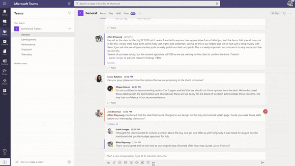

# Plantillas de aplicación para Microsoft Teams

Las plantillas de aplicación son aplicaciones preparadas para producción para Microsoft Teams controladas por la comunidad, de código abierto y disponibles en GitHub. Cada una contiene instrucciones detalladas para implementar e instalar esa aplicación para la organización, proporcionando una aplicación lista para usar que puedes instalar y empezar a usar inmediatamente. El código fuente completo también está disponible, por lo que puede explorarlo en detalle, o bifurcar el código y modificarlo para satisfacer sus necesidades específicas.

**&#9734; indica las plantillas de aplicación recién publicadas.**

### Ventajas clave

* **Experiencia de plug and play:** Todas las plantillas de aplicación incluyen scripts de implementaciones que le permitirán hospedar todos los servicios necesarios en Microsoft Azure. No se requiere codificación para implementar las aplicaciones.
* **Código listo para producción:** Las plantillas de aplicación se ajustan a los procedimientos recomendados en materia de seguridad e infraestructura, y se revisan todos los cambios enviados por la comunidad para garantizar una conformidad continua.
* **Personalizable y extensible:** Aunque todas las plantillas de aplicación están listas para implementarse tal como están, proporcionamos la base de código completa y los scripts de implementación para que puedas personalizarlas o ampliarlas fácilmente para adaptarlas a tus necesidades únicas.
* **Documentación detallada & soporte técnico:** Todas las plantillas de aplicación van acompañadas de documentación de un extremo a otro sobre la arquitectura de la solución, la implementación y los pasos de configuración. Los repositorios también se supervisan, así que informe de cualquier problema que encuentre generando un problema en GitHub.

## Administrador de citas &#9734;

El Administrador de citas es una plantilla de aplicación de Teams para ayudar a las empresas a crear, administrar y llevar a cabo citas virtuales con los consumidores a través de Teams. Las nuevas solicitudes de cita de los consumidores son visibles en los canales de Teams, donde se pueden asignar y reasignar rápidamente al personal de un equipo. Las solicitudes de cita se pueden ver en los niveles de equipo o personal a través de pestañas personalizadas. Cada cita está asociada a una reunión en línea de Teams, por lo que el personal y los consumidores pueden unirse fácilmente a la reunión en el momento programado.

La plantilla de aplicación se integra con Microsoft Bookings para facilitar la administración de citas. Las citas programadas aparecen automáticamente en los calendarios de los miembros del personal asignados, y los consumidores reciben avisos y notificaciones por correo electrónico personalizables con vínculos de reunión incrustados.

[Obtenerlo en GitHub](https://github.com/OfficeDev/microsoft-teams-apps-appointment-manager)

 

## Preguntar

Ask Away es un [bot de Microsoft Teams](../bots/what-are-bots.md) que permite a los usuarios llevar a cabo&A (preguntas y respuestas) dentro de Teams. Con el bot Ask Away, los miembros del equipo pueden enviar y votar preguntas compartidas por compañeros, lo que permite a los hosts de preguntas&A recopilar fácilmente preguntas de primer nivel dentro de un canal o chat. El bot puede usarse para llevar a cabo una pregunta en tiempo real&una sesión en una reunión de Teams y permite a los asistentes enviar preguntas en directo a través del chat.

[Obtenerlo en GitHub](https://github.com/OfficeDev/microsoft-teams-apps-askaway)

:::row:::
  :::column span="2":::
      
:::column-end:::
:::row-end:::

## Información de asociados

Associate Insights es una plantilla [de Power Apps](/powerapps/maker/canvas-apps/embed-teams-app) que permite a los trabajadores de primera línea capturar y enviar directamente la opinión, la opinión y la percepción de los clientes. Los trabajadores de primera línea suelen ser el primer representante de la compañía en interactuar con los clientes en un punto de contacto de uno a uno. Los equipos empresariales pueden compartir y usar los datos recopilados de forma colaborativa, por ejemplo, a través de una pestaña de Power BI Teams, para mejorar la experiencia del cliente y mejorar el producto.

[Obtenerlo en GitHub](https://github.com/OfficeDev/microsoft-teams-apps-associateinsights)

:::row:::
  :::column span="2":::
      
:::column-end:::
:::row-end:::
:::row:::
:::column span="2":::
    
:::column-end:::
:::row-end:::

## Asistencia

La aplicación Asistencia es una [pestaña de Power Apps](/powerapps/maker/canvas-apps/embed-teams-app) que se puede anclar en un equipo. Está diseñado para registrar la presencia, normalmente en configuraciones como entornos de aprendizaje y aprendizaje. Los usuarios pueden marcar o editar la asistencia hasta 30 días en el pasado y ver informes resumidos de asistencia para un grupo completo o asistentes individuales.

[Obtenerlo en GitHub](https://github.com/OfficeDev/microsoft-teams-apps-attendance)

## Libro a sala

Reservar una sala es un bot de [Microsoft Teams](../bots/what-are-bots.md) que permite a los usuarios buscar y reservar rápidamente una sala de reuniones durante 30 (valor predeterminado), 60 o 90 minutos a partir de la hora actual. El bot de libro a sala se incluye en las conversaciones personales o 1:1.

[Obtenerlo en GitHub](https://github.com/OfficeDev/microsoft-teams-apps-bookaroom)

## Acceso de creación

Building Access es una aplicación basada en Microsoft [Power Platform](https://powerapps.microsoft.com/blog/now-in-preview-customize-teams-with-built-in-power-platform-capabilities/)que admite la administración de umbrales de ocupación y normas de distanciamiento social al permitir a los directores de instalaciones administrar, realizar un seguimiento y notificar la presencia en el sitio de los empleados. La aplicación, creada con Microsoft [Power Apps](/powerapps/powerapps-overview)y [Power Automate,](/power-automate/getting-started)se integra profundamente con Microsoft Teams y permite a las organizaciones determinar la preparación de la creación, establecer criterios de elegibilidad para el acceso en el sitio y recopilar información para la planeación futura.

[Obtenerlo en GitHub](https://github.com/OfficeDev/microsoft-teams-apps-buildingaccess)

:::row:::
   :::column span="":::
     
   :::column-end:::
   :::column span="":::
      
   :::column-end:::
:::row-end:::

## Celebraciones

Celebraciones es una aplicación de Teams que ayuda a los integrantes del equipo a celebrar su cumpleaños, aniversarios y otros eventos periódicos. Recuerda ocasiones especiales de todos los miembros del equipo y envía un mensaje descriptivo en todos los equipos seleccionados en el momento de la creación del evento, para que los integrantes del equipo se sientan especiales en su día.

La aplicación proporciona una interfaz sencilla para que todos los miembros del equipo agreguen y visualmente sus eventos personalmente y también permite al usuario seleccionar los equipos en los que se comparten los eventos.

[Obtenerlo en GitHub](https://github.com/OfficeDev/microsoft-teams-celebrations-app)

## Lista de comprobación

Lista de comprobación es una aplicación de extensión de mensajería [personalizada](../messaging-extensions/what-are-messaging-extensions.md) de Microsoft Teams que le permite colaborar con su equipo mediante la creación de una lista de comprobación compartida en un chat o canal. La aplicación es compatible con todos los clientes de la plataforma teams (escritorio, explorador, iOS y Android) y está lista para su implementación como parte de su suscripción a Microsoft 365.  

[Obtenerlo en GitHub](https://github.com/OfficeDev/microsoft-teams-checklist-app )

:::row:::
:::column span="2":::
      
:::column-end:::
:::row-end:::

## Clase de &#9734;

Classroom Drop-in es una aplicación basada en Microsoft [Power Platform](https://powerapps.microsoft.com/blog/now-in-preview-customize-teams-with-built-in-power-platform-capabilities/)que permite a los líderes del sistema buscar equipos de clase (clases virtuales) y agregarse a sí mismos u otros a estos equipos de clase durante un período de entrega especificado, según sea necesario. La aplicación creada con Microsoft [Power Apps](/powerapps/powerapps-overview) y [Power Automate](/power-automate/getting-started)se integra profundamente con Microsoft Teams para garantizar que los centros educativos puedan optimizar sus operaciones en un entorno de aprendizaje híbrido proporcionando acceso a las partes interesadas relevantes para los equipos de clase por requisitos empresariales.

[Obtenerlo en GitHub](https://github.com/OfficeDev/microsoft-teams-apps-classroom-dropin)

## Comunicador de la empresa

La aplicación Communicator empresa permite a los equipos corporativos crear y enviar mensajes destinados a varios equipos o a un gran número de empleados a través del chat, lo que permite que la organización llegue a los empleados justo donde colaboran. Use esta plantilla para varios escenarios, como anuncios de nuevas iniciativas, incorporación de empleados, aprendizaje y desarrollo modernos o difusiones en toda la organización.

La aplicación proporciona una interfaz sencilla para que los usuarios designados creen, obtengan una vista previa, colaboren y envíen mensajes.

Proporciona una base para crear capacidades de comunicación personalizadas dirigidas, como telemetría personalizada, sobre cuántos usuarios han reconocido o interactuado con un mensaje.

[Obtenerlo en GitHub](https://github.com/OfficeDev/microsoft-teams-company-communicator-app)

## Búsqueda de grupo de contactos

La aplicación Búsqueda de grupos de contactos proporciona un enfoque práctico y útil para crear, obtener acceso y administrar los grupos de contactos de la organización (anteriormente conocidos como listas de distribución o grupos de comunicación). Los usuarios pueden ver y chatear rápidamente con miembros del grupo, ver el estado de los miembros y crear un chat en grupo con miembros seleccionados en el grupo de contactos, todo ello dentro del entorno de Teams.

[Obtenerlo en GitHub](https://github.com/OfficeDev/microsoft-teams-app-contactgrouplookup)

:::row:::
:::column span="2":::
      
:::column-end:::
:::row-end:::
:::row:::
:::column span="2":::
    
:::column-end:::
:::row-end:::

## Compañeros de trabajo &#9734;

Con la plantilla de reconocimiento de compañeros de trabajo en Microsoft Teams, los usuarios pueden reconocer los logros de sus compañeros en el contexto de Teams. Cuando los compañeros de trabajo seleccionan recompensar a un compañero, los destinatarios y otros miembros del equipo se etiquetan en una conversación de canal y reciben una notificación sobre los detalles de la distinción del canal. Las distinciones se registran en la aplicación teams, que es segura, portátil y fácil de compartir. Esto se puede considerar como la versión basada en PowerApps de la plantilla de aplicación Distintivos abiertos, con un marcador.

[Obtenerlo en GitHub](https://github.com/OfficeDev/microsoft-teams-apps-coworker-appreciation)

## CrowdSourcer

CrowdSourcer es un [bot de Microsoft Teams](../bots/what-are-bots.md) que proporciona a los equipos información consultada procedente de forma colaborativa de los miembros del grupo. Es una excelente manera de responder a las preguntas más frecuentes a la vez que permite a los participantes participar activamente y contribuir a un recurso de información divertido y útil.

[Obtenerlo en GitHub](https://github.com/OfficeDev/microsoft-teams-crowdsourcer-app)

## Adhesivos personalizados

La autoexpresión es fundamental para una cultura de equipo en buen estado. Esta plantilla de aplicación es una [extensión de mensajería](~/messaging-extensions/what-are-messaging-extensions.md) que permite a los usuarios usar adhesivos personalizados y GIF en Microsoft Teams. Esta plantilla proporciona una experiencia de configuración basada en web sencilla en la que cualquier usuario con acceso a la configuración puede cargar los GIF, adhesivos e imágenes que desean que tengan sus usuarios finales, lo que permite a todo el equipo usar cualquier conjunto de adhesivos que elija.

Esta aplicación también permite compartir fácilmente imágenes/GIF/adhesivos entre equipos sin necesidad de acceso a sitios de SharePoint o canales individuales como mecanismos de almacenamiento y uso compartido. Por ejemplo, los equipos de productos pueden compartir fácilmente imágenes de producto y ARCHIVOS GIF en redes sociales, equipos de marketing y ventas mediante programación. También se puede ampliar esta aplicación desencadenando un flujo de notificación a equipos o individuos específicos cuando hay nuevas imágenes o GIF disponibles.

[Obtenerlo en GitHub](https://github.com/OfficeDev/microsoft-teams-stickers-app)

## Ideas para empleados &#9734;

La aplicación Ideas para empleados es la versión de PowerApps de la plantilla de aplicación Great Ideas basada en Azure. La aplicación permite a los usuarios de Teams configurar y configurar una campaña de ideas. Una campaña de ideas es una categoría para agrupar ideas en torno a temas comunes.

Los usuarios de Teams también pueden realizar las siguientes actividades:
* Configura un formulario de envío estándar que los empleados necesitan enviar para cada idea. 
* Revisar y administrar las ideas y la lista de campañas.
* Modificar y eliminar campañas.
* Revisar los paneles de ideas principales.
* Vota y comparte ideas priorizadas.
* Enviar ideas para una campaña.
* Ver la idea de otro miembro del equipo.
* Vota sobre las ideas que más me gustaron.
* Revisa el rendimiento de sus ideas en comparación con otras personas dentro de una campaña.

[Obtenerlo en GitHub](https://github.com/OfficeDev/microsoft-teams-apps-employeeideas)

 

## E-Prescriptions 

E-Prescriptions es una aplicación basada en [Power Apps](/powerapps/maker/canvas-apps/embed-teams-app)que mejora la salud virtual y la salud virtual mediante la automatización del proceso de emisión de e-prescriptions a los pacientes. Los profesionales médicos pueden revisar rápidamente las citas, generar e-prescriptions y enviar correos electrónicos con datos adjuntos de la receta electrónica a los pacientes directamente dentro de la plataforma de Teams.

[Obtenerlo en GitHub](https://github.com/OfficeDev/microsoft-teams-apps-eprescription) 

:::row:::
:::column span="2":::
      
:::column-end:::
:::row-end:::
:::row:::
:::column span="2":::
    
:::column-end:::
:::row-end:::

## Formación para empleados 

La formación de los empleados es una aplicación de Microsoft Teams que permite a los organizadores publicar, realizar un seguimiento y promover fácilmente eventos de aprendizaje y aprendizaje para su organización.  Con la aplicación, los organizadores de eventos pueden enviar avisos y notificaciones a los registradores de eventos y los empleados pueden indicar interés en los próximos eventos, mantenerse actualizados sobre los eventos actuales y compartir detalles de eventos con compañeros a través de la extensión de mensajería de Teams.

[Obtenerlo en GitHub](https://github.com/OfficeDev/microsoft-teams-apps-employeetraining)

:::row:::
:::column span="2":::
    **Ver eventos de aprendizaje de empleados**   
:::column-end:::
:::row-end:::
:::row:::
:::column span="2":::
    **Crear un evento de aprendizaje para empleados** 
:::column-end:::
:::row-end:::

## Buscador de expertos

Expert Finder es un [bot de Microsoft Teams](../bots/what-are-bots.md) que identifica a miembros específicos de la organización en función de sus habilidades, intereses y atributos educativos. Los miembros buscan expertos dentro de una organización que coinciden con una búsqueda de palabras clave de perfiles de usuario de Azure Active Directory.

[Obtenerlo en GitHub](https://github.com/OfficeDev/microsoft-teams-apps-expertfinder)

## Preguntas más frecuentes Plus

Las preguntas conversacionales&Bots A son una forma sencilla de proporcionar respuestas a las preguntas más frecuentes de los usuarios. Sin embargo, la mayoría de los bots no interactúan con los usuarios de manera significativa porque no hay ninguna persona en el bucle cuando se produce un error en el bot. Faq bot is a friendly Q&A bot that brings a human in the loop when it is unable to help. Se puede hacer una pregunta al bot y el bot responde con una respuesta si está contenido en la base de conocimientos. Si no es así, el bot permite al usuario enviar una consulta que, a continuación, se publica en un equipo preconfigurado de expertos que ayudan a proporcionar soporte actuando sobre las notificaciones desde dentro del propio equipo.

> [!NOTE]
> La versión más reciente de **FAQ Plus** admite las preguntas&A, ya que permite a un equipo de expertos completar lo siguiente:
>
> &#x2714; agregar nuevas preguntas&como directamente a knowledge base mediante extensiones de mensaje.
>
> &#x2714; editar y eliminar preguntas&pares A agregados por un bot.
>
> &#x2714; seguimiento del historial de revisiones de las preguntas&as.
>
> &#x2714; configurar una respuesta con detalles adicionales para mostrar como una [tarjeta adaptable.](../task-modules-and-cards/cards/cards-reference.md#adaptive-card)
>
[Obtenerlo en GitHub](https://github.com/OfficeDev/microsoft-teams-apps-faqplusv2)

## Rastreador de objetivos

La aplicación Rastreador de objetivos es una solución completa para que su organización admita el establecimiento de objetivos, el progreso y el reconocimiento del éxito en Microsoft Teams. La aplicación permite a los usuarios establecer, realizar un seguimiento y actualizar los objetivos en un nivel profesional, personal y de equipo. Los miembros del equipo también reciben avisos y actualizaciones de estado a tiempo para mantenerse centrados y mantenerse al día.

[Obtenerlo en GitHub](https://github.com/OfficeDev/microsoft-teams-app-goaltracker)

:::row:::
  :::column span="2":::
      
:::column-end:::
:::row-end:::
:::row:::
:::column span="2":::
    
:::column-end:::
:::row-end:::

## Ideas excelentes

La aplicación Great Ideas admite y fomenta la innovación y la creatividad dentro de la organización. La aplicación permite a los empleados compartir ideas con compañeros y líderes, descubrir nuevos envíos, destacar contribuciones para la consideración del mismo nivel y emitir su voto a favor de las mejores propuestas dentro de Microsoft Teams.

[Obtenerlo en GitHub](https://github.com/OfficeDev/microsoft-teams-apps-greatideas)

:::row:::
  :::column span="2":::
      
:::column-end:::
:::row-end:::
:::row:::
:::column span="2":::
    
:::column-end:::
:::row-end:::

## Actividades de grupo

Actividades de grupo es una aplicación de Microsoft Teams que facilita a los propietarios del equipo la creación rápida de grupos de actividades y la administración de flujos de trabajo de colaboración en el contexto de Microsoft Teams. Los autores de actividades están habilitados para crear actividades, distribuir aleatoriamente a los miembros del equipo en grupos y, opcionalmente, hacer que el bot envíe avisos hasta que se completen las actividades.

[Obtenerlo en GitHub](https://github.com/OfficeDev/microsoft-teams-apps-groupactivities)

:::row:::
  :::column span="2":::
      
:::column-end:::
:::row-end:::
:::row:::
:::column span="2":::
    
:::column-end:::
:::row-end:::

## Hacer crecer tus habilidades

La aplicación Grow Your Skills admite el crecimiento y el desarrollo profesional al permitir que los empleados contribuyan a proyectos complementarios para tu organización mientras se aprende nuevas habilidades al mismo tiempo. Los empleados pueden usar la aplicación para buscar oportunidades que satisfagan sus intereses, disfrutar de una colaboración significativa con compañeros y adquirir nuevos niveles de experiencia y capacidades, todo ello dentro del entorno de Teams.

[Obtenerlo en GitHub](https://github.com/OfficeDev/microsoft-teams-apps-growyourskills)

:::row:::
  :::column span="2":::
      
:::column-end:::
:::row-end:::
:::row:::
:::column span="2":::
    
:::column-end:::
:::row-end:::

## Soporte de Recursos Humanos

El bot de soporte técnico de RECURSOS humanos es una pregunta&un bot que pone en marcha a un profesional o experto de soporte técnico del equipo de recursos humanos cuando no puede ayudar. Se puede hacer una pregunta al bot y el bot responde con una respuesta si está contenido en la base de conocimientos. Si no es así, el bot permite al usuario enviar una consulta que, a continuación, se publica en un equipo preconfigurado de expertos que son de ayuda para proporcionar soporte al actuar sobre las notificaciones desde dentro de su propio equipo. Además, el bot sugiere vínculos a preguntas y directivas de RECURSOS humanos recomendadas mediante la búsqueda de etiquetas preconfiguradas en la pregunta. Estos iconos también se pueden encontrar en la pestaña asociada como referencia rápida. El soporte técnico de RECURSOS humanos funciona bien para QnA ligero y para proporcionar soporte rápido al iniciar nuevos proyectos o iniciativas en la organización.

[Obtenerlo en GitHub](https://github.com/OfficeDev/microsoft-teams-hrsupport-app)

## Rompehielo

Icebreaker es un bot de [Microsoft Teams](../bots/what-are-bots.md) que ayuda a su equipo a acercarse al emparejar a dos miembros aleatorios del equipo cada semana para reunirse. El bot facilita la programación al sugerir automáticamente horas libres que funcionen para ambos miembros. Refuerza las conexiones personales y crea una comunidad estrechamente apretada con esta aplicación.

Además de fomentar las conexiones personales en todo el equipo, la aplicación Icebreaker puede ayudar a desarrollar comunidades basadas en intereses dentro de la organización. Por ejemplo, puedes usar esta aplicación para un grupo de interés de DevOps para ayudar a que las ideas y los procedimientos recomendados se extienda de forma orgánica en toda la organización.

[Obtenerlo en GitHub](https://github.com/OfficeDev/microsoft-teams-icebreaker-app)

## Incentivos

Incentivos es una [plantilla de Power Apps](/powerapps/maker/canvas-apps/embed-teams-app) que administra y realiza un seguimiento de la participación de los empleados incentivos en actividades designadas, como cursos e iniciativas de administración de cambios. Los administradores usan la aplicación para establecer actividades designadas, asignar puntos para su finalización y especificar los niveles de puntos de elegibilidad necesarios para las recompensas. Los empleados usan la aplicación para ver sus puntos acumulados y, al alcanzar la elegibilidad, solicitar y reclamar recompensas canjeables.

[Obtenerlo en GitHub](https://github.com/OfficeDev/microsoft-teams-apps-incentives)

## Incident Reporter

Incident Reporter es un [bot de Microsoft Teams](../bots/what-are-bots.md)  que optimiza la administración de incidentes en su organización. El bot facilita la recopilación automatizada de datos de incidentes, informes de incidentes personalizados, notificaciones relevantes para las partes interesadas y seguimiento de incidentes de un extremo a otro.

[Obtenerlo en GitHub](https://github.com/OfficeDev/microsoft-teams-apps-incidentreport)

:::row:::
  :::column span="2":::
      
:::column-end:::
:::row-end:::
:::row:::
:::column span="2":::
    
:::column-end:::
:::row-end:::

## Inspección &#9734;

 La inspección es una aplicación de Microsoft Teams que permite a los trabajadores de primera línea inspeccionar cualquier cosa, desde ubicaciones hasta activos y equipos. Por ejemplo, una tienda comercial, una fábrica de fabricación o vehículos y máquinas. Hay dos aplicaciones en esta solución, cada una destinada a distintos tipos de usuarios.

La aplicación permite a los trabajadores de primera línea inspeccionar un activo o área, administrar la calidad de productos y servicios o mantener la seguridad en el lugar de trabajo. Facilita la comunicación entre los miembros del equipo para solucionar los problemas encontrados durante la inspección. La aplicación proporciona informes sencillos a los administradores para acelerar la resolución de problemas y resaltar tendencias.

[Obtenerlo en GitHub](https://github.com/OfficeDev/microsoft-teams-apps-inspection)

   

## Informes de problemas &#9734;

La aplicación De informes de problemas permite a los empleados y administradores generar y administrar problemas. Consta de dos aplicaciones: aplicación de informes de problemas para informar de problemas y aplicación Administrar problemas para administrar problemas.

Los administradores del equipo usan la aplicación Administrar problemas para configurar la experiencia de la aplicación, incluido el canal en el que la aplicación crea los mensajes de Microsoft Teams y las tareas de Planner. Los administradores también usan la aplicación para crear formularios de plantilla para recopilar detalles cuando un usuario informa de un problema. Por ejemplo, revisar, editar o eliminar formularios de plantilla de problema. La aplicación también se puede usar para revisar los problemas del equipo, informar sobre el historial de problemas y administrar de forma eficaz la resolución de problemas.

Los empleados usan la aplicación De informes de problemas para registrar problemas y detalles necesarios para resolverlos. La aplicación también se usa para modificar y resolver problemas existentes y obtener una vista de alto nivel de problemas individuales o de equipo.

[Obtenerlo en GitHub](https://github.com/OfficeDev/microsoft-teams-apps-issuereporting)

  

## Incorporación de nuevos empleados 

La incorporación de nuevos empleados es una solución integrada de incorporación de nuevos empleados de Microsoft Teams y [SharePoint](https://lookbook.microsoft.com/details/75e60a32-9849-4ed4-b83e-b2b08983ad19) que permite a su organización proporcionar una experiencia de incorporación coherente y de alta calidad para los empleados en su viaje de nuevos empleados. Los equipos de recursos humanos y los administradores de contratación pueden usar la aplicación para proporcionar información relevante durante todo el proceso de orientación y orientación, así como para que los nuevos empleados compartan comentarios, proporcionen introducciones y completen las tareas de incorporación.

[Obtenerlo en GitHub](https://github.com/OfficeDev/microsoft-teams-apps-newemployeeonboarding)

:::row:::
  :::column span="2":::
    **Tarjeta de bienvenida de nuevo empleado** 
:::column-end:::
:::row-end:::
:::row:::
:::column span="2":::
    **Lista de comprobación de nuevos empleados**   
:::column-end:::
:::row-end:::

## Distintivos abiertos

Open Badges es una aplicación de Microsoft Teams que permite a los usuarios obtener distintivos de credenciales de aprendizaje digital en el contexto de Teams y compartirlos en todas partes. Con las funcionalidades de la autoridad emisora de distintivos digitales de terceros, [Badgr](https://badgr.org/), los distintivos concedidos se registran en el perfil Badgr de un destinatario y están disponibles para crear y compartir una imagen enriquecida de los recorridos de aprendizaje de toda la vida.

[Obtenerlo en GitHub](https://github.com/OfficeDev/microsoft-teams-apps-openbadges)

:::row:::
  :::column span="2":::
      
:::column-end:::
:::row-end:::
:::row:::
:::column span="2":::
    
:::column-end:::
:::row-end:::

## Sondeo 

El sondeo es una aplicación de extensión de mensajería personalizada de Microsoft [Teams](../messaging-extensions/what-are-messaging-extensions.md) que le permite crear y enviar rápidamente sondeos en un chat o un canal para recopilar opiniones y preferencias del equipo. La aplicación es compatible con todos los clientes de la plataforma teams (escritorio, explorador, iOS y Android) y está lista para su implementación como parte de su suscripción a Microsoft 365.

[Obtenerlo en GitHub](https://github.com/OfficeDev/microsoft-teams-poll-app)

:::row:::
  :::column span="1":::
      
:::column-end:::
:::row-end:::

## Respuestas rápidas

Respuestas rápidas es una aplicación de Microsoft Teams que ofrece una solución sólida para responder eficazmente a las preguntas más frecuentes (PREGUNTAS FRECUENTES) de los usuarios. En lugar de responder a cada consulta de forma manual y continua, la aplicación compilará una biblioteca de respuestas para una experiencia de usuario interactiva a través de extensiones de [mensajería de](../messaging-extensions/what-are-messaging-extensions.md)Teams.

[Obtenerlo en GitHub](https://github.com/OfficeDev/microsoft-teams-apps-quickresponses)

## Asistencia rápida &#9734;

Asistencia rápida es una aplicación basada en Microsoft [Power Platform](https://powerapps.microsoft.com/blog/now-in-preview-customize-teams-with-built-in-power-platform-capabilities/) que permite a los asociados orientados al cliente conectarse rápidamente con los expertos para obtener respuestas rápidas, buscar información, hacer un seguimiento de las solicitudes abiertas y permitir que los expertos reciban notificaciones para recibir rápidamente una llamada para ayudar a responder preguntas. La aplicación creada con Microsoft [Power Apps](/powerapps/powerapps-overview) y [Power Automate](/power-automate/getting-started)se integra profundamente con Microsoft Teams para permitir que las organizaciones conecten fácilmente a los trabajadores de primera línea con enlaces corporativos para resolver las consultas de los clientes y ofrecer una experiencia de cliente excelente. 

[Obtenerlo en GitHub](https://github.com/OfficeDev/microsoft-teams-apps-rapid-assist)

:::row:::
   :::column span="":::
     
   :::column-end:::
   :::column span="":::
      
   :::column-end:::
:::row-end:::

## Reflejar 

Reflect es una aplicación de extensión de mensajería personalizada de Microsoft [Teams](../messaging-extensions/what-are-messaging-extensions.md) que proporciona un recurso seguro e inclusivo para que los miembros del equipo compartan el estado de su bienestar emocional con compañeros o líderes de grupo directamente dentro de Teams. La aplicación está disponible en chats de canal, grupo, reunión y 1:1, y la respuesta de la comprobación puede establecerse en pública, privada a remitente o totalmente anónima.

[Obtenerlo en GitHub](https://github.com/OfficeDev/Microsoft-Teams-App-Reflect)

:::row:::
    :::column:::
    **Sondeo de buen estado**
    
    
    :::column-end:::
:::row-end:::

## Soporte remoto

El soporte remoto es un [bot de Microsoft Teams](../bots/what-are-bots.md) que proporciona una interfaz centrada entre los solicitantes de soporte técnico de toda la organización y el equipo de soporte interno.  Los usuarios finales pueden enviar, editar o retirar solicitudes de soporte técnico y el equipo de soporte técnico puede responder, administrar y actualizar solicitudes en la plataforma de Teams.

[Obtenerlo en GitHub](https://github.com/OfficeDev/microsoft-teams-apps-remotesupport)

:::row:::
  :::column span="2":::
      
:::column-end:::
:::row-end:::
:::row:::
:::column span="2":::
    
:::column-end:::
:::row-end:::

## Request-a-team

Request-a-team es una aplicación de Microsoft Teams que optimiza la creación de nuevos equipos para su organización empresarial. La aplicación admite la normalización y los procedimientos recomendados al crear nuevas instancias de equipo mediante la integración de un formulario de solicitud guiado por el asistente, un proceso de aprobación incrustado, un panel de estado de solicitud y compilaciones automatizadas del equipo.

[Obtenerlo en GitHub](https://github.com/OfficeDev/microsoft-teams-apps-requestateam)

:::row:::
  :::column span="2":::
    
:::column-end:::
:::row-end:::
:::row:::
:::column span="2":::
    
:::column-end:::
:::row-end:::

## Scrums para canales

Scrums para canales es una aplicación de asistente de scrum que permite a los usuarios programar y ejecutar scrums en canales de Microsoft Teams. La aplicación es ideal para equipos remotos y equipos formados por miembros de diversas ubicaciones geográficas y zonas horarias para compartir actualizaciones diarias y garantizar la participación en reuniones de soporte de scrum.

[Obtenerlo en GitHub](https://github.com/OfficeDev/microsoft-teams-apps-scrumsforchannels)

> [!NOTE]
> Para llevar a cabo reuniones de scrum en un chat en grupo, consulte nuestra plantilla de [aplicación Scrums para chat](#scrums-for-group-chat) en grupo.

:::row:::
  :::column span="2":::
    
:::column-end:::
:::row-end:::
:::row:::
:::column span="2":::
    
:::column-end:::
:::row-end:::

## Scrums para chat en grupo

> [!NOTE]
> La plantilla de aplicación Estado de Scrums se ha actualizado y ahora es Scrums para chat en grupo.

Scrums para chat en grupo es un ayudante de scrum de apoyo que permite a los miembros del chat grupal ejecutar reuniones de pie asincrónicas y compartir fácilmente sus actualizaciones diarias. Permite a todos los miembros del chat de grupo contribuir al scrum y ver las actualizaciones realizadas por otros usuarios en el scrum en ejecución.

[Obtenerlo en GitHub](https://github.com/OfficeDev/microsoft-teams-apps-scrumsforgroupchat)

## Compartir ahora 

La aplicación Compartir ahora promueve el intercambio positivo de información entre compañeros al permitir que los usuarios compartan fácilmente contenido dentro del entorno de Teams. Los usuarios interactúan con la aplicación para compartir elementos de interés con los miembros del equipo, descubrir nuevo contenido compartido, establecer preferencias y marcar favoritos para su posterior lectura.

[Obtenerlo en GitHub](https://github.com/OfficeDev/microsoft-teams-apps-sharenow)

## Búsqueda de lista de SharePoint

La colaboración en Microsoft Teams suele hacer referencia a la información contenida en los elementos de una lista de SharePoint. Simplemente pegar un vínculo al elemento en cuestión obliga a todos a cambiar el contexto de la conversación, buscar la información necesaria y, a continuación, volver a Teams para continuar la conversación. A medida que continúa la conversación, normalmente los usuarios tendrán que volver al elemento de referencia varias veces para comprobar los nuevos comentarios y actualizar sus comentarios de la información contenida en el elemento. Este cambio de contexto crea una barrera para una colaboración fluida y es una receta para las cosas que se atraviesan por las fisuras.

Para ayudar a mitigar este problema, estamos encantados de traerle la plantilla de aplicación Búsqueda de lista. Millones de usuarios usan SharePoint para crear algunos de los flujos de trabajo principales de sus organizaciones. Sin embargo, la colaboración en las listas puede ser especialmente tediosa. Con la plantilla de aplicación Búsqueda de lista en Microsoft Teams, los usuarios pueden insertar información de elementos de lista de SharePoint directamente dentro de una conversación de chat para aliviar el cambio de contexto causado al insertar simplemente un vínculo en un chat. La información se inserta como una tarjeta con formato automático fácil de leer, lo que ayuda a los usuarios a mantener la participación en la conversación.

[Obtenerlo en GitHub](https://github.com/OfficeDev/microsoft-teams-list-search-app)

## Check-ins del personal

Las protección del personal son una aplicación basada en [Power Apps](/powerapps/powerapps-overview)que permite la comunicación de supervisión entre su empresa y el personal de campo. El personal puede proporcionar fácilmente información crítica y actualizaciones de estado de forma programada o ad-hoc directamente desde Teams. La aplicación admite la ubicación en tiempo real, fotos y notas, así como notificaciones de aviso y flujos de trabajo automatizados.

[Obtenerlo en GitHub](https://github.com/OfficeDev/microsoft-teams-apps-staffcheckins)

## Encuesta

La encuesta es una aplicación personalizada de extensión de mensajería de Microsoft [Teams](../messaging-extensions/what-are-messaging-extensions.md) que le permite crear una encuesta en un chat o un canal para recopilar datos y obtener información que se puede realizar.  La aplicación es compatible con todos los clientes de la plataforma teams (escritorio, explorador, iOS y Android) y está lista para su implementación como parte de su suscripción a Microsoft 365.  

[Obtenerlo en GitHub](https://github.com/OfficeDev/Microsoft-Teams-Survey-app)

:::row:::
  :::column span="2":::
    
:::column-end:::
:::row-end:::

## Redondear virtual &#9734;

Los proveedores de hospitales y de servicios de emergencia hacen decenas y, a menudo, cientos de "rondas" por día. Estos rápidos check-ins en pacientes están pensados para proporcionar una comprobación del estado del paciente y garantizar que se aborde la preocupación del paciente. Aunque el redondeo es una práctica esencial para garantizar que varios tipos de proveedores supervisan a los pacientes, representan una gran purga en PPE, ya que para cada visita, de cada proveedor, se debe usar una nueva máscara y un nuevo conjunto de ingredientes. Con estas plantillas de aplicación, los trabajadores médicos pueden realizar fácilmente rondas virtualmente, a través de una reunión de Microsoft Teams entre el proveedor y el paciente.

También se hace referencia a la solución virtual de redondeo en la entrada del [blog](https://aka.ms/teamsvirtualrounding)Microsoft Health and LifeLogic .

[Obtenerlo en GitHub](https://github.com/SmartterHealth/Virtual-Rounding)

## Administración de visitantes

La aplicación Administración de visitantes permite a su organización y a los empleados administrar de forma sencilla y eficaz el proceso de visitantes en el sitio, directamente desde Microsoft Teams. La aplicación permite a los empleados crear solicitudes de visitantes, realizar un seguimiento centralizado de un estado de solicitud a través del panel de visitantes y recibir notificaciones en tiempo real cuando llega un visitante.

[Obtenerlo en GitHub](https://github.com/OfficeDev/microsoft-teams-app-visitormanagement)

:::row:::
  :::column span="2":::
    
:::column-end:::
:::row-end:::
:::row:::
:::column span="2":::
    
:::column-end:::
:::row-end:::

## Workplace Awards

Workplace Workplace Workplace es una plantilla de aplicación de Teams que proporciona un marco positivo para fomentar el reconocimiento y fomentar la cultura de compromiso de los empleados en el lugar de trabajo moderno. La aplicación te permite configurar y administrar un programa de reconocimiento y recompensas para empleados (R&R) en el que los empleados pueden designar y apoyar fácilmente a los compañeros y el líder de R&R puede ver las nominaciones enviadas, conceder distinciones y anunciar destinatarios.

[Obtenerlo en GitHub](https://github.com/OfficeDev/microsoft-teams-apps-workplaceawards)

:::row:::
  :::column span="2":::
    
:::column-end:::
:::row-end:::
:::row:::
:::column span="2":::
    
:::column-end:::
:::row-end:::

¿Tienes una idea de una plantilla de aplicación que te gustaría ver? [Háganoslo saber.](https://forms.office.com/Pages/ResponsePage.aspx?id=v4j5cvGGr0GRqy180BHbR2_7qFm_lcZAr4eqEhnLsZ9UMVZGT1lCT0FXUDdZMUM0RkpBS1BESTAwWC4u)
