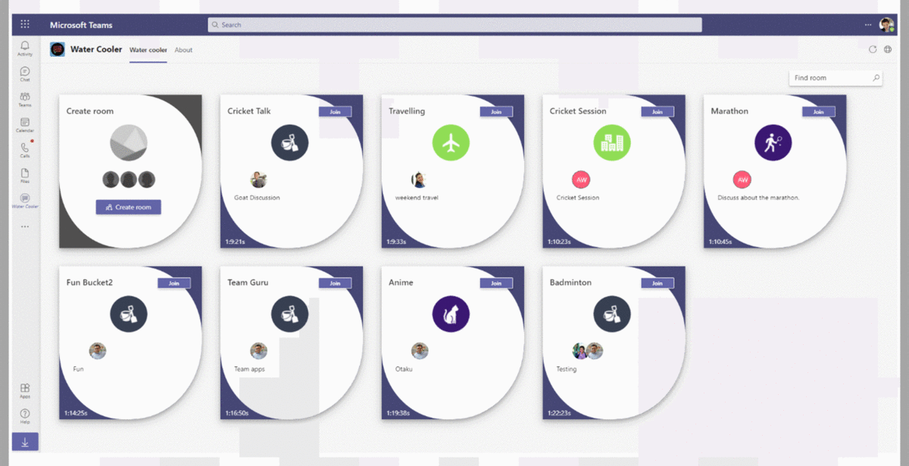
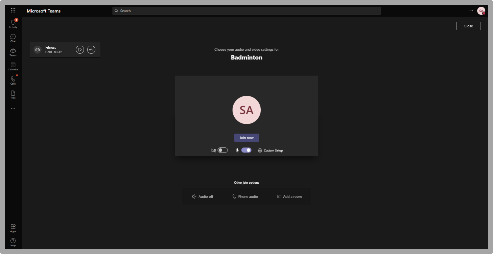
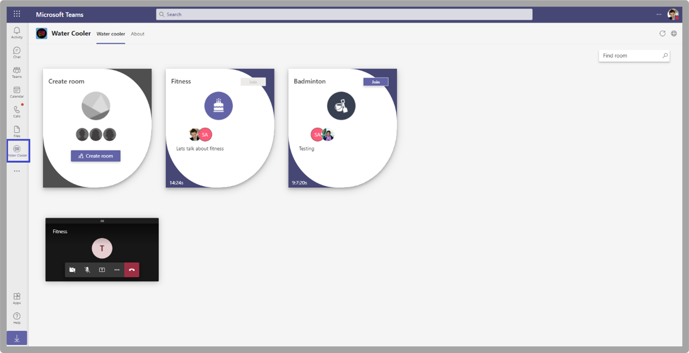

# Plantillas de aplicaciones para Microsoft TeamsApp templates for Microsoft Teams

Las plantillas de aplicación son ejemplos de aplicaciones completas para Microsoft Teams que son de código abierto y están disponibles en GitHub.App templates are examples of complete apps for Microsoft Teams that are open-source and available on GitHub. Cada plantilla de aplicación contiene instrucciones detalladas para implementar e instalar esa aplicación para la organización.Each app template contains detailed instructions for deploying and installing that app for your organization. También proporciona una aplicación de ejemplo que puedes instalar y empezar a usar inmediatamente.It also provides a sample app that you can install and start using immediately. El código fuente completo también está disponible, lo que le permite explorarlo en detalle o bifurcar el código y modificarlo para satisfacer sus requisitos específicos.The complete source code is also available, which allows you to explore it in detail or fork the code and alter it to meet your specific requirements.
Todas las plantillas de aplicación se proporcionan en los términos [de licencia mit.](https://github.com/OfficeDev/microsoft-teams-apps-eprescription/blob/master/LICENSE)All app templates are provided under the [MIT License](https://github.com/OfficeDev/microsoft-teams-apps-eprescription/blob/master/LICENSE) terms.

> [!NOTE] 
> Debes licenciar y admitir aplicaciones creadas a partir de plantillas de aplicación para tus usuarios y organizaciones.You must license and support apps created from app templates for your users and organizations.

**&#9734; indica las plantillas de aplicación recién publicadas.****&#9734; Indicates newly released app templates.**

### Ventajas claveKey benefits

* **Implemente directamente en la nube:** Todas las plantillas de aplicación incluyen scripts de implementación que te permiten hospedar todos los servicios necesarios en Microsoft Azure o en power platform.**Deploy directly to the cloud:** All app templates include deployment scripts that allows you to host all required services in Microsoft Azure or the Power Platform. 
* **Código de ejemplo recomendado:** Las plantillas de la aplicación se ajustan a los procedimientos recomendados en materia de seguridad e infraestructura.**Recommended sample code:** The app templates conform to recommended best practices around security and infrastructure. Se revisan todos los cambios enviados por la comunidad a las plantillas de la aplicación para garantizar la conformidad.All community submitted changes to the app templates are reviewed to ensure conformance.
* **Personalizable y extensible:** Aunque todas las plantillas de aplicación se implementan con una configuración mínima, se proporcionan todos los scripts de implementación y base de código completos, para que puedas personalizarlas o ampliarlas fácilmente para que se ajusten a tus necesidades únicas.**Customizable and extensible:** While all app templates are deployed with minimal configuration, the entire code base and deployment scripts are provided, so that you can easily customize or extend them to fit your unique needs.
* **Documentación detallada:** Todas las plantillas de aplicación van acompañadas de documentación completa sobre los pasos de configuración, implementación y arquitectura de soluciones.**Detailed documentation:** All app templates are accompanied by end-to-end documentation on solution architecture, deployment, and configuration steps.  

## Bot de adopciónAdoption Bot 

Bot de adopción es un bot de chat de atención al usuario creado con Power Virtual Agent para Teams PVA.Adoption Bot is a user care chat bot built with Power Virtual Agent for Teams PVA. Se considera como la versión PVA de FAQ Plus.It is considered as the PVA version of FAQ Plus. Bot de adopción responde a más de 100 preguntas comunes sobre Microsoft 365 y Teams.Adoption Bot answers 100+ common questions about Microsoft 365 and Teams. Puede editar los temas existentes, agregar sus propios temas e ingerir preguntas frecuentes existentes.You can edit the existing topics, add your own topics, and ingest existing FAQs. Si los usuarios necesitan ayuda adicional, el Bot de adopción puede conectarlos a expertos o incluso extenderse para abrir vales de servicio con conectores de flujo premium.If users need additional help, Adoption Bot can connect them to experts or even be extended to open service tickets with premium flow connectors. Este bot se instala automáticamente o se basa en una aplicación personalizada, como el Centro [de adopción.](https://github.com/akporzondek/adoption_hub)This bot is self-installed or built into a custom app, such as the [Adoption Hub](https://github.com/akporzondek/adoption_hub).

[Obtenerlo en GitHubGet it on GitHub](https://github.com/OfficeDev/microsoft-teams-apps-adopt-bot)

## Herramienta de adopción: plataforma de administración de campeones &#9734;Adoption Tool- Champion Management Platform &#9734;

La plantilla de aplicación Champion Management Platform (CMP) te ayuda a administrar, escalar e inspirar a los campeones del trabajo en equipo para lograr más.The Champion Management Platform (CMP) app template helps you manage, scale, and inspire your teamwork champions to achieve more. Esta plantilla de aplicación se basa en el SharePoint Framework y se carga en una pestaña dentro de un equipo.This app template is built on the SharePoint Framework and loaded into a tab within a team. Los grupos pueden aprovechar esta herramienta para ayudar a administrar la pertenencia al programa, proporcionar una tabla de clasificación y tipos de eventos para el registro y herramientas para superponer distintivos digitales a los participantes del programa.Groups can leverage this tool to help manage program membership, provide a leaderboard and event types for logging, and tools to overlay digital badges to program participants.

[Obtenerlo en GitHubGet it on GitHub](https://github.com/OfficeDev/microsoft-teams-apps-champion-management)

## Herramienta de adopción: Microsoft 365 Learning rutas de acceso (Introducción) &#9734;Adoption Tool- Microsoft 365 Learning Pathways (Get Started) &#9734;

La Introducción de aplicación te permite aportar la potencia de las Microsoft 365 de aprendizaje dentro de Microsoft Teams.The Get Started app template allows you to bring the power of Microsoft 365 learning pathways inside of Microsoft Teams. Esta plantilla de aplicación te permite conceder un acceso fácil a páginas de aprendizaje específicas u otros activos de intranet y cargar el contenido directamente dentro de Teams.This app template allows you to grant easy access to specific training pages or other intranet assets and load the content directly within Teams. También puedes cambiar el nombre o el logotipo de la aplicación para que coincida con la personalción de marca de tu empresa.You can also change the app name or logo to match your company branding.

[Obtenerlo en GitHubGet it on GitHub](https://github.com/msft-teams/tools/tree/master/M365%20Learning%20Pathways)

## Administrador de citasAppointment Manager 

Appointment Manager es una plantilla Teams aplicación para ayudar a las empresas a crear, administrar y llevar a cabo citas virtuales con los consumidores a través de Teams.Appointment Manager is a Teams app template to help businesses create, manage, and conduct virtual appointments with consumers through Teams. Las nuevas solicitudes de cita de los consumidores están visibles en Teams canales, donde se asignan y reasignan rápidamente al personal de un equipo.New appointment requests from consumers are visible in Teams channels, where they are quickly assigned and reassigned to staff in a team. Las solicitudes de cita se ven en niveles de equipo o personales a través de pestañas personalizadas.Appointment requests are viewed at team or personal levels through custom tabs. Cada cita está asociada a una Teams en línea, por lo que el personal y los consumidores pueden unirse fácilmente a la reunión en el momento programado.Every appointment is associated with a Teams online meeting, hence the staff and consumers can easily join the meeting at the scheduled time.

La plantilla de aplicación se integra con Microsoft Bookings para facilitar la administración de citas.The app template integrates with Microsoft Bookings for easy appointment management. Las citas programadas aparecen automáticamente en los calendarios de los miembros del personal asignados y los consumidores reciben notificaciones y avisos de correo electrónico personalizables con vínculos de reunión incrustados.Scheduled appointments automatically appear on assigned staff members' calendars, and consumers receive customizable email notifications and reminders with embedded meeting links.

[Obtenerlo en GitHubGet it on GitHub](https://github.com/OfficeDev/microsoft-teams-apps-appointment-manager)

 

## Preguntar fueraAsk Away

Ask Away es un [bot Microsoft Teams](../bots/what-are-bots.md) que permite a los usuarios realizar preguntas y respuestas, denominadaS&sesiones A dentro de Teams.Ask Away is a [Microsoft Teams bot](../bots/what-are-bots.md) that enables users to conduct Question and Answer, called Q&A sessions within Teams. Con el bot Preguntar, los miembros del equipo pueden enviar y votar por arriba preguntas compartidas por compañeros, lo que permite que los hosts de preguntas&A recopile fácilmente las preguntas más importantes dentro de un canal o chat.Using the Ask Away bot, team members can submit and up-vote questions shared by colleagues allowing Q&A hosts to easily gather top-of-mind questions within a channel or chat. El bot se usa para realizar una sesión de preguntas en tiempo real&Una sesión en una reunión de Teams y permite a los asistentes enviar preguntas en directo a través del chat.The bot is used to conduct a real-time Q&A session in a Teams meeting and allows attendees to submit questions live through chat.

[Obtenerlo en GitHubGet it on GitHub](https://github.com/OfficeDev/microsoft-teams-apps-askaway)

:::row:::
  :::column span="2":::
      
:::column-end:::
:::row-end:::

## Información de asociadosAssociate Insights

Associate Ideas es una [plantilla Power Apps](/powerapps/maker/canvas-apps/embed-teams-app) que permite a los trabajadores de primera línea capturar y enviar directamente la opinión, el sentimiento y la percepción del cliente.Associate Insights is a [Power Apps](/powerapps/maker/canvas-apps/embed-teams-app) template that empowers firstline workers to directly capture and submit customer opinion, sentiment, and perception. Los trabajadores de primera línea suelen ser el primer representante de la compañía en interactuar con los clientes en un punto a uno de contacto.Firstline workers are often the first company representative to engage with customers in a one-to-one point-of contact. Los equipos empresariales comparten y usan los datos recopilados de forma colaborativa, como a través de una pestaña Power BI Teams, para mejorar el producto y mejorar la experiencia del cliente.The collected data are shared and used collaboratively by business teams, such as through a Power BI Teams tab, for product improvement and enhancing the customer experience.

[Obtenerlo en GitHubGet it on GitHub](https://github.com/OfficeDev/microsoft-teams-apps-associateinsights)

:::row:::
  :::column span="2":::
      
:::column-end:::
:::row-end:::
:::row:::
:::column span="2":::
    
:::column-end:::
:::row-end:::

## AsistenciaAttendance

La aplicación Asistencia es una [Power Apps](/powerapps/maker/canvas-apps/embed-teams-app) que se ancla en un equipo.The Attendance app is a [Power Apps](/powerapps/maker/canvas-apps/embed-teams-app) tab that are pinned in a team. Está diseñado para registrar la presencia en configuraciones, como entornos de aprendizaje y aprendizaje.It is designed to record presence in settings, such as learning and training environments. Los usuarios pueden marcar o editar la asistencia durante un máximo de 30 días en el pasado y ver informes de asistencia resumidos para un grupo completo o asistentes individuales.Users can mark or edit attendance for up to 30 days in the past and view summarized attendance reports for an entire group or individual attendees. Para obtener más información sobre la asistencia de los equipos, vea [Get it on GitHub](https://github.com/OfficeDev/microsoft-teams-apps-attendance).For more information on teams attendance, see [Get it on GitHub](https://github.com/OfficeDev/microsoft-teams-apps-attendance).

La siguiente imagen muestra la demostración de la aplicación de asistencia:The following image displays the attendance app demo:  

## Libro a salaBook-a-room

Book-a-room es un bot de [Microsoft Teams](../bots/what-are-bots.md) que permite a los usuarios encontrar y reservar rápidamente una sala de reuniones durante 30, 60 o 90 minutos a partir de la hora actual.Book-a-room is a [Microsoft Teams bot](../bots/what-are-bots.md) that allows users quickly to find and reserve a meeting room for 30, 60, or 90 minutes starting from the current time. El tiempo predeterminado es de 30 minutos.The default time is 30 minutes. El bot Book-a-room tiene ámbitos para conversaciones personales o 1:1.The Book-a-room bot scopes to personal or 1:1 conversations. Para obtener más información sobre la aplicación Book-a-room, consulta [Get it on GitHub](https://github.com/OfficeDev/microsoft-teams-apps-bookaroom).For more information on Book-a-room app, see [Get it on GitHub](https://github.com/OfficeDev/microsoft-teams-apps-bookaroom).  
En la siguiente imagen se muestra la demostración libro a sala:The following image displays the Book-a-room demo:

## Acceso de creaciónBuilding Access

Building Access es una aplicación basada en Microsoft [Power Platform](https://powerapps.microsoft.com/blog/now-in-preview-customize-teams-with-built-in-power-platform-capabilities/) que admite la administración de umbrales de ocupación y normas de distanciamiento social al permitir a los directores de instalaciones administrar, realizar un seguimiento e informar de la presencia de los empleados en el sitio.Building Access is a Microsoft [Power Platform](https://powerapps.microsoft.com/blog/now-in-preview-customize-teams-with-built-in-power-platform-capabilities/) based app that supports the administration of building occupancy thresholds and social distancing norms by enabling facilities directors to manage, track, and report employee on-site presence. La aplicación, creada con Microsoft [Power Apps](/powerapps/powerapps-overview)y [Power Automate](/power-automate/getting-started), se integra profundamente con Microsoft Teams y permite a las organizaciones determinar la preparación de la creación, establecer criterios de elegibilidad para el acceso en el sitio y recopilar información para la planeación futura.The app, built using Microsoft [Power Apps](/powerapps/powerapps-overview), and [Power Automate](/power-automate/getting-started), deeply integrates with Microsoft Teams and enables organizations to determine building readiness, establish eligibility criteria for on-site access, and gather insights for future planning.

[Obtenerlo en GitHubGet it on GitHub](https://github.com/OfficeDev/microsoft-teams-apps-buildingaccess)

:::row:::
   :::column span="":::
     
   :::column-end:::
   :::column span="":::
      
   :::column-end:::
:::row-end:::

## CelebracionesCelebrations

Celebraciones es una Teams que ayuda a los miembros del equipo a celebrar los cumpleaños, aniversarios y otros eventos periódicos.Celebrations is a Teams app that helps team members to celebrate each others' birthdays, anniversaries, and other recurring events. Recuerda ocasiones especiales de todos los miembros del equipo y envía un mensaje descriptivo en todos los equipos seleccionados en el momento de la creación de eventos, para que los miembros del equipo se sientan especiales en su día.It remembers special occasions of all the team members and sends a friendly message in all the teams selected at the time of event creation, to make the team members feel special on their day.

La aplicación proporciona una interfaz sencilla para que todos los miembros del equipo agreguen y visualen personalmente sus eventos y también permite al usuario seleccionar los equipos en los que se comparten los eventos.The app provides an easy interface for all the team members to personally add and view their events and also allows the user to select the teams in which the events gets shared.

[Obtenerlo en GitHubGet it on GitHub](https://github.com/OfficeDev/microsoft-teams-celebrations-app)

## Lista de comprobaciónChecklist

Lista de comprobación es una aplicación Microsoft Teams extensión de [mensajería](../messaging-extensions/what-are-messaging-extensions.md) personalizada que te permite colaborar con tu equipo creando una lista de comprobación compartida en un chat o canal.Checklist is a custom Microsoft Teams [messaging extension](../messaging-extensions/what-are-messaging-extensions.md) app that enables you to collaborate with your team by creating a shared checklist in a chat or channel. La aplicación se admite en todos los Teams de la plataforma, como el explorador de escritorio, iOS y Android.The app is supported across all Teams platform clients, such as desktop browser, iOS, and Android. La aplicación está lista para la implementación como parte de la Microsoft 365 suscripción.The app is ready for deployment as part of your Microsoft 365 subscription.  

[Obtenerlo en GitHubGet it on GitHub](https://github.com/OfficeDev/microsoft-teams-checklist-app)

:::row:::
:::column span="2":::
      
:::column-end:::
:::row-end:::

## Classroom Drop-inClassroom Drop-in 

Classroom Drop-in es una aplicación basada en Microsoft [Power Platform](https://powerapps.microsoft.com/blog/now-in-preview-customize-teams-with-built-in-power-platform-capabilities/)que permite a los líderes del sistema encontrar equipos de clase, significa aulas virtuales y agregarse a sí mismos u otros a estos equipos de clase durante un período de entrega especificado, según sea necesario.Classroom Drop-in is a Microsoft [Power Platform](https://powerapps.microsoft.com/blog/now-in-preview-customize-teams-with-built-in-power-platform-capabilities/)-based app that enables system leaders to find class teams, means virtual classrooms and add themselves or others to these class teams for a specified drop-in period, as needed. La aplicación creada con Microsoft [Power Apps](/powerapps/powerapps-overview) y [Power Automate](/power-automate/getting-started), se integra profundamente con Microsoft Teams para garantizar que los institutos educativos puedan optimizar sus operaciones en un entorno de aprendizaje híbrido proporcionando acceso a partes interesadas relevantes para los equipos de clase por requisitos empresariales.The app built using Microsoft [Power Apps](/powerapps/powerapps-overview) and [Power Automate](/power-automate/getting-started), deeply integrates with Microsoft Teams to ensure educational institutes can optimize their operations in a hybrid learning environment by providing access to relevant stakeholders for class teams per business requirements.

[Obtenerlo en GitHubGet it on GitHub](https://github.com/OfficeDev/microsoft-teams-apps-classroom-dropin)

## Comunicador de la empresaCompany Communicator

La aplicación Communicator empresa permite a los equipos corporativos crear y enviar mensajes destinados a varios equipos o a un gran número de empleados a través del chat, lo que permite a la organización llegar a los empleados justo donde colaboran.The Company Communicator app enables corporate teams to create and send messages intended for multiple teams or large number of employees over chat allowing organization to reach employees right where they collaborate. Use esta plantilla para varios escenarios, como anuncios de nuevas iniciativas, incorporación de empleados, aprendizaje moderno y desarrollo o difusión en toda la organización.Utilize this template for multiple scenarios such as new initiative announcements, employee onboarding, modern learning, and development or organization-wide broadcasts.

La aplicación proporciona una interfaz sencilla para que los usuarios designados creen, obtengan una vista previa, colaboren y envíen mensajes.The app provides an easy interface for designated users to create, preview, collaborate and send messages.

Proporciona una base para crear capacidades de comunicación personalizadas dirigidas, como telemetría personalizada, sobre cuántos usuarios han reconocido o interactuado con un mensaje.It provides a foundation to build custom targeted communication capabilities such as custom telemetry on how many users acknowledged or interacted with a message.

[Obtenerlo en GitHubGet it on GitHub](https://github.com/OfficeDev/microsoft-teams-company-communicator-app)

## Búsqueda de grupos de contactosContact Group Lookup

La aplicación Búsqueda de grupos de contactos proporciona un enfoque práctico y útil para crear, acceder y administrar los grupos de contactos de la organización, anteriormente conocidos como listas de distribución o grupos de comunicación.The Contact Group Lookup app provides a convenient and useful approach to creating, accessing, and managing your organization's contact groups, formerly known as distribution lists or communication groups. Los usuarios pueden ver y chatear rápidamente con miembros del grupo, ver el estado de los miembros y crear un chat de grupo con miembros seleccionados en el grupo de contactos, todo dentro del entorno Teams grupo.Users can quickly view and chat with group members, view member status, and create a group chat with selected members in the contact group, all within the Teams environment.

[Obtenerlo en GitHubGet it on GitHub](https://github.com/OfficeDev/microsoft-teams-app-contactgrouplookup)

:::row:::
:::column span="2":::
      
:::column-end:::
:::row-end:::
:::row:::
:::column span="2":::
    
:::column-end:::
:::row-end:::

## Apreciación del compañero de trabajoCo-worker Appreciation 

Con la plantilla de apreciación de compañeros de trabajo en Microsoft Teams, los usuarios pueden reconocer los logros de sus compañeros en el contexto Teams trabajo.Using the co-worker appreciation template in Microsoft Teams, users can recognize their colleagues' achievements within the Teams’ context. Cuando los compañeros de trabajo seleccionan recompensar a un compañero, los destinatarios y otros miembros del equipo se etiquetan en una conversación de canal y reciben una notificación sobre los detalles de la concesión del canal.When co-workers select to reward a colleague, recipients and other team members are tagged in a channel conversation and they receive a notification about the channel's award details. Los galardones se registran en la Teams, que es segura, portátil y fácilmente compartible.The awards are recorded in the Teams app, which is secure, portable, and easily shareable. Esto se considera como la versión basada en PowerApps de la plantilla de aplicación Open Badges, con una tabla de clasificación.This is considered as the PowerApps based version of the Open Badges app template, with a leaderboard.

[Obtenerlo en GitHubGet it on GitHub](https://github.com/OfficeDev/microsoft-teams-apps-coworker-appreciation)

## CrowdSourcerCrowdSourcer

CrowdSourcer es un [bot Microsoft Teams que](../bots/what-are-bots.md) proporciona a los equipos información consultada procedente de forma colaborativa de miembros del grupo.CrowdSourcer is a [Microsoft Teams bot](../bots/what-are-bots.md) that gives teams queried information sourced collaboratively from group members. Ayuda a responder a las preguntas más frecuentes a la vez que permite a los participantes participar activamente y contribuir a un recurso de información divertido y útil.It helps to answer frequently asked questions while enabling participants to actively engage in and contribute to a fun and helpful information resource.

[Obtenerlo en GithubGet it on Github](https://github.com/OfficeDev/microsoft-teams-crowdsourcer-app)

## Adhesivos personalizadosCustom Stickers

La autoexpresión es fundamental para una cultura de equipo en buen estado.Self-expression is core to a healthy team culture. Esta plantilla de aplicación es una [extensión de mensajería](~/messaging-extensions/what-are-messaging-extensions.md) que permite a los usuarios usar adhesivos y GIF personalizados dentro de Microsoft Teams.This app template is a [messaging extension](~/messaging-extensions/what-are-messaging-extensions.md) that enables your users to use custom stickers and GIFs within Microsoft Teams. Esta plantilla proporciona una experiencia de configuración sencilla basada en web en la que cualquier persona con acceso a la configuración puede cargar los GIF, adhesivos e imágenes que desean que tengan sus usuarios, lo que permite a todo el equipo usar cualquier conjunto de adhesivos que elija.This template provides an easy web-based configuration experience where anyone with configuration access can upload the GIFs, stickers, and images they want their users to have, allowing your entire team to use any set of stickers you choose.

Esta aplicación también permite compartir fácilmente imágenes, GIF, adhesivos entre equipos sin necesidad de tener acceso SharePoint sitios o canales individuales como mecanismos de almacenamiento y uso compartido.This app also enables easy sharing of images, GIFs, stickers across teams without needing access to SharePoint sites or individual channels as storage and sharing mechanisms. Por ejemplo, los equipos de productos pueden compartir fácilmente imágenes de producto y GIF a redes sociales, marketing y equipos de ventas mediante programación.For example, product teams can easily share product images and GIFs to social media, marketing, and sales teams programmatically. También se puede extender esta aplicación desencadenando un flujo de notificación a equipos o individuos específicos cuando se hacen disponibles imágenes nuevas y GIF.One can also extend this app by triggering a notification flow to specific teams or individuals when new images, and GIFs are made available.

[Obtenerlo en GitHubGet it on GitHub](https://github.com/OfficeDev/microsoft-teams-stickers-app)

## Ideas de los empleadosEmployee Ideas

La aplicación Ideas para empleados es la versión de PowerApps de la plantilla de aplicación Great Ideas basada en Azure.The Employee Ideas app is the PowerApps version of the Azure based Great Ideas app template. La aplicación permite a los Teams configurar y configurar una campaña de ideas.The app enables the Teams users to set up and configure an idea campaign. Una campaña de ideas es una categoría para agrupar ideas en torno a temas comunes.An idea campaign is a category for grouping ideas around common themes.

Teams usuarios también pueden realizar las siguientes actividades:Teams users can also perform the following activities:

* Configure un formulario de envío estándar que los empleados deben enviar para cada idea.Configure a standard submission form that employees must submit for each idea. 
* Revisa y administra las ideas y la lista de campañas.Review and manage the ideas and list of campaigns.
* Modificar y eliminar campañas.Modify and delete campaigns.
* Revisar las tablas de ideas de líderes.Review leader boards of ideas.
* Vota y comparte ideas priorizadas.Vote for and share prioritized ideas.
* Enviar ideas para una campaña.Submit ideas for a campaign.
* Ver la idea de otro miembro del equipo.View other team member's idea.
* Vota sobre las ideas que más te gustan.Vote on most liked ideas.
* Revisa el rendimiento de sus ideas en comparación con otras personas dentro de una campaña.Review the performance of their ideas compared with others within a campaign.

[Obtenerlo en GitHubGet it on GitHub](https://github.com/OfficeDev/microsoft-teams-apps-employeeideas)

 

## E-PrescriptionsE-Prescriptions 

E-Prescriptions es una [aplicación](/powerapps/maker/canvas-apps/embed-teams-app) Power Apps que mejora la telemedicina y el cuidado virtual mediante la automatización del proceso de emisión de recetas electrónicas a los pacientes.E-Prescriptions is a [Power Apps](/powerapps/maker/canvas-apps/embed-teams-app) based app that enhances telemedicine and virtual care by automating the process of issuing e-prescriptions to patients. Los profesionales médicos pueden revisar rápidamente las citas, generar recetas electrónicas y enviar correos electrónicos con datos adjuntos de la receta electrónica a los pacientes directamente dentro de Teams plataforma.Medical professionals can quickly review appointments, generate e-prescriptions, and send emails with e-prescription attachments to patients directly within the Teams platform.

[Obtenerlo en GitHubGet it on GitHub](https://github.com/OfficeDev/microsoft-teams-apps-eprescription) 

:::row:::
:::column span="2":::
      
:::column-end:::
:::row-end:::
:::row:::
:::column span="2":::
    
:::column-end:::
:::row-end:::

## Formación de empleadosEmployee Training 

La formación de los empleados es una Microsoft Teams que permite a los organizadores publicar, realizar un seguimiento y promover fácilmente eventos de aprendizaje y aprendizaje para su organización.Employee training is a Microsoft Teams app that enables organizers to easily publish, track, and promote learning and training events for your organization.  Con la aplicación, los organizadores de eventos pueden enviar avisos y notificaciones a los registradores de eventos y los empleados pueden indicar interés en los próximos eventos, mantenerse actualizados sobre los eventos actuales y compartir detalles de eventos con compañeros a través de la extensión de mensajería Teams.With the app, event planners can send reminders and notifications to event registrants and employees can indicate interest in upcoming events, stay updated on current events, and share event details with colleagues through the Teams messaging extension.

[Obtenerlo en GitHubGet it on GitHub](https://github.com/OfficeDev/microsoft-teams-apps-employeetraining)

:::row:::
:::column span="2":::
    **Ver eventos de formación de empleados** **View employee training events**   
:::column-end:::
:::row-end:::
:::row:::
:::column span="2":::
    **Crear evento de formación de empleados** **Create employee training event** 
:::column-end:::
:::row-end:::

## Buscador de expertosExpert Finder

Buscador de expertos es [un bot Microsoft Teams](../bots/what-are-bots.md) que identifica miembros específicos de la organización en función de sus habilidades, intereses y atributos educativos.Expert Finder is a [Microsoft Teams bot](../bots/what-are-bots.md) that identifies specific organization members based on their skills, interests, and education attributes. Los miembros encuentran expertos dentro de una organización que coinciden con una búsqueda de palabras clave Azure Active Directory perfiles de usuario.Members find experts within an organization that match a keyword search of Azure Active Directory user profiles.

[Obtenerlo en GitHubGet it on GitHub](https://github.com/OfficeDev/microsoft-teams-apps-expertfinder)

## Preguntas más frecuentes PlusFAQ Plus

Preguntas conversacionales&Bots son una forma sencilla de proporcionar respuestas a las preguntas más frecuentes de los usuarios.Conversational Q&A bots are an easy way to provide answers to frequently asked questions by users. Sin embargo, la mayoría de los bots no pueden interactuar con los usuarios de forma significativa porque no hay ningún humano en el bucle cuando se produce un error en el bot.But, most bots fail to engage with users in meaningful way because there is no human in the loop when the bot fails. Faq bot is a friendly Q&A bot that brings a human in the loop when it is unable to help.FAQ bot is a friendly Q&A bot that brings a human in the loop when it is unable to help. Se puede hacer una pregunta al bot y el bot responde con una respuesta si está contenido en la base de conocimientos.One can ask the bot a question and the bot responds with an answer if it is contained in the knowledge base. Si no es así, el bot permite al usuario enviar una consulta que, a continuación, se publica en un equipo preconfigurado de expertos que ayudan a proporcionar soporte actuando sobre las notificaciones desde el propio equipo.If not, the bot allows the user to submit a query which then gets posted to a pre-configured team of experts who help to provide support by acting upon the notifications from within the team itself.

> [!NOTE]
> La versión más reciente de **FAQ Plus** admite resoluciones de preguntas&A al permitir a un equipo de expertos completar lo siguiente:The latest release of **FAQ Plus** supports improved Q&A resolutions by enabling a team of experts to complete the following:
>
> &#x2714; agregar nuevas preguntas&Como directamente a la base de conocimientos mediante extensiones de mensaje.&#x2714; Add new Q&As directly to the knowledge base using message extensions.
>
> &#x2714; Editar y eliminar preguntas&Pares agregados por un bot.&#x2714; Edit and delete Q&A pairs added by a bot.
>
> &#x2714; seguimiento del historial de revisiones de Q&As.&#x2714; Track the revision history of Q&As.
>
> &#x2714; configurar una respuesta con detalles adicionales para mostrar como [una tarjeta adaptable](../task-modules-and-cards/cards/cards-reference.md#adaptive-card).&#x2714; Configure an answer with additional details to display as an [Adaptive Card](../task-modules-and-cards/cards/cards-reference.md#adaptive-card).
>
[Obtenerlo en GitHubGet it on GitHub](https://github.com/OfficeDev/microsoft-teams-apps-faqplusv2)

## Obtener aplicación de soporte técnicoGet Support App

La aplicación Obtener soporte técnico la usan las organizaciones que usan Microsoft Teams, para permitir que cualquier conjunto de usuarios solicite asistencia a los supervisores.The Get Support app is used by organizations that are using Microsoft Teams, to enable any set of users to request assistance from supervisors. Esta aplicación incluye las siguientes características:This app includes the following features:
* Solicitar asistencia en distintas categorías desde una Power App.Requesting assistance on different categories from a Power App.
* Notificaciones enviadas a los solicitantes que les informan de quién tiene asignada la liebre.Notifications sent to requestors informing them of who hare assigned.
* Notificaciones enviadas a supervisores asignados que les informan de quién necesita asistencia.Notifications sent to assigned supervisors informing them of who needs assistance. 
* Análisis de escalaciones y patrones en SharePoint y PowerBI.S.Analyzing escalations and patterns in SharePoint and PowerBI.S.

[Obtenerlo en GitHubGet it on GitHub](https://github.com/OfficeDev/microsoft-teams-app-get-support/)

## Rastreador de objetivosGoal Tracker

La aplicación Rastreador de objetivos es una solución completa para que la organización admita el establecimiento de objetivos, la observación del progreso y el reconocimiento del éxito en Microsoft Teams.The Goal Tracker app is a comprehensive solution for your organization to support establishing goals, observing progress, and acknowledging success within Microsoft Teams. La aplicación permite a los usuarios establecer, realizar un seguimiento y actualizar objetivos en un nivel profesional, personal y de equipo.The app enables users to set, track, and update objectives on a professional, personal, and team level. Los miembros del equipo también reciben avisos oportunos y actualizaciones de estado para mantenerse centrados y mantenerse al día.Team members also receive timely reminders and status updates to remain focused and stay on track.

[Obtenerlo en GitHubGet it on GitHub](https://github.com/OfficeDev/microsoft-teams-app-goaltracker)

:::row:::
  :::column span="2":::
      
:::column-end:::
:::row-end:::
:::row:::
:::column span="2":::
    
:::column-end:::
:::row-end:::

## Grandes ideasGreat Ideas

La aplicación Great Ideas admite y potencia la innovación y la creatividad dentro de la organización.The Great Ideas app supports and empowers innovation and creativity within your organization. La aplicación permite a los empleados compartir ideas con compañeros y líderes, descubrir nuevos envíos, contribuciones destacadas para la consideración del mismo nivel y emitir su voto para las mejores propuestas dentro de Microsoft Teams.The app enables your employees to share ideas with colleagues and leadership, discover new submissions, spotlight contributions for peer consideration, and cast their vote for the best proposals within Microsoft Teams.

[Obtenerlo en GitHubGet it on GitHub](https://github.com/OfficeDev/microsoft-teams-apps-greatideas)

:::row:::
  :::column span="2":::
      
:::column-end:::
:::row-end:::
:::row:::
:::column span="2":::
    
:::column-end:::
:::row-end:::

## Actividades de grupoGroup Activities

Actividades de grupo es una Microsoft Teams que facilita a los propietarios de equipos crear rápidamente grupos de actividades y administrar flujos de trabajo de colaboración en el contexto de Microsoft Teams.Group Activities is a Microsoft Teams app that makes it easy for team owners to quickly create activity groups and manage collaboration workflows within the context of Microsoft Teams. Los autores de actividades están habilitados para crear actividades, distribuir aleatoriamente miembros del equipo en grupos y, opcionalmente, hacer que el bot envíe avisos hasta que se completen las actividades.Activity authors are enabled to create activities, randomly distribute team members in groups, and optionally have the bot send reminders until activities are complete.

[Obtenerlo en GitHubGet it on GitHub](https://github.com/OfficeDev/microsoft-teams-apps-groupactivities)

:::row:::
  :::column span="2":::
      
:::column-end:::
:::row-end:::
:::row:::
:::column span="2":::
    
:::column-end:::
:::row-end:::

## Grupos Conectar &#9734;Group Connect &#9734;

Group Conectar es una aplicación Microsoft Teams que ayuda a los miembros de la organización a descubrir grupos de empleados y a encontrar información relevante para los grupos de empleados.Group Connect is a Microsoft Teams app that helps organization members discover employee groups and find information relevant to employee groups. La aplicación viene integrada con funciones enriquecciones para que los líderes de la organización se comuniquen con sus empleados en relación con grupos, eventos y recursos.The app comes built-in with rich capabilities for organization leaders to communicate with their employees regarding groups, events, and resources. La aplicación group Conectar también coincide con los miembros del grupo entre sí en la frecuencia deseada para fomentar la red y la cohesión dentro de un grupo.The Group Connect app also matches group members with each other at their desired frequency to encourage networking and cohesion within a group. Para obtener más información sobre cómo puedes aprovechar la aplicación Group Conectar para ayudar a los grupos de empleados a fomentar dentro de tu organización, consulta la aplicación en GitHub.For more information on how you can leverage the Group Connect app to help employee groups foster within your organization, see the app on GitHub.

[Obtenerlo en GitHubGet it on GitHub](https://github.com/OfficeDev/microsoft-teams-apps-groupconnect)

## Aumentar sus habilidadesGrow Your Skills

La aplicación Crecer tus habilidades admite el crecimiento y el desarrollo profesionales, ya que permite a los empleados contribuir a proyectos complementarios para tu organización al mismo tiempo que aprenden nuevas habilidades.The Grow Your Skills app supports professional growth and development by enabling employees to contribute to supplemental projects for your organization while simultaneously learning new skills. Los empleados pueden usar la aplicación para buscar oportunidades que satisfagan sus intereses, disfrutar de una colaboración significativa con compañeros y adquirir nuevos niveles de experiencia y capacidades, todo dentro del entorno Teams.Employees can use the app to locate opportunities that meet their interests, enjoy meaningful collaboration with peers, and acquire new levels of expertise and capabilities, all within the Teams environment.

[Obtenerlo en GitHubGet it on GitHub](https://github.com/OfficeDev/microsoft-teams-apps-growyourskills)

:::row:::
  :::column span="2":::
      
:::column-end:::
:::row-end:::
:::row:::
:::column span="2":::
    
:::column-end:::
:::row-end:::

## Soporte de Recursos HumanosHR Support

Bot de soporte técnico de RECURSOS es una pregunta&Un bot que lleva a un profesional de soporte técnico o experto del equipo de recursos humanos en el bucle cuando no puede ayudar.HR Support bot is a friendly Q&A bot that brings a support professional or expert from the HR team in the loop when it is unable to help. Se puede hacer una pregunta al bot y el bot responde con una respuesta si está contenido en la base de conocimientos.One can ask the bot a question and the bot responds with an answer if it is contained in the knowledge base. Si no es así, el bot permite al usuario enviar una consulta que, a continuación, se publica en un equipo preconfigurado de expertos que ayudan a proporcionar soporte actuando sobre las notificaciones desde el propio equipo.If not, the bot allows the user to submit a query which then gets posted in a pre-configured team of experts who are help to provide support by acting upon the notifications from within their team itself. Además, el bot sugiere vínculos a las directivas o preguntas de RECURSOS humanos recomendadas mediante la búsqueda de etiquetas preconfiguradas en la pregunta.Additionally, the bot suggests links to recommended HR policies or questions by searching for pre-configured tags in the question. Estos iconos se encuentran en la pestaña asociada como una referencia rápida.These tiles are found in the associated tab as a quick reference. El soporte de recursos humanos funciona bien para preguntas&A y para proporcionar soporte rápido al iniciar nuevos proyectos o iniciativas en la organización.HR Support works well for light weight Q&A and to provide quick support when launching new projects or initiatives in the organization.

[Obtenerlo en GitHubGet it on GitHub](https://github.com/OfficeDev/microsoft-teams-hrsupport-app)

## RompehieloIcebreaker

Icebreaker es un [bot Microsoft Teams](../bots/what-are-bots.md) que ayuda al equipo a acercarse emparejando dos miembros del equipo aleatorios cada semana para reunirse.Icebreaker is a [Microsoft Teams bot](../bots/what-are-bots.md) that helps your team get closer by pairing two random team members up every week to meet. El bot facilita la programación al sugerir automáticamente horas libres que funcionen para ambos miembros.The bot makes scheduling easy by automatically suggesting free times that work for both members. Fortalezca las conexiones personales y cree una comunidad estrechamente unida con esta aplicación.Strengthen personal connections and build a tightly knit community with this app.

Además de fomentar las conexiones personales en todo el equipo, la aplicación Icebreaker puede ayudar a cultivar comunidades basadas en intereses dentro de la organización.In addition to encouraging personal connections across your entire team, the Icebreaker app can help cultivate interest-based communities within your organization. Por ejemplo, puedes usar esta aplicación para un grupo de DevOps de interés para ayudar a que las ideas y los procedimientos recomendados se extienda orgánicamente en toda la organización.For example, you can use this app for a DevOps interest group to help ideas and best practices organically spread across your organization.

[Obtenerlo en GitHubGet it on GitHub](https://github.com/OfficeDev/microsoft-teams-icebreaker-app)

## IncentivosIncentives

Incentives es una [plantilla Power Apps](/powerapps/maker/canvas-apps/embed-teams-app) que administra y realiza un seguimiento de la participación de los empleados en actividades designadas, como cursos e iniciativas de administración de cambios.Incentives is a [Power Apps](/powerapps/maker/canvas-apps/embed-teams-app) template that manages and tracks incentivized employee participation in designated activities, such as trainings and change management initiatives. Los administradores usan la aplicación para establecer actividades designadas, asignar puntos para su finalización y especificar los niveles de puntos de elegibilidad necesarios para las recompensas.Admins use the app to establish designated activities, assign points for completion, and specify required eligibility point levels for rewards. Los empleados usan la aplicación para ver sus puntos acumulados y, al alcanzar la elegibilidad, solicitar y reclamar recompensas canjeables.Employees use the app to view their accumulated points and, upon reaching eligibility, request and claim redeemable rewards.

[Obtenerlo en GitHubGet it on GitHub](https://github.com/OfficeDev/microsoft-teams-apps-incentives)

## Reportero de incidentesIncident Reporter

Incident Reporter es un [bot Microsoft Teams que](../bots/what-are-bots.md) optimiza la administración de incidentes en la organización.Incident Reporter is a [Microsoft Teams bot](../bots/what-are-bots.md)  that optimizes the management of incidents in your organization. El bot facilita la recopilación automatizada de datos de incidentes, informes de incidentes personalizados, notificaciones relevantes para las partes interesadas y seguimiento de incidentes de un extremo a otro.The bot facilitates automated incident data collection, customized incident reports, relevant stakeholder notifications, and end-to-end incident tracking.

[Obtenerlo en GitHubGet it on GitHub](https://github.com/OfficeDev/microsoft-teams-apps-incidentreport)

:::row:::
  :::column span="2":::
      
:::column-end:::
:::row-end:::
:::row:::
:::column span="2":::
    
:::column-end:::
:::row-end:::

## InspecciónInspection 

 Inspección es una aplicación Microsoft Teams que permite a los trabajadores de primera línea inspeccionar cualquier cosa desde ubicaciones hasta activos y equipos.Inspection is a Microsoft Teams app that enables front line workers to inspect anything from  locations to assets and equipments. Por ejemplo, una tienda comercial, una planta de fabricación o vehículos y máquinas.For example, a retail store, manufacturing plant, or vehicles and machines. Hay dos aplicaciones en esta solución, cada una destinada a diferentes tipos de usuarios.There are two apps in this solution, each intended for different types of users.

La aplicación permite a los trabajadores de primera línea inspeccionar un activo o área, administrar la calidad de los productos y servicios o mantener la seguridad en el lugar de trabajo.The app empowers the front line workers to inspect an asset or area, to manage quality of products and services, or maintain safety at workplace. Facilita la comunicación entre los miembros del equipo para solucionar los problemas encontrados durante la inspección.It facilitates communication between team members to address issues found during inspection. La aplicación proporciona informes sencillos para que los administradores agilicen la resolución de problemas y resalten las tendencias.The app provides simple reports for managers to expedite issue resolution and highlight trends.

[Obtenerlo en GitHubGet it on GitHub](https://github.com/OfficeDev/microsoft-teams-apps-inspection)

   

## Informes de problemasIssue Reporting

La aplicación De informes de problemas permite a los empleados y administradores generar y administrar problemas.The Issue Reporting app empowers the employees and managers to raise and manage issues. Consta de dos aplicaciones, Aplicación de informes de problemas para informar y Aplicación Administrar problemas para administrar problemas.It consists of two apps, Issue reporting app for reporting issues and Manage Issues app for managing issues.

Los jefes de equipo usan la aplicación Administrar problemas para configurar la experiencia de la aplicación, incluido el canal en el que la aplicación crea Microsoft Teams mensajes y tareas de Planner.The team managers use the Manage Issues app to configure the app experience, including the channel in which Microsoft Teams messages and Planner tasks are created by the app. Los administradores también usan la aplicación para crear formularios de plantilla para recopilar detalles cuando un usuario informa de un problema.Managers also use the app to create template forms to collect details when a user reports an issue. Por ejemplo, revise, edite o elimine formularios de plantilla de problema.For example, review, edit, or delete issue template forms. La aplicación también se usa para revisar los problemas del equipo, informar sobre el historial de problemas y administrar eficazmente la resolución de problemas.The app is also used to review team issues, report on issue history, and efficiently manage issue resolution.

Los empleados usan la aplicación De informes de problemas para registrar problemas y detalles necesarios para resolverlos.The employees use the Issue reporting app to log issues and details required to resolve them. La aplicación también se usa para modificar y resolver problemas existentes y obtener una vista de alto nivel de problemas individuales o de equipo.The app is also used to modify and resolve existing issues and get a high-level view of individual or team issues.

[Obtenerlo en GitHubGet it on GitHub](https://github.com/OfficeDev/microsoft-teams-apps-issuereporting)

  

## Incorporación de nuevos empleadosNew Employee Onboarding 

La incorporación de nuevos empleados es una solución integrada de incorporación Microsoft Teams y SharePoint nuevos empleados que permite a su organización proporcionar una experiencia de incorporación coherente y de alta calidad [para](https://lookbook.microsoft.com/details/75e60a32-9849-4ed4-b83e-b2b08983ad19) los empleados en su viaje de nueva contratación.New Employee Onboarding is an integrated Microsoft Teams and [SharePoint New Employee Onboarding Solution](https://lookbook.microsoft.com/details/75e60a32-9849-4ed4-b83e-b2b08983ad19) that enables your organization to provide a consistent, high-quality onboarding experience for employees on their new-hire journey. Los equipos de recursos humanos y los administradores de contratación usan la aplicación para proporcionar información relevante durante todo el proceso de orientación e inducción, así como para que los nuevos empleados compartan comentarios, proporcionen introducciones y completen tareas de incorporación.The app is used by human resource teams and hiring managers to provide relevant information throughout the orientation and induction process and by new hires to share feedback, provide introductions, and complete onboarding tasks.

[Obtenerlo en GitHubGet it on GitHub](https://github.com/OfficeDev/microsoft-teams-apps-newemployeeonboarding)

:::row:::
  :::column span="2":::
    **Nueva tarjeta de bienvenida para empleados** **New employee welcome card** 
:::column-end:::
:::row-end:::
:::row:::
:::column span="2":::
    **Lista de comprobación de nuevos empleados** **New employee checklist**   
:::column-end:::
:::row-end:::

## Distintivos abiertosOpen Badges

Open Badges es una aplicación Microsoft Teams que permite a los usuarios obtener distintivos de credenciales de aprendizaje digital en el contexto Teams y compartirlos en todas partes.Open Badges is a Microsoft Teams app that enables individuals to earn digital learning credential badges within the Teams context and share them everywhere. Con las funcionalidades de la entidad emisora de distintivos digitales de terceros, [Badgr](https://badgr.org/), los distintivos concedidos se registran en el perfil badgr de un destinatario y están disponibles para crear y compartir una imagen enriquecida de los recorridos de aprendizaje de por vida.Using capabilities from the third-party digital badge issuing authority, [Badgr](https://badgr.org/), awarded badges are recorded in a recipient's Badgr profile and available to build and share a rich picture of lifetime learning journeys.

[Obtenerlo en GitHubGet it on GitHub](https://github.com/OfficeDev/microsoft-teams-apps-openbadges)

:::row:::
  :::column span="2":::
      
:::column-end:::
:::row-end:::
:::row:::
:::column span="2":::
    
:::column-end:::
:::row-end:::

## SondeoPoll 

Poll es una aplicación  Microsoft Teams de mensajería personalizada que te permite crear y enviar sondeos rápidamente en un chat o un canal para recopilar opiniones y preferencias del equipo.Poll is a custom Microsoft Teams [messaging extension](../messaging-extensions/what-are-messaging-extensions.md) app that enables you to quickly create and send polls in a chat or a channel to gather team opinions and preferences. La aplicación se admite en todos los clientes de la plataforma Teams, como escritorio, explorador, iOS y Android, y está lista para su implementación como parte de la Microsoft 365 suscripción.The app is supported across all Teams platform clients, such as desktop, browser, iOS, and Android and is ready for deployment as part of your Microsoft 365 subscription.

[Obtenerlo en GitHubGet it on GitHub](https://github.com/OfficeDev/microsoft-teams-poll-app)

:::row:::
  :::column span="1":::
      
:::column-end:::
:::row-end:::

## Respuestas rápidasQuick Responses

Respuestas rápidas es una Microsoft Teams que ofrece una solución sólida para responder eficazmente a las preguntas frecuentes de los usuarios.Quick Responses is a Microsoft Teams app that delivers a robust solution for effectively answering users' commonly asked questions FAQs. En lugar de responder a cada consulta de forma manual y continua, la aplicación crea una biblioteca de respuestas para una experiencia de usuario interactiva a través de Teams [de mensajería](../messaging-extensions/what-are-messaging-extensions.md).Instead of answering each query manually and continuously repeating information, the app builds a library of responses for an interactive user experience through Teams [messaging extensions](../messaging-extensions/what-are-messaging-extensions.md).

[Obtenerlo en GitHubGet it on GitHub](https://github.com/OfficeDev/microsoft-teams-apps-quickresponses)

## Cuestionario &#9734;Quiz  &#9734;

Quiz es una [aplicación](../messaging-extensions/what-are-messaging-extensions.md) Teams de mensajería personalizada que te permite crear un cuestionario dentro de un chat o un canal para comprobar el conocimiento y obtener resultados instantáneos.Quiz is a custom [Teams messaging extension](../messaging-extensions/what-are-messaging-extensions.md) app that enables you to create a quiz within a chat or a channel for knowledge check and instantaneous results. Puedes usar Quiz para exámenes en clase y sin conexión, comprobación de conocimientos dentro del equipo y para cuestionarios divertidos dentro de un equipo.You can use Quiz for, In-class and offline exams, Knowledge check within team, and for fun quizzes within a team. La aplicación quiz se admite en varias plataformas, como Teams escritorio, explorador, iOS y clientes Android.Quiz app is supported across multiple platforms, such as Teams desktop, browser, iOS, and Android clients. Esta aplicación está lista para la implementación como parte de la suscripción Microsoft 365 existente.This app is ready for deployment as part of your existing Microsoft 365 subscription.

[Obtenerlo en GitHubGet it on GitHub](https://github.com/OfficeDev/microsoft-teams-apps-quiz)

:::row:::
  :::column span="1":::
      
:::column-end:::
:::row-end:::

## Asistencia rápidaRapid Assist

Rapid Assist es una aplicación basada en Microsoft [Power Platform](https://powerapps.microsoft.com/blog/now-in-preview-customize-teams-with-built-in-power-platform-capabilities/) que permite a los asociados que se enfrentan al cliente conectarse rápidamente con los expertos para obtener respuestas rápidas, buscar información, realizar un seguimiento de las solicitudes abiertas y permitir que los expertos reciban notificaciones para obtener rápidamente una llamada para ayudar a responder preguntas.Rapid Assist is a Microsoft [Power Platform](https://powerapps.microsoft.com/blog/now-in-preview-customize-teams-with-built-in-power-platform-capabilities/) based app that allows customer facing associates to rapidly connect with the experts to get quick answers, search for information, follow up open requests, and allow experts to receive notifications to quickly get on a call to help answer questions. La aplicación creada con Microsoft [Power Apps](/powerapps/powerapps-overview) y [Power Automate,](/power-automate/getting-started)se integra profundamente con Microsoft Teams para permitir que las organizaciones conecten fácilmente a los trabajadores de primera línea con vínculos corporativos para resolver las consultas de los clientes y ofrecer una gran experiencia de cliente.The app built using Microsoft [Power Apps](/powerapps/powerapps-overview) and [Power Automate](/power-automate/getting-started), deeply integrates with Microsoft Teams to enable organizations to easily connect frontline workers with corporate liaisons to resolve customer queries and deliver a great customer experience. 

[Obtenerlo en GitHubGet it on GitHub](https://github.com/OfficeDev/microsoft-teams-apps-rapid-assist)

:::row:::
   :::column span="":::
     
   :::column-end:::
   :::column span="":::
      
   :::column-end:::
:::row-end:::

## ReflejarReflect 

Reflect es una [aplicación](../messaging-extensions/what-are-messaging-extensions.md) de extensión de mensajería Microsoft Teams personalizada que proporciona un recurso seguro e inclusivo para que los miembros del equipo compartan el estado de su bienestar emocional con compañeros o jefes de grupo directamente dentro de Teams.Reflect is a custom Microsoft Teams [messaging extension](../messaging-extensions/what-are-messaging-extensions.md) app that provides a safe and inclusive resource for your team members to share the state of their emotional well-being with colleagues or group leaders directly within Teams. La aplicación está disponible en chats de canal, grupo, reunión y 1:1 y la respuesta de la comprobación se establece en pública, privada a remitente o totalmente anónima.The app is available in channel, group, meeting, and 1:1 chats and the check-in response is set to public, private-to-sender, or fully anonymous.

[Obtenerlo en GitHubGet it on GitHub](https://github.com/OfficeDev/Microsoft-Teams-App-Reflect)

:::row:::
    :::column:::
    **Sondeo de bienestar****Well-being poll**
    
    
    :::column-end:::
:::row-end:::

## Soporte remotoRemote Support

El soporte remoto es [un bot Microsoft Teams](../bots/what-are-bots.md) que proporciona una interfaz centrada entre los solicitantes de soporte técnico de toda la organización y el equipo de soporte técnico interno.Remote Support is a [Microsoft Teams bot](../bots/what-are-bots.md) that provides a focused interface between support requesters throughout your organization and the internal support team.  Los usuarios finales pueden enviar, editar o retirar solicitudes de soporte técnico y el equipo de soporte técnico puede responder, administrar y actualizar solicitudes en toda la Teams plataforma.End-users can submit, edit, or withdraw requests for support and the support team can respond, manage, and update requests all within the Teams platform.

[Obtenerlo en GitHubGet it on GitHub](https://github.com/OfficeDev/microsoft-teams-apps-remotesupport)

:::row:::
  :::column span="2":::
      
:::column-end:::
:::row-end:::
:::row:::
:::column span="2":::
    
:::column-end:::
:::row-end:::

## Request-a-teamRequest-a-team

Request-a-team es una aplicación Microsoft Teams que optimiza la creación de nuevos equipos para la organización empresarial.Request-a-team is a Microsoft Teams app that optimizes new team creation for your enterprise organization. La aplicación admite la estandarización y los procedimientos recomendados al crear nuevas instancias de equipo mediante la integración de un formulario de solicitud guiado por asistente, un proceso de aprobación incrustado, un panel de estado de solicitud y compilaciones automatizadas de equipo.The app supports standardization and best practices when creating new team instances through the integration of a wizard-guided request form, an embedded approval process, a request status dashboard, and automated team builds.

[Obtenerlo en GitHubGet it on GitHub](https://github.com/OfficeDev/microsoft-teams-apps-requestateam)

:::row:::
  :::column span="2":::
    
:::column-end:::
:::row-end:::
:::row:::
:::column span="2":::
    
:::column-end:::
:::row-end:::

## Scrums para canalesScrums for Channels

Scrums para canales es una aplicación auxiliar de scrum que permite a los usuarios programar y ejecutar scrums en canales dentro de Microsoft Teams.Scrums for Channels is a scrum assistant app that enables users to schedule and run scrums in channels within Microsoft Teams. La aplicación es ideal para equipos remotos y equipos formados por miembros de distintas ubicaciones geográficas y zonas horarias para compartir actualizaciones diarias y garantizar la participación en reuniones de soporte de scrum.The app is great for remote teams and teams comprised of members from varied geographical locations and time zones to share daily updates and ensure participation in scrum stand-up meetings.

[Obtenerlo en GitHubGet it on GitHub](https://github.com/OfficeDev/microsoft-teams-apps-scrumsforchannels)

> [!NOTE]
> Para realizar reuniones de scrum en un chat de grupo, consulta [Scrums for Group Chat](#scrums-for-group-chat) app template.To conduct scrum meetings in a group chat, see [Scrums for Group Chat](#scrums-for-group-chat) app template.

:::row:::
  :::column span="2":::
    
:::column-end:::
:::row-end:::
:::row:::
:::column span="2":::
    
:::column-end:::
:::row-end:::

## Scrums para chat en grupoScrums for Group Chat

> [!NOTE]
> La plantilla de aplicación Estado de Scrums se actualiza y ahora es Scrums para chat en grupo.The Scrums Status app template is updated and is now Scrums for Group Chat.

Scrums for Group Chat es un asistente de scrum de apoyo que permite a los miembros del chat de grupo ejecutar reuniones de soporte asincrónicas y compartir fácilmente sus actualizaciones diarias.Scrums for Group Chat is a supportive scrum assistant that enables group chat members to run asynchronous stand-up meetings and easily share their daily updates. Permite a todos los miembros del chat de grupo contribuir al scrum y ver las actualizaciones realizadas por otros usuarios en el scrum en ejecución.It allows all members of the group chat to contribute to the scrum and view the updates made by others in the running scrum.

[Obtenerlo en GitHubGet it on GitHub](https://github.com/OfficeDev/microsoft-teams-apps-scrumsforgroupchat)

## Compartir ahoraShare Now 

La aplicación Compartir ahora promueve el intercambio positivo de información entre compañeros al permitir a los usuarios compartir fácilmente contenido dentro del entorno Teams usuario.The Share Now app promotes the positive exchange of information between colleagues by enabling your users to easily share content within the Teams environment. Los usuarios interactúan con la aplicación para compartir elementos de interés con los miembros del equipo, descubrir nuevo contenido compartido, establecer preferencias y favoritos de marcadores para su lectura posterior.Users engage the app to share items of interest with team members, discover new shared content, set preferences, and bookmark favorites for later reading.

[Obtenerlo en GitHubGet it on GitHub](https://github.com/OfficeDev/microsoft-teams-apps-sharenow)

## Búsqueda de lista de SharePointSharePoint List Search

La colaboración Microsoft Teams suele hacer referencia a la información contenida en los elementos de una SharePoint lista.Collaboration in Microsoft Teams quite often references information contained within items in a SharePoint list. Pegar un vínculo al elemento en cuestión obliga a todos a cambiar el contexto de la conversación, buscar la información necesaria y, a continuación, volver a Teams para continuar la conversación.Paste a link to the item in question forces everyone to switch context away from the conversation, find the needed information, then return to Teams to continue the conversation. A medida que continúa la conversación, los usuarios tienen que volver al elemento de referencia varias veces para comprobar nuevos comentarios y actualizar sus memorias de la información contenida en el elemento.As the conversation continues  people have to switch back to the reference item multiple times to verify new comments and refresh their memories of the information contained within the item. Este cambio de contexto crea una barrera para una colaboración fluida.This context switching creates a barrier to smooth collaboration.
Para resolver este problema, se usa la plantilla de aplicación Búsqueda de lista.To resolve this problem, the List Search app template is used. Muchos usuarios usan SharePoint para crear algunos de los flujos de trabajo principales de sus organizaciones.Many users use SharePoint to power some of the core workflows in their organizations. Sin embargo, es difícil colaborar en las listas.However, collaborating around lists is difficult. Con la plantilla de aplicación Búsqueda de lista en Microsoft Teams SharePoint, los usuarios pueden insertar información de elementos de lista directamente dentro de una conversación de chat para aliviar el cambio de contexto causado al insertar simplemente un vínculo en un chat.Using the List Search app template in Microsoft Teams, users can insert information from SharePoint list items directly within a chat conversation to alleviate the context-switching caused when simply inserting a link into a chat. La información se inserta como una tarjeta de formato automático fácil de leer, lo que ayuda a los usuarios a mantener la conversación.The information is inserted as an easy-to-read auto-formatted card, helping the users stay engaged in the conversation.

[Obtenerlo en GitHubGet it on GitHub](https://github.com/OfficeDev/microsoft-teams-list-search-app)

## Check-ins del personalStaff Check-ins

Staff Check-ins es una aplicación basada [Power Apps](/powerapps/powerapps-overview) que permite la comunicación de supervisión entre tu empresa y el personal de campo.Staff Check-ins is a [Power Apps](/powerapps/powerapps-overview) based app that enables oversight communication between your business and field personnel. El personal puede proporcionar fácilmente información crítica de tiempo y actualizaciones de estado de forma programada o ad hoc directamente desde Teams.Staff can easily provide time-critical information and status updates on either a scheduled or ad-hoc basis directly from Teams. La aplicación admite la ubicación en tiempo real, fotos, notas, notificaciones de aviso y flujos de trabajo automatizados.The app supports real-time location, photos, notes, reminder notifications, and automated workflows.

[Obtenerlo en GitHubGet it on GitHub](https://github.com/OfficeDev/microsoft-teams-apps-staffcheckins)

## EncuestaSurvey

Survey es una aplicación  de extensión Microsoft Teams de mensajería personalizada que te permite crear una encuesta en un chat o un canal para recopilar datos y obtener información útil.Survey is a custom Microsoft Teams [messaging extension](../messaging-extensions/what-are-messaging-extensions.md) app that enables you to create a survey in a chat or a channel to gather data and gain actionable insight. La aplicación se admite en todos los clientes de la plataforma Teams, como escritorio, explorador, iOS y Android, y está lista para su implementación como parte de la Microsoft 365 suscripción.The app is supported across all Teams platform clients, such as desktop, browser, iOS, and Android and is ready for deployment as part of your Microsoft 365 subscription.  

[Obtenerlo en GitHubGet it on GitHub](https://github.com/OfficeDev/Microsoft-Teams-Survey-app)

:::row:::
  :::column span="2":::
    
:::column-end:::
:::row-end:::

## Recuento de horasTime Tally 

Un proyecto puede incluir varias tareas y varios proyectos se pueden asignar a los empleados.A project can include multiple tasks, and various projects can be assigned to employees. Los administradores deben comprender el progreso del proyecto durante el tiempo invertido por los empleados en estas tareas.Managers are required to understand the project progress through the time spent by the employees on these tasks. Puede ser una actividad engorrosa, ya que los empleados deben rellenar los partes de horas.This can be a cumbersome activity, as the employees need to fill in the timesheets. La aplicación Time Tally permite a los empleados rellenar sus partes de horas rápidamente, con el dispositivo móvil, y los administradores no tienen que realizar un seguimiento con los empleados en la entrada del parte de horas.Time Tally app enables employees to fill their timesheets quickly, using the mobile device, and managers do not have to follow up with employees on the timesheet entry. Los administradores pueden ver el uso del proyecto en función de los recursos y pueden aprobar o rechazar las entradas.Managers get to view the project utilization based on resources, and they can approve or reject the entries. Las notificaciones de aviso se envían para garantizar el cumplimiento del parte de horas.Reminder notifications are sent to ensure timesheet compliance. Además, los datos históricos y los usos están disponibles para el análisis.Also, historical data and utilizations are available for analytics.

[Obtenerlo en GitHubGet it on GitHub](https://github.com/OfficeDev/microsoft-teams-apps-timetally)

## Aprendizaje &#9734;Training  &#9734;

El aprendizaje es una [aplicación](../messaging-extensions/what-are-messaging-extensions.md) Teams de mensajería personalizada que permite a los usuarios publicar un aprendizaje dentro de un chat o un canal para compartir y mejorar el conocimiento sin conexión.Training is a custom [Teams messaging extension](../messaging-extensions/what-are-messaging-extensions.md) app that enables users to publish a training within a chat or a channel for offline knowledge sharing and upskilling. La aplicación se admite en varios clientes Teams plataforma, como escritorio, explorador, iOS y Android.The app is supported across multiple Teams platform clients, such as desktop, browser, iOS, and Android. Esta aplicación está lista para la implementación como parte de la Microsoft 365 suscripción.This app is ready for deployment as part of your Microsoft 365 subscription.

[Obtenerlo en GitHubGet it on GitHub](https://github.com/OfficeDev/microsoft-teams-apps-training)

:::row:::
  :::column span="1":::
      
:::column-end:::
:::row-end:::

## Redondeo virtualVirtual Rounding

Los proveedores de hospitales y de sala de **emergencias hacen muchas rondas** al día.Hospital and emergency room providers make many **rounds** per day. Estas rápidas check-ins en los pacientes están diseñadas para proporcionar una comprobación de estado sobre cómo está el paciente y asegurarse de que se aborde la preocupación del paciente.These quick check-ins on patients are intended to provide a status check on how the patient is doing and ensure that the patient’s concerns are addressed. Aunque el redondeo es una práctica esencial para garantizar que los pacientes están siendo supervisados por varios tipos de proveedores, representan un enorme desagüe en el EPP, ya que para cada visita, de cada proveedor, se usa una máscara nueva y un nuevo conjunto de guantes.While rounding is an essential practice to ensure patients are being monitored by multiple types of providers, they represent a huge drain on PPE, because for each visit, from each provider, a new mask, and new set of gloves are used. Con estas plantillas de aplicación, los trabajadores médicos pueden realizar fácilmente rondas virtualmente, a través de una reunión Microsoft Teams entre el proveedor y el paciente.With this app templates, medical workers can easily conduct rounds virtually, through a Microsoft Teams meeting between the provider and the patient.

También se hace referencia a la solución de redondeo virtual en la Microsoft Health de blog de Ciencias de la [vida.](https://aka.ms/teamsvirtualrounding)The Virtual Rounding solution is also referenced in the Microsoft Health and Life Sciences [blog post](https://aka.ms/teamsvirtualrounding).

[Obtenerlo en GitHubGet it on GitHub](https://github.com/SmartterHealth/Virtual-Rounding)

## Administración de visitantesVisitor Management

La aplicación Administración de visitantes permite a su organización y a los empleados administrar de forma fácil y eficaz el proceso de visitantes en el sitio, directamente desde Microsoft Teams.The Visitor Management app enables your organization and employees to easily and efficiently manage the on-site visitor process, directly from Microsoft Teams. La aplicación permite a los empleados crear solicitudes de visitantes, realizar un seguimiento centralizado de un estado de solicitud a través del panel de visitantes y recibir notificaciones en tiempo real cuando llega un visitante.The app enables employees to create visitor requests, centrally track a request status through the visitor dashboard, and receive real-time notifications when a visitor arrives.

[Obtenerlo en GitHubGet it on GitHub](https://github.com/OfficeDev/microsoft-teams-app-visitormanagement)

:::row:::
  :::column span="2":::
    
:::column-end:::
:::row-end:::
:::row:::
:::column span="2":::
    
:::column-end:::
:::row-end:::

## Enfriador de agua &#9734;Water Cooler &#9734;

Water Cool es una aplicación Teams personalizada que permite a los equipos corporativos crear, invitar y unirse a conversaciones informales entre compañeros de equipo, como las que tienen lugar en el enfriador de agua o la sala de descanso.Water Cooler is a custom Teams app that enables corporate teams to create, invite, and join casual conversations among teammates, such as those that take place by the Water Cooler or break room. Use esta plantilla para varios escenarios, como nuevos anuncios no relacionados con proyectos, temas de interés, eventos actuales o conversaciones sobre aficiones.Use this template for multiple scenarios, such as new non project related announcements, topics of interest, current events, or conversations about hobbies. La aplicación proporciona una interfaz fácil para que cualquier persona encuentre una conversación existente o inicie una nueva.The app provides an easy interface for anyone to find an existing conversation or start a new one. Es una base para crear capacidades de comunicación personalizadas dirigidas, lo que fomenta la interacción entre compañeros de trabajo que, de lo contrario, no pueden socializar durante los descansos.It is a foundation for building custom targeted communication capabilities, promoting interaction amongst coworkers who may otherwise not get a chance to socialize during breaks.    

[Obtenerlo en GitHubGet it on GitHub](https://github.com/microsoft/csapps-msteams-watercooler)     

    

### Características principalesKey features

**Página principal del enfriador** de agua: puede examinar las salas existentes en las que los miembros del equipo interactúan en conversaciones existentes con determinadas personas o temas de interés.**Water Cooler Home Page**: You can browse existing rooms where team members are interacting in existing conversations with certain people or topics of interest. Las conversaciones activas en la **página principal** muestran un nombre de sala, una descripción breve, una duración de llamada y una imagen de sala.Active conversations on the **Home Page** show a room name, short description, call duration, and room image. 

**Sala de unirse:** use **la característica Unirse** a la sala para unirse a una conversación en curso inmediatamente.**Join room**: Use the **Join room** feature to join an ongoing conversation immediately. Seleccione **Unirse** a las conversaciones activas para unirse a la sala.Select **Join** from active conversations to join the room.

**Creación de salas:** usa la **característica de creación de** sala para crear una Teams o chat para que todos los asistentes interactúen.**Room creation**: Use the **Room creation** feature to create a Teams call or chat for all attendees to interact. Cree salas fácilmente especificando el nombre de la sala, la breve descripción, hasta cinco compañeros como grupo inicial y seleccionando del conjunto proporcionado de imágenes de la sala.Create rooms easily by specifying the room name, short description, up to five colleagues as an initial group and selecting from the provided set of room images. 

**Buscar sala:** use la característica **Buscar sala** para buscar palabras clave que coincidan con el tema o breves descripciones de conversaciones en curso.**Find room**: Use the **Find room** feature to search keyword which matches with the topic or short descriptions of ongoing conversations.

**Invitación del asistente:** use la **característica de** invitación del asistente para invitar a usuarios adicionales después de la creación de la sala.**Attendee invitation**: Use the **Attendee invitation** feature to invite additional users after room creation. Esto es similar a Teams llamada.This is similar to Teams call.

**Distintivo de la** aplicación: el icono **del** enfriador de agua del menú izquierdo muestra un distintivo con el número de conversaciones activas visibles desde Teams mientras se usa cualquier aplicación.**App badge**: The **Water Cooler** icon on the left menu shows a badge with the number of active conversations visible from Teams while using any app. 

## Workplace AwardsWorkplace Awards

Workplace Awards es una plantilla Teams aplicación que proporciona un marco positivo para fomentar el reconocimiento y fomentar la cultura de la apreciación de los empleados en el lugar de trabajo moderno.Workplace Awards is a Teams app template that provides a positive framework to foster recognition and encourage the culture of employee appreciation in the modern workplace. La aplicación te permite configurar y administrar un reconocimiento y recompensas de empleados, denominado programa R&R donde los empleados pueden designar y respaldar fácilmente a compañeros y el líder de R&R puede ver las nominaciones enviadas, conceder premios y anunciar destinatarios.The app enables you to setup and manage an employee rewards and recognition, called R&R program where employees can easily nominate and endorse colleagues and your R&R leader can view submitted nominations, grant awards, and announce recipients.

[Obtenerlo en GitHubGet it on GitHub](https://github.com/OfficeDev/microsoft-teams-apps-workplaceawards)

:::row:::
  :::column span="2":::
    
:::column-end:::
:::row-end:::
:::row:::
:::column span="2":::
    
:::column-end:::
:::row-end:::

Para obtener más información sobre la plantilla de aplicación, consulta [Plantilla de aplicación](https://forms.office.com/Pages/ResponsePage.aspx?id=v4j5cvGGr0GRqy180BHbR2_7qFm_lcZAr4eqEhnLsZ9UMVZGT1lCT0FXUDdZMUM0RkpBS1BESTAwWC4u).For more information on app template, see [App template](https://forms.office.com/Pages/ResponsePage.aspx?id=v4j5cvGGr0GRqy180BHbR2_7qFm_lcZAr4eqEhnLsZ9UMVZGT1lCT0FXUDdZMUM0RkpBS1BESTAwWC4u).

## Vea tambiénSee also

[Integrar aplicaciones webIntegrate web apps](~/samples/integrate-web-apps-overview.md)
