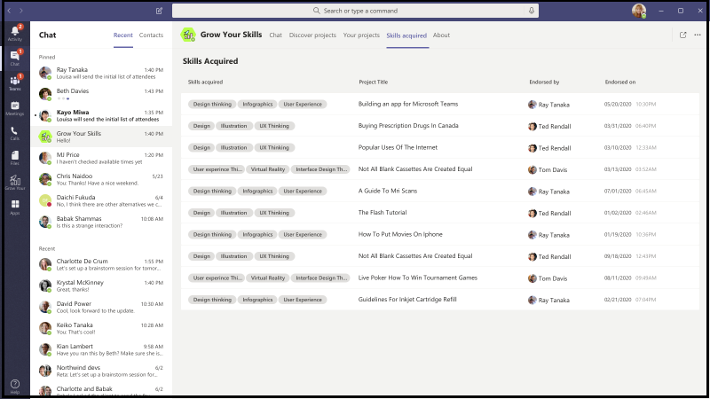
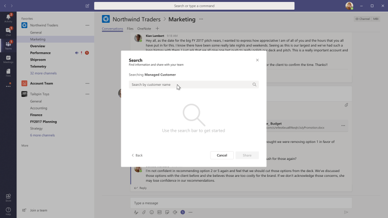

# Plantillas de aplicaciones para Microsoft Teams

Las plantillas de aplicación son ejemplos de aplicaciones completas para Microsoft Teams que son de código abierto y están disponibles en GitHub. Cada plantilla de aplicación contiene instrucciones detalladas para implementar e instalar esa aplicación para su organización. También proporciona una aplicación de ejemplo que puede instalar y empezar a usar inmediatamente. El código fuente completo también está disponible, lo que le permite explorarlo en detalle o tenedor el código y modificarlo para cumplir con sus requisitos específicos.
Todas las plantillas de aplicaciones se proporcionan bajo los términos [de la Licencia MIT.](https://github.com/OfficeDev/microsoft-teams-apps-eprescription/blob/master/LICENSE)

> [!NOTE] 
> Debe licenciar y admitir aplicaciones creadas a partir de plantillas de aplicación para los usuarios y organizaciones.

**&#9734; Indica las plantillas de aplicación recién publicadas.**

### Beneficios clave

* **Implemente directamente en la nube:** Todas las plantillas de aplicación incluyen scripts de implementación que le permiten hospedar todos los servicios necesarios en Microsoft Azure o Power Platform. 
* **Código de ejemplo recomendado:** Las plantillas de aplicación se ajustan a las prácticas recomendadas en torno a seguridad e infraestructura. Todos los cambios enviados por la comunidad a las plantillas de la aplicación se revisan para garantizar la conformidad.
* **Personalizable y extensible:** Aunque todas las plantillas de aplicación se implementan con una configuración mínima, se proporcionan todos los scripts de base de código e implementación, para que pueda personalizarlas o ampliarlas fácilmente para que se adapten a sus necesidades únicas.
* **Documentación detallada:** Todas las plantillas de aplicación van acompañadas de documentación integral sobre la arquitectura de la solución, la implementación y los pasos de configuración.  

## Bot de adopción 

Adoption Bot es un bot de chat de atención al usuario creado con Power Virtual Agent para Teams PVA. Se considera como la versión PVA de FAQ Plus. Adoption Bot responde a más de 100 preguntas comunes sobre Microsoft 365 y Teams. Puede editar los temas existentes, agregar sus propios temas e ingerir preguntas frecuentes existentes. Si los usuarios necesitan ayuda adicional, Adoption Bot puede conectarlos a expertos o incluso ampliarlos a tickets de servicio abiertos con conectores de flujo premium. Este bot se autoinstala o está integrado en una aplicación personalizada, como [Adoption Hub.](https://github.com/akporzondek/adoption_hub)

[Sómelo en GitHub](https://github.com/OfficeDev/microsoft-teams-apps-adopt-bot)

## Herramienta de adopción- Plataforma de gestión Champion &#9734;

La plantilla de aplicación Champion Management Platform (CMP) te ayuda a administrar, escalar e inspirar a tus campeones de trabajo en equipo a lograr más. Esta plantilla de aplicación se basa en el SharePoint Framework y se carga en una pestaña dentro de un equipo. Los grupos pueden aprovechar esta herramienta para ayudar a administrar la pertenencia al programa, proporcionar una tabla de clasificación y tipos de eventos para el registro y herramientas para superponer insignias digitales a los participantes del programa.

[Sómelo en GitHub](https://github.com/OfficeDev/microsoft-teams-apps-champion-management)

## Herramienta de adopción- Microsoft 365 vías de aprendizaje (Introducción) &#9734;

La plantilla de aplicación Introducción le permite traer el poder de Microsoft 365 vías de aprendizaje dentro de Microsoft Teams. Esta plantilla de aplicación le permite conceder un fácil acceso a páginas de formación específicas u otros activos de intranet y cargar el contenido directamente dentro de Teams. También puede cambiar el nombre o el logotipo de la aplicación para que coincida con la marca de su empresa.

[Sómelo en GitHub](https://github.com/msft-teams/tools/tree/master/M365%20Learning%20Pathways)

## Gerente de Citas 

Appointment Manager es una plantilla de aplicación Teams para ayudar a las empresas a crear, administrar y llevar a cabo citas virtuales con los consumidores a través de Teams. Las nuevas solicitudes de citas de los consumidores son visibles en Teams canales, donde se asignan rápidamente y se reasignan al personal de un equipo. Las solicitudes de cita se ven a nivel de equipo o personal a través de pestañas personalizadas. Cada cita está asociada a una reunión Teams en línea, de ahí que el personal y los consumidores puedan unirse fácilmente a la reunión a la hora programada.

La plantilla de aplicación se integra con Microsoft Bookings para facilitar la gestión de citas. Las citas programadas aparecen automáticamente en los calendarios de los miembros del personal asignados, y los consumidores reciben notificaciones y recordatorios de correo electrónico personalizables con enlaces de reunión incrustados.

[Sómelo en GitHub](https://github.com/OfficeDev/microsoft-teams-apps-appointment-manager)

 

## Pregunte lejos

Ask Away es un [bot Microsoft Teams](../bots/what-are-bots.md) que permite a los usuarios realizar sesiones de preguntas y respuestas, llamadas Q&A dentro de Teams. Con el bot Ask Away, los miembros del equipo pueden enviar y votar preguntas compartidas por colegas que permiten a los anfitriones de Q&A recopilar fácilmente preguntas de primer nivel dentro de un canal o chat. El bot se utiliza para llevar a cabo una sesión Q&A en tiempo real en una reunión de Teams y permite a los asistentes enviar preguntas en vivo a través del chat.

[Sómelo en GitHub](https://github.com/OfficeDev/microsoft-teams-apps-askaway)

:::row:::
  :::column span="2":::
      
:::column-end:::
:::row-end:::

## Información de asociados

Associate Insights es una plantilla [Power Apps](/powerapps/maker/canvas-apps/embed-teams-app) que permite a los trabajadores de primera línea capturar y enviar directamente la opinión, el sentimiento y la percepción del cliente. Los trabajadores de primera línea suelen ser el primer representante de la empresa en interactuar con los clientes en un punto de contacto uno a uno. Los datos recopilados son compartidos y utilizados en colaboración por equipos empresariales, por ejemplo a través de una pestaña de Power BI Teams, para mejorar el producto y mejorar la experiencia del cliente.

[Sómelo en GitHub](https://github.com/OfficeDev/microsoft-teams-apps-associateinsights)

:::row:::
  :::column span="2":::
      
:::column-end:::
:::row-end:::
:::row:::
:::column span="2":::
    
:::column-end:::
:::row-end:::

## Asistencia

La aplicación Asistencia es una pestaña [Power Apps](/powerapps/maker/canvas-apps/embed-teams-app) que se anclan en un equipo. Está diseñado para registrar la presencia en entornos, como entornos de aprendizaje y formación. Los usuarios pueden marcar o editar la asistencia durante un tiempo de hasta 30 días en el pasado y ver informes de asistencia resumidos para todo un grupo o asistentes individuales. Para obtener más información sobre la asistencia de equipos, consulte [Obtenerlo en GitHub](https://github.com/OfficeDev/microsoft-teams-apps-attendance).

La siguiente imagen muestra la demostración de la aplicación de asistencia:  

## Reservar una habitación

Book-a-room es un [bot Microsoft Teams](../bots/what-are-bots.md) que permite a los usuarios encontrar y reservar rápidamente una sala de reuniones durante 30, 60 o 90 minutos a partir de la hora actual. El tiempo predeterminado es de 30 minutos. El bot Book-a-room se limita a conversaciones personales o 1:1. Para obtener más información sobre la aplicación Reservar una habitación, consulte [Obtenerla en GitHub](https://github.com/OfficeDev/microsoft-teams-apps-bookaroom).  
La siguiente imagen muestra la demostración Libro a habitación:

## Acceso al edificio

Building Access es una aplicación basada en Microsoft [Power Platform](https://powerapps.microsoft.com/blog/now-in-preview-customize-teams-with-built-in-power-platform-capabilities/) que admite la administración de umbrales de ocupación de edificios y normas de distanciamiento social al permitir a los directores de instalaciones administrar, realizar un seguimiento e informar de la presencia de los empleados en el lugar. La aplicación, creada con Microsoft [Power Apps](/powerapps/powerapps-overview)y [Power Automate,](/power-automate/getting-started)se integra profundamente con Microsoft Teams y permite a las organizaciones determinar la preparación de la creación, establecer criterios de elegibilidad para el acceso in situ y recopilar información para la planificación futura.

[Sómelo en GitHub](https://github.com/OfficeDev/microsoft-teams-apps-buildingaccess)

:::row:::
   :::column span="":::
     
   :::column-end:::
   :::column span="":::
      
   :::column-end:::
:::row-end:::

## Celebraciones

Celebrations es una aplicación Teams que ayuda a los miembros del equipo a celebrar los cumpleaños, aniversarios y otros eventos recurrentes de los demás. Recuerda ocasiones especiales de todos los miembros del equipo y envía un mensaje amistoso en todos los equipos seleccionados en el momento de la creación del evento, para que los miembros del equipo se sientan especiales en su día.

La aplicación proporciona una interfaz fácil para que todos los miembros del equipo agreguen y vean personalmente sus eventos y también permite al usuario seleccionar los equipos en los que se comparten los eventos.

[Sómelo en GitHub](https://github.com/OfficeDev/microsoft-teams-celebrations-app)

## Lista de comprobación

Lista de comprobación es una aplicación de extensión de [mensajería](../messaging-extensions/what-are-messaging-extensions.md) Microsoft Teams personalizada que le permite colaborar con su equipo mediante la creación de una lista de comprobación compartida en un chat o canal. La aplicación es compatible con todos los clientes de Teams plataforma, como navegador de escritorio, iOS y Android. La aplicación está lista para su implementación como parte de la suscripción Microsoft 365.  

[Sómelo en GitHub](https://github.com/OfficeDev/microsoft-teams-checklist-app)

:::row:::
:::column span="2":::
      
:::column-end:::
:::row-end:::

## Entrega en el aula 

Classroom Drop-in es una aplicación basada en Microsoft [Power Platform](https://powerapps.microsoft.com/blog/now-in-preview-customize-teams-with-built-in-power-platform-capabilities/)que permite a los líderes del sistema encontrar equipos de clase, significa aulas virtuales y agregarse a estos equipos de clase para un período de entrega especificado, según sea necesario. La aplicación creada con Microsoft [Power Apps](/powerapps/powerapps-overview) y [Power Automate,](/power-automate/getting-started)se integra profundamente con Microsoft Teams para garantizar que los institutos educativos puedan optimizar sus operaciones en un entorno de aprendizaje híbrido proporcionando acceso a las partes interesadas relevantes para los equipos de clase por requerimientos empresariales.

[Sómelo en GitHub](https://github.com/OfficeDev/microsoft-teams-apps-classroom-dropin)

## Comunicador de la empresa

La aplicación Communicator de la empresa permite a los equipos corporativos crear y enviar mensajes destinados a varios equipos o un gran número de empleados a través del chat, lo que permite a la organización llegar a los empleados justo donde colaboran. Utilice esta plantilla para múltiples escenarios, como nuevos anuncios de iniciativa, incorporación de empleados, aprendizaje moderno y desarrollo o transmisiones en toda la organización.

La aplicación proporciona una interfaz fácil para que los usuarios designados creen, obtengan una vista previa, colaboren y envíen mensajes.

Proporciona una base para crear capacidades de comunicación dirigidas personalizadas, como telemetría personalizada en cuántos usuarios reconocieron o interactuaron con un mensaje.

[Sómelo en GitHub](https://github.com/OfficeDev/microsoft-teams-company-communicator-app)

## Búsqueda de grupo de contacto

La aplicación Búsqueda de grupos de contactos proporciona un enfoque conveniente y útil para crear, acceder y administrar los grupos de contactos de su organización, anteriormente conocidos como listas de distribución o grupos de comunicación. Los usuarios pueden ver y chatear rápidamente con los miembros del grupo, ver el estado de los miembros y crear un chat de grupo con miembros seleccionados en el grupo de contactos, todo dentro del entorno de Teams.

[Sómelo en GitHub](https://github.com/OfficeDev/microsoft-teams-app-contactgrouplookup)

:::row:::
:::column span="2":::
      
:::column-end:::
:::row-end:::
:::row:::
:::column span="2":::
    
:::column-end:::
:::row-end:::

## Apreciación de los compañeros de trabajo 

Utilizando la plantilla de apreciación de compañeros de trabajo en Microsoft Teams, los usuarios pueden reconocer los logros de sus colegas en el contexto de la Teams. Cuando los compañeros de trabajo seleccionan recompensar a un colega, los destinatarios y otros miembros del equipo se etiquetan en una conversación de canal y reciben una notificación sobre los detalles del premio del canal. Los premios se registran en la aplicación Teams, que es segura, portátil y fácilmente compartible. Esto se considera como la versión basada en PowerApps de la plantilla de aplicación Abrir insignias, con una tabla de clasificación.

[Sómelo en GitHub](https://github.com/OfficeDev/microsoft-teams-apps-coworker-appreciation)

## CrowdSourcer

CrowdSourcer es un [bot de Microsoft Teams](../bots/what-are-bots.md) que proporciona a los equipos información consultada procedente en colaboración de los miembros del grupo. Ayuda a responder preguntas frecuentes al tiempo que permite a los participantes participar activamente y contribuir a un recurso de información divertido y útil.

[Consiga en Github](https://github.com/OfficeDev/microsoft-teams-crowdsourcer-app)

## Adhesivos personalizados

La autoexpresión es fundamental para una cultura de equipo saludable. Esta plantilla de aplicación es una [extensión de mensajería](~/messaging-extensions/what-are-messaging-extensions.md) que permite a los usuarios utilizar pegatinas personalizadas y GIF dentro de Microsoft Teams. Esta plantilla proporciona una experiencia de configuración fácil basada en la web donde cualquier persona con acceso a la configuración puede cargar los GIF, pegatinas e imágenes que desea que tengan sus usuarios, lo que permite a todo su equipo utilizar cualquier conjunto de pegatinas que elija.

Esta aplicación también permite compartir fácilmente imágenes, GIF, pegatinas entre equipos sin necesidad de acceso a sitios SharePoint o canales individuales como mecanismos de almacenamiento y uso compartido. Por ejemplo, los equipos de productos pueden compartir fácilmente imágenes de productos y GIF a las redes sociales, marketing y equipos de ventas mediante programación. También se puede ampliar esta aplicación activando un flujo de notificación a equipos o individuos específicos cuando se pongan nuevas imágenes y GIF.

[Sómelo en GitHub](https://github.com/OfficeDev/microsoft-teams-stickers-app)

## Ideas de los empleados

La aplicación Ideas de empleados es la versión de PowerApps de la plantilla de aplicación Great Ideas basada en Azure. La aplicación permite a los usuarios de Teams configurar y configurar una campaña de ideas. Una campaña de ideas es una categoría para agrupar ideas en torno a temas comunes.

Teams usuarios también pueden realizar las siguientes actividades:

* Configure un formulario de envío estándar que los empleados deben enviar para cada idea. 
* Revise y gestione las ideas y la lista de campañas.
* Modificar y eliminar campañas.
* Revise las tablas de ideas de los líderes.
* Voten y compartan ideas priorizadas.
* Envía ideas para una campaña.
* Vea la idea de otro miembro del equipo.
* Vota sobre las ideas más queridas.
* Revise el desempeño de sus ideas en comparación con otras dentro de una campaña.

[Sómelo en GitHub](https://github.com/OfficeDev/microsoft-teams-apps-employeeideas)

 

## Recetas electrónicas 

E-Prescriptions es una aplicación basada en [Power Apps](/powerapps/maker/canvas-apps/embed-teams-app) que mejora la telemedicina y la atención virtual mediante la automatización del proceso de emisión de recetas electrónicas a los pacientes. Los profesionales médicos pueden revisar rápidamente las citas, generar recetas electrónicas y enviar correos electrónicos con archivos adjuntos de receta electrónica a los pacientes directamente dentro de la plataforma de Teams.

[Sómelo en GitHub](https://github.com/OfficeDev/microsoft-teams-apps-eprescription) 

:::row:::
:::column span="2":::
      
:::column-end:::
:::row-end:::
:::row:::
:::column span="2":::
    
:::column-end:::
:::row-end:::

## Formación de empleados 

La capacitación de los empleados es una aplicación Microsoft Teams que permite a los organizadores publicar, realizar un seguimiento y promover fácilmente eventos de aprendizaje y capacitación para su organización.  Con la aplicación, los planificadores de eventos pueden enviar recordatorios y notificaciones a los solicitantes de registro de eventos y los empleados pueden indicar interés en los próximos eventos, mantenerse actualizados sobre los eventos actuales y compartir los detalles del evento con los colegas a través de la extensión de mensajería Teams.

[Sómelo en GitHub](https://github.com/OfficeDev/microsoft-teams-apps-employeetraining)

:::row:::
:::column span="2":::
    **Ver eventos de capacitación de empleados**   
:::column-end:::
:::row-end:::
:::row:::
:::column span="2":::
    **Crear evento de capacitación de empleados** 
:::column-end:::
:::row-end:::

## Buscador experto

Expert Finder es un [bot Microsoft Teams](../bots/what-are-bots.md) que identifica a miembros específicos de la organización en función de sus habilidades, intereses y atributos educativos. Los miembros encuentran expertos dentro de una organización que coinciden con una búsqueda de palabras clave de perfiles de usuario Azure Active Directory.

[Sómelo en GitHub](https://github.com/OfficeDev/microsoft-teams-apps-expertfinder)

## Preguntas más frecuentes Plus

Los bots conversacionales Q&A son una manera fácil de proporcionar respuestas a las preguntas más frecuentes por parte de los usuarios. Pero, la mayoría de los bots no interactúan con los usuarios de manera significativa porque no hay ningún humano en el bucle cuando el bot falla. Faq bot es un bot Q&A amigable que trae a un humano en el bucle cuando no puede ayudar. Uno puede hacerle una pregunta al bot y el bot responde con una respuesta si está contenida en la base de conocimiento. Si no es así, el bot permite al usuario enviar una consulta que luego se publica en un equipo preconfigurado de expertos que ayudan a proporcionar soporte actuando sobre las notificaciones desde dentro del propio equipo.

> [!NOTE]
> La última versión de **FAQ Plus** admite resoluciones Q&A mejoradas al permitir a un equipo de expertos completar lo siguiente:
>
> &#x2714; Agregue nuevas&Q directamente a la base de conocimiento mediante extensiones de mensaje.
>
> &#x2714; Editar y eliminar pares Q&A agregados por un bot.
>
> &#x2714; Realizar un seguimiento del historial de revisiones de Q&As.
>
> &#x2714; Configurar una respuesta con detalles adicionales para mostrarla como tarjeta [adaptable.](../task-modules-and-cards/cards/cards-reference.md#adaptive-card)
>
[Sómelo en GitHub](https://github.com/OfficeDev/microsoft-teams-apps-faqplusv2)

## Obtener aplicación de soporte

La aplicación Obtener soporte técnico es utilizada por organizaciones que usan Microsoft Teams, para permitir que cualquier conjunto de usuarios solicite ayuda a los supervisores. Esta aplicación incluye las siguientes características:
* Solicitar ayuda en diferentes categorías desde una aplicación de energía.
* Notificaciones enviadas a los solicitantes informándoles de quién ha sido asignado.
* Notificaciones enviadas a los supervisores asignados informándoles de quién necesita ayuda. 
* Análisis de escalamientos y patrones en SharePoint y PowerBI.S.

[Sómelo en GitHub](https://github.com/OfficeDev/microsoft-teams-app-get-support/)

## Rastreador de objetivos

La aplicación Goal Tracker es una solución integral para que su organización admita el establecimiento de objetivos, la observación del progreso y el reconocimiento del éxito dentro de Microsoft Teams. La aplicación permite a los usuarios establecer, realizar un seguimiento y actualizar los objetivos a nivel profesional, personal y de equipo. Los miembros del equipo también reciben recordatorios oportunos y actualizaciones de estado para mantenerse enfocados y mantenerse en el buen camino.

[Sómelo en GitHub](https://github.com/OfficeDev/microsoft-teams-app-goaltracker)

:::row:::
  :::column span="2":::
      
:::column-end:::
:::row-end:::
:::row:::
:::column span="2":::
    
:::column-end:::
:::row-end:::

## Grandes ideas

La aplicación Great Ideas apoya y potencia la innovación y la creatividad dentro de su organización. La aplicación permite a sus empleados compartir ideas con colegas y liderazgo, descubrir nuevos envíos, destacar las contribuciones para la consideración por pares y emitir su voto por las mejores propuestas dentro de Microsoft Teams.

[Sómelo en GitHub](https://github.com/OfficeDev/microsoft-teams-apps-greatideas)

:::row:::
  :::column span="2":::
      
:::column-end:::
:::row-end:::
:::row:::
:::column span="2":::
    
:::column-end:::
:::row-end:::

## Actividades grupales

Actividades de grupo es una aplicación Microsoft Teams que facilita a los propietarios de equipos crear rápidamente grupos de actividades y administrar flujos de trabajo de colaboración en el contexto de Microsoft Teams. Los autores de actividades están habilitados para crear actividades, distribuir aleatoriamente a los miembros del equipo en grupos y, opcionalmente, hacer que el bot envíe recordatorios hasta que se completen las actividades.

[Sómelo en GitHub](https://github.com/OfficeDev/microsoft-teams-apps-groupactivities)

:::row:::
  :::column span="2":::
      
:::column-end:::
:::row-end:::
:::row:::
:::column span="2":::
    
:::column-end:::
:::row-end:::

## Grupo Conectar &#9734;

Group Conectar es una aplicación Microsoft Teams que ayuda a los miembros de la organización a detectar grupos de empleados y encontrar información relevante para los grupos de empleados. La aplicación viene integrada con capacidades enriquecidas para que los líderes de la organización se comuniquen con sus empleados con respecto a grupos, eventos y recursos. La aplicación Group Conectar también hace coincidir a los miembros del grupo entre sí en la frecuencia deseada para fomentar la creación de redes y la cohesión dentro de un grupo. Para obtener más información sobre cómo puede aprovechar la aplicación de Conectar de grupo para ayudar a los grupos de empleados a fomentar dentro de su organización, consulte la aplicación en GitHub.

[Sómelo en GitHub](https://github.com/OfficeDev/microsoft-teams-apps-groupconnect)

## Haz crecer tus habilidades

La aplicación Grow Your Skills apoya el crecimiento y el desarrollo profesionales al permitir que los empleados contribuyan a proyectos suplementarios para su organización mientras aprenden simultáneamente nuevas habilidades. Los empleados pueden usar la aplicación para localizar oportunidades que satisfagan sus intereses, disfrutar de una colaboración significativa con sus compañeros y adquirir nuevos niveles de experiencia y capacidades, todo dentro del entorno Teams.

[Sómelo en GitHub](https://github.com/OfficeDev/microsoft-teams-apps-growyourskills)

:::row:::
  :::column span="2":::
      
:::column-end:::
:::row-end:::
:::row:::
:::column span="2":::
    
:::column-end:::
:::row-end:::

## Soporte de Recursos Humanos

El bot de soporte de HR es un bot Q&A amigable que trae un profesional de soporte o experto del equipo de recursos humanos en el bucle cuando no puede ayudar. Uno puede hacerle una pregunta al bot y el bot responde con una respuesta si está contenida en la base de conocimiento. Si no es así, el bot permite al usuario enviar una consulta que luego se publica en un equipo preconfigurado de expertos que son ayuda para proporcionar soporte actuando sobre las notificaciones desde dentro de su propio equipo. Además, el bot sugiere vínculos a directivas o preguntas de recursos humanos recomendadas mediante la búsqueda de etiquetas preconfiguradas en la pregunta. Estos iconos se encuentran en la pestaña asociada como una referencia rápida. El soporte de recursos humanos funciona bien para Q&A de peso ligero y para proporcionar un apoyo rápido al lanzar nuevos proyectos o iniciativas en la organización.

[Sómelo en GitHub](https://github.com/OfficeDev/microsoft-teams-hrsupport-app)

## Rompehielo

Icebreaker es un [bot Microsoft Teams](../bots/what-are-bots.md) que ayuda a tu equipo a acercarse emparejando a dos miembros aleatorios del equipo cada semana para reunirse. El bot facilita la programación sugiriendo automáticamente tiempos libres que funcionen para ambos miembros. Fortalecer las conexiones personales y construir una comunidad estrechamente unida con esta aplicación.

Además de fomentar las conexiones personales en todo el equipo, la aplicación Icebreaker puede ayudar a cultivar comunidades basadas en intereses dentro de su organización. Por ejemplo, puede usar esta aplicación para un grupo de DevOps interés para ayudar a las ideas y prácticas recomendadas distribuidas orgánicamente por toda la organización.

[Sómelo en GitHub](https://github.com/OfficeDev/microsoft-teams-icebreaker-app)

## incentivos

Incentivos es una plantilla [Power Apps](/powerapps/maker/canvas-apps/embed-teams-app) que gestiona y realiza un seguimiento de la participación incentivada de los empleados en actividades designadas, como capacitaciones e iniciativas de gestión del cambio. Los administradores usan la aplicación para establecer actividades designadas, asignar puntos para completar y especificar los niveles de puntos de elegibilidad necesarios para las recompensas. Los empleados utilizan la aplicación para ver sus puntos acumulados y, al llegar a la elegibilidad, solicitar y reclamar recompensas canjeables.

[Sómelo en GitHub](https://github.com/OfficeDev/microsoft-teams-apps-incentives)

## Reportero de incidentes

Incident Reporter es un [bot de Microsoft Teams](../bots/what-are-bots.md) que optimiza la administración de incidentes en su organización. El bot facilita la recopilación automatizada de datos de incidentes, informes de incidentes personalizados, notificaciones relevantes de partes interesadas y seguimiento de incidentes de extremo a extremo.

[Sómelo en GitHub](https://github.com/OfficeDev/microsoft-teams-apps-incidentreport)

:::row:::
  :::column span="2":::
      
:::column-end:::
:::row-end:::
:::row:::
:::column span="2":::
    
:::column-end:::
:::row-end:::

## inspección 

 La inspección es una aplicación Microsoft Teams que permite a los trabajadores de primera línea inspeccionar cualquier cosa, desde ubicaciones hasta activos y equipos. Por ejemplo, una tienda minorista, una planta de fabricación o vehículos y máquinas. Hay dos aplicaciones en esta solución, cada una destinada a diferentes tipos de usuarios.

La aplicación permite a los trabajadores de primera línea inspeccionar un activo o área, administrar la calidad de los productos y servicios, o mantener la seguridad en el lugar de trabajo. Facilita la comunicación entre los miembros del equipo para abordar los problemas encontrados durante la inspección. La aplicación proporciona informes sencillos para que los administradores aceleren la resolución de problemas y resalten las tendencias.

[Sómelo en GitHub](https://github.com/OfficeDev/microsoft-teams-apps-inspection)

   

## Informes de emisión

La aplicación Informes de problemas permite a los empleados y gerentes plantear y administrar problemas. Consta de dos aplicaciones, aplicación de informes de problemas para informar de problemas y administrar problemas de aplicación para administrar problemas.

Los administradores de equipos usan la aplicación Administrar problemas para configurar la experiencia de la aplicación, incluido el canal en el que la aplicación crea Microsoft Teams mensajes y las tareas de Planificador. Los administradores también usan la aplicación para crear formularios de plantilla para recopilar detalles cuando un usuario notifica un problema. Por ejemplo, revise, edite o elimine formularios de plantilla de problema. La aplicación también se usa para revisar los problemas del equipo, informar sobre el historial de problemas y administrar eficazmente la resolución de problemas.

Los empleados usan la aplicación de informes de problemas para registrar los problemas y los detalles necesarios para resolverlos. La aplicación también se utiliza para modificar y resolver problemas existentes y obtener una vista de alto nivel de problemas individuales o de equipo.

[Sómelo en GitHub](https://github.com/OfficeDev/microsoft-teams-apps-issuereporting)

  

## Incorporación de nuevos empleados 

La incorporación de nuevos empleados es una solución integrada de incorporación de Microsoft Teams y [SharePoint nuevo empleado](https://lookbook.microsoft.com/details/75e60a32-9849-4ed4-b83e-b2b08983ad19) que permite a su organización proporcionar una experiencia de incorporación consistente y de alta calidad para los empleados en su viaje de nueva contratación. La aplicación es utilizada por equipos de recursos humanos y gerentes de contratación para proporcionar información relevante a lo largo del proceso de orientación e inducción y por nuevas contrataciones para compartir comentarios, proporcionar presentaciones y completar tareas de incorporación.

[Sómelo en GitHub](https://github.com/OfficeDev/microsoft-teams-apps-newemployeeonboarding)

:::row:::
  :::column span="2":::
    **Nueva tarjeta de bienvenida para empleados** 
:::column-end:::
:::row-end:::
:::row:::
:::column span="2":::
    **Nueva lista de verificación de empleados**   
:::column-end:::
:::row-end:::

## Insignias abiertas

Open Badges es una aplicación Microsoft Teams que permite a las personas obtener insignias de credenciales de aprendizaje digital dentro del contexto Teams y compartirlas en todas partes. Utilizando las capacidades de la autoridad emisora de insignias digitales de terceros, [Badgr](https://badgr.org/), las insignias otorgadas se registran en el perfil badgr de un destinatario y están disponibles para construir y compartir una imagen rica de los viajes de aprendizaje de por vida.

[Sómelo en GitHub](https://github.com/OfficeDev/microsoft-teams-apps-openbadges)

:::row:::
  :::column span="2":::
      
:::column-end:::
:::row-end:::
:::row:::
:::column span="2":::
    
:::column-end:::
:::row-end:::

## encuesta 

Poll es una aplicación de extensión de [mensajería](../messaging-extensions/what-are-messaging-extensions.md) Microsoft Teams personalizada que le permite crear y enviar rápidamente encuestas en un chat o un canal para recopilar opiniones y preferencias del equipo. La aplicación es compatible con todos los clientes de Teams plataforma, como escritorio, navegador, iOS y Android y está lista para su implementación como parte de su suscripción Microsoft 365.

[Sómelo en GitHub](https://github.com/OfficeDev/microsoft-teams-poll-app)

:::row:::
  :::column span="1":::
      
:::column-end:::
:::row-end:::

## Respuestas rápidas

Quick Responses es una aplicación Microsoft Teams que ofrece una solución sólida para responder eficazmente a las preguntas frecuentes de los usuarios. En lugar de responder a cada consulta de forma manual y continua repitiendo información, la aplicación crea una biblioteca de respuestas para una experiencia de usuario interactiva a través de extensiones de [mensajería](../messaging-extensions/what-are-messaging-extensions.md)Teams.

[Sómelo en GitHub](https://github.com/OfficeDev/microsoft-teams-apps-quickresponses)

## &#9734; de preguntas

Quiz es una aplicación de [extensión de mensajería Teams](../messaging-extensions/what-are-messaging-extensions.md) personalizada que le permite crear un cuestionario dentro de un chat o un canal para la comprobación de conocimiento y resultados instantáneos. Puedes usar quiz para exámenes en clase y sin conexión, verificación de conocimientos dentro del equipo y para cuestionarios divertidos dentro de un equipo. La aplicación de prueba es compatible con varias plataformas, como Teams clientes de escritorio, navegador, iOS y Android. Esta aplicación está lista para su implementación como parte de la suscripción de Microsoft 365 existente.

[Sómelo en GitHub](https://github.com/OfficeDev/microsoft-teams-apps-quiz)

:::row:::
  :::column span="1":::
      
:::column-end:::
:::row-end:::

## Asistencia rápida

Rapid Assist es una aplicación basada en Microsoft [Power Platform](https://powerapps.microsoft.com/blog/now-in-preview-customize-teams-with-built-in-power-platform-capabilities/) que permite a los asociados orientados al cliente conectarse rápidamente con los expertos para obtener respuestas rápidas, buscar información, realizar un seguimiento de las solicitudes abiertas y permitir que los expertos reciban notificaciones para recibir rápidamente una llamada para ayudar a responder preguntas. La aplicación creada con Microsoft [Power Apps](/powerapps/powerapps-overview) y [Power Automate,](/power-automate/getting-started)se integra profundamente con Microsoft Teams para permitir a las organizaciones conectar fácilmente a los trabajadores de primera línea con enlaces corporativos para resolver las consultas de los clientes y ofrecer una gran experiencia al cliente. 

[Sómelo en GitHub](https://github.com/OfficeDev/microsoft-teams-apps-rapid-assist)

:::row:::
   :::column span="":::
     
   :::column-end:::
   :::column span="":::
      
   :::column-end:::
:::row-end:::

## reflejar 

Reflect es una aplicación de extensión de [mensajería](../messaging-extensions/what-are-messaging-extensions.md) Microsoft Teams personalizada que proporciona un recurso seguro e inclusivo para que los miembros de su equipo compartan el estado de su bienestar emocional con colegas o líderes de grupo directamente dentro de Teams. La aplicación está disponible en los chats de canal, grupo, reunión y 1:1 y la respuesta de check-in se establece en público, privado a remitente o totalmente anónimo.

[Sómelo en GitHub](https://github.com/OfficeDev/Microsoft-Teams-App-Reflect)

:::row:::
    :::column:::
    **Encuesta de bienestar**
    
    
    :::column-end:::
:::row-end:::

## Soporte remoto

El soporte remoto es un [bot Microsoft Teams](../bots/what-are-bots.md) que proporciona una interfaz enfocada entre los solicitantes de soporte técnico en toda la organización y el equipo de soporte interno.  Los usuarios finales pueden enviar, editar o retirar solicitudes de soporte técnico y el equipo de soporte técnico puede responder, administrar y actualizar las solicitudes desde la plataforma Teams.

[Sómelo en GitHub](https://github.com/OfficeDev/microsoft-teams-apps-remotesupport)

:::row:::
  :::column span="2":::
      
:::column-end:::
:::row-end:::
:::row:::
:::column span="2":::
    
:::column-end:::
:::row-end:::

## Solicitud-a-equipo

Request-a-team es una aplicación Microsoft Teams que optimiza la creación de nuevos equipos para su organización empresarial. La aplicación admite la estandarización y las prácticas recomendadas al crear nuevas instancias de equipo mediante la integración de un formulario de solicitud guiado por asistente, un proceso de aprobación incrustado, un panel de estado de solicitud y compilaciones automatizadas del equipo.

[Sómelo en GitHub](https://github.com/OfficeDev/microsoft-teams-apps-requestateam)

:::row:::
  :::column span="2":::
    
:::column-end:::
:::row-end:::
:::row:::
:::column span="2":::
    
:::column-end:::
:::row-end:::

## Scrums para canales

Scrums for Channels es una aplicación asistente scrum que permite a los usuarios programar y ejecutar scrums en canales dentro de Microsoft Teams. La aplicación es ideal para equipos remotos y equipos compuestos por miembros de diferentes ubicaciones geográficas y zonas horarias para compartir actualizaciones diarias y garantizar la participación en reuniones de stand-up scrum.

[Sómelo en GitHub](https://github.com/OfficeDev/microsoft-teams-apps-scrumsforchannels)

> [!NOTE]
> Para realizar reuniones scrum en un chat de grupo, consulte la plantilla de aplicación [Scrums for Group Chat.](#scrums-for-group-chat)

:::row:::
  :::column span="2":::
    
:::column-end:::
:::row-end:::
:::row:::
:::column span="2":::
    
:::column-end:::
:::row-end:::

## Scrums para chat de grupo

> [!NOTE]
> La plantilla de aplicación Scrums Status se actualiza y ahora es Scrums para el chat de grupo.

Scrums for Group Chat es un asistente de scrum de apoyo que permite a los miembros del chat de grupo ejecutar reuniones asincrónicas de stand-up y compartir fácilmente sus actualizaciones diarias. Permite a todos los miembros del chat de grupo contribuir al scrum y ver las actualizaciones hechas por otros en el scrum en ejecución.

[Sómelo en GitHub](https://github.com/OfficeDev/microsoft-teams-apps-scrumsforgroupchat)

## Compartir ahora 

La aplicación Compartir ahora promueve el intercambio positivo de información entre colegas al permitir que los usuarios compartan fácilmente contenido dentro del entorno de Teams. Los usuarios interactúan con la aplicación para compartir elementos de interés con los miembros del equipo, descubrir nuevo contenido compartido, establecer preferencias y marcar favoritos para su posterior lectura.

[Sómelo en GitHub](https://github.com/OfficeDev/microsoft-teams-apps-sharenow)

## Búsqueda de lista de SharePoint

La colaboración en Microsoft Teams con bastante frecuencia hace referencia a la información contenida en los elementos de una lista de SharePoint. Pegar un enlace al elemento en cuestión obliga a todos a cambiar de contexto lejos de la conversación, encontrar la información necesaria y, a continuación, volver a Teams para continuar la conversación. A medida que la conversación continúa, las personas tienen que volver al elemento de referencia varias veces para verificar nuevos comentarios y actualizar sus memorias de la información contenida en el elemento. Este cambio de contexto crea una barrera para suavizar la colaboración.
Para resolver este problema, se usa la plantilla de aplicación Lista de búsqueda. Muchos usuarios usan SharePoint para alimentar algunos de los flujos de trabajo principales de sus organizaciones. Sin embargo, colaborar en torno a las listas es difícil. Con la plantilla de aplicación Búsqueda de lista en Microsoft Teams, los usuarios pueden insertar información de elementos de SharePoint lista directamente dentro de una conversación de chat para aliviar el cambio de contexto causado al simplemente insertar un vínculo en un chat. La información se inserta como una tarjeta con formato automático fácil de leer, lo que ayuda a los usuarios a mantenerse involucrados en la conversación.

[Sómelo en GitHub](https://github.com/OfficeDev/microsoft-teams-list-search-app)

## Check-ins del personal

Los check-ins de personal son una aplicación basada en [Power Apps](/powerapps/powerapps-overview) que permite la comunicación de supervisión entre su empresa y el personal de campo. El personal puede proporcionar fácilmente información de tiempo crítico y actualizaciones de estado de forma programada o ad hoc directamente desde Teams. La aplicación admite la ubicación en tiempo real, fotos, notas, notificaciones de recordatorio y flujos de trabajo automatizados.

[Sómelo en GitHub](https://github.com/OfficeDev/microsoft-teams-apps-staffcheckins)

## Encuesta

Survey es una aplicación de extensión de [mensajería](../messaging-extensions/what-are-messaging-extensions.md) Microsoft Teams personalizada que te permite crear una encuesta en un chat o un canal para recopilar datos y obtener información procesable. La aplicación es compatible con todos los clientes de Teams plataforma, como escritorio, navegador, iOS y Android y está lista para su implementación como parte de su suscripción Microsoft 365.  

[Sómelo en GitHub](https://github.com/OfficeDev/Microsoft-Teams-Survey-app)

:::row:::
  :::column span="2":::
    
:::column-end:::
:::row-end:::

## Recuento de tiempos 

Un proyecto puede incluir varias tareas y se pueden asignar varios proyectos a los empleados. Los gerentes están obligados a comprender el progreso del proyecto a través del tiempo empleado en estas tareas. Esto puede ser una actividad engorrosa, ya que los empleados necesitan rellenar las hojas de horas. La aplicación Time Tally permite a los empleados llenar sus hojas de horas rápidamente, utilizando el dispositivo móvil, y los gerentes no tienen que hacer un seguimiento con los empleados en la entrada del intervalo de horas. Los administradores pueden ver la utilización del proyecto en función de los recursos y pueden aprobar o rechazar las entradas. Se envían notificaciones de recordatorio para garantizar el cumplimiento del horario. Además, los datos históricos y las utilizaciónes están disponibles para análisis.

[Sómelo en GitHub](https://github.com/OfficeDev/microsoft-teams-apps-timetally)

## Formación &#9734;

La formación es una aplicación de [extensión de mensajería Teams](../messaging-extensions/what-are-messaging-extensions.md) personalizada que permite a los usuarios publicar una formación dentro de un chat o un canal para compartir y aumentar los conocimientos sin conexión. La aplicación es compatible con varios clientes de Teams plataforma, como escritorio, navegador, iOS y Android. Esta aplicación está lista para su implementación como parte de la suscripción Microsoft 365.

[Sómelo en GitHub](https://github.com/OfficeDev/microsoft-teams-apps-training)

:::row:::
  :::column span="1":::
      
:::column-end:::
:::row-end:::

## Redondeo virtual

Los proveedores de hospitales y salas de emergencias hacen muchas **rondas** por día. Estos registros rápidos en los pacientes están destinados a proporcionar una comprobación de estado sobre cómo está el paciente y asegurarse de que se abordan las preocupaciones del paciente. Si bien el redondeo es una práctica esencial para garantizar que los pacientes estén siendo monitoreados por múltiples tipos de proveedores, representan un enorme drenaje en el EBP, ya que para cada visita, de cada proveedor, se utiliza una nueva máscara y un nuevo conjunto de guantes. Con estas plantillas de aplicaciones, los trabajadores médicos pueden realizar rondas fácilmente virtualmente, a través de una reunión Microsoft Teams entre el proveedor y el paciente.

También se hace referencia a la solución de redondeo virtual en la entrada de [blog](https://aka.ms/teamsvirtualrounding)Microsoft Health y Ciencias de la Vida.

[Sómelo en GitHub](https://github.com/SmartterHealth/Virtual-Rounding)

## Gestión de visitantes

La aplicación Gestión de visitantes permite a su organización y empleados administrar de forma fácil y eficiente el proceso de visitantes in situ, directamente desde Microsoft Teams. La aplicación permite a los empleados crear solicitudes de visitantes, realizar un seguimiento central del estado de una solicitud a través del panel de visitantes y recibir notificaciones en tiempo real cuando llega un visitante.

[Sómelo en GitHub](https://github.com/OfficeDev/microsoft-teams-app-visitormanagement)

:::row:::
  :::column span="2":::
    
:::column-end:::
:::row-end:::
:::row:::
:::column span="2":::
    
:::column-end:::
:::row-end:::

## Premios en el lugar de trabajo

Workplace Awards es una plantilla de aplicación Teams que proporciona un marco positivo para fomentar el reconocimiento y fomentar la cultura de la apreciación de los empleados en el lugar de trabajo moderno. La aplicación le permite configurar y administrar una recompensa y reconocimiento de empleados, llamado programa R&R donde los empleados pueden nominar y respaldar fácilmente a sus colegas y su líder R&R puede ver las nominaciones presentadas, conceder premios y anunciar destinatarios.

[Sómelo en GitHub](https://github.com/OfficeDev/microsoft-teams-apps-workplaceawards)

:::row:::
  :::column span="2":::
    
:::column-end:::
:::row-end:::
:::row:::
:::column span="2":::
    
:::column-end:::
:::row-end:::

Para obtener más información sobre la plantilla de aplicación, consulte [Plantilla de aplicación](https://forms.office.com/Pages/ResponsePage.aspx?id=v4j5cvGGr0GRqy180BHbR2_7qFm_lcZAr4eqEhnLsZ9UMVZGT1lCT0FXUDdZMUM0RkpBS1BESTAwWC4u).

## Vea también

[Integrar aplicaciones web](~/samples/integrate-web-apps-overview.md)
