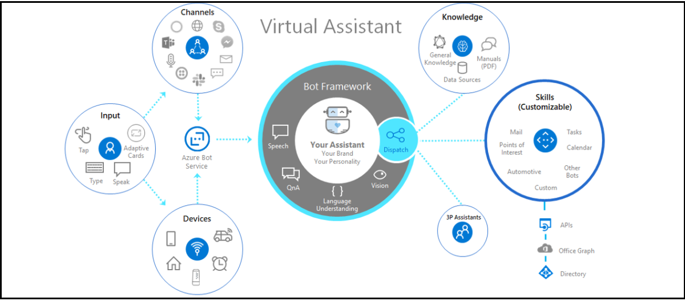

# <a name="create-virtual-assistant"></a>Crear un asistente virtual 

Virtual Assistant es una plantilla de código abierto de Microsoft que le permite crear una solución conversacional sólida y mantener el control total de la experiencia del usuario, la personalidad de marca de la organización y los datos necesarios. La [plantilla](https://microsoft.github.io/botframework-solutions/overview/virtual-assistant-template) principal de Virtual Assistant es el bloque de creación básico que reúne las tecnologías de Microsoft necesarias para crear un Virtual Assistant, incluido el SDK de [Bot Framework,](https://github.com/microsoft/botframework-sdk) [Language Understanding (LUIS)](https://www.luis.ai/)y [QnA Maker](https://www.qnamaker.ai/). También reúne las capacidades esenciales, como el registro de aptitudes, las cuentas vinculadas, la intención conversacional básica de ofrecer a los usuarios una amplia variedad de interacciones y experiencias sin problemas. Además, las capacidades de plantilla incluyen ejemplos enriquecidos de habilidades conversacionales [reutilizables.](https://microsoft.github.io/botframework-solutions/overview/skills)  Las habilidades individuales se integran en Virtual Assistant solución para habilitar varios escenarios. Con el SDK de Bot Framework, las habilidades se presentan en forma de código fuente, lo que permite personalizar y ampliar según sea necesario. Para obtener más información sobre las habilidades de Bot Framework, vea [What is a Bot Framework skill](https://microsoft.github.io/botframework-solutions/overview/skills/). Este documento le guía sobre Virtual Assistant de implementación para las organizaciones, cómo crear un Virtual Assistant centrado en Teams, ejemplo relacionado, ejemplo de código y limitaciones de Virtual Assistant.
En la siguiente imagen se muestra la introducción al asistente virtual:



Las actividades de mensajes de texto se enrutan a las aptitudes asociadas mediante el Virtual Assistant principal mediante un modelo [de](/azure/bot-service/bot-builder-tutorial-dispatch?view=azure-bot-service-4.0&tabs=cs&preserve-view=true) distribución. 

## <a name="implementation-considerations"></a>Consideraciones de implementación

La decisión de agregar un Virtual Assistant incluye muchos determinantes y difiere para cada organización. Los factores de soporte de una Virtual Assistant implementación de la organización son los siguientes:

* Un equipo central administra todas las experiencias de los empleados. Tiene la capacidad de crear una experiencia Virtual Assistant y administrar actualizaciones de la experiencia principal, incluida la adición de nuevas habilidades.
* Existen varias aplicaciones en todas las funciones empresariales y se espera que el número aumente en el futuro.
* Las aplicaciones existentes son personalizables, pertenecen a la organización y se convierten en aptitudes para un Virtual Assistant.
* El equipo de experiencias de los empleados centrales puede influir en las personalizaciones de las aplicaciones existentes. También proporciona instrucciones necesarias para integrar aplicaciones existentes como habilidades en Virtual Assistant experiencia.

En la siguiente imagen se muestran las funciones empresariales de Virtual Assistant: 


## <a name="create-a-teams-focused-virtual-assistant"></a>Crear un Teams centrado en Virtual Assistant

Microsoft ha publicado una plantilla [Visual Studio para](https://marketplace.visualstudio.com/items?itemName=BotBuilder.VirtualAssistantTemplate) crear asistentes virtuales y habilidades. Con la Visual Studio, puedes crear una Virtual Assistant, con una experiencia basada en texto con compatibilidad con tarjetas enriquecciones limitadas con acciones. Hemos mejorado la plantilla Visual Studio base para incluir Microsoft Teams de plataforma y mejorar las Teams aplicaciones. Algunas de las funcionalidades incluyen compatibilidad con tarjetas adaptables enriquecciones, módulos de tareas, chats de grupo o equipos y extensiones de mensajería. Para obtener más información sobre cómo Virtual Assistant a Microsoft Teams, vea [Tutorial: Extend Your Virtual Assistant to Microsoft Teams](https://microsoft.github.io/botframework-solutions/clients-and-channels/tutorials/enable-teams/1-intro/).    
La siguiente imagen muestra el diagrama de alto nivel de una Virtual Assistant solución:


### <a name="add-adaptive-cards-to-your-virtual-assistant"></a>Agregar tarjetas adaptables a su Virtual Assistant

Para enviar solicitudes correctamente, el Virtual Assistant debe identificar el modelo de LUIS correcto y la habilidad correspondiente asociada a él. Sin embargo, el mecanismo de distribución no se puede usar para las actividades de acción de tarjeta, ya que el modelo de LUIS asociado con una habilidad está formado para los textos de acción de tarjeta. Los textos de acción de la tarjeta son palabras clave fijas, predefinidas y no comentadas por un usuario.

Este inconveniente se resuelve insertando información de aptitudes en la carga de acción de la tarjeta. Cada habilidad debe `skillId` insertarse en el  `value` campo de acciones de tarjeta. Debe asegurarse de que cada actividad de acción de tarjeta lleva la información de habilidad pertinente y Virtual Assistant puede usar esta información para el envío.

Debe proporcionar en el constructor para asegurarse de que la información de `skillId` aptitudes siempre está presente en las acciones de la tarjeta.
En la siguiente sección se muestra un código de ejemplo de datos de acción de tarjeta:
```csharp
    public class CardActionData
    {
        public CardActionData(string skillId)
        {
            this.SkillId = skillId;
        }

        [JsonProperty("skillId")]
        public string SkillId { get; set; }
    }

    ...
    var button = new CardAction
    {
        Type = ActionTypes.MessageBack,
        Title = "Card action button",
        Text = "card action button text",
        Value = new CardActionData(<SkillId>),
    };
```

A `SkillCardActionData` continuación, se presenta la clase Virtual Assistant plantilla para extraer de `skillId` la carga de la acción de tarjeta.
En la siguiente sección se muestra un fragmento de código para extraer de la carga de acción de la  `skillId` tarjeta:

```csharp
    // Skill Card action data should contain skillId parameter
    // This class is used to deserialize it and get skillId 
    public class SkillCardActionData
    {
        /// <summary>
        /// Gets the ID of the skil that should handle this card
        /// </summary>
        [JsonProperty("skillId")]
        public string SkillId { get; set; }
    }
```

La implementación se realiza mediante un método de extensión en la [clase Activity.](https://github.com/microsoft/botframework-sdk/blob/master/specs/botframework-activity/botframework-activity.md)
En la siguiente sección se muestra un fragmento de código para extraer de datos de acción de  `skillId` tarjeta:

```csharp
    public static class ActivityExtensions
    {
        // Fetches skillId from CardAction data if present
        public static string GetSkillId(this Activity activity)
        {
            string skillId = string.Empty;

            try
            {
                if (activity.Type.Equals(ActivityTypes.Message) && activity.Value != null)
                {
                    var data = JsonConvert.DeserializeObject<SkillCardActionData>(activity.Value.ToString());
                    skillId = data.SkillId;
                }
                else if (activity.Type.Equals(ActivityTypes.Invoke) && activity.Value != null)
                {
                    var data = JsonConvert.DeserializeObject<SkillCardActionData>(JObject.Parse(activity.Value.ToString()).SelectToken("data").ToString());
                    skillId = data.SkillId;
                }
            }
            catch
            {
                // If not able to retrive skillId, empty skillId should be returned
            }

            return skillId;
        }
    }
```

### <a name="handle-interruptions"></a>Controlar interrupciones

Virtual Assistant controlar las interrupciones en casos en los que un usuario intenta invocar una habilidad mientras otra habilidad está activa actualmente. `TeamsSkillDialog`, y `TeamsSwitchSkillDialog` se presentan en función de [SkillDialog](https://github.com/microsoft/botframework-solutions/blob/5b46d73e220bbb4fba86c48be532e495535ca78a/sdk/csharp/libraries/microsoft.bot.solutions/Skills/SkillDialog.cs) y [SwitchSkillDialog](https://github.com/microsoft/botframework-solutions/blob/6d40fa8ae05f96b0c5e0464e01361a9e1deb696c/sdk/csharp/libraries/microsoft.bot.solutions/Skills/Dialogs/SwitchSkillDialog.cs)de Bot Framework. Permiten a los usuarios cambiar una experiencia de habilidad de las acciones de tarjeta. Para controlar esta solicitud, el Virtual Assistant solicita al usuario un mensaje de confirmación para cambiar de aptitudes:


### <a name="handle-task-module-requests"></a>Controlar solicitudes de módulo de tareas

Para agregar capacidades de módulo de tareas a un Virtual Assistant, se incluyen dos métodos adicionales en el controlador Virtual Assistant actividad: `OnTeamsTaskModuleFetchAsync` y `OnTeamsTaskModuleSubmitAsync` . Estos métodos escuchan las actividades relacionadas con el módulo de tareas de Virtual Assistant, identifican la habilidad asociada con la solicitud y reenvía la solicitud a la habilidad identificada. 

El reenvío de solicitudes se realiza a través [del método SkillHttpClient](/dotnet/api/microsoft.bot.builder.integration.aspnet.core.skills.skillhttpclient?view=botbuilder-dotnet-stable&preserve-view=true), `PostActivityAsync` . Devuelve la respuesta según `InvokeResponse` la cual se analiza y se convierte en `TaskModuleResponse` .


```csharp
    public static TaskModuleResponse GetTaskModuleRespose(this InvokeResponse invokeResponse)
    {
        if (invokeResponse.Body != null)
        {
            return new TaskModuleResponse()
            {
                Task = GetTask(invokeResponse.Body),
            };
        }

        return null;
    }

    private static TaskModuleResponseBase GetTask(object invokeResponseBody)
        {
            JObject resposeBody = (JObject)JToken.FromObject(invokeResponseBody);
            var task = resposeBody.GetValue("task");
            var taskType = task.SelectToken("type").ToString();

            return taskType switch
            {
                "continue" => new TaskModuleContinueResponse()
                {
                    Type = taskType,
                    Value = task.SelectToken("value").ToObject<TaskModuleTaskInfo>(),
                },
                "message" => new TaskModuleMessageResponse()
                {
                    Type = taskType,
                    Value = task.SelectToken("value").ToString(),
                },
                _ => null,
            };
        }
```

Se sigue un enfoque similar para el envío de acciones de tarjeta y las respuestas del módulo de tareas. Los datos de acción de captura y envío del módulo de tareas se actualizan para incluir `skillId` . El método De extensión `GetSkillId` de actividad extrae de la carga que proporciona detalles sobre la habilidad que debe `skillId` invocarse.

El fragmento de código `OnTeamsTaskModuleFetchAsync` para y `OnTeamsTaskModuleSubmitAsync` los métodos se proporciona en la siguiente sección:

```csharp
    // Invoked when a "task/fetch" event is received to invoke task module.
    protected override async Task<TaskModuleResponse> OnTeamsTaskModuleFetchAsync(ITurnContext<IInvokeActivity> turnContext, TaskModuleRequest taskModuleRequest, CancellationToken cancellationToken)
    {
        try
        {
            string skillId = (turnContext.Activity as Activity).GetSkillId();
            var skill = _skillsConfig.Skills.Where(s => s.Value.AppId == skillId).First().Value;

            // Forward request to correct skill
            var invokeResponse = await _skillHttpClient.PostActivityAsync(this._appId, skill, _skillsConfig.SkillHostEndpoint, turnContext.Activity as Activity, cancellationToken);

            return invokeResponse.GetTaskModuleResponse();
        }
        catch (Exception exception)
        {
            await turnContext.SendActivityAsync(_templateEngine.GenerateActivityForLocale("ErrorMessage"));
            _telemetryClient.TrackException(exception);

            return null;
        }
    }

    // Invoked when a 'task/submit' invoke activity is received for task module submit actions.
    protected override async Task<TaskModuleResponse> OnTeamsTaskModuleSubmitAsync(ITurnContext<IInvokeActivity> turnContext, TaskModuleRequest taskModuleRequest, CancellationToken cancellationToken)
    {
        try
        {
            string skillId = (turnContext.Activity as Activity).GetSkillId();
            var skill = _skillsConfig.Skills.Where(s => s.Value.AppId == skillId).First().Value;

            // Forward request to correct skill
            var invokeResponse = await _skillHttpClient.PostActivityAsync(this._appId, skill, _skillsConfig.SkillHostEndpoint, turnContext.Activity as Activity, cancellationToken).ConfigureAwait(false);

            return invokeResponse.GetTaskModuleRespose();
        }
        catch (Exception exception)
        {
            await turnContext.SendActivityAsync(_templateEngine.GenerateActivityForLocale("ErrorMessage"));
            _telemetryClient.TrackException(exception);

            return null;
        }
    }
```

Además, debe incluir todos los dominios de habilidad en la sección del archivo de manifiesto de Virtual Assistant para que los módulos de tareas invocados a través de una habilidad se represente `validDomains` correctamente.

### <a name="handle-collaborative-app-scopes"></a>Controlar ámbitos de aplicaciones de colaboración

Teams aplicaciones pueden existir en varios ámbitos, incluido el chat 1:1, el chat de grupo y los canales. La plantilla Virtual Assistant principal está diseñada para chats 1:1. Como parte de la experiencia de incorporación, Virtual Assistant solicita a los usuarios el nombre y mantiene el estado del usuario. Dado que la experiencia de incorporación no es adecuada para ámbitos de canal o chat de grupo, se ha quitado.

Las habilidades deben controlar actividades en varios ámbitos, como chat 1:1, chat de grupo y conversación de canal. Si alguno de estos ámbitos no es compatible, las aptitudes deben responder con un mensaje adecuado.

Las siguientes funciones de procesamiento se han agregado al Virtual Assistant principal:

* Virtual Assistant se puede invocar sin ningún mensaje de texto desde un canal o chat de grupo.
* Las articulaciones se limpian antes de enviar el mensaje al módulo de envío. Por ejemplo, quite el @mention necesario del bot.

```csharp
    if (innerDc.Context.Activity.Conversation?.IsGroup == true)
    {
        // Remove bot atmentions for teams/groupchat scope
        innerDc.Context.Activity.RemoveRecipientMention();

        // If bot is invoked without any text, reply with FirstPromptMessage
        if (string.IsNullOrWhiteSpace(innerDc.Context.Activity.Text))
        {
            await innerDc.Context.SendActivityAsync(_templateEngine.GenerateActivityForLocale("FirstPromptMessage"));
            return EndOfTurn;
        }
    }
```

### <a name="handle-messaging-extensions"></a>Controlar extensiones de mensajería

Los comandos de una extensión de mensajería se declaran en el archivo de manifiesto de la aplicación. La interfaz de usuario de extensión de mensajería está basada en esos comandos. Para que Virtual Assistant un comando de extensión de mensajería como una habilidad adjunta, el propio manifiesto de un Virtual Assistant debe contener esos comandos. Debes agregar los comandos del manifiesto de una habilidad individual al Virtual Assistant del usuario. El identificador de comando proporciona información sobre una habilidad asociada anexando el identificador de aplicación de la habilidad a través de un separador `:` .

El fragmento de código del archivo de manifiesto de una habilidad se muestra en la siguiente sección:

```json
 "composeExtensions": [
    {
        "botId": "<Skil_App_Id>",
        "commands": [
            {
                "id": "searchQuery",
                "context": [ "compose", "commandBox" ],
                "description": "Test command to run query",
    ....   
```

El fragmento Virtual Assistant código de archivo de manifiesto correspondiente se muestra en la siguiente sección:

```json
 "composeExtensions": [
    {
        "botId": "<VA_App_Id>",
        "commands": [
            {
                "id": "searchQuery:<skill_id>",
                "context": [ "compose", "commandBox" ],
                "description": "Test command to run query",
    .... 
```

Una vez que un usuario invoca los comandos, el Virtual Assistant puede identificar una habilidad asociada mediante el análisis del identificador de comando, actualizar la actividad quitando el sufijo adicional del identificador de comando y reenviarlo a la habilidad `:<skill_id>` correspondiente. El código de una habilidad no necesita controlar el sufijo adicional. Por lo tanto, se evitan conflictos entre los IDs de comandos entre las habilidades. Con este enfoque, todos los comandos de búsqueda y acción de una habilidad en todos los contextos, como **redacción,** **commandBox** y **mensaje,** están alimentados por un Virtual Assistant.

```csharp
    const string MessagingExtensionCommandIdSeparator = ":";

    // Invoked when a 'composeExtension/submitAction' invoke activity is received for a messaging extension action command
    protected override async Task<MessagingExtensionActionResponse> OnTeamsMessagingExtensionSubmitActionAsync(ITurnContext<IInvokeActivity> turnContext, MessagingExtensionAction action, CancellationToken cancellationToken)
    {
        return await ForwardMessagingExtensionActionCommandActivityToSkill(turnContext, action, cancellationToken);
    }

    // Forwards invoke activity to right skill for messaging extension action commands.
    private async Task<MessagingExtensionActionResponse> ForwardMessagingExtensionActionCommandActivityToSkill(ITurnContext<IInvokeActivity> turnContext, MessagingExtensionAction action, CancellationToken cancellationToken)
    {
        var skillId = ExtractSkillIdFromMessagingExtensionActionCommand(turnContext, action);
        var skill = _skillsConfig.Skills.Where(s => s.Value.AppId == skillId).First().Value;
        var invokeResponse = await _skillHttpClient.PostActivityAsync(this._appId, skill, _skillsConfig.SkillHostEndpoint, turnContext.Activity as Activity, cancellationToken).ConfigureAwait(false);

        return invokeResponse.GetMessagingExtensionActionResponse();
    }

    // Extracts skill Id from messaging extension command and updates activity value
    private string ExtractSkillIdFromMessagingExtensionActionCommand(ITurnContext<IInvokeActivity> turnContext, MessagingExtensionAction action)
    {
        var commandArray = action.CommandId.Split(MessagingExtensionCommandIdSeparator);
        var skillId = commandArray.Last();

        // Update activity value by removing skill id before forwarding to the skill.
        var activityValue = JsonConvert.DeserializeObject<MessagingExtensionAction>(turnContext.Activity.Value.ToString());
        activityValue.CommandId = string.Join(MessagingExtensionCommandIdSeparator, commandArray, 0 commandArray.Length - 1);
        turnContext.Activity.Value = activityValue;

        return skillId;
    }
```

Algunas actividades de extensión de mensajería no incluyen el identificador de comando. Por ejemplo, `composeExtension/selectItem` solo contiene el valor de la acción invocar pulsación. Para identificar la habilidad asociada, `skillId`  se adjunta a cada tarjeta de elemento mientras se forma una respuesta para `OnTeamsMessagingExtensionQueryAsync` . Esto es similar al enfoque para agregar [tarjetas adaptables a su Virtual Assistant](#add-adaptive-cards-to-your-virtual-assistant).

```csharp
    // Invoked when a 'composeExtension/selectItem' invoke activity is received for compose extension query command.
    protected override async Task<MessagingExtensionResponse> OnTeamsMessagingExtensionSelectItemAsync(ITurnContext<IInvokeActivity> turnContext, JObject query, CancellationToken cancellationToken)
    {
        var data = JsonConvert.DeserializeObject<SkillCardActionData>(query.ToString());
        var skill = _skillsConfig.Skills.Where(s => s.Value.AppId == data.SkillId).First().Value;
        var invokeResponse = await _skillHttpClient.PostActivityAsync(this._appId, skill, _skillsConfig.SkillHostEndpoint, turnContext.Activity as Activity, cancellationToken).ConfigureAwait(false);

        return invokeResponse.GetMessagingExtensionResponse();
    }
```

---

## <a name="example"></a>Ejemplo

En el ejemplo siguiente se muestra cómo convertir la plantilla de aplicación Libro a sala en una habilidad de Virtual Assistant: Book-a-room es un Microsoft Teams que permite a los usuarios encontrar y reservar rápidamente una sala de reuniones durante 30, 60 o 90 minutos a partir de la hora actual. El tiempo predeterminado es de 30 minutos. El bot Book-a-room tiene ámbitos para conversaciones personales o 1:1. En la siguiente imagen se muestra Virtual Assistant con un **libro una habilidad de** sala:


Los siguientes son los cambios delta introducidos para convertirlo en una habilidad que se adjunta a un Virtual Assistant. Se siguen directrices similares para convertir cualquier bot de v4 existente en una habilidad.

### <a name="skill-manifest"></a>Manifiesto de habilidad

Un manifiesto de habilidad es un archivo JSON que expone el punto de conexión de mensajería, el identificador, el nombre y otros metadatos relevantes de una habilidad. Este manifiesto es diferente del manifiesto usado para la instalación local de una aplicación en Microsoft Teams. Un Virtual Assistant requiere una ruta de acceso a este archivo como entrada para adjuntar una habilidad. Hemos agregado el siguiente manifiesto a la carpeta wwwroot del bot.

```bash
botskills connect --remoteManifest "<url to skill's manifest>" ..
```

```json
{
  "$schema": "https://schemas.botframework.com/schemas/skills/skill-manifest-2.1.preview-0.json",
  "$id": "microsoft_teams_apps_bookaroom",
  "name": "microsoft-teams-apps-bookaroom",
  "description": "microsoft-teams-apps-bookaroom description",
  "publisherName": "Your Company",
  "version": "1.1",
  "iconUrl": "<icon url>",
  "copyright": "Copyright (c) Microsoft Corporation. All rights reserved.",
  "license": "",
  "privacyUrl": "<privacy url>",
  "endpoints": [
    {
      "name": "production",
      "protocol": "BotFrameworkV3",
      "description": "Production endpoint for the skill",
      "endpointUrl": "<endpoint url>",
      "msAppId": "skill app id"
    }
  ],
  "dispatchModels": {
    "languages": {
      "en-us": [
        {
          "id": "microsoft-teams-apps-bookaroom-en",
          "name": "microsoft-teams-apps-bookaroom LU (English)",
          "contentType": "application/lu",
          "url": "file://book-a-meeting.lu",
          "description": "English language model for the skill"
        }
      ]
    }
  },
  "activities": {
    "message": {
      "type": "message",
      "description": "Receives the users utterance and attempts to resolve it using the skill's LU models"
    }
  }
}
```

### <a name="luis-integration"></a>Integración de LUIS

Virtual Assistant el modelo de distribución de Virtual Assistant se basa en los modelos DE LUIS de las habilidades adjuntas. El modelo de distribución identifica la intención de cada actividad de texto y descubre las aptitudes asociadas a ella.

Virtual Assistant requiere el modelo DE LUIS de la habilidad en formato como entrada al `.lu` adjuntar una habilidad. LUIS json se convierte al `.lu` formato mediante la herramienta botframework-cli.

```json
botskills connect --remoteManifest "<url to skill's manifest>" --luisFolder "<path to the folder containing your Skill's .lu files>" --languages "en-us" --cs
```

```bash
npm i -g @microsoft/botframework-cli
bf luis:convert --in <pathToLUIS.json> --out <pathToLuFile>
```

El bot book-a-room tiene dos comandos principales para los usuarios:

- `Book room`
- `Manage Favorites`

Hemos creado un modelo de LUIS al comprender estos dos comandos. Los secretos correspondientes deben rellenarse en `cognitivemodels.json` . El archivo JSON de LUIS correspondiente se [encuentra aquí](https://github.com/OfficeDev/microsoft-teams-apps-bookaroom/blob/nebhagat/microsoft-teams-apps-bookaroom-skill/Deployment/Resources/LU/en-us/book-a-meeting.json).
El archivo `.lu` correspondiente se muestra en la siguiente sección:

```
> ! Automatically generated by [LUDown CLI](https://github.com/Microsoft/botbuilder-tools/tree/master/Ludown), Tue Mar 31 2020 17:30:32 GMT+0530 (India Standard Time)

> ! Source LUIS JSON file: book-a-meeting.json

> ! Source QnA TSV file: Not Specified

> ! Source QnA Alterations file: Not Specified


> # Intent definitions

## BOOK ROOM
- book a room
- book room
- please book a room
- reserve a room
- i want to book a room
- i want to book a room please
- get me a room please
- get me a room


## MANAGE FAVORITES
- manage favorites
- manage favorite
- please manage my favorite rooms
- manage my favorite rooms please
- manage my favorite rooms
- i want to manage my favorite rooms

## None


> # Entity definitions


> # PREBUILT Entity definitions


> # Phrase list definitions


> # List entities

> # RegEx entities
```

Con este enfoque, cualquier comando emitido por un usuario para Virtual Assistant relacionado con o se identifica como un comando asociado con el bot y se reenvía `book room` `manage favorites` a esta `Book-a-room` habilidad.
Por otra parte, el bot necesita usar el modelo DESI para comprender estos comandos si `Book-a-room room` no están llenos. Por ejemplo: `I want to manage my favorite rooms`.

### <a name="multi-language-support"></a>Compatibilidad con varios idiomas

Por ejemplo, se crea un modelo de LUIS con solo cultura inglesa. Puede crear modelos de LUIS correspondientes a otros idiomas y agregar una entrada a `cognitivemodels.json` .

```json
{
  "defaultLocale": "en-us",
  "languageModels": {
    "en-us": {
      "luisAppId": "",
      "luisApiKey": "",
      "luisApiHost": ""
    },
    "<your_language_culture>": {
      "luisAppId": "",
      "luisApiKey": "",
      "luisApiHost": ""
    }
  }
}
```

En paralelo, agregue el archivo `.lu` correspondiente en la ruta de acceso de luisFolder. La estructura de carpetas debe ser la siguiente:

```bash
| - luisFolder

        | - en-us

                | - book-a-meeting.lu

        | - your_language_culture

                | - book-a-meeting.lu
```

Para modificar `languages` el parámetro, actualice el comando botskills de la siguiente manera:

```json
botskills connect --remoteManifest "<url to skill's manifest>" --luisFolder "<path to luisFolder>" --languages "en-us, your_language_culture" --cs
```

Virtual Assistant para `SetLocaleMiddleware` identificar la configuración regional actual e invocar el modelo de distribución correspondiente. La actividad del marco de bot tiene un campo de configuración regional que usa este software intermedio. También puedes usar lo mismo para tu habilidad. El bot book-a-room no usa este middleware y, en su lugar, obtiene la configuración regional de la entidad clientInfo de la actividad del marco [de bot.](https://github.com/microsoft/botframework-sdk/blob/master/specs/botframework-activity/botframework-activity.md#clientinfo)

### <a name="claim-validation"></a>Validación de notificación

Hemos agregado [claimsValidator](https://github.com/nebhagat/msteams-virtual-assistant-dotnet/blob/master/msteams-virtual-assistant-dotnet/Authentication/AllowedCallersClaimsValidator.cs) para restringir a los autores de llamadas a la habilidad. Para permitir que un Virtual Assistant llame a esta habilidad, rellene la matriz desde con el identificador de aplicación de `AllowedCallers` `appsettings` Virtual Assistant específico.

```
"AllowedCallers": [ "<caller_VA1_appId>", "<caller_VA2_appId>" ],
```

La matriz de autores de llamadas permitida puede restringir las aptitudes que los consumidores pueden tener acceso a la habilidad. Agregue una sola `*` entrada a esta matriz para aceptar llamadas de cualquier consumidor de habilidades.

```
"AllowedCallers": [ "*" ],
```

Para obtener más información sobre cómo agregar validación de notificaciones a una habilidad, vea [Agregar validación de notificaciones a la habilidad](/azure/bot-service/skill-implement-skill?view=azure-bot-service-4.0&tabs=cs#claims-validator&preserve-view=true).

### <a name="limitation-of-card-refresh"></a>Limitación de actualización de tarjetas 

La actualización de actividad, como la actualización de tarjetas, aún no se admite Virtual Assistant ([problema de github](https://github.com/microsoft/botbuilder-dotnet/issues/3686)). Por lo tanto, hemos reemplazado todas las llamadas de actualización de `UpdateActivityAsync` tarjetas con la publicación de nuevas llamadas de tarjeta `SendActivityAsync` .

### <a name="card-actions-and-task-module-flows"></a>Acciones de tarjeta y flujos de módulos de tareas

Para reenviar la acción de la tarjeta o las actividades del módulo de tareas a una habilidad asociada, la habilidad debe `skillId` insertarse en ella.
`Book-a-room` La acción de la tarjeta bot, la captura del módulo de tareas y las cargas de acción de envío se modifican para que `skillId` contengan como parámetro. 

Para obtener más información, [consulte esta](/microsoftteams/platform/samples/virtual-assistant#add-adaptive-cards-to-your-virtual-assistant) sección de esta documentación.

### <a name="handle-activities-from-group-chat-or-channel-scope"></a>Controlar actividades desde el ámbito de canal o chat de grupo

`Book-a-room bot` está diseñado para chats privados, como ámbito personal o 1:1 solo. Dado que hemos personalizado Virtual Assistant para admitir ámbitos de canal y chat de grupo, el Virtual Assistant debe invocarse desde los ámbitos de canal y, por lo tanto, el bot debe obtener actividades para el mismo `Book-a-room` ámbito. Por `Book-a-room` lo tanto, el bot se personaliza para controlar esas actividades. Puede encontrar los métodos de protección `OnMessageActivityAsync` del controlador de actividad del `Book-a-room` bot.

```csharp
    protected override async Task OnMessageActivityAsync(ITurnContext<IMessageActivity> turnContext, CancellationToken cancellationToken)
    {
        // Check if activities are from groupchat/ teams scope. This might happen when the bot is consumed by Virtual Assistant.
        if (turnContext.Activity.Conversation.IsGroup == true)
        {
            await ShowNotSupportedInGroupChatCardAsync(turnContext).ConfigureAwait(false);
        }
        else
        {
            ...
        }
    }
```

También puede aprovechar las aptitudes existentes desde el repositorio [de Bot Framework Solutions](https://github.com/microsoft/botframework-components/tree/main/skills/csharp) o crear una nueva habilidad desde cero. Para crear una nueva habilidad, consulta [tutoriales para crear una nueva habilidad.](https://microsoft.github.io/botframework-solutions/overview/skills/) Para obtener Virtual Assistant arquitectura de habilidades y conocimientos,[vea Virtual Assistant y arquitectura de habilidades](/azure/bot-service/skills-conceptual?view=azure-bot-service-4.0&preserve-view=true).  

## <a name="limitations-of-virtual-assistant"></a>Limitaciones de Virtual Assistant 

* **EndOfConversation:** una habilidad debe enviar una `endOfConversation` actividad cuando finalice una conversación. En función de la actividad, un Virtual Assistant termina el contexto con esa habilidad en particular y vuelve al contexto raíz de Virtual Assistant. En el caso del bot Book-a-room, no hay un estado claro en el que se termine la conversación. Por lo tanto, no hemos enviado desde el bot y cuando el usuario quiere volver al contexto raíz, simplemente `endOfConversation` puede hacerlo por `Book-a-room` `start over` comando.  
* **Actualización de tarjetas:** la actualización de tarjetas aún no se admite Virtual Assistant.  
* **Extensiones de mensajería**:
  * Actualmente, un Virtual Assistant puede admitir un máximo de diez comandos para extensiones de mensajería.
  * La configuración de extensiones de mensajería no está en el ámbito de comandos individuales, sino de toda la extensión en sí. Esto limita la configuración de cada habilidad individual mediante Virtual Assistant.
  * Los IDs de comandos de extensiones de mensajería tienen una longitud máxima de [64](../resources/schema/manifest-schema.md#composeextensions) caracteres y se usan 37 caracteres para insertar información de aptitudes. Por lo tanto, las restricciones actualizadas para el identificador de comando están limitadas a 27 caracteres.

También puede aprovechar las aptitudes existentes desde el repositorio [de Bot Framework Solutions](https://github.com/microsoft/botframework-components/tree/main/skills/csharp) o crear una nueva habilidad desde cero. Los tutoriales para las versiones posteriores se pueden [encontrar aquí](https://microsoft.github.io/botframework-solutions/overview/skills/). Consulte la documentación [sobre la](/azure/bot-service/skills-conceptual?view=azure-bot-service-4.0&preserve-view=true) arquitectura Virtual Assistant y habilidades.

## <a name="code-sample"></a>Ejemplo de código

| **Ejemplo de nombre** | **Descripción** | **C#**  **.NET** |
|----------|-----------------|---------------------------|
| Plantilla de Visual Studio actualizada | Plantilla personalizada para admitir las capacidades de teams. | [View](https://github.com/OfficeDev/Microsoft-Teams-Samples/tree/main/samples/app-virtual-assistant/csharp) |
| Código de habilidad de bot de libro a sala | Permite buscar y reservar rápidamente una sala de reuniones sobre la marcha. | [Ver](https://github.com/OfficeDev/microsoft-teams-apps-bookaroom/tree/nebhagat/microsoft-teams-apps-bookaroom-skill) |


## <a name="see-also"></a>Consulte también

* [Integrar aplicaciones web](~/samples/integrate-web-apps-overview.md)
* [Libro a sala](app-templates.md#app-template-code-samples)
* [Microsoft Teams bot](../bots/what-are-bots.md)
