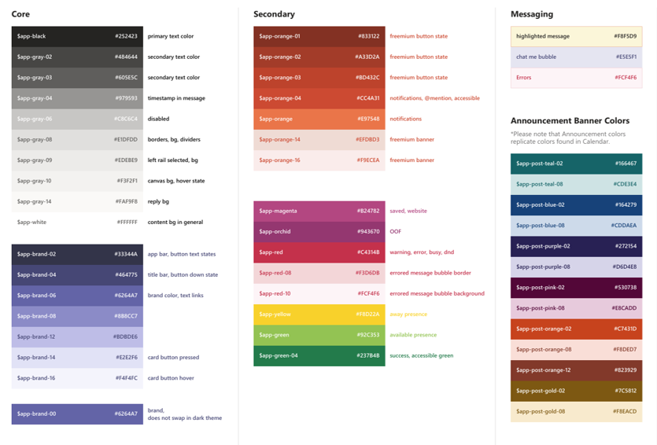
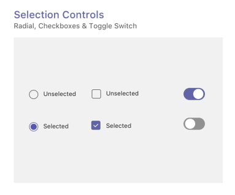

# Pestañas en dispositivos móvilesTabs on mobile

> [!NOTE]
> Si decide que la pestaña canal o grupo aparezca en los clientes móviles de Teams, la configuración debe tener un valor para la propiedad `setSettings()` `websiteUrl` (vea a continuación).If you choose to have your channel/group tab appear on Teams mobile clients, the `setSettings()` configuration must have a value for the `websiteUrl` property (see below).

Las pestañas personalizadas pueden formar parte de un canal, un chat de grupo o una aplicación personal (aplicaciones que contienen pestañas estáticas o un bot de uno a uno).Custom tabs can be part of a channel, group chat, or personal app (apps that contain static tabs and/or a one-to-one bot).

Las aplicaciones personales están disponibles en clientes móviles en el cajón de aplicaciones.Personal apps are available on mobile clients in the app drawer. La aplicación solo se puede instalar desde un cliente de escritorio o web y puede tardar hasta 24 horas en aparecer en clientes móviles.The app can only be installed from a desktop or web client, and can take up to 24 hours to appear on mobile clients. Como alternativa, puede aplicar una recarga en el cliente móvil al iniciar sesión.Alternatively, you can enforce a reload on the mobile client by signing out and in. Esto debería hacer que la aplicación móvil esté disponible de inmediato.This should make the mobile app available right away.

Las pestañas de canal también están disponibles en dispositivos móviles.Channel tabs are also available on mobile. Actualmente, el comportamiento predeterminado es usar la pestaña `websiteUrl` para iniciarla en una ventana del explorador.The default behavior is currently to use your `websiteUrl` to launch your tab in a browser window. Sin embargo, se pueden cargar en un cliente móvil haciendo clic en el menú desbordamiento situado junto a la pestaña y seleccionando Abrir , que usará la pestaña para cargarla dentro del cliente móvil `...` de  `contentUrl` Teams.However, they can be loaded on a mobile client by clicking the `...` overflow menu next to the tab and choosing **Open**, which will use your `contentUrl` to load the tab inside the Teams mobile client.

## Acceso a pestañas personalesAccessing personal tabs

En la siguiente ilustración se muestra cómo acceder a una pestaña personal en el móvil.The following illustration shows how you access a personal tab on mobile.

:::image type="content" source="../../assets/images/tabs/mobile-app-drawer.png" alt-text="Ilustración que muestra el cajón de la aplicación móvil de Teams." border="false":::

## Acceso a pestañas de canalAccessing channel tabs

En la siguiente ilustración se muestra cómo obtener acceso a una pestaña de canal en el móvil.The following illustration shows how you access a channel tab on mobile.

:::image type="content" source="../../assets/images/tabs/mobile-tab.png" alt-text="Ilustración que muestra una pestaña móvil de Teams." border="false":::

## Consideraciones sobre diseñoDesign considerations

Nuestra plataforma móvil permite que las aplicaciones sean una experiencia envolvente con el contenido de la aplicación que toma toda la pantalla aparte de la navegación principal de Teams.Our mobile platform allows apps to be an immersive experience with the app content taking up all of the screen apart from main Teams navigation. Para crear una experiencia envolvente que se adapte a Teams, siga estas directrices.To create an immersive experience that fits with Teams, follow these guidelines.

### Diseño dinámicoResponsive design

Dado que la pestaña se puede abrir en dispositivos con una amplia variedad de tamaños de pantalla, debe seguir los principios [de diseño](https://www.w3schools.com/html/html_responsive.asp) dinámico.Because your tab can be opened on devices with a wide range of screen sizes, it needs to follow [responsive design](https://www.w3schools.com/html/html_responsive.asp) principles. Todas las construcciones clave deben ser accesibles en dispositivos móviles y las vistas no deben distorsionarse.All of the key constructs should be accessible on mobile devices, and the views should not be distorted. Asegúrese de que cuando la pestaña se carga en un dispositivo móvil, todos los botones y vínculos son fácilmente accesibles mediante la navegación basada en los dedos.Ensure that when your tab is loaded on a mobile device, all buttons and links are easily accessible using finger-based navigation.

### DiseñosLayouts

Es importante elegir el diseño correcto para la pestaña.Choosing the correct layout for your tab is important. Debe tener en cuenta el tipo de información que está presentando y elegir un diseño que la organice para un consumo fácil.You should consider the kind of information you're presenting, and choose a layout that organizes it for easy consumption. A continuación se describen algunas opciones potenciales.Some potential options are outlined below.

#### Lienzo únicoSingle canvas

Este es un área grande donde se realiza el trabajo.This is one large area where work gets done. La aplicación Wiki de Teams sigue este patrón.The Teams Wiki app follows this pattern. Si tienes una aplicación que no separa el contenido en componentes más pequeños, sería un buen ajuste.If you have an app that doesn’t separate content into smaller components this would be a good fit.

:::image type="content" source="../../assets/images/tabs/mobile-tab-single-canvas.png" alt-text="Ilustración que muestra una pestaña de lienzo único móvil de Teams." border="false":::

#### ListaList

Las listas son excelentes para ordenar y filtrar grandes cantidades de datos y son excelentes para mantener las cosas más importantes en la parte superior.Lists are great for sorting and filtering large quantities of data and are great at keeping the most important things at the top. Es útil usar columnas que se pueden ordenar.It is helpful to use sortable columns. Las acciones se pueden agregar a cada elemento de lista en el menú de puntos suspensivos.Actions can be added to each list item under the ellipsis menu.

:::image type="content" source="../../assets/images/tabs/mobile-tab-list.png" alt-text="Ilustración que muestra una pestaña de lista móvil de Teams." border="false":::

#### CuadrículaGrid

Las cuadrículas son útiles para mostrar elementos que son altamente visuales.Grids are useful for showing elements which are highly visual. Ayuda a incluir un filtro o un control de búsqueda en la parte superior.It helps to include a filter or search control at the top.

:::image type="content" source="../../assets/images/tabs/mobile-tab-grid.png" alt-text="Ilustración que muestra una pestaña móvil de Teams con un diseño de cuadrícula." border="false":::

### Pestañas con bots en dispositivos móvilesTabs with bots on mobile

El siguiente ejemplo es una aplicación personal que tiene pestañas y un bot.The following example is a personal app that has tabs and a bot.

:::image type="content" source="../../assets/images/tabs/mobile-tab-with-bot.png" alt-text="Ilustración que muestra cómo la aplicación móvil de Teams que tiene pestañas y un bot." border="false":::

## Componentes de la interfaz de usuarioUI components

### Paletas de coloresColor palettes

El uso de nuestra paleta neutra aprobada para fondos, notificaciones, texto y botones ayudará a tu aplicación a sentirse más como en casa en Teams.Using our approved neutral palette for backgrounds, notifications, text, and buttons will help your app feel more at home in Teams. Dado que teams mobile tiene dos temas de color (claro y oscuro), es una buena idea asegurarse de que la aplicación tenga un aspecto excelente en ambos.Since Teams mobile has two colour themes (light and dark), it’s a good idea to make sure your app looks great in both.

#### Color claroLight color

#### Color oscuroDark color

### Botones y controlesButtons and controls

El estilo de los botones ayuda a comunicar el tipo de acción que desencadenan.The way buttons are styled helps communicate what kind of action they trigger. Mantenemos una amplia variedad de botones con formato para mostrar diferentes niveles de énfasis.We maintain a wide range of buttons that are formatted to show different levels of emphasis. Los botones pueden tener texto, un icono o una combinación de texto y un icono.Buttons can have text, an icon, or a combination of text and an icon. Para comunicar diferentes niveles en una jerarquía, diseñamos botones principales y secundarios dentro de cada categoría.To communicate different levels in a hierarchy, we designed primary and secondary buttons within each category.

#### BotonesButtons

Botones principales y secundarios.Primary and secondary buttons.

#### Controles de selecciónSelection controls

Botones de radio, casillas y alternancias.Radio buttons, checkboxes, and toggles.

#### Chiclets y pastillasChiclets and pills

### TipografíaTypography

La tipografía debe ser clara y con propósito.Typography should be clear and purposeful. Haga hincapié en la información importante y evite usar varias fuentes y tamaños para reducir la confusión.Emphasize important information and avoid using multiple fonts and sizes to reduce confusion. Se recomienda usar el caso de oración y evitar el uso de todos los límites para la localización y legibilidad.We recommend using sentence case and avoiding the usage of all caps for localization and legibility.

### Campos y desplegablesFields and flyouts

Los campos son áreas donde los usuarios pueden introducir texto.Fields are areas where users can input text. Los paneles desplegables son más ligeros que los cuadros de diálogo y aparecen en el panel superior.Flyouts are more lightweight than dialogs and appear from the top pane.

#### Enumerar controlesList controls

#### Controles de campoField controls

## Consideraciones de desarrolladorDeveloper considerations

Cuando crees una aplicación que incluya una pestaña, debes considerar (y probar) cómo funcionará la pestaña en los clientes de Microsoft Teams de Android e iOS.When you're building an app that includes a tab, you need to consider (and test) how your tab will function on both the Android and iOS Microsoft Teams clients. En las secciones siguientes se describen algunos de los escenarios clave que debe tener en cuenta.The sections below outline some of the key scenarios you need to consider.

### Pruebas en clientes móvilesTesting on mobile clients

Debes validar que la pestaña funciona correctamente en dispositivos móviles de distintos tamaños y calidades.You need to validate that your tab functions properly on mobile devices of various sizes and qualities. Para dispositivos Android, puedes usar [DevTools](~/tabs/how-to/developer-tools.md) para depurar la pestaña mientras se ejecuta.For Android devices, you can use the [DevTools](~/tabs/how-to/developer-tools.md) to debug your tab while it is running. Se recomienda probar tanto en dispositivos de alto y bajo rendimiento, como en una tableta.We recommend that you test on both high and low performing devices, as well as on a tablet.

### AutenticaciónAuthentication

Para que la autenticación funcione en clientes móviles, debe actualizar el SDK de JavaScript de Teams a la versión 1.4.1 como mínimo.For authentication to work on mobile clients, you must upgrade you Teams JavaScript SDK to at least version 1.4.1.

### Ancho de banda bajo y conexiones intermitentesLow bandwidth and intermittent connections

Los clientes móviles necesitan funcionar regularmente con un ancho de banda bajo y conexiones intermitentes.Mobile clients regularly need to function with low bandwidth and intermittent connections. La aplicación debe controlar los tiempos de espera correctamente proporcionando un mensaje contextual al usuario.Your app should handle any timeouts appropriately by providing a contextual message to the user. También debe usar indicadores de progreso del usuario para proporcionar comentarios a los usuarios sobre los procesos de larga ejecución.You should also user progress indicators to provide feedback to your users for any long-running processes.

> [!NOTE]
> Las pestañas solo se habilitan en dispositivos móviles después de agregar la aplicación a una lista de permitidos, en función de la entrada del equipo de aprobación.Tabs are enabled on mobile only after the application is added to an allow list, based on the input of the approval team. Para comprobar la capacidad de respuesta de los dispositivos móviles, llegue a teamsubm@microsoft.com.To check mobile responsiveness, reach out to teamsubm@microsoft.com. 
