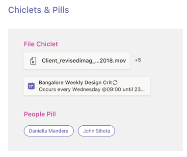

# Pestañas en dispositivos móviles

> [!NOTE]
> Si decide que la pestaña de canal o grupo aparezca en los clientes móviles de Teams, la configuración debe tener un valor para la propiedad `setSettings()` `websiteUrl` (vea a continuación).

Las pestañas personalizadas pueden formar parte de un canal, un chat en grupo o una aplicación personal (aplicaciones que contienen pestañas estáticas o un bot de uno a uno).

Las aplicaciones personales están disponibles en clientes móviles en el cajón de la aplicación. La aplicación solo se puede instalar desde un cliente de escritorio o web y puede tardar hasta 24 horas en aparecer en clientes móviles.

Las pestañas de canal también están disponibles en dispositivos móviles. Actualmente, el comportamiento predeterminado es usar la pestaña `websiteUrl` para iniciarla en una ventana del explorador. Sin embargo, se pueden cargar en un cliente móvil haciendo clic en el menú de desbordamiento situado junto a la pestaña y eligiendo Abrir , que usará para cargar la pestaña dentro del cliente móvil `...` de  `contentUrl` Teams.

## Acceso a pestañas personales

En la siguiente ilustración se muestra cómo obtener acceso a una pestaña personal en un dispositivo móvil.

:::image type="content" source="../../assets/images/tabs/mobile-app-drawer.png" alt-text="Ilustración que muestra el cajón de la aplicación móvil de Teams." border="false":::

## Acceso a pestañas de canal

En la siguiente ilustración se muestra cómo obtener acceso a una pestaña de canal en dispositivos móviles.

:::image type="content" source="../../assets/images/tabs/mobile-tab.png" alt-text="Ilustración que muestra una pestaña móvil de Teams." border="false":::

## Consideraciones sobre diseño

Nuestra plataforma móvil permite que las aplicaciones sean una experiencia envolvente con el contenido de la aplicación que toma toda la pantalla, aparte de la navegación principal de Teams. Para crear una experiencia envolvente que se ajuste a Teams, siga estas instrucciones.

### Diseño dinámico

Dado que la pestaña se puede abrir en dispositivos con una amplia gama de tamaños de pantalla, debe seguir los principios [de diseño dinámicos.](https://www.w3schools.com/html/html_responsive.asp) Todas las construcciones clave deben ser accesibles en dispositivos móviles y las vistas no deben distorsionarse. Asegúrate de que cuando la pestaña se carga en un dispositivo móvil, todos los botones y vínculos sean fácilmente accesibles mediante la navegación basada en el dedo.

### Diseños

Es importante elegir el diseño correcto para la pestaña. Debes tener en cuenta el tipo de información que presentas y elegir un diseño que la organice para facilitar el consumo. A continuación se describen algunas opciones posibles.

#### Lienzo único

Esta es una gran área donde se realiza el trabajo. La aplicación wiki de Teams sigue este patrón. Si tienes una aplicación que no separa el contenido en componentes más pequeños, sería una buena opción.

:::image type="content" source="../../assets/images/tabs/mobile-tab-single-canvas.png" alt-text="Ilustración que muestra una pestaña de lienzo único móvil de Teams." border="false":::

#### Lista

Las listas son excelentes para ordenar y filtrar grandes cantidades de datos y son excelentes para mantener lo más importante en la parte superior. Es útil usar columnas que se pueden ordenar. Las acciones se pueden agregar a cada elemento de lista en el menú de puntos suspensivos.

:::image type="content" source="../../assets/images/tabs/mobile-tab-list.png" alt-text="Ilustración que muestra una pestaña de lista móvil de Teams." border="false":::

#### Cuadrícula

Las cuadrículas son útiles para mostrar elementos que son altamente visuales. Ayuda a incluir un filtro o control de búsqueda en la parte superior.

:::image type="content" source="../../assets/images/tabs/mobile-tab-grid.png" alt-text="Ilustración que muestra una pestaña móvil de Teams con un diseño de cuadrícula." border="false":::

### Pestañas con bots en dispositivos móviles

El siguiente ejemplo es una aplicación personal que tiene pestañas y un bot.

:::image type="content" source="../../assets/images/tabs/mobile-tab-with-bot.png" alt-text="Ilustración que muestra cómo la aplicación móvil de Teams que tiene pestañas y un bot." border="false":::

## Componentes de la interfaz de usuario

### Paletas de colores

Usar nuestra paleta neutra aprobada para fondos, notificaciones, texto y botones ayudará a su aplicación a sentirse más como en casa en Teams. Dado que Teams para dispositivos móviles tiene dos temas de colores (claro y oscuro), es una buena idea asegurarse de que la aplicación tenga un aspecto excelente en ambos.

#### Color claro

#### Color oscuro

### Botones y controles

El estilo de los botones ayuda a comunicar el tipo de acción que desencadenan. Mantenemos una amplia gama de botones con formato para mostrar diferentes niveles de énfasis. Los botones pueden tener texto, un icono o una combinación de texto y un icono. Para comunicar distintos niveles en una jerarquía, hemos diseñado botones principales y secundarios dentro de cada categoría.

#### Botones

Botones principales y secundarios.

#### Controles de selección

Botones de radio, casillas y alternancias.

#### Gotalets y receptaciones

### Tipografía

La tipografía debe ser clara y con propósito. Enfatiza información importante y evita usar varias fuentes y tamaños para reducir la confusión. Se recomienda usar el caso de oración y evitar el uso de todas las mayúsculas para localización y legibilidad.

### Campos y menús desplegables

Los campos son áreas donde los usuarios pueden introducir texto. Los menús desplegables son más ligeros que los cuadros de diálogo y aparecen en el panel superior.

#### Enumerar controles

#### Controles de campo

## Consideraciones para desarrolladores

Cuando cree una aplicación que incluya una pestaña, debe tener en cuenta (y probar) cómo funcionará la pestaña en los clientes de Microsoft Teams para Android e iOS. En las secciones siguientes se describen algunos de los escenarios clave que debe tener en cuenta.

### Pruebas en clientes móviles

Debe validar que la pestaña funciona correctamente en dispositivos móviles de distintos tamaños y cualidades. Para dispositivos Android, puedes usar [DevTools para](~/tabs/how-to/developer-tools.md) depurar la pestaña mientras se ejecuta. Te recomendamos que pruebes tanto en dispositivos de alto y bajo rendimiento, como en una tableta.

### Autenticación

Para que la autenticación funcione en clientes móviles, debe actualizar el SDK de JavaScript de Teams a la versión 1.4.1 como mínimo.

### Ancho de banda bajo y conexiones intermitentes

Los clientes móviles necesitan funcionar regularmente con ancho de banda bajo y conexiones intermitentes. La aplicación debe controlar los tiempos de espera correctamente proporcionando un mensaje contextual al usuario. También debe incluir indicadores de progreso del usuario para proporcionar comentarios a los usuarios sobre los procesos de larga ejecución.

> [!NOTE]
> Las pestañas se habilitan en dispositivos móviles solo después de agregar la aplicación a una lista de permitidos, según la entrada del equipo de aprobación. Para comprobar la capacidad de respuesta de los dispositivos móviles, teamsubm@microsoft.com. 