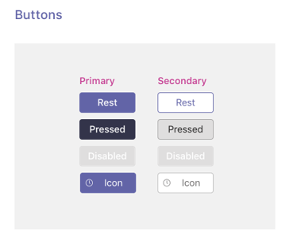

# Pestañas en dispositivos móviles

Puedes incluir pestañas en canales móviles de Teams, chats y aplicaciones personales.

## Acceso a pestañas personales

Puedes acceder a pestañas personales en el cajón de la aplicación.

:::image type="content" source="../../assets/images/tabs/mobile-app-drawer.png" alt-text="Ilustración que muestra el cajón de la aplicación móvil de Teams." border="false":::

## Acceso a pestañas de canal

Puedes acceder a las pestañas canal  y grupo seleccionando el botón Más en el canal o chat en el que se han agregado.

:::image type="content" source="../../assets/images/tabs/mobile-tab.png" alt-text="Ilustración que muestra una pestaña móvil de Teams." border="false":::

## Consideraciones sobre diseño

Nuestra plataforma móvil permite que las aplicaciones sean una experiencia envolvente con el contenido de la aplicación que toma toda la pantalla aparte de la navegación principal de Teams. Para crear una experiencia envolvente que se adapte a Teams, siga estas directrices.

### Diseño dinámico

Dado que la pestaña se puede abrir en dispositivos con una amplia variedad de tamaños de pantalla, debe seguir los principios [de diseño](https://www.w3schools.com/html/html_responsive.asp) dinámico. Todas las construcciones clave deben ser accesibles en dispositivos móviles y las vistas no deben distorsionarse. Asegúrese de que cuando la pestaña se carga en un dispositivo móvil, todos los botones y vínculos son fácilmente accesibles mediante la navegación basada en los dedos.

### Diseños

Es importante elegir el diseño correcto para la pestaña. Debe tener en cuenta el tipo de información que está presentando y elegir un diseño que la organice para un consumo fácil. A continuación se describen algunas opciones potenciales.

#### Lienzo único

Este es un área grande donde se realiza el trabajo. La aplicación Wiki de Teams sigue este patrón. Si tienes una aplicación que no separa el contenido en componentes más pequeños, sería un buen ajuste.

:::image type="content" source="../../assets/images/tabs/mobile-tab-single-canvas.png" alt-text="Ilustración que muestra una pestaña de lienzo único móvil de Teams." border="false":::

#### Lista

Las listas son excelentes para ordenar y filtrar grandes cantidades de datos y son excelentes para mantener las cosas más importantes en la parte superior. Es útil usar columnas que se pueden ordenar. Las acciones se pueden agregar a cada elemento de lista en el menú de puntos suspensivos.

:::image type="content" source="../../assets/images/tabs/mobile-tab-list.png" alt-text="Ilustración que muestra una pestaña de lista móvil de Teams." border="false":::

#### Cuadrícula

Las cuadrículas son útiles para mostrar elementos que son altamente visuales. Ayuda a incluir un filtro o un control de búsqueda en la parte superior.

:::image type="content" source="../../assets/images/tabs/mobile-tab-grid.png" alt-text="Ilustración que muestra una pestaña móvil de Teams con un diseño de cuadrícula." border="false":::

### Pestañas con bots en dispositivos móviles

El siguiente ejemplo es una aplicación personal que tiene pestañas y un bot.

:::image type="content" source="../../assets/images/tabs/mobile-tab-with-bot.png" alt-text="Ilustración que muestra cómo la aplicación móvil de Teams que tiene pestañas y un bot." border="false":::

## Componentes de la interfaz de usuario

### Paletas de colores

El uso de nuestra paleta neutra aprobada para fondos, notificaciones, texto y botones ayudará a tu aplicación a sentirse más como en casa en Teams. Dado que teams mobile tiene dos temas de color (claro y oscuro), es una buena idea asegurarse de que la aplicación tenga un aspecto excelente en ambos.

#### Color claro

#### Color oscuro

### Botones y controles

El estilo de los botones ayuda a comunicar el tipo de acción que desencadenan. Mantenemos una amplia variedad de botones con formato para mostrar diferentes niveles de énfasis. Los botones pueden tener texto, un icono o una combinación de texto y un icono. Para comunicar diferentes niveles en una jerarquía, diseñamos botones principales y secundarios dentro de cada categoría.

#### Botones

Botones principales y secundarios.

#### Controles de selección

Botones de radio, casillas y alternancias.

#### Chiclets y pastillas

### Tipografía

La tipografía debe ser clara y con propósito. Haga hincapié en la información importante y evite usar varias fuentes y tamaños para reducir la confusión. Se recomienda usar el caso de oración y evitar el uso de todos los límites para la localización y legibilidad.

### Campos y desplegables

Los campos son áreas donde los usuarios pueden introducir texto. Los paneles desplegables son más ligeros que los cuadros de diálogo y aparecen en el panel superior.

#### Enumerar controles

#### Controles de campo

## Consideraciones de desarrollador

Cuando crees una aplicación que incluya una pestaña, debes considerar (y probar) cómo funcionará la pestaña en los clientes de Microsoft Teams de Android e iOS. En las secciones siguientes se describen algunos de los escenarios clave que debe tener en cuenta.

### Autenticación

Para que la autenticación funcione en clientes móviles, debe actualizar el SDK de JavaScript de Teams a la versión 1.4.1 como mínimo.

### Ancho de banda bajo y conexiones intermitentes

Los clientes móviles necesitan funcionar regularmente con un ancho de banda bajo y conexiones intermitentes. La aplicación debe controlar los tiempos de espera correctamente proporcionando un mensaje contextual al usuario. También debe usar indicadores de progreso del usuario para proporcionar comentarios a los usuarios sobre los procesos de larga ejecución.

> [!NOTE]
> Las pestañas solo se habilitan en dispositivos móviles después de agregar la aplicación a una lista de permitidos, en función de la entrada del equipo de aprobación. Para comprobar la capacidad de respuesta de los dispositivos móviles, llegue a teamsubm@microsoft.com.

### Pruebas en clientes móviles

Debes validar que la pestaña funciona correctamente en dispositivos móviles de distintos tamaños y calidades. Para dispositivos Android, puedes usar [DevTools](~/tabs/how-to/developer-tools.md) para depurar la pestaña mientras se ejecuta. Se recomienda probar tanto en dispositivos de alto y bajo rendimiento, como en una tableta.

### Distribución

Las aplicaciones que aparecen en la tienda de Teams deben aprobarse para que el uso móvil funcione correctamente en el cliente móvil de Teams. El comportamiento de las pestañas depende de si la aplicación está aprobada.

#### Comportamiento de las pestañas canal y grupo

* **Comportamiento cuando se aprueba:** se abre en el cliente móvil de Teams con la configuración de la `contentUrl` aplicación.
* **Comportamiento cuando no se aprueba:** se abre en el explorador predeterminado del dispositivo mediante la configuración de la aplicación (que también debe incluirse en la función `websiteUrl` del código `setSettings()` fuente). Sin embargo, los usuarios aún pueden cargar la  pestaña en el cliente móvil de Teams seleccionando Más junto a la aplicación y **seleccionando Abrir**, que desencadena la configuración de la `contentUrl` aplicación.

#### Comportamiento de la aplicación personal

* **Comportamiento cuando se aprueba:** cada pestaña de la aplicación personal se muestra en el cliente móvil de Teams con su configuración `contentUrl` respectiva.
* **Comportamiento cuando no se aprueba:** la aplicación personal no está disponible en el cliente móvil de Teams.

#### Comportamiento de la aplicación de la tienda que no es de Teams

Si vas a descargar localmente la aplicación o publicarla en el catálogo de aplicaciones de una organización, el comportamiento de las pestañas será el mismo que las aplicaciones de la tienda de Teams aprobadas por Microsoft para dispositivos móviles.
