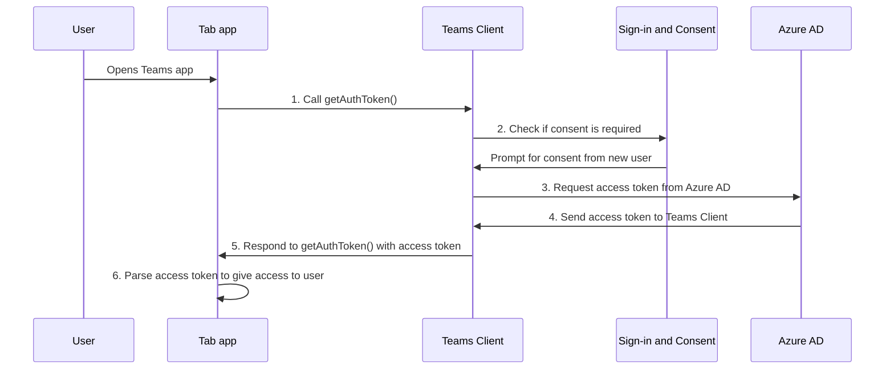

# Habilitación del inicio de sesión único para la aplicación de pestañas

<!--Single sign-on (SSO) allows a user to access an application or a web service after signing-in only once. The app users never have to go through authentication again.-->

Con el inicio de sesión único en Teams, los usuarios de la aplicación tienen la ventaja de usar Teams para acceder a las aplicaciones. Después de iniciar sesión en Teams con la cuenta de Microsoft o Microsoft 365, los usuarios de la aplicación pueden usar la aplicación sin necesidad de volver a iniciar sesión. La aplicación está disponible para los usuarios de la aplicación en cualquier dispositivo con acceso concedido a través de Azure AD.

Esto es lo que aprenderá en esta sección:

1. **Experiencia de usuario de SSO**: Teams ofrece a los usuarios de la aplicación una experiencia de SSO verdadera. Los usuarios de la aplicación pueden usar la aplicación sin volver a iniciar sesión.
2. **Inicio de sesión único en Teams en tiempo de ejecución**: la aplicación de pestaña interactúa con Azure AD en tiempo de ejecución para la autenticación y autorización de una sola vez para los usuarios de la aplicación.
3. **Habilitar sso para la aplicación de pestaña**: implemente las tareas implicadas para implementar el inicio de sesión único en la aplicación de pestaña.

## Experiencia de usuario de SSO en Teams

Los usuarios de la aplicación inician sesión en Teams con una cuenta microsoft personal o una cuenta de Microsoft 365. Puede aprovechar esto y usar el inicio de sesión único para autenticar y autorizar a los usuarios de la aplicación.

&nbsp;&nbsp;&nbsp;&nbsp;:::image type="content" source="../../../assets/images/authentication/teams-sso-tabs/teams-sso-ux.png" alt-text="Experiencia de usuario de SSO en una aplicación de pestaña de Teams" border="false":::

- Teams autentica y almacena la identidad de su usuario de aplicación.
- La aplicación de pestaña usa la identidad almacenada del usuario de la aplicación que ya está validada por Teams.
- El usuario de la aplicación debe dar su consentimiento a Teams para usar la identidad a la que acceder para usar la aplicación de pestaña.
- El usuario de la aplicación puede acceder a la aplicación en el cliente web, de escritorio o móvil.

Puede ver aquí un ejemplo de experiencia de usuario con sso en una aplicación de pestaña:

:::image type="content" source="../../../assets/images/authentication/teams-sso-tabs/sso-tab.gif" alt-text="Inicio de sesión único en la aplicación de pestaña":::

### Mejora de la experiencia del usuario con el inicio de sesión único

Esto es lo que obtienen los usuarios de la aplicación con la experiencia de SSO:

- Teams obtiene el token de acceso para el usuario de la aplicación actual de Azure AD. Esta interacción con Azure AD es invisible para el usuario de la aplicación. Se traduce en obtener acceso a la aplicación sin tener que salir del entorno de Teams.
- Un usuario de la aplicación solo debe dar su consentimiento en un entorno multiinquilino. Si el usuario de la aplicación y la aplicación residen en el mismo inquilino, el usuario de la aplicación no tiene que dar su consentimiento para usar la aplicación.
- Después de dar su consentimiento a Teams la primera vez, el usuario de la aplicación puede usar la aplicación sin necesidad de consentimiento adicional, incluso en cualquier otro dispositivo. Por este motivo, ofrece una mejor experiencia de usuario.
  - Como alternativa, el administrador de inquilinos puede conceder el consentimiento en nombre de los usuarios de la aplicación. En este escenario, cuando el administrador de inquilinos da su consentimiento a los usuarios de la aplicación en el inquilino, no es necesario solicitar consentimiento a los usuarios de la aplicación. Esto significa que los usuarios de la aplicación no ven los diálogos de consentimiento y pueden acceder a la aplicación sin problemas.
- Teams captura previamente el token de acceso para mejorar el rendimiento y el tiempo de carga de la aplicación en el entorno de Teams.
- Los usuarios de la aplicación no necesitan memorizar ni registrar varias contraseñas para acceder y usar aplicaciones en el entorno de Teams.

> [!NOTE]
> Los usuarios de la aplicación no pueden conceder permiso a algunos ámbitos de permisos, como `Sites.ReadWrite.All`, que permite al usuario de la aplicación leer y escribir en todos los recursos de SharePoint y OneDrive del inquilino. Para estos ámbitos, solo el administrador de inquilinos que conceda consentimiento en nombre de un usuario de la aplicación.

Ahora, veamos lo que sucede en el back-end durante el tiempo de ejecución para lograr la experiencia de SSO en Teams.

## Inicio de sesión único en Teams en tiempo de ejecución

Para lograr el inicio de sesión único en una aplicación de pestaña, obtenga el token de acceso para el usuario de la aplicación de Teams que ha iniciado sesión actualmente. Este proceso implica el cliente y el servidor de la aplicación de pestaña, el cliente de Teams y Azure AD. Durante esta interacción, el usuario de la aplicación debe dar su consentimiento para usar la identidad de Teams para obtener el token de acceso en un entorno multiinquilino.

En la imagen siguiente se muestra cómo funciona el inicio de sesión único cuando un usuario de la aplicación de Teams intenta acceder a la aplicación de pestaña:

:::image type="content" source="../../../assets/images/authentication/teams-sso-tabs/sso-runtime-seqd.png" alt-text="Diagrama de inicio de sesión único de tab single sign-on" border="false" lightbox="../../../assets/images/authentication/teams-sso-tabs/sso-runtime-seqd.png":::

| # | Interacción | Qué pasa |
| --- | --- | --- |
| 1  | Aplicación de tabulación → cliente de Teams | La aplicación de pestaña realiza una llamada de JavaScript a `getAuthToken()`, que indica a Teams que obtenga un token de acceso. |
| 2  | Cliente de Teams → Azure AD | Teams solicita al punto de conexión de Azure AD el token de acceso para el usuario de la aplicación actual en función de la identidad de Teams. |
| 3  | Formulario de consentimiento → de Azure AD | Si el usuario actual de la aplicación usa la aplicación de pestaña por primera vez, Teams muestra la solicitud de consentimiento si la aplicación necesita acceder a algunos datos protegidos. El usuario de la aplicación (o el administrador) debe dar su consentimiento a Teams para usar la identidad de Teams del usuario de la aplicación para obtener el token de acceso de Azure AD.   Como alternativa, hay un mensaje de solicitud para controlar la autenticación de paso a paso, como la autenticación en dos fases. |
| 4  | Cliente de Teams de Azure AD → | Azure AD envía el token de acceso al cliente de Teams. El token es un token web JSON (JWT) y su validación funciona igual que la validación de tokens en la mayoría de los flujos estándar de OAuth. Teams almacena en caché el token en su nombre para que las llamadas futuras devuelvan `getAuthToken()` el token almacenado en caché. |
| 5  | Cliente de Teams → cliente de la aplicación Tab | Teams envía el token de acceso a la aplicación de pestaña como parte del objeto de resultado devuelto por la `getAuthToken()` llamada. |
| 6  | Aplicación de tabulación (entre el servidor de & cliente) | La aplicación de pestaña analiza el token de acceso mediante JavaScript para extraer la información necesaria, como la dirección de correo electrónico del usuario de la aplicación. El token devuelto a la aplicación de pestaña es un token de acceso y un token de identidad. |

Para obtener más información, consulte [Actualización de código para habilitar el inicio de sesión único](tab-sso-code.md).

> [!IMPORTANT]
> `getAuthToken()` solo es válido para dar su consentimiento a un conjunto limitado de API de nivel de usuario, como correo electrónico, perfil, offline_access y OpenId. No se usa para otros ámbitos de Graph, como `User.Read` o `Mail.Read`. Para obtener soluciones alternativas sugeridas, consulte [Extensión de la aplicación con permisos de Microsoft Graph](tab-sso-graph-api.md).

Las pestañas son páginas web compatibles con Teams. Para habilitar el inicio de sesión único en una página web hospedada dentro de una aplicación de pestaña, agregue [el SDK de cliente Javascript de Teams](/javascript/api/overview/msteams-client?view=msteams-client-js-latest&preserve-view=true) y llame a `microsoftTeams.initialize()`. Después de la inicialización, llame `microsoftTeams.getAuthToken()` a para obtener el token de acceso de la aplicación.

### Casos de uso para habilitar el inicio de sesión único

Puede habilitar el inicio de sesión único en Teams para todas las aplicaciones que admiten Azure AD como proveedor de identidades. Además de usar el inicio de sesión único para autenticar a los usuarios de la aplicación en una aplicación de pestaña, también puede usarlo para habilitar el acceso sin problemas en Teams.

Algunos escenarios en los que puede usar la API de SSO para autenticar a los usuarios de la aplicación son:

- Si desea autenticar a los usuarios de la aplicación en una aplicación de pestaña de Teams, la API de SSO permite a los usuarios de la aplicación usar la aplicación en Teams sin necesidad de autenticación adicional. En función de la identidad de Teams del usuario de la aplicación, puede obtener el token de acceso para ellos desde Azure AD.
- Si la aplicación usa un módulo de tareas desde un bot, una pestaña, una extensión de mensaje o tarjetas adaptables, puede usar la API de SSO para autenticar a los usuarios de la aplicación.
- También puede usar la API de SSO para autenticar a los usuarios de la aplicación que quieran acceder a la vista Stage sin necesidad de volver a validarla.

> [!TIP]
> También puede usar la API de SSO para autenticar a los usuarios de la aplicación en [módulos de tareas](../../../task-modules-and-cards/what-are-task-modules.md) que insertan contenido web.

Para lograr el inicio de sesión único en tiempo de ejecución, configure la aplicación para habilitar el inicio de sesión único para autenticar y autorizar a los usuarios de la aplicación.

## Habilitación del inicio de sesión único para una aplicación de pestaña

En esta sección se describen las tareas implicadas en la implementación del inicio de sesión único para una aplicación de pestaña. Estas tareas son independientes del lenguaje y del marco.

Para habilitar el inicio de sesión único para una aplicación de pestaña:

&nbsp;&nbsp;&nbsp;&nbsp;&nbsp;:::image type="content" source="../../../assets/images/authentication/teams-sso-tabs/enable-sso.png" alt-text="Pasos para habilitar el inicio de sesión único para la pestaña" border="false" lightbox="../../../assets/images/authentication/teams-sso-tabs/enable-sso.png":::

1. **Registro con Azure AD**: cree una aplicación de Azure AD para generar un identificador de aplicación y un URI de identificador de aplicación. Para generar el token de acceso, configure ámbitos y autorice aplicaciones cliente de confianza.
2. **Actualizar código**: agregue el código para controlar el token de acceso, llamando `getAuthToken()` cuando un usuario de la aplicación acceda a la aplicación de pestaña, enviando este token al código de servidor de la aplicación en el encabezado Autorización y validando el token de acceso cuando se reciba.
3. **Actualizar manifiesto de aplicación de Teams**: actualice el manifiesto de la aplicación cliente de Teams con el identificador de aplicación y el URI de identificador de aplicación generados en Azure AD para permitir que Teams solicite tokens de acceso en nombre de la aplicación.

## Cookies de terceros en iOS

Después de la actualización de iOS 14, Apple ha bloqueado el acceso [a cookies de terceros](https://webkit.org/blog/10218/full-third-party-cookie-blocking-and-more/) para todas las aplicaciones de forma predeterminada. Por lo tanto, las aplicaciones que aprovechan cookies de terceros para la autenticación en sus pestañas Canal o Chat y Aplicaciones personales no podrán completar sus flujos de trabajo de autenticación en clientes iOS de Teams. Para cumplir con los requisitos de privacidad y seguridad, debe pasar a un sistema basado en tokens o usar cookies propias para los flujos de trabajo de autenticación de usuario.

### Soporte técnico para clientes móviles de Teams

En el caso de los dispositivos móviles de Teams, las versiones de cliente que admiten el inicio de sesión único son:

- Teams para Android (1416/1.0.0.2020073101 y versiones posteriores)
- Teams para iOS (versión: 2.0.18 y versiones posteriores)  
- SDK de JavaScript de Teams (versión: 1.11 y versiones posteriores) para que el inicio de sesión único funcione en el panel lateral de la reunión

Para la mejor experiencia con Teams, use la última versión de iOS y Android.

## Procedimientos recomendados

Esta es una lista de procedimientos recomendados:

- **Llame al token de acceso solo cuando lo necesite**: llame `getAuthToken()` solo cuando necesite un token de acceso. Puede llamarlo cuando un usuario de la aplicación acceda a la aplicación de pestaña o para usar una función determinada que requiera la validación del usuario de la aplicación.
- **No almacene el token de acceso en el código del lado cliente**: no almacene en caché ni almacene el token de acceso en el código del lado cliente de la aplicación. El cliente de Teams almacena en caché el token de acceso (o solicita uno nuevo si expira). Esto garantiza que no haya ninguna pérdida accidental del token desde la aplicación web.
- **Usar código del lado servidor para las llamadas de Microsoft Graph**: use siempre el código del lado servidor para realizar llamadas a Microsoft Graph u otras llamadas que requieran pasar un token de acceso. Nunca devuelva el token OBO al cliente para permitir que el cliente realice llamadas directas a Microsoft Graph. Esto ayuda a proteger el token de ser interceptado o filtrado. Para obtener más información, consulte [Extensión de la aplicación de pestaña con permisos y ámbito de Microsoft Graph](tab-sso-graph-api.md).

## Limitaciones conocidas

- Actualmente, el inicio de sesión único en Teams solo admite el token de OAuth 2.0. No admite el token SAML.
- No se admiten varios dominios por aplicación. Para obtener más información, consulte [Aplicaciones LOB](tab-sso-register-aad.md#before-you-register-with-azure-ad).

## Paso siguiente

> [!div class="nextstepaction"]
> [Registro de la aplicación de pestaña en Azure AD](tab-sso-register-aad.md)

## Consulte también

[Configuración del código para habilitar el inicio de sesión único en una aplicación de pestaña](tab-sso-code.md)

<!--
### Use cases for enabling SSO for tab app

Here are some use cases where enabling SSO is beneficial. Call `getAuthToken()` in these scenarios to use Teams identity for obtaining access token for your app users:

- To get an app user’s identity from Teams if you have an existing app that you want to be available within a tab app in Teams.

- To authenticate an app user by reusing the Team’s identity inside your tab app.

- To authenticate and get an app user’s Teams identity inside configurable tabs. The app users don't need to sign in again. It's applicable to some settings that need to be configured at a configuration stage.

- To obtain an access token inside a task module, when it's invoked from a tab app, a bot app, a messaging extension app, or adaptive cards.

- To authenticate an app user in Stage view.

- To authenticate users for [task modules](../../../task-modules-and-cards/what-are-task-modules.md) that embed web content.
-->

<!--

-->

<!--
- Tenant admin consent: A simple way of [consenting on behalf of an organization as a tenant admin](/azure/active-directory/develop/v2-permissions-and-consent.md#requesting-consent-for-an-entire-tenant) is by getting [consent from admin](/azure/active-directory/manage-apps/grant-admin-consent).
  
    You can ask for consent using the Auth API. Another approach for getting Graph scopes is to present a consent dialog using our existing [third party OAuth provider authentication approach](~/tabs/how-to/authentication/auth-tab-aad.md#navigate-to-the-authorization-page-from-your-pop-up-page). This approach involves popping up an Azure AD consent dialog box.

  

  
To ask for additional consent using the Auth API, follow these steps:

    1. The token retrieved using `getAuthToken()` must be exchanged on the server-side using Azure AD [on-behalf-of flow (OBO)](/azure/active-directory/develop/v2-oauth2-on-behalf-of-flow) to get access to those other Graph APIs. Ensure you use the v2 Graph endpoint for this exchange.
    2. If the exchange fails, Azure AD returns an invalid grant exception. It usually responds with one of the two error messages, `invalid_grant` or `interaction_required`.
    3. When the exchange fails, you must ask for consent. Use the user interface (UI) to ask the app user to grant other consent. This UI must include a button that triggers an Azure AD consent dialog using [Silent authentication](~/concepts/authentication/auth-silent-aad.md).
    4. When asking for more consent from Azure AD, you must include `prompt=consent` in your [query-string-parameter](~/tabs/how-to/authentication/auth-silent-aad.md#get-the-user-context) to Azure AD, otherwise Azure AD wouldn't ask for other scopes.

        - Instead of `?scope={scopes}`, use `?prompt=consent&scope={scopes}`
        - Ensure that `{scopes}` includes all the scopes you're prompting the user for, for example, `Mail.Read` or `User.Read`.
    5. After the app user has granted more permissions, retry the OBO flow to get access to these other APIs.

    

-->
<!--
- If you want your existing app to be available within a Teams tab app, the SSO API allows your signed-in app users to use your app in Teams with no additional authentication needed. Based on the app user's Teams identity, you can obtain access token for them from Azure AD.
- If your app has configurable tabs, you can use `getAuthToken()` to allow app users into the tab app without signing in again. SSO is applicable to some settings that need to be configured at a configuration stage.
- Your app may have a bot, a tab, a message extension, or Adaptive Cards, and allows your app users to invoke task module from within a tab or a bot. The SSO API will authenticate your app users who attempt to access the task module. Teams can use the app user's Teams identity and obtain an access token from Azure AD.

- You can also use the SSO API for authenticating your app users who want to access to Stage view without need to be validated again. The access token obtained for the app user when they first used your app can be used to allow them to use Stage view. -->
