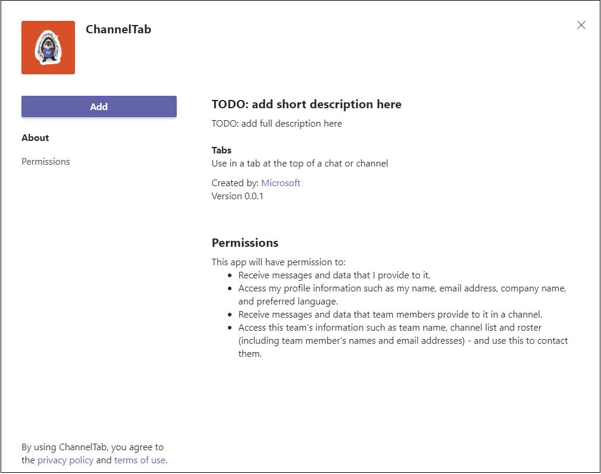

# <a name="create-a-channel-or-group-tab"></a>Crear una pestaña de canal o grupo

## <a name="create-a-custom-channel-or-group-tab"></a>Crear una pestaña de grupo o canal personalizado

Puede crear una pestaña de canal o grupo mediante Node.js Yeoman Generator, ASP.NETCore o ASP.NETCore MVC.

# <a name="nodejs"></a>[Node.js](#tab/nodejs)

### <a name="create-a-custom-channel-and-group-tab-using-nodejs-and-the-yeoman-generator"></a>Crear un canal personalizado y una pestaña de grupo con Node.js y el generador de Yeoman

> [!NOTE]
> En este artículo se describen los pasos descritos en la compilación El primer [wiki](https://github.com/OfficeDev/generator-teams/wiki/Build-Your-First-Microsoft-Teams-App) de Microsoft Teams aplicación que se encuentra en el repositorio GitHub Microsoft OfficeDev.

Puede crear una pestaña de canal o grupo personalizada mediante [el generador Teams Yeoman](https://github.com/OfficeDev/generator-teams/).

### <a name="prerequisites-for-apps"></a>Requisitos previos para aplicaciones

Debe comprender los siguientes requisitos previos:

- Debes tener un inquilino Office 365 y un equipo configurado con **Permitir la carga de aplicaciones personalizadas** habilitada. Para obtener más información, [vea prepare your Office 365 tenant](~/concepts/build-and-test/prepare-your-o365-tenant.md).

    > [!NOTE]
    > Si actualmente no tiene una cuenta Office 365, puede registrarse para obtener una suscripción gratuita a través del programa Office 365 desarrolladores. La suscripción permanece activa siempre que la esté usando para el desarrollo continuo. Vea [welcome to the Office 365 Developer Program](/office/developer-program/microsoft-365-developer-program).

Además, este proyecto requiere que tenga lo siguiente instalado en el entorno de desarrollo:

- Cualquier editor de texto o IDE. Puede instalar y [usar](https://code.visualstudio.com/download) Visual Studio Code de forma gratuita.

- [Node.js/npm](https://nodejs.org/en/). Use la versión LTS más reciente. El nodo Administrador de paquetes (npm) se instala en el sistema con la instalación de Node.js.

- Después de instalar correctamente Node.js, instale los paquetes [Yeoman](https://yeoman.io/) y [gulp-cli](https://www.npmjs.com/package/gulp-cli) especificando lo siguiente en el símbolo del sistema:

    ```bash
    npm install yo gulp-cli --global
    ```

- Instale el generador Microsoft Teams aplicaciones mediante la introducción de lo siguiente en el símbolo del sistema:

    ```bash
    npm install generator-teams --global
    ```

### <a name="generate-your-project"></a>Generar el proyecto

**Para generar el proyecto**

1. En un símbolo del sistema, cree un nuevo directorio para el proyecto de pestaña.

1. Para iniciar el generador, vaya al nuevo directorio y escriba el siguiente comando:

    ```bash
    yo teams
    ```

1. A continuación, proporcione una serie de valores que se usan en el archivo **manifest.json** de la aplicación:

    

    **¿Cómo se llama su solución?**

    Este es el nombre del proyecto. Puede aceptar el nombre sugerido seleccionando la **tecla** Entrar.

    **¿Dónde desea ubicar los archivos?**

    Actualmente se encuentra en el directorio del proyecto. Seleccione **Entrar**.

    **¿Título de tu Microsoft Teams de aplicación?**

    Este es el nombre del paquete de la aplicación y se usará en el manifiesto y la descripción de la aplicación. Escriba un título o **seleccione Entrar** para aceptar el nombre predeterminado.

    **¿Su nombre (empresa)? (máximo 32 caracteres)**

    El nombre de la empresa se usará en el manifiesto de la aplicación. Escriba un nombre de empresa o **seleccione Entrar** para aceptar el nombre predeterminado.

    **¿Qué versión de manifiesto le gustaría usar?**

    Seleccione el esquema predeterminado.

    **¿Scaffolding rápido? (Y/n)**

    El valor predeterminado es sí; escriba **n** para escribir su Id. de partner de Microsoft.

    **Escriba su id. de partner de Microsoft, si tiene uno. (Dejar en blanco para omitir)**

    Este campo no es necesario y solo debe usarse si ya forma parte de [la red de partners de Microsoft](https://partner.microsoft.com).

    **¿Qué desea agregar al proyecto?**

    Seleccione **( ) Una &ast; pestaña**.

    **¿La dirección URL donde hospedará esta solución?**

    De forma predeterminada, el generador sugiere una dirección URL de Sitios web de Azure. Solo estás probando la aplicación localmente, por lo tanto, no es necesaria una dirección URL válida.

    **¿Desea mostrar un indicador de carga cuando se carga la aplicación o pestaña?**

    Elige **no incluir** un indicador de carga cuando se cargue la aplicación o la pestaña. El valor predeterminado es no, escriba **n**.

   **¿Desea que las aplicaciones personales se representen sin una barra de encabezado de pestaña?**

    Elige **no incluir** aplicaciones personales que se representarán sin una barra de encabezado de pestaña. El valor predeterminado es no, escriba **n**.

    **¿Desea incluir el marco de pruebas y las pruebas iniciales? (y/N)**

    Elija **no incluir** un marco de prueba para este proyecto. El valor predeterminado es sí; escriba **n**.

    **¿Desea usar azure applications Ideas para telemetría? (y/N)**

    Elija **no incluir** la aplicación de Azure [Ideas](/azure/azure-monitor/app/app-insights-overview). El valor predeterminado es no; escriba **n**.

    **Nombre de tabulación predeterminado (máximo 16 caracteres)?**

    Asigne un nombre a la pestaña. Este nombre de pestaña se usará en todo el proyecto como un componente de ruta de acceso de dirección URL o archivo.

    **¿Qué tipo de tab le gustaría crear?**

    Use las teclas de flecha para seleccionar **Ficha Configurable.**

    **¿Qué ámbitos tiene previsto usar para la pestaña?**

    Puede seleccionar un equipo o un chat de grupo.

    **¿Necesita compatibilidad con el inicio de sesión único de Azure AD para la pestaña?**

    Elija **no** incluir la Azure AD inicio de sesión único para la pestaña. El valor predeterminado es sí, escriba **n**.

    **¿Desea que esta pestaña esté disponible en SharePoint Online? (Y/n)**

    Escriba **n**.

    > [!IMPORTANT]
    > El componente de ruta **de acceso yourDefaultTabNameTab**, es el valor que escribió en el generador para **Default Tab Name** y la palabra **Tab**.
    >
    > Por ejemplo: DefaultTabName: **MyTab**  >  **/MyTabTab/**

1. En Visual Studio Code o cualquier editor de código, vaya al directorio del proyecto y abra el siguiente archivo:

    ```bash
    ./src/app/scripts/<yourDefaultTabNameTab>/<yourDefaultTabNameTab>.tsx
    ```

1. Busque el `render()` método y agregue la siguiente etiqueta y contenido a la parte superior del código `<div>` `<PanelBody>` contenedor:

    ```html
        <PanelBody>
            <div style={styles.section}>
                Hello World! Yo Teams rocks!
            </div>
        </PanelBody>
    ```

1. Asegúrese de guardar el archivo actualizado.

### <a name="build-and-run-your-application"></a>Compilar y ejecutar la aplicación

En un símbolo del sistema, abra el directorio del proyecto para completar las siguientes tareas.

#### <a name="create-the-app-package"></a>Crear el paquete de la aplicación

Debes tener un paquete de aplicación para probar la pestaña en Teams. Es una carpeta zip que contiene los siguientes archivos necesarios:

- Un **icono de color completo** que mide 192 x 192 píxeles.
- Un **icono de esquema transparente** que mide 32 x 32 píxeles.
- Un **archivo manifest.json** que especifica los atributos de la aplicación.

El paquete se crea a través de una tarea gulp que valida el archivo manifest.json y genera la carpeta zip en **el directorio ./package**. En el símbolo del sistema, escriba el siguiente comando:

```bash
gulp manifest
```

#### <a name="build-your-application"></a>Compilar la aplicación

El comando build transpila la solución en la **carpeta ./dist.** Escriba el siguiente comando en el símbolo del sistema:

```bash
gulp build
```

#### <a name="run-your-application-in-localhost"></a>Ejecutar la aplicación en localhost

1. Para iniciar un servidor web local, escriba lo siguiente en el símbolo del sistema:

    ```bash
    gulp serve
    ```

1. Escriba `http://localhost:3007/<yourDefaultAppNameTab>/` en el explorador, **reemplacedefaultAppNameTab** por el nombre de la pestaña y vea la página principal de la aplicación como se muestra en la siguiente imagen:

    

1. Para ver la página de configuración de pestañas, vaya a `https://localhost:3007/<yourDefaultAppNameTab>/config.html` . Se muestra lo siguiente:

    

### <a name="establish-a-secure-tunnel-to-your-tab"></a>Establecer un túnel seguro en la pestaña

Microsoft Teams es un producto basado en la nube y requiere que el contenido de la pestaña esté disponible desde la nube mediante puntos de conexión HTTPS. Teams no permite el hospedaje local. Debe publicar la pestaña en una dirección URL pública o usar un proxy que exponga el puerto local a una dirección URL orientada a Internet.

Para probar la extensión de pestaña, [use ngrok](https://ngrok.com/docs), que está integrado en esta aplicación. Ngrok es una herramienta de software de proxy inverso que crea un túnel a los puntos de conexión HTTPS del servidor web que se ejecuta localmente. Los puntos de conexión web del servidor están disponibles durante la sesión actual en el equipo. Cuando el equipo se apaga o deja de estar en modo de suspensión, el servicio ya no está disponible.

En el símbolo del sistema, salga de localhost y escriba lo siguiente:

```bash
gulp ngrok-serve
```

> [!IMPORTANT]
> Después de cargar la pestaña en Microsoft Teams y guardarla correctamente, puede verlo en la galería de pestañas, agregarla a la barra de pestañas e interactuar con ella hasta que finalice la sesión del túnel ngrok. Si reinicias la sesión de ngrok, debes actualizar la aplicación con la nueva dirección URL.

### <a name="upload-your-application-to-teams"></a>Upload la aplicación a Teams

**Para cargar la aplicación en Teams**

1. Vaya a Microsoft Teams. Si usa la versión [basada en web,](https://teams.microsoft.com) puede inspeccionar el código front-end con las herramientas para [desarrolladores del explorador.](~/tabs/how-to/developer-tools.md)
1. En los equipos del panel izquierdo, seleccione los puntos suspensivos &#x25CF;&#x25CF;&#x25CF; junto al equipo que está usando para probar la pestaña y elija **Administrar equipo**.
1. En el panel principal, selecciona **Aplicaciones** en la barra de pestañas y Upload **una** aplicación personalizada ubicada en la esquina inferior derecha de la página.
1. Vaya al directorio del proyecto, vaya a **la carpeta ./package,** seleccione la carpeta zip del paquete de la aplicación y elija **Abrir**.

    

1. Seleccione **Agregar** en el cuadro de diálogo emergente. La pestaña se carga en Teams.
1. Vuelva a su equipo, elija el canal donde desea mostrar la pestaña, seleccione ➕ en la barra de pestañas y elija la pestaña en la galería.
1. Siga las instrucciones para agregar una pestaña. Hay un cuadro de diálogo de configuración personalizado para la pestaña canal o grupo.
1. Selecciona **Guardar** y la pestaña se agrega a la barra de pestañas del canal.

    

# <a name="aspnet-core"></a>[ASP.NET Core](#tab/aspnetcore)

### <a name="create-a-custom-channel-or-group-tab-with-aspnet-core"></a>Crear una pestaña de canal o grupo personalizada con ASP.NET Core

Puede crear una pestaña de canal o grupo personalizada mediante C# y ASP.Net página de Core Razor. [App Studio para Microsoft Teams](~/concepts/build-and-test/app-studio-overview.md) también se usa para finalizar el manifiesto de la aplicación e implementar la pestaña en Teams.

### <a name="prerequisites-for-teams-apps"></a>Requisitos previos para Teams aplicaciones

Debe comprender los siguientes requisitos previos:

- Debes tener un inquilino Office 365 y un equipo configurado con **Permitir la carga de aplicaciones personalizadas** habilitada. Para obtener más información, [vea prepare your Office 365 tenant](~/concepts/build-and-test/prepare-your-o365-tenant.md).

    > [!NOTE]
    > Si actualmente no tiene una cuenta Microsoft 365, puede registrarse para obtener una suscripción gratuita a través del [Programa para desarrolladores de Microsoft](https://developer.microsoft.com/en-us/microsoft-365/dev-program). La suscripción permanece activa siempre que la esté usando para el desarrollo continuo.

- Usa App Studio para importar la aplicación a Teams. Para instalar App Studio, selecciona **Aplicación** de la Tienda de aplicaciones en la esquina inferior izquierda de la aplicación Teams y busca  **Studio**. Después de encontrar el icono, selecciónelo y elija **Agregar** en el cuadro de diálogo emergente para instalarlo.

Además, este proyecto requiere que tenga lo siguiente instalado en el entorno de desarrollo:

- La versión actual del IDE Visual Studio con la carga de trabajo de desarrollo **multiplataforma de .NET CORE** instalada. Si aún no tiene Visual Studio, puede descargar e instalar la última [Microsoft Visual Studio Community](https://visualstudio.microsoft.com/downloads) versión gratuita.

- La herramienta de proxy [inverso ngrok.](https://ngrok.com) Use ngrok para crear un túnel para los puntos de conexión HTTPS del servidor web que se ejecuta localmente. Puede descargar [ngrok](https://ngrok.com/download).

### <a name="get-the-source-code"></a>Obtener el código fuente

En un símbolo del sistema, cree un nuevo directorio para el proyecto de pestaña. Se proporciona un proyecto sencillo para empezar. Clone el repositorio de ejemplo en el nuevo directorio con el siguiente comando:

```bash
git clone https://github.com/OfficeDev/microsoft-teams-sample-tabs.git
```

Como alternativa, puede recuperar el código fuente descargando la carpeta zip y extrayendo los archivos.

**Para compilar y ejecutar el proyecto de tabulación**

1. Después de tener el código fuente, vaya **a** Visual Studio y seleccione Abrir un proyecto o solución .
1. Vaya al directorio de la aplicación de tabulación y abra **ChannelGroupTab.sln**.
1. Para compilar y ejecutar la aplicación, presione **F5** o **elija Iniciar depuración** en el **menú** Depurar.
1. En un explorador, vaya a las siguientes direcciones URL y compruebe que la aplicación se cargó correctamente:

    - `http://localhost:44355`
    - `http://localhost:44355/privacy`
    - `http://localhost:44355/tou`

### <a name="review-the-source-code"></a>Revisar el código fuente

#### <a name="startupcs"></a>Startup.cs

Este proyecto se creó a partir de una plantilla vacía ASP.NET Core aplicación web 2.2 con la casilla Avanzadas **- Configurar** para HTTPS activada en el programa de instalación. Los servicios MVC están registrados por el método del marco de inserción de `ConfigureServices()` dependencias. Además, la plantilla vacía no habilita el servicio de contenido estático de forma predeterminada, por lo que el middleware de archivos estáticos se agrega al método `Configure()` con el código siguiente:

```csharp
public void ConfigureServices(IServiceCollection services)
  {
    services.AddMvc().SetCompatibilityVersion(CompatibilityVersion.Version_2_2);
  }
public void Configure(IApplicationBuilder app)
  {
    app.UseStaticFiles();
    app.UseMvc();
  }
```

#### <a name="wwwroot-folder"></a>carpeta wwwroot

En ASP.NET Core, la carpeta raíz web es donde la aplicación busca archivos estáticos.

#### <a name="indexcshtml"></a>Index.cshtml

ASP.NET Core trata los archivos denominados **Index** como la página predeterminada o principal del sitio. Cuando la dirección URL del explorador apunta a la raíz del sitio, **Index.cshtml** se muestra como la página principal de la aplicación.

#### <a name="tabcs"></a>Tab.cs

Este C# contiene un método al que se llama desde **Tab.cshtml durante** la configuración.

#### <a name="appmanifest-folder"></a>Carpeta AppManifest

Esta carpeta contiene los siguientes archivos de paquete de aplicación necesarios:

- Un **icono de color completo** que mide 192 x 192 píxeles.
- Un **icono de esquema transparente** que mide 32 x 32 píxeles.
- Un **archivo manifest.json** que especifica los atributos de la aplicación.

Estos archivos deben comprimirse en un paquete de aplicación para usarlos al cargar la pestaña a Teams. Cuando un usuario elige agregar o actualizar la pestaña, Microsoft Teams carga el especificado en el manifiesto, lo inserta en un IFrame y lo representa en `configurationUrl` la pestaña.

#### <a name="csproj"></a>.csproj

En la Visual Studio Explorador de soluciones, haga clic con el botón secundario en el proyecto y seleccione **Editar Project archivo**. Al final del archivo, verá el siguiente código que crea y actualiza la carpeta zip cuando se compila la aplicación:

```xml
<PropertyGroup>
    <PostBuildEvent>powershell.exe Compress-Archive -Path \"$(ProjectDir)AppManifest\*\" -DestinationPath \"$(TargetDir)tab.zip\" -Force</PostBuildEvent>
  </PropertyGroup>

  <ItemGroup>
    <EmbeddedResource Include="AppManifest\icon-outline.png">
      <CopyToOutputDirectory>Always</CopyToOutputDirectory>
    </EmbeddedResource>
    <EmbeddedResource Include="AppManifest\icon-color.png">
      <CopyToOutputDirectory>Always</CopyToOutputDirectory>
    </EmbeddedResource>
    <EmbeddedResource Include="AppManifest\manifest.json">
      <CopyToOutputDirectory>Always</CopyToOutputDirectory>
    </EmbeddedResource>
  </ItemGroup>
```

### <a name="establish-a-secure-tunnel-to-your-tab-for-teams"></a>Establecer un túnel seguro en la pestaña para Teams

Microsoft Teams es un producto basado en la nube y requiere que el contenido de la pestaña esté disponible desde la nube mediante puntos de conexión HTTPS. Teams no permite el hospedaje local. Debe publicar la pestaña en una dirección URL pública o usar un proxy que exponga el puerto local a una dirección URL orientada a Internet.

Para probar la pestaña, use [ngrok](https://ngrok.com/docs). Los puntos de conexión web del servidor están disponibles mientras ngrok se ejecuta en el equipo. En la versión gratuita de ngrok, si cierra ngrok, las direcciones URL son diferentes la próxima vez que la inicie.

- En un símbolo del sistema en la raíz del directorio del proyecto, ejecute el siguiente comando:

    ```bash
    ngrok http https://localhost:44355 -host-header="localhost:44355"
    ```

- Ngrok escucha las solicitudes de Internet y las enruta a la aplicación cuando se ejecuta en el puerto 44355. Debe ser similar `https://y8rCgT2b.ngrok.io/` a **donde y8rCgT2b** se reemplaza por la dirección URL HTTPS alfanumérico de ngrok.

- Asegúrese de mantener el símbolo del sistema con ngrok en ejecución y de tomar nota de la dirección URL.

### <a name="update-your-application"></a>Actualizar la aplicación

En **Tab.cshtml,** la aplicación presenta al usuario dos botones de opción para mostrar la pestaña con un icono rojo o gris. Al elegir los  **desencadenadores de los** botones Seleccionar gris o Seleccionar rojo o , respectivamente, se establece y se habilita el botón `saveGray()` Guardar en la página de `saveRed()` `settings.setValidityState(true)` configuración.  Este código permite Teams que ha completado los requisitos de configuración y la instalación puede continuar. Los parámetros de `settings.setSettings` se establecen. Por último, se llama para indicar que la dirección URL de `saveEvent.notifySuccess()` contenido se ha resuelto correctamente.

#### <a name="_layoutcshtml"></a>_Layout.cshtml

Para que la pestaña se muestre en Teams, debe incluir el SDK de cliente Microsoft Teams **JavaScript** e incluir una llamada después de `microsoftTeams.initialize()` que se cargue la página. Así se comunican la pestaña y Teams cliente:

Vaya a la **carpeta Shared,** abra **_Layout.cshtml** y agregue lo siguiente a la `<head>` etiqueta:

```html
<script src="https://ajax.aspnetcdn.com/ajax/jQuery/jquery-3.4.1.min.js"></script>
<script src="https://statics.teams.cdn.office.net/sdk/v1.6.0/js/MicrosoftTeams.min.js"></script>
```

> [!IMPORTANT]
> No copie ni pegue las direcciones URL de esta página, ya que `<script src="...">` no representan la versión más reciente. Para obtener la versión más reciente del SDK, vaya siempre [a Microsoft Teams API de JavaScript](https://www.npmjs.com/package/@microsoft/teams-js).

#### <a name="tabcshtml"></a>Tab.cshtml

**Para actualizar Tab.cshtml**

1. Abra **Tab.cshtml** en Visual Studio y actualice el `<script>` archivo .

1. En la parte superior del script, llame `microsoftTeams.initialize()` a .

1. Actualice los `websiteUrl` valores y de cada función con la dirección URL de https `contentUrl` ngrok a la pestaña.

    El código ahora debe incluir lo siguiente con **y8rCgT2b** reemplazado por la dirección URL de ngrok:

    ```javascript
        microsoftTeams.initialize();

        let saveGray = () => {
            microsoftTeams.settings.registerOnSaveHandler(function (saveEvent) {
                microsoftTeams.settings.setSettings({
                    websiteUrl: `https://y8rCgT2b.ngrok.io`,
                    contentUrl: `https://y8rCgT2b.ngrok.io/gray/`,
                    entityId: "grayIconTab",
                    suggestedDisplayName: "MyNewTab"
                });
                saveEvent.notifySuccess();
            });
        }

        let saveRed = () => {
            microsoftTeams.settings.registerOnSaveHandler(function (saveEvent) {
                microsoftTeams.settings.setSettings({
                    websiteUrl: `https://y8rCgT2b.ngrok.io`,
                    contentUrl: `https://y8rCgT2b.ngrok.io/red/`,
                    entityId: "redIconTab",
                    suggestedDisplayName: "MyNewTab"
                });
                saveEvent.notifySuccess();
        });
        }
    ```

1. Guarde el **tab.cshtml actualizado.**

### <a name="build-and-run-your-application-for-teams"></a>Cree y ejecute la aplicación para Teams

**Para compilar y ejecutar la aplicación**

1. En Visual Studio, presione **F5** o **elija Iniciar depuración** en el **menú** Depurar.
1. Compruebe que **ngrok** se está ejecutando y funcionando correctamente abriendo el explorador y yendo a la página de contenido a través de la dirección URL HTTPS de ngrok que se proporcionó en la ventana del símbolo del sistema.

> [!TIP]
> Debe tener la aplicación en ejecución Visual Studio y ngrok para completar los pasos proporcionados en este artículo. Si necesita dejar de ejecutar la aplicación en Visual Studio para trabajar en ella, **mantenga ngrok en ejecución**. Escucha y reanuda el enrutamiento de la solicitud de la aplicación cuando se reinicia en Visual Studio. Si tiene que reiniciar el servicio ngrok, devuelve una nueva dirección URL y tiene que actualizar la aplicación con la nueva dirección URL.

### <a name="upload-your-tab-for-teams"></a>Upload la pestaña para Teams

> [!NOTE]
> App Studio se puede usar para editar el **archivo manifest.json** y cargar el paquete completado en Teams. También puede editar manualmente el **archivo manifest.json.** Si lo hace, asegúrese de volver a crear la solución para crear el **archivotab.zip** cargar.

**Para cargar la pestaña con App Studio**

1. Vaya a Microsoft Teams. Si usa la versión [basada en web,](https://teams.microsoft.com)puede inspeccionar el código front-end con las herramientas para [desarrolladores del explorador.](~/tabs/how-to/developer-tools.md)

1. Ve a **App Studio** y selecciona la pestaña Editor **de manifiestos.**

1. Selecciona **Importar una aplicación existente en** el editor de **manifiestos** para empezar a actualizar el paquete de la aplicación para la pestaña. El código fuente viene con su propio manifiesto parcialmente completo. El nombre del paquete de la **aplicación estab.zip**. Está disponible en la siguiente ruta de acceso:

    ```bash
    /bin/Debug/netcoreapp2.2/tab.zip
    ```

1. Upload **tab.zip** a App Studio.

#### <a name="update-your-app-package-with-manifest-editor"></a>Actualizar el paquete de la aplicación con el editor de manifiestos

Después de cargar el paquete de la aplicación en App Studio, debes configurarlo.

Seleccione el icono de la pestaña recién importada en el panel derecho de la página de bienvenida del editor de manifiesto.

Hay una lista de pasos en el lado izquierdo del editor de manifiesto y, a la derecha, una lista de propiedades que deben tener valores para cada uno de esos pasos. El **manifest.json** ha proporcionado gran parte de la información, pero hay campos que debe actualizar.

##### <a name="details-app-details"></a>Detalles: Detalles de la aplicación

En la **sección Detalles de la** aplicación:

1. En **Identificación**, seleccione **Generar** para reemplazar el identificador de marcador de posición con el GUID necesario para la pestaña.

1. En **Información para desarrolladores,** actualice **el** sitio web con la dirección URL HTTPS de **ngrok.**

1. En **Direcciones URL de la** aplicación, actualice la declaración **privacidad** y `https://<yourngrokurl>/privacy` los **Términos** de uso `https://<yourngrokurl>/tou` para>.

##### <a name="capabilities-tabs"></a>Capacidades: pestañas

En la **sección Pestañas:**

1. En **la pestaña Equipo,** **seleccione Agregar**.

1. En la **ventana emergente de la pestaña** Equipo, actualice la dirección URL de **configuración** a `https://<yourngrokurl>/tab` .

1. Asegúrese de **que las casillas ¿Puede** actualizar la configuración? , **Equipo** y **Chat** de grupo están seleccionadas y **seleccione Guardar**.

##### <a name="finish-domains-and-permissions"></a>Finalizar: dominios y permisos

En la **sección Dominios y permisos,** los dominios de las **pestañas** deben contener la dirección URL de ngrok sin el prefijo HTTPS `<yourngrokurl>.ngrok.io/` .

##### <a name="finish-test-and-distribute"></a>Finalizar: probar y distribuir

> [!IMPORTANT]
> A la derecha, en **Descripción,** verá la siguiente advertencia:
>
> &#9888; "**La matriz 'validDomains' no puede contener un sitio de túnel...**"
>
> Esta advertencia puede omitirse mientras se prueba la pestaña.

1. En la **sección Probar y distribuir,** seleccione **Instalar**.

1. En el cuadro de diálogo emergente, seleccione **Agregar a un** equipo o en la lista desplegable, seleccione Agregar a un **chat.**

1. Elija el equipo o el chat donde desea que se muestre la pestaña y seleccione **Configurar una pestaña**.

1. En el siguiente cuadro de diálogo emergente, elija **Seleccionar gris** o **Seleccionar** rojo y seleccione **Guardar**.

1. Para ver la pestaña, vaya al equipo o al chat donde instaló la pestaña y selecciónelo en la barra de pestañas. Se muestra la página que eligió durante la configuración.

    

# <a name="aspnet-core-mvc"></a>[ASP.NET Core MVC](#tab/aspnetcoremvc)

### <a name="create-a-custom-channel-or-group-tab-with-aspnet-core-mvc"></a>Crear una pestaña de canal o grupo personalizada con ASP.NET Core MVC

Puede crear una pestaña de canal o grupo personalizada mediante C# y ASP.Net Core MVC. [App Studio para Microsoft Teams](~/concepts/build-and-test/app-studio-overview.md) también se usa para finalizar el manifiesto de la aplicación e implementar la pestaña en Teams.

### <a name="prerequisites-for-custom-channel-or-group-tab"></a>Requisitos previos para la pestaña de canal o grupo personalizada

- Debes tener un inquilino Microsoft 365 y un equipo configurado con **Permitir la carga de aplicaciones personalizadas** habilitada. Para obtener más información, [vea prepare your Office 365 tenant](~/concepts/build-and-test/prepare-your-o365-tenant.md).

    > [!NOTE]
    > Si actualmente no tiene una cuenta Microsoft 365, puede registrarse para obtener una suscripción gratuita a través del [Programa para desarrolladores de Microsoft](https://developer.microsoft.com/en-us/microsoft-365/dev-program). La suscripción permanece activa siempre que la esté usando para el desarrollo continuo.

- Usa App Studio para importar la aplicación a Teams. Para instalar App Studio, selecciona **Aplicación** de la Tienda de aplicaciones en la esquina inferior izquierda de la aplicación Teams y busca  **Studio**. Después de encontrar el icono, selecciónelo y elija **Agregar** en el cuadro de diálogo emergente para instalarlo.

Además, este proyecto requiere que tenga lo siguiente instalado en el entorno de desarrollo:

- La versión actual del IDE Visual Studio con la carga de trabajo de desarrollo **multiplataforma de .NET CORE** instalada. Si aún no tiene Visual Studio, puede descargar e instalar la última [Microsoft Visual Studio Community](https://visualstudio.microsoft.com/downloads) versión gratuita.

- La herramienta de proxy [inverso ngrok.](https://ngrok.com) Use ngrok para crear un túnel para los puntos de conexión HTTPS del servidor web que se ejecuta localmente. Puede descargar [ngrok](https://ngrok.com/download).

### <a name="get-the-source-code"></a>Obtener el código fuente

En un símbolo del sistema, cree un nuevo directorio para el proyecto de pestaña. Se proporciona [un proyecto de pestaña de](https://github.com/OfficeDev/microsoft-teams-sample-tabs/tree/master/ChannelGroupTabMVC) grupo de canales sencillo para empezar. Clone el repositorio de ejemplo en el nuevo directorio con el siguiente comando:

```bash
git clone https://github.com/OfficeDev/microsoft-teams-sample-tabs.git
```

Como alternativa, puede recuperar el código fuente descargando la carpeta zip y extrayendo los archivos.

**Para compilar y ejecutar el proyecto de tabulación**

1. Después de tener el código fuente, vaya **a** Visual Studio y seleccione Abrir un proyecto o solución .
1. Vaya al directorio de la aplicación de tabulación y abra **ChannelGroupTabMVC.sln**.
1. Para compilar y ejecutar la aplicación, presione **F5** o **elija Iniciar depuración** en el **menú** Depurar.
1. En un explorador, vaya a las siguientes direcciones URL y compruebe que la aplicación se cargó correctamente:

    - `http://localhost:44360`
    - `http://localhost:44360/privacy`
    - `http://localhost:44360/tou`

### <a name="review-the-source-code"></a>Revisar el código fuente

#### <a name="startupcs"></a>Startup.cs

Este proyecto se creó a partir de una plantilla vacía ASP.NET Core aplicación web 2.2 con la casilla Avanzadas **- Configurar** para HTTPS activada en el programa de instalación. Los servicios MVC están registrados por el método del marco de inserción de `ConfigureServices()` dependencias. Además, la plantilla vacía no habilita el servicio de contenido estático de forma predeterminada, por lo que el middleware de archivos estáticos se agrega al método `Configure()` con el código siguiente:

```csharp
public void ConfigureServices(IServiceCollection services)
  {
    services.AddMvc().SetCompatibilityVersion(CompatibilityVersion.Version_2_2);
  }
public void Configure(IApplicationBuilder app)
  {
    app.UseStaticFiles();
    app.UseMvc();
  }
```

#### <a name="wwwroot-folder"></a>carpeta wwwroot

En ASP.NET Core, la carpeta raíz web es donde la aplicación busca archivos estáticos.

#### <a name="appmanifest-folder"></a>Carpeta AppManifest

Esta carpeta contiene los siguientes archivos de paquete de aplicación necesarios:

- Un **icono de color completo** que mide 192 x 192 píxeles.
- Un **icono de esquema transparente** que mide 32 x 32 píxeles.
- Un **archivo manifest.json** que especifica los atributos de la aplicación.

Estos archivos deben comprimirse en un paquete de aplicación para usarlos al cargar la pestaña a Teams.

#### <a name="csproj"></a>.csproj

En la Visual Studio Explorador de soluciones, haga clic con el botón secundario en el proyecto y seleccione **Editar Project archivo**. Al final del archivo, verá el siguiente código que crea y actualiza la carpeta zip cuando se compila la aplicación:

```xml
<PropertyGroup>
    <PostBuildEvent>powershell.exe Compress-Archive -Path \"$(ProjectDir)AppManifest\*\" -DestinationPath \"$(TargetDir)tab.zip\" -Force</PostBuildEvent>
  </PropertyGroup>

  <ItemGroup>
    <EmbeddedResource Include="AppManifest\icon-outline.png">
      <CopyToOutputDirectory>Always</CopyToOutputDirectory>
    </EmbeddedResource>
    <EmbeddedResource Include="AppManifest\icon-color.png">
      <CopyToOutputDirectory>Always</CopyToOutputDirectory>
    </EmbeddedResource>
    <EmbeddedResource Include="AppManifest\manifest.json">
      <CopyToOutputDirectory>Always</CopyToOutputDirectory>
    </EmbeddedResource>
  </ItemGroup>
```

#### <a name="models"></a>Modelos

**ChannelGroup.cs** presenta un objeto Message y métodos a los que se llamará desde los controladores durante la configuración.

#### <a name="views"></a>Vistas

Estas son las diferentes vistas de ASP.NET Core MVC:

* Inicio: ASP.NET Core trata los archivos denominados **Index** como la página predeterminada o principal del sitio. Cuando la dirección URL del explorador apunta a la raíz del sitio, **Index.cshtml** se mostrará como la página principal de la aplicación.

* Shared: el marcado de vista **parcial _Layout.cshtml** contiene la estructura de página general de la aplicación y los elementos visuales compartidos. También hará referencia a la Teams biblioteca.

#### <a name="controllers"></a>Controladores

Los controladores usan la `ViewBag` propiedad para transferir valores dinámicamente a las vistas.

[!INCLUDE [dotnet-ngrok-intro](~/includes/tabs/dotnet-ngrok-intro.md)]

* Abra un símbolo del sistema en la raíz del directorio del proyecto y ejecute el siguiente comando:

    ```bash
    ngrok http https://localhost:443560 -host-header="localhost:44360"
    ```

* Ngrok escuchará las solicitudes de Internet y las enrutará a la aplicación cuando se ejecute en el puerto 44355. Debe ser similar `https://y8rCgT2b.ngrok.io/` a **donde y8rCgT2b** se reemplaza por la dirección URL HTTPS alfanumérico de ngrok.

* Asegúrese de mantener el símbolo del sistema con ngrok en ejecución y de tomar nota de la dirección URL.

### <a name="update-your-application"></a>Actualizar la aplicación

En **Tab.cshtml,** la aplicación presenta al usuario dos botones de opción para mostrar la pestaña con un icono rojo o gris. Al elegir el **botón Seleccionar gris** o **seleccionar** rojo, los desencadenadores o , respectivamente, establece y habilita el botón Guardar en la página `saveGray()` de `saveRed()` `settings.setValidityState(true)` configuración.  Este código permite Teams que ha completado los requisitos de configuración y la instalación puede continuar. Al guardar, se establecen los `settings.setSettings` parámetros de. Por último, se llama para indicar que la dirección URL de `saveEvent.notifySuccess()` contenido se ha resuelto correctamente.

[!INCLUDE [dotnet-update-app](~/includes/tabs/dotnet-update-chan-grp-app.md)]

---

## <a name="next-step"></a>Paso siguiente

> [!div class="nextstepaction"]
> [Creación de una página de contenido](~/tabs/how-to/create-tab-pages/content-page.md)

## <a name="see-also"></a>Consulte también

* [Teams pestañas](~/tabs/what-are-tabs.md)
* [Crear una pestaña personal](~/tabs/how-to/create-personal-tab.md)
* [Pestañas en dispositivos móviles](~/tabs/design/tabs-mobile.md)
* [Compilar pestañas con tarjetas adaptables](~/tabs/how-to/build-adaptive-card-tabs.md)
* [Crear una página de eliminación](~/tabs/how-to/create-tab-pages/removal-page.md)
