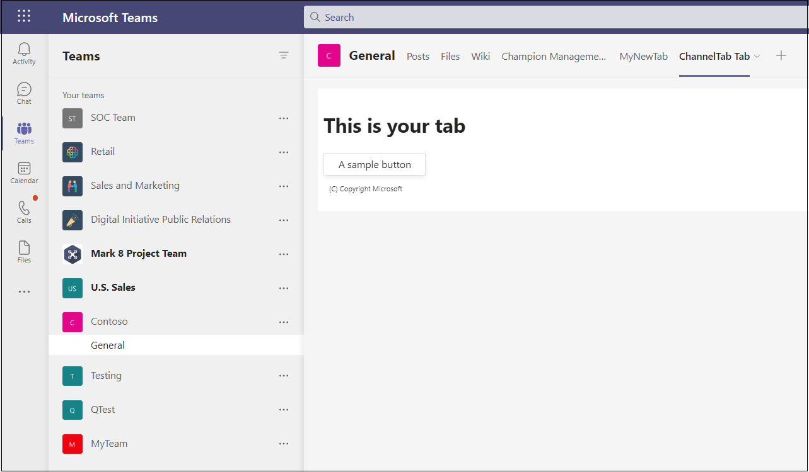

# <a name="create-a-channel-or-group-tab"></a><span data-ttu-id="ba5d9-103">Crear una pestaña de canal o grupo</span><span class="sxs-lookup"><span data-stu-id="ba5d9-103">Create a channel or group tab</span></span>

## <a name="create-a-custom-channel-or-group-tab"></a><span data-ttu-id="ba5d9-104">Crear una pestaña de grupo o canal personalizado</span><span class="sxs-lookup"><span data-stu-id="ba5d9-104">Create a custom channel or group tab</span></span>

<span data-ttu-id="ba5d9-105">Puede crear una pestaña de canal o grupo mediante Node.js Yeoman Generator, ASP.NETCore o ASP.NETCore MVC.</span><span class="sxs-lookup"><span data-stu-id="ba5d9-105">You can create a channel or group tab using Node.js and the Yeoman Generator, ASP.NETCore, or ASP.NETCore MVC.</span></span>

# <a name="nodejs"></a>[<span data-ttu-id="ba5d9-106">Node.js</span><span class="sxs-lookup"><span data-stu-id="ba5d9-106">Node.js</span></span>](#tab/nodejs)

### <a name="create-a-custom-channel-and-group-tab-using-nodejs-and-the-yeoman-generator"></a><span data-ttu-id="ba5d9-107">Crear un canal personalizado y una pestaña de grupo con Node.js y el generador de Yeoman</span><span class="sxs-lookup"><span data-stu-id="ba5d9-107">Create a custom channel and group tab using Node.js and the Yeoman Generator</span></span>

> [!NOTE]
> <span data-ttu-id="ba5d9-108">En este artículo se describen los pasos descritos en la compilación El primer [wiki](https://github.com/OfficeDev/generator-teams/wiki/Build-Your-First-Microsoft-Teams-App) de Microsoft Teams aplicación que se encuentra en el repositorio GitHub Microsoft OfficeDev.</span><span class="sxs-lookup"><span data-stu-id="ba5d9-108">This article follows the steps outlined in the [build Your first Microsoft Teams app](https://github.com/OfficeDev/generator-teams/wiki/Build-Your-First-Microsoft-Teams-App) Wiki found in the Microsoft OfficeDev GitHub repository.</span></span>

<span data-ttu-id="ba5d9-109">Puede crear una pestaña de canal o grupo personalizada mediante [el generador Teams Yeoman](https://github.com/OfficeDev/generator-teams/).</span><span class="sxs-lookup"><span data-stu-id="ba5d9-109">You can create a custom channel or group tab using the [Teams Yeoman generator](https://github.com/OfficeDev/generator-teams/).</span></span>

### <a name="prerequisites-for-apps"></a><span data-ttu-id="ba5d9-110">Requisitos previos para aplicaciones</span><span class="sxs-lookup"><span data-stu-id="ba5d9-110">Prerequisites for apps</span></span>

<span data-ttu-id="ba5d9-111">Debe comprender los siguientes requisitos previos:</span><span class="sxs-lookup"><span data-stu-id="ba5d9-111">You must have an understanding of the following prerequisites:</span></span>

- <span data-ttu-id="ba5d9-112">Debes tener un inquilino Office 365 y un equipo configurado con **Permitir la carga de aplicaciones personalizadas** habilitada.</span><span class="sxs-lookup"><span data-stu-id="ba5d9-112">You must have an Office 365 tenant and a team configured with **Allow uploading custom apps** enabled.</span></span> <span data-ttu-id="ba5d9-113">Para obtener más información, [vea prepare your Office 365 tenant](~/concepts/build-and-test/prepare-your-o365-tenant.md).</span><span class="sxs-lookup"><span data-stu-id="ba5d9-113">For more information, see [prepare your Office 365 tenant](~/concepts/build-and-test/prepare-your-o365-tenant.md).</span></span>

    > [!NOTE]
    > <span data-ttu-id="ba5d9-114">Si actualmente no tiene una cuenta Office 365, puede registrarse para obtener una suscripción gratuita a través del programa Office 365 desarrolladores.</span><span class="sxs-lookup"><span data-stu-id="ba5d9-114">If you do not currently have an Office 365 account, you can sign up for a free subscription through the Office 365 Developer Program.</span></span> <span data-ttu-id="ba5d9-115">La suscripción permanece activa siempre que la esté usando para el desarrollo continuo.</span><span class="sxs-lookup"><span data-stu-id="ba5d9-115">The subscription remains active as long as you are using it for ongoing development.</span></span> <span data-ttu-id="ba5d9-116">Vea [welcome to the Office 365 Developer Program](/office/developer-program/microsoft-365-developer-program).</span><span class="sxs-lookup"><span data-stu-id="ba5d9-116">See [welcome to the Office 365 Developer Program](/office/developer-program/microsoft-365-developer-program).</span></span>

<span data-ttu-id="ba5d9-117">Además, este proyecto requiere que tenga lo siguiente instalado en el entorno de desarrollo:</span><span class="sxs-lookup"><span data-stu-id="ba5d9-117">In addition, this project requires that you have the following installed in your development environment:</span></span>

- <span data-ttu-id="ba5d9-118">Cualquier editor de texto o IDE.</span><span class="sxs-lookup"><span data-stu-id="ba5d9-118">Any text editor or IDE.</span></span> <span data-ttu-id="ba5d9-119">Puede instalar y [usar](https://code.visualstudio.com/download) Visual Studio Code de forma gratuita.</span><span class="sxs-lookup"><span data-stu-id="ba5d9-119">You can install and use [Visual Studio Code](https://code.visualstudio.com/download) for free.</span></span>

- <span data-ttu-id="ba5d9-120">[Node.js/npm](https://nodejs.org/en/).</span><span class="sxs-lookup"><span data-stu-id="ba5d9-120">[Node.js/npm](https://nodejs.org/en/).</span></span> <span data-ttu-id="ba5d9-121">Use la versión LTS más reciente.</span><span class="sxs-lookup"><span data-stu-id="ba5d9-121">Use the latest LTS version.</span></span> <span data-ttu-id="ba5d9-122">El nodo Administrador de paquetes (npm) se instala en el sistema con la instalación de Node.js.</span><span class="sxs-lookup"><span data-stu-id="ba5d9-122">The Node Package Manager (npm) installs in your system with the installation of Node.js.</span></span>

- <span data-ttu-id="ba5d9-123">Después de instalar correctamente Node.js, instale los paquetes [Yeoman](https://yeoman.io/) y [gulp-cli](https://www.npmjs.com/package/gulp-cli) especificando lo siguiente en el símbolo del sistema:</span><span class="sxs-lookup"><span data-stu-id="ba5d9-123">After you have successfully installed Node.js, install the [Yeoman](https://yeoman.io/) and [gulp-cli](https://www.npmjs.com/package/gulp-cli) packages by entering the following in your command prompt:</span></span>

    ```bash
    npm install yo gulp-cli --global
    ```

- <span data-ttu-id="ba5d9-124">Instale el generador Microsoft Teams aplicaciones mediante la introducción de lo siguiente en el símbolo del sistema:</span><span class="sxs-lookup"><span data-stu-id="ba5d9-124">Install the Microsoft Teams Apps generator by entering the following in your command prompt:</span></span>

    ```bash
    npm install generator-teams --global
    ```

### <a name="generate-your-project"></a><span data-ttu-id="ba5d9-125">Generar el proyecto</span><span class="sxs-lookup"><span data-stu-id="ba5d9-125">Generate your project</span></span>

<span data-ttu-id="ba5d9-126">**Para generar el proyecto**</span><span class="sxs-lookup"><span data-stu-id="ba5d9-126">**To generate your project**</span></span>

1. <span data-ttu-id="ba5d9-127">En un símbolo del sistema, cree un nuevo directorio para el proyecto de pestaña.</span><span class="sxs-lookup"><span data-stu-id="ba5d9-127">At a command prompt, create a new directory for your tab project.</span></span>

1. <span data-ttu-id="ba5d9-128">Para iniciar el generador, vaya al nuevo directorio y escriba el siguiente comando:</span><span class="sxs-lookup"><span data-stu-id="ba5d9-128">To start the generator, go to your new directory and type the following command:</span></span>

    ```bash
    yo teams
    ```

1. <span data-ttu-id="ba5d9-129">A continuación, proporcione una serie de valores que se usan en el archivo demanifest.js **aplicación:**</span><span class="sxs-lookup"><span data-stu-id="ba5d9-129">Next, provide a series of values that are used in your application's **manifest.json** file:</span></span>

    

    <span data-ttu-id="ba5d9-131">**¿Cuál es el nombre de la solución?**</span><span class="sxs-lookup"><span data-stu-id="ba5d9-131">**What is your solution name?**</span></span>

    <span data-ttu-id="ba5d9-132">Este es el nombre del proyecto.</span><span class="sxs-lookup"><span data-stu-id="ba5d9-132">This is your project name.</span></span> <span data-ttu-id="ba5d9-133">Puede aceptar el nombre sugerido seleccionando la **tecla** Entrar.</span><span class="sxs-lookup"><span data-stu-id="ba5d9-133">You can accept the suggested name by selecting the **Enter** key.</span></span>

    <span data-ttu-id="ba5d9-134">**¿Dónde desea ubicar los archivos?**</span><span class="sxs-lookup"><span data-stu-id="ba5d9-134">**Where do you want to place the files?**</span></span>

    <span data-ttu-id="ba5d9-135">Actualmente se encuentra en el directorio del proyecto.</span><span class="sxs-lookup"><span data-stu-id="ba5d9-135">You are currently in your project directory.</span></span> <span data-ttu-id="ba5d9-136">Seleccione **Entrar**.</span><span class="sxs-lookup"><span data-stu-id="ba5d9-136">Select **Enter**.</span></span>

    <span data-ttu-id="ba5d9-137">**¿Título de tu Microsoft Teams de aplicación?**</span><span class="sxs-lookup"><span data-stu-id="ba5d9-137">**Title of your Microsoft Teams app project?**</span></span>

    <span data-ttu-id="ba5d9-138">Este es el nombre del paquete de la aplicación y se usará en el manifiesto y la descripción de la aplicación.</span><span class="sxs-lookup"><span data-stu-id="ba5d9-138">This is your app package name and will be used in the app manifest and description.</span></span> <span data-ttu-id="ba5d9-139">Escriba un título o **seleccione Entrar** para aceptar el nombre predeterminado.</span><span class="sxs-lookup"><span data-stu-id="ba5d9-139">Enter a title or select **Enter** to accept the default name.</span></span>

    <span data-ttu-id="ba5d9-140">**¿Su nombre (empresa)? (máximo 32 caracteres)**</span><span class="sxs-lookup"><span data-stu-id="ba5d9-140">**Your (company) name? (max 32 characters)**</span></span>

    <span data-ttu-id="ba5d9-141">El nombre de la empresa se usará en el manifiesto de la aplicación.</span><span class="sxs-lookup"><span data-stu-id="ba5d9-141">Your company name will be used in the app manifest.</span></span> <span data-ttu-id="ba5d9-142">Escriba un nombre de empresa o **seleccione Entrar** para aceptar el nombre predeterminado.</span><span class="sxs-lookup"><span data-stu-id="ba5d9-142">Enter a company name or select **Enter** to accept the default name.</span></span>

    <span data-ttu-id="ba5d9-143">**¿Qué versión de manifiesto le gustaría usar?**</span><span class="sxs-lookup"><span data-stu-id="ba5d9-143">**Which manifest version would you like to use?**</span></span>

    <span data-ttu-id="ba5d9-144">Seleccione el esquema predeterminado.</span><span class="sxs-lookup"><span data-stu-id="ba5d9-144">Select the default schema.</span></span>

    <span data-ttu-id="ba5d9-145">**¿Scaffolding rápido? (Y/n)**</span><span class="sxs-lookup"><span data-stu-id="ba5d9-145">**Quick scaffolding? (Y/n)**</span></span>

    <span data-ttu-id="ba5d9-146">El valor predeterminado es sí; escriba **n** para escribir su Id. de partner de Microsoft.</span><span class="sxs-lookup"><span data-stu-id="ba5d9-146">The default is yes; enter **n** to enter your Microsoft Partner Id.</span></span>

    <span data-ttu-id="ba5d9-147">**Escriba su id. de partner de Microsoft, si tiene uno. (Dejar en blanco para omitir)**</span><span class="sxs-lookup"><span data-stu-id="ba5d9-147">**Enter your Microsoft Partner Id, if you have one? (Leave blank to skip)**</span></span>

    <span data-ttu-id="ba5d9-148">Este campo no es necesario y solo debe usarse si ya forma parte de [la red de partners de Microsoft](https://partner.microsoft.com).</span><span class="sxs-lookup"><span data-stu-id="ba5d9-148">This field is not required and should only be used if you are already part of the [Microsoft Partner Network](https://partner.microsoft.com).</span></span>

    <span data-ttu-id="ba5d9-149">**¿Qué desea agregar al proyecto?**</span><span class="sxs-lookup"><span data-stu-id="ba5d9-149">**What do you want to add to your project?**</span></span>

    <span data-ttu-id="ba5d9-150">Seleccione **( ) Una &ast; pestaña**.</span><span class="sxs-lookup"><span data-stu-id="ba5d9-150">Select **( &ast; ) A Tab**.</span></span>

    <span data-ttu-id="ba5d9-151">**¿La dirección URL donde hospedará esta solución?**</span><span class="sxs-lookup"><span data-stu-id="ba5d9-151">**The URL where you will host this solution?**</span></span>

    <span data-ttu-id="ba5d9-152">De forma predeterminada, el generador sugiere una dirección URL de Sitios web de Azure.</span><span class="sxs-lookup"><span data-stu-id="ba5d9-152">By default the generator suggests an Azure Web Sites URL.</span></span> <span data-ttu-id="ba5d9-153">Solo estás probando la aplicación localmente, por lo tanto, no es necesaria una dirección URL válida.</span><span class="sxs-lookup"><span data-stu-id="ba5d9-153">You are only testing your app locally, therefore, a valid URL is not necessary.</span></span>

    <span data-ttu-id="ba5d9-154">**¿Desea mostrar un indicador de carga cuando se carga la aplicación o pestaña?**</span><span class="sxs-lookup"><span data-stu-id="ba5d9-154">**Would you like show a loading indicator when your app/tab loads?**</span></span>

    <span data-ttu-id="ba5d9-155">Elige **no incluir** un indicador de carga cuando se cargue la aplicación o la pestaña.</span><span class="sxs-lookup"><span data-stu-id="ba5d9-155">Choose **not** to include a loading indicator when your app or tab loads.</span></span> <span data-ttu-id="ba5d9-156">El valor predeterminado es no, escriba **n**.</span><span class="sxs-lookup"><span data-stu-id="ba5d9-156">The default is no, enter **n**.</span></span>

   <span data-ttu-id="ba5d9-157">**¿Desea que las aplicaciones personales se representen sin una barra de encabezado de pestaña?**</span><span class="sxs-lookup"><span data-stu-id="ba5d9-157">**Would you like personal apps to be rendered without a tab header-bar?**</span></span>

    <span data-ttu-id="ba5d9-158">Elige **no incluir** aplicaciones personales que se representarán sin una barra de encabezado de pestaña.</span><span class="sxs-lookup"><span data-stu-id="ba5d9-158">Choose **not** to include personal apps to be rendered without a tab header-bar.</span></span> <span data-ttu-id="ba5d9-159">El valor predeterminado es no, escriba **n**.</span><span class="sxs-lookup"><span data-stu-id="ba5d9-159">Default is no, enter **n**.</span></span>

    <span data-ttu-id="ba5d9-160">**¿Desea incluir el marco de pruebas y las pruebas iniciales? (y/N)**</span><span class="sxs-lookup"><span data-stu-id="ba5d9-160">**Would you like to include Test framework and initial tests? (y/N)**</span></span>

    <span data-ttu-id="ba5d9-161">Elija **no incluir** un marco de prueba para este proyecto.</span><span class="sxs-lookup"><span data-stu-id="ba5d9-161">Choose **not** to include a test framework for this project.</span></span> <span data-ttu-id="ba5d9-162">El valor predeterminado es sí; escriba **n**.</span><span class="sxs-lookup"><span data-stu-id="ba5d9-162">The default is yes; enter **n**.</span></span>

    <span data-ttu-id="ba5d9-163">**¿Desea usar azure applications Ideas para telemetría? (y/N)**</span><span class="sxs-lookup"><span data-stu-id="ba5d9-163">**Would you like to use Azure Applications Insights for telemetry? (y/N)**</span></span>

    <span data-ttu-id="ba5d9-164">Elija **no incluir** la aplicación de Azure [Ideas](/azure/azure-monitor/app/app-insights-overview).</span><span class="sxs-lookup"><span data-stu-id="ba5d9-164">Choose **not** to include [Azure Application Insights](/azure/azure-monitor/app/app-insights-overview).</span></span> <span data-ttu-id="ba5d9-165">El valor predeterminado es no; escriba **n**.</span><span class="sxs-lookup"><span data-stu-id="ba5d9-165">The default is no; enter **n**.</span></span>

    <span data-ttu-id="ba5d9-166">**Nombre de tabulación predeterminado (máximo 16 caracteres)?**</span><span class="sxs-lookup"><span data-stu-id="ba5d9-166">**Default Tab Name (max 16 characters)?**</span></span>

    <span data-ttu-id="ba5d9-167">Asigne un nombre a la pestaña. Este nombre de pestaña se usará en todo el proyecto como un componente de ruta de acceso de dirección URL o archivo.</span><span class="sxs-lookup"><span data-stu-id="ba5d9-167">Name your tab. This tab name will be used throughout your project as a file or URL path component.</span></span>

    <span data-ttu-id="ba5d9-168">**¿Qué tipo de tab le gustaría crear?**</span><span class="sxs-lookup"><span data-stu-id="ba5d9-168">**What kind of Tab would you like to create?**</span></span>

    <span data-ttu-id="ba5d9-169">Use las teclas de flecha para seleccionar **Ficha Configurable.**</span><span class="sxs-lookup"><span data-stu-id="ba5d9-169">Use the arrow keys to select **Configurable** tab.</span></span>

    <span data-ttu-id="ba5d9-170">**¿Qué ámbitos tiene previsto usar para la pestaña?**</span><span class="sxs-lookup"><span data-stu-id="ba5d9-170">**What scopes do you intend to use for your Tab?**</span></span>

    <span data-ttu-id="ba5d9-171">Puede seleccionar un equipo o un chat de grupo.</span><span class="sxs-lookup"><span data-stu-id="ba5d9-171">You can select a team or a group chat.</span></span>

    <span data-ttu-id="ba5d9-172">**¿Necesita compatibilidad con el inicio de sesión único de Azure AD para la pestaña?**</span><span class="sxs-lookup"><span data-stu-id="ba5d9-172">**Do you require Azure AD Single-Sign-On support for the tab?**</span></span>

    <span data-ttu-id="ba5d9-173">Elija **no incluir** la compatibilidad de inicio de sesión único de Azure AD para la pestaña. El valor predeterminado es sí, escriba **n**.</span><span class="sxs-lookup"><span data-stu-id="ba5d9-173">Choose **not** to include Azure AD Single-Sign-On support for the tab. The default is yes, enter **n**.</span></span>

    <span data-ttu-id="ba5d9-174">**¿Desea que esta pestaña esté disponible en SharePoint Online? (Y/n)**</span><span class="sxs-lookup"><span data-stu-id="ba5d9-174">**Do you want this tab to be available in SharePoint Online? (Y/n)**</span></span>

    <span data-ttu-id="ba5d9-175">Escriba **n**.</span><span class="sxs-lookup"><span data-stu-id="ba5d9-175">Enter **n**.</span></span>

    > [!IMPORTANT]
    > <span data-ttu-id="ba5d9-176">El componente de ruta **de acceso yourDefaultTabNameTab**, es el valor que escribió en el generador para **Default Tab Name** y la palabra **Tab**.</span><span class="sxs-lookup"><span data-stu-id="ba5d9-176">The path component **yourDefaultTabNameTab**, is the value that you entered in the generator for **Default Tab Name** plus the word **Tab**.</span></span>
    >
    > <span data-ttu-id="ba5d9-177">Por ejemplo: DefaultTabName: **MyTab**  >  **/MyTabTab/**</span><span class="sxs-lookup"><span data-stu-id="ba5d9-177">For example: DefaultTabName: **MyTab** > **/MyTabTab/**</span></span>

1. <span data-ttu-id="ba5d9-178">En Visual Studio Code o cualquier editor de código, vaya al directorio del proyecto y abra el siguiente archivo:</span><span class="sxs-lookup"><span data-stu-id="ba5d9-178">In Visual Studio Code or any code editor, go to your project directory and open the following file:</span></span>

    ```bash
    ./src/app/scripts/<yourDefaultTabNameTab>/<yourDefaultTabNameTab>.tsx
    ```

1. <span data-ttu-id="ba5d9-179">Busque el `render()` método y agregue la siguiente etiqueta y contenido a la parte superior del código `<div>` `<PanelBody>` contenedor:</span><span class="sxs-lookup"><span data-stu-id="ba5d9-179">Locate the `render()` method and add the following `<div>` tag and content to the top of the `<PanelBody>` container code:</span></span>

    ```html
        <PanelBody>
            <div style={styles.section}>
                Hello World! Yo Teams rocks!
            </div>
        </PanelBody>
    ```

1. <span data-ttu-id="ba5d9-180">Asegúrese de guardar el archivo actualizado.</span><span class="sxs-lookup"><span data-stu-id="ba5d9-180">Make sure to save the updated file.</span></span>

### <a name="build-and-run-your-application"></a><span data-ttu-id="ba5d9-181">Compilar y ejecutar la aplicación</span><span class="sxs-lookup"><span data-stu-id="ba5d9-181">Build and run your application</span></span>

<span data-ttu-id="ba5d9-182">En un símbolo del sistema, abra el directorio del proyecto para completar las siguientes tareas.</span><span class="sxs-lookup"><span data-stu-id="ba5d9-182">At a command prompt, open your project directory to complete the next tasks.</span></span>

#### <a name="create-the-app-package"></a><span data-ttu-id="ba5d9-183">Crear el paquete de la aplicación</span><span class="sxs-lookup"><span data-stu-id="ba5d9-183">Create the app package</span></span>

<span data-ttu-id="ba5d9-184">Debes tener un paquete de aplicación para probar la pestaña en Teams.</span><span class="sxs-lookup"><span data-stu-id="ba5d9-184">You must have an app package to test your tab in Teams.</span></span> <span data-ttu-id="ba5d9-185">Es una carpeta zip que contiene los siguientes archivos necesarios:</span><span class="sxs-lookup"><span data-stu-id="ba5d9-185">It is a zip folder that contains the following required files:</span></span>

- <span data-ttu-id="ba5d9-186">Un **icono de color completo** que mide 192 x 192 píxeles.</span><span class="sxs-lookup"><span data-stu-id="ba5d9-186">A **full color icon** measuring 192 x 192 pixels.</span></span>
- <span data-ttu-id="ba5d9-187">Un **icono de esquema transparente** que mide 32 x 32 píxeles.</span><span class="sxs-lookup"><span data-stu-id="ba5d9-187">A **transparent outline icon** measuring 32 x 32 pixels.</span></span>
- <span data-ttu-id="ba5d9-188">Un **manifest.jsen** el archivo que especifica los atributos de la aplicación.</span><span class="sxs-lookup"><span data-stu-id="ba5d9-188">A **manifest.json** file that specifies the attributes of your app.</span></span>

<span data-ttu-id="ba5d9-189">El paquete se crea a través de una tarea gulp que valida el archivo manifest.jsen y genera la carpeta zip en el **directorio ./package**.</span><span class="sxs-lookup"><span data-stu-id="ba5d9-189">The package is created through a gulp task that validates the manifest.json file and generates the zip folder in the **./package directory**.</span></span> <span data-ttu-id="ba5d9-190">En el símbolo del sistema, escriba el siguiente comando:</span><span class="sxs-lookup"><span data-stu-id="ba5d9-190">In the command prompt, enter the following command:</span></span>

```bash
gulp manifest
```

#### <a name="build-your-application"></a><span data-ttu-id="ba5d9-191">Compilar la aplicación</span><span class="sxs-lookup"><span data-stu-id="ba5d9-191">Build your application</span></span>

<span data-ttu-id="ba5d9-192">El comando build transpila la solución en la **carpeta ./dist.**</span><span class="sxs-lookup"><span data-stu-id="ba5d9-192">The build command transpiles your solution into the **./dist** folder.</span></span> <span data-ttu-id="ba5d9-193">Escriba el siguiente comando en el símbolo del sistema:</span><span class="sxs-lookup"><span data-stu-id="ba5d9-193">Enter the following command in the command prompt:</span></span>

```bash
gulp build
```

#### <a name="run-your-application-in-localhost"></a><span data-ttu-id="ba5d9-194">Ejecutar la aplicación en localhost</span><span class="sxs-lookup"><span data-stu-id="ba5d9-194">Run your application in localhost</span></span>

1. <span data-ttu-id="ba5d9-195">Para iniciar un servidor web local, escriba lo siguiente en el símbolo del sistema:</span><span class="sxs-lookup"><span data-stu-id="ba5d9-195">Start a local web server by entering the following in the command prompt:</span></span>

    ```bash
    gulp serve
    ```

1. <span data-ttu-id="ba5d9-196">Escriba en el explorador, reemplace por el nombre de la pestaña y vea la página principal de la aplicación como se `http://localhost:3007/<yourDefaultAppNameTab>/` muestra en la siguiente **<yourDefaultAppNameTab>** imagen:</span><span class="sxs-lookup"><span data-stu-id="ba5d9-196">Enter `http://localhost:3007/<yourDefaultAppNameTab>/` in your browser, replace **<yourDefaultAppNameTab>** with your tab name, and view your application's home page as shown in the following image:</span></span>

    

1. <span data-ttu-id="ba5d9-198">Para ver la página de configuración de pestañas, vaya a `https://localhost:3007/<yourDefaultAppNameTab>/config.html` .</span><span class="sxs-lookup"><span data-stu-id="ba5d9-198">To view your tab configuration page, go to `https://localhost:3007/<yourDefaultAppNameTab>/config.html`.</span></span> <span data-ttu-id="ba5d9-199">Se muestra lo siguiente:</span><span class="sxs-lookup"><span data-stu-id="ba5d9-199">The following is shown:</span></span>

    

### <a name="establish-a-secure-tunnel-to-your-tab"></a><span data-ttu-id="ba5d9-201">Establecer un túnel seguro en la pestaña</span><span class="sxs-lookup"><span data-stu-id="ba5d9-201">Establish a secure tunnel to your tab</span></span>

<span data-ttu-id="ba5d9-202">Microsoft Teams es un producto basado en la nube y requiere que el contenido de la pestaña esté disponible desde la nube mediante puntos de conexión HTTPS.</span><span class="sxs-lookup"><span data-stu-id="ba5d9-202">Microsoft Teams is a cloud-based product and requires that your tab content be available from the cloud using HTTPS endpoints.</span></span> <span data-ttu-id="ba5d9-203">Teams no permite el hospedaje local.</span><span class="sxs-lookup"><span data-stu-id="ba5d9-203">Teams does not allow local hosting.</span></span> <span data-ttu-id="ba5d9-204">Debe publicar la pestaña en una dirección URL pública o usar un proxy que exponga el puerto local a una dirección URL orientada a Internet.</span><span class="sxs-lookup"><span data-stu-id="ba5d9-204">You must either publish your tab to a public URL or use a proxy that exposes your local port to an internet-facing URL.</span></span>

<span data-ttu-id="ba5d9-205">Para probar la extensión de pestaña, [use ngrok](https://ngrok.com/docs), que está integrado en esta aplicación.</span><span class="sxs-lookup"><span data-stu-id="ba5d9-205">To test your tab extension, use [ngrok](https://ngrok.com/docs), which is built into this application.</span></span> <span data-ttu-id="ba5d9-206">Ngrok es una herramienta de software de proxy inverso que crea un túnel a los puntos de conexión HTTPS del servidor web que se ejecuta localmente.</span><span class="sxs-lookup"><span data-stu-id="ba5d9-206">Ngrok is a reverse proxy software tool that creates a tunnel to your locally running web server's publicly-available HTTPS endpoints.</span></span> <span data-ttu-id="ba5d9-207">Los puntos de conexión web del servidor están disponibles durante la sesión actual en el equipo.</span><span class="sxs-lookup"><span data-stu-id="ba5d9-207">Your server's web endpoints are available during the current session on your computer.</span></span> <span data-ttu-id="ba5d9-208">Cuando el equipo se apaga o deja de estar en modo de suspensión, el servicio ya no está disponible.</span><span class="sxs-lookup"><span data-stu-id="ba5d9-208">When the computer is shut down or goes to sleep the service is no longer available.</span></span>

<span data-ttu-id="ba5d9-209">En el símbolo del sistema, salga de localhost y escriba lo siguiente:</span><span class="sxs-lookup"><span data-stu-id="ba5d9-209">In your command prompt, exit localhost and enter the following:</span></span>

```bash
gulp ngrok-serve
```

> [!IMPORTANT]
> <span data-ttu-id="ba5d9-210">Después de cargar la pestaña en Microsoft Teams y guardarla correctamente, puede verlo en la galería de pestañas, agregarla a la barra de pestañas e interactuar con ella hasta que finalice la sesión del túnel ngrok.</span><span class="sxs-lookup"><span data-stu-id="ba5d9-210">After your tab has been uploaded to Microsoft Teams and successfully saved, you can view it in the tabs gallery, add it to the tabs bar, and interact with it until your ngrok tunnel session ends.</span></span> <span data-ttu-id="ba5d9-211">Si reinicias la sesión de ngrok, debes actualizar la aplicación con la nueva dirección URL.</span><span class="sxs-lookup"><span data-stu-id="ba5d9-211">If you restart your ngrok session, you must update your app with the new URL.</span></span>

### <a name="upload-your-application-to-teams"></a><span data-ttu-id="ba5d9-212">Upload la aplicación a Teams</span><span class="sxs-lookup"><span data-stu-id="ba5d9-212">Upload your application to Teams</span></span>

<span data-ttu-id="ba5d9-213">**Para cargar la aplicación en Teams**</span><span class="sxs-lookup"><span data-stu-id="ba5d9-213">**To upload your application to Teams**</span></span>

1. <span data-ttu-id="ba5d9-214">Vaya a Microsoft Teams.</span><span class="sxs-lookup"><span data-stu-id="ba5d9-214">Go to Microsoft Teams.</span></span> <span data-ttu-id="ba5d9-215">Si usa la versión [basada en web,](https://teams.microsoft.com) puede inspeccionar el código front-end con las herramientas para [desarrolladores del explorador.](~/tabs/how-to/developer-tools.md)</span><span class="sxs-lookup"><span data-stu-id="ba5d9-215">If you use the [web-based version](https://teams.microsoft.com) you can inspect your front-end code using your browser's [developer tools](~/tabs/how-to/developer-tools.md).</span></span>
1. <span data-ttu-id="ba5d9-216">En los equipos del panel izquierdo, seleccione los puntos suspensivos &#x25CF;&#x25CF;&#x25CF; junto al equipo que está usando para probar la pestaña y elija **Administrar equipo**.</span><span class="sxs-lookup"><span data-stu-id="ba5d9-216">From your teams on the left pane, select the ellipses &#x25CF;&#x25CF;&#x25CF; next to the team that you are using to test your tab and choose **Manage team**.</span></span>
1. <span data-ttu-id="ba5d9-217">En el panel principal, selecciona **Aplicaciones** en la barra de pestañas y Upload **una** aplicación personalizada ubicada en la esquina inferior derecha de la página.</span><span class="sxs-lookup"><span data-stu-id="ba5d9-217">In the main pane, select **Apps** from the tab bar and choose **Upload a custom app** located in the lower right corner of the page.</span></span>
1. <span data-ttu-id="ba5d9-218">Vaya al directorio del proyecto, vaya a **la carpeta ./package,** seleccione la carpeta zip del paquete de la aplicación y elija **Abrir**.</span><span class="sxs-lookup"><span data-stu-id="ba5d9-218">Go your project directory, browse to the **./package** folder, select the app package zip folder, and choose **Open**.</span></span>

    

1. <span data-ttu-id="ba5d9-220">Seleccione **Agregar** en el cuadro de diálogo emergente.</span><span class="sxs-lookup"><span data-stu-id="ba5d9-220">Select **Add** in the pop-up dialog box.</span></span> <span data-ttu-id="ba5d9-221">La pestaña se carga en Teams.</span><span class="sxs-lookup"><span data-stu-id="ba5d9-221">Your tab uploads into Teams.</span></span>
1. <span data-ttu-id="ba5d9-222">Vuelva a su equipo, elija el canal donde desea mostrar la pestaña, seleccione ➕ en la barra de pestañas y elija la pestaña en la galería.</span><span class="sxs-lookup"><span data-stu-id="ba5d9-222">Return to your team, choose the channel where you want to display the tab, select ➕ from the tab bar, and choose your tab from the gallery.</span></span>
1. <span data-ttu-id="ba5d9-223">Siga las instrucciones para agregar una pestaña. Hay un cuadro de diálogo de configuración personalizado para la pestaña canal o grupo.</span><span class="sxs-lookup"><span data-stu-id="ba5d9-223">Follow the directions for adding a tab. There is a custom configuration dialog box for your channel or group tab.</span></span>
1. <span data-ttu-id="ba5d9-224">Selecciona **Guardar** y la pestaña se agrega a la barra de pestañas del canal.</span><span class="sxs-lookup"><span data-stu-id="ba5d9-224">Select **Save** and your tab is added to the channel's tab bar.</span></span>

    

# <a name="aspnet-core"></a>[<span data-ttu-id="ba5d9-226">ASP.NET Core</span><span class="sxs-lookup"><span data-stu-id="ba5d9-226">ASP.NET Core</span></span>](#tab/aspnetcore)

### <a name="create-a-custom-channel-or-group-tab-with-aspnet-core"></a><span data-ttu-id="ba5d9-227">Crear una pestaña de canal o grupo personalizada con ASP.NET Core</span><span class="sxs-lookup"><span data-stu-id="ba5d9-227">Create a custom channel or group tab with ASP.NET Core</span></span>

<span data-ttu-id="ba5d9-228">Puede crear una pestaña de canal o grupo personalizada mediante C# y ASP.Net página de Core Razor.</span><span class="sxs-lookup"><span data-stu-id="ba5d9-228">You can create a custom channel or group tab using C# and ASP.Net Core Razor page.</span></span> <span data-ttu-id="ba5d9-229">[App Studio para Microsoft Teams](~/concepts/build-and-test/app-studio-overview.md) también se usa para finalizar el manifiesto de la aplicación e implementar la pestaña en Teams.</span><span class="sxs-lookup"><span data-stu-id="ba5d9-229">[App Studio for Microsoft Teams](~/concepts/build-and-test/app-studio-overview.md) is also used to finalize your app manifest and deploy your tab to Teams.</span></span>

### <a name="prerequisites-for-teams-apps"></a><span data-ttu-id="ba5d9-230">Requisitos previos para Teams aplicaciones</span><span class="sxs-lookup"><span data-stu-id="ba5d9-230">Prerequisites for Teams apps</span></span>

<span data-ttu-id="ba5d9-231">Debe comprender los siguientes requisitos previos:</span><span class="sxs-lookup"><span data-stu-id="ba5d9-231">You must have an understanding of the following prerequisites:</span></span>

- <span data-ttu-id="ba5d9-232">Debes tener un inquilino Office 365 y un equipo configurado con **Permitir la carga de aplicaciones personalizadas** habilitada.</span><span class="sxs-lookup"><span data-stu-id="ba5d9-232">You must have an Office 365 tenant and a team configured with **Allow uploading custom apps** enabled.</span></span> <span data-ttu-id="ba5d9-233">Para obtener más información, [vea prepare your Office 365 tenant](~/concepts/build-and-test/prepare-your-o365-tenant.md).</span><span class="sxs-lookup"><span data-stu-id="ba5d9-233">For more information, see [prepare your Office 365 tenant](~/concepts/build-and-test/prepare-your-o365-tenant.md).</span></span>

    > [!NOTE]
    > <span data-ttu-id="ba5d9-234">Si actualmente no tiene una cuenta Microsoft 365, puede registrarse para obtener una suscripción gratuita a través del [Programa para desarrolladores de Microsoft](https://developer.microsoft.com/en-us/microsoft-365/dev-program).</span><span class="sxs-lookup"><span data-stu-id="ba5d9-234">If you do not currently have a Microsoft 365 account, you can sign up for a free subscription through the [Microsoft Developer Program](https://developer.microsoft.com/en-us/microsoft-365/dev-program).</span></span> <span data-ttu-id="ba5d9-235">La suscripción permanece activa siempre que la esté usando para el desarrollo continuo.</span><span class="sxs-lookup"><span data-stu-id="ba5d9-235">The subscription remains active as long as you are using it for ongoing development.</span></span>

- <span data-ttu-id="ba5d9-236">Usa App Studio para importar la aplicación a Teams.</span><span class="sxs-lookup"><span data-stu-id="ba5d9-236">Use App Studio to import your application to Teams.</span></span> <span data-ttu-id="ba5d9-237">Para instalar App Studio, selecciona **Aplicación** de la Tienda de aplicaciones en la esquina inferior izquierda de la aplicación Teams y busca  **Studio**.</span><span class="sxs-lookup"><span data-stu-id="ba5d9-237">To install App Studio, select **Apps**  at the lower left corner of the Teams app, and search for **App Studio**.</span></span> <span data-ttu-id="ba5d9-238">Después de encontrar el icono, selecciónelo y elija **Agregar** en el cuadro de diálogo emergente para instalarlo.</span><span class="sxs-lookup"><span data-stu-id="ba5d9-238">After you find the tile, select it and choose **Add** in the pop-up dialog box to install it.</span></span>

<span data-ttu-id="ba5d9-239">Además, este proyecto requiere que tenga lo siguiente instalado en el entorno de desarrollo:</span><span class="sxs-lookup"><span data-stu-id="ba5d9-239">In addition, this project requires that you have the following installed in your development environment:</span></span>

- <span data-ttu-id="ba5d9-240">La versión actual del IDE Visual Studio con la carga de trabajo de desarrollo **multiplataforma de .NET CORE** instalada.</span><span class="sxs-lookup"><span data-stu-id="ba5d9-240">The current version of the Visual Studio IDE with the **.NET CORE cross-platform development** workload installed.</span></span> <span data-ttu-id="ba5d9-241">Si aún no tiene Visual Studio, puede descargar e instalar la última [Microsoft Visual Studio Community](https://visualstudio.microsoft.com/downloads) versión gratuita.</span><span class="sxs-lookup"><span data-stu-id="ba5d9-241">If you do not already have Visual Studio, you can download and install the latest [Microsoft Visual Studio Community](https://visualstudio.microsoft.com/downloads) version for free.</span></span>

- <span data-ttu-id="ba5d9-242">La herramienta de proxy [inverso ngrok.](https://ngrok.com)</span><span class="sxs-lookup"><span data-stu-id="ba5d9-242">The [ngrok](https://ngrok.com) reverse proxy tool.</span></span> <span data-ttu-id="ba5d9-243">Use ngrok para crear un túnel para los puntos de conexión HTTPS del servidor web que se ejecuta localmente.</span><span class="sxs-lookup"><span data-stu-id="ba5d9-243">Use ngrok to create a tunnel to your locally running web server's publicly-available HTTPS endpoints.</span></span> <span data-ttu-id="ba5d9-244">Puede descargar [ngrok](https://ngrok.com/download).</span><span class="sxs-lookup"><span data-stu-id="ba5d9-244">You can [download ngrok](https://ngrok.com/download).</span></span>

### <a name="get-the-source-code"></a><span data-ttu-id="ba5d9-245">Obtener el código fuente</span><span class="sxs-lookup"><span data-stu-id="ba5d9-245">Get the source code</span></span>

<span data-ttu-id="ba5d9-246">En un símbolo del sistema, cree un nuevo directorio para el proyecto de pestaña.</span><span class="sxs-lookup"><span data-stu-id="ba5d9-246">At a command prompt, create a new directory for your tab project.</span></span> <span data-ttu-id="ba5d9-247">Se proporciona un proyecto sencillo para empezar.</span><span class="sxs-lookup"><span data-stu-id="ba5d9-247">A simple project is provided to get you started.</span></span> <span data-ttu-id="ba5d9-248">Clone el repositorio de ejemplo en el nuevo directorio con el siguiente comando:</span><span class="sxs-lookup"><span data-stu-id="ba5d9-248">Clone the sample repository into your new directory using the following command:</span></span>

```bash
git clone https://github.com/OfficeDev/microsoft-teams-sample-tabs.git
```

<span data-ttu-id="ba5d9-249">Como alternativa, puede recuperar el código fuente descargando la carpeta zip y extrayendo los archivos.</span><span class="sxs-lookup"><span data-stu-id="ba5d9-249">Alternately, you can retrieve the source code by downloading the zip folder and extracting the files.</span></span>

<span data-ttu-id="ba5d9-250">**Para compilar y ejecutar el proyecto de tabulación**</span><span class="sxs-lookup"><span data-stu-id="ba5d9-250">**To build and run the tab project**</span></span>

1. <span data-ttu-id="ba5d9-251">Después de tener el código fuente, vaya **a** Visual Studio y seleccione Abrir un proyecto o solución .</span><span class="sxs-lookup"><span data-stu-id="ba5d9-251">After you have the source code, go to Visual Studio and select **Open a project or solution**.</span></span>
1. <span data-ttu-id="ba5d9-252">Vaya al directorio de la aplicación de tabulación y abra **ChannelGroupTab.sln**.</span><span class="sxs-lookup"><span data-stu-id="ba5d9-252">Go to the tab application directory and open **ChannelGroupTab.sln**.</span></span>
1. <span data-ttu-id="ba5d9-253">Para compilar y ejecutar la aplicación, presione **F5** o **elija Iniciar depuración** en el **menú** Depurar.</span><span class="sxs-lookup"><span data-stu-id="ba5d9-253">To build and run your application, press **F5** or choose **Start Debugging** from the **Debug** menu.</span></span>
1. <span data-ttu-id="ba5d9-254">En un explorador, vaya a las siguientes direcciones URL y compruebe que la aplicación se cargó correctamente:</span><span class="sxs-lookup"><span data-stu-id="ba5d9-254">In a browser, go to the following URLs and verify the application loaded properly:</span></span>

    - `http://localhost:44355`
    - `http://localhost:44355/privacy`
    - `http://localhost:44355/tou`

### <a name="review-the-source-code"></a><span data-ttu-id="ba5d9-255">Revisar el código fuente</span><span class="sxs-lookup"><span data-stu-id="ba5d9-255">Review the source code</span></span>

#### <a name="startupcs"></a><span data-ttu-id="ba5d9-256">Startup.cs</span><span class="sxs-lookup"><span data-stu-id="ba5d9-256">Startup.cs</span></span>

<span data-ttu-id="ba5d9-257">Este proyecto se creó a partir de una plantilla vacía ASP.NET Core aplicación web 2.2 con la casilla Avanzadas **- Configurar** para HTTPS activada en el programa de instalación.</span><span class="sxs-lookup"><span data-stu-id="ba5d9-257">This project was created from an ASP.NET Core 2.2 Web Application empty template with the **Advanced - Configure for HTTPS** check box selected at setup.</span></span> <span data-ttu-id="ba5d9-258">Los servicios MVC están registrados por el método del marco de inserción de `ConfigureServices()` dependencias.</span><span class="sxs-lookup"><span data-stu-id="ba5d9-258">The MVC services are registered by the dependency injection framework's `ConfigureServices()` method.</span></span> <span data-ttu-id="ba5d9-259">Además, la plantilla vacía no habilita el servicio de contenido estático de forma predeterminada, por lo que el middleware de archivos estáticos se agrega al método `Configure()` con el código siguiente:</span><span class="sxs-lookup"><span data-stu-id="ba5d9-259">Additionally, the empty template does not enable serving static content by default, so the static files middleware is added to the `Configure()` method using the following code:</span></span>

```csharp
public void ConfigureServices(IServiceCollection services)
  {
    services.AddMvc().SetCompatibilityVersion(CompatibilityVersion.Version_2_2);
  }
public void Configure(IApplicationBuilder app)
  {
    app.UseStaticFiles();
    app.UseMvc();
  }
```

#### <a name="wwwroot-folder"></a><span data-ttu-id="ba5d9-260">carpeta wwwroot</span><span class="sxs-lookup"><span data-stu-id="ba5d9-260">wwwroot folder</span></span>

<span data-ttu-id="ba5d9-261">En ASP.NET Core, la carpeta raíz web es donde la aplicación busca archivos estáticos.</span><span class="sxs-lookup"><span data-stu-id="ba5d9-261">In ASP.NET Core, the web root folder is where the application looks for static files.</span></span>

#### <a name="indexcshtml"></a><span data-ttu-id="ba5d9-262">Index.cshtml</span><span class="sxs-lookup"><span data-stu-id="ba5d9-262">Index.cshtml</span></span>

<span data-ttu-id="ba5d9-263">ASP.NET Core trata los archivos denominados **Index** como la página predeterminada o principal del sitio.</span><span class="sxs-lookup"><span data-stu-id="ba5d9-263">ASP.NET Core treats files called **Index** as the default or home page for the site.</span></span> <span data-ttu-id="ba5d9-264">Cuando la dirección URL del explorador apunta a la raíz del sitio, **Index.cshtml** se muestra como la página principal de la aplicación.</span><span class="sxs-lookup"><span data-stu-id="ba5d9-264">When your browser URL points to the root of the site, **Index.cshtml** is displayed as the home page for your application.</span></span>

#### <a name="tabcs"></a><span data-ttu-id="ba5d9-265">Tab.cs</span><span class="sxs-lookup"><span data-stu-id="ba5d9-265">Tab.cs</span></span>

<span data-ttu-id="ba5d9-266">Este C# contiene un método al que se llama desde **Tab.cshtml durante** la configuración.</span><span class="sxs-lookup"><span data-stu-id="ba5d9-266">This C# file contains a method that is called from **Tab.cshtml** during configuration.</span></span>

#### <a name="appmanifest-folder"></a><span data-ttu-id="ba5d9-267">Carpeta AppManifest</span><span class="sxs-lookup"><span data-stu-id="ba5d9-267">AppManifest folder</span></span>

<span data-ttu-id="ba5d9-268">Esta carpeta contiene los siguientes archivos de paquete de aplicación necesarios:</span><span class="sxs-lookup"><span data-stu-id="ba5d9-268">This folder contains the following required app package files:</span></span>

- <span data-ttu-id="ba5d9-269">Un **icono de color completo** que mide 192 x 192 píxeles.</span><span class="sxs-lookup"><span data-stu-id="ba5d9-269">A **full color icon** measuring 192 x 192 pixels.</span></span>
- <span data-ttu-id="ba5d9-270">Un **icono de esquema transparente** que mide 32 x 32 píxeles.</span><span class="sxs-lookup"><span data-stu-id="ba5d9-270">A **transparent outline icon** measuring 32 x 32 pixels.</span></span>
- <span data-ttu-id="ba5d9-271">Un **manifest.jsen** el archivo que especifica los atributos de la aplicación.</span><span class="sxs-lookup"><span data-stu-id="ba5d9-271">A **manifest.json** file that specifies the attributes of your app.</span></span>

<span data-ttu-id="ba5d9-272">Estos archivos deben comprimirse en un paquete de aplicación para usarlos al cargar la pestaña a Teams.</span><span class="sxs-lookup"><span data-stu-id="ba5d9-272">These files need to be zipped in an app package for use in uploading your tab to Teams.</span></span> <span data-ttu-id="ba5d9-273">Cuando un usuario elige agregar o actualizar la pestaña, Microsoft Teams carga el especificado en el manifiesto, lo inserta en un IFrame y lo representa en `configurationUrl` la pestaña.</span><span class="sxs-lookup"><span data-stu-id="ba5d9-273">When a user chooses to add or update your tab, Microsoft Teams loads the `configurationUrl` specified in your manifest, embeds it in an IFrame, and renders it in your tab.</span></span>

#### <a name="csproj"></a><span data-ttu-id="ba5d9-274">.csproj</span><span class="sxs-lookup"><span data-stu-id="ba5d9-274">.csproj</span></span>

<span data-ttu-id="ba5d9-275">En la Visual Studio Explorador de soluciones, haga clic con el botón secundario en el proyecto y seleccione **Editar Project archivo**.</span><span class="sxs-lookup"><span data-stu-id="ba5d9-275">In the Visual Studio Solution Explorer window, right-click on the project and select **Edit Project File**.</span></span> <span data-ttu-id="ba5d9-276">Al final del archivo, verá el siguiente código que crea y actualiza la carpeta zip cuando se compila la aplicación:</span><span class="sxs-lookup"><span data-stu-id="ba5d9-276">At the end of the file, you see the following code that creates and updates your zip folder when the application builds:</span></span>

```xml
<PropertyGroup>
    <PostBuildEvent>powershell.exe Compress-Archive -Path \"$(ProjectDir)AppManifest\*\" -DestinationPath \"$(TargetDir)tab.zip\" -Force</PostBuildEvent>
  </PropertyGroup>

  <ItemGroup>
    <EmbeddedResource Include="AppManifest\icon-outline.png">
      <CopyToOutputDirectory>Always</CopyToOutputDirectory>
    </EmbeddedResource>
    <EmbeddedResource Include="AppManifest\icon-color.png">
      <CopyToOutputDirectory>Always</CopyToOutputDirectory>
    </EmbeddedResource>
    <EmbeddedResource Include="AppManifest\manifest.json">
      <CopyToOutputDirectory>Always</CopyToOutputDirectory>
    </EmbeddedResource>
  </ItemGroup>
```

### <a name="establish-a-secure-tunnel-to-your-tab-for-teams"></a><span data-ttu-id="ba5d9-277">Establecer un túnel seguro en la pestaña para Teams</span><span class="sxs-lookup"><span data-stu-id="ba5d9-277">Establish a secure tunnel to your tab for Teams</span></span>

<span data-ttu-id="ba5d9-278">Microsoft Teams es un producto basado en la nube y requiere que el contenido de la pestaña esté disponible desde la nube mediante puntos de conexión HTTPS.</span><span class="sxs-lookup"><span data-stu-id="ba5d9-278">Microsoft Teams is a cloud-based product and requires that your tab content be available from the cloud using HTTPS endpoints.</span></span> <span data-ttu-id="ba5d9-279">Teams no permite el hospedaje local.</span><span class="sxs-lookup"><span data-stu-id="ba5d9-279">Teams does not allow local hosting.</span></span> <span data-ttu-id="ba5d9-280">Debe publicar la pestaña en una dirección URL pública o usar un proxy que exponga el puerto local a una dirección URL orientada a Internet.</span><span class="sxs-lookup"><span data-stu-id="ba5d9-280">You must either publish your tab to a public URL, or use a proxy that exposes your local port to an internet-facing URL.</span></span>

<span data-ttu-id="ba5d9-281">Para probar la pestaña, use [ngrok](https://ngrok.com/docs).</span><span class="sxs-lookup"><span data-stu-id="ba5d9-281">To test your tab, use [ngrok](https://ngrok.com/docs).</span></span> <span data-ttu-id="ba5d9-282">Los puntos de conexión web del servidor están disponibles mientras ngrok se ejecuta en el equipo.</span><span class="sxs-lookup"><span data-stu-id="ba5d9-282">Your server's web endpoints are available while ngrok is running on your computer.</span></span> <span data-ttu-id="ba5d9-283">En la versión gratuita de ngrok, si cierra ngrok, las direcciones URL son diferentes la próxima vez que la inicie.</span><span class="sxs-lookup"><span data-stu-id="ba5d9-283">In the free version of ngrok, if you close ngrok, the URLs are different the next time you start it.</span></span>

- <span data-ttu-id="ba5d9-284">En un símbolo del sistema en la raíz del directorio del proyecto, ejecute el siguiente comando:</span><span class="sxs-lookup"><span data-stu-id="ba5d9-284">At a command prompt in the root of your project directory, run the following command:</span></span>

    ```bash
    ngrok http https://localhost:44355 -host-header="localhost:44355"
    ```

- <span data-ttu-id="ba5d9-285">Ngrok escucha las solicitudes de Internet y las enruta a la aplicación cuando se ejecuta en el puerto 44355.</span><span class="sxs-lookup"><span data-stu-id="ba5d9-285">Ngrok listens to requests from the internet and routes them to your application when it is running on port 44355.</span></span> <span data-ttu-id="ba5d9-286">Debe ser similar `https://y8rCgT2b.ngrok.io/` a **donde y8rCgT2b** se reemplaza por la dirección URL HTTPS alfanumérico de ngrok.</span><span class="sxs-lookup"><span data-stu-id="ba5d9-286">It should resemble `https://y8rCgT2b.ngrok.io/` where **y8rCgT2b** is replaced by your ngrok alpha-numeric HTTPS URL.</span></span>

- <span data-ttu-id="ba5d9-287">Asegúrese de mantener el símbolo del sistema con ngrok en ejecución y de tomar nota de la dirección URL.</span><span class="sxs-lookup"><span data-stu-id="ba5d9-287">Ensure that you keep the command prompt with ngrok running and make a note of the URL.</span></span>

### <a name="update-your-application"></a><span data-ttu-id="ba5d9-288">Actualizar la aplicación</span><span class="sxs-lookup"><span data-stu-id="ba5d9-288">Update your application</span></span>

<span data-ttu-id="ba5d9-289">En **Tab.cshtml,** la aplicación presenta al usuario dos botones de opción para mostrar la pestaña con un icono rojo o gris.</span><span class="sxs-lookup"><span data-stu-id="ba5d9-289">Within **Tab.cshtml** the application presents the user with two option buttons for displaying the tab with either a red or gray icon.</span></span> <span data-ttu-id="ba5d9-290">Al elegir los  **desencadenadores de los** botones Seleccionar gris o Seleccionar rojo o , respectivamente, se establece y se habilita el botón `saveGray()` Guardar en la página de `saveRed()` `settings.setValidityState(true)` configuración. </span><span class="sxs-lookup"><span data-stu-id="ba5d9-290">Choosing the **Select Gray** or **Select Red** button triggers `saveGray()` or `saveRed()`, respectively, sets `settings.setValidityState(true)`, and enables the **Save** button on the configuration page.</span></span> <span data-ttu-id="ba5d9-291">Este código permite Teams que ha completado los requisitos de configuración y la instalación puede continuar.</span><span class="sxs-lookup"><span data-stu-id="ba5d9-291">This code lets Teams know that you have completed the configuration requirements and the installation can proceed.</span></span> <span data-ttu-id="ba5d9-292">Los parámetros de `settings.setSettings` se establecen.</span><span class="sxs-lookup"><span data-stu-id="ba5d9-292">The parameters of `settings.setSettings` are set.</span></span> <span data-ttu-id="ba5d9-293">Por último, se llama para indicar que la dirección URL de `saveEvent.notifySuccess()` contenido se ha resuelto correctamente.</span><span class="sxs-lookup"><span data-stu-id="ba5d9-293">Finally, `saveEvent.notifySuccess()` is called to indicate that the content URL has been successfully resolved.</span></span>

#### <a name="_layoutcshtml"></a><span data-ttu-id="ba5d9-294">_Layout.cshtml</span><span class="sxs-lookup"><span data-stu-id="ba5d9-294">_Layout.cshtml</span></span>

<span data-ttu-id="ba5d9-295">Para que la pestaña se muestre en Teams, debe incluir el SDK de cliente Microsoft Teams **JavaScript** e incluir una llamada después de `microsoftTeams.initialize()` que se cargue la página.</span><span class="sxs-lookup"><span data-stu-id="ba5d9-295">For your tab to display in Teams, you must include the **Microsoft Teams JavaScript client SDK** and include a call to `microsoftTeams.initialize()` after your page loads.</span></span> <span data-ttu-id="ba5d9-296">Así se comunican la pestaña y Teams cliente:</span><span class="sxs-lookup"><span data-stu-id="ba5d9-296">This is how your tab and the Teams client communicate:</span></span>

<span data-ttu-id="ba5d9-297">Vaya a la **carpeta Shared,** abra **_Layout.cshtml** y agregue lo siguiente a la `<head>` etiqueta:</span><span class="sxs-lookup"><span data-stu-id="ba5d9-297">Go to the **Shared** folder, open **_Layout.cshtml**, and add the following to the `<head>` tag:</span></span>

```html
<script src="https://ajax.aspnetcdn.com/ajax/jQuery/jquery-3.4.1.min.js"></script>
<script src="https://statics.teams.cdn.office.net/sdk/v1.6.0/js/MicrosoftTeams.min.js"></script>
```

> [!IMPORTANT]
> <span data-ttu-id="ba5d9-298">No copie ni pegue las direcciones URL de esta página, ya que `<script src="...">` no representan la versión más reciente.</span><span class="sxs-lookup"><span data-stu-id="ba5d9-298">Do not copy and paste the `<script src="...">` URLs from this page, as they do not represent the latest version.</span></span> <span data-ttu-id="ba5d9-299">Para obtener la versión más reciente del SDK, vaya siempre [a Microsoft Teams API de JavaScript](https://www.npmjs.com/package/@microsoft/teams-js).</span><span class="sxs-lookup"><span data-stu-id="ba5d9-299">To get the latest version of the SDK, always go to [Microsoft Teams JavaScript API](https://www.npmjs.com/package/@microsoft/teams-js).</span></span>

#### <a name="tabcshtml"></a><span data-ttu-id="ba5d9-300">Tab.cshtml</span><span class="sxs-lookup"><span data-stu-id="ba5d9-300">Tab.cshtml</span></span>

<span data-ttu-id="ba5d9-301">**Para actualizar Tab.cshtml**</span><span class="sxs-lookup"><span data-stu-id="ba5d9-301">**To update Tab.cshtml**</span></span>

1. <span data-ttu-id="ba5d9-302">Abra **Tab.cshtml** en Visual Studio y actualice el `<script>` archivo .</span><span class="sxs-lookup"><span data-stu-id="ba5d9-302">Open **Tab.cshtml** in Visual Studio and update the embedded `<script>`.</span></span>

1. <span data-ttu-id="ba5d9-303">En la parte superior del script, llame `microsoftTeams.initialize()` a .</span><span class="sxs-lookup"><span data-stu-id="ba5d9-303">At the top of the script, call `microsoftTeams.initialize()`.</span></span>

1. <span data-ttu-id="ba5d9-304">Actualice los `websiteUrl` valores y de cada función con la dirección URL de https `contentUrl` ngrok a la pestaña.</span><span class="sxs-lookup"><span data-stu-id="ba5d9-304">Update the `websiteUrl` and `contentUrl` values in each function with the HTTPS ngrok URL to your tab.</span></span>

    <span data-ttu-id="ba5d9-305">El código ahora debe incluir lo siguiente con **y8rCgT2b** reemplazado por la dirección URL de ngrok:</span><span class="sxs-lookup"><span data-stu-id="ba5d9-305">Your code should now include the following with **y8rCgT2b** replaced with your ngrok URL:</span></span>

    ```javascript
        microsoftTeams.initialize();

        let saveGray = () => {
            microsoftTeams.settings.registerOnSaveHandler(function (saveEvent) {
                microsoftTeams.settings.setSettings({
                    websiteUrl: `https://y8rCgT2b.ngrok.io`,
                    contentUrl: `https://y8rCgT2b.ngrok.io/gray/`,
                    entityId: "grayIconTab",
                    suggestedDisplayName: "MyNewTab"
                });
                saveEvent.notifySuccess();
            });
        }

        let saveRed = () => {
            microsoftTeams.settings.registerOnSaveHandler(function (saveEvent) {
                microsoftTeams.settings.setSettings({
                    websiteUrl: `https://y8rCgT2b.ngrok.io`,
                    contentUrl: `https://y8rCgT2b.ngrok.io/red/`,
                    entityId: "redIconTab",
                    suggestedDisplayName: "MyNewTab"
                });
                saveEvent.notifySuccess();
        });
        }
    ```

1. <span data-ttu-id="ba5d9-306">Guarde el **tab.cshtml actualizado.**</span><span class="sxs-lookup"><span data-stu-id="ba5d9-306">Save the updated **Tab.cshtml**.</span></span>

### <a name="build-and-run-your-application-for-teams"></a><span data-ttu-id="ba5d9-307">Cree y ejecute la aplicación para Teams</span><span class="sxs-lookup"><span data-stu-id="ba5d9-307">Build and run your application for Teams</span></span>

<span data-ttu-id="ba5d9-308">**Para compilar y ejecutar la aplicación**</span><span class="sxs-lookup"><span data-stu-id="ba5d9-308">**To build and run your application**</span></span>

1. <span data-ttu-id="ba5d9-309">En Visual Studio, presione **F5** o **elija Iniciar depuración** en el **menú** Depurar.</span><span class="sxs-lookup"><span data-stu-id="ba5d9-309">In Visual Studio, press **F5** or choose **Start Debugging** from the **Debug** menu.</span></span>
1. <span data-ttu-id="ba5d9-310">Compruebe que **ngrok** se está ejecutando y funcionando correctamente abriendo el explorador y yendo a la página de contenido a través de la dirección URL HTTPS de ngrok que se proporcionó en la ventana del símbolo del sistema.</span><span class="sxs-lookup"><span data-stu-id="ba5d9-310">Verify that **ngrok** is running and working properly by opening your browser and going to your content page via the ngrok HTTPS URL that was provided in your command prompt window.</span></span>

> [!TIP]
> <span data-ttu-id="ba5d9-311">Debe tener la aplicación en ejecución Visual Studio y ngrok para completar los pasos proporcionados en este artículo.</span><span class="sxs-lookup"><span data-stu-id="ba5d9-311">You need to have both your application in Visual Studio and ngrok running to complete the steps provided in this article.</span></span> <span data-ttu-id="ba5d9-312">Si necesita dejar de ejecutar la aplicación en Visual Studio para trabajar en ella, **mantenga ngrok en ejecución**.</span><span class="sxs-lookup"><span data-stu-id="ba5d9-312">If you need to stop running your application in Visual Studio to work on it, **keep ngrok running**.</span></span> <span data-ttu-id="ba5d9-313">Escucha y reanuda el enrutamiento de la solicitud de la aplicación cuando se reinicia en Visual Studio.</span><span class="sxs-lookup"><span data-stu-id="ba5d9-313">It listens and resumes routing your application's request when it restarts in Visual Studio.</span></span> <span data-ttu-id="ba5d9-314">Si tiene que reiniciar el servicio ngrok, devuelve una nueva dirección URL y tiene que actualizar la aplicación con la nueva dirección URL.</span><span class="sxs-lookup"><span data-stu-id="ba5d9-314">If you have to restart the ngrok service it returns a new URL and you have to update your application with the new URL.</span></span>

### <a name="upload-your-tab-for-teams"></a><span data-ttu-id="ba5d9-315">Upload la pestaña para Teams</span><span class="sxs-lookup"><span data-stu-id="ba5d9-315">Upload your tab for Teams</span></span>

> [!NOTE]
> <span data-ttu-id="ba5d9-316">App Studio se puede usar para editar el **archivomanifest.jsarchivo** y cargar el paquete completado en Teams.</span><span class="sxs-lookup"><span data-stu-id="ba5d9-316">App Studio can be used to edit your **manifest.json** file and upload the completed package to Teams.</span></span> <span data-ttu-id="ba5d9-317">También puede editar manualmente el **archivomanifest.jsen.**</span><span class="sxs-lookup"><span data-stu-id="ba5d9-317">You can also manually edit the **manifest.json** file.</span></span> <span data-ttu-id="ba5d9-318">Si lo hace, asegúrese de volver a crear la solución para crear el **archivotab.zip** cargar.</span><span class="sxs-lookup"><span data-stu-id="ba5d9-318">If you do, ensure that you build the solution again to create the **tab.zip** file to upload.</span></span>

<span data-ttu-id="ba5d9-319">**Para cargar la pestaña con App Studio**</span><span class="sxs-lookup"><span data-stu-id="ba5d9-319">**To upload your tab with App Studio**</span></span>

1. <span data-ttu-id="ba5d9-320">Vaya a Microsoft Teams.</span><span class="sxs-lookup"><span data-stu-id="ba5d9-320">Go to Microsoft Teams.</span></span> <span data-ttu-id="ba5d9-321">Si usa la versión [basada en web,](https://teams.microsoft.com)puede inspeccionar el código front-end con las herramientas para [desarrolladores del explorador.](~/tabs/how-to/developer-tools.md)</span><span class="sxs-lookup"><span data-stu-id="ba5d9-321">If you use the [web-based version](https://teams.microsoft.com), you can inspect your front-end code using your browser's [developer tools](~/tabs/how-to/developer-tools.md).</span></span>

1. <span data-ttu-id="ba5d9-322">Ve a **App Studio** y selecciona la pestaña Editor **de manifiestos.**</span><span class="sxs-lookup"><span data-stu-id="ba5d9-322">Go to **App Studio** and select the **Manifest editor** tab.</span></span>

1. <span data-ttu-id="ba5d9-323">Selecciona **Importar una aplicación existente en** el editor de **manifiestos** para empezar a actualizar el paquete de la aplicación para la pestaña. El código fuente viene con su propio manifiesto parcialmente completo.</span><span class="sxs-lookup"><span data-stu-id="ba5d9-323">Select **Import an existing app** in the **Manifest editor** to begin updating the app package for your tab. The source code comes with its own partially complete manifest.</span></span> <span data-ttu-id="ba5d9-324">El nombre del paquete de la **aplicación estab.zip**.</span><span class="sxs-lookup"><span data-stu-id="ba5d9-324">The name of your app package is **tab.zip**.</span></span> <span data-ttu-id="ba5d9-325">Está disponible en la siguiente ruta de acceso:</span><span class="sxs-lookup"><span data-stu-id="ba5d9-325">It is available from the following path:</span></span>

    ```bash
    /bin/Debug/netcoreapp2.2/tab.zip
    ```

1. <span data-ttu-id="ba5d9-326">Upload **tab.zip** a App Studio.</span><span class="sxs-lookup"><span data-stu-id="ba5d9-326">Upload **tab.zip** to App Studio.</span></span>

#### <a name="update-your-app-package-with-manifest-editor"></a><span data-ttu-id="ba5d9-327">Actualizar el paquete de la aplicación con el editor de manifiestos</span><span class="sxs-lookup"><span data-stu-id="ba5d9-327">Update your app package with Manifest editor</span></span>

<span data-ttu-id="ba5d9-328">Después de cargar el paquete de la aplicación en App Studio, debes configurarlo.</span><span class="sxs-lookup"><span data-stu-id="ba5d9-328">After you have uploaded your app package into App Studio, you must configure it.</span></span>

<span data-ttu-id="ba5d9-329">Seleccione el icono de la pestaña recién importada en el panel derecho de la página de bienvenida del editor de manifiesto.</span><span class="sxs-lookup"><span data-stu-id="ba5d9-329">Select the tile for your newly imported tab in the right panel of the Manifest editor welcome page.</span></span>

<span data-ttu-id="ba5d9-330">Hay una lista de pasos en el lado izquierdo del editor de manifiesto y, a la derecha, una lista de propiedades que deben tener valores para cada uno de esos pasos.</span><span class="sxs-lookup"><span data-stu-id="ba5d9-330">There is a list of steps on the left side of the Manifest editor, and on the right, a list of properties that must have values for each of those steps.</span></span> <span data-ttu-id="ba5d9-331">El usuario ha proporcionado gran parte de la **informaciónmanifest.js,** pero hay campos que debe actualizar.</span><span class="sxs-lookup"><span data-stu-id="ba5d9-331">Much of the information has been provided by your **manifest.json** but there are fields that you must update.</span></span>

##### <a name="details-app-details"></a><span data-ttu-id="ba5d9-332">Detalles: Detalles de la aplicación</span><span class="sxs-lookup"><span data-stu-id="ba5d9-332">Details: App details</span></span>

<span data-ttu-id="ba5d9-333">En la **sección Detalles de la** aplicación:</span><span class="sxs-lookup"><span data-stu-id="ba5d9-333">In the **App details** section:</span></span>

1. <span data-ttu-id="ba5d9-334">En **Identificación**, seleccione **Generar** para reemplazar el identificador de marcador de posición con el GUID necesario para la pestaña.</span><span class="sxs-lookup"><span data-stu-id="ba5d9-334">Under **Identification**, select **Generate** to replace the placeholder ID with the required GUID for your tab.</span></span>

1. <span data-ttu-id="ba5d9-335">En **Información para desarrolladores,** actualice **el** sitio web con la dirección URL HTTPS de **ngrok.**</span><span class="sxs-lookup"><span data-stu-id="ba5d9-335">Under **Developer information**, update **Website** with your **ngrok** HTTPS URL.</span></span>

1. <span data-ttu-id="ba5d9-336">En **Direcciones URL de la** aplicación, actualice la declaración **privacidad** y `https://<yourngrokurl>/privacy` los **Términos** de uso `https://<yourngrokurl>/tou` para>.</span><span class="sxs-lookup"><span data-stu-id="ba5d9-336">Under **App URLs**, update the **Privacy statement** to `https://<yourngrokurl>/privacy` and **Terms of use** to `https://<yourngrokurl>/tou`>.</span></span>

##### <a name="capabilities-tabs"></a><span data-ttu-id="ba5d9-337">Capacidades: pestañas</span><span class="sxs-lookup"><span data-stu-id="ba5d9-337">Capabilities: Tabs</span></span>

<span data-ttu-id="ba5d9-338">En la **sección Pestañas:**</span><span class="sxs-lookup"><span data-stu-id="ba5d9-338">In the **Tabs** section:</span></span>

1. <span data-ttu-id="ba5d9-339">En **la pestaña Equipo,** **seleccione Agregar**.</span><span class="sxs-lookup"><span data-stu-id="ba5d9-339">Under **Team tab**, select **Add**.</span></span>

1. <span data-ttu-id="ba5d9-340">En la **ventana emergente de la pestaña** Equipo, actualice la dirección URL de **configuración** a `https://<yourngrokurl>/tab` .</span><span class="sxs-lookup"><span data-stu-id="ba5d9-340">In the **Team tab** pop-up window, update the **Configuration URL** to `https://<yourngrokurl>/tab`.</span></span>

1. <span data-ttu-id="ba5d9-341">Asegúrese de **que las casillas ¿Puede** actualizar la configuración? , **Equipo** y **Chat** de grupo están seleccionadas y **seleccione Guardar**.</span><span class="sxs-lookup"><span data-stu-id="ba5d9-341">Ensure the **Can update configuration?**, **Team**, and **Group chat** checkboxes are selected and select **Save**.</span></span>

##### <a name="finish-domains-and-permissions"></a><span data-ttu-id="ba5d9-342">Finalizar: dominios y permisos</span><span class="sxs-lookup"><span data-stu-id="ba5d9-342">Finish: Domains and permissions</span></span>

<span data-ttu-id="ba5d9-343">En la **sección Dominios y permisos,** los dominios de las **pestañas** deben contener la dirección URL de ngrok sin el prefijo HTTPS `<yourngrokurl>.ngrok.io/` .</span><span class="sxs-lookup"><span data-stu-id="ba5d9-343">In the **Domains and permissions** section, **Domains from your tabs** must contain your ngrok URL without the HTTPS prefix `<yourngrokurl>.ngrok.io/`.</span></span>

##### <a name="finish-test-and-distribute"></a><span data-ttu-id="ba5d9-344">Finalizar: probar y distribuir</span><span class="sxs-lookup"><span data-stu-id="ba5d9-344">Finish: Test and distribute</span></span>

> [!IMPORTANT]
> <span data-ttu-id="ba5d9-345">A la derecha, en **Descripción,** verá la siguiente advertencia:</span><span class="sxs-lookup"><span data-stu-id="ba5d9-345">On the right, in **Description**, you see the following warning:</span></span>
>
> <span data-ttu-id="ba5d9-346">&#9888; "**La matriz 'validDomains' no puede contener un sitio de túnel...**"</span><span class="sxs-lookup"><span data-stu-id="ba5d9-346">&#9888; "**The 'validDomains' array cannot contain a tunneling site...**"</span></span>
>
> <span data-ttu-id="ba5d9-347">Esta advertencia puede omitirse mientras se prueba la pestaña.</span><span class="sxs-lookup"><span data-stu-id="ba5d9-347">This warning can be ignored while testing your tab.</span></span>

1. <span data-ttu-id="ba5d9-348">En la **sección Probar y distribuir,** seleccione **Instalar**.</span><span class="sxs-lookup"><span data-stu-id="ba5d9-348">In the **Test and Distribute** section, select **Install**.</span></span>

1. <span data-ttu-id="ba5d9-349">En el cuadro de diálogo emergente, seleccione **Agregar a un** equipo o en la lista desplegable, seleccione Agregar a un **chat.**</span><span class="sxs-lookup"><span data-stu-id="ba5d9-349">In the pop-up dialog box, select **Add to a team** or from the drop-down, select **Add to a chat**.</span></span>

1. <span data-ttu-id="ba5d9-350">Elija el equipo o el chat donde desea que se muestre la pestaña y seleccione **Configurar una pestaña**.</span><span class="sxs-lookup"><span data-stu-id="ba5d9-350">Choose the team or chat where you want the tab to be displayed and select **Set up a tab**.</span></span>

1. <span data-ttu-id="ba5d9-351">En el siguiente cuadro de diálogo emergente, elija **Seleccionar gris** o **Seleccionar** rojo y seleccione **Guardar**.</span><span class="sxs-lookup"><span data-stu-id="ba5d9-351">In the next pop-up dialog box, choose either **Select Gray** or **Select Red**, and select **Save**.</span></span>

1. <span data-ttu-id="ba5d9-352">Para ver la pestaña, vaya al equipo o al chat donde instaló la pestaña y selecciónelo en la barra de pestañas.</span><span class="sxs-lookup"><span data-stu-id="ba5d9-352">To view your tab, go to the team or chat where you installed the tab, and select it from the tab bar.</span></span> <span data-ttu-id="ba5d9-353">Se muestra la página que eligió durante la configuración.</span><span class="sxs-lookup"><span data-stu-id="ba5d9-353">The page that you chose during configuration is displayed.</span></span>

    

# <a name="aspnet-core-mvc"></a>[<span data-ttu-id="ba5d9-355">ASP.NET Core MVC</span><span class="sxs-lookup"><span data-stu-id="ba5d9-355">ASP.NET Core MVC</span></span>](#tab/aspnetcoremvc)

### <a name="create-a-custom-channel-or-group-tab-with-aspnet-core-mvc"></a><span data-ttu-id="ba5d9-356">Crear una pestaña de canal o grupo personalizada con ASP.NET Core MVC</span><span class="sxs-lookup"><span data-stu-id="ba5d9-356">Create a custom channel or group tab with ASP.NET Core MVC</span></span>

<span data-ttu-id="ba5d9-357">Puede crear una pestaña de canal o grupo personalizada mediante C# y ASP.Net Core MVC.</span><span class="sxs-lookup"><span data-stu-id="ba5d9-357">You can create a custom channel or group tab using C# and ASP.Net Core MVC.</span></span> <span data-ttu-id="ba5d9-358">[App Studio para Microsoft Teams](~/concepts/build-and-test/app-studio-overview.md) también se usa para finalizar el manifiesto de la aplicación e implementar la pestaña en Teams.</span><span class="sxs-lookup"><span data-stu-id="ba5d9-358">[App Studio for Microsoft Teams](~/concepts/build-and-test/app-studio-overview.md) is also used to finalize your app manifest and deploy your tab to Teams.</span></span>

### <a name="prerequisites-for-custom-channel-or-group-tab"></a><span data-ttu-id="ba5d9-359">Requisitos previos para la pestaña de canal o grupo personalizada</span><span class="sxs-lookup"><span data-stu-id="ba5d9-359">Prerequisites for custom channel or group tab</span></span>

- <span data-ttu-id="ba5d9-360">Debes tener un inquilino Microsoft 365 y un equipo configurado con **Permitir la carga de aplicaciones personalizadas** habilitada.</span><span class="sxs-lookup"><span data-stu-id="ba5d9-360">You must have a Microsoft 365 tenant and a team configured with **Allow uploading custom apps** enabled.</span></span> <span data-ttu-id="ba5d9-361">Para obtener más información, [vea prepare your Office 365 tenant](~/concepts/build-and-test/prepare-your-o365-tenant.md).</span><span class="sxs-lookup"><span data-stu-id="ba5d9-361">For more information, see [prepare your Office 365 tenant](~/concepts/build-and-test/prepare-your-o365-tenant.md).</span></span>

    > [!NOTE]
    > <span data-ttu-id="ba5d9-362">Si actualmente no tiene una cuenta Microsoft 365, puede registrarse para obtener una suscripción gratuita a través del [Programa para desarrolladores de Microsoft](https://developer.microsoft.com/en-us/microsoft-365/dev-program).</span><span class="sxs-lookup"><span data-stu-id="ba5d9-362">If you do not currently have a Microsoft 365 account, you can sign up for a free subscription through the [Microsoft Developer Program](https://developer.microsoft.com/en-us/microsoft-365/dev-program).</span></span> <span data-ttu-id="ba5d9-363">La suscripción permanece activa siempre que la esté usando para el desarrollo continuo.</span><span class="sxs-lookup"><span data-stu-id="ba5d9-363">The subscription remains active as long as you are using it for ongoing development.</span></span>

- <span data-ttu-id="ba5d9-364">Usa App Studio para importar la aplicación a Teams.</span><span class="sxs-lookup"><span data-stu-id="ba5d9-364">Use App Studio to import your application to Teams.</span></span> <span data-ttu-id="ba5d9-365">Para instalar App Studio, selecciona **Aplicación** de la Tienda de aplicaciones en la esquina inferior izquierda de la aplicación Teams y busca  **Studio**.</span><span class="sxs-lookup"><span data-stu-id="ba5d9-365">To install App Studio, select **Apps**  at the lower left corner of the Teams app, and search for **App Studio**.</span></span> <span data-ttu-id="ba5d9-366">Después de encontrar el icono, selecciónelo y elija **Agregar** en el cuadro de diálogo emergente para instalarlo.</span><span class="sxs-lookup"><span data-stu-id="ba5d9-366">After you find the tile, select it and choose **Add** in the pop-up dialog box to install it.</span></span>

<span data-ttu-id="ba5d9-367">Además, este proyecto requiere que tenga lo siguiente instalado en el entorno de desarrollo:</span><span class="sxs-lookup"><span data-stu-id="ba5d9-367">In addition, this project requires that you have the following installed in your development environment:</span></span>

- <span data-ttu-id="ba5d9-368">La versión actual del IDE Visual Studio con la carga de trabajo de desarrollo **multiplataforma de .NET CORE** instalada.</span><span class="sxs-lookup"><span data-stu-id="ba5d9-368">The current version of the Visual Studio IDE with the **.NET CORE cross-platform development** workload installed.</span></span> <span data-ttu-id="ba5d9-369">Si aún no tiene Visual Studio, puede descargar e instalar la última [Microsoft Visual Studio Community](https://visualstudio.microsoft.com/downloads) versión gratuita.</span><span class="sxs-lookup"><span data-stu-id="ba5d9-369">If you do not already have Visual Studio, you can download and install the latest [Microsoft Visual Studio Community](https://visualstudio.microsoft.com/downloads) version for free.</span></span>

- <span data-ttu-id="ba5d9-370">La herramienta de proxy [inverso ngrok.](https://ngrok.com)</span><span class="sxs-lookup"><span data-stu-id="ba5d9-370">The [ngrok](https://ngrok.com) reverse proxy tool.</span></span> <span data-ttu-id="ba5d9-371">Use ngrok para crear un túnel para los puntos de conexión HTTPS del servidor web que se ejecuta localmente.</span><span class="sxs-lookup"><span data-stu-id="ba5d9-371">Use ngrok to create a tunnel to your locally running web server's publicly-available HTTPS endpoints.</span></span> <span data-ttu-id="ba5d9-372">Puede descargar [ngrok](https://ngrok.com/download).</span><span class="sxs-lookup"><span data-stu-id="ba5d9-372">You can [download ngrok](https://ngrok.com/download).</span></span>

### <a name="get-the-source-code"></a><span data-ttu-id="ba5d9-373">Obtener el código fuente</span><span class="sxs-lookup"><span data-stu-id="ba5d9-373">Get the source code</span></span>

<span data-ttu-id="ba5d9-374">En un símbolo del sistema, cree un nuevo directorio para el proyecto de pestaña.</span><span class="sxs-lookup"><span data-stu-id="ba5d9-374">At a command prompt, create a new directory for your tab project.</span></span> <span data-ttu-id="ba5d9-375">Se proporciona [un proyecto de pestaña de](https://github.com/OfficeDev/microsoft-teams-sample-tabs/tree/master/ChannelGroupTabMVC) grupo de canales sencillo para empezar.</span><span class="sxs-lookup"><span data-stu-id="ba5d9-375">A simple [Channel Group Tab](https://github.com/OfficeDev/microsoft-teams-sample-tabs/tree/master/ChannelGroupTabMVC) project is provided to get you started.</span></span> <span data-ttu-id="ba5d9-376">Clone el repositorio de ejemplo en el nuevo directorio con el siguiente comando:</span><span class="sxs-lookup"><span data-stu-id="ba5d9-376">Clone the sample repository into your new directory using the following command:</span></span>

```bash
git clone https://github.com/OfficeDev/microsoft-teams-sample-tabs.git
```

<span data-ttu-id="ba5d9-377">Como alternativa, puede recuperar el código fuente descargando la carpeta zip y extrayendo los archivos.</span><span class="sxs-lookup"><span data-stu-id="ba5d9-377">Alternately, you can retrieve the source code by downloading the zip folder and extracting the files.</span></span>

<span data-ttu-id="ba5d9-378">**Para compilar y ejecutar el proyecto de tabulación**</span><span class="sxs-lookup"><span data-stu-id="ba5d9-378">**To build and run the tab project**</span></span>

1. <span data-ttu-id="ba5d9-379">Después de tener el código fuente, vaya **a** Visual Studio y seleccione Abrir un proyecto o solución .</span><span class="sxs-lookup"><span data-stu-id="ba5d9-379">After you have the source code, go to Visual Studio and select **Open a project or solution**.</span></span>
1. <span data-ttu-id="ba5d9-380">Vaya al directorio de la aplicación de tabulación y abra **ChannelGroupTabMVC.sln**.</span><span class="sxs-lookup"><span data-stu-id="ba5d9-380">Go to the tab application directory and open **ChannelGroupTabMVC.sln**.</span></span>
1. <span data-ttu-id="ba5d9-381">Para compilar y ejecutar la aplicación, presione **F5** o **elija Iniciar depuración** en el **menú** Depurar.</span><span class="sxs-lookup"><span data-stu-id="ba5d9-381">To build and run your application, press **F5** or choose **Start Debugging** from the **Debug** menu.</span></span>
1. <span data-ttu-id="ba5d9-382">En un explorador, vaya a las siguientes direcciones URL y compruebe que la aplicación se cargó correctamente:</span><span class="sxs-lookup"><span data-stu-id="ba5d9-382">In a browser, navigate to the following URLs and verify that the application loaded properly:</span></span>

    - `http://localhost:44360`
    - `http://localhost:44360/privacy`
    - `http://localhost:44360/tou`

### <a name="review-the-source-code"></a><span data-ttu-id="ba5d9-383">Revisar el código fuente</span><span class="sxs-lookup"><span data-stu-id="ba5d9-383">Review the source code</span></span>

#### <a name="startupcs"></a><span data-ttu-id="ba5d9-384">Startup.cs</span><span class="sxs-lookup"><span data-stu-id="ba5d9-384">Startup.cs</span></span>

<span data-ttu-id="ba5d9-385">Este proyecto se creó a partir de una plantilla vacía ASP.NET Core aplicación web 2.2 con la casilla Avanzadas **- Configurar** para HTTPS activada en el programa de instalación.</span><span class="sxs-lookup"><span data-stu-id="ba5d9-385">This project was created from an ASP.NET Core 2.2 Web Application empty template with the **Advanced - Configure for HTTPS** check box selected at setup.</span></span> <span data-ttu-id="ba5d9-386">Los servicios MVC están registrados por el método del marco de inserción de `ConfigureServices()` dependencias.</span><span class="sxs-lookup"><span data-stu-id="ba5d9-386">The MVC services are registered by the dependency injection framework's `ConfigureServices()` method.</span></span> <span data-ttu-id="ba5d9-387">Además, la plantilla vacía no habilita el servicio de contenido estático de forma predeterminada, por lo que el middleware de archivos estáticos se agrega al método `Configure()` con el código siguiente:</span><span class="sxs-lookup"><span data-stu-id="ba5d9-387">Additionally, the empty template does not enable serving static content by default, so the static files middleware is added to the `Configure()` method using the following code:</span></span>

```csharp
public void ConfigureServices(IServiceCollection services)
  {
    services.AddMvc().SetCompatibilityVersion(CompatibilityVersion.Version_2_2);
  }
public void Configure(IApplicationBuilder app)
  {
    app.UseStaticFiles();
    app.UseMvc();
  }
```

#### <a name="wwwroot-folder"></a><span data-ttu-id="ba5d9-388">carpeta wwwroot</span><span class="sxs-lookup"><span data-stu-id="ba5d9-388">wwwroot folder</span></span>

<span data-ttu-id="ba5d9-389">En ASP.NET Core, la carpeta raíz web es donde la aplicación busca archivos estáticos.</span><span class="sxs-lookup"><span data-stu-id="ba5d9-389">In ASP.NET Core, the web root folder is where the application looks for static files.</span></span>

#### <a name="appmanifest-folder"></a><span data-ttu-id="ba5d9-390">Carpeta AppManifest</span><span class="sxs-lookup"><span data-stu-id="ba5d9-390">AppManifest folder</span></span>

<span data-ttu-id="ba5d9-391">Esta carpeta contiene los siguientes archivos de paquete de aplicación necesarios:</span><span class="sxs-lookup"><span data-stu-id="ba5d9-391">This folder contains the following required app package files:</span></span>

- <span data-ttu-id="ba5d9-392">Un **icono de color completo** que mide 192 x 192 píxeles.</span><span class="sxs-lookup"><span data-stu-id="ba5d9-392">A **full color icon** measuring 192 x 192 pixels.</span></span>
- <span data-ttu-id="ba5d9-393">Un **icono de esquema transparente** que mide 32 x 32 píxeles.</span><span class="sxs-lookup"><span data-stu-id="ba5d9-393">A **transparent outline icon** measuring 32 x 32 pixels.</span></span>
- <span data-ttu-id="ba5d9-394">Un **manifest.jsen** el archivo que especifica los atributos de la aplicación.</span><span class="sxs-lookup"><span data-stu-id="ba5d9-394">A **manifest.json** file that specifies the attributes of your app.</span></span>

<span data-ttu-id="ba5d9-395">Estos archivos deben comprimirse en un paquete de aplicación para usarlos al cargar la pestaña a Teams.</span><span class="sxs-lookup"><span data-stu-id="ba5d9-395">These files need to be zipped in an app package for use in uploading your tab to Teams.</span></span>

#### <a name="csproj"></a><span data-ttu-id="ba5d9-396">.csproj</span><span class="sxs-lookup"><span data-stu-id="ba5d9-396">.csproj</span></span>

<span data-ttu-id="ba5d9-397">En la Visual Studio Explorador de soluciones, haga clic con el botón secundario en el proyecto y seleccione **Editar Project archivo**.</span><span class="sxs-lookup"><span data-stu-id="ba5d9-397">In the Visual Studio Solution Explorer window, right-click on the project and select **Edit Project File**.</span></span> <span data-ttu-id="ba5d9-398">Al final del archivo, verá el siguiente código que crea y actualiza la carpeta zip cuando se compila la aplicación:</span><span class="sxs-lookup"><span data-stu-id="ba5d9-398">At the end of the file you see the following code that creates and updates your zip folder when the application builds:</span></span>

```xml
<PropertyGroup>
    <PostBuildEvent>powershell.exe Compress-Archive -Path \"$(ProjectDir)AppManifest\*\" -DestinationPath \"$(TargetDir)tab.zip\" -Force</PostBuildEvent>
  </PropertyGroup>

  <ItemGroup>
    <EmbeddedResource Include="AppManifest\icon-outline.png">
      <CopyToOutputDirectory>Always</CopyToOutputDirectory>
    </EmbeddedResource>
    <EmbeddedResource Include="AppManifest\icon-color.png">
      <CopyToOutputDirectory>Always</CopyToOutputDirectory>
    </EmbeddedResource>
    <EmbeddedResource Include="AppManifest\manifest.json">
      <CopyToOutputDirectory>Always</CopyToOutputDirectory>
    </EmbeddedResource>
  </ItemGroup>
```

#### <a name="models"></a><span data-ttu-id="ba5d9-399">Modelos</span><span class="sxs-lookup"><span data-stu-id="ba5d9-399">Models</span></span>

<span data-ttu-id="ba5d9-400">**ChannelGroup.cs** presenta un objeto Message y métodos a los que se llamará desde los controladores durante la configuración.</span><span class="sxs-lookup"><span data-stu-id="ba5d9-400">**ChannelGroup.cs** presents a Message object and methods that will be called from the controllers during configuration.</span></span>

#### <a name="views"></a><span data-ttu-id="ba5d9-401">Vistas</span><span class="sxs-lookup"><span data-stu-id="ba5d9-401">Views</span></span>

<span data-ttu-id="ba5d9-402">Estas son las diferentes vistas de ASP.NET Core MVC:</span><span class="sxs-lookup"><span data-stu-id="ba5d9-402">These are the different views in ASP.NET Core MVC:</span></span>

* <span data-ttu-id="ba5d9-403">Inicio: ASP.NET Core trata los archivos denominados **Index** como la página predeterminada o principal del sitio.</span><span class="sxs-lookup"><span data-stu-id="ba5d9-403">Home: ASP.NET Core treats files called **Index** as the default or home page for the site.</span></span> <span data-ttu-id="ba5d9-404">Cuando la dirección URL del explorador apunta a la raíz del sitio, **Index.cshtml** se mostrará como la página principal de la aplicación.</span><span class="sxs-lookup"><span data-stu-id="ba5d9-404">When your browser URL points to the root of the site, **Index.cshtml** will be displayed as the home page for your application.</span></span>

* <span data-ttu-id="ba5d9-405">Shared: el marcado de vista **parcial _Layout.cshtml** contiene la estructura de página general de la aplicación y los elementos visuales compartidos.</span><span class="sxs-lookup"><span data-stu-id="ba5d9-405">Shared: The partial view markup **_Layout.cshtml** contains the application's overall page structure and shared visual elements.</span></span> <span data-ttu-id="ba5d9-406">También hará referencia a la Teams biblioteca.</span><span class="sxs-lookup"><span data-stu-id="ba5d9-406">It will also reference the Teams Library.</span></span>

#### <a name="controllers"></a><span data-ttu-id="ba5d9-407">Controladores</span><span class="sxs-lookup"><span data-stu-id="ba5d9-407">Controllers</span></span>

<span data-ttu-id="ba5d9-408">Los controladores usan la `ViewBag` propiedad para transferir valores dinámicamente a las vistas.</span><span class="sxs-lookup"><span data-stu-id="ba5d9-408">The controllers use the `ViewBag` property to transfer values dynamically to the views.</span></span>

[!INCLUDE [dotnet-ngrok-intro](~/includes/tabs/dotnet-ngrok-intro.md)]

* <span data-ttu-id="ba5d9-409">Abra un símbolo del sistema en la raíz del directorio del proyecto y ejecute el siguiente comando:</span><span class="sxs-lookup"><span data-stu-id="ba5d9-409">Open a command prompt in the root of your project directory and run the following command:</span></span>

    ```bash
    ngrok http https://localhost:443560 -host-header="localhost:44360"
    ```

* <span data-ttu-id="ba5d9-410">Ngrok escuchará las solicitudes de Internet y las enrutará a la aplicación cuando se ejecute en el puerto 44355.</span><span class="sxs-lookup"><span data-stu-id="ba5d9-410">Ngrok will listen to requests from the internet and will route them to your application when it is running on port 44355.</span></span> <span data-ttu-id="ba5d9-411">Debe ser similar `https://y8rCgT2b.ngrok.io/` a **donde y8rCgT2b** se reemplaza por la dirección URL HTTPS alfanumérico de ngrok.</span><span class="sxs-lookup"><span data-stu-id="ba5d9-411">It should resemble `https://y8rCgT2b.ngrok.io/` where **y8rCgT2b** is replaced by your ngrok alpha-numeric HTTPS URL.</span></span>

* <span data-ttu-id="ba5d9-412">Asegúrese de mantener el símbolo del sistema con ngrok en ejecución y de tomar nota de la dirección URL.</span><span class="sxs-lookup"><span data-stu-id="ba5d9-412">Ensure that you keep the command prompt with ngrok running and make a note of the URL.</span></span>

### <a name="update-your-application"></a><span data-ttu-id="ba5d9-413">Actualizar la aplicación</span><span class="sxs-lookup"><span data-stu-id="ba5d9-413">Update your application</span></span>

<span data-ttu-id="ba5d9-414">En **Tab.cshtml,** la aplicación presenta al usuario dos botones de opción para mostrar la pestaña con un icono rojo o gris.</span><span class="sxs-lookup"><span data-stu-id="ba5d9-414">Within **Tab.cshtml** the application presents the user with two option buttons for displaying the tab with either a red or gray icon.</span></span> <span data-ttu-id="ba5d9-415">Al elegir el **botón Seleccionar gris** o **seleccionar** rojo, los desencadenadores o , respectivamente, establece y habilita el botón Guardar en la página `saveGray()` de `saveRed()` `settings.setValidityState(true)` configuración. </span><span class="sxs-lookup"><span data-stu-id="ba5d9-415">Choosing the **Select Gray** or **Select Red** button, triggers `saveGray()` or `saveRed()`, respectively, sets `settings.setValidityState(true)`, and enables the **Save** button on the configuration page.</span></span> <span data-ttu-id="ba5d9-416">Este código permite Teams que ha completado los requisitos de configuración y la instalación puede continuar.</span><span class="sxs-lookup"><span data-stu-id="ba5d9-416">This code lets Teams know that you have completed the configuration requirements and the installation can proceed.</span></span> <span data-ttu-id="ba5d9-417">Al guardar, se establecen los `settings.setSettings` parámetros de.</span><span class="sxs-lookup"><span data-stu-id="ba5d9-417">On save, the parameters of `settings.setSettings` are set.</span></span> <span data-ttu-id="ba5d9-418">Por último, se llama para indicar que la dirección URL de `saveEvent.notifySuccess()` contenido se ha resuelto correctamente.</span><span class="sxs-lookup"><span data-stu-id="ba5d9-418">Finally, `saveEvent.notifySuccess()` is called to indicate that the content URL has been successfully resolved.</span></span>

[!INCLUDE [dotnet-update-app](~/includes/tabs/dotnet-update-chan-grp-app.md)]

---

## <a name="see-also"></a><span data-ttu-id="ba5d9-419">Vea también</span><span class="sxs-lookup"><span data-stu-id="ba5d9-419">See also</span></span>

* [<span data-ttu-id="ba5d9-420">Teams pestañas</span><span class="sxs-lookup"><span data-stu-id="ba5d9-420">Teams tabs</span></span>](~/tabs/what-are-tabs.md)
* [<span data-ttu-id="ba5d9-421">Crear una pestaña personal</span><span class="sxs-lookup"><span data-stu-id="ba5d9-421">Create a personal tab</span></span>](~/tabs/how-to/create-personal-tab.md)
* [<span data-ttu-id="ba5d9-422">Pestañas en dispositivos móviles</span><span class="sxs-lookup"><span data-stu-id="ba5d9-422">Tabs on mobile</span></span>](~/tabs/design/tabs-mobile.md)
* [<span data-ttu-id="ba5d9-423">Compilar pestañas con tarjetas adaptables</span><span class="sxs-lookup"><span data-stu-id="ba5d9-423">Build tabs with Adaptive Cards</span></span>](~/tabs/how-to/build-adaptive-card-tabs.md)

## <a name="next-step"></a><span data-ttu-id="ba5d9-424">Paso siguiente</span><span class="sxs-lookup"><span data-stu-id="ba5d9-424">Next step</span></span>

> [!div class="nextstepaction"]
> [<span data-ttu-id="ba5d9-425">Creación de una página de contenido</span><span class="sxs-lookup"><span data-stu-id="ba5d9-425">Create a content page</span></span>](~/tabs/how-to/create-tab-pages/content-page.md)
