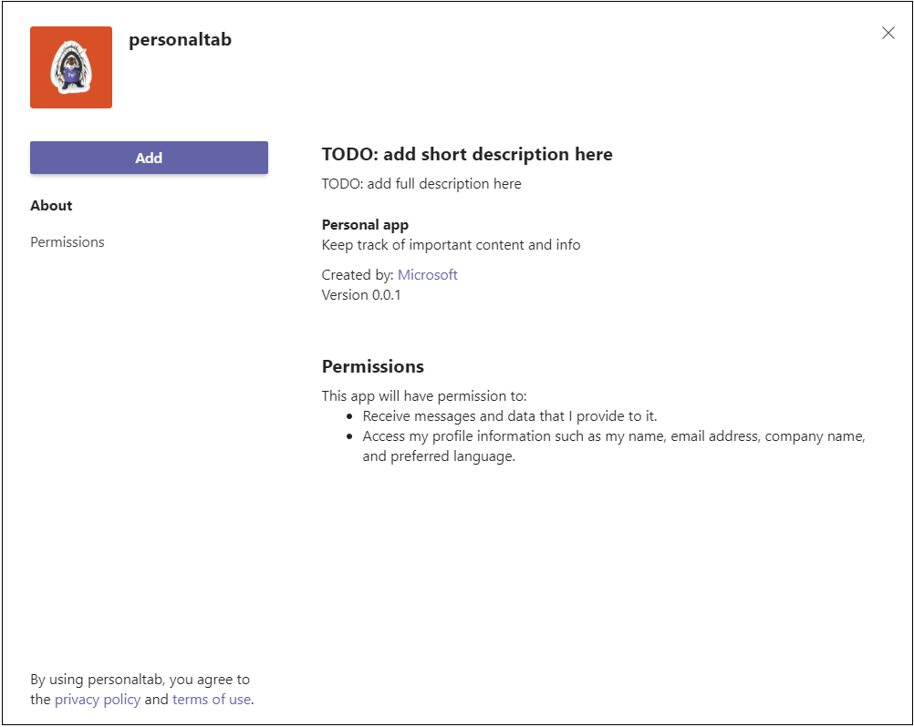

# <a name="create-a-personal-tab"></a>Crear una pestaña personal

## <a name="create-a-custom-personal-tab"></a>Crear una pestaña personal personalizada

Puede crear una pestaña personal con Node.js Yeoman Generator, ASP.NET Core o ASP.NET Core MVC.

# <a name="nodejs"></a>[Node.js](#tab/nodejs)

### <a name="create-a-custom-personal-tab-using-nodejs-and-the-yeoman-generator"></a>Crear una pestaña personal personalizada con Node.js y el generador de Yeoman

> [!NOTE]
> En este artículo se describen los pasos descritos en la compilación del [primer wiki de](https://github.com/OfficeDev/generator-teams/wiki/Build-Your-First-Microsoft-Teams-App) Microsoft Teams aplicación que se encuentra en el repositorio GitHub Microsoft OfficeDev.

Puede crear una pestaña personal personalizada con el [generador Teams Yeoman](https://github.com/OfficeDev/generator-teams/wiki/Build-Your-First-Microsoft-Teams-App). La aplicación también se carga en Teams.

### <a name="prerequisites-for-teams-apps"></a>Requisitos previos para Teams aplicaciones

Debe comprender los siguientes requisitos previos:

- Debes tener un inquilino Office 365 y un equipo configurado con **Permitir cargar aplicaciones personalizadas** habilitadas. Para obtener más información, vea [prepare your Office 365 tenant](~/concepts/build-and-test/prepare-your-o365-tenant.md).

    > [!NOTE]
    > Si no tiene una cuenta Office 365, puede registrarse para obtener una suscripción gratuita a través del programa Office 365 desarrolladores. La suscripción permanece activa siempre que la esté usando para el desarrollo continuo. Vea [welcome to the Office 365 Developer Program](/office/developer-program/microsoft-365-developer-program).

Además, este proyecto requiere que tenga lo siguiente instalado en el entorno de desarrollo:

- Cualquier editor de texto o IDE. Puede instalar y usar Microsoft Visual Studio [code](https://code.visualstudio.com/download) de forma gratuita.

- [Node.js/npm](https://nodejs.org/en/). Use la versión LTS más reciente. El nodo Administrador de paquetes (npm) se instala en el sistema con la instalación de Node.js.

- Después de instalar correctamente Node.js, instale los paquetes [Yeoman](https://yeoman.io/) y [gulp-cli](https://www.npmjs.com/package/gulp-cli) especificando el siguiente comando en el símbolo del sistema:

    ```bash
    npm install yo gulp-cli --global
    ```

- Instale el generador Microsoft Teams aplicaciones mediante la introducción del siguiente comando en el símbolo del sistema:

    ```bash
    npm install generator-teams --global
    ```

### <a name="generate-your-project"></a>Generar el proyecto

**Para generar el proyecto**

1. En un símbolo del sistema, cree un nuevo directorio para el proyecto de pestaña.

1. Para iniciar el generador, vaya al nuevo directorio y escriba el siguiente comando:

    ```bash
    yo teams
    ```

1. A continuación, proporcione una serie de valores que se usan en el archivo **manifest.json de la** aplicación:

    

    **¿Cómo se llama su solución?**

    El nombre de la solución es el nombre del proyecto. Puede aceptar el nombre sugerido seleccionando **Entrar**.

    **¿Dónde desea ubicar los archivos?**

    Actualmente está en el directorio del proyecto. Seleccione **Entrar**.

    **¿Título de tu Microsoft Teams de aplicación?**

    El título es el nombre del paquete de la aplicación y se usa en el manifiesto y la descripción de la aplicación. Escriba un título o **seleccione Entrar** para aceptar el nombre predeterminado.

    **¿Su nombre (empresa)? (máximo 32 caracteres)**

    El nombre de la empresa se usará en el manifiesto de la aplicación. Escriba un nombre de empresa o **seleccione Entrar** para aceptar el nombre predeterminado.

    **¿Qué versión de manifiesto le gustaría usar?**

    Seleccione el esquema predeterminado.

    **¿Scaffolding rápido? (Y/n)**

    El valor predeterminado es sí; escriba **n** para escribir su id. de partner de Microsoft.

    **Escriba su id. de partner de Microsoft, si tiene uno. (Dejar en blanco para omitir)**

    Este campo no es necesario y debe usarse solo si ya forma parte de la [Red de partners de Microsoft](https://partner.microsoft.com).

    **¿Qué desea agregar al proyecto?**

    Seleccione **( &ast; ) Una pestaña**.

    **¿La dirección URL donde hospedará esta solución?**

    De forma predeterminada, el generador sugiere una dirección URL de sitios web de Azure. Solo estás probando la aplicación localmente, por lo que no es necesaria una dirección URL válida.

    **¿Desea mostrar un indicador de carga cuando se carga la aplicación o pestaña?**

    Elige **no incluir** un indicador de carga cuando se cargue la aplicación o la pestaña. El valor predeterminado es no, escriba **n**.

    **¿Desea que las aplicaciones personales se representen sin una barra de encabezado de pestaña?**

    Elige **no incluir** aplicaciones personales que se representarán sin una barra de encabezado de pestaña. El valor predeterminado es no, escriba **n**.

    **¿Desea incluir el marco de pruebas y las pruebas iniciales? (y/N)**

    Elija **no incluir** un marco de prueba para este proyecto. El valor predeterminado es no, escriba **n**.

    **¿Desea incluir la compatibilidad con ESLint? (y/N)**

    Elija no incluir la compatibilidad con ESLint. El valor predeterminado es no, escriba **n**.

    **¿Desea usar azure applications Ideas para telemetría? (y/N)**

    Elija **no incluir** azure [application Ideas](/azure/azure-monitor/app/app-insights-overview). El valor predeterminado es no; escriba **n**.

    **Nombre de tabulación predeterminado (máximo 16 caracteres)?**

    Asigne un nombre a la pestaña. Este nombre de pestaña se usa en todo el proyecto como un componente de ruta de acceso de dirección URL o archivo.

    **¿Qué tipo de tab le gustaría crear?**

    Use las teclas de flecha para **seleccionar Personal (estático).**.

    **¿Necesita compatibilidad con el inicio de sesión único de Azure AD para la pestaña?**

    Elija **no** incluir la Azure AD inicio de sesión único para la pestaña. El valor predeterminado es sí, escriba **n**.

    > [!IMPORTANT]
    > El componente de **ruta de acceso yourDefaultTabNameTab** es el valor que escribió en el generador **para Nombre de tabulación** predeterminado más la palabra **Tab**.
    >
    > Por ejemplo: DefaultTabName: **MyTab** > **/MyTabTab/**

### <a name="add-a-personal-tab"></a>Agregar una pestaña personal

**Para agregar una pestaña personal a esta aplicación, cree una página de contenido y actualice los archivos existentes**

1. En el editor de código, cree un nuevo archivo HTML **personal.html** y agregue el siguiente marcado:

    ```html
    <!DOCTYPE html>
    <html>
        <head>
            <meta charset="UTF-8">
            <title>
                <!-- Todo: add your a title here -->
            </title>
            <meta name="viewport" content="width=device-width, initial-scale=1.0">
            <!-- inject:css -->
            <!-- endinject -->
        </head>
            <body>
                <h1>Personal Tab</h1>
                <p></p>
                <p>This is your personal tab!</p>
            </body>
    </html>
    ```

1. Guarde **personal.html** en la carpeta **web de la** aplicación en la siguiente ubicación:

    ```bash
    ./src/app/web/<yourDefaultTabNameTab>/personal.html
    ```

1. Abra **manifest.json** desde la siguiente ubicación en el editor de código:

    ```bash
    ./src/manifest/manifest.json/
    ```

1. Agregue lo siguiente a la matriz `staticTabs` vacía (`staticTabs":[]`) y agregue el siguiente objeto JSON:

    ```json
    {
        "entityId": "personalTab",
        "name": "Personal Tab ",
        "contentUrl": "https://{{HOSTNAME}}/<yourDefaultTabNameTab>/personal.html",
        "websiteUrl": "https://{{HOSTNAME}}",
        "scopes": ["personal"]
    }
    ```

1. Actualice el **componente de ruta de acceso contentURL** **yourDefaultTabNameTab** con el nombre de pestaña real.

1. Guarde el archivo **manifest.json** actualizado.

1. Para proporcionar la página de contenido en un IFrame, abra **Tab.ts** en el editor de código desde la siguiente ruta de acceso:

    ```bash
    ./src/app/<yourDefaultTabNameTab>/<yourDefaultTabNameTab>.ts
    ```

1. Agregue lo siguiente a la lista de decoradores de IFrame:

    ```typescript
     @PreventIframe("/<yourDefaultAppName>TabNameTab>/personal.html")
    ```

1. Guarde el archivo **Tab.ts actualizado** . El código de pestaña se ha completado.

### <a name="build-and-run-your-application"></a>Compilar y ejecutar la aplicación

En un símbolo del sistema, abra el directorio del proyecto para completar las siguientes tareas.

#### <a name="create-the-app-package"></a>Crear el paquete de la aplicación

Debes tener un paquete de aplicación para probar la pestaña en Teams. Es una carpeta zip que contiene los siguientes archivos necesarios:

- Un **icono de color completo** que mide 192 x 192 píxeles.
- Un **icono de esquema transparente** que mide 32 x 32 píxeles.
- Un **archivo manifest.json** que especifica los atributos de la aplicación.

El paquete se crea a través de una tarea gulp que valida el archivo manifest.json y genera la carpeta zip en el **directorio ./package**. En el símbolo del sistema, escriba el siguiente comando:

```bash
gulp manifest
```

#### <a name="build-your-application"></a>Compilar la aplicación

El comando build transpila la solución en la **carpeta ./dist** . Escriba el siguiente comando en el símbolo del sistema:

```bash
gulp build
```

#### <a name="run-your-application-in-localhost"></a>Ejecutar la aplicación en localhost

1. Para iniciar un servidor web local, escriba el siguiente comando en el símbolo del sistema:

    ```bash
    gulp serve
    ```

1. Escriba `http://localhost:3007/<yourDefaultAppNameTab>/` en el explorador, reemplace por `**<yourDefaultAppNameTab>**` el nombre de la pestaña y vea la página principal de la aplicación como se muestra en la siguiente imagen:

    

1. Para ver la pestaña personal, vaya a `http://localhost:3007/<yourDefaultAppNameTab>/personal.html`.

    >

### <a name="establish-a-secure-tunnel-to-your-tab"></a>Establecer un túnel seguro en la pestaña

Microsoft Teams es un producto basado en la nube y requiere que el contenido de la pestaña esté disponible desde la nube mediante puntos de conexión HTTPS. Teams no permite el hospedaje local. Publique la pestaña en una dirección URL pública o use un proxy que exponga el puerto local a una dirección URL orientada a Internet.

Para probar la extensión de pestaña, usa [ngrok](https://ngrok.com/docs), que está integrado en esta aplicación. Ngrok es una herramienta de software de proxy inverso. Ngrok crea un túnel para los puntos de conexión HTTPS del servidor web que se ejecuta localmente. Los puntos de conexión web del servidor están disponibles durante la sesión actual en el equipo. Cuando el equipo se apaga o se queda en reposo, el servicio ya no está disponible.

En el símbolo del sistema, salga de localhost y escriba el siguiente comando:

```bash
gulp ngrok-serve
```

> [!IMPORTANT]
> Después de cargar la pestaña en Microsoft Teams a través de **ngrok** y guardarla correctamente, puede verlo en Teams hasta que finalice la sesión del túnel.

### <a name="upload-your-application-to-teams"></a>Upload la aplicación a Teams

**Para cargar la aplicación en Teams**

1. Vaya a Microsoft Teams. Si usa la versión [basada en web](https://teams.microsoft.com), puede inspeccionar el código front-end con las herramientas para [desarrolladores del explorador](~/tabs/how-to/developer-tools.md).
1. En la esquina inferior izquierda, selecciona **Aplicaciones**.
1. En la esquina inferior izquierda, elige **Upload una aplicación personalizada**.
1. Vaya al directorio del proyecto, vaya a **la carpeta ./package** , seleccione la carpeta zip y elija **Abrir**.

    

1. Seleccione **Agregar** en el cuadro de diálogo emergente. La pestaña se carga en Teams.

    

### <a name="view-your-personal-tab"></a>Ver la pestaña personal

En la barra de navegación de la parte Teams, selecciona puntos suspensivos &#x25CF;&#x25CF;&#x25CF; y elige tu aplicación.

# <a name="aspnet-core"></a>[ASP.NET Core](#tab/aspnetcore)

### <a name="create-a-custom-personal-tab-using-aspnet-core"></a>Crear una pestaña personal personalizada con ASP.NET Core

Puedes crear una pestaña personal personalizada con C# páginas ASP.NET Core Desa herramientas. [App Studio](~/concepts/build-and-test/app-studio-overview.md) también se usa para completar el manifiesto de la aplicación e implementar la pestaña en Teams.

### <a name="prerequisites-for-personal-tab"></a>Requisitos previos para la pestaña personal

Debe comprender los siguientes requisitos previos:

- Debes tener un inquilino Office 365 y un equipo configurado con **Permitir cargar aplicaciones personalizadas** habilitadas. Para obtener más información, vea [prepare your Office 365 tenant](~/concepts/build-and-test/prepare-your-o365-tenant.md).

    > [!NOTE]
    > Si no tiene una cuenta Microsoft 365, puede registrarse para obtener una suscripción gratuita a través del [Programa para desarrolladores de Microsoft](https://developer.microsoft.com/en-us/microsoft-365/dev-program). La suscripción permanece activa siempre que la esté usando para el desarrollo continuo.

- Usa App Studio para importar la aplicación a Teams. Para instalar App Studio, selecciona **Aplicación**  de la Tienda de aplicaciones en la esquina inferior izquierda de la aplicación Teams y busca **App Studio**. Después de encontrar el icono, selecciónelo y elija **Agregar** en el cuadro de diálogo emergente para instalarlo.

Además, este proyecto requiere que tenga lo siguiente instalado en el entorno de desarrollo:

- La versión actual del IDE Visual Studio con la carga de trabajo de desarrollo **multiplataforma de .NET CORE** instalada. Si aún no tienes Visual Studio, puedes descargar e instalar la última [Microsoft Visual Studio Community](https://visualstudio.microsoft.com/downloads) versión gratuita.

- La [herramienta de proxy inverso ngrok](https://ngrok.com) . Use ngrok para crear un túnel para los puntos de conexión HTTPS del servidor web que se ejecuta localmente. Puede descargar [ngrok](https://ngrok.com/download).

### <a name="get-the-source-code"></a>Obtener el código fuente

En un símbolo del sistema, cree un nuevo directorio para el proyecto de pestaña. Se proporciona un proyecto sencillo para empezar. Clone el repositorio de ejemplo en el nuevo directorio con el siguiente comando:

```bash
git clone https://github.com/OfficeDev/microsoft-teams-sample-tabs.git
```

Como alternativa, puede recuperar el código fuente descargando la carpeta zip y extrayendo los archivos.

**Para compilar y ejecutar el proyecto de tabulación**

1. Después de obtener el código fuente, vaya a Visual Studio y seleccione **Abrir un proyecto o solución**.
1. Vaya al directorio de la aplicación de tabulación y abra **PersonalTab.sln**.
1. Para compilar y ejecutar la aplicación, presione **F5** o **elija Iniciar depuración** en el **menú** Depurar.
1. En un explorador, vaya a las siguientes direcciones URL para comprobar que la aplicación se cargó correctamente:

    - `http://localhost:44325/`
    - `http://localhost:44325/personal`
    - `http://localhost:44325/privacy`
    - `http://localhost:44325/tou`

### <a name="review-the-source-code"></a>Revisar el código fuente

#### <a name="startupcs"></a>Startup.cs

Este proyecto se creó a partir de una plantilla vacía ASP.NET Core aplicación web 2.2 con la casilla Avanzadas **- Configurar para HTTPS** activada en el programa de instalación. Los servicios MVC están registrados por el método del marco de inserción de `ConfigureServices()` dependencias. Además, la plantilla vacía no habilita el servicio de contenido estático de forma predeterminada, por lo que el middleware `Configure()` de archivos estáticos se agrega al método con el código siguiente:

```csharp
public void ConfigureServices(IServiceCollection services)
  {
      services.AddMvc().SetCompatibilityVersion(CompatibilityVersion.Version_2_2);
  }
public void Configure(IApplicationBuilder app)
  {
    app.UseStaticFiles();
    app.UseMvc();
  }
```

#### <a name="wwwroot-folder"></a>carpeta wwwroot

En ASP.NET Core, la carpeta raíz web es donde la aplicación busca archivos estáticos.

#### <a name="indexcshtml"></a>Index.cshtml

ASP.NET Core trata los archivos denominados **Index** como la página predeterminada o principal del sitio. Cuando la dirección URL del explorador apunta a la raíz del sitio, **Index.cshtml** se muestra como la página principal de la aplicación.

#### <a name="appmanifest-folder"></a>Carpeta AppManifest

Esta carpeta contiene los siguientes archivos de paquete de aplicación necesarios:

- Un **icono de color completo** que mide 192 x 192 píxeles.
- Un **icono de esquema transparente** que mide 32 x 32 píxeles.
- Un **archivo manifest.json** que especifica los atributos de la aplicación.

Estos archivos deben comprimirse en un paquete de la aplicación para usarlos al cargar la pestaña a Teams. Microsoft Teams carga el `contentUrl` especificado en el manifiesto, lo inserta en un iframe\> <y lo representa en la pestaña.

#### <a name="csproj"></a>.csproj

En la Visual Studio Explorador de soluciones, haga clic con el botón secundario en el proyecto y seleccione **Editar Project archivo**. Al final del archivo, verá el siguiente código que crea y actualiza la carpeta zip cuando se compila la aplicación:

```xml
<PropertyGroup>
    <PostBuildEvent>powershell.exe Compress-Archive -Path \"$(ProjectDir)AppManifest\*\" -DestinationPath \"$(TargetDir)tab.zip\" -Force</PostBuildEvent>
  </PropertyGroup>

  <ItemGroup>
    <EmbeddedResource Include="AppManifest\icon-outline.png">
      <CopyToOutputDirectory>Always</CopyToOutputDirectory>
    </EmbeddedResource>
    <EmbeddedResource Include="AppManifest\icon-color.png">
      <CopyToOutputDirectory>Always</CopyToOutputDirectory>
    </EmbeddedResource>
    <EmbeddedResource Include="AppManifest\manifest.json">
      <CopyToOutputDirectory>Always</CopyToOutputDirectory>
    </EmbeddedResource>
  </ItemGroup>
```

### <a name="update-your-application-for-teams"></a>Actualizar la aplicación para Teams

#### <a name="_layoutcshtml"></a>_Layout.cshtml

Para que la pestaña se muestre en Teams, debe incluir el SDK de cliente Microsoft Teams **JavaScript** e incluir una llamada después `microsoftTeams.initialize()` de que se cargue la página. La pestaña y la Teams se comunican de esta manera:

Vaya a la **carpeta Shared** , abra **_Layout.cshtml** y agregue lo siguiente a la sección `<head>` etiquetas:

```html
<script src="https://ajax.aspnetcdn.com/ajax/jQuery/jquery-3.4.1.min.js"></script>
<script src="https://statics.teams.cdn.office.net/sdk/v1.6.0/js/MicrosoftTeams.min.js"></script>
```

#### <a name="personaltabcshtml"></a>PersonalTab.cshtml

Abra **PersonalTab.cshtml** y actualice las etiquetas `<script>` incrustadas llamando a `microsoftTeams.initialize()`.

Asegúrese de guardar el **PersonalTab.cshtml** actualizado.

### <a name="establish-a-secure-tunnel-to-your-tab-for-teams"></a>Establecer un túnel seguro en la pestaña para Teams

Microsoft Teams es un producto basado en la nube y requiere que el contenido de la pestaña esté disponible desde la nube mediante puntos de conexión HTTPS. Teams no permite el hospedaje local. Publique la pestaña en una dirección URL pública o use un proxy que exponga el puerto local a una dirección URL orientada a Internet.

Para probar la pestaña, use [ngrok](https://ngrok.com/docs). Los puntos de conexión web del servidor están disponibles mientras ngrok se ejecuta en el equipo. En la versión gratuita de ngrok, si cierra ngrok, las direcciones URL son diferentes la próxima vez que la inicie.

**Para establecer un túnel seguro en la pestaña**

1. En un símbolo del sistema en la raíz del directorio del proyecto, ejecute el siguiente comando:

    ```bash
    ngrok http https://localhost:44325 -host-header="localhost:44325"
    ```

    Ngrok escucha las solicitudes de Internet y las enruta a la aplicación cuando se ejecuta en el puerto 44325. Es similar a donde `https://y8rPrT2b.ngrok.io/` **y8rPrT2b** se reemplaza por la dirección URL HTTPS alfanumérico de ngrok.

    Asegúrese de mantener el símbolo del sistema con ngrok en ejecución y tome nota de la dirección URL.

2. Compruebe que **ngrok** se está ejecutando y funcionando correctamente abriendo el explorador y yendo a la página de contenido a través de la dirección URL HTTPS de ngrok que se proporcionó en la ventana del símbolo del sistema.

> [!TIP]
> Debe tener la aplicación en ejecución Visual Studio y ngrok para completar los pasos proporcionados en este artículo. Si necesita dejar de ejecutar la aplicación en Visual Studio para trabajar en ella, **mantenga ngrok en ejecución**. Escucha y reanuda el enrutamiento de la solicitud de la aplicación cuando se reinicia en Visual Studio. Si tiene que reiniciar el servicio ngrok, devuelve una nueva dirección URL y tiene que actualizar cada lugar que use esa dirección URL.

#### <a name="run-your-application"></a>Ejecutar la aplicación

En Visual Studio, presione **F5** o elija **Iniciar depuración** en el menú **Depurar de la** aplicación.

### <a name="upload-your-tab-with-app-studio-for-teams"></a>Upload la pestaña con App Studio para Teams

> [!NOTE]
> **App Studio** se puede usar para editar el **archivo manifest.json** y cargar el paquete completado en Teams. También puede editar manualmente **manifest.json**. Si lo hace, asegúrese de volver a crear la solución para crear el **archivoTab.zip** cargar.

**Para cargar la pestaña con App Studio**

1. Vaya a Microsoft Teams. Si usa la versión [basada en web](https://teams.microsoft.com), puede inspeccionar el código front-end con las herramientas para [desarrolladores del explorador](~/tabs/how-to/developer-tools.md).

1. Ve a **App Studio** y selecciona la **pestaña Editor de manifiestos** .

1. Selecciona **Importar una aplicación existente en** el **editor de manifiestos** para empezar a actualizar el paquete de la aplicación para la pestaña. El código fuente viene con su propio manifiesto parcialmente completo. El nombre del paquete de la aplicación es **tab.zip**. Está disponible desde la siguiente ruta de acceso:

    ```bash
    /bin/Debug/netcoreapp2.2/tab.zip
    ```

1. Upload **tab.zip** a **App Studio**.

#### <a name="update-your-app-package-with-manifest-editor"></a>Actualizar el paquete de la aplicación con el editor de manifiestos

Después de cargar el paquete de la aplicación en App Studio, debes configurarlo.

Seleccione el icono de la pestaña recién importada de la página de bienvenida del editor de manifiesto.

Hay una lista de pasos en el lado izquierdo del editor de manifiestos. En el lado derecho del editor de manifiesto hay una lista de propiedades que deben tener valores para cada uno de esos pasos. El **manifest.json** ha proporcionado gran parte de la información, pero hay campos que debe actualizar.

##### <a name="details-app-details"></a>Detalles: Detalles de la aplicación

En la **sección Detalles de la** aplicación:

1. En **Identificación**, selecciona **Generar** para generar un nuevo identificador de aplicación para tu aplicación.

1. En **Información del desarrollador**, actualice **el** sitio web con la dirección URL HTTPS de **ngrok** .

    

1. En **Direcciones URL de la** aplicación, actualice la **declaración privacidad y** `https://<yourngrokurl>/privacy` **los Términos de uso** `https://<yourngrokurl>/tou` para>.

##### <a name="capabilities-tabs"></a>Capacidades: pestañas

En la **sección Pestañas** :

1. En **Agregar una pestaña personal**, seleccione **Agregar**. Aparece un cuadro de diálogo emergente.

1. Escriba un nombre para la pestaña personal en **Nombre**.

1. Escriba el **id. de entidad**.

1. Actualizar **dirección URL de contenido** con `https://<yourngrokurl>/personalTab`.

    Deje el **campo Dirección URL del sitio** web en blanco.

    

1. Seleccione **Guardar**.

##### <a name="finish-domains-and-permissions"></a>Finalizar: dominios y permisos

En la **sección Dominios y permisos** , **los dominios de las pestañas** deben contener la dirección URL de ngrok sin el prefijo HTTPS `<yourngrokurl>.ngrok.io/`.

###### <a name="finish-test-and-distribute"></a>Finalizar: probar y distribuir

> [!IMPORTANT]
> A la derecha, en **Descripción**, verá la siguiente advertencia:
>
> &#9888; **La matriz 'validDomains' no puede contener un sitio de túnel...**
>
> Esta advertencia puede omitirse mientras se prueba la pestaña.

1. En la **sección Probar y distribuir** , seleccione **Instalar**.

1. En el cuadro de diálogo emergente, seleccione **Agregar** y se muestra la pestaña.

    

### <a name="view-your-personal-tab-in-teams"></a>Ver la pestaña personal en Teams

1. En la barra de navegación situada en el extremo izquierdo de la Teams, selecciona los puntos suspensivos &#x25CF;&#x25CF;&#x25CF;. Se muestra una lista de aplicaciones personales.

1. Seleccione la pestaña de la lista para verlo.

# <a name="aspnet-core-mvc"></a>[ASP.NET Core MVC](#tab/aspnetcoremvc)

### <a name="create-a-custom-personal-tab-with-aspnet-core-mvc"></a>Crear una pestaña personal personalizada con ASP.NET Core MVC

Puede crear una pestaña personal personalizada con C# y ASP.NET Core MVC. [App Studio para Microsoft Teams](~/concepts/build-and-test/app-studio-overview.md) también se usa para completar el manifiesto de la aplicación e implementar la pestaña en Teams.

### <a name="prerequisites-for-personal-tab-with-aspnet-core-mvc"></a>Requisitos previos para ficha personal con ASP.NET Core MVC

- Debes tener un inquilino Microsoft 365 y un equipo configurado con **Permitir cargar aplicaciones personalizadas** habilitadas. Para obtener más información, vea [prepare your Office 365 tenant](~/concepts/build-and-test/prepare-your-o365-tenant.md).

    > [!NOTE]
    > Si no tiene una cuenta Microsoft 365, puede registrarse para obtener una suscripción gratuita a través del [Programa para desarrolladores de Microsoft](https://developer.microsoft.com/en-us/microsoft-365/dev-program). La suscripción permanece activa siempre que la esté usando para el desarrollo continuo.

- Usa App Studio para importar la aplicación a Teams. Para instalar App Studio, selecciona **Aplicación**  de la Tienda de aplicaciones en la esquina inferior izquierda de la aplicación Teams y busca **App Studio**. Después de encontrar el icono, selecciónelo y elija **Agregar** en el cuadro de diálogo emergente para instalarlo.

Además, este proyecto requiere que tenga lo siguiente instalado en el entorno de desarrollo:

- La versión actual del IDE Visual Studio con la carga de trabajo de desarrollo **multiplataforma de .NET CORE** instalada. Si aún no tienes Visual Studio, puedes descargar e instalar la última [Microsoft Visual Studio Community](https://visualstudio.microsoft.com/downloads) versión gratuita.

- La [herramienta de proxy inverso ngrok](https://ngrok.com) . Use ngrok para crear un túnel para los puntos de conexión HTTPS del servidor web que se ejecuta localmente. Puede descargar [ngrok](https://ngrok.com/download).

### <a name="get-the-source-code"></a>Obtener el código fuente

En un símbolo del sistema, cree un nuevo directorio para el proyecto de pestaña. Se proporciona un proyecto sencillo para empezar. Clone el repositorio de ejemplo en el nuevo directorio con el siguiente comando:

``` bash
git clone https://github.com/OfficeDev/microsoft-teams-sample-tabs.git
```

Como alternativa, puede recuperar el código fuente descargando la carpeta zip y extrayendo los archivos.

**Para compilar y ejecutar el proyecto de tabulación**

1. Después de tener el código fuente, vaya a Visual Studio y seleccione **Abrir un proyecto o solución**.
1. Vaya al directorio de la aplicación de pestaña y abra **PersonalTabMVC.sln**.
1. Para compilar y ejecutar la aplicación, presione **F5** o **elija Iniciar depuración** en el **menú** Depurar.
1. En un explorador, vaya a las siguientes direcciones URL para comprobar que la aplicación se cargó correctamente:

    * `http://localhost:44335`
    * `http://localhost:44335/privacy`
    * `http://localhost:44335/tou`

### <a name="review-the-source-code"></a>Revisar el código fuente

#### <a name="startupcs"></a>Startup.cs

Este proyecto se creó a partir de una plantilla vacía ASP.NET Core aplicación web 2.2 con la casilla Avanzadas **- Configurar para HTTPS** activada en el programa de instalación. Los servicios MVC están registrados por el método del marco de inserción de `ConfigureServices()` dependencias. Además, la plantilla vacía no habilita el servicio de contenido estático de forma predeterminada, por lo que el middleware `Configure()` de archivos estáticos se agrega al método con el código siguiente:

``` csharp
public void ConfigureServices(IServiceCollection services)
  {
    services.AddMvc().SetCompatibilityVersion(CompatibilityVersion.Version_2_2);
  }
public void Configure(IApplicationBuilder app)
  {
    app.UseStaticFiles();
    app.UseMvc();
  }
```

#### <a name="wwwroot-folder"></a>carpeta wwwroot

En ASP.NET Core, la carpeta raíz web es donde la aplicación busca archivos estáticos.

#### <a name="appmanifest-folder"></a>Carpeta AppManifest

Esta carpeta contiene los siguientes archivos de paquete de aplicación necesarios:

* Un **icono de color completo** que mide 192 x 192 píxeles.
* Un **icono de esquema transparente** que mide 32 x 32 píxeles.
* Un **archivo manifest.json** que especifica los atributos de la aplicación.

Estos archivos deben comprimirse en un paquete de la aplicación para usarlos al cargar la pestaña a Teams. Microsoft Teams carga el `contentUrl` especificado en el manifiesto, lo inserta en un IFrame y lo representa en la pestaña.

#### <a name="csproj"></a>.csproj

En la Visual Studio Explorador de soluciones, haga clic con el botón secundario en el proyecto y seleccione **Editar Project archivo**. Al final del archivo, verá el siguiente código que crea y actualiza la carpeta zip cuando se compila la aplicación:

``` xml
<PropertyGroup>
    <PostBuildEvent>powershell.exe Compress-Archive -Path \"$(ProjectDir)AppManifest\*\" -DestinationPath \"$(TargetDir)tab.zip\" -Force</PostBuildEvent>
  </PropertyGroup>

  <ItemGroup>
    <EmbeddedResource Include="AppManifest\icon-outline.png">
      <CopyToOutputDirectory>Always</CopyToOutputDirectory>
    </EmbeddedResource>
    <EmbeddedResource Include="AppManifest\icon-color.png">
      <CopyToOutputDirectory>Always</CopyToOutputDirectory>
    </EmbeddedResource>
    <EmbeddedResource Include="AppManifest\manifest.json">
      <CopyToOutputDirectory>Always</CopyToOutputDirectory>
    </EmbeddedResource>
  </ItemGroup>
```

#### <a name="models"></a>Modelos

**PersonalTab.cs** presenta un objeto Message y métodos a los que se llama desde **PersonalTabController** cuando un usuario selecciona un botón en la **vista PersonalTab** .

#### <a name="views"></a>Vistas

Estas vistas son las diferentes vistas de ASP.NET Core MVC:

* Inicio: ASP.NET Core trata los archivos denominados **Index** como la página predeterminada o principal del sitio. Cuando la dirección URL del explorador apunta a la raíz del sitio, **Index.cshtml** se muestra como la página principal de la aplicación.

* Shared: el marcado de vista **parcial _Layout.cshtml** contiene la estructura de página general de la aplicación y los elementos visuales compartidos. También hace referencia a la Teams biblioteca.

#### <a name="controllers"></a>Controladores

Los controladores usan la propiedad `ViewBag` para transferir valores dinámicamente a las vistas.

[!INCLUDE [dotnet-update-personal-app](~/includes/tabs/dotnet-update-personal-app.md)]

[!INCLUDE [dotnet-ngrok-intro](~/includes/tabs/dotnet-ngrok-intro.md)]

**Para ejecutar ngrok y comprobar la página de contenido**

1. En un símbolo del sistema en la raíz del directorio del proyecto, ejecute el siguiente comando:

    ``` bash
    ngrok http https://localhost:44345 -host-header="localhost:44345"
    ```

    Ngrok escucha las solicitudes de Internet y las enruta a la aplicación cuando se ejecuta en el puerto 44325. Es similar a donde `https://y8rPrT2b.ngrok.io/` **y8rPrT2b** se reemplaza por la dirección URL HTTPS alfanumérico de ngrok.

    Asegúrese de mantener el símbolo del sistema con ngrok en ejecución y de tomar nota de la dirección URL.

1. Compruebe que **ngrok** se está ejecutando y funcionando correctamente abriendo el explorador y yendo a la página de contenido a través de la dirección URL HTTPS de ngrok que se proporcionó en la ventana del símbolo del sistema.

> [!TIP]
> Debe tener la aplicación en ejecución Visual Studio y ngrok para completar los pasos proporcionados en este artículo. Si necesita dejar de ejecutar la aplicación en Visual Studio para trabajar en ella, **mantenga ngrok en ejecución**. Escucha y reanuda el enrutamiento de la solicitud de la aplicación cuando se reinicia en Visual Studio. Si tiene que reiniciar el servicio ngrok, devuelve una nueva dirección URL y tiene que actualizar cada lugar que use esa dirección URL.

#### <a name="run-your-application"></a>Ejecutar la aplicación

En Visual Studio, presione **F5** o elija **Iniciar depuración** en el menú **Depurar de la** aplicación.

[!INCLUDE [dotnet-personal-use-appstudio](~/includes/tabs/dotnet-personal-use-appstudio.md)]

---

## <a name="reorder-static-personal-tabs"></a>Reordenar pestañas personales estáticas

A partir de la versión 1.7 del manifiesto, los desarrolladores pueden reorganizar todas las pestañas de su aplicación personal. En concreto, un desarrollador puede mover la pestaña de **chat del bot** , que siempre se sitúa de forma predeterminada en la primera posición, en cualquier lugar del encabezado de pestaña de la aplicación personal. Se declaran dos palabras `entityId` clave de tabulación reservadas, **conversaciones** y **acerca de.**

Si creas un bot con un **ámbito personal** , aparece en la primera posición de pestaña de una aplicación personal de forma predeterminada. Si desea moverlo a otra posición, debe agregar un objeto tab estático al manifiesto con la palabra clave reservada, **conversaciones**. La **pestaña de** conversación aparece en la web o en el escritorio en función de dónde agregue la **pestaña de** conversación en la `staticTabs` matriz.

```json
{
   "staticTabs":[
      {
         
      },
      {
         "entityId":"conversations",
         "scopes":[
            "personal"
         ]
      }
   ]
}
```

## <a name="add-registeronfocused-api-for-tabs-or-personal-apps"></a>Agregar `registerOnFocused` API para pestañas o aplicaciones personales

La `registerOnFocused` API del SDK le permite usar un teclado en Teams. Puedes volver a una aplicación personal y mantener el foco en una pestaña o aplicación personal con la ayuda de las teclas Ctrl, Mayús y F6. Por ejemplo, puedes alejarte de la aplicación personal para buscar algo y luego volver a la aplicación personal o usar Ctrl+F6 para desplazarte por los lugares requeridos. 

El código siguiente proporciona un ejemplo de definición de controlador en `registerFocusEnterHandler` SDK cuando el foco debe devolverse a la pestaña o a la aplicación personal:

```csharp
export function registerFocusEnterHandler(handler: (navigateForward: boolean) => void): 
void {
  HandlersPrivate.focusEnterHandler = handler;
  handler && sendMessageToParent('registerHandler', ['focusEnter']);
}
function handleFocusEnter(navigateForward: boolean): void
 {
  if (HandlersPrivate.focusEnterHandler)
   {
    HandlersPrivate.focusEnterHandler(navigateForward);
  }
}
```

Después de que el controlador se desencadene con la palabra `focusEnter`clave , `registerFocusEnterHandler` el controlador se invoca con una función de `focusEnterHandler` devolución de llamada que toma un parámetro denominado `navigateForward`. El valor de `navigateForward` determina el tipo de eventos. Ctrl `focusEnterHandler` +F6 invoca el valor solo y no la tecla de tabulación.   
Las claves útiles para mover eventos dentro Teams son las siguientes:    
* Forward event -> Ctrl+F6 keys
* Evento Backward -> Ctrl+Mayús+F6

```csharp
case 'focusEnter':     
this.registerFocusEnterHandler((navigateForward: boolean = true) => {
this.sdkWindowMessageHandler.sendRequestMessage(this.frame, this.constants.SdkMessageTypes.focusEnter, [navigateForward]);
// Set focus on iframe or webview
if (this.frame && this.frame.sourceElem) {
  this.frame.sourceElem.focus();
}
return true;
});
}

// callback function to be passed to the handler
private focusEnterHandler: (navigateForward: boolean) => boolean;

// function that gets invoked after handler is registered.
private registerFocusEnterHandler(focusEnterHandler: (navigateForward: boolean) => boolean): void {
this.focusEnterHandler = focusEnterHandler;
this.layoutService.registerAppFocusEnterCallback(this.focusEnterHandler);
}
```

### <a name="personal-app"></a>Aplicación personal

:::image type="content" source="../../assets/images/personal-apps/registerfocus.png" alt-text="En el ejemplo se muestran las opciones para agregar la API registerOnFocussed" border="false":::

#### <a name="personal-app---forward-event"></a>Aplicación personal: evento Forward

:::image type="content" source="../../assets/images/personal-apps/registerfocus-forward-event.png" alt-text="En el ejemplo se muestran las opciones para agregar el movimiento hacia delante de la API registerOnFocussed" border="false":::

#### <a name="personal-app---backward-event"></a>Aplicación personal: evento Backward

:::image type="content" source="../../assets/images/personal-apps/registerfocus-backward-event.png" alt-text="En el ejemplo se muestran las opciones para agregar el movimiento hacia atrás de la API registerOnFocussed" border="false":::

### <a name="tab"></a>Pestaña

:::image type="content" source="../../assets/images/personal-apps/registerfocus-tab.png" alt-text="En el ejemplo se muestran las opciones para agregar la API registerOnFocussed para la pestaña" border="false":::

## <a name="next-step"></a>Paso siguiente

> [!div class="nextstepaction"]
> [Crear una pestaña de canal o grupo](~/tabs/how-to/create-channel-group-tab.md)

## <a name="see-also"></a>Vea también

* [Teams pestañas](~/tabs/what-are-tabs.md)
* [Pestañas en dispositivos móviles](~/tabs/design/tabs-mobile.md)
* [Compilar pestañas con tarjetas adaptables](~/tabs/how-to/build-adaptive-card-tabs.md)
* [Crear pestañas de conversación](~/tabs/how-to/conversational-tabs.md)