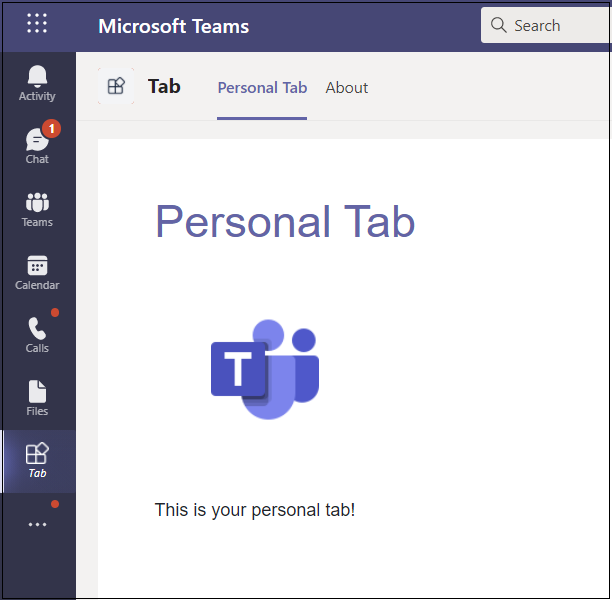

# <a name="create-a-personal-tab"></a><span data-ttu-id="79747-103">Crear una pestaña personal</span><span class="sxs-lookup"><span data-stu-id="79747-103">Create a personal tab</span></span>

## <a name="create-a-custom-personal-tab"></a><span data-ttu-id="79747-104">Crear una pestaña personal personalizada</span><span class="sxs-lookup"><span data-stu-id="79747-104">Create a custom personal tab</span></span>

<span data-ttu-id="79747-105">Puede crear una pestaña personal con Node.js Yeoman Generator, ASP.NET Core o ASP.NET Core MVC.</span><span class="sxs-lookup"><span data-stu-id="79747-105">You can create a personal tab using Node.js and the Yeoman Generator, ASP.NET Core, or ASP.NET Core MVC.</span></span>

# <a name="nodejs"></a>[<span data-ttu-id="79747-106">Node.js</span><span class="sxs-lookup"><span data-stu-id="79747-106">Node.js</span></span>](#tab/nodejs)

### <a name="create-a-custom-personal-tab-using-nodejs-and-the-yeoman-generator"></a><span data-ttu-id="79747-107">Crear una pestaña personal personalizada con Node.js y el generador de Yeoman</span><span class="sxs-lookup"><span data-stu-id="79747-107">Create a custom personal tab using Node.js and the Yeoman Generator</span></span>

> [!NOTE]
> <span data-ttu-id="79747-108">En este artículo se describen los pasos descritos en la compilación del primer [wiki](https://github.com/OfficeDev/generator-teams/wiki/Build-Your-First-Microsoft-Teams-App) de la aplicación Microsoft Teams que se encuentra en el repositorio GitHub Microsoft OfficeDev.</span><span class="sxs-lookup"><span data-stu-id="79747-108">This article follows the steps outlined in the [build your first Microsoft Teams app](https://github.com/OfficeDev/generator-teams/wiki/Build-Your-First-Microsoft-Teams-App) Wiki found in the Microsoft OfficeDev GitHub repository.</span></span>

<span data-ttu-id="79747-109">Puede crear una pestaña personal personalizada mediante el [generador Teams Yeoman](https://github.com/OfficeDev/generator-teams/wiki/Build-Your-First-Microsoft-Teams-App).</span><span class="sxs-lookup"><span data-stu-id="79747-109">You can create a custom personal tab using the [Teams Yeoman generator](https://github.com/OfficeDev/generator-teams/wiki/Build-Your-First-Microsoft-Teams-App).</span></span> <span data-ttu-id="79747-110">La aplicación también se carga en Teams.</span><span class="sxs-lookup"><span data-stu-id="79747-110">The application is also uploaded to Teams.</span></span>

### <a name="prerequisites-for-teams-apps"></a><span data-ttu-id="79747-111">Requisitos previos para Teams aplicaciones</span><span class="sxs-lookup"><span data-stu-id="79747-111">Prerequisites for Teams apps</span></span>

<span data-ttu-id="79747-112">Debe comprender los siguientes requisitos previos:</span><span class="sxs-lookup"><span data-stu-id="79747-112">You must have an understanding of the following prerequisites:</span></span>

- <span data-ttu-id="79747-113">Debes tener un inquilino Office 365 y un equipo configurado con **Permitir la carga de aplicaciones personalizadas** habilitada.</span><span class="sxs-lookup"><span data-stu-id="79747-113">You must have an Office 365 tenant and a team configured with **Allow uploading custom apps** enabled.</span></span> <span data-ttu-id="79747-114">Para obtener más información, [vea prepare your Office 365 tenant](~/concepts/build-and-test/prepare-your-o365-tenant.md).</span><span class="sxs-lookup"><span data-stu-id="79747-114">For more information, see [prepare your Office 365 tenant](~/concepts/build-and-test/prepare-your-o365-tenant.md).</span></span>

    > [!NOTE]
    > <span data-ttu-id="79747-115">Si no tiene una cuenta Office 365, puede registrarse para obtener una suscripción gratuita a través del programa Office 365 desarrolladores.</span><span class="sxs-lookup"><span data-stu-id="79747-115">If you do not have an Office 365 account, you can sign up for a free subscription through the Office 365 Developer Program.</span></span> <span data-ttu-id="79747-116">La suscripción permanece activa siempre que la esté usando para el desarrollo continuo.</span><span class="sxs-lookup"><span data-stu-id="79747-116">The subscription remains active as long as you are using it for ongoing development.</span></span> <span data-ttu-id="79747-117">Vea [welcome to the Office 365 Developer Program](/office/developer-program/microsoft-365-developer-program).</span><span class="sxs-lookup"><span data-stu-id="79747-117">See [welcome to the Office 365 Developer Program](/office/developer-program/microsoft-365-developer-program).</span></span>

<span data-ttu-id="79747-118">Además, este proyecto requiere que tenga lo siguiente instalado en el entorno de desarrollo:</span><span class="sxs-lookup"><span data-stu-id="79747-118">In addition, this project requires that you have the following installed in your development environment:</span></span>

- <span data-ttu-id="79747-119">Cualquier editor de texto o IDE.</span><span class="sxs-lookup"><span data-stu-id="79747-119">Any text editor or IDE.</span></span> <span data-ttu-id="79747-120">Puede instalar y [usar](https://code.visualstudio.com/download) Visual Studio Code de forma gratuita.</span><span class="sxs-lookup"><span data-stu-id="79747-120">You can install and use [Visual Studio Code](https://code.visualstudio.com/download) for free.</span></span>

- <span data-ttu-id="79747-121">[Node.js/npm](https://nodejs.org/en/).</span><span class="sxs-lookup"><span data-stu-id="79747-121">[Node.js/npm](https://nodejs.org/en/).</span></span> <span data-ttu-id="79747-122">Use la versión LTS más reciente.</span><span class="sxs-lookup"><span data-stu-id="79747-122">Use the latest LTS version.</span></span> <span data-ttu-id="79747-123">El nodo Administrador de paquetes (npm) se instala en el sistema con la instalación de Node.js.</span><span class="sxs-lookup"><span data-stu-id="79747-123">The Node Package Manager (npm) is installed in your system with the installation of Node.js.</span></span>

- <span data-ttu-id="79747-124">Después de instalar correctamente Node.js, instale los paquetes [Yeoman](https://yeoman.io/) y [gulp-cli](https://www.npmjs.com/package/gulp-cli) especificando lo siguiente en el símbolo del sistema:</span><span class="sxs-lookup"><span data-stu-id="79747-124">After you have successfully installed Node.js, install the [Yeoman](https://yeoman.io/) and [gulp-cli](https://www.npmjs.com/package/gulp-cli) packages by entering the following in your command prompt:</span></span>

    ```bash
    npm install yo gulp-cli --global
    ```

- <span data-ttu-id="79747-125">Instale el generador Microsoft Teams aplicaciones mediante la introducción de lo siguiente en el símbolo del sistema:</span><span class="sxs-lookup"><span data-stu-id="79747-125">Install the Microsoft Teams Apps generator by entering the following in your command prompt:</span></span>

    ```bash
    npm install generator-teams --global
    ```

### <a name="generate-your-project"></a><span data-ttu-id="79747-126">Generar el proyecto</span><span class="sxs-lookup"><span data-stu-id="79747-126">Generate your project</span></span>

<span data-ttu-id="79747-127">**Para generar el proyecto**</span><span class="sxs-lookup"><span data-stu-id="79747-127">**To generate your project**</span></span>

1. <span data-ttu-id="79747-128">En un símbolo del sistema, cree un nuevo directorio para el proyecto de pestaña.</span><span class="sxs-lookup"><span data-stu-id="79747-128">At a command prompt, create a new directory for your tab project.</span></span>

1. <span data-ttu-id="79747-129">Para iniciar el generador, vaya al nuevo directorio y escriba el siguiente comando:</span><span class="sxs-lookup"><span data-stu-id="79747-129">To start the generator, go to your new directory and enter the following command:</span></span>

    ```bash
    yo teams
    ```

1. <span data-ttu-id="79747-130">A continuación, proporcione una serie de valores que se usan en el archivo demanifest.js **aplicación:**</span><span class="sxs-lookup"><span data-stu-id="79747-130">Next, provide a series of values that are used in your application's **manifest.json** file:</span></span>

    

    <span data-ttu-id="79747-132">**¿Cuál es el nombre de la solución?**</span><span class="sxs-lookup"><span data-stu-id="79747-132">**What is your solution name?**</span></span>

    <span data-ttu-id="79747-133">Este es el nombre del proyecto.</span><span class="sxs-lookup"><span data-stu-id="79747-133">This is your project name.</span></span> <span data-ttu-id="79747-134">Puede aceptar el nombre sugerido seleccionando la **tecla** Entrar.</span><span class="sxs-lookup"><span data-stu-id="79747-134">You can accept the suggested name by selecting the **Enter** key.</span></span>

    <span data-ttu-id="79747-135">**¿Dónde desea ubicar los archivos?**</span><span class="sxs-lookup"><span data-stu-id="79747-135">**Where do you want to place the files?**</span></span>

    <span data-ttu-id="79747-136">Actualmente se encuentra en el directorio del proyecto.</span><span class="sxs-lookup"><span data-stu-id="79747-136">You are currently in your project directory.</span></span> <span data-ttu-id="79747-137">Seleccione **Entrar**.</span><span class="sxs-lookup"><span data-stu-id="79747-137">Select **Enter**.</span></span>

    <span data-ttu-id="79747-138">**¿Título de tu Microsoft Teams de aplicación?**</span><span class="sxs-lookup"><span data-stu-id="79747-138">**Title of your Microsoft Teams app project?**</span></span>

    <span data-ttu-id="79747-139">Este es el nombre del paquete de la aplicación y se usará en el manifiesto y la descripción de la aplicación.</span><span class="sxs-lookup"><span data-stu-id="79747-139">This is your app package name and will be used in the app manifest and description.</span></span> <span data-ttu-id="79747-140">Escriba un título o **seleccione Entrar** para aceptar el nombre predeterminado.</span><span class="sxs-lookup"><span data-stu-id="79747-140">Enter a title or select **Enter** to accept the default name.</span></span>

    <span data-ttu-id="79747-141">**¿Su nombre (empresa)? (máximo 32 caracteres)**</span><span class="sxs-lookup"><span data-stu-id="79747-141">**Your (company) name? (max 32 characters)**</span></span>

    <span data-ttu-id="79747-142">El nombre de la empresa se usará en el manifiesto de la aplicación.</span><span class="sxs-lookup"><span data-stu-id="79747-142">Your company name will be used in the app manifest.</span></span> <span data-ttu-id="79747-143">Escriba un nombre de empresa o **seleccione Entrar** para aceptar el nombre predeterminado.</span><span class="sxs-lookup"><span data-stu-id="79747-143">Enter a company name or select **Enter** to accept the default name.</span></span>

    <span data-ttu-id="79747-144">**¿Qué versión de manifiesto le gustaría usar?**</span><span class="sxs-lookup"><span data-stu-id="79747-144">**Which manifest version would you like to use?**</span></span>

    <span data-ttu-id="79747-145">Seleccione el esquema predeterminado.</span><span class="sxs-lookup"><span data-stu-id="79747-145">Select the default schema.</span></span>

    <span data-ttu-id="79747-146">**¿Scaffolding rápido? (Y/n)**</span><span class="sxs-lookup"><span data-stu-id="79747-146">**Quick scaffolding? (Y/n)**</span></span>

    <span data-ttu-id="79747-147">El valor predeterminado es sí; escriba **n** para escribir su Id. de partner de Microsoft.</span><span class="sxs-lookup"><span data-stu-id="79747-147">The default is yes; enter **n** to enter your Microsoft Partner Id.</span></span>

    <span data-ttu-id="79747-148">**Escriba su id. de partner de Microsoft, si tiene uno. (Dejar en blanco para omitir)**</span><span class="sxs-lookup"><span data-stu-id="79747-148">**Enter your Microsoft Partner Id, if you have one? (Leave blank to skip)**</span></span>

    <span data-ttu-id="79747-149">Este campo no es necesario y solo debe usarse si ya forma parte de [la red de partners de Microsoft](https://partner.microsoft.com).</span><span class="sxs-lookup"><span data-stu-id="79747-149">This field is not required and should only be used if you are already part of the [Microsoft Partner Network](https://partner.microsoft.com).</span></span>

    <span data-ttu-id="79747-150">**¿Qué desea agregar al proyecto?**</span><span class="sxs-lookup"><span data-stu-id="79747-150">**What do you want to add to your project?**</span></span>

    <span data-ttu-id="79747-151">Seleccione **( ) Una &ast; pestaña**.</span><span class="sxs-lookup"><span data-stu-id="79747-151">Select **( &ast; ) A Tab**.</span></span>

    <span data-ttu-id="79747-152">**¿La dirección URL donde hospedará esta solución?**</span><span class="sxs-lookup"><span data-stu-id="79747-152">**The URL where you will host this solution?**</span></span>

    <span data-ttu-id="79747-153">De forma predeterminada, el generador sugiere una dirección URL de Sitios web de Azure.</span><span class="sxs-lookup"><span data-stu-id="79747-153">By default the generator suggests an Azure Web Sites URL.</span></span> <span data-ttu-id="79747-154">Solo estás probando la aplicación localmente, por lo tanto, no es necesaria una dirección URL válida.</span><span class="sxs-lookup"><span data-stu-id="79747-154">You are only testing your app locally, therefore, a valid URL is not necessary.</span></span>

    <span data-ttu-id="79747-155">**¿Desea mostrar un indicador de carga cuando se carga la aplicación o pestaña?**</span><span class="sxs-lookup"><span data-stu-id="79747-155">**Would you like show a loading indicator when your app/tab loads?**</span></span>

    <span data-ttu-id="79747-156">Elige **no incluir** un indicador de carga cuando se cargue la aplicación o la pestaña.</span><span class="sxs-lookup"><span data-stu-id="79747-156">Choose **not** to include a loading indicator when your app or tab loads.</span></span> <span data-ttu-id="79747-157">El valor predeterminado es no, escriba **n**.</span><span class="sxs-lookup"><span data-stu-id="79747-157">The default is no, enter **n**.</span></span>

    <span data-ttu-id="79747-158">**¿Desea que las aplicaciones personales se representen sin una barra de encabezado de pestaña?**</span><span class="sxs-lookup"><span data-stu-id="79747-158">**Would you like personal apps to be rendered without a tab header-bar?**</span></span>

    <span data-ttu-id="79747-159">Elige **no incluir** aplicaciones personales que se representarán sin una barra de encabezado de pestaña.</span><span class="sxs-lookup"><span data-stu-id="79747-159">Choose **not** to include personal apps to be rendered without a tab header-bar.</span></span> <span data-ttu-id="79747-160">El valor predeterminado es no, escriba **n**.</span><span class="sxs-lookup"><span data-stu-id="79747-160">Default is no, enter **n**.</span></span>

    <span data-ttu-id="79747-161">**¿Desea incluir el marco de pruebas y las pruebas iniciales? (y/N)**</span><span class="sxs-lookup"><span data-stu-id="79747-161">**Would you like to include Test framework and initial tests? (y/N)**</span></span>

    <span data-ttu-id="79747-162">Elija **no incluir** un marco de prueba para este proyecto.</span><span class="sxs-lookup"><span data-stu-id="79747-162">Choose **not** to include a test framework for this project.</span></span> <span data-ttu-id="79747-163">El valor predeterminado es sí, escriba **n**.</span><span class="sxs-lookup"><span data-stu-id="79747-163">The default is yes, enter **n**.</span></span>

    <span data-ttu-id="79747-164">**¿Desea usar azure applications Ideas para telemetría? (y/N)**</span><span class="sxs-lookup"><span data-stu-id="79747-164">**Would you like to use Azure Applications Insights for telemetry? (y/N)**</span></span>

    <span data-ttu-id="79747-165">Elija **no incluir** la aplicación de Azure [Ideas](/azure/azure-monitor/app/app-insights-overview).</span><span class="sxs-lookup"><span data-stu-id="79747-165">Choose **not** to include [Azure Application Insights](/azure/azure-monitor/app/app-insights-overview).</span></span> <span data-ttu-id="79747-166">El valor predeterminado es no; escriba **n**.</span><span class="sxs-lookup"><span data-stu-id="79747-166">The default is no; enter **n**.</span></span>

    <span data-ttu-id="79747-167">**Nombre de tabulación predeterminado (máximo 16 caracteres)?**</span><span class="sxs-lookup"><span data-stu-id="79747-167">**Default Tab Name (max 16 characters)?**</span></span>

    <span data-ttu-id="79747-168">Asigne un nombre a la pestaña. Este nombre de pestaña se usa en todo el proyecto como un componente de ruta de acceso de dirección URL o archivo.</span><span class="sxs-lookup"><span data-stu-id="79747-168">Name your tab. This tab name is used throughout your project as a file or URL path component.</span></span>

    <span data-ttu-id="79747-169">**¿Qué tipo de tab le gustaría crear?**</span><span class="sxs-lookup"><span data-stu-id="79747-169">**What kind of Tab would you like to create?**</span></span>

    <span data-ttu-id="79747-170">Use las teclas de flecha para **seleccionar Personal (estático).**</span><span class="sxs-lookup"><span data-stu-id="79747-170">Use the arrow keys to select **Personal (static)**.</span></span>

    <span data-ttu-id="79747-171">**¿Necesita compatibilidad con el inicio de sesión único de Azure AD para la pestaña?**</span><span class="sxs-lookup"><span data-stu-id="79747-171">**Do you require Azure AD Single-Sign-On support for the tab?**</span></span>

    <span data-ttu-id="79747-172">Elija **no incluir** la compatibilidad de inicio de sesión único de Azure AD para la pestaña. El valor predeterminado es sí, escriba **n**.</span><span class="sxs-lookup"><span data-stu-id="79747-172">Choose **not** to include Azure AD Single-Sign-On support for the tab. The default is yes, enter **n**.</span></span>

    > [!IMPORTANT]
    > <span data-ttu-id="79747-173">El componente de ruta **de acceso yourDefaultTabNameTab** es el valor que escribió en el generador **para Default Tab Name** más la palabra **Tab**.</span><span class="sxs-lookup"><span data-stu-id="79747-173">The path component **yourDefaultTabNameTab** is the value that you entered in the generator for **Default Tab Name** plus the word **Tab**.</span></span>
    >
    > <span data-ttu-id="79747-174">Por ejemplo: DefaultTabName: **MyTab**  >  **/MyTabTab/**</span><span class="sxs-lookup"><span data-stu-id="79747-174">For example: DefaultTabName: **MyTab** > **/MyTabTab/**</span></span>

### <a name="add-a-personal-tab"></a><span data-ttu-id="79747-175">Agregar una pestaña personal</span><span class="sxs-lookup"><span data-stu-id="79747-175">Add a personal tab</span></span>

<span data-ttu-id="79747-176">**Para agregar una pestaña personal a esta aplicación, cree una página de contenido y actualice los archivos existentes**</span><span class="sxs-lookup"><span data-stu-id="79747-176">**To add a personal tab to this application, create a content page, and update existing files**</span></span>

1. <span data-ttu-id="79747-177">En el editor de código, cree un nuevo archivo HTML, **personal.html** y agregue el siguiente marcado:</span><span class="sxs-lookup"><span data-stu-id="79747-177">In your code editor, create a new HTML file, **personal.html** and add the following markup:</span></span>

    ```html
    <!DOCTYPE html>
    <html>
        <head>
            <meta charset="UTF-8">
            <title>
                <!-- Todo: add your a title here -->
            </title>
            <meta name="viewport" content="width=device-width, initial-scale=1.0">
            <!-- inject:css -->
            <!-- endinject -->
        </head>
            <body>
                <h1>Personal Tab</h1>
                <p></p>
                <p>This is your personal tab!</p>
            </body>
    </html>
    ```

1. <span data-ttu-id="79747-178">Guarde **personal.html** en la carpeta web de **la** aplicación en la siguiente ubicación:</span><span class="sxs-lookup"><span data-stu-id="79747-178">Save **personal.html** in your application's **web** folder in the following location:</span></span>

    ```bash
    ./src/app/web/<yourDefaultTabNameTab>/personal.html
    ```

1. <span data-ttu-id="79747-179">Abra **manifest.jsdesde** la siguiente ubicación en el editor de código:</span><span class="sxs-lookup"><span data-stu-id="79747-179">Open **manifest.json** from the following location in your code editor:</span></span>

    ```bash
    ./src/manifest/manifest.json/
    ```

1. <span data-ttu-id="79747-180">Agregue lo siguiente a la matriz `staticTabs` vacía ( ) y agregue el siguiente objeto `staticTabs":[]` JSON:</span><span class="sxs-lookup"><span data-stu-id="79747-180">Add the following to the empty `staticTabs` array (`staticTabs":[]`) and add the following JSON object:</span></span>

    ```json
    {
        "entityId": "personalTab",
        "name": "Personal Tab ",
        "contentUrl": "https://{{HOSTNAME}}/<yourDefaultTabNameTab>/personal.html",
        "websiteUrl": "https://{{HOSTNAME}}",
        "scopes": ["personal"]
    }
    ```

1. <span data-ttu-id="79747-181">Actualice el componente de ruta de acceso **contentURL** **yourDefaultTabNameTab** con el nombre de pestaña real.</span><span class="sxs-lookup"><span data-stu-id="79747-181">Update the **contentURL** path component **yourDefaultTabNameTab** with your actual tab name.</span></span>

1. <span data-ttu-id="79747-182">Guarde el archivo **manifest.jsactualizado.**</span><span class="sxs-lookup"><span data-stu-id="79747-182">Save the updated **manifest.json** file.</span></span>

1. <span data-ttu-id="79747-183">Para proporcionar la página de contenido en un IFrame, abra **Tab.ts** en el editor de código desde la siguiente ruta de acceso:</span><span class="sxs-lookup"><span data-stu-id="79747-183">To provide your content page in an IFrame, open **Tab.ts** in your code editor from the following path:</span></span>

    ```bash
    ./src/app/<yourDefaultTabNameTab>/<yourDefaultTabNameTab>.ts
    ```

1. <span data-ttu-id="79747-184">Agregue lo siguiente a la lista de decoradores de IFrame:</span><span class="sxs-lookup"><span data-stu-id="79747-184">Add the following to the list of IFrame decorators:</span></span>

    ```typescript
     @PreventIframe("/<yourDefaultAppName>TabNameTab>/personal.html")
    ```

1. <span data-ttu-id="79747-185">Guarde el archivo **Tab.ts actualizado.**</span><span class="sxs-lookup"><span data-stu-id="79747-185">Save the updated **Tab.ts** file.</span></span> <span data-ttu-id="79747-186">El código de pestaña se ha completado.</span><span class="sxs-lookup"><span data-stu-id="79747-186">Your tab code is complete.</span></span>

### <a name="build-and-run-your-application"></a><span data-ttu-id="79747-187">Compilar y ejecutar la aplicación</span><span class="sxs-lookup"><span data-stu-id="79747-187">Build and run your application</span></span>

<span data-ttu-id="79747-188">En un símbolo del sistema, abra el directorio del proyecto para completar las siguientes tareas.</span><span class="sxs-lookup"><span data-stu-id="79747-188">At a command prompt, open your project directory to complete the next tasks.</span></span>

#### <a name="create-the-app-package"></a><span data-ttu-id="79747-189">Crear el paquete de la aplicación</span><span class="sxs-lookup"><span data-stu-id="79747-189">Create the app package</span></span>

<span data-ttu-id="79747-190">Debes tener un paquete de aplicación para probar la pestaña en Teams.</span><span class="sxs-lookup"><span data-stu-id="79747-190">You must have an app package to test your tab in Teams.</span></span> <span data-ttu-id="79747-191">Es una carpeta zip que contiene los siguientes archivos necesarios:</span><span class="sxs-lookup"><span data-stu-id="79747-191">It is a zip folder that contains the following required files:</span></span>

- <span data-ttu-id="79747-192">Un **icono de color completo** que mide 192 x 192 píxeles.</span><span class="sxs-lookup"><span data-stu-id="79747-192">A **full color icon** measuring 192 x 192 pixels.</span></span>
- <span data-ttu-id="79747-193">Un **icono de esquema transparente** que mide 32 x 32 píxeles.</span><span class="sxs-lookup"><span data-stu-id="79747-193">A **transparent outline icon** measuring 32 x 32 pixels.</span></span>
- <span data-ttu-id="79747-194">Un **manifest.jsen** el archivo que especifica los atributos de la aplicación.</span><span class="sxs-lookup"><span data-stu-id="79747-194">A **manifest.json** file that specifies the attributes of your app.</span></span>

<span data-ttu-id="79747-195">El paquete se crea a través de una tarea gulp que valida el archivo manifest.jsen y genera la carpeta zip en el **directorio ./package**.</span><span class="sxs-lookup"><span data-stu-id="79747-195">The package is created through a gulp task that validates the manifest.json file and generates the zip folder in the **./package directory**.</span></span> <span data-ttu-id="79747-196">En el símbolo del sistema, escriba el siguiente comando:</span><span class="sxs-lookup"><span data-stu-id="79747-196">In the command prompt, enter the following command:</span></span>

```bash
gulp manifest
```

#### <a name="build-your-application"></a><span data-ttu-id="79747-197">Compilar la aplicación</span><span class="sxs-lookup"><span data-stu-id="79747-197">Build your application</span></span>

<span data-ttu-id="79747-198">El comando build transpila la solución en la **carpeta ./dist.**</span><span class="sxs-lookup"><span data-stu-id="79747-198">The build command transpiles your solution into the **./dist** folder.</span></span> <span data-ttu-id="79747-199">Escriba el siguiente comando en el símbolo del sistema:</span><span class="sxs-lookup"><span data-stu-id="79747-199">Enter the following command in the command prompt:</span></span>

```bash
gulp build
```

#### <a name="run-your-application-in-localhost"></a><span data-ttu-id="79747-200">Ejecutar la aplicación en localhost</span><span class="sxs-lookup"><span data-stu-id="79747-200">Run your application in localhost</span></span>

1. <span data-ttu-id="79747-201">Para iniciar un servidor web local, escriba lo siguiente en el símbolo del sistema:</span><span class="sxs-lookup"><span data-stu-id="79747-201">Start a local web server by entering the following in the command prompt:</span></span>

    ```bash
    gulp serve
    ```

1. <span data-ttu-id="79747-202">Escriba en el explorador, reemplace por el nombre de la pestaña y vea la página principal de la aplicación como se `http://localhost:3007/<yourDefaultAppNameTab>/` muestra en la siguiente **<yourDefaultAppNameTab>** imagen:</span><span class="sxs-lookup"><span data-stu-id="79747-202">Enter `http://localhost:3007/<yourDefaultAppNameTab>/` in your browser, replace **<yourDefaultAppNameTab>** with your tab name, and view your application's home page as shown in the following image:</span></span>

    

1. <span data-ttu-id="79747-204">Para ver la pestaña personal, vaya a `http://localhost:3007/<yourDefaultAppNameTab>/personal.html` .</span><span class="sxs-lookup"><span data-stu-id="79747-204">To view your personal tab, go to `http://localhost:3007/<yourDefaultAppNameTab>/personal.html`.</span></span>

    >

### <a name="establish-a-secure-tunnel-to-your-tab"></a><span data-ttu-id="79747-206">Establecer un túnel seguro en la pestaña</span><span class="sxs-lookup"><span data-stu-id="79747-206">Establish a secure tunnel to your tab</span></span>

<span data-ttu-id="79747-207">Microsoft Teams es un producto basado en la nube y requiere que el contenido de la pestaña esté disponible desde la nube mediante puntos de conexión HTTPS.</span><span class="sxs-lookup"><span data-stu-id="79747-207">Microsoft Teams is a cloud-based product and requires that your tab content be available from the cloud using HTTPS endpoints.</span></span> <span data-ttu-id="79747-208">Teams no permite el hospedaje local.</span><span class="sxs-lookup"><span data-stu-id="79747-208">Teams does not allow local hosting.</span></span> <span data-ttu-id="79747-209">Debe publicar la pestaña en una dirección URL pública o usar un proxy que exponga el puerto local a una dirección URL orientada a Internet.</span><span class="sxs-lookup"><span data-stu-id="79747-209">You must either publish your tab to a public URL or use a proxy that exposes your local port to an internet-facing URL.</span></span>

<span data-ttu-id="79747-210">Para probar la extensión de pestaña, puede usar [ngrok](https://ngrok.com/docs), que está integrado en esta aplicación.</span><span class="sxs-lookup"><span data-stu-id="79747-210">To test your tab extension, you can use [ngrok](https://ngrok.com/docs), which is built into this application.</span></span> <span data-ttu-id="79747-211">Ngrok es una herramienta de software de proxy inverso que crea un túnel a los puntos de conexión HTTPS del servidor web que se ejecuta localmente.</span><span class="sxs-lookup"><span data-stu-id="79747-211">Ngrok is a reverse proxy software tool that creates a tunnel to your locally running web server's publicly-available HTTPS endpoints.</span></span> <span data-ttu-id="79747-212">Los puntos de conexión web del servidor están disponibles durante la sesión actual en el equipo.</span><span class="sxs-lookup"><span data-stu-id="79747-212">Your server's web endpoints are available during the current session on your computer.</span></span> <span data-ttu-id="79747-213">Cuando el equipo se apaga o se queda en reposo, el servicio ya no está disponible.</span><span class="sxs-lookup"><span data-stu-id="79747-213">When the computer is shut down or goes to sleep, the service is no longer available.</span></span>

<span data-ttu-id="79747-214">En el símbolo del sistema, salga de localhost y escriba lo siguiente:</span><span class="sxs-lookup"><span data-stu-id="79747-214">In your command prompt, exit localhost and enter the following:</span></span>

```bash
gulp ngrok-serve
```

> [!IMPORTANT]
> <span data-ttu-id="79747-215">Después de cargar la pestaña en Microsoft Teams a través de **ngrok** y guardarla correctamente, puede verlo en Teams hasta que finalice la sesión del túnel.</span><span class="sxs-lookup"><span data-stu-id="79747-215">After your tab has been uploaded to Microsoft Teams through **ngrok**, and successfully saved, you can view it in Teams until your tunnel session ends.</span></span>

### <a name="upload-your-application-to-teams"></a><span data-ttu-id="79747-216">Upload la aplicación a Teams</span><span class="sxs-lookup"><span data-stu-id="79747-216">Upload your application to Teams</span></span>

<span data-ttu-id="79747-217">**Para cargar la aplicación en Teams**</span><span class="sxs-lookup"><span data-stu-id="79747-217">**To upload your application to Teams**</span></span>

1. <span data-ttu-id="79747-218">Vaya a Microsoft Teams.</span><span class="sxs-lookup"><span data-stu-id="79747-218">Go to Microsoft Teams.</span></span> <span data-ttu-id="79747-219">Si usa la versión [basada en web,](https://teams.microsoft.com) puede inspeccionar el código front-end con las herramientas para [desarrolladores del explorador.](~/tabs/how-to/developer-tools.md)</span><span class="sxs-lookup"><span data-stu-id="79747-219">If you use the [web-based version](https://teams.microsoft.com) you can inspect your front-end code using your browser's [developer tools](~/tabs/how-to/developer-tools.md).</span></span>
1. <span data-ttu-id="79747-220">En la esquina inferior izquierda, selecciona **Aplicaciones**.</span><span class="sxs-lookup"><span data-stu-id="79747-220">From the lower left corner, select **Apps**.</span></span>
1. <span data-ttu-id="79747-221">En la esquina inferior izquierda, elige **Upload una aplicación personalizada.**</span><span class="sxs-lookup"><span data-stu-id="79747-221">From the lower left corner, choose **Upload a custom app**.</span></span>
1. <span data-ttu-id="79747-222">Vaya al directorio del proyecto, vaya a **la carpeta ./package,** seleccione la carpeta zip y elija **Abrir**.</span><span class="sxs-lookup"><span data-stu-id="79747-222">Go to your project directory, browse to the **./package** folder, select the zip folder, and choose **Open**.</span></span>

    

1. <span data-ttu-id="79747-224">Seleccione **Agregar** en el cuadro de diálogo emergente.</span><span class="sxs-lookup"><span data-stu-id="79747-224">Select **Add** in the pop-up dialog box.</span></span> <span data-ttu-id="79747-225">La pestaña se carga en Teams.</span><span class="sxs-lookup"><span data-stu-id="79747-225">Your tab is uploaded to Teams.</span></span>

    

### <a name="view-your-personal-tab"></a><span data-ttu-id="79747-227">Ver la pestaña personal</span><span class="sxs-lookup"><span data-stu-id="79747-227">View your personal tab</span></span>

<span data-ttu-id="79747-228">En la barra de navegación situada en el extremo izquierdo de Teams, selecciona los puntos suspensivos &#x25CF;&#x25CF;&#x25CF; y elige tu aplicación en la lista.</span><span class="sxs-lookup"><span data-stu-id="79747-228">In the navigation bar located at the far left in Teams, select the ellipses &#x25CF;&#x25CF;&#x25CF; and choose your app from the list.</span></span>

# <a name="aspnet-core"></a>[<span data-ttu-id="79747-229">ASP.NET Core</span><span class="sxs-lookup"><span data-stu-id="79747-229">ASP.NET Core</span></span>](#tab/aspnetcore)

### <a name="create-a-custom-personal-tab-using-aspnet-core"></a><span data-ttu-id="79747-230">Crear una pestaña personal personalizada con ASP.NET Core</span><span class="sxs-lookup"><span data-stu-id="79747-230">Create a custom personal tab using ASP.NET Core</span></span>

<span data-ttu-id="79747-231">Puedes crear una pestaña personal personalizada con C# páginas ASP.NET Core Desa herramientas.</span><span class="sxs-lookup"><span data-stu-id="79747-231">You can create a custom personal tab using C# and ASP.NET Core Razor pages.</span></span> <span data-ttu-id="79747-232">[App Studio para Microsoft Teams](~/concepts/build-and-test/app-studio-overview.md) también se usa para finalizar el manifiesto de la aplicación e implementar la pestaña en Teams.</span><span class="sxs-lookup"><span data-stu-id="79747-232">[App Studio for Microsoft Teams](~/concepts/build-and-test/app-studio-overview.md) is also used to finalize your app manifest and deploy your tab to Teams.</span></span>

### <a name="prerequisites-for-personal-tab"></a><span data-ttu-id="79747-233">Requisitos previos para la pestaña personal</span><span class="sxs-lookup"><span data-stu-id="79747-233">Prerequisites for personal tab</span></span>

<span data-ttu-id="79747-234">Debe comprender los siguientes requisitos previos:</span><span class="sxs-lookup"><span data-stu-id="79747-234">You must have an understanding of the following prerequisites:</span></span>

- <span data-ttu-id="79747-235">Debes tener un inquilino Office 365 y un equipo configurado con **Permitir la carga de aplicaciones personalizadas** habilitada.</span><span class="sxs-lookup"><span data-stu-id="79747-235">You must have an Office 365 tenant and a team configured with **Allow uploading custom apps** enabled.</span></span> <span data-ttu-id="79747-236">Para obtener más información, [vea prepare your Office 365 tenant](~/concepts/build-and-test/prepare-your-o365-tenant.md).</span><span class="sxs-lookup"><span data-stu-id="79747-236">For more information, see [prepare your Office 365 tenant](~/concepts/build-and-test/prepare-your-o365-tenant.md).</span></span>

    > [!NOTE]
    > <span data-ttu-id="79747-237">Si no tiene una cuenta Microsoft 365, puede registrarse para obtener una suscripción gratuita a través del [Programa para desarrolladores de Microsoft](https://developer.microsoft.com/en-us/microsoft-365/dev-program).</span><span class="sxs-lookup"><span data-stu-id="79747-237">If you do not have a Microsoft 365 account, you can sign up for a free subscription through the [Microsoft Developer Program](https://developer.microsoft.com/en-us/microsoft-365/dev-program).</span></span> <span data-ttu-id="79747-238">La suscripción permanece activa siempre que la esté usando para el desarrollo continuo.</span><span class="sxs-lookup"><span data-stu-id="79747-238">The subscription remains active as long as you are using it for ongoing development.</span></span>

- <span data-ttu-id="79747-239">Usa App Studio para importar la aplicación a Teams.</span><span class="sxs-lookup"><span data-stu-id="79747-239">Use App Studio to import your application to Teams.</span></span> <span data-ttu-id="79747-240">Para instalar App Studio, selecciona **Aplicación** de la Tienda de aplicaciones en la esquina inferior izquierda de la aplicación Teams y busca  **Studio**.</span><span class="sxs-lookup"><span data-stu-id="79747-240">To install App Studio, select **Apps**  at the lower left corner of the Teams app, and search for **App Studio**.</span></span> <span data-ttu-id="79747-241">Después de encontrar el icono, selecciónelo y elija **Agregar** en el cuadro de diálogo emergente para instalarlo.</span><span class="sxs-lookup"><span data-stu-id="79747-241">After you find the tile, select it and choose **Add** in the pop-up dialog box to install it.</span></span>

<span data-ttu-id="79747-242">Además, este proyecto requiere que tenga lo siguiente instalado en el entorno de desarrollo:</span><span class="sxs-lookup"><span data-stu-id="79747-242">In addition, this project requires that you have the following installed in your development environment:</span></span>

- <span data-ttu-id="79747-243">La versión actual del IDE Visual Studio con la carga de trabajo de desarrollo **multiplataforma de .NET CORE** instalada.</span><span class="sxs-lookup"><span data-stu-id="79747-243">The current version of the Visual Studio IDE with the **.NET CORE cross-platform development** workload installed.</span></span> <span data-ttu-id="79747-244">Si aún no tiene Visual Studio, puede descargar e instalar la última [Microsoft Visual Studio Community](https://visualstudio.microsoft.com/downloads) versión gratuita.</span><span class="sxs-lookup"><span data-stu-id="79747-244">If you do not already have Visual Studio, you can download and install the latest [Microsoft Visual Studio Community](https://visualstudio.microsoft.com/downloads) version for free.</span></span>

- <span data-ttu-id="79747-245">La herramienta de proxy [inverso ngrok.](https://ngrok.com)</span><span class="sxs-lookup"><span data-stu-id="79747-245">The [ngrok](https://ngrok.com) reverse proxy tool.</span></span> <span data-ttu-id="79747-246">Use ngrok para crear un túnel para los puntos de conexión HTTPS del servidor web que se ejecuta localmente.</span><span class="sxs-lookup"><span data-stu-id="79747-246">Use ngrok to create a tunnel to your locally running web server's publicly-available HTTPS endpoints.</span></span> <span data-ttu-id="79747-247">Puede descargar [ngrok](https://ngrok.com/download).</span><span class="sxs-lookup"><span data-stu-id="79747-247">You can [download ngrok](https://ngrok.com/download).</span></span>

### <a name="get-the-source-code"></a><span data-ttu-id="79747-248">Obtener el código fuente</span><span class="sxs-lookup"><span data-stu-id="79747-248">Get the source code</span></span>

<span data-ttu-id="79747-249">En un símbolo del sistema, cree un nuevo directorio para el proyecto de pestaña.</span><span class="sxs-lookup"><span data-stu-id="79747-249">At a command prompt, create a new directory for your tab project.</span></span> <span data-ttu-id="79747-250">Se proporciona un proyecto sencillo para empezar.</span><span class="sxs-lookup"><span data-stu-id="79747-250">A simple project is provided to get you started.</span></span> <span data-ttu-id="79747-251">Clone el repositorio de ejemplo en el nuevo directorio con el siguiente comando:</span><span class="sxs-lookup"><span data-stu-id="79747-251">Clone the sample repository into your new directory using the following command:</span></span>

```bash
git clone https://github.com/OfficeDev/microsoft-teams-sample-tabs.git
```

<span data-ttu-id="79747-252">Como alternativa, puede recuperar el código fuente descargando la carpeta zip y extrayendo los archivos.</span><span class="sxs-lookup"><span data-stu-id="79747-252">Alternately, you can retrieve the source code by downloading the zip folder and extracting the files.</span></span>

<span data-ttu-id="79747-253">**Para compilar y ejecutar el proyecto de tabulación**</span><span class="sxs-lookup"><span data-stu-id="79747-253">**To build and run the tab project**</span></span>

1. <span data-ttu-id="79747-254">Después de obtener el código fuente, vaya **a** Visual Studio y seleccione Abrir un proyecto o solución .</span><span class="sxs-lookup"><span data-stu-id="79747-254">After you get the source code, go to Visual Studio and select **Open a project or solution**.</span></span>
1. <span data-ttu-id="79747-255">Vaya al directorio de la aplicación de tabulación y abra **PersonalTab.sln**.</span><span class="sxs-lookup"><span data-stu-id="79747-255">Go to the tab application directory and open **PersonalTab.sln**.</span></span>
1. <span data-ttu-id="79747-256">Para compilar y ejecutar la aplicación, presione **F5** o **elija Iniciar depuración** en el **menú** Depurar.</span><span class="sxs-lookup"><span data-stu-id="79747-256">To build and run your application, press **F5** or choose **Start Debugging** from the **Debug** menu.</span></span>
1. <span data-ttu-id="79747-257">En un explorador, vaya a las siguientes direcciones URL para comprobar que la aplicación se cargó correctamente:</span><span class="sxs-lookup"><span data-stu-id="79747-257">In a browser, go to the following URLs to verify the application loaded properly:</span></span>

    - `http://localhost:44325/`
    - `http://localhost:44325/personal`
    - `http://localhost:44325/privacy`
    - `http://localhost:44325/tou`

### <a name="review-the-source-code"></a><span data-ttu-id="79747-258">Revisar el código fuente</span><span class="sxs-lookup"><span data-stu-id="79747-258">Review the source code</span></span>

#### <a name="startupcs"></a><span data-ttu-id="79747-259">Startup.cs</span><span class="sxs-lookup"><span data-stu-id="79747-259">Startup.cs</span></span>

<span data-ttu-id="79747-260">Este proyecto se creó a partir de una plantilla vacía ASP.NET Core aplicación web 2.2 con la casilla Avanzadas **- Configurar** para HTTPS activada en el programa de instalación.</span><span class="sxs-lookup"><span data-stu-id="79747-260">This project was created from an ASP.NET Core 2.2 Web Application empty template with the **Advanced - Configure for HTTPS** check box selected at setup.</span></span> <span data-ttu-id="79747-261">Los servicios MVC están registrados por el método del marco de inserción de `ConfigureServices()` dependencias.</span><span class="sxs-lookup"><span data-stu-id="79747-261">The MVC services are registered by the dependency injection framework's `ConfigureServices()` method.</span></span> <span data-ttu-id="79747-262">Además, la plantilla vacía no habilita el servicio de contenido estático de forma predeterminada, por lo que el middleware de archivos estáticos se agrega al método `Configure()` con el código siguiente:</span><span class="sxs-lookup"><span data-stu-id="79747-262">Additionally, the empty template does not enable serving static content by default, so the static files middleware is added to the `Configure()` method using the following code:</span></span>

```csharp
public void ConfigureServices(IServiceCollection services)
  {
      services.AddMvc().SetCompatibilityVersion(CompatibilityVersion.Version_2_2);
  }
public void Configure(IApplicationBuilder app)
  {
    app.UseStaticFiles();
    app.UseMvc();
  }
```

#### <a name="wwwroot-folder"></a><span data-ttu-id="79747-263">carpeta wwwroot</span><span class="sxs-lookup"><span data-stu-id="79747-263">wwwroot folder</span></span>

<span data-ttu-id="79747-264">En ASP.NET Core, la carpeta raíz web es donde la aplicación busca archivos estáticos.</span><span class="sxs-lookup"><span data-stu-id="79747-264">In ASP.NET Core, the web root folder is where the application looks for static files.</span></span>

#### <a name="indexcshtml"></a><span data-ttu-id="79747-265">Index.cshtml</span><span class="sxs-lookup"><span data-stu-id="79747-265">Index.cshtml</span></span>

<span data-ttu-id="79747-266">ASP.NET Core trata los archivos denominados **Index** como la página predeterminada o principal del sitio.</span><span class="sxs-lookup"><span data-stu-id="79747-266">ASP.NET Core treats files called **Index** as the default or home page for the site.</span></span> <span data-ttu-id="79747-267">Cuando la dirección URL del explorador apunta a la raíz del sitio, **Index.cshtml** se muestra como la página principal de la aplicación.</span><span class="sxs-lookup"><span data-stu-id="79747-267">When your browser URL points to the root of the site, **Index.cshtml** is displayed as the home page for your application.</span></span>

#### <a name="appmanifest-folder"></a><span data-ttu-id="79747-268">Carpeta AppManifest</span><span class="sxs-lookup"><span data-stu-id="79747-268">AppManifest folder</span></span>

<span data-ttu-id="79747-269">Esta carpeta contiene los siguientes archivos de paquete de aplicación necesarios:</span><span class="sxs-lookup"><span data-stu-id="79747-269">This folder contains the following required app package files:</span></span>

- <span data-ttu-id="79747-270">Un **icono de color completo** que mide 192 x 192 píxeles.</span><span class="sxs-lookup"><span data-stu-id="79747-270">A **full color icon** measuring 192 x 192 pixels.</span></span>
- <span data-ttu-id="79747-271">Un **icono de esquema transparente** que mide 32 x 32 píxeles.</span><span class="sxs-lookup"><span data-stu-id="79747-271">A **transparent outline icon** measuring 32 x 32 pixels.</span></span>
- <span data-ttu-id="79747-272">Un **manifest.jsen** el archivo que especifica los atributos de la aplicación.</span><span class="sxs-lookup"><span data-stu-id="79747-272">A **manifest.json** file that specifies the attributes of your app.</span></span>

<span data-ttu-id="79747-273">Estos archivos deben comprimirse en un paquete de aplicación para usarlos al cargar la pestaña a Teams.</span><span class="sxs-lookup"><span data-stu-id="79747-273">These files need to be zipped in an app package for use in uploading your tab to Teams.</span></span> <span data-ttu-id="79747-274">Microsoft Teams carga el especificado en el manifiesto, lo inserta en un iframe <y lo representa `contentUrl` \> en la pestaña.</span><span class="sxs-lookup"><span data-stu-id="79747-274">Microsoft Teams loads the `contentUrl` specified in your manifest, embeds it in an <iframe\>, and renders it in your tab.</span></span>

#### <a name="csproj"></a><span data-ttu-id="79747-275">.csproj</span><span class="sxs-lookup"><span data-stu-id="79747-275">.csproj</span></span>

<span data-ttu-id="79747-276">En la Visual Studio Explorador de soluciones, haga clic con el botón secundario en el proyecto y seleccione **Editar Project archivo**.</span><span class="sxs-lookup"><span data-stu-id="79747-276">In the Visual Studio Solution Explorer window, right-click on the project and select **Edit Project File**.</span></span> <span data-ttu-id="79747-277">Al final del archivo, verá el siguiente código que crea y actualiza la carpeta zip cuando se compila la aplicación:</span><span class="sxs-lookup"><span data-stu-id="79747-277">At the end of the file, you see the following code that creates and updates your zip folder when the application builds:</span></span>

```xml
<PropertyGroup>
    <PostBuildEvent>powershell.exe Compress-Archive -Path \"$(ProjectDir)AppManifest\*\" -DestinationPath \"$(TargetDir)tab.zip\" -Force</PostBuildEvent>
  </PropertyGroup>

  <ItemGroup>
    <EmbeddedResource Include="AppManifest\icon-outline.png">
      <CopyToOutputDirectory>Always</CopyToOutputDirectory>
    </EmbeddedResource>
    <EmbeddedResource Include="AppManifest\icon-color.png">
      <CopyToOutputDirectory>Always</CopyToOutputDirectory>
    </EmbeddedResource>
    <EmbeddedResource Include="AppManifest\manifest.json">
      <CopyToOutputDirectory>Always</CopyToOutputDirectory>
    </EmbeddedResource>
  </ItemGroup>
```

### <a name="update-your-application-for-teams"></a><span data-ttu-id="79747-278">Actualizar la aplicación para Teams</span><span class="sxs-lookup"><span data-stu-id="79747-278">Update your application for Teams</span></span>

#### <a name="_layoutcshtml"></a><span data-ttu-id="79747-279">_Layout.cshtml</span><span class="sxs-lookup"><span data-stu-id="79747-279">_Layout.cshtml</span></span>

<span data-ttu-id="79747-280">Para que la pestaña se muestre en Teams, debe incluir el SDK de cliente Microsoft Teams **JavaScript** e incluir una llamada después de `microsoftTeams.initialize()` que se cargue la página.</span><span class="sxs-lookup"><span data-stu-id="79747-280">For your tab to display in Teams, you must include the **Microsoft Teams JavaScript client SDK** and include a call to `microsoftTeams.initialize()` after your page loads.</span></span> <span data-ttu-id="79747-281">Así se comunican la pestaña y Teams aplicación:</span><span class="sxs-lookup"><span data-stu-id="79747-281">This is how your tab and the Teams app communicate:</span></span>

<span data-ttu-id="79747-282">Vaya a la **carpeta Shared,** abra **_Layout.cshtml** y agregue lo siguiente a la sección `<head>` etiquetas:</span><span class="sxs-lookup"><span data-stu-id="79747-282">Go to the **Shared** folder, open **_Layout.cshtml**, and add the following to the `<head>` tags section:</span></span>

```html
<script src="https://ajax.aspnetcdn.com/ajax/jQuery/jquery-3.4.1.min.js"></script>
<script src="https://statics.teams.cdn.office.net/sdk/v1.6.0/js/MicrosoftTeams.min.js"></script>
```

#### <a name="personaltabcshtml"></a><span data-ttu-id="79747-283">PersonalTab.cshtml</span><span class="sxs-lookup"><span data-stu-id="79747-283">PersonalTab.cshtml</span></span>

<span data-ttu-id="79747-284">Abra **PersonalTab.cshtml** y actualice las etiquetas `<script>` incrustadas llamando a `microsoftTeams.initialize()` .</span><span class="sxs-lookup"><span data-stu-id="79747-284">Open **PersonalTab.cshtml** and update the embedded `<script>` tags by calling `microsoftTeams.initialize()`.</span></span>

<span data-ttu-id="79747-285">Asegúrese de guardar el **objeto PersonalTab.cshtml actualizado.**</span><span class="sxs-lookup"><span data-stu-id="79747-285">Ensure you save your updated **PersonalTab.cshtml**.</span></span>

### <a name="establish-a-secure-tunnel-to-your-tab-for-teams"></a><span data-ttu-id="79747-286">Establecer un túnel seguro en la pestaña para Teams</span><span class="sxs-lookup"><span data-stu-id="79747-286">Establish a secure tunnel to your tab for Teams</span></span>

<span data-ttu-id="79747-287">Microsoft Teams es un producto basado en la nube y requiere que el contenido de la pestaña esté disponible desde la nube mediante puntos de conexión HTTPS.</span><span class="sxs-lookup"><span data-stu-id="79747-287">Microsoft Teams is a cloud-based product and requires that your tab content be available from the cloud using HTTPS endpoints.</span></span> <span data-ttu-id="79747-288">Teams no permite el hospedaje local.</span><span class="sxs-lookup"><span data-stu-id="79747-288">Teams does not allow local hosting.</span></span> <span data-ttu-id="79747-289">Debe publicar la pestaña en una dirección URL pública o usar un proxy que exponga el puerto local a una dirección URL orientada a Internet.</span><span class="sxs-lookup"><span data-stu-id="79747-289">You must either publish your tab to a public URL, or use a proxy that exposes your local port to an internet-facing URL.</span></span>

<span data-ttu-id="79747-290">Para probar la pestaña, use [ngrok](https://ngrok.com/docs).</span><span class="sxs-lookup"><span data-stu-id="79747-290">To test your tab, use [ngrok](https://ngrok.com/docs).</span></span> <span data-ttu-id="79747-291">Los puntos de conexión web del servidor están disponibles mientras ngrok se ejecuta en el equipo.</span><span class="sxs-lookup"><span data-stu-id="79747-291">Your server's web endpoints are available while ngrok is running on your computer.</span></span> <span data-ttu-id="79747-292">En la versión gratuita de ngrok, si cierra ngrok, las direcciones URL son diferentes la próxima vez que la inicie.</span><span class="sxs-lookup"><span data-stu-id="79747-292">In the free version of ngrok, if you close ngrok, the URLs are different the next time you start it.</span></span>

<span data-ttu-id="79747-293">**Para establecer un túnel seguro en la pestaña**</span><span class="sxs-lookup"><span data-stu-id="79747-293">**To establish a secure tunnel to your tab**</span></span>

1. <span data-ttu-id="79747-294">En un símbolo del sistema en la raíz del directorio del proyecto, ejecute el siguiente comando:</span><span class="sxs-lookup"><span data-stu-id="79747-294">At a command prompt in the root of your project directory, run the following command:</span></span>

    ```bash
    ngrok http https://localhost:44325 -host-header="localhost:44325"
    ```

    <span data-ttu-id="79747-295">Ngrok escucha las solicitudes de Internet y las enruta a la aplicación cuando se ejecuta en el puerto 44325.</span><span class="sxs-lookup"><span data-stu-id="79747-295">Ngrok listens to requests from the internet and routes them to your application when it is running on port 44325.</span></span> <span data-ttu-id="79747-296">Es similar a `https://y8rPrT2b.ngrok.io/` donde **y8rPrT2b** se reemplaza por la dirección URL HTTPS alfanumérico de ngrok.</span><span class="sxs-lookup"><span data-stu-id="79747-296">It resembles `https://y8rPrT2b.ngrok.io/` where **y8rPrT2b** is replaced by your ngrok alpha-numeric HTTPS URL.</span></span>

    <span data-ttu-id="79747-297">Asegúrese de mantener el símbolo del sistema con ngrok en ejecución y tome nota de la dirección URL.</span><span class="sxs-lookup"><span data-stu-id="79747-297">Ensure that you keep the command prompt with ngrok running, and make a note of the URL.</span></span>

2. <span data-ttu-id="79747-298">Compruebe que **ngrok** se está ejecutando y funcionando correctamente abriendo el explorador y yendo a la página de contenido a través de la dirección URL HTTPS de ngrok que se proporcionó en la ventana del símbolo del sistema.</span><span class="sxs-lookup"><span data-stu-id="79747-298">Verify that **ngrok** is running and working properly by opening your browser and going to your content page through the ngrok HTTPS URL that was provided in your command prompt window.</span></span>

> [!TIP]
> <span data-ttu-id="79747-299">Debe tener la aplicación en ejecución Visual Studio y ngrok para completar los pasos proporcionados en este artículo.</span><span class="sxs-lookup"><span data-stu-id="79747-299">You need to have both your application in Visual Studio and ngrok running to complete the steps provided in this article.</span></span> <span data-ttu-id="79747-300">Si necesita dejar de ejecutar la aplicación en Visual Studio para trabajar en ella, **mantenga ngrok en ejecución**.</span><span class="sxs-lookup"><span data-stu-id="79747-300">If you need to stop running your application in Visual Studio to work on it, **keep ngrok running**.</span></span> <span data-ttu-id="79747-301">Escucha y reanuda el enrutamiento de la solicitud de la aplicación cuando se reinicia en Visual Studio.</span><span class="sxs-lookup"><span data-stu-id="79747-301">It listens and resumes routing your application's request when it restarts in Visual Studio.</span></span> <span data-ttu-id="79747-302">Si tiene que reiniciar el servicio ngrok, devuelve una nueva dirección URL y tiene que actualizar cada lugar que use esa dirección URL.</span><span class="sxs-lookup"><span data-stu-id="79747-302">If you have to restart the ngrok service, it returns a new URL and you have to update every place that uses that URL.</span></span>

#### <a name="run-your-application"></a><span data-ttu-id="79747-303">Ejecutar la aplicación</span><span class="sxs-lookup"><span data-stu-id="79747-303">Run your application</span></span>

<span data-ttu-id="79747-304">En Visual Studio, presione **F5** o elija **Iniciar depuración** en el menú **Depurar de la** aplicación.</span><span class="sxs-lookup"><span data-stu-id="79747-304">In Visual Studio, press **F5** or choose **Start Debugging** from your application's **Debug** menu.</span></span>

### <a name="upload-your-tab-with-app-studio-for-teams"></a><span data-ttu-id="79747-305">Upload la pestaña con App Studio para Teams</span><span class="sxs-lookup"><span data-stu-id="79747-305">Upload your tab with App Studio for Teams</span></span>

> [!NOTE]
> <span data-ttu-id="79747-306">**App Studio** se puede usar para editar el **archivomanifest.jsarchivo** y cargar el paquete completado en Teams.</span><span class="sxs-lookup"><span data-stu-id="79747-306">**App Studio** can be used to edit your **manifest.json** file and upload the completed package to Teams.</span></span> <span data-ttu-id="79747-307">También puede editar manualmentemanifest.js **en**.</span><span class="sxs-lookup"><span data-stu-id="79747-307">You can also manually edit **manifest.json**.</span></span> <span data-ttu-id="79747-308">Si lo hace, asegúrese de volver a crear la solución para crear el **archivoTab.zip** cargar.</span><span class="sxs-lookup"><span data-stu-id="79747-308">If you do, ensure that you build the solution again to create the **Tab.zip** file to upload.</span></span>

<span data-ttu-id="79747-309">**Para cargar la pestaña con App Studio**</span><span class="sxs-lookup"><span data-stu-id="79747-309">**To upload your tab with App Studio**</span></span>

1. <span data-ttu-id="79747-310">Vaya a Microsoft Teams.</span><span class="sxs-lookup"><span data-stu-id="79747-310">Go to Microsoft Teams.</span></span> <span data-ttu-id="79747-311">Si usa la versión [basada en web,](https://teams.microsoft.com)puede inspeccionar el código front-end con las herramientas para [desarrolladores del explorador.](~/tabs/how-to/developer-tools.md)</span><span class="sxs-lookup"><span data-stu-id="79747-311">If you use the [web-based version](https://teams.microsoft.com), you can inspect your front-end code using your browser's [developer tools](~/tabs/how-to/developer-tools.md).</span></span>

1. <span data-ttu-id="79747-312">Ve a **App Studio** y selecciona la pestaña Editor **de manifiestos.**</span><span class="sxs-lookup"><span data-stu-id="79747-312">Go to **App Studio** and select the **Manifest editor** tab.</span></span>

1. <span data-ttu-id="79747-313">Selecciona **Importar una aplicación existente en** el editor de **manifiestos** para empezar a actualizar el paquete de la aplicación para la pestaña. El código fuente viene con su propio manifiesto parcialmente completo.</span><span class="sxs-lookup"><span data-stu-id="79747-313">Select **Import an existing app** in the **Manifest editor** to begin updating the app package for your tab. The source code comes with its own partially complete manifest.</span></span> <span data-ttu-id="79747-314">El nombre del paquete de la **aplicación estab.zip**.</span><span class="sxs-lookup"><span data-stu-id="79747-314">The name of your app package is **tab.zip**.</span></span> <span data-ttu-id="79747-315">Está disponible en la siguiente ruta de acceso:</span><span class="sxs-lookup"><span data-stu-id="79747-315">It is available from the following path:</span></span>

    ```bash
    /bin/Debug/netcoreapp2.2/tab.zip
    ```

1. <span data-ttu-id="79747-316">Upload **tab.zip** a App **Studio**.</span><span class="sxs-lookup"><span data-stu-id="79747-316">Upload **tab.zip** to **App Studio**.</span></span>

#### <a name="update-your-app-package-with-manifest-editor"></a><span data-ttu-id="79747-317">Actualizar el paquete de la aplicación con el editor de manifiestos</span><span class="sxs-lookup"><span data-stu-id="79747-317">Update your app package with Manifest editor</span></span>

<span data-ttu-id="79747-318">Después de cargar el paquete de la aplicación en App Studio, debes configurarlo.</span><span class="sxs-lookup"><span data-stu-id="79747-318">After you have uploaded your app package into App Studio, you must configure it.</span></span>

<span data-ttu-id="79747-319">Seleccione el icono de la pestaña recién importada en el panel derecho de la página de bienvenida del editor de manifiesto.</span><span class="sxs-lookup"><span data-stu-id="79747-319">Select the tile for your newly imported tab in the right pane of the Manifest editor welcome page.</span></span>

<span data-ttu-id="79747-320">Hay una lista de pasos en el lado izquierdo del editor de manifiesto y, a la derecha, una lista de propiedades que deben tener valores para cada uno de esos pasos.</span><span class="sxs-lookup"><span data-stu-id="79747-320">There is a list of steps on the left side of the Manifest editor, and on the right, a list of properties that must have values for each of those steps.</span></span> <span data-ttu-id="79747-321">El usuario ha proporcionado gran parte de la **informaciónmanifest.js,** pero hay campos que debe actualizar.</span><span class="sxs-lookup"><span data-stu-id="79747-321">Much of the information has been provided by your **manifest.json** but there are fields that you must update.</span></span>

##### <a name="details-app-details"></a><span data-ttu-id="79747-322">Detalles: Detalles de la aplicación</span><span class="sxs-lookup"><span data-stu-id="79747-322">Details: App details</span></span>

<span data-ttu-id="79747-323">En la **sección Detalles de la** aplicación:</span><span class="sxs-lookup"><span data-stu-id="79747-323">In the **App details** section:</span></span>

1. <span data-ttu-id="79747-324">En **Identificación,** selecciona **Generar** para generar un nuevo identificador de aplicación para la aplicación.</span><span class="sxs-lookup"><span data-stu-id="79747-324">Under **Identification**, select **Generate** to generate a new App ID for your app.</span></span>

1. <span data-ttu-id="79747-325">En **Información para desarrolladores,** actualice **el** sitio web con la dirección URL HTTPS de **ngrok.**</span><span class="sxs-lookup"><span data-stu-id="79747-325">Under **Developer information**, update **Website** with your **ngrok** HTTPS URL.</span></span>

    

1. <span data-ttu-id="79747-327">En **Direcciones URL de la** aplicación, actualice la declaración **privacidad** y `https://<yourngrokurl>/privacy` los **Términos** de uso `https://<yourngrokurl>/tou` para>.</span><span class="sxs-lookup"><span data-stu-id="79747-327">Under **App URLs**, update the **Privacy statement** to `https://<yourngrokurl>/privacy` and **Terms of use** to `https://<yourngrokurl>/tou`>.</span></span>

##### <a name="capabilities-tabs"></a><span data-ttu-id="79747-328">Capacidades: pestañas</span><span class="sxs-lookup"><span data-stu-id="79747-328">Capabilities: Tabs</span></span>

<span data-ttu-id="79747-329">En la **sección Pestañas:**</span><span class="sxs-lookup"><span data-stu-id="79747-329">In the **Tabs** section:</span></span>

1. <span data-ttu-id="79747-330">En **Agregar una pestaña personal,** seleccione **Agregar**.</span><span class="sxs-lookup"><span data-stu-id="79747-330">Under **Add a personal tab**, select **Add**.</span></span> <span data-ttu-id="79747-331">Aparece un cuadro de diálogo emergente.</span><span class="sxs-lookup"><span data-stu-id="79747-331">A pop-up dialog box appears.</span></span>

1. <span data-ttu-id="79747-332">Escriba un nombre para la ficha personal en **Nombre**.</span><span class="sxs-lookup"><span data-stu-id="79747-332">Enter a name for the personal tab in **Name**.</span></span>

1. <span data-ttu-id="79747-333">Escriba el **id. de entidad**.</span><span class="sxs-lookup"><span data-stu-id="79747-333">Enter the **Entity ID**.</span></span>

1. <span data-ttu-id="79747-334">Actualizar **dirección URL de contenido** con `https://<yourngrokurl>/personalTab` .</span><span class="sxs-lookup"><span data-stu-id="79747-334">Update **Content URL** with `https://<yourngrokurl>/personalTab`.</span></span>

    <span data-ttu-id="79747-335">Deje el **campo Dirección URL** del sitio web en blanco.</span><span class="sxs-lookup"><span data-stu-id="79747-335">Leave the **Website URL** field blank.</span></span>

    

1. <span data-ttu-id="79747-337">Seleccione **Guardar**.</span><span class="sxs-lookup"><span data-stu-id="79747-337">Select **Save**.</span></span>

##### <a name="finish-domains-and-permissions"></a><span data-ttu-id="79747-338">Finalizar: dominios y permisos</span><span class="sxs-lookup"><span data-stu-id="79747-338">Finish: Domains and permissions</span></span>

<span data-ttu-id="79747-339">En la **sección Dominios y permisos,** los dominios de las **pestañas** deben contener la dirección URL de ngrok sin el prefijo HTTPS `<yourngrokurl>.ngrok.io/` .</span><span class="sxs-lookup"><span data-stu-id="79747-339">In the **Domains and permissions** section, **Domains from your tabs** must contain your ngrok URL without the HTTPS prefix `<yourngrokurl>.ngrok.io/`.</span></span>

###### <a name="finish-test-and-distribute"></a><span data-ttu-id="79747-340">Finalizar: probar y distribuir</span><span class="sxs-lookup"><span data-stu-id="79747-340">Finish: Test and distribute</span></span>

> [!IMPORTANT]
> <span data-ttu-id="79747-341">A la derecha, en **Descripción,** verá la siguiente advertencia:</span><span class="sxs-lookup"><span data-stu-id="79747-341">On the right, in **Description**, you see the following warning:</span></span>
>
> <span data-ttu-id="79747-342">&#9888; La **matriz 'validDomains' no puede contener un sitio de túnel...**</span><span class="sxs-lookup"><span data-stu-id="79747-342">&#9888; **The 'validDomains' array cannot contain a tunneling site...**</span></span>
>
> <span data-ttu-id="79747-343">Esta advertencia puede omitirse mientras se prueba la pestaña.</span><span class="sxs-lookup"><span data-stu-id="79747-343">This warning can be ignored while testing your tab.</span></span>

1. <span data-ttu-id="79747-344">En la **sección Probar y distribuir,** seleccione **Instalar**.</span><span class="sxs-lookup"><span data-stu-id="79747-344">In the **Test and Distribute** section, select **Install**.</span></span>

1. <span data-ttu-id="79747-345">En el cuadro de diálogo emergente, seleccione **Agregar** y se muestra la pestaña.</span><span class="sxs-lookup"><span data-stu-id="79747-345">In the pop-up dialog box, select **Add** and your tab is displayed.</span></span>

    

### <a name="view-your-personal-tab-in-teams"></a><span data-ttu-id="79747-347">Ver la pestaña personal en Teams</span><span class="sxs-lookup"><span data-stu-id="79747-347">View your personal tab in Teams</span></span>

1. <span data-ttu-id="79747-348">En la barra de navegación situada en el extremo izquierdo de la Teams, selecciona los puntos suspensivos &#x25CF;&#x25CF;&#x25CF;.</span><span class="sxs-lookup"><span data-stu-id="79747-348">In the navigation bar located at the far left of the Teams app, select the ellipses &#x25CF;&#x25CF;&#x25CF;.</span></span> <span data-ttu-id="79747-349">Se muestra una lista de aplicaciones personales.</span><span class="sxs-lookup"><span data-stu-id="79747-349">A list of personal apps is shown.</span></span>

1. <span data-ttu-id="79747-350">Seleccione la pestaña de la lista para verlo.</span><span class="sxs-lookup"><span data-stu-id="79747-350">Select your tab from the list to view it.</span></span>

# <a name="aspnet-core-mvc"></a>[<span data-ttu-id="79747-351">ASP.NET Core MVC</span><span class="sxs-lookup"><span data-stu-id="79747-351">ASP.NET Core MVC</span></span>](#tab/aspnetcoremvc)

### <a name="create-a-custom-personal-tab-with-aspnet-core-mvc"></a><span data-ttu-id="79747-352">Crear una pestaña personal personalizada con ASP.NET Core MVC</span><span class="sxs-lookup"><span data-stu-id="79747-352">Create a custom personal tab with ASP.NET Core MVC</span></span>

<span data-ttu-id="79747-353">Puede crear una pestaña personal personalizada con C# y ASP.NET Core MVC.</span><span class="sxs-lookup"><span data-stu-id="79747-353">You can create a custom personal tab using C# and ASP.NET Core MVC.</span></span> <span data-ttu-id="79747-354">[App Studio para Microsoft Teams](~/concepts/build-and-test/app-studio-overview.md) también se usa para finalizar el manifiesto de la aplicación e implementar la pestaña en Teams.</span><span class="sxs-lookup"><span data-stu-id="79747-354">[App Studio for Microsoft Teams](~/concepts/build-and-test/app-studio-overview.md) is also used to finalize your app manifest and deploy your tab to Teams.</span></span>

### <a name="prerequisites-for-personal-tab-with-aspnet-core-mvc"></a><span data-ttu-id="79747-355">Requisitos previos para ficha personal con ASP.NET Core MVC</span><span class="sxs-lookup"><span data-stu-id="79747-355">Prerequisites for personal tab with ASP.NET Core MVC</span></span>

- <span data-ttu-id="79747-356">Debes tener un inquilino Microsoft 365 y un equipo configurado con **Permitir la carga de aplicaciones personalizadas** habilitada.</span><span class="sxs-lookup"><span data-stu-id="79747-356">You must have a Microsoft 365 tenant and a team configured with **Allow uploading custom apps** enabled.</span></span> <span data-ttu-id="79747-357">Para obtener más información, [vea prepare your Office 365 tenant](~/concepts/build-and-test/prepare-your-o365-tenant.md).</span><span class="sxs-lookup"><span data-stu-id="79747-357">For more information, see [prepare your Office 365 tenant](~/concepts/build-and-test/prepare-your-o365-tenant.md).</span></span>

    > [!NOTE]
    > <span data-ttu-id="79747-358">Si no tiene una cuenta Microsoft 365, puede registrarse para obtener una suscripción gratuita a través del [Programa para desarrolladores de Microsoft](https://developer.microsoft.com/en-us/microsoft-365/dev-program).</span><span class="sxs-lookup"><span data-stu-id="79747-358">If you do not have a Microsoft 365 account, you can sign up for a free subscription through the [Microsoft Developer Program](https://developer.microsoft.com/en-us/microsoft-365/dev-program).</span></span> <span data-ttu-id="79747-359">La suscripción permanece activa siempre que la esté usando para el desarrollo continuo.</span><span class="sxs-lookup"><span data-stu-id="79747-359">The subscription remains active as long as you are using it for ongoing development.</span></span>

- <span data-ttu-id="79747-360">Usa App Studio para importar la aplicación a Teams.</span><span class="sxs-lookup"><span data-stu-id="79747-360">Use App Studio to import your application to Teams.</span></span> <span data-ttu-id="79747-361">Para instalar App Studio, selecciona **Aplicación** de la Tienda de aplicaciones en la esquina inferior izquierda de la aplicación Teams y busca  **Studio**.</span><span class="sxs-lookup"><span data-stu-id="79747-361">To install App Studio, select **Apps**  at the lower left corner of the Teams app, and search for **App Studio**.</span></span> <span data-ttu-id="79747-362">Después de encontrar el icono, selecciónelo y elija **Agregar** en el cuadro de diálogo emergente para instalarlo.</span><span class="sxs-lookup"><span data-stu-id="79747-362">After you find the tile, select it and choose **Add** in the pop-up dialog box to install it.</span></span>

<span data-ttu-id="79747-363">Además, este proyecto requiere que tenga lo siguiente instalado en el entorno de desarrollo:</span><span class="sxs-lookup"><span data-stu-id="79747-363">In addition, this project requires that you have the following installed in your development environment:</span></span>

- <span data-ttu-id="79747-364">La versión actual del IDE Visual Studio con la carga de trabajo de desarrollo **multiplataforma de .NET CORE** instalada.</span><span class="sxs-lookup"><span data-stu-id="79747-364">The current version of the Visual Studio IDE with the **.NET CORE cross-platform development** workload installed.</span></span> <span data-ttu-id="79747-365">Si aún no tiene Visual Studio, puede descargar e instalar la última [Microsoft Visual Studio Community](https://visualstudio.microsoft.com/downloads) versión gratuita.</span><span class="sxs-lookup"><span data-stu-id="79747-365">If you do not already have Visual Studio, you can download and install the latest [Microsoft Visual Studio Community](https://visualstudio.microsoft.com/downloads) version for free.</span></span>

- <span data-ttu-id="79747-366">La herramienta de proxy [inverso ngrok.](https://ngrok.com)</span><span class="sxs-lookup"><span data-stu-id="79747-366">The [ngrok](https://ngrok.com) reverse proxy tool.</span></span> <span data-ttu-id="79747-367">Use ngrok para crear un túnel para los puntos de conexión HTTPS del servidor web que se ejecuta localmente.</span><span class="sxs-lookup"><span data-stu-id="79747-367">Use ngrok to create a tunnel to your locally running web server's publicly-available HTTPS endpoints.</span></span> <span data-ttu-id="79747-368">Puede descargar [ngrok](https://ngrok.com/download).</span><span class="sxs-lookup"><span data-stu-id="79747-368">You can [download ngrok](https://ngrok.com/download).</span></span>

### <a name="get-the-source-code"></a><span data-ttu-id="79747-369">Obtener el código fuente</span><span class="sxs-lookup"><span data-stu-id="79747-369">Get the source code</span></span>

<span data-ttu-id="79747-370">En un símbolo del sistema, cree un nuevo directorio para el proyecto de pestaña.</span><span class="sxs-lookup"><span data-stu-id="79747-370">At a command prompt, create a new directory for your tab project.</span></span> <span data-ttu-id="79747-371">Se proporciona un proyecto sencillo para empezar.</span><span class="sxs-lookup"><span data-stu-id="79747-371">A simple project is provided to get you started.</span></span> <span data-ttu-id="79747-372">Clone el repositorio de ejemplo en el nuevo directorio con el siguiente comando:</span><span class="sxs-lookup"><span data-stu-id="79747-372">Clone the sample repository into your new directory using the following command:</span></span>

``` bash
git clone https://github.com/OfficeDev/microsoft-teams-sample-tabs.git
```

<span data-ttu-id="79747-373">Como alternativa, puede recuperar el código fuente descargando la carpeta zip y extrayendo los archivos.</span><span class="sxs-lookup"><span data-stu-id="79747-373">Alternately, you can retrieve the source code by downloading the zip folder and extracting the files.</span></span>

<span data-ttu-id="79747-374">**Para compilar y ejecutar el proyecto de tabulación**</span><span class="sxs-lookup"><span data-stu-id="79747-374">**To build and run the tab project**</span></span>

1. <span data-ttu-id="79747-375">Después de tener el código fuente, vaya **a** Visual Studio y seleccione Abrir un proyecto o solución .</span><span class="sxs-lookup"><span data-stu-id="79747-375">After you have the source code, go to Visual Studio and select **Open a project or solution**.</span></span>
1. <span data-ttu-id="79747-376">Vaya al directorio de la aplicación de tabulación y abra **PersonalTabMVC.sln**.</span><span class="sxs-lookup"><span data-stu-id="79747-376">Go to the tab application directory and open **PersonalTabMVC.sln**.</span></span>
1. <span data-ttu-id="79747-377">Para compilar y ejecutar la aplicación, presione **F5** o **elija Iniciar depuración** en el **menú** Depurar.</span><span class="sxs-lookup"><span data-stu-id="79747-377">To build and run your application, press **F5** or choose **Start Debugging** from the **Debug** menu.</span></span>
1. <span data-ttu-id="79747-378">En un explorador, vaya a las siguientes direcciones URL para comprobar que la aplicación se cargó correctamente:</span><span class="sxs-lookup"><span data-stu-id="79747-378">In a browser, go to the following URLs to verify that the application loaded properly:</span></span>

    * `http://localhost:44335`
    * `http://localhost:44335/privacy`
    * `http://localhost:44335/tou`

### <a name="review-the-source-code"></a><span data-ttu-id="79747-379">Revisar el código fuente</span><span class="sxs-lookup"><span data-stu-id="79747-379">Review the source code</span></span>

#### <a name="startupcs"></a><span data-ttu-id="79747-380">Startup.cs</span><span class="sxs-lookup"><span data-stu-id="79747-380">Startup.cs</span></span>

<span data-ttu-id="79747-381">Este proyecto se creó a partir de una plantilla vacía ASP.NET Core aplicación web 2.2 con la casilla Avanzadas **- Configurar** para HTTPS activada en el programa de instalación.</span><span class="sxs-lookup"><span data-stu-id="79747-381">This project was created from an ASP.NET Core 2.2 Web Application empty template with the **Advanced - Configure for HTTPS** check box selected at setup.</span></span> <span data-ttu-id="79747-382">Los servicios MVC están registrados por el método del marco de inserción de `ConfigureServices()` dependencias.</span><span class="sxs-lookup"><span data-stu-id="79747-382">The MVC services are registered by the dependency injection framework's `ConfigureServices()` method.</span></span> <span data-ttu-id="79747-383">Además, la plantilla vacía no habilita el servicio de contenido estático de forma predeterminada, por lo que el middleware de archivos estáticos se agrega al método `Configure()` con el código siguiente:</span><span class="sxs-lookup"><span data-stu-id="79747-383">Additionally, the empty template does not enable serving static content by default, so the static files middleware is added to the `Configure()` method using the following code:</span></span>

``` csharp
public void ConfigureServices(IServiceCollection services)
  {
    services.AddMvc().SetCompatibilityVersion(CompatibilityVersion.Version_2_2);
  }
public void Configure(IApplicationBuilder app)
  {
    app.UseStaticFiles();
    app.UseMvc();
  }
```

#### <a name="wwwroot-folder"></a><span data-ttu-id="79747-384">carpeta wwwroot</span><span class="sxs-lookup"><span data-stu-id="79747-384">wwwroot folder</span></span>

<span data-ttu-id="79747-385">En ASP.NET Core, la carpeta raíz web es donde la aplicación busca archivos estáticos.</span><span class="sxs-lookup"><span data-stu-id="79747-385">In ASP.NET Core, the web root folder is where the application looks for static files.</span></span>

#### <a name="appmanifest-folder"></a><span data-ttu-id="79747-386">Carpeta AppManifest</span><span class="sxs-lookup"><span data-stu-id="79747-386">AppManifest folder</span></span>

<span data-ttu-id="79747-387">Esta carpeta contiene los siguientes archivos de paquete de aplicación necesarios:</span><span class="sxs-lookup"><span data-stu-id="79747-387">This folder contains the following required app package files:</span></span>

* <span data-ttu-id="79747-388">Un **icono de color completo** que mide 192 x 192 píxeles.</span><span class="sxs-lookup"><span data-stu-id="79747-388">A **full color icon** measuring 192 x 192 pixels.</span></span>
* <span data-ttu-id="79747-389">Un **icono de esquema transparente** que mide 32 x 32 píxeles.</span><span class="sxs-lookup"><span data-stu-id="79747-389">A **transparent outline icon** measuring 32 x 32 pixels.</span></span>
* <span data-ttu-id="79747-390">Un **manifest.jsen** el archivo que especifica los atributos de la aplicación.</span><span class="sxs-lookup"><span data-stu-id="79747-390">A **manifest.json** file that specifies the attributes of your app.</span></span>

<span data-ttu-id="79747-391">Estos archivos deben comprimirse en un paquete de aplicación para usarlos al cargar la pestaña a Teams.</span><span class="sxs-lookup"><span data-stu-id="79747-391">These files need to be zipped in an app package for use in uploading your tab to Teams.</span></span> <span data-ttu-id="79747-392">Microsoft Teams carga el especificado en el manifiesto, lo inserta en un IFrame y lo representa `contentUrl` en la pestaña.</span><span class="sxs-lookup"><span data-stu-id="79747-392">Microsoft Teams loads the `contentUrl` specified in your manifest, embeds it in an IFrame, and renders it in your tab.</span></span>

#### <a name="csproj"></a><span data-ttu-id="79747-393">.csproj</span><span class="sxs-lookup"><span data-stu-id="79747-393">.csproj</span></span>

<span data-ttu-id="79747-394">En la Visual Studio Explorador de soluciones, haga clic con el botón secundario en el proyecto y seleccione **Editar Project archivo**.</span><span class="sxs-lookup"><span data-stu-id="79747-394">In the Visual Studio Solution Explorer window, right-click on the project and select **Edit Project File**.</span></span> <span data-ttu-id="79747-395">Al final del archivo, verá el siguiente código que crea y actualiza la carpeta zip cuando se compila la aplicación:</span><span class="sxs-lookup"><span data-stu-id="79747-395">At the end of the file, you see the following code that creates and updates your zip folder when the application builds:</span></span>

``` xml
<PropertyGroup>
    <PostBuildEvent>powershell.exe Compress-Archive -Path \"$(ProjectDir)AppManifest\*\" -DestinationPath \"$(TargetDir)tab.zip\" -Force</PostBuildEvent>
  </PropertyGroup>

  <ItemGroup>
    <EmbeddedResource Include="AppManifest\icon-outline.png">
      <CopyToOutputDirectory>Always</CopyToOutputDirectory>
    </EmbeddedResource>
    <EmbeddedResource Include="AppManifest\icon-color.png">
      <CopyToOutputDirectory>Always</CopyToOutputDirectory>
    </EmbeddedResource>
    <EmbeddedResource Include="AppManifest\manifest.json">
      <CopyToOutputDirectory>Always</CopyToOutputDirectory>
    </EmbeddedResource>
  </ItemGroup>
```

#### <a name="models"></a><span data-ttu-id="79747-396">Modelos</span><span class="sxs-lookup"><span data-stu-id="79747-396">Models</span></span>

<span data-ttu-id="79747-397">**PersonalTab.cs** presenta un objeto Message y métodos a los que se llama desde **PersonalTabController** cuando un usuario selecciona un botón en la **vista PersonalTab.**</span><span class="sxs-lookup"><span data-stu-id="79747-397">**PersonalTab.cs** presents a Message object and methods that are called from **PersonalTabController** when a user selects a button in the **PersonalTab** View.</span></span>

#### <a name="views"></a><span data-ttu-id="79747-398">Vistas</span><span class="sxs-lookup"><span data-stu-id="79747-398">Views</span></span>

<span data-ttu-id="79747-399">Estas son las diferentes vistas de ASP.NET Core MVC:</span><span class="sxs-lookup"><span data-stu-id="79747-399">These are the different views in ASP.NET Core MVC:</span></span>

* <span data-ttu-id="79747-400">Inicio: ASP.NET Core trata los archivos denominados **Index** como la página predeterminada o principal del sitio.</span><span class="sxs-lookup"><span data-stu-id="79747-400">Home: ASP.NET Core treats files called **Index** as the default or home page for the site.</span></span> <span data-ttu-id="79747-401">Cuando la dirección URL del explorador apunta a la raíz del sitio, **Index.cshtml** se muestra como la página principal de la aplicación.</span><span class="sxs-lookup"><span data-stu-id="79747-401">When your browser URL points to the root of the site, **Index.cshtml** is displayed as the home page for your application.</span></span>

* <span data-ttu-id="79747-402">Shared: el marcado de vista **parcial _Layout.cshtml** contiene la estructura de página general de la aplicación y los elementos visuales compartidos.</span><span class="sxs-lookup"><span data-stu-id="79747-402">Shared: The partial view markup **_Layout.cshtml** contains the application's overall page structure and shared visual elements.</span></span> <span data-ttu-id="79747-403">También hace referencia a la Teams biblioteca.</span><span class="sxs-lookup"><span data-stu-id="79747-403">It also references the Teams Library.</span></span>

#### <a name="controllers"></a><span data-ttu-id="79747-404">Controladores</span><span class="sxs-lookup"><span data-stu-id="79747-404">Controllers</span></span>

<span data-ttu-id="79747-405">Los controladores usan la `ViewBag` propiedad para transferir valores dinámicamente a las vistas.</span><span class="sxs-lookup"><span data-stu-id="79747-405">The controllers use the `ViewBag` property to transfer values dynamically to the Views.</span></span>

[!INCLUDE [dotnet-update-personal-app](~/includes/tabs/dotnet-update-personal-app.md)]

[!INCLUDE [dotnet-ngrok-intro](~/includes/tabs/dotnet-ngrok-intro.md)]

<span data-ttu-id="79747-406">**Para ejecutar ngrok y comprobar la página de contenido**</span><span class="sxs-lookup"><span data-stu-id="79747-406">**To run ngrok and verify the content page**</span></span>

1. <span data-ttu-id="79747-407">En un símbolo del sistema en la raíz del directorio del proyecto, ejecute el siguiente comando:</span><span class="sxs-lookup"><span data-stu-id="79747-407">At a command prompt in the root of your project directory, run the following command:</span></span>

    ``` bash
    ngrok http https://localhost:44345 -host-header="localhost:44345"
    ```

    <span data-ttu-id="79747-408">Ngrok escucha las solicitudes de Internet y las enruta a la aplicación cuando se ejecuta en el puerto 44325.</span><span class="sxs-lookup"><span data-stu-id="79747-408">Ngrok listens to requests from the internet and routes them to your application when it is running on port 44325.</span></span> <span data-ttu-id="79747-409">Es similar a `https://y8rPrT2b.ngrok.io/` donde **y8rPrT2b** se reemplaza por la dirección URL HTTPS alfanumérico de ngrok.</span><span class="sxs-lookup"><span data-stu-id="79747-409">It resembles `https://y8rPrT2b.ngrok.io/` where **y8rPrT2b** is replaced by your ngrok alpha-numeric HTTPS URL.</span></span>

    <span data-ttu-id="79747-410">Asegúrese de mantener el símbolo del sistema con ngrok en ejecución y de tomar nota de la dirección URL.</span><span class="sxs-lookup"><span data-stu-id="79747-410">Ensure you keep the command prompt with ngrok running, and make a note of the URL.</span></span>

1. <span data-ttu-id="79747-411">Compruebe que **ngrok** se está ejecutando y funcionando correctamente abriendo el explorador y yendo a la página de contenido a través de la dirección URL HTTPS de ngrok que se proporcionó en la ventana del símbolo del sistema.</span><span class="sxs-lookup"><span data-stu-id="79747-411">Verify that **ngrok** is running and working properly by opening your browser and going to your content page through the ngrok HTTPS URL that was provided in your command prompt window.</span></span>

> [!TIP]
> <span data-ttu-id="79747-412">Debe tener la aplicación en ejecución Visual Studio y ngrok para completar los pasos proporcionados en este artículo.</span><span class="sxs-lookup"><span data-stu-id="79747-412">You need to have both your application in Visual Studio and ngrok running to complete the steps provided in this article.</span></span> <span data-ttu-id="79747-413">Si necesita dejar de ejecutar la aplicación en Visual Studio para trabajar en ella, **mantenga ngrok en ejecución**.</span><span class="sxs-lookup"><span data-stu-id="79747-413">If you need to stop running your application in Visual Studio to work on it, **keep ngrok running**.</span></span> <span data-ttu-id="79747-414">Escucha y reanuda el enrutamiento de la solicitud de la aplicación cuando se reinicia en Visual Studio.</span><span class="sxs-lookup"><span data-stu-id="79747-414">It listens and resumes routing your application's request when it restarts in Visual Studio.</span></span> <span data-ttu-id="79747-415">Si tiene que reiniciar el servicio ngrok, devuelve una nueva dirección URL y tiene que actualizar cada lugar que use esa dirección URL.</span><span class="sxs-lookup"><span data-stu-id="79747-415">If you have to restart the ngrok service it returns a new URL and you have to update every place that uses that URL.</span></span>

#### <a name="run-your-application"></a><span data-ttu-id="79747-416">Ejecutar la aplicación</span><span class="sxs-lookup"><span data-stu-id="79747-416">Run your application</span></span>

<span data-ttu-id="79747-417">En Visual Studio, presione **F5** o elija **Iniciar depuración** en el menú **Depurar de la** aplicación.</span><span class="sxs-lookup"><span data-stu-id="79747-417">In Visual Studio, press **F5** or choose **Start Debugging** from your application's **Debug** menu.</span></span>

[!INCLUDE [dotnet-personal-use-appstudio](~/includes/tabs/dotnet-personal-use-appstudio.md)]

---

## <a name="reorder-static-personal-tabs"></a><span data-ttu-id="79747-418">Reordenar pestañas personales estáticas</span><span class="sxs-lookup"><span data-stu-id="79747-418">Reorder static personal tabs</span></span>

<span data-ttu-id="79747-419">A partir de la versión 1.7 del manifiesto, los desarrolladores pueden reorganizar todas las pestañas de su aplicación personal.</span><span class="sxs-lookup"><span data-stu-id="79747-419">Starting with manifest version 1.7, developers can rearrange all tabs in their personal app.</span></span> <span data-ttu-id="79747-420">En concreto, un desarrollador puede mover la pestaña de chat del **bot,** que siempre se sitúa de forma predeterminada en la primera posición, en cualquier lugar del encabezado de pestaña de la aplicación personal.</span><span class="sxs-lookup"><span data-stu-id="79747-420">In particular, a developer can move the **bot chat** tab, which always defaults to the first position, anywhere in the personal app tab header.</span></span> <span data-ttu-id="79747-421">Se declaran `entityId` dos palabras clave de tabulación reservadas, **conversaciones** y **acerca de**.</span><span class="sxs-lookup"><span data-stu-id="79747-421">Two reserved tab `entityId` keywords are declared, **conversations** and **about**.</span></span>

<span data-ttu-id="79747-422">Si creas un bot con un **ámbito personal,** aparece en la primera posición de pestaña de una aplicación personal de forma predeterminada.</span><span class="sxs-lookup"><span data-stu-id="79747-422">If you create a bot with a **personal** scope, it appears in the first tab position in a personal app by default.</span></span> <span data-ttu-id="79747-423">Si desea moverlo a otra posición, debe agregar un objeto tab estático al manifiesto con la palabra clave reservada, **conversaciones**.</span><span class="sxs-lookup"><span data-stu-id="79747-423">If you want to move it to another position, you must add a static tab object to your manifest with the reserved keyword, **conversations**.</span></span> <span data-ttu-id="79747-424">La **pestaña de** conversación aparece en la web o en el escritorio en función de dónde agregue la pestaña **de** conversación en la `staticTabs` matriz.</span><span class="sxs-lookup"><span data-stu-id="79747-424">The **conversation** tab appears on web or desktop depending on where you add the **conversation** tab in the `staticTabs` array.</span></span>

```json
{
   "staticTabs":[
      {
         
      },
      {
         "entityId":"conversations",
         "scopes":[
            "personal"
         ]
      }
   ]
}
```

## <a name="see-also"></a><span data-ttu-id="79747-425">Vea también</span><span class="sxs-lookup"><span data-stu-id="79747-425">See also</span></span>

* [<span data-ttu-id="79747-426">Teams pestañas</span><span class="sxs-lookup"><span data-stu-id="79747-426">Teams tabs</span></span>](~/tabs/what-are-tabs.md)
* [<span data-ttu-id="79747-427">Pestañas en dispositivos móviles</span><span class="sxs-lookup"><span data-stu-id="79747-427">Tabs on mobile</span></span>](~/tabs/design/tabs-mobile.md)
* [<span data-ttu-id="79747-428">Compilar pestañas con tarjetas adaptables</span><span class="sxs-lookup"><span data-stu-id="79747-428">Build tabs with Adaptive Cards</span></span>](~/tabs/how-to/build-adaptive-card-tabs.md)
* [<span data-ttu-id="79747-429">Crear pestañas de conversación</span><span class="sxs-lookup"><span data-stu-id="79747-429">Create conversational tabs</span></span>](~/tabs/how-to/conversational-tabs.md)

## <a name="next-step"></a><span data-ttu-id="79747-430">Paso siguiente</span><span class="sxs-lookup"><span data-stu-id="79747-430">Next step</span></span>

> [!div class="nextstepaction"]
> [<span data-ttu-id="79747-431">Crear una pestaña de canal o grupo</span><span class="sxs-lookup"><span data-stu-id="79747-431">Create a channel or group tab</span></span>](~/tabs/how-to/create-channel-group-tab.md)
