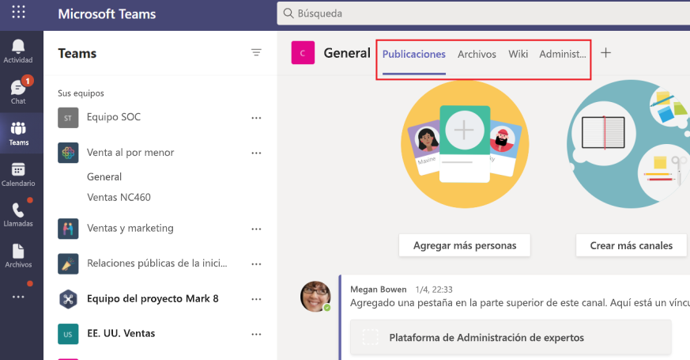

# Pestañas de Microsoft Teams

Las pestañas Teams páginas web que se integran en Microsoft Teams. Son etiquetas sencillas html <iframe que apuntan a dominios declarados en el manifiesto de la aplicación y se pueden agregar como parte de un canal dentro de un equipo, chat de grupo o aplicación personal para un usuario \> individual. Puedes incluir pestañas personalizadas con la aplicación para insertar tu propio contenido web en Teams o agregar una funcionalidad específica Teams al contenido web. Para obtener más información, [vea Teams SDK de cliente de JavaScript](/javascript/api/overview/msteams-client).

> [!IMPORTANT]
> Actualmente, las pestañas personalizadas están disponibles en Government Community Cloud (GCC), GCC-High y Department of Defense (DOD).

La siguiente imagen muestra pestañas personales:

En la siguiente imagen se muestran las pestañas del canal contoso:

> [!VIDEO https://www.youtube-nocookie.com/embed/Jw6i7Mkt0dg]

> [!VIDEO https://www.youtube-nocookie.com/embed/T2a8yJC3VcQ]

Hay pocos requisitos previos que debe superar antes de trabajar en pestañas.

Hay dos tipos de pestañas disponibles en Teams, personal y canal o grupo. [Las pestañas personales,](~/tabs/how-to/create-personal-tab.md)junto con los bots de ámbito personal, forman parte de aplicaciones personales y están en el ámbito de un solo usuario. Se pueden anclar a la barra de navegación izquierda para facilitar el acceso. [Las pestañas](~/tabs/how-to/create-channel-group-tab.md) de canal o grupo entregan contenido a canales y chats de grupo, y son una excelente forma de crear espacios de colaboración en torno al contenido basado en web dedicado.

Puede crear [una página de contenido como](~/tabs/how-to/create-tab-pages/content-page.md) parte de una pestaña personal, una pestaña de canal o grupo o un módulo de tareas. Puedes crear [una página](~/tabs/how-to/create-tab-pages/configuration-page.md) de configuración que permita Microsoft Teams los usuarios configurar una aplicación y usarla para configurar una pestaña de chat de canal o grupo, una extensión de mensajería o un conector de Office 365. Puede permitir a los usuarios volver a configurar la pestaña después de la instalación y [crear una página de](~/tabs/how-to/create-tab-pages/removal-page.md) eliminación de pestañas para la aplicación. Al crear una aplicación Teams que incluya una pestaña, debes probar cómo funciona la pestaña en los clientes de android [y Teams iOS.](~/tabs/design/tabs-mobile.md) La pestaña debe [obtener contexto a](~/tabs/how-to/access-teams-context.md) través de la información básica, la configuración regional y la información del tema, y eso identifica lo que hay en la `entityId` `subEntityId` pestaña.

Puedes crear pestañas con tarjetas adaptables y centralizar todas las funcionalidades de la aplicación Teams eliminando la necesidad de un back-end diferente para los bots y pestañas. [Stage View](~/tabs/tabs-link-unfurling.md) es un nuevo componente de interfaz de usuario que te permite representar el contenido abierto en pantalla completa Teams anclado como una pestaña. El servicio [de desamuestración](~/tabs/tabs-link-unfurling.md) de vínculos existente se actualiza para que se use para convertir direcciones URL en una pestaña mediante una tarjeta adaptable y servicios de chat. Puede crear [pestañas](~/tabs/how-to/conversational-tabs.md) conversacionales con sub-entidades conversacionales que permitan a los usuarios tener conversaciones sobre sub entidades en la pestaña, como tareas específicas, pacientes y oportunidades de ventas, en lugar de analizar toda la pestaña. Puedes realizar cambios en los [márgenes de tabulación](~/resources/removing-tab-margins.md) para mejorar la experiencia del desarrollador al crear aplicaciones.

## Características de tabulación

Las características de la pestaña son las siguientes:

* Si se agrega una pestaña a una aplicación que también tiene un bot, el bot también se agrega al equipo.
* Reconocimiento del Azure Active Directory (AAD) del usuario actual.
* Reconocimiento de configuración regional para que el usuario indique el idioma que es `en-us` .
* Funcionalidad de inicio de sesión único (SSO), si es compatible.
* Capacidad de usar bots o notificaciones de aplicaciones para vincular profundamente a la pestaña o a una sub entity dentro del servicio, por ejemplo, un elemento de trabajo individual.
* La capacidad de abrir un módulo de tareas desde vínculos dentro de una pestaña.
* Reutilización de SharePoint web dentro de la pestaña.

## Escenarios de usuario de pestañas

**Escenario:** Lleve un recurso basado en web existente dentro de Teams. \
**Ejemplo:** Creas una pestaña personal en tu aplicación Teams que presenta un sitio web corporativo informativo a los usuarios.

**Escenario:** Agregue páginas de soporte técnico a Teams bot o extensión de mensajería. \
**Ejemplo:** Se crean pestañas personales que proporcionan **información sobre** **el** contenido de la página web y ayudan a los usuarios.

**Escenario:** Proporcionar acceso a elementos con los que los usuarios interactúan regularmente para el diálogo y la colaboración cooperativos. \
**Ejemplo:** Se crea una pestaña de canal o grupo con vínculos profundos a elementos individuales.

## Comprender cómo funcionan las pestañas

Puede usar uno de los siguientes métodos para crear pestañas:

* [Declarar pestaña personalizada en el manifiesto de la aplicación](#declare-custom-tab-in-app-manifest)
* [Usar la tarjeta adaptable para crear pestañas](~/tabs/how-to/build-adaptive-card-tabs.md)

### Declarar pestaña personalizada en el manifiesto de la aplicación

Se declara una pestaña personalizada en el manifiesto de la aplicación del paquete de la aplicación. Para cada página web que quieras incluir como pestaña en la aplicación, defines una dirección URL y un ámbito. Además, puede agregar el SDK de cliente Teams [JavaScript a](/javascript/api/overview/msteams-client) la página y llamar después `microsoftTeams.initialize()` de que se cargue la página. Teams muestra la página y proporciona acceso Teams información específica, por ejemplo, Teams cliente está ejecutando el tema oscuro.

Independientemente de si elige exponer la pestaña dentro del canal o grupo, o el ámbito personal, debe presentar una página de contenido HTML de iframe <en \> la pestaña.  Para las pestañas personales, la dirección URL de contenido se establece directamente en el manifiesto Teams aplicación mediante la `contentUrl` propiedad de la `staticTabs` matriz. El contenido de la pestaña es el mismo para todos los usuarios.

Para pestañas de canal o grupo, también puede crear una página de configuración adicional. Esta página le permite configurar la dirección URL de la página de contenido, normalmente mediante parámetros de cadena de consulta url para cargar el contenido adecuado para ese contexto. Esto se debe a que la pestaña canal o grupo se puede agregar a varios equipos o chats de grupo. En cada instalación posterior, los usuarios pueden configurar la pestaña, lo que le permite adaptar la experiencia según sea necesario. Cuando los usuarios agregan o configuran una pestaña, se asocia una dirección URL a la pestaña que se presenta en la interfaz Teams usuario (UI). La configuración de una pestaña simplemente agrega parámetros adicionales a esa dirección URL. Por ejemplo, al agregar la pestaña Azure Boards, la página de configuración le permite elegir, qué placa se carga en la ficha. La dirección URL de la página de configuración la especifica la  `configurationUrl` propiedad en la `configurableTabs` matriz del manifiesto de la aplicación.

Puedes tener varios canales o pestañas de grupo y hasta 16 pestañas personales por aplicación.

### Herramientas que puede usar para crear pestañas
* [Kit de herramientas de Teams para Visual Studio Code](../toolkit/visual-studio-code-overview.md)
* [Teams Toolkit para Visual Stuido](../toolkit/visual-studio-overview.md)

## Vea también

* [Solicitar permisos de dispositivo](../concepts/device-capabilities/native-device-permissions.md)
* [Integrar capacidades multimedia](../concepts/device-capabilities/mobile-camera-image-permissions.md)
* [Integrar un escáner qr o de código de barras](../concepts/device-capabilities/qr-barcode-scanner-capability.md)
* [Integrar capacidades de ubicación](../concepts/device-capabilities/location-capability.md)

## Paso siguiente

> [!div class="nextstepaction"]
> [Requisitos previos](~/tabs/how-to/tab-requirements.md)
