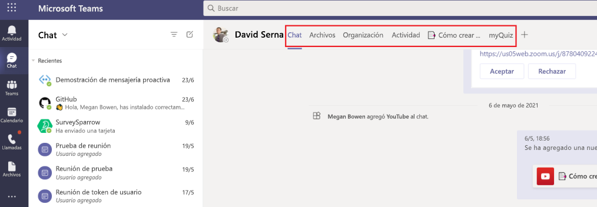

# Pestañas de Microsoft TeamsMicrosoft Teams tabs

Las pestañas Teams páginas web que se integran en Microsoft Teams.Tabs are Teams-aware webpages embedded in Microsoft Teams. Son etiquetas sencillas html <iframe que apuntan a dominios declarados en el manifiesto de la aplicación y se pueden agregar como parte de un canal dentro de un equipo, chat de grupo o aplicación personal para un usuario \> individual.They are simple HTML <iframe\> tags that point to domains declared in the app manifest and can be added as part of a channel inside a team, group chat, or personal app for an individual user. Puedes incluir pestañas personalizadas con la aplicación para insertar tu propio contenido web en Teams o agregar una funcionalidad específica Teams al contenido web.You can include custom tabs with your app to embed your own web content in Teams or add Teams-specific functionality to your web content. Para obtener más información, [vea Teams SDK de cliente de JavaScript](/javascript/api/overview/msteams-client).For more information, see [Teams JavaScript client SDK](/javascript/api/overview/msteams-client).

La siguiente imagen muestra pestañas personales:The following image shows personal tabs:

En la siguiente imagen se muestran las pestañas del canal contoso:The following image shows Contoso channel tabs:

> [!VIDEO https://www.youtube-nocookie.com/embed/Jw6i7Mkt0dg]

> [!VIDEO https://www.youtube-nocookie.com/embed/T2a8yJC3VcQ]

Hay pocos requisitos previos que debe superar antes de trabajar en pestañas.There are few prerequisites that you must go through before working on tabs.

Hay dos tipos de pestañas disponibles en Teams, personal y canal o grupo.There are two types of tabs available in Teams, personal and channel or group. [Las pestañas personales,](~/tabs/how-to/create-personal-tab.md)junto con los bots de ámbito personal, forman parte de aplicaciones personales y están en el ámbito de un solo usuario.[Personal tabs](~/tabs/how-to/create-personal-tab.md), along with personally-scoped bots, are part of personal apps and are scoped to a single user. Se pueden anclar a la barra de navegación izquierda para facilitar el acceso.They can be pinned to the left navigation bar for easy access. [Las pestañas](~/tabs/how-to/create-channel-group-tab.md) de canal o grupo entregan contenido a canales y chats de grupo, y son una excelente forma de crear espacios de colaboración en torno al contenido basado en web dedicado.[Channel or group tabs](~/tabs/how-to/create-channel-group-tab.md) deliver content to channels and group chats, and are a great way to create collaborative spaces around dedicated web-based content.

Puede crear [una página de contenido como](~/tabs/how-to/create-tab-pages/content-page.md) parte de una pestaña personal, una pestaña de canal o grupo o un módulo de tareas.You can [create a content page](~/tabs/how-to/create-tab-pages/content-page.md) as part of a personal tab, channel or group tab, or task module. Puedes crear [una página](~/tabs/how-to/create-tab-pages/configuration-page.md) de configuración que permita Microsoft Teams los usuarios configurar una aplicación y usarla para configurar una pestaña de chat de canal o grupo, una extensión de mensajería o un conector de Office 365.You can [create a configuration page](~/tabs/how-to/create-tab-pages/configuration-page.md) that enables users to configure Microsoft Teams app and use it to configure a channel or group chat tab, a messaging extension, or an Office 365 Connector. Puede permitir a los usuarios volver a configurar la pestaña después de la instalación y [crear una página de](~/tabs/how-to/create-tab-pages/removal-page.md) eliminación de pestañas para la aplicación.You can permit users to reconfigure your tab after installation and [create a tab removal page](~/tabs/how-to/create-tab-pages/removal-page.md) for your application. Al crear una aplicación Teams que incluya una pestaña, debes probar cómo funciona la pestaña en los clientes de android [y Teams iOS.](~/tabs/design/tabs-mobile.md)When you build a Teams app that includes a tab, you must test how your [tab functions on both the Android and iOS Teams clients](~/tabs/design/tabs-mobile.md). La pestaña debe [obtener contexto a](~/tabs/how-to/access-teams-context.md) través de la información básica, la configuración regional y la información del tema, y eso identifica lo que hay en la `entityId` `subEntityId` pestaña.Your tab must [get context](~/tabs/how-to/access-teams-context.md) through basic information, locale and theme information, and `entityId` or `subEntityId` that identifies what is in the tab.

Puedes crear pestañas con tarjetas adaptables y centralizar todas las funcionalidades de la aplicación Teams eliminando la necesidad de un back-end diferente para los bots y pestañas.You can build tabs with Adaptive Cards and centralize all Teams app capabilities by eliminating the need for a different backend for your bots and tabs. [Stage View](~/tabs/tabs-link-unfurling.md) es un nuevo componente de interfaz de usuario que te permite representar el contenido abierto en pantalla completa Teams anclado como una pestaña. El servicio [de desamuestración](~/tabs/tabs-link-unfurling.md) de vínculos existente se actualiza para que se use para convertir direcciones URL en una pestaña mediante una tarjeta adaptable y servicios de chat.[Stage View](~/tabs/tabs-link-unfurling.md) is a new UI component that allows you to render the content opened in full screen in Teams and pinned as a tab. The existing [link unfurling](~/tabs/tabs-link-unfurling.md) service is updated so that it is used to turn URLs into a tab using an Adaptive Card and Chat Services. Puede crear [pestañas](~/tabs/how-to/conversational-tabs.md) conversacionales con sub-entidades conversacionales que permitan a los usuarios tener conversaciones sobre sub entidades en la pestaña, como tareas específicas, pacientes y oportunidades de ventas, en lugar de analizar toda la pestaña. Puedes realizar cambios en los [márgenes de tabulación](~/resources/removing-tab-margins.md) para mejorar la experiencia del desarrollador al crear aplicaciones.You can [create conversational tabs](~/tabs/how-to/conversational-tabs.md) using conversational sub-entities that allow users to have conversations about sub-entities in your tab, such as specific task, patient, and sales opportunity, instead of discussing the entire tab. You can make changes to [tab margins](~/resources/removing-tab-margins.md) to enhance the developer's experience when building apps.

## Características de tabulaciónTab features

Las características de la pestaña son las siguientes:The tab features are as follows:

* Si se agrega una pestaña a una aplicación que también tiene un bot, el bot también se agrega al equipo.If a tab is added to an app that also has a bot, the bot is also added to the team.
* Reconocimiento del Azure Active Directory (AAD) del usuario actual.Awareness of Azure Active Directory (AAD) ID of the current user.
* Reconocimiento de configuración regional para que el usuario indique el idioma que es `en-us` .Locale awareness for the user to indicate language that is `en-us`.
* Funcionalidad de inicio de sesión único (SSO), si es compatible.Single sign-on (SSO) capability, if supported.
* Capacidad de usar bots o notificaciones de aplicaciones para vincular profundamente a la pestaña o a una sub entity dentro del servicio, por ejemplo, un elemento de trabajo individual.Ability to use bots or app notifications to deep link to the tab or to a sub-entity within the service, for example an individual work item.
* La capacidad de abrir un módulo de tareas desde vínculos dentro de una pestaña.The ability to open a task module from links within a tab.
* Reutilización de SharePoint web dentro de la pestaña.Reuse of SharePoint web parts within the tab.

## Escenarios de usuario de pestañasTabs user scenarios

**Escenario:** Lleve un recurso basado en web existente dentro de Teams.**Scenario:** Bring an existing web-based resource inside Teams. \
**Ejemplo:** Creas una pestaña personal en tu aplicación Teams que presenta un sitio web corporativo informativo a los usuarios.**Example:** You create a personal tab in your Teams app that presents an informational corporate website to users.

**Escenario:** Agregue páginas de soporte técnico a Teams bot o extensión de mensajería.**Scenario:** Add support pages to a Teams bot or messaging extension. \
**Ejemplo:** Se crean pestañas personales que proporcionan **información sobre** **el** contenido de la página web y ayudan a los usuarios.**Example:** You create personal tabs that provide **about** and **help** webpage content to users.

**Escenario:** Proporcionar acceso a elementos con los que los usuarios interactúan regularmente para el diálogo y la colaboración cooperativos.**Scenario:** Provide access to items that your users interact with regularly for cooperative dialogue and collaboration. \
**Ejemplo:** Se crea una pestaña de canal o grupo con vínculos profundos a elementos individuales.**Example:** You create a channel or group tab with deep linking to individual items.

## Comprender cómo funcionan las pestañasUnderstand how tabs work

Puede usar uno de los siguientes métodos para crear pestañas:You can use one of the following methods to create tabs:

* [Declarar pestaña personalizada en el manifiesto de la aplicaciónDeclare custom tab in app manifest](#declare-custom-tab-in-app-manifest)
* [Usar la tarjeta adaptable para crear pestañasUse Adaptive Card to build tabs](~/tabs/how-to/build-adaptive-card-tabs.md)

### Declarar pestaña personalizada en el manifiesto de la aplicaciónDeclare custom tab in app manifest

Se declara una pestaña personalizada en el manifiesto de la aplicación del paquete de la aplicación.A custom tab is declared in the app manifest of your app package. Para cada página web que quieras incluir como pestaña en la aplicación, defines una dirección URL y un ámbito.For each webpage you want included as a tab in your app, you define a URL and a scope. Además, puede agregar el SDK de cliente Teams [JavaScript a](/javascript/api/overview/msteams-client) la página y llamar después `microsoftTeams.initialize()` de que se cargue la página.Additionally, you can add the [Teams JavaScript client SDK](/javascript/api/overview/msteams-client) to your page, and call `microsoftTeams.initialize()` after your page loads. Teams muestra la página y proporciona acceso Teams información específica, por ejemplo, Teams cliente está ejecutando el tema oscuro.Teams displays your page and provides access to Teams-specific information, for example the Teams client is running the dark theme.

Independientemente de si elige exponer la pestaña dentro del canal o grupo, o el ámbito personal, debe presentar una página de contenido HTML de iframe <en \> la pestaña.  Para las pestañas personales, la dirección URL de contenido se establece directamente en el manifiesto Teams aplicación mediante la `contentUrl` propiedad de la `staticTabs` matriz.Whether you choose to expose your tab within the channel or group, or personal scope, you must present an <iframe\> HTML [content page](~/tabs/how-to/create-tab-pages/content-page.md) in your tab. For personal tabs, the content URL is set directly in your Teams app manifest by the `contentUrl` property in the `staticTabs` array. El contenido de la pestaña es el mismo para todos los usuarios.Your tab's content is the same for all users.

Para pestañas de canal o grupo, también puede crear una página de configuración adicional.For channel or group tabs, you can also create an additional configuration page. Esta página le permite configurar la dirección URL de la página de contenido, normalmente mediante parámetros de cadena de consulta url para cargar el contenido adecuado para ese contexto.This page allows you to configure content page URL, typically by using URL query string parameters to load the appropriate content for that context. Esto se debe a que la pestaña canal o grupo se puede agregar a varios equipos o chats de grupo.This is because your channel or group tab can be added to multiple teams or group chats. En cada instalación posterior, los usuarios pueden configurar la pestaña, lo que le permite adaptar la experiencia según sea necesario.On each subsequent install, your users can configure the tab, allowing you to tailor the experience as required. Cuando los usuarios agregan o configuran una pestaña, se asocia una dirección URL a la pestaña que se presenta en la interfaz Teams usuario (UI).When users add or configure a tab, a URL is associated with the tab that is presented in the Teams user interface (UI). La configuración de una pestaña simplemente agrega parámetros adicionales a esa dirección URL.Configuring a tab simply adds additional parameters to that URL. Por ejemplo, al agregar la pestaña Azure Boards, la página de configuración le permite elegir, qué placa se carga en la ficha.For example, when you add the Azure Boards tab, the configuration page allows you to choose, which board the tab loads. La dirección URL de la página de configuración la especifica la  `configurationUrl` propiedad en la `configurableTabs` matriz del manifiesto de la aplicación.The configuration page URL is specified by the  `configurationUrl` property in the `configurableTabs` array in your app manifest.

Puedes tener varios canales o pestañas de grupo y hasta 16 pestañas personales por aplicación.You can have multiple channels or group tabs, and up to 16 personal tabs per app.

## Vea tambiénSee also

* [Solicitar permisos de dispositivoRequest device permissions](../concepts/device-capabilities/native-device-permissions.md)
* [Integrar capacidades multimediaIntegrate media capabilities](../concepts/device-capabilities/mobile-camera-image-permissions.md)
* [Integrar un escáner qr o de código de barrasIntegrate a QR or barcode scanner](../concepts/device-capabilities/qr-barcode-scanner-capability.md)
* [Integrar capacidades de ubicaciónIntegrate location capabilities](../concepts/device-capabilities/location-capability.md)

## Paso siguienteNext step

> [!div class="nextstepaction"]
> [Requisitos previosPrerequisites](~/tabs/how-to/tab-requirements.md)
