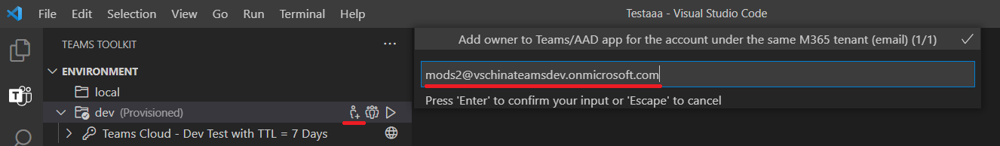
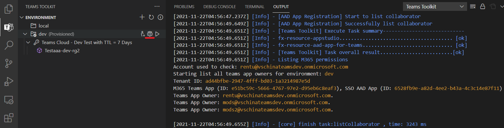

# Colaborar en Teams proyecto mediante Teams Toolkit

Varios desarrolladores pueden trabajar juntos para depurar, aprovisionar e implementar para el mismo proyecto de TeamsFx, pero requiere establecer manualmente los permisos adecuados de Teams App y AAD App, lo que no es fácil de hacer.

Teams Toolkit ahora admite la característica de colaboración para permitir que un desarrollador (propietario del proyecto) invite a otros desarrolladores (colaboradores) al proyecto teamsFx para depurar, aprovisionar e implementar el mismo proyecto de TeamsFx.

## Requisitos previos

* Requisitos previos de la cuenta

    Para aprovisionar recursos en la nube en Azure y Microsoft 365, debe tener las siguientes cuentas con los permisos adecuados. Consulta Preparar [cuentas para crear Teams aplicación para](accounts.md) obtener más información.

    * Microsoft 365
    * Azure con suscripción válida

* [Instale Teams Toolkit](https://marketplace.visualstudio.com/items?itemName=TeamsDevApp.ms-teams-vscode-extension) versión 3.0.0+.

> [!TIP]
> Ya debería tener abierto un proyecto Teams aplicación en el código VS.

## Colaborar con otros desarrolladores

### Como propietario de un proyecto

> [!NOTE]
> Antes de agregar colaboradores para un entorno, el propietario del proyecto debe [aprovisionar](provision.md) primero el proyecto.

* En la sección **ENTORNO** de Teams Toolkit, pase el mouse sobre el nombre del entorno para buscar **botones** colaboradores, uno es el botón Agregar propietarios de aplicaciones de Teams **M365 (con** una aplicación de AAD), el otro botón De lista **M365 Teams** App (con una aplicación de AAD) como se muestra en la siguiente imagen:

  

* Selecciona **Agregar M365 Teams App (con AAD App) y** agrega otra dirección de correo electrónico de cuenta M365 como colaborador. La cuenta que se va a agregar debe estar en el mismo inquilino que el propietario del proyecto para la **depuración** remota, como se muestra en la imagen:

  

* Para ver colaboradores en el entorno actual, selecciona Enumerar **M365 Teams App (con el** botón Propietarios de AAD App) y, a continuación, los colaboradores aparecerán en el canal de salida como se muestra en la siguiente imagen:

  

* Presione el proyecto para GitHub.

> [!NOTE]
> El colaborador recién agregado no recibirá ninguna notificación. Project propietario debe notificar a los colaboradores.

### Como colaborador del proyecto

* Clone el proyecto desde GitHub
* Cuenta M365 de inicio de sesión

> [!NOTE]
> Los colaboradores deben iniciar sesión con la cuenta agregada por el propietario del proyecto que está **bajo el mismo inquilino con el propietario del proyecto**.

* Cuenta de Azure de inicio de sesión que tiene permiso de colaborador para todos los recursos de Azure que se usan en este proyecto.
* Trabajando en el código del proyecto, implementa el proyecto en remoto cuando creas que es el momento de obtener una vista previa de la Teams aplicación.
* Inicie el control remoto para tener una vista previa de la Teams aplicación. Para obtener más información, [consulta compilar y ejecutar la aplicación Teams en un entorno remoto.](/microsoftteams/platform/sbs-gs-javascript?tabs=vscode%2Cvsc%2Cviscode%2Cvcode&tutorial-step=3&branch)

### Limitaciones

> [!NOTE]
> El administrador de suscripciones de Azure debe establecer manualmente los permisos relacionados con Azure en Azure Portal. La cuenta de Azure debe tener un rol de colaborador para la suscripción al menos para que los desarrolladores puedan trabajar juntos para aprovisionar e implementar el proyecto de TeamsFx.

1. **No se puede** eliminar: no se pueden quitar colaboradores directamente de Teams Toolkit extensión. Siga los pasos siguientes para quitar colaboradores manualmente:

      1. Ve a [Teams Developer Portal](https://  dev.teams.microsoft.com/apps), busca tu Teams app por nombre o id. de aplicación.
      2. Dentro de la Teams administración de aplicaciones, selecciona **Propietarios** en el panel izquierdo.
      3. Busque y quite el colaborador.
      4. Vaya a [Azure Active Directory](https://ms.portal.azure.com/#blade/Microsoft_AAD_IAM/ActiveDirectoryMenuBlade/RegisteredApps), seleccione **Registro de aplicaciones** en el panel izquierdo y busque la aplicación AAD aplicación.
      5. Dentro de la AAD administración de aplicaciones, seleccione **Propietarios** en el panel izquierdo.
      6. Busque y quite el colaborador.

1. El colaborador agregado al proyecto no recibirá ninguna notificación. Project propietario debe notificar a los colaboradores sin conexión.

## Consulte también

> [!div class="nextstepaction"]
> [Aprovisionar recursos en la nube](provision.md)

> [!div class="nextstepaction"]
> [Implementar Teams aplicación en la nube](deploy.md)

> [!div class="nextstepaction"]
> [Administrar varios entornos](TeamsFx-multi-env.md)
