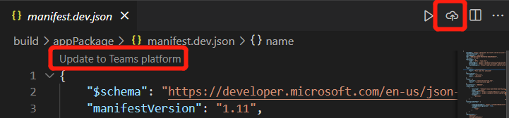

# <a name="preview-teams-app-manifest-in-teams-toolkit"></a>Vista previa Teams manifiesto de la aplicación en Teams Toolkit

Después de scaffolding, se obtienen dos archivos de plantilla de manifiesto en `templates/appPackage` la carpeta.

- `manifest.local.template.json` - Aplicación de equipos de depuración local.
- `manifest.remote.template.json` - compartido entre todos los entornos remotos.

Estos archivos de plantilla que contienen algunos marcadores de posición y los valores reales de Teams Toolkit se resolverán en archivos en `.fx/configs` y `.fx/states` .

## <a name="prerequisite"></a>Requisito previo

* [Instale Teams Toolkit](https://marketplace.visualstudio.com/items?itemName=TeamsDevApp.ms-teams-vscode-extension) versión 3.0.0+.

> [!TIP]
> Ya debería tener abierto un proyecto Teams aplicación en el código VS.

## <a name="preview-manifest"></a>Manifiesto de vista previa

Para obtener una vista previa del manifiesto con contenido real, Teams Toolkit generará archivos de manifiesto de vista previa en la `build/appPackage` carpeta:

```text
└───build
    └───appPackage
        ├───appPackage.{env}.zip - Zipped app package of remote teams app
        ├───appPackage.local.zip - Zipped app package of local team app
        ├───manifest.{env}.json  - Previewed manifest of remote teams app
        └───manifest.local.json  - Previewed manifest of local teams app
```

### <a name="local-debug-teams-app"></a>Aplicación de depuración Teams local

Para obtener una vista previa del archivo de manifiesto de la aplicación de teams local, debes presionar **F5** para ejecutar primero la depuración local. Este paso generará la configuración local predeterminada y, a continuación, el paquete de la aplicación y el manifiesto de vista previa se crearán en la carpeta **build/appPackage.**

Las otras formas son:

- Seleccione **Vista** previa en los codelens del **archivo manifest.local.template.json**
- Seleccione **Vista previa del archivo de** manifiesto en la barra de menús del archivo **manifest.local.template.json**
- Seleccione **Zip Teams de metadatos en** Treeview y seleccione **Local** La vista previa local aparece como se muestra en la siguiente imagen:


### <a name="remote-environment"></a>Entorno remoto

Para obtener una vista previa del archivo  de manifiesto de la aplicación de teams remotos, debes seleccionar Aprovisionar en la nube en Teams Toolkit el panel DESARROLLO de una extensión Treeview o desencadenar **Teams:** Aprovisionar en la nube desde la paleta de comandos primero. Este paso generará configuraciones para la aplicación de teams remotos y, a continuación, el paquete de la aplicación y el manifiesto de vista previa se crearán en la carpeta **build/appPackage.**

Las otras formas son:

- Seleccione **Vista** previa en los codelens del **archivo manifest.remote.template.json.**
- Seleccione **Vista previa del archivo de** manifiesto en la barra de menús del archivo **manifest.remote.template.json.**
- Seleccione **Zip Teams de metadatos en** Treeview y seleccione el entorno.


> Si hay más de un entorno, debe seleccionar la env que desea obtener una vista previa como se muestra en la imagen:


## <a name="sync-local-changes-to-dev-portal"></a>Sincronizar cambios locales en el Portal de desarrollo

Después de obtener una vista previa del archivo de manifiesto, puede sincronizar los cambios locales en el Portal de desarrollo de las siguientes maneras:

- Seleccione **Actualizar para Teams plataforma** en la esquina superior izquierda de`manifest.{env}.json`
- Seleccione **Teams: Actualizar manifiesto a Teams plataforma** en la barra de menús de`manifest.{env}.json`
- Trigger **Teams: update manifest to Teams platform** from command palette


 

> [!NOTE]
> El desencadenador de codelens del editor o el botón de título actualizará el archivo de manifiesto actual a Teams plataforma. El desencadenador de la paleta de comandos requerirá seleccionar el entorno de destino.

Si el archivo de manifiesto está obsoleto debido al cambio de archivo de configuración o al cambio de plantilla, se pedirá al usuario que confirme su acción: 

- **Solo vista previa:** el archivo de manifiesto local se sobrescribirá según la configuración actual
- **Vista previa y actualización:** el archivo de manifiesto local se sobrescribirá según la configuración actual y también se actualizará Teams plataforma al mismo tiempo
- **Cancelar**: no hacer nada

> [!NOTE]
> Los cambios se actualizarán al portal de desarrollo. Si tiene algunas actualizaciones manuales en el portal de desarrollo, se sobrescribirá.

## <a name="see-also"></a>Consulte también

> [!div class="nextstepaction"]
> [Personalizar Teams de aplicación en Teams Toolkit](TeamsFx-manifest-customization.md)
