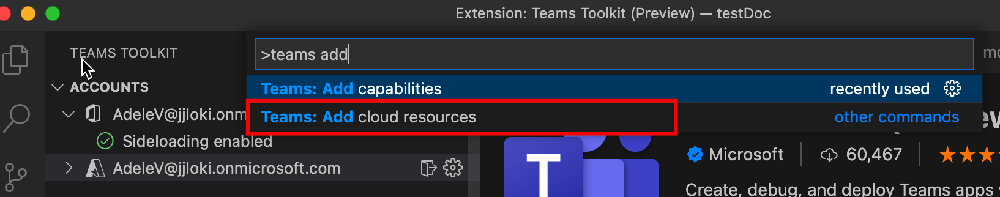

# Agregar recursos en la nube a la Teams aplicación

TeamsFx ayuda a aprovisionar recursos en la nube para el hospedaje de aplicaciones. También puede agregar recursos en la nube que se adapten a sus necesidades de desarrollo.

## Requisito previo

* [Instale Teams Toolkit](https://marketplace.visualstudio.com/items?itemName=TeamsDevApp.ms-teams-vscode-extension) versión 3.0.0+.

> [!TIP]
> Ya deberías tener un proyecto Teams aplicación.

## Agregar recursos en la nube mediante Teams Toolkit

> [!IMPORTANT]
> Debe aprovisionar cada entorno después de agregar un recurso.

1. Abra **Visual Studio Code**.
1. Seleccione **Teams Toolkit** desde el panel izquierdo:

    

1. En el panel Teams Toolkit barra lateral, seleccione **Agregar recursos en la nube:**

    

    También puede abrir la paleta de comandos y **escribir Teams: Agregar recursos en la nube:**
    
    > [!NOTE]
    > Siga el mismo proceso que se desencadenó desde la vista de árbol:

    

1. En la ventana emergente, selecciona los recursos en la nube que quieras agregar a tu proyecto Teams aplicación:

     

1. Seleccione **Aceptar**.

## Agregar recursos en la nube mediante la CLI de TeamsFx en la ventana de comandos

1. Cambie el directorio al **directorio del proyecto**.
1. Ejecutar comando para agregar distintas funcionalidades.

En la tabla siguiente se describen los recursos en la nube y los comandos correspondientes para agregarlos:

|Recursos en la nube|Comando|
|---------------|----------|
| Función Azure|`teamsfx resource add azure-function --function-name your-func-name`|
| Base de datos SQL Azure|`teamsfx resource add --function-name your-func-name`|
| Administración de API de Azure|`teamsfx resource add azure-apim`|

## Qué recursos en la nube se pueden agregar

TeamsFx proporciona integraciones perfectas con los servicios de Azure que son comunes para los siguientes escenarios de aplicación:

- [Funciones de Azure:](/azure/azure-functions/functions-overview)una solución sin servidor para satisfacer los requisitos a petición, como la creación de API web para el back-end Teams aplicaciones.
- Base SQL de datos [de Azure:](/azure/azure-sql/database/sql-database-paas-overview)una plataforma totalmente administrada como motor de base de datos de servicio (PaaS) para que sirva como almacén de datos Teams aplicaciones.
- [Administración de API de Azure:](/azure/azure-sql/database/sql-database-paas-overview)una puerta de enlace de API que se puede usar para administrar api creadas para aplicaciones Teams y publicarlas para que las consuman en otras aplicaciones, como Power Apps.

## Qué sucede cuando se agregan recursos

Los siguientes cambios se realizarán en el proyecto al agregar recursos:

- Se pueden agregar nuevos parámetros a azure.parameter. {env}.json para proporcionar la información necesaria para la provisión.
- El nuevo contenido se anexa ARM plantilla en la carpeta (excepto los archivos de la carpeta) para `templates/azure` crear los recursos de Azure `templates/azure/teamsfx` agregados.
- Los archivos de la carpeta se regeneran para garantizar que la configuración necesaria de TeamsFx está actualizada para `templates/azure/teamsfx` los recursos de Azure agregados.
- `.fx/projectSettings.json` se actualiza para realizar un seguimiento de los recursos presentes en el proyecto.

Mientras tanto, hay algunos cambios adicionales para cada tipo de recurso:

|Recursos agregados|Qué cambió|Por qué se realizan estos cambios|
|---------------|---------------|-----------------------------|
|Azure Functions|Se agrega un código de plantilla de Azure Functions a una subcarpeta con ruta de acceso `yourProjectFolder/api`  `launch.json` y `task.json` se actualiza en `.vscode` carpeta.| Incluya una plantilla de desencadenador http hello world en el proyecto.   Para incluir scripts necesarios para Visual Studio Code se ejecuten cuando desee depurar la aplicación localmente.|
|Administración de API de Azure|Un archivo de especificación de LA API abierta agregado a una subcarpeta con ruta de acceso `yourProjectFolder/openapi`|Este es el archivo de especificación de api que define la API después de su publicación.|

## Limitaciones

- Solo puede agregar una aplicación function / Azure SQL Database / servicio APIM al proyecto.
- No puedes agregar recursos si el proyecto no contiene la aplicación tab.

## Consulte también

> [!div class="nextstepaction"]
> [Aprovisionar recursos en la nube](provision.md)
