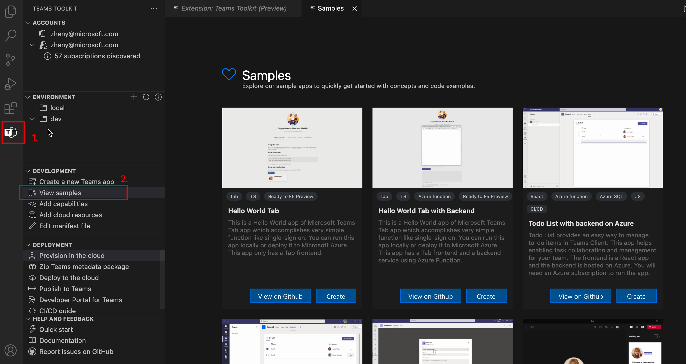

# Crear nuevo Teams proyecto mediante Teams Toolkit

Puedes crear **un nuevo proyecto** o crear a partir de **ejemplos**, para usar el Teams Toolkit para Teams de aplicaciones.

## Crear un proyecto

La siguiente guía de pasos para crear un nuevo proyecto Teams aplicación mediante Teams Toolkit:

- [Crear una nueva Teams tab (React)](/microsoftteams/platform/sbs-gs-javascript?tabs=vscode%2Cvsc%2Cviscode%2Cvcode&tutorial-step=2)
- [Crear una nueva Teams bot](/microsoftteams/platform/sbs-gs-spfx?tabs=vscode%2Cviscode&branch)
- [Crear una nueva aplicación de extensión de mensaje](/microsoftteams/platform/sbs-gs-javascript?tabs=vscode%2Cvsc%2Cviscode%2Cvcode&tutorial-step=6&branch)
- [Crear una nueva Teams tab (SharePoint Framework)](/microsoftteams/platform/sbs-gs-spfx?tabs=vscode%2Cviscode&branch)

## Crear a partir de ejemplos

Si no quieres empezar con la aplicación "hello world",  puedes intentar explorar la galería de muestras y encontrar algo con lo que te interesa empezar tu propio trabajo. Los siguientes pasos te ayudan a crear aplicaciones a partir de ejemplos:

 1. Abra **Teams Toolkit** desde Visual Studio Code.

 1. Seleccione **la sección DESARROLLO** en vista árbol.

 1. Seleccione **Ver ejemplos**. Aparece la galería de ejemplo.

En la galería de ejemplos, puede explorar ejemplos y descargarlos como se muestra en la siguiente imagen:

Puedes descargar y ejecutar aplicaciones de forma local o remota para obtener una vista previa en Teams cliente web. Siga las instrucciones de cada ejemplo o examine el código fuente de los ejemplos seleccionando **Ver en GitHub**. A continuación, puede abrir el repositorio de código fuente para Samples.

## Consulte también

> [!div class="nextstepaction"]
> [Aprovisionar recursos en la nube](provision.md)

> [!div class="nextstepaction"]
> [Implementar Teams aplicación en la nube](deploy.md)

> [!div class="nextstepaction"]
> [Publicar la aplicación Teams web](TeamsFx-collaboration.md)

> [!div class="nextstepaction"]
> [Administrar varios entornos](TeamsFx-multi-env.md)

> [!div class="nextstepaction"]
> [Colaborar con otros desarrolladores en Teams proyecto](TeamsFx-collaboration.md)
