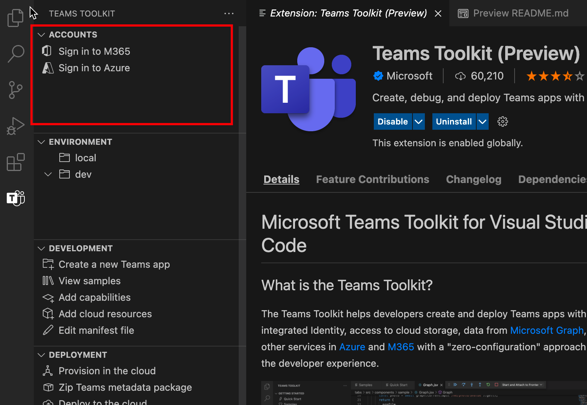
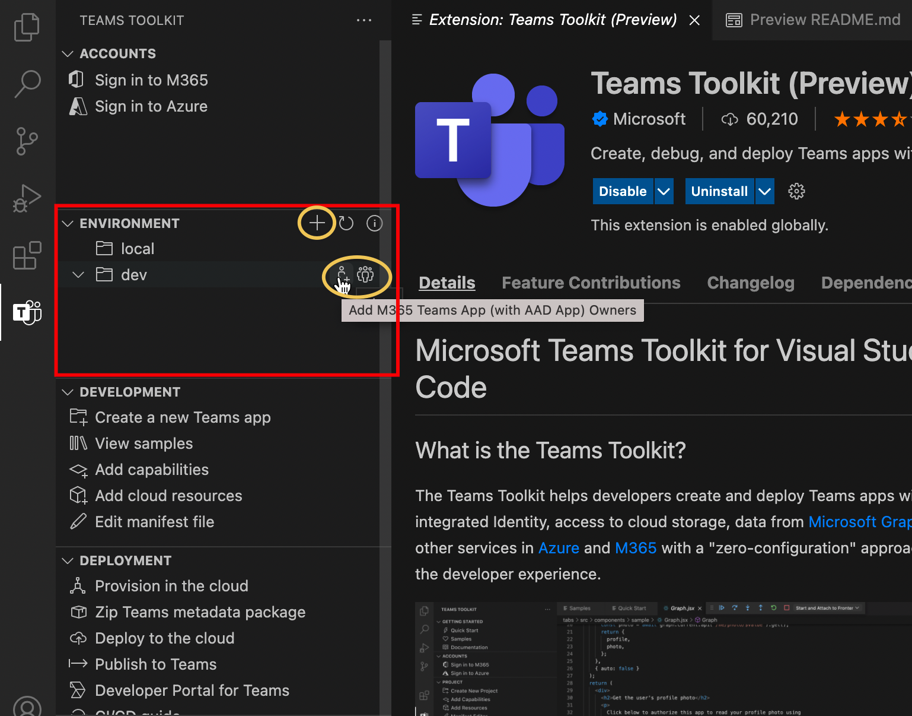

# Teams Toolkit

> [!NOTE]
> Actualmente, esta característica solo está disponible en **la versión preliminar del desarrollador** público.

Teams Toolkit para Visual Studio Code ayuda a los desarrolladores a crear e implementar aplicaciones de Teams con identidad integrada, acceso al almacenamiento en la nube, datos de Microsoft Graph y otros servicios en Azure y Microsoft 365 con un enfoque de configuración cero para la experiencia del desarrollador.  

Hay un Teams Toolkit para Visual Studio y una herramienta [cli](https://github.com/OfficeDev/TeamsFx/blob/dev/docs/cli/user-manual.md) para el Teams de aplicaciones (denominada `teamsfx` ).

## Instalar el Teams Toolkit para Visual Studio Code

1. Abra **Visual Studio Code.**

1. Seleccione la vista Extensiones (**Ctrl+Mayús+X**  /  **,⇧-X** o **Ver > extensiones**).

1. En el cuadro de búsqueda, **escriba Teams Toolkit**.

1. Seleccione **el botón** instalar situado junto al Teams Toolkit.

O puede encontrar el Teams Toolkit en el [Visual Studio Code Marketplace](https://marketplace.visualstudio.com/items?itemName=TeamsDevApp.ms-teams-vscode-extension).

## Compatibilidad Teams aplicaciones

[Microsoft Teams capacidades de la](../concepts/capabilities-overview.md) aplicación son Teams extensibilidad points.Teams Toolkit para Visual Studio Code permite a los desarrolladores trabajar en el proyecto con las siguientes funcionalidades Teams aplicaciones:

* [Pestañas](../tabs/what-are-tabs.md#microsoft-teams-tabs)

* [Bots](../bots/what-are-bots.md#bots-in-microsoft-teams)

* [Extensiones de mensajería](../messaging-extensions/what-are-messaging-extensions.md#messaging-extensions) 

El Teams puede contener una de las capacidades o las tres funciones anteriores. Puede seleccionar cualquier funcionalidad al crear el Teams Project.

Teams Toolkit proporciona flexibilidad para agregar más funcionalidades en un proceso adicional de desarrollo Teams aplicaciones.

## Recorrido de usuario de Teams Toolkit

Teams Toolkit proporciona características de Teams desarrollo de aplicaciones para facilitar la depuración, implementación y publicación. Teams Toolkit automatiza el trabajo manual y proporciona una gran integración de Teams recursos de Azure. La siguiente imagen muestra Teams Toolkit de usuario:

## Realizar un recorrido por Teams Toolkit para Visual Studio Code

Si no abre ningún proyecto de Teams en VS Code o abre cualquier proyecto que no se cree con Teams Toolkit v2.+, verá la interfaz de usuario de Teams Toolkit con funcionalidades limitadas, como se muestra en la siguiente imagen:

:::image type="content" source="./images/teams-toolkit-beforestart.png" alt-text="Antes de iniciar Teams Toolkit":::

Puedes seleccionar **Inicio rápido para** explorar el Teams Toolkit o seleccionar Crear una nueva **aplicación** Teams para crear un Teams proyecto. Si tienes un Teams Project creado por Teams Toolkit v2.+ abierto en VS Code, verás una interfaz de usuario Teams Toolkit con más funcionalidades como se muestra en la siguiente imagen:

:::image type="content" source="./images/teams-toolkit-overview.png" alt-text="Realizar un recorrido a Teams Toolkit":::

Vamos a realizar un recorrido por las funcionalidades que están disponibles en Teams Toolkit:

* [Accounts](#accounts)

* [Entorno](#environment)

* [Desarrollo](#development)

* [Implementación](#deployment)

* [Ayuda y comentarios](#help-and-feedback)

### Cuentas

Los desarrolladores deben tener una Microsoft 365 para crear Teams aplicación. Si no tienes una, puedes obtener acceso gratuito a Teams de desarrollador uniéndose al [programa Microsoft 365 desarrollador:](https://developer.microsoft.com/microsoft-365/dev-program)

La cuenta de Azure se usa normalmente en Teams desarrollo de aplicaciones. Si desea hospedar la aplicación Teams o tener acceso a recursos en Azure, debe tener una cuenta de Azure. Teams Toolkit la experiencia integrada para iniciar sesión, aprovisionar e implementar recursos de Azure. Puede crear [una cuenta gratuita de Azure](https://azure.microsoft.com/free/) antes de empezar.

 Para obtener más información, consulta [Preparar cuentas para crear Teams aplicación](accounts.md)

### Entorno

Teams Toolkit le ayuda a administrar varios entornos. Puede agregar, configurar y personalizar entornos. Puede elegir agregar colaboradores para cada entorno:

 Para obtener más información, vea [administrar varios entornos](TeamsFx-multi-env.md) y colaborar con otros desarrolladores [en Teams proyecto](TeamsFx-collaboration.md).

### Desarrollo

Teams Toolkit te ofrece comodidad para crear y personalizar tu proyecto de aplicación Teams que hace que el desarrollo de aplicaciones Teams funcione de forma fácil y rápida: 

1. **Crear una nueva aplicación Teams**, ayuda a iniciar Teams trabajo de desarrollo de aplicaciones con un proyecto de plantilla "hello world" o un proyecto de ejemplo. Para obtener más información, vea [Create new Teams project](create-new-project.md)
1. **Ver ejemplos**, muestra un conjunto de Teams de ejemplo para que explores, consultes y desarrolles.
1. **Agregar funcionalidades**, ayuda a agregar otras funcionalidades Teams a Teams aplicación en cualquier momento durante el proceso de desarrollo. Para obtener más información, [consulta Agregar funcionalidades a tu Teams aplicación](add-capability.md)
1. **Agregar recursos en la** nube le permite agregar recursos de nube adicionales según el cambio de requisito. Para obtener más información, [consulta Agregar recursos en la nube para tu Teams aplicación](add-resource.md)
1. **Editar archivo de manifiesto** te permite editar fácilmente cómo se integra Teams aplicación con Teams cliente. Para obtener más información, vea [preview Teams manifest file](TeamsFx-manifest-preview.md) and edit Teams manifest [file](TeamsFx-manifest-customization.md).

### Implementación

Durante o después del desarrollo, debes seguir el proceso para aprovisionar, implementar y publicar una aplicación Teams antes de que sea accesible para los usuarios:

1. Si quieres hospedar la aplicación Teams en Azure o necesitas usar recursos de **Azure,** Aprovisionar en la nube te ayuda a automatizar el proceso para crear recursos de Azure. Para usarlo, debe tener una suscripción de Azure. Para obtener más información, vea [aprovisionar recursos en la nube](provision.md).

1. Antes de publicar la aplicación o compartir, puedes crear la aplicación Teams en paquetes **seleccionando Zip Teams paquete** de metadatos .

1. **Implementar en la nube le** ayuda a implementar su código fuente en Azure. El requisito previo para ejecutar la implementación es tener recursos aprovisionados ejecutando **Aprovisionar** en la nube o debe crear los recursos de Azure manualmente y especificar el parámetro de recurso en la configuración del entorno del proyecto. Para obtener más información, [consulta implementar Teams aplicación en la nube.](deploy.md)

1. En lugar de publicar manualmente la aplicación Teams personalizada, puedes usar **la** función Publicar Teams para llamar Teams api para publicar Teams aplicación. Necesitas el permiso para cargar Teams aplicación. Para obtener más información, [consulta Publicar la aplicación en Teams](publish.md).

1. Portal para desarrolladores para Teams es donde puedes administrar y distribuir tu aplicación Teams aplicación. Para obtener más información, vea [portal para desarrolladores](/microsoftteams/platform/concepts/build-and-test/teams-developer-portal)

1. Teams Toolkit también proporciona plantilla de CI/CD para herramientas de CI/CD como flujo de trabajo GitHub, Devops de Azure y Jenkins. Para obtener más información, vea [build CI/CD pipelines for Teams application](use-CICD-template.md)

### Ayuda y comentarios

En esta sección, puede encontrar fácilmente la documentación y los recursos que necesita. Puede seleccionar Notificar **problemas en GitHub** en el Teams Toolkit para obtener soporte técnico **rápido** del experto en productos. Examine el problema antes de crear uno nuevo o visite la etiqueta [StackOverflow `teams-toolkit` ](https://stackoverflow.com/questions/tagged/teams-toolkit) para examinar y hacer preguntas:

## Consulte también

> [!div class="nextstepaction"]
> [Crear un nuevo uso de proyecto Teams Toolkit](create-new-project.md)

> [!div class="nextstepaction"]
>[Preparar cuentas para crear Teams aplicaciones](accounts.md)
