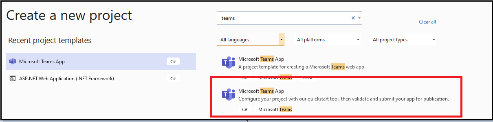

# Crear aplicaciones con el Teams Toolkit y Visual StudioBuild apps with the Teams Toolkit and Visual Studio

El kit de herramientas de Microsoft Teams le permite crear aplicaciones personalizadas de Teams directamente desde el entorno de desarrollo integrado (IDE) de Visual Studio.The Microsoft Teams Toolkit enables you to create custom Teams apps directly within the Visual Studio integrated development environment (IDE). El kit de herramientas de Microsoft Teams le orienta en el proceso y le ofrece todo lo que necesita para crear, depurar e iniciar su aplicación de Teams.The Microsoft Teams toolkit guides you through the process and provides everything you need to build, debug, and launch your Teams app.

## Requisitos previosPrerequisites

1. [Habilitar la vista previa del desarrollador](../resources/dev-preview/developer-preview-intro.md#enable-developer-preview).[Enable developer preview](../resources/dev-preview/developer-preview-intro.md#enable-developer-preview).

1. Asegúrese de que el **ASP.NET y el** módulo de desarrollo web se han agregado a la instancia Visual Studio web.Make sure that the **ASP.NET and web development module** has been added to your Visual Studio instance. Puede comprobar si sigue los pasos de la Visual Studio [agregando o](/visualstudio/install/modify-visual-studio?view=vs-2019&preserve-view=true) quitando cargas de trabajo y documentación de componentes.You can check by following the steps in the [modify Visual Studio by adding or removing workloads and component](/visualstudio/install/modify-visual-studio?view=vs-2019&preserve-view=true) documentation.

3. Si quieres probar la aplicación implementandola desde Visual Studio, debes tener Servicios de Internet Information Server (IIS)) instalado en el entorno de desarrollo.If you want to test your app by deploying it from Visual Studio, you must have Internet Information Services (IIS)) installed in your development environment. Visual Studio no incluye IIS y no se incluye en la configuración predeterminada Windows 10, Windows 8 o Windows 7; sin embargo, puede descargar la versión más reciente del Centro [de descarga de Microsoft](https://www.microsoft.com/download/details.aspx?id=48264).Visual Studio does not include IIS and it is not included in the default Windows 10, Windows 8, or Windows 7 configuration; however, you can download the latest version from the [Microsoft download center](https://www.microsoft.com/download/details.aspx?id=48264).

## Instale el Teams ToolkitInstall the Teams Toolkit

El Microsoft Teams Toolkit para Visual Studio está disponible para su descarga desde [Visual Studio Marketplace](https://marketplace.visualstudio.com/items?itemName=TeamsDevApp.vsteamstemplate) o directamente desde el menú **Extensiones** de Visual Studio.The Microsoft Teams Toolkit for Visual Studio is available for download from the [Visual Studio Marketplace](https://marketplace.visualstudio.com/items?itemName=TeamsDevApp.vsteamstemplate) or directly from the **Extensions** menu within Visual Studio. Desde el Visual Studio Marketplace también descargar [Teams Toolkit para Visual Studio 2019](https://marketplace.visualstudio.com/items?itemName=msft-vsteamstoolkit.vsteamstoolkit).From the Visual Studio Marketplace also download [Teams Toolkit for Visual Studio 2019](https://marketplace.visualstudio.com/items?itemName=msft-vsteamstoolkit.vsteamstoolkit).

## Uso del kit de herramientasUsing the toolkit

- [Configurar un nuevo proyectoSet up a new project](#set-up-a-new-teams-project)
- [Configurar la aplicaciónConfigure your app](#configure-your-app)
- [Empaquetar la aplicaciónPackage your app](#package-your-app)
- [Instalar y ejecutar la aplicación en TeamsInstall and run your app in Teams](#install-and-run-your-app-locally)
- [Valide su aplicaciónValidate your app](#validate-your-app)
- [Publicar la aplicaciónPublish your app](#publish-your-app-to-teams)

## Configurar un nuevo proyecto Teams proyectoSet up a new Teams project

1. Seleccione **Crear nuevo proyecto**.Select **Create New Project**.

    

1. Elija la herramienta de inicio rápido **para Microsoft Teams app** y seleccione **Siguiente**.Choose the quickstart tool for **Microsoft Teams App** and select **Next**.
1. En la **página Configurar el nuevo** proyecto, escriba el nombre **Project**, **Ubicación** y Nombre de **la solución**.In the **Configure your new project** page, enter the **Project name**, **Location**, and **Solution name**.
1. Active la **casilla Colocar solución y proyecto en el mismo directorio.**Select the **Place solution and project in the same directory** checkbox.
1. En la ventana emergente Agregar **capacidades,** elija una o más funciones para la configuración del proyecto.In the **Add Capabilities** pop-up window, choose one or more capabilities for your project setup.
1. Seleccione el **botón** Siguiente para completar el proceso de configuración.Select the **Next** button to complete the configuration process.
1. En la **ventana** emergente Agregar capacidades, elija las propiedades de cada funcionalidad seleccionada.In the **Add Capabilities** pop-up window, choose the properties for each selected capability.
1. Seleccione **Finalizar**.Select **Finish**. Se **muestra Microsoft Teams Toolkit** página de aterrizaje.The **Microsoft Teams Toolkit** landing page is shown.

    

## Configurar la aplicaciónConfigure your app

En su núcleo, la aplicación Teams abarca tres componentes:At its core, the Teams app embraces three components:

  1. El Microsoft Teams web, de escritorio o móvil, donde los usuarios interactúan con la aplicación.The Microsoft Teams client including web, desktop, or mobile, where users interact with your app.
  1. Un servidor que responde a solicitudes de contenido que se muestra en Teams, por ejemplo, contenido de pestaña HTML o una tarjeta adaptable de bot.A server that responds to requests for content that is displayed in Teams, for example, HTML tab content or a bot adaptive card.
  1. Un Teams de la aplicación consta de tres archivos:A Teams app package consists of three files:

      - El manifest.jsenThe manifest.json
      - Icono [de color para](../resources/schema/manifest-schema.md#icons) que la aplicación se muestre en el catálogo de aplicaciones públicas u de la organización.A [color icon](../resources/schema/manifest-schema.md#icons) for your app to display in the public or organization app catalog.
      - Icono [de esquema para](../resources/schema/manifest-schema.md#icons) mostrar en la barra Teams actividad.An [outline icon](../resources/schema/manifest-schema.md#icons) for display on the Teams activity bar.

Cuando se instala una aplicación, el cliente Teams analiza el archivo de manifiesto para determinar la información necesaria, como el nombre de la aplicación y la dirección URL donde se encuentran los servicios.When an app is installed, the Teams client parses the manifest file to determine needed information like the name of your app and the URL where the services are located.

> [!NOTE]
>Si aún no lo ha hecho, debe iniciar sesión en su cuenta de Microsoft 365 para continuar con el proceso de desarrollo.If you have not done so already, you must sign in to your Microsoft 365 account to continue with the development process.
>
> Si no tiene una cuenta Microsoft 365, puede registrarse para una suscripción Microsoft 365 [Programa para desarrolladores.](https://developer.microsoft.com/microsoft-365/dev-program)If you do not have a Microsoft 365 account, you can sign up for a [Microsoft 365 Developer Program](https://developer.microsoft.com/microsoft-365/dev-program) subscription. Es gratuito durante 90 días y se renueva siempre que lo use para la actividad de desarrollo.It's free for 90 days and renews as long as you are using it for development activity. Si tiene una suscripción Visual Studio Enterprise o Professional, ambos programas incluyen una suscripción Microsoft 365 desarrollador [gratuita,](https://aka.ms/MyVisualStudioBenefits)activa durante la vida de su Visual Studio suscripción.If you have a Visual Studio Enterprise or Professional subscription, both programs include a free Microsoft 365 [developer subscription](https://aka.ms/MyVisualStudioBenefits), active for the life of your Visual Studio subscription. Para obtener más información, vea [Configurar una Microsoft 365 de desarrollador](/office/developer-program/office-365-developer-program-get-started).For more information, see [set up a Microsoft 365 developer subscription](/office/developer-program/office-365-developer-program-get-started).

### Pasos de la configuración Configuration steps

1. Para configurar la aplicación, en la **Microsoft Teams Toolkit** de aterrizaje, seleccione **Editar paquete de la aplicación**.To configure your app, on the **Microsoft Teams Toolkit** landing page, select **Edit app package**.
1. En el menú desplegable Mis **entornos,** seleccione **desarrollo**.From the **My Environments** drop-down menu, select **development**.
1. En la **página Detalles de** la aplicación, edite los campos de propiedad de la aplicación.In the **App details** page, edit your app's property fields.
    
    La edición de los campos de la página detalles de la aplicación actualiza el contenido del archivo manifest.jsque se enviará como parte del paquete de la aplicación.Editing the fields in the App details page updates the contents of the manifest.json file that will ship as part of the app package. Para obtener más información, [vea Teams Toolkit manifest](https://aka.ms/teams-toolkit-manifest).For more information, see [Teams Toolkit manifest](https://aka.ms/teams-toolkit-manifest).

## Empaquetar la aplicaciónPackage your app

Al modificar la página de **detalles de** la aplicación o actualizar el manifiesto **o** los archivos **.env** de la carpeta  **.publish** de la aplicación, se generará automáticamente el **Development.zip** archivo.Modifying the **app details** page or updating the **manifest**, or **.env** files in your app's  **.publish** folder will automatically generate your **Development.zip** file. El Development.zip incluye tres archivos obligatorios, el **manifest.jsy** [dos iconos.](../concepts/build-and-test/apps-package.md#app-icons)The Development.zip file includes three required files, the **manifest.json** and [two icons](../concepts/build-and-test/apps-package.md#app-icons).

## Instalar y ejecutar la aplicación localmenteInstall and run your app locally

1. En el **menú desplegable Configuraciones de solución,** seleccione **Implementar** como se muestra en la siguiente imagen:From the **Solution Configurations** dropdown menu, select **Deploy** as shown in the following image:

    

1. Seleccione el **IIS Express + Teams** botón.Select the **IIS Express + Teams** button.

    El cuadro de diálogo de instalación de la aplicación aparece en el Teams cliente.The app installation dialog box appears in the Teams client.

## Valide su aplicaciónValidate your app

La **página Validar** te permite comprobar el paquete de la aplicación antes de enviar la aplicación a AppSource.The **Validate** page allows you to check your app package before submitting your app to AppSource. Simplemente cargue el paquete de manifiesto y la herramienta de validación comprobará la aplicación en todos los casos de prueba relacionados con el manifiesto.Simply upload the manifest package and the validation tool will check your app against all manifest related test cases. Para cada prueba con errores, la descripción proporciona un vínculo de documentación que le ayudará a corregir el error.For each failed tests, the description provides a documentation link to help you fix the error. Para las pruebas difíciles de automatizar, la lista de comprobación **preliminar** detalla 7 de los casos de prueba con errores más comunes, así como un vínculo a una lista de comprobación de envío completa.For the tests that are hard to automate, the **Preliminary checklist** details 7 of the most common failed test cases as well as link to a complete submission checklist.

## Publicar la aplicación en TeamsPublish your app to Teams

* En la página principal del proyecto, puede cargar la aplicación a un equipo, enviarla a la tienda de aplicaciones personalizada de la organización para los usuarios de su organización o enviarla al origen de la aplicación para todos los usuarios de Teams.On your project home page, you can upload your app to a team, submit your app to your company custom app store for users in your organization, or submit your app to App Source for all Teams users.

* El administrador de TI revisará estas entregas.Your IT admin will review these submissions.

* Puedes volver a la **página Publicar** para comprobar el estado del envío y saber si tu administrador de TI aprobó o rechazó la aplicación. Aquí también puedes enviar actualizaciones a la aplicación o cancelar cualquier envío activo actualmente.You can return to the **Publish** page to check on your submission status and learn if your app was approved or rejected by your IT admin. This is also where you can submit updates to your app or cancel any currently active submissions.

## Paso siguienteNext step

> [!div class="nextstepaction"]
> [Mantenimiento y soporte técnico de la aplicación publicadaMaintaining and supporting your published app](../concepts/deploy-and-publish/appsource/post-publish/overview.md)
>
