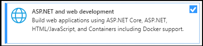

# Compilar aplicaciones con el kit de herramientas de Microsoft Teams y Visual StudioBuild apps with the Teams Toolkit and Visual Studio

El kit de herramientas de Microsoft Teams permite crear aplicaciones de Team personalizadas directamente en el entorno de desarrollo integrado (IDE) de Visual Studio.The Microsoft Teams Toolkit enables you to create custom Teams apps directly within the Visual Studio integrated development environment (IDE). El kit de herramientas de Microsoft Teams le guiará por el proceso y le proporciona todo lo que necesita para crear, depurar e iniciar la aplicación de Teams.The Microsoft Teams toolkit guides you through the process and provides everything you need to build, debug, and launch your Teams app.

## Requisitos previosPrerequisites

1. [Habilitar la vista previa para desarrolladoresEnable developer preview](../resources/dev-preview/developer-preview-intro.md#enable-developer-preview)

1. Asegúrese de que **ASP.neT y el módulo de desarrollo web** se hayan agregado a la instancia de Visual Studio.Make sure that the **ASP.NET and web development module** has been added to your Visual Studio instance. Puede comprobarlo siguiendo los pasos descritos en la documentación sobre [Cómo modificar Visual Studio agregando o quitando cargas de trabajo y componentes](/visualstudio/install/modify-visual-studio?view=vs-2019&preserve-view=true) .You can check by following the steps in the [Modify Visual Studio by adding or removing workloads and component](/visualstudio/install/modify-visual-studio?view=vs-2019&preserve-view=true) documentation.

3. Si desea probar la aplicación mediante su implementación desde Visual Studio, tendrá que tener instalado IIS (Internet Information Services) en el entorno de desarrollo.If you would like test your app by deploy it from Visual Studio, you'll need to have IIS (Internet Information Services) installed in your development environment. Visual Studio no incluye IIS y no se incluye en la configuración predeterminada de Windows 10, Windows 8 o Windows 7; sin embargo, puede descargar la versión más reciente desde el [centro de descarga de Microsoft](https://www.microsoft.com/download/details.aspx?id=48264).Visual Studio does not include IIS and it isn't included in the default Windows 10, Windows 8, or Windows 7 configuration; however, you can download the latest version from the [Microsoft download center](https://www.microsoft.com/download/details.aspx?id=48264).

## Instalar el kit de herramientas de TeamsInstall the Teams Toolkit

El kit de herramientas de Microsoft Teams para Visual Studio está disponible para su descarga desde [Visual Studio Marketplace](https://marketplace.visualstudio.com/items?itemName=TeamsDevApp.vsteamstemplate) o directamente desde el menú **extensiones** de Visual Studio.The Microsoft Teams Toolkit for Visual Studio is available for download from the [Visual Studio Marketplace](https://marketplace.visualstudio.com/items?itemName=TeamsDevApp.vsteamstemplate) or directly from the **Extensions** menu within Visual Studio.

## Uso del kit de herramientasUsing the toolkit

- [Configurar un nuevo proyectoSet up a new project](#set-up-a-new-teams-project)
- [Configurar la aplicaciónConfigure your app](#configure-your-app)
- [Empaquetar la aplicaciónPackage your app](#package-your-app)
- [Ejecutar la aplicación en Microsoft TeamsRun your app in Teams](#install-and-run-your-app-locally)
- [Validar la aplicaciónValidate your app](#validate-your-app)
- [Publicar la aplicaciónPublish your app](#publish-your-app-to-teams)

## Configurar un nuevo proyecto de TeamsSet up a new Teams project

1. Seleccione **crear un nuevo proyecto**.Select **Create a new project**.
1. Elija **aplicación de Microsoft Teams** y seleccione **siguiente**.Choose **Microsoft Teams App** and select **Next**.
1. Llegará a la pantalla **configurar el nuevo proyecto** , donde podrá elegir el **nombre del proyecto**, la **Ubicación** y el nombre de la **solución**.You will arrive at the **Configure your new project** screen where you can choose the **Project name**, **Location**, and **Solution name**.
1. Active la casilla etiquetar la **solución y el proyecto en el mismo directorio**.Check the box labeled **Place solution and project in the same directory**.
1. Una ventana emergente con la etiqueta **Agregar funciones** le permitirá elegir una o más funcionalidades para la configuración del proyecto.A pop-up window labeled **Add Capabilities** will allow you to choose one or more capabilities for your project setup.
1. Seleccione el botón **siguiente** para completar el proceso de configuración.Select the **Next** button to complete the configuration process.
1. Una ventana emergente con la etiqueta **Agregar funciones** le permitirá elegir las propiedades de cada funcionalidad seleccionada.A pop-up window labeled **Add Capabilities** will allow you to choose the properties for each selected capability.
1. Seleccione **Finalizar** y estará en la página de aterrizaje de **Microsoft Teams Toolkit** .Select **Finish** and you will  land on the **Microsoft Teams Toolkit** landing page.

## Configurar la aplicaciónConfigure your app

En esencia, la aplicación de Microsoft Teams adopta tres componentes:At its core, the Teams app embraces three components:

  1. El cliente de Microsoft Teams (Web, escritorio o móvil) donde los usuarios interactúan con la aplicación.The Microsoft Teams client (web, desktop or mobile) where users interact with your app.
  1. Un servidor que responde a las solicitudes de contenido que se mostrarán en Microsoft Teams, por ejemplo, contenido de la ficha HTML o una tarjeta adaptable de bot.A server that responds to requests for content that will be displayed in Teams, e.g., HTML tab content or a bot adaptive card .
  1. Un paquete de la [aplicación](/concepts/build-and-test/apps-package.md) teams que consta de tres archivos:A Teams [app package](/concepts/build-and-test/apps-package.md) consisting of three files:

  > [!div class="checklist"]
  >
  > - La manifest.jsenThe manifest.json
  > - Un [icono de color](../resources/schema/manifest-schema.md#icons) de la aplicación para que se muestre en el catálogo de aplicaciones públicas o de la organizaciónA [color icon](../resources/schema/manifest-schema.md#icons) for your app to display in the public or organization app catalog
 > - Un [icono de esquema](../resources/schema/manifest-schema.md#icons) para mostrar en la barra de actividad de Microsoft Teams.An [outline icon](../resources/schema/manifest-schema.md#icons) for display on the Teams activity bar.

Cuando se instala una aplicación, el cliente de Microsoft Teams analiza el archivo de manifiesto para determinar la información necesaria, como el nombre de la aplicación y la dirección URL en la que se encuentran los servicios.When an app is installed, the Teams client parses the manifest file to determine needed information like the name of your app and the URL where the services are located.

> [!NOTE]
>Si aún no lo ha hecho, tendrá que iniciar sesión en su cuenta de Microsoft 365 o para continuar con el proceso de desarrollo.If you haven't done so already, you will need to sign in to your Microsoft 365  or account to continue with the development process.
>
> Si no tiene una cuenta de 365 de Microsoft, puede registrarse para obtener una suscripción del [programa de desarrolladores de microsoft 365](https://developer.microsoft.com/microsoft-365/dev-program) .If you don't have a Microsoft 365 account, you can sign up for a [Microsoft 365 Developer Program](https://developer.microsoft.com/microsoft-365/dev-program) subscription. Es *gratuita* durante 90 días y se renovará continuamente siempre que la use para la actividad de desarrollo.It's *free* for 90 days and will continually renew as long as you're using it for development activity. Si tiene una suscripción de Visual Studio *Enterprise* o *Professional* , ambos programas incluyen una suscripción gratuita al [desarrollador](https://aka.ms/MyVisualStudioBenefits)de Microsoft 365, activa durante la vida de su suscripción a Visual Studio.If you have a Visual Studio *Enterprise* or *Professional* subscription, both programs include a free Microsoft 365 [developer subscription](https://aka.ms/MyVisualStudioBenefits), active for the life of your Visual Studio subscription. *Consulte* [configurar una suscripción de desarrollador de Microsoft 365](https://docs.microsoft.com/office/developer-program/office-365-developer-program-get-started).*See* [Set up a Microsoft 365 developer subscription](https://docs.microsoft.com/office/developer-program/office-365-developer-program-get-started).
>

### Pasos de la configuración Configuration steps

1. Para configurar la aplicación, en la página de aterrizaje de **Microsoft Teams Toolkit** , seleccione **Editar paquete** de la aplicación.To configure your app, on the **Microsoft Teams Toolkit** landing page, select **Edit app package** .
1. En el menú desplegable **mis entornos** , seleccione **desarrollo**.From the **My Environments** drop-down menu, select **development**.
1. Encontrarás en la página de detalles de la **aplicación** donde puedes editar los campos de propiedades de la aplicación.You will land on the **App details** page where you can edit your app's property fields.
1. Al editar los campos en la página de detalles de la aplicación, se actualiza el contenido del manifest.jsen el archivo que se entregará como parte del paquete de la aplicación.Editing the fields in the App details page updates the contents of the manifest.json file that will ultimately ship as part of the app package. [Más informaciónLearn more](https://aka.ms/teams-toolkit-manifest)

## Empaquetar la aplicaciónPackage your app

Al modificar la página de detalles de la **aplicación** o actualizar el **manifiesto**, o los archivos **. env** en la carpeta  **. Publish** de la aplicación, se generará automáticamente el archivo de **Development.zip** .Modifying the **app details** page or updating the **manifest**, or **.env** files in your app's  **.publish** folder will automatically generate your **Development.zip** file. El archivo de Development.zip incluye tres archivos necesarios: el **manifest.jsen** y [dos iconos](../concepts/build-and-test/apps-package.md#app-icons).The Development.zip file includes three required files — the **manifest.json** and [two icons](../concepts/build-and-test/apps-package.md#app-icons).

## Instalar y ejecutar la aplicación de forma localInstall and run your app locally

1. En el menú desplegable **configuraciones de soluciones** , seleccione **implementar**.From the **Solution Configurations** dropdown menu, select **Deploy**.

2. Seleccione el botón de **ISS Express + Teams** .Select the **ISS Express + Teams** button.

1. Se iniciará Microsoft Teams y el cuadro de diálogo de instalación de la aplicación debería aparecer en el cliente de Microsoft Teams.Teams will launch and the app installation dialogue should appear in the Teams client.

## Validar la aplicaciónValidate your app

La página **validar** permite comprobar el paquete de la aplicación antes de enviar la aplicación a AppSource.The **Validate** page allows you to check your app package before submitting your app to AppSource. Simplemente cargue el paquete del manifiesto y la herramienta de validación comprobará la aplicación en todos los casos de prueba relacionados con el manifiesto.Simply upload the manifest package and the validation tool will check your app against all manifest related test cases. Para cada prueba con errores, la descripción proporciona un vínculo de documentación para ayudarle a corregir el error.For each failed tests, the description provides a documentation link to help you fix the error. Para las pruebas que son difíciles de automatizar, los detalles de la **lista de comprobación preliminar** 7 de los casos de prueba con errores más comunes, así como un vínculo a una lista de comprobación de envío completa.For the tests that are hard to automate, the **Preliminary checklist** details 7 of the most common failed test cases as well as link to a complete submission checklist.

## Publicar la aplicación en TeamsPublish your app to Teams

✔ En la Página principal de su proyecto, puede cargar la aplicación en un equipo, enviar la aplicación a la tienda de aplicaciones personalizada de la empresa para los usuarios de su organización o bien enviar la aplicación al origen de la aplicación para todos los usuarios de Microsoft Teams.✔ On your project home page, you can upload your app to a team, submit your app to your company custom app store for users in your organization, or submit your app to App Source for all Teams users.

✔ El administrador de ti consultará estos envíos.✔ Your IT admin will review these submissions.

✔ Puede volver a la página **publicar** para comprobar el estado del envío y saber si su administrador de ti aprobó o rechazó la aplicación. Aquí también puede ir a enviar actualizaciones a la aplicación o cancelar los envíos actualmente activos.✔  You can return to the **Publish** page to check on your submission status and learn if your app was approved or rejected by your IT admin. This is also where you'll come to submit updates to your app or cancel any currently active submissions.

> [!div class="nextstepaction"]
> [Siguiente paso: mantenimiento y soporte de la aplicación publicadaNext step: Maintaining and supporting your published app](../concepts/deploy-and-publish/appsource/post-publish/overview.md)
>
