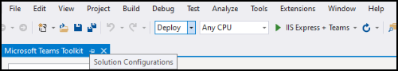

# Crear aplicaciones con Teams Toolkit y Visual Studio

El kit de herramientas de Microsoft Teams le permite crear aplicaciones personalizadas de Teams directamente desde el entorno de desarrollo integrado (IDE) de Visual Studio. El kit de herramientas de Microsoft Teams le orienta en el proceso y le ofrece todo lo que necesita para crear, depurar e iniciar su aplicación de Teams.

## Requisitos previos

1. [Habilitar la vista previa del desarrollador](../resources/dev-preview/developer-preview-intro.md#enable-developer-preview)

1. Asegúrese de que el **ASP.NET y el** módulo de desarrollo web se han agregado a la instancia Visual Studio web. Puede comprobar si sigue los pasos de la página Modificar Visual Studio agregando o quitando cargas [de trabajo y documentación de](/visualstudio/install/modify-visual-studio?view=vs-2019&preserve-view=true) componentes.

3. Si quieres probar la aplicación implementandola desde Visual Studio, tendrás que tener IIS (Internet Information Services) instalado en el entorno de desarrollo. Visual Studio no incluye IIS y no se incluye en la configuración predeterminada de Windows 10, Windows 8 o Windows 7; sin embargo, puede descargar la versión más reciente del Centro [de descarga de Microsoft](https://www.microsoft.com/download/details.aspx?id=48264).

## Instalar el kit de herramientas de Teams

Microsoft Teams Toolkit for Visual Studio está disponible para su descarga desde [Visual Studio Marketplace](https://marketplace.visualstudio.com/items?itemName=TeamsDevApp.vsteamstemplate) o directamente desde el menú **Extensiones** de Visual Studio.

## Uso del kit de herramientas

- [Configurar un nuevo proyecto](#set-up-a-new-teams-project)
- [Configurar la aplicación](#configure-your-app)
- [Empaquetar la aplicación](#package-your-app)
- [Ejecutar la aplicación en Teams](#install-and-run-your-app-locally)
- [Valide su aplicación](#validate-your-app)
- [Publicar la aplicación](#publish-your-app-to-teams)

## Configurar un nuevo proyecto de Teams

1. Seleccione **Crear un nuevo proyecto**.
1. Elija **Microsoft Teams App** y seleccione **Siguiente**.
1. Llegará a la pantalla **Configurar el nuevo** proyecto, donde podrá elegir el nombre del proyecto, **la** ubicación y el nombre de **la solución.** 
1. Active la casilla Colocar solución **y proyecto en el mismo directorio**.
1. Una ventana emergente con la etiqueta **Agregar funcionalidades** le permitirá elegir una o más funciones para la configuración del proyecto.
1. Seleccione el **botón** Siguiente para completar el proceso de configuración.
1. Una ventana emergente con la etiqueta **Agregar funcionalidades** te permitirá elegir las propiedades de cada funcionalidad seleccionada.
1. Selecciona **Finalizar** y llegarás a la página de **aterrizaje de Microsoft Teams Toolkit.**

## Configurar la aplicación

En su núcleo, la aplicación teams abarca tres componentes:

  1. Cliente de Microsoft Teams (web, de escritorio o móvil) donde los usuarios interactúan con la aplicación.
  1. Un servidor que responde a solicitudes de contenido que se mostrarán en Teams, por ejemplo, contenido de pestaña HTML o una tarjeta adaptable de bot.
  1. Un paquete [de aplicación de](/concepts/build-and-test/apps-package.md) Teams que consta de tres archivos:

  > [!div class="checklist"]
  >
  > - El manifest.jsen
  > - Icono [de color para](../resources/schema/manifest-schema.md#icons) que la aplicación se muestre en el catálogo de aplicaciones públicas u de la organización
 > - Icono [de esquema para](../resources/schema/manifest-schema.md#icons) mostrar en la barra de actividades de Teams.

Cuando se instala una aplicación, el cliente de Teams analiza el archivo de manifiesto para determinar la información necesaria, como el nombre de la aplicación y la dirección URL donde se encuentran los servicios.

> [!NOTE]
>Si aún no lo ha hecho, tendrá que iniciar sesión en su cuenta o microsoft 365 para continuar con el proceso de desarrollo.
>
> Si no tienes una cuenta de Microsoft 365, puedes suscribirte a una suscripción al Programa para desarrolladores de [Microsoft 365.](https://developer.microsoft.com/microsoft-365/dev-program) Es gratuito *durante* 90 días y se renovará continuamente siempre que lo use para la actividad de desarrollo. Si tiene una suscripción a Visual Studio *Enterprise* o *Professional,* ambos programas incluyen una suscripción gratuita de desarrollador de Microsoft 365, activa durante la vida de su Visual Studio suscripción.  *Consulta* [Configurar una suscripción para desarrolladores de Microsoft 365](https://docs.microsoft.com/office/developer-program/office-365-developer-program-get-started).
>

### Pasos de la configuración 

1. Para configurar la aplicación, en la página de aterrizaje de **Microsoft Teams Toolkit,** seleccione **Editar paquete de aplicación.**
1. En el menú desplegable Mis **entornos,** seleccione **desarrollo**.
1. Llegarás a la página de detalles **de la aplicación** donde puedes editar los campos de propiedad de la aplicación.
1. La edición de los campos de la página detalles de la aplicación actualiza el contenido del archivo manifest.jsen que, en última instancia, se enviará como parte del paquete de la aplicación. [Más información](https://aka.ms/teams-toolkit-manifest)

## Empaquetar la aplicación

Al modificar la página de **detalles de** la aplicación o actualizar el manifiesto **o** los archivos **.env** de la carpeta  **.publish** de la aplicación, se generará automáticamente el **Development.zip** archivo. El Development.zip incluye tres archivos necesarios: **elmanifest.jsy** dos [iconos.](../concepts/build-and-test/apps-package.md#app-icons)

## Instalar y ejecutar la aplicación localmente

1. En el **menú desplegable Configuraciones de solución,** seleccione **Implementar**.

2. Seleccione el **botón IIS Express + Teams.**

1. Teams se iniciará y el diálogo de instalación de la aplicación debe aparecer en el cliente de Teams.

## Valide su aplicación

La **página Validar** te permite comprobar el paquete de la aplicación antes de enviar la aplicación a AppSource. Simplemente cargue el paquete de manifiesto y la herramienta de validación comprobará la aplicación en todos los casos de prueba relacionados con el manifiesto. Para cada prueba con errores, la descripción proporciona un vínculo de documentación que le ayudará a corregir el error. Para las pruebas difíciles de automatizar, la lista de comprobación **preliminar** detalla 7 de los casos de prueba con errores más comunes, así como un vínculo a una lista de comprobación de envío completa.

## Publicar la aplicación en Teams

✔ En la página principal del proyecto, puedes cargar la aplicación en un equipo, enviar la aplicación a la tienda de aplicaciones personalizada de la empresa para los usuarios de tu organización o enviar la aplicación a App Source para todos los usuarios de Teams.

✔ El administrador de TI revisará estos envíos.

✔ Puedes volver a la  página Publicar para comprobar el estado del envío y saber si tu administrador de TI aprobó o rechazó la aplicación. Aquí es también donde llegarás a enviar actualizaciones a tu aplicación o cancelar cualquier envío activo actualmente.

> [!div class="nextstepaction"]
> [Paso siguiente: Mantener y admitir la aplicación publicada](../concepts/deploy-and-publish/appsource/post-publish/overview.md)
>
